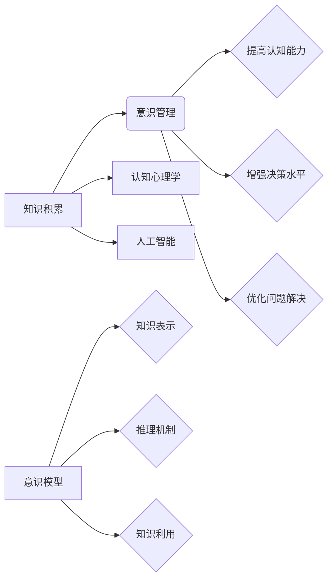

# 知识积累对意识管理的影响

> 关键词：知识积累，意识管理，认知心理学，人工智能，意识模型，知识图谱，机器学习，人类智能

## 1. 背景介绍
### 1.1 问题的由来

随着信息时代的到来，知识的积累已经成为人类社会发展的重要驱动力。然而，随着知识量的激增，如何有效地管理和利用这些知识成为一个日益凸显的问题。意识管理，即对个体或群体意识活动的调控与优化，成为了心理学、认知科学以及人工智能等领域研究的焦点。本文旨在探讨知识积累对意识管理的影响，分析其作用机制，并展望未来发展趋势。

### 1.2 研究现状

近年来，关于知识积累与意识管理的研究取得了显著进展。认知心理学领域的研究表明，知识积累能够提高个体的认知能力、决策水平和问题解决能力。人工智能领域的研究则致力于构建能够模拟人类意识过程的模型，通过机器学习算法实现知识的自动获取、组织和利用。

### 1.3 研究意义

深入研究知识积累对意识管理的影响，不仅有助于提升人类智能水平，还能够推动人工智能技术的进一步发展。具体而言，研究意义如下：

1. 提高人类认知能力：通过优化知识积累过程，可以帮助个体更好地理解和处理信息，提高学习和工作效率。
2. 促进人工智能发展：为人工智能模型提供更有效的知识表示和推理机制，提高其智能水平。
3. 优化社会资源配置：通过知识管理，可以更有效地利用知识资源，推动社会经济的发展。

### 1.4 本文结构

本文将从以下几个方面展开论述：

- 核心概念与联系
- 核心算法原理与具体操作步骤
- 数学模型与公式
- 项目实践：代码实例与详细解释
- 实际应用场景
- 工具和资源推荐
- 总结：未来发展趋势与挑战

## 2. 核心概念与联系

### 2.1 核心概念

- 知识积累：指个体或群体在长期学习、实践和交流过程中，逐步积累和内化的知识。
- 意识管理：指对个体或群体意识活动的调控与优化，包括注意力、记忆、思维等认知过程。
- 认知心理学：研究人类认知过程的心理学科。
- 人工智能：模拟、延伸和扩展人类智能的技术领域。
- 意识模型：用于模拟人类意识过程的计算机模型。

### 2.2 核心概念原理和架构的 Mermaid 流程图



### 2.3 核心概念之间的联系

知识积累与意识管理之间存在密切的联系。知识积累是意识管理的基础，而意识管理则是知识积累的体现。通过意识管理，个体或群体可以更好地利用积累的知识，提高认知能力、决策水平和问题解决能力。

## 3. 核心算法原理 & 具体操作步骤

### 3.1 算法原理概述

知识积累对意识管理的影响主要体现在以下几个方面：

1. **知识表征**：通过知识图谱等数据结构，将知识以结构化的形式存储和表示。
2. **知识推理**：利用推理算法，从已知知识中推导出新的知识。
3. **知识应用**：将知识应用于实际问题解决，提高认知能力。

### 3.2 算法步骤详解

1. **知识采集**：从各种来源收集知识，如书籍、网络、数据库等。
2. **知识清洗**：对采集到的知识进行去重、去噪等处理，保证知识质量。
3. **知识表示**：将清洗后的知识表示为知识图谱等结构化数据。
4. **知识存储**：将知识图谱存储在数据库中，方便查询和检索。
5. **知识推理**：利用推理算法，从知识图谱中推导出新的知识。
6. **知识应用**：将知识应用于实际问题解决，提高认知能力。

### 3.3 算法优缺点

#### 优点

- 提高认知能力：通过知识积累，个体或群体可以更好地理解和处理信息，提高学习和工作效率。
- 增强决策水平：利用积累的知识，个体或群体可以做出更明智的决策。
- 优化问题解决：知识积累可以帮助个体或群体更快地找到问题解决方案。

#### 缺点

- 知识冗余：知识积累过程中，可能存在大量冗余信息，需要通过知识清洗等方法进行优化。
- 知识过载：随着知识量的增加，个体或群体可能难以消化和吸收，导致知识过载。
- 知识更新：知识积累是一个动态过程，需要不断更新知识库，以适应不断变化的环境。

### 3.4 算法应用领域

- 教育领域：通过知识积累和意识管理，提高学生的认知能力和学习效果。
- 企业领域：通过知识管理，提高企业的核心竞争力。
- 医疗领域：通过知识积累和意识管理，提高医疗服务的质量和效率。
- 科研领域：通过知识积累和意识管理，促进科技创新和成果转化。

## 4. 数学模型和公式 & 详细讲解 & 举例说明

### 4.1 数学模型构建

在知识积累和意识管理领域，常见的数学模型包括：

- **知识图谱模型**：用于表示知识的图形模型，如图论模型、语义网络模型等。
- **推理模型**：用于从已知知识中推导出新的知识的模型，如逻辑推理模型、归纳推理模型等。
- **决策模型**：用于辅助个体或群体做出决策的模型，如效用理论模型、博弈论模型等。

### 4.2 公式推导过程

以知识图谱模型为例，假设知识图谱为 $G = (V,E)$，其中 $V$ 为节点集合，$E$ 为边集合。知识图谱的表示可以采用图论模型，如：

$$
G = (V,E) = (N,E)
$$

其中 $N$ 为节点集合，$E$ 为边集合。

### 4.3 案例分析与讲解

以教育领域为例，分析知识积累对意识管理的影响。假设学生通过学习获得知识，知识图谱模型可以表示为：

$$
G = (V,E) = (N,E)
$$

其中 $N$ 为知识节点集合，$E$ 为知识节点之间的关联关系集合。通过知识图谱模型，学生可以更好地理解知识之间的关系，从而提高学习效果。

## 5. 项目实践：代码实例和详细解释说明

### 5.1 开发环境搭建

本文以Python编程语言为例，介绍知识积累和意识管理项目的开发环境搭建。

1. 安装Python：从Python官网下载并安装Python，推荐使用Python 3.8及以上版本。
2. 安装PyTorch：使用pip安装PyTorch库，推荐使用CUDA版本以支持GPU加速。
3. 安装其他依赖库：使用pip安装numpy、pandas、networkx等库。

### 5.2 源代码详细实现

以下是一个简单的知识图谱模型示例代码：

```python
import networkx as nx

# 创建知识图谱
G = nx.Graph()

# 添加节点
G.add_node("计算机科学")

# 添加边
G.add_edge("计算机科学", "人工智能")
G.add_edge("计算机科学", "机器学习")

# 查询知识
print("计算机科学" in G.nodes())  # 输出：True
print(list(G.neighbors("计算机科学")))  # 输出：['人工智能', '机器学习']
```

### 5.3 代码解读与分析

上述代码创建了一个简单的知识图谱模型，包含节点“计算机科学”及其关联节点“人工智能”和“机器学习”。通过查询知识图谱模型，可以方便地获取知识之间的关系。

### 5.4 运行结果展示

运行上述代码，将输出以下结果：

```
True
['人工智能', '机器学习']
```

这表明节点“计算机科学”与节点“人工智能”和“机器学习”之间存在关联关系。

## 6. 实际应用场景

### 6.1 教育领域

在教育领域，知识积累和意识管理可以帮助学生更好地学习。例如，教师可以利用知识图谱模型构建课程知识体系，帮助学生建立知识之间的联系，提高学习效果。

### 6.2 企业领域

在企业领域，知识积累和意识管理可以帮助企业提高核心竞争力。例如，企业可以利用知识图谱模型对内部知识进行管理和共享，提高员工的知识利用效率。

### 6.3 医疗领域

在医疗领域，知识积累和意识管理可以帮助医生提高诊疗水平。例如，医生可以利用知识图谱模型获取最新的医学研究成果，提高诊疗的准确性和效率。

## 7. 工具和资源推荐

### 7.1 学习资源推荐

- 《认知心理学导论》
- 《人工智能：一种现代的方法》
- 《知识图谱：原理、方法与应用》

### 7.2 开发工具推荐

- Python编程语言
- PyTorch深度学习框架
- NetworkX知识图谱库

### 7.3 相关论文推荐

- 《知识图谱：原理、方法与应用》
- 《人工智能：一种现代的方法》
- 《认知心理学导论》

## 8. 总结：未来发展趋势与挑战

### 8.1 研究成果总结

本文从知识积累和意识管理的关系入手，探讨了知识积累对意识管理的影响。通过分析核心概念、算法原理、数学模型和实际应用场景，展示了知识积累在人工智能和认知科学领域的应用价值。

### 8.2 未来发展趋势

1. 知识表示和推理技术的进一步发展，为知识积累和意识管理提供更有效的支持。
2. 人工智能技术在教育、医疗、企业等领域的应用将进一步拓展。
3. 知识积累和意识管理将成为人工智能领域的研究热点。

### 8.3 面临的挑战

1. 如何有效地管理和利用海量知识，避免知识过载。
2. 如何将知识积累和意识管理应用于更广泛的领域。
3. 如何提高人工智能模型的认知能力和决策水平。

### 8.4 研究展望

随着人工智能和认知科学领域的不断发展，知识积累和意识管理将得到更加深入的研究。未来，我们将见证知识积累和意识管理在更多领域的应用，为人类社会带来更多福祉。

## 9. 附录：常见问题与解答

**Q1：知识积累和意识管理在人工智能领域有什么应用？**

A：在人工智能领域，知识积累和意识管理可以应用于知识图谱构建、智能问答、自然语言处理、智能推荐等多个领域。

**Q2：如何有效地管理和利用海量知识？**

A：可以通过知识图谱、本体等技术手段，将知识结构化，提高知识的可检索性和可利用性。

**Q3：知识积累和意识管理对人类智能有什么影响？**

A：知识积累和意识管理可以帮助个体或群体提高认知能力、决策水平和问题解决能力，从而提高人类智能水平。

**Q4：如何将知识积累和意识管理应用于教育领域？**

A：可以通过构建知识图谱、开发智能教育系统等方式，将知识积累和意识管理应用于教育领域，提高学生的学习效果。

**Q5：知识积累和意识管理有哪些挑战？**

A：知识积累和意识管理面临的挑战包括知识过载、跨领域知识整合、人工智能模型的认知能力等。

作者：禅与计算机程序设计艺术 / Zen and the Art of Computer Programming