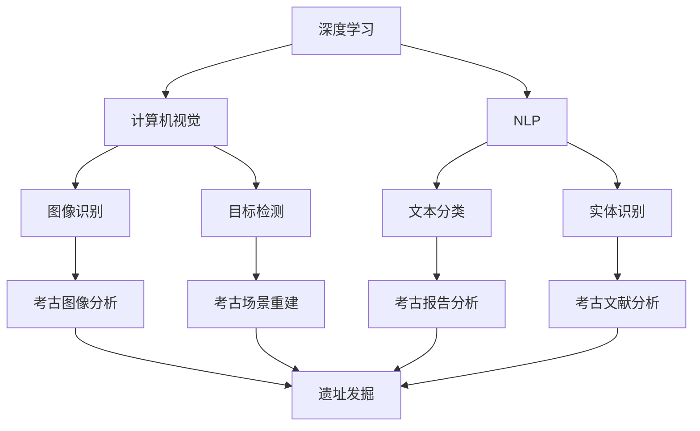
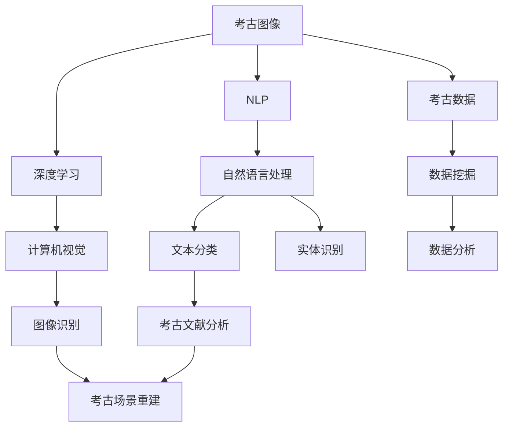
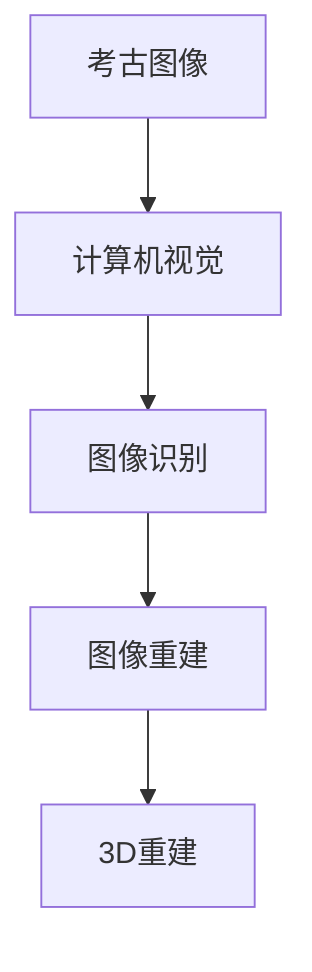
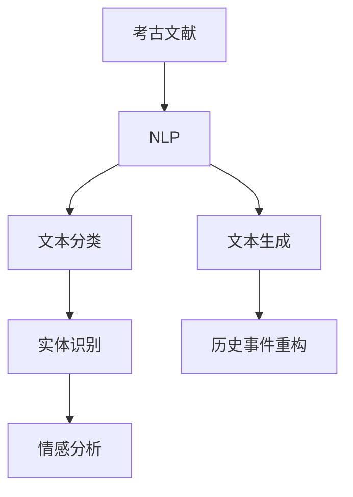
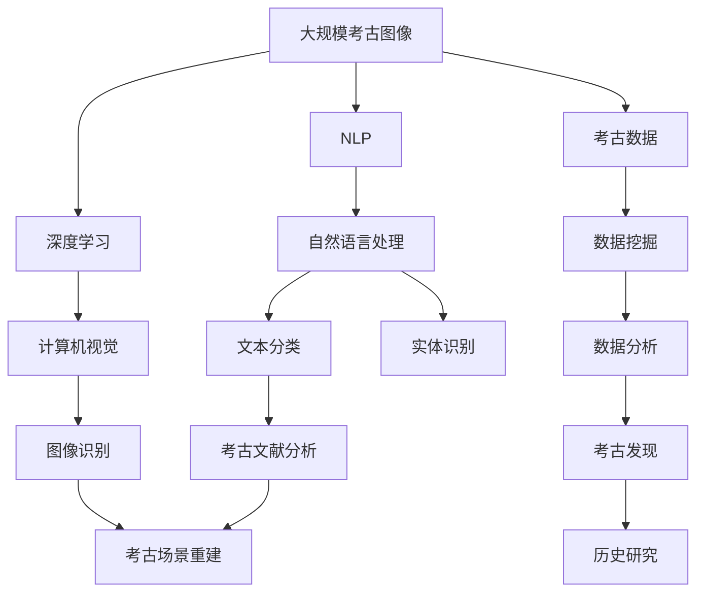
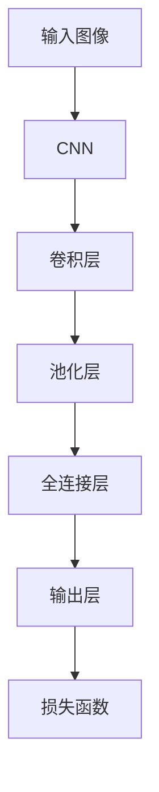
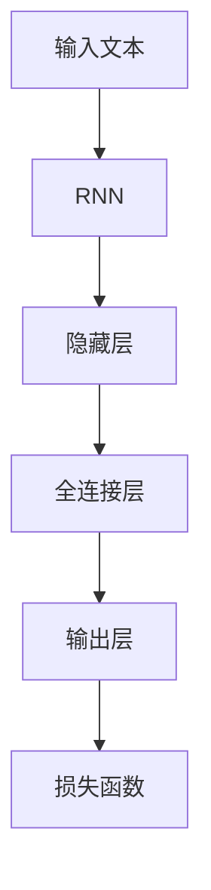
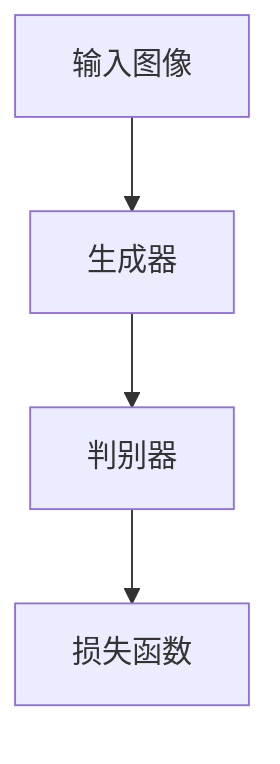
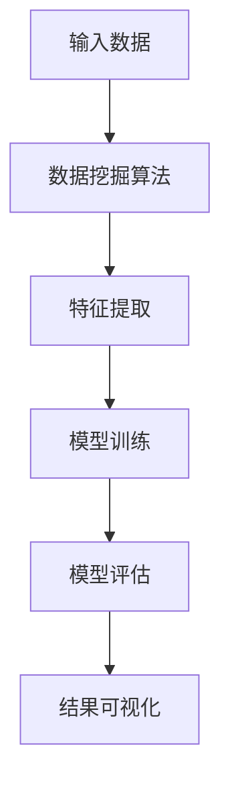

                 

# AI在考古学中的应用:加速历史研究

> 关键词：AI, 考古学, 历史研究, 图像识别, 数据分析, 3D重建, 自然语言处理(NLP)

## 1. 背景介绍

### 1.1 问题由来

考古学作为一门研究人类历史和文化的科学，其核心任务包括遗址发掘、文物鉴定、历史重构等。传统的考古研究方法包括现场勘探、文物采集、手工标注等，工作量大且效率低下。近年来，随着人工智能（AI）技术的快速发展，AI在考古学中的应用日益受到关注，成为推动考古学研究进步的重要力量。

AI技术在考古学中的应用不仅能够提高研究的效率和精度，还能带来新的视角和方法，为考古学的发展注入新的活力。通过AI技术，考古学家可以更准确地进行遗址识别、文物分类、历史背景分析等，加速历史研究进程，挖掘和保护人类文化遗产。

### 1.2 问题核心关键点

AI在考古学中的应用主要体现在以下几个方面：

- **图像识别**：利用深度学习技术对考古现场的图像进行分析和标注，自动识别人类遗迹、动物化石等重要信息。
- **数据分析**：通过机器学习对考古数据进行分类、聚类、回归分析等，发现历史变迁的规律和趋势。
- **3D重建**：使用深度生成模型对考古遗址进行数字化重建，帮助考古学家更好地理解历史场景。
- **自然语言处理(NLP)**：通过文本分析技术解析考古报告和文献，提取有价值的历史信息。

这些技术的应用，不仅大幅提高了考古工作的效率，还使得考古数据能够更加容易地被理解和共享，为历史研究提供了强有力的支持。

### 1.3 问题研究意义

AI在考古学中的应用，对于推动历史研究的深入具有重要意义：

1. **提高效率**：AI可以快速处理大量考古数据，缩短考古工作的时间，降低人力成本。
2. **提升精度**：AI的图像识别和数据分析能力，能够更准确地发现和分析考古信息，减少人为误差。
3. **创新方法**：AI技术为考古学带来了新的研究方法和视角，有助于发现传统方法难以触及的领域。
4. **知识共享**：AI使得考古数据更易于数字化和共享，促进跨学科合作和知识传播。
5. **文化保护**：通过AI技术，可以对考古遗址进行数字化保护，防止自然和人为的破坏。

## 2. 核心概念与联系

### 2.1 核心概念概述

为了更好地理解AI在考古学中的应用，本节将介绍几个密切相关的核心概念：

- **深度学习（Deep Learning）**：一种基于神经网络的机器学习方法，能够通过多层次的非线性映射来处理复杂的模式识别问题。深度学习在图像识别、自然语言处理等领域有广泛应用。

- **计算机视觉（Computer Vision）**：涉及如何让计算机“看”的能力，包括图像分类、目标检测、语义分割等。计算机视觉技术在考古图像分析中发挥了重要作用。

- **自然语言处理（Natural Language Processing, NLP）**：让计算机理解和处理人类语言的技术，包括文本分类、实体识别、情感分析等。NLP技术在考古文献分析中提供了有力支持。

- **3D重建（3D Reconstruction）**：通过计算机视觉和深度生成模型，对考古遗址进行数字化重建，以三维形式展示历史场景。

- **数据挖掘（Data Mining）**：从大量数据中提取有价值的信息，用于数据分析和模型训练。数据挖掘技术在考古数据分析中应用广泛。

这些核心概念之间的逻辑关系可以通过以下Mermaid流程图来展示：



这个流程图展示了大语言模型的核心概念及其之间的关系：

1. 深度学习为计算机视觉、自然语言处理等提供底层技术支持。
2. 计算机视觉技术通过对考古图像的识别和分析，帮助考古学家发现和定位重要遗迹。
3. 自然语言处理技术解析考古文献和报告，提取有价值的历史信息。
4. 3D重建技术通过计算机视觉和深度生成模型，对考古遗址进行数字化重建。
5. 数据挖掘技术用于考古数据的分类、聚类、回归分析等，发现历史变迁的规律和趋势。

这些概念共同构成了AI在考古学中的应用框架，使得考古学家能够更高效、精准地进行历史研究。

### 2.2 概念间的关系

这些核心概念之间存在着紧密的联系，形成了AI在考古学中的应用生态系统。下面我通过几个Mermaid流程图来展示这些概念之间的关系。

#### 2.2.1 AI在考古学中的应用框架



这个流程图展示了AI在考古学中的应用框架，包括图像识别、文本分析、场景重建和数据分析等多个环节。

#### 2.2.2 图像识别与3D重建的关系



这个流程图展示了图像识别与3D重建的关系，即通过图像识别技术自动提取考古现场的信息，然后通过深度生成模型进行三维重建。

#### 2.2.3 NLP在考古文献中的应用



这个流程图展示了NLP在考古文献中的应用，包括文本分类、实体识别、情感分析和文本生成等。

### 2.3 核心概念的整体架构

最后，我们用一个综合的流程图来展示这些核心概念在大语言模型微调过程中的整体架构：



这个综合流程图展示了从考古图像、文献到历史研究的完整过程，包括了深度学习、计算机视觉、自然语言处理、3D重建、数据挖掘等多个环节。通过这些核心概念的紧密结合，考古学家能够更高效、精准地进行历史研究。

## 3. 核心算法原理 & 具体操作步骤
### 3.1 算法原理概述

AI在考古学中的应用，主要通过深度学习、计算机视觉、自然语言处理等技术实现。其核心思想是：利用AI技术对考古数据进行处理和分析，提取有价值的历史信息，辅助考古学家进行遗址发掘、文物鉴定、历史重构等任务。

具体来说，AI在考古学中的应用包括以下几个关键步骤：

1. **数据收集与预处理**：收集考古现场的图像、文献等数据，并进行清洗、标注等预处理。
2. **模型训练**：利用深度学习、计算机视觉等技术对数据进行训练，构建图像识别、文本分类等模型。
3. **模型评估与调优**：对训练好的模型进行评估和调优，确保其在考古场景中的应用效果。
4. **模型应用**：将训练好的模型应用于考古现场，进行遗址识别、文物分类、历史重构等任务。
5. **数据可视化与报告生成**：利用可视化技术将考古结果呈现出来，生成详细的考古报告。

### 3.2 算法步骤详解

以下是AI在考古学中应用的详细操作步骤：

#### 3.2.1 数据收集与预处理

**Step 1: 数据收集**
考古学家需要收集大量的考古图像、文献等数据。这些数据可以通过现场勘探、数字档案馆等渠道获取。

**Step 2: 数据标注**
考古数据需要进行标注，以便训练机器学习模型。标注工作需要考古学家的专业知识，包括遗址位置、文物类型、历史时期等信息。

**Step 3: 数据清洗**
考古数据可能存在噪声和缺失，需要进行清洗和预处理，如去除无关信息、填补缺失值等。

**Step 4: 数据增强**
为提高模型的泛化能力，可以通过数据增强技术扩充训练集，如对图像进行旋转、缩放等操作。

#### 3.2.2 模型训练

**Step 1: 选择模型**
根据考古任务的性质，选择合适的深度学习模型，如卷积神经网络（CNN）、循环神经网络（RNN）、Transformer等。

**Step 2: 模型构建**
使用深度学习框架（如TensorFlow、PyTorch）构建模型，并进行参数初始化。

**Step 3: 模型训练**
将预处理好的数据输入模型，使用梯度下降等优化算法进行训练。在训练过程中，需要选择合适的损失函数和优化器。

**Step 4: 模型调优**
根据模型的评估结果，对模型进行调优，如调整学习率、增加正则化项等。

#### 3.2.3 模型评估与调优

**Step 1: 模型评估**
使用测试集对训练好的模型进行评估，评估指标包括准确率、召回率、F1分数等。

**Step 2: 调优**
根据模型评估结果，对模型进行调优，如增加训练轮数、调整模型架构等。

#### 3.2.4 模型应用

**Step 1: 现场数据采集**
在考古现场采集数据，包括考古图像、文献等。

**Step 2: 数据预处理**
将采集到的数据进行预处理，如去除噪声、调整尺寸等。

**Step 3: 模型推理**
将预处理好的数据输入训练好的模型，进行图像识别、文本分类等推理任务。

#### 3.2.5 数据可视化与报告生成

**Step 1: 结果可视化**
利用可视化技术将模型推理结果呈现出来，如绘制图像、生成图表等。

**Step 2: 报告生成**
根据模型推理结果，生成详细的考古报告，包括遗址发掘、文物鉴定、历史重构等。

### 3.3 算法优缺点

AI在考古学中的应用具有以下优点：

- **提高效率**：AI能够自动化处理大量考古数据，减少人力成本和时间。
- **提升精度**：AI的图像识别和数据分析能力，能够更准确地发现和分析考古信息，减少人为误差。
- **创新方法**：AI技术为考古学带来了新的研究方法和视角，有助于发现传统方法难以触及的领域。
- **知识共享**：AI使得考古数据更易于数字化和共享，促进跨学科合作和知识传播。

然而，AI在考古学中的应用也存在一些缺点：

- **数据依赖**：AI的效果很大程度上依赖于标注数据的质量和数量，获取高质量标注数据的成本较高。
- **模型偏见**：AI模型可能存在偏见，如性别偏见、种族偏见等，需要在使用前进行校验和纠正。
- **模型可解释性**：AI模型的内部工作机制往往较为复杂，难以解释其推理逻辑和决策过程。
- **硬件需求**：AI模型的训练和推理需要高性能计算资源，如GPU、TPU等，硬件成本较高。

尽管存在这些缺点，但AI在考古学中的应用已经取得了显著的成果，显示出巨大的潜力。未来，随着技术的不断进步和硬件资源的普及，这些缺点有望得到进一步改善。

### 3.4 算法应用领域

AI在考古学中的应用广泛，涵盖了多个领域，具体如下：

1. **遗址发掘与考古图像识别**：利用计算机视觉技术对考古图像进行分析和标注，自动识别人类遗迹、动物化石等重要信息。
2. **文物鉴定与分类**：使用深度学习模型对考古文物进行分类和鉴定，识别文物类型和年代等信息。
3. **历史重构与文献分析**：利用自然语言处理技术解析考古文献和报告，提取有价值的历史信息，辅助历史重构。
4. **3D重建与虚拟考古**：通过深度生成模型对考古遗址进行数字化重建，提供虚拟考古体验，帮助考古学家更好地理解历史场景。
5. **数据挖掘与数据分析**：使用数据挖掘技术对考古数据进行分类、聚类、回归分析等，发现历史变迁的规律和趋势。

这些应用领域的结合，使得AI在考古学中的应用变得更加全面和深入，为考古学研究提供了强有力的支持。

## 4. 数学模型和公式 & 详细讲解 & 举例说明

### 4.1 数学模型构建

以下是对AI在考古学中的应用进行数学模型构建的详细介绍：

#### 4.1.1 图像识别

**数学模型**：

图像识别模型通常使用卷积神经网络（CNN），其基本结构如图1所示。



**公式推导**：

假设输入图像为 $x$，模型输出为 $y$，损失函数为 $L(y,t)$，其中 $t$ 为真实标签。

**公式推导**：

$$
L(y,t) = \frac{1}{N} \sum_{i=1}^N (y_i - t_i)^2
$$

**公式推导**：

其中 $N$ 为样本数量，$y_i$ 为模型输出，$t_i$ 为真实标签。损失函数采用均方误差（MSE）。

#### 4.1.2 文本分类

**数学模型**：

文本分类模型通常使用循环神经网络（RNN）或Transformer，其基本结构如图2所示。



**公式推导**：

假设输入文本为 $x$，模型输出为 $y$，损失函数为 $L(y,t)$，其中 $t$ 为真实标签。

**公式推导**：

$$
L(y,t) = \frac{1}{N} \sum_{i=1}^N -\log(y_i)
$$

**公式推导**：

其中 $N$ 为样本数量，$y_i$ 为模型输出，$t_i$ 为真实标签。损失函数采用交叉熵（Cross Entropy）。

#### 4.1.3 3D重建

**数学模型**：

3D重建模型通常使用深度生成模型，如生成对抗网络（GAN）或变分自编码器（VAE），其基本结构如图3所示。



**公式推导**：

假设输入图像为 $x$，生成器输出为 $G(x)$，判别器输出为 $D(G(x))$，损失函数为 $L(G,D)$。

**公式推导**：

$$
L(G,D) = E_{x \sim p(x)} \log D(G(x)) + E_{z \sim p(z)} \log (1 - D(G(z)))
$$

**公式推导**：

其中 $E$ 表示期望，$p(z)$ 表示生成器的输入噪声分布，$z$ 为输入噪声向量。损失函数采用对抗损失（Adversarial Loss）。

#### 4.1.4 数据挖掘

**数学模型**：

数据挖掘模型通常使用分类、聚类、回归等机器学习算法，其基本结构如图4所示。



**公式推导**：

假设输入数据为 $x$，模型输出为 $y$，损失函数为 $L(y,t)$，其中 $t$ 为真实标签。

**公式推导**：

$$
L(y,t) = \frac{1}{N} \sum_{i=1}^N (y_i - t_i)^2
$$

**公式推导**：

其中 $N$ 为样本数量，$y_i$ 为模型输出，$t_i$ 为真实标签。损失函数采用均方误差（MSE）。

### 4.2 公式推导过程

以下是AI在考古学中的应用进行数学公式推导的详细介绍：

#### 4.2.1 图像识别

**公式推导**：

假设输入图像为 $x$，模型输出为 $y$，损失函数为 $L(y,t)$，其中 $t$ 为真实标签。

**公式推导**：

$$
L(y,t) = \frac{1}{N} \sum_{i=1}^N (y_i - t_i)^2
$$

**公式推导**：

其中 $N$ 为样本数量，$y_i$ 为模型输出，$t_i$ 为真实标签。损失函数采用均方误差（MSE）。

#### 4.2.2 文本分类

**公式推导**：

假设输入文本为 $x$，模型输出为 $y$，损失函数为 $L(y,t)$，其中 $t$ 为真实标签。

**公式推导**：

$$
L(y,t) = \frac{1}{N} \sum_{i=1}^N -\log(y_i)
$$

**公式推导**：

其中 $N$ 为样本数量，$y_i$ 为模型输出，$t_i$ 为真实标签。损失函数采用交叉熵（Cross Entropy）。

#### 4.2.3 3D重建

**公式推导**：

假设输入图像为 $x$，生成器输出为 $G(x)$，判别器输出为 $D(G(x))$，损失函数为 $L(G,D)$。

**公式推导**：

$$
L(G,D) = E_{x \sim p(x)} \log D(G(x)) + E_{z \sim p(z)} \log (1 - D(G(z)))
$$

**公式推导**：

其中 $E$ 表示期望，$p(z)$ 表示生成器的输入噪声分布，$z$ 为输入噪声向量。损失函数采用对抗损失（Adversarial Loss）。

#### 4.2.4 数据挖掘

**公式推导**：

假设输入数据为 $x$，模型输出为 $y$，损失函数为 $L(y,t)$，其中 $t$ 为真实标签。

**公式推导**：

$$
L(y,t) = \frac{1}{N} \sum_{i=1}^N (y_i - t_i)^2
$$

**公式推导**：

其中 $N$ 为样本数量，$y_i$ 为模型输出，$t_i$ 为真实标签。损失函数采用均方误差（MSE）。

### 4.3 案例分析与讲解

以下是对AI在考古学中的应用进行案例分析与讲解的详细介绍：

#### 4.3.1 遗址发掘与考古图像识别

**案例**：

某考古队使用AI技术对一处古代遗址进行发掘和分析。

**分析**：

1. 收集遗址图像，标注考古遗迹位置、形状等重要信息。
2. 使用卷积神经网络（CNN）对图像进行训练，自动识别人类遗迹、动物化石等重要信息。
3. 模型输出与标注信息进行比较，优化模型参数。
4. 在遗址现场采集图像，输入训练好的模型，进行遗址发掘和分析。

#### 4.3.2 文物鉴定与分类

**案例**：

某博物馆使用AI技术对一批古代文物进行鉴定和分类。

**分析**：

1. 收集文物图像，标注文物类型、年代等信息。
2. 使用深度学习模型对文物图像进行训练，自动分类和鉴定文物类型、年代等信息。
3. 模型输出与标注信息进行比较，优化模型参数。
4. 在博物馆中展示文物，提供AI辅助鉴定服务，提升文物展示效果。

#### 4.3.3 历史重构与文献分析

**案例**：

某历史研究机构使用AI技术解析古代文献，辅助历史重构。

**分析**：

1. 收集古代文献，标注文本类型、作者、时期等信息。
2. 使用自然语言处理技术对文本进行分类、实体识别、情感分析等，提取有价值的历史信息。
3. 模型输出与标注信息进行比较，优化模型参数。
4. 利用历史信息进行历史重构，生成详细的历史报告。

#### 4.3.4 3D重建与虚拟考古

**案例**：

某考古团队使用AI技术对古代遗址进行数字化重建，提供虚拟考古体验。

**分析**：

1. 收集遗址图像，标注建筑结构、文物等信息。
2. 使用深度生成模型对遗址进行3D重建，生成虚拟考古场景。
3. 利用虚拟考古场景进行历史研究，提供虚拟考古体验。

## 5. 项目实践：代码实例和详细解释说明

### 5.1 开发环境搭建

在进行AI在考古学中的应用实践前，我们需要准备好开发环境。以下是使用Python进行TensorFlow开发的环境配置流程：

1. 安装Anaconda：从官网下载并安装Anaconda，用于创建独立的Python环境。

2. 创建并激活虚拟环境：
```bash
conda create -n ai-archaeology python=3.8 
conda activate ai-archaeology
```

3. 安装TensorFlow：根据CUDA版本，从官网获取对应的安装命令。例如：
```bash
conda install tensorflow -c tensorflow -c conda-forge
```

4. 安装TensorBoard：
```bash
pip install tensorboard
```

5. 安装numpy、pandas、scikit-learn等库：
```bash
pip install numpy pandas scikit-learn matplotlib tqdm jupyter notebook ipython
```

完成上述步骤后，即可在`ai-archaeology`环境中开始AI在考古学中的应用实践。

### 5.2 源代码详细实现

这里我们以图像识别为例，给出使用TensorFlow进行卷积神经网络（CNN）训练的PyTorch代码实现。

首先，定义图像识别模型：

```python
import tensorflow as tf
from tensorflow.keras import layers

model = tf.keras.Sequential([
    layers.Conv2D(32, (3, 3), activation='relu', input_shape=(32, 32, 3)),
    layers.MaxPooling2D((2, 2)),
    layers.Conv2D(64, (3, 3), activation='relu'),
    layers.MaxPooling2D((2, 2)),
    layers.Flatten(),
    layers.Dense(64, activation='relu'),
    layers.Dense(10, activation='softmax')
])
```

然后，定义数据集：

```python
import tensorflow as tf
import numpy as np
import os
import cv2

train_dir = 'train/'
test_dir = 'test/'

class ImageDataGenerator(tf.keras.preprocessing.image.ImageDataGenerator):
    def __init__(self, path):
        super(ImageDataGenerator, self).__init__()
        self.path = path

    def __getitem__(self, index):
        img_path = os.path.join(self.path, index + '.jpg')
        img = cv2.imread(img_path)
        img = cv2.resize(img, (32, 32))
        img = img / 255.0
        return img, np.array([int(os.path.splitext(os.path.basename(img_path))[0])])

train_generator = ImageDataGenerator(train_dir)
test_generator = ImageDataGenerator(test_dir)
```

接着，定义训练和评估函数：

```python
import tensorflow as tf
import matplotlib.pyplot as plt

model.compile(optimizer=tf.keras.optimizers.Adam(learning_rate=0.001),
              loss=tf.keras.losses.SparseCategoricalCrossentropy(from_logits=True),
              metrics=['accuracy'])

epochs = 10
steps_per_epoch = len(train_generator)
validation_steps = len(test_generator)

for epoch in range(epochs):
    train_loss, train_acc = model.train_on_batch(train_generator, steps_per_epoch)
    test_loss, test_acc = model.evaluate(test_generator, steps_per_epoch)
    print(f'Epoch {epoch+1}, Train Loss: {train_loss:.4f}, Train Acc: {train_acc:.4f}, Test Loss: {test_loss:.4f}, Test Acc: {test_acc:.4f}')

plt.plot(range(epochs), train_loss)
plt.plot(range(epochs), train_acc)
plt.plot(range(epochs), test_loss)
plt.plot(range(epochs), test_acc)
plt.legend(['Train Loss', 'Train Acc', 'Test Loss', 'Test Acc'])
plt.show()
```

最后，启动训练流程并在测试集上评估：

```python


