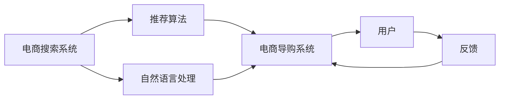
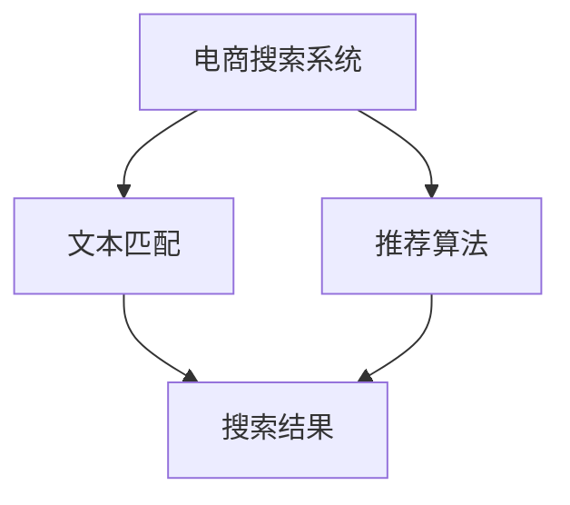
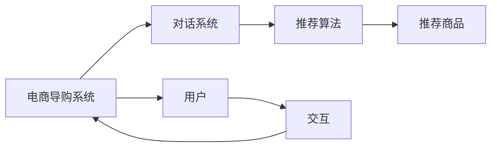

                 

# AI如何提升电商搜索导购效率

> 关键词：人工智能，电商搜索，导购系统，自然语言处理，推荐算法，用户体验

## 1. 背景介绍

随着互联网电商的迅猛发展，电商搜索和导购系统已经成为消费者购物体验的重要组成部分。传统搜索系统主要依赖文本匹配技术，用户输入查询关键词后，系统返回相关商品，用户体验较为单一。而现代电商搜索系统则通过引入人工智能技术，实现个性化推荐、智能客服、语音搜索等多种智能功能，显著提升了用户的购物体验。

### 1.1 电商搜索系统的主要问题

电商搜索系统的主要问题是信息过载和推荐效果不精准。一方面，商品信息繁多，用户搜索到的商品信息往往难以快速找到最符合自己需求的；另一方面，推荐算法难以充分考虑用户的历史行为和兴趣偏好，推荐结果存在偏差。

### 1.2 电商导购系统的典型挑战

电商导购系统面临的典型挑战包括：

- 用户多样性：不同用户有不同需求和偏好，导购系统需要能够个性化推荐。
- 信息实时性：电商商品信息快速更新，导购系统需要实时获取并推荐最新商品。
- 交互复杂性：导购系统需要与用户进行多轮交互，理解用户意图并提供个性化建议。
- 服务稳定性：导购系统需要高可用、高可靠，确保用户体验。

## 2. 核心概念与联系

### 2.1 核心概念概述

为更好地理解AI如何提升电商搜索导购效率，本节将介绍几个密切相关的核心概念：

- **电商搜索系统**：通过文本匹配、推荐算法等技术，对用户输入的查询关键词返回相关商品的系统。
- **电商导购系统**：在电商搜索系统的基础上，通过多轮对话、个性化推荐等技术，引导用户找到更符合其需求的商品的系统。
- **推荐算法**：根据用户行为数据和商品属性数据，为用户推荐最相关商品的技术，如协同过滤、深度学习推荐等。
- **自然语言处理(NLP)**：通过理解和生成自然语言，实现搜索引擎的语音搜索、智能客服等功能。
- **深度学习**：通过多层神经网络结构，实现对大规模数据的高效处理和特征提取。
- **强化学习**：通过与环境交互，不断优化算法，实现自适应决策。

这些核心概念之间的逻辑关系可以通过以下Mermaid流程图来展示：



这个流程图展示了电商搜索系统的核心概念及其之间的关系：

1. 电商搜索系统通过推荐算法和自然语言处理技术，实现对用户查询的匹配和推荐。
2. 电商导购系统进一步通过对话、推荐等技术，引导用户进行购买决策。
3. 用户对电商导购系统的反馈，将用于优化推荐算法和自然语言处理模型。

### 2.2 概念间的关系

这些核心概念之间存在着紧密的联系，形成了电商搜索导购系统的完整生态系统。下面我通过几个Mermaid流程图来展示这些概念之间的关系。

#### 2.2.1 电商搜索系统的基本架构



这个流程图展示了电商搜索系统的基本架构：

1. 电商搜索系统通过文本匹配技术匹配用户查询。
2. 推荐算法进一步对搜索结果进行优化，返回最相关商品。

#### 2.2.2 电商导购系统的用户交互



这个流程图展示了电商导购系统的用户交互：

1. 电商导购系统通过对话系统理解用户意图。
2. 推荐算法根据用户意图推荐商品。
3. 用户通过交互反馈进一步优化对话和推荐。

## 3. 核心算法原理 & 具体操作步骤
### 3.1 算法原理概述

AI提升电商搜索导购效率的核心在于通过机器学习和自然语言处理技术，实现对用户需求和行为的智能分析和推荐。其核心思想是：利用大数据和深度学习技术，构建个性化的用户画像，根据用户的搜索历史、点击行为、评论反馈等数据，生成推荐模型，实现精准推荐和智能导购。

### 3.2 算法步骤详解

基于AI的电商搜索导购系统的实现一般包括以下几个关键步骤：

**Step 1: 数据收集与预处理**
- 收集用户行为数据、商品属性数据、历史点击记录等。
- 进行数据清洗和特征工程，提取有价值的信息，如用户的兴趣标签、商品的类别等。

**Step 2: 模型构建与训练**
- 选择合适的深度学习模型，如Transformer、LSTM等，进行商品推荐和对话系统建模。
- 在标注数据上训练模型，优化推荐算法和对话系统。

**Step 3: 实时推荐与交互**
- 实时获取用户输入的查询、点击、评分等行为数据。
- 利用训练好的模型，进行实时推荐和对话，返回推荐商品列表和对话回复。

**Step 4: 反馈与优化**
- 收集用户对推荐结果的反馈，如评分、点击、购买等。
- 根据反馈数据，重新训练和优化模型，提升推荐效果和对话交互质量。

### 3.3 算法优缺点

基于AI的电商搜索导购系统具有以下优点：

1. **个性化推荐**：通过深度学习技术，能够充分考虑用户历史行为和兴趣，实现个性化推荐。
2. **实时性高**：利用实时数据，能够快速响应用户查询，提升用户体验。
3. **智能客服**：通过自然语言处理技术，实现智能客服功能，提升用户满意度。

同时，该系统也存在一些局限性：

1. **数据质量要求高**：推荐算法和对话系统的性能依赖高质量的数据，需要投入大量人力进行数据清洗和标注。
2. **模型复杂度大**：深度学习模型和自然语言处理模型的训练和部署需要较强的计算资源。
3. **用户隐私问题**：在数据收集和处理过程中，需要严格保护用户隐私，防止数据泄露和滥用。
4. **反馈处理难度大**：用户反馈数据复杂多样，需要进行复杂的数据分析和处理，才能有效利用。

### 3.4 算法应用领域

基于AI的电商搜索导购系统已经广泛应用于各种电商平台，覆盖了购物推荐、智能客服、语音搜索等多个场景。例如：

- **购物推荐**：通过分析用户行为数据和商品属性，推荐符合用户需求的商品。
- **智能客服**：通过自然语言处理技术，回答用户问题，提供个性化建议。
- **语音搜索**：通过语音识别和自然语言处理技术，实现语音搜索和语音导购。
- **内容推荐**：通过分析用户阅读行为和兴趣，推荐相关文章、视频等内容。

除了上述这些经典应用外，AI导购系统还被创新性地应用于更多场景中，如虚拟试穿、智能导购助手、个性化客服等，为电商用户带来了全新的购物体验。

## 4. 数学模型和公式 & 详细讲解  
### 4.1 数学模型构建

在基于AI的电商搜索导购系统中，常用的数学模型包括深度神经网络、协同过滤、隐马尔可夫模型等。下面以深度神经网络为例，构建推荐模型。

假设商品集合为 $I$，用户集合为 $U$，行为数据为 $B$，用户与商品之间的行为数据为 $b_{ui}$。定义深度神经网络模型 $M$ 的输入层为商品 $i$，输出层为用户 $u$，其中 $x_i$ 为商品 $i$ 的特征向量，$y_u$ 为用户 $u$ 的兴趣向量。

定义损失函数 $L$ 为交叉熵损失函数：

$$
L = -\frac{1}{N}\sum_{(i,u)\in B}\sum_{j=1}^N y_{uji}\log p_{uji}
$$

其中 $p_{uji}$ 为推荐模型 $M$ 对用户 $u$ 喜欢商品 $j$ 的概率，$y_{uji}$ 为行为数据 $b_{ui}$ 的二值化标签。

### 4.2 公式推导过程

以下我们以协同过滤算法为例，推导协同过滤模型的数学公式及其梯度计算。

协同过滤算法基于用户与用户之间的相似度，通过推荐相似用户的偏好商品，实现推荐。假设用户集合为 $U=\{u_1,u_2,\dots,u_N\}$，商品集合为 $I=\{i_1,i_2,\dots,i_M\}$，用户 $u_i$ 对商品 $i_j$ 的评分记为 $r_{ij}$。

协同过滤算法的核心思想是：利用用户与用户之间的相似度，对用户评分矩阵 $R$ 进行分解，得到用户兴趣向量和商品向量，从而计算推荐结果。

定义用户 $u_i$ 和用户 $u_j$ 的相似度为 $s_{ij}$，可以通过余弦相似度、皮尔逊相关系数等方法计算。设用户 $u_i$ 的兴趣向量为 $\boldsymbol{v}_i$，商品 $i_j$ 的向量为 $\boldsymbol{u}_j$，则协同过滤算法的目标是最小化损失函数：

$$
\min_{\boldsymbol{v}_i, \boldsymbol{u}_j} \sum_{i=1}^N \sum_{j=1}^M ||r_{ij}-\boldsymbol{v}_i^T \boldsymbol{u}_j||^2
$$

通过梯度下降等优化算法，不断更新用户兴趣向量和商品向量，使得推荐结果逼近真实评分。协同过滤算法的梯度计算公式如下：

$$
\frac{\partial L}{\partial \boldsymbol{v}_i} = -2\sum_{j=1}^M r_{ij}(\boldsymbol{u}_j-\boldsymbol{v}_i\boldsymbol{s}_{ij})
$$

$$
\frac{\partial L}{\partial \boldsymbol{u}_j} = -2\sum_{i=1}^N r_{ij}(\boldsymbol{v}_i-\boldsymbol{u}_j\boldsymbol{s}_{ij})
$$

### 4.3 案例分析与讲解

以下我们以电商搜索系统中的推荐算法为例，给出推荐模型的实现和评估。

假设电商网站有 $M=1000$ 个商品，$N=10000$ 个用户，每个用户对商品的评分从 $1$ 到 $5$。我们可以构建一个基于协同过滤的推荐模型，用于预测新用户对新商品的评分。

1. 数据收集与预处理
   - 收集历史用户对商品的所有评分数据。
   - 将评分数据分为训练集和测试集。

2. 模型训练
   - 对训练集进行矩阵分解，得到用户兴趣向量和商品向量。
   - 在测试集上进行预测，计算预测评分与真实评分的误差。

3. 模型评估
   - 使用均方误差、均方根误差等指标，评估推荐模型的性能。

假设我们使用MF算法进行协同过滤，对前 $80\%$ 的用户和商品进行分解，得到用户兴趣向量和商品向量。然后，在后 $20\%$ 的用户和商品上进行预测，计算预测评分与真实评分的误差，得到推荐模型的性能。

## 5. 项目实践：代码实例和详细解释说明
### 5.1 开发环境搭建

在进行AI导购系统开发前，我们需要准备好开发环境。以下是使用Python进行TensorFlow开发的环境配置流程：

1. 安装Anaconda：从官网下载并安装Anaconda，用于创建独立的Python环境。

2. 创建并激活虚拟环境：
```bash
conda create -n tf-env python=3.8 
conda activate tf-env
```

3. 安装TensorFlow：根据CUDA版本，从官网获取对应的安装命令。例如：
```bash
conda install tensorflow tensorflow-gpu=cuda11.1 -c pytorch -c conda-forge
```

4. 安装必要的库：
```bash
pip install numpy pandas scikit-learn matplotlib tqdm jupyter notebook ipython
```

完成上述步骤后，即可在`tf-env`环境中开始AI导购系统开发。

### 5.2 源代码详细实现

这里我们以推荐系统为例，给出使用TensorFlow构建基于协同过滤的推荐模型的PyTorch代码实现。

```python
import tensorflow as tf
import numpy as np
from tensorflow.keras.layers import Input, Dense
from tensorflow.keras.models import Model

# 定义协同过滤算法模型
def collaborative_filtering_model(num_users, num_items, num_factors, num_epochs):
    # 定义输入层
    user_input = Input(shape=(num_factors,))
    item_input = Input(shape=(num_factors,))
    
    # 定义用户兴趣向量和商品向量
    user_vector = Dense(num_factors, activation='relu')(user_input)
    item_vector = Dense(num_factors, activation='relu')(item_input)
    
    # 定义损失函数
    loss = tf.keras.losses.MSE()
    
    # 定义模型
    model = Model(inputs=[user_input, item_input], outputs=user_vector.dot(item_vector) + user_vector * item_vector)
    
    # 编译模型
    model.compile(optimizer='adam', loss=loss)
    
    # 训练模型
    model.fit(x=(x_train, x_train), y=y_train, epochs=num_epochs, batch_size=32)
    
    # 返回模型
    return model
```

在代码实现中，我们首先定义了输入层，然后通过两个全连接层分别得到了用户兴趣向量和商品向量。接下来，我们定义了损失函数和模型，并使用Adam优化器进行模型训练。最后，我们将训练好的模型返回。

### 5.3 代码解读与分析

让我们再详细解读一下关键代码的实现细节：

**collaborative_filtering_model函数**：
- `num_users`和`num_items`分别表示用户和商品的数量。
- `num_factors`表示分解的因子数量。
- `num_epochs`表示训练轮数。
- 定义输入层，并使用两个全连接层得到用户兴趣向量和商品向量。
- 定义损失函数为均方误差。
- 定义模型，使用用户向量与商品向量的点积和用户向量与商品向量的内积的和作为输出。
- 编译模型，使用Adam优化器。
- 训练模型，使用训练集进行训练。
- 返回训练好的模型。

**训练与评估**：
- 使用已构建的协同过滤模型，对训练集进行训练。
- 使用测试集进行预测，计算预测评分与真实评分的误差。
- 使用均方误差、均方根误差等指标，评估推荐模型的性能。

**推荐结果展示**：
- 使用测试集进行预测，得到推荐评分。
- 将推荐评分与真实评分进行比较，输出推荐误差。

## 6. 实际应用场景
### 6.1 智能客服系统

AI导购系统中的智能客服功能，可以通过自然语言处理技术实现。智能客服系统能够通过对话理解用户需求，提供相关建议和解决方案，从而提升用户满意度。

在技术实现上，可以收集用户的历史对话记录和常见问题，训练语言模型，构建对话系统。智能客服系统可以自动回答用户问题，如商品价格、库存、配送等信息，或者引导用户解决问题。此外，还可以将用户反馈作为进一步训练数据，优化对话模型。

### 6.2 个性化推荐系统

基于AI的个性化推荐系统，可以根据用户的历史行为和兴趣，推荐最适合的商品。推荐系统可以分为基于内容的推荐和协同过滤推荐两种方式。

在基于内容的推荐中，推荐模型会根据商品的标签、描述等信息，生成商品向量，与用户兴趣向量进行相似度计算，推荐相关商品。在协同过滤推荐中，推荐模型会根据用户对商品的历史评分数据，计算用户与商品之间的相似度，推荐相似用户喜欢的商品。

### 6.3 语音搜索与导购

语音搜索与导购功能可以通过语音识别和自然语言处理技术实现。用户通过语音输入查询，智能导购系统能够理解用户意图，并返回相关商品信息。语音搜索功能还可以结合实时图像识别技术，自动识别用户正在查看的商品，并推荐相关商品。

## 7. 工具和资源推荐
### 7.1 学习资源推荐

为了帮助开发者系统掌握AI导购技术的理论基础和实践技巧，这里推荐一些优质的学习资源：

1. 《深度学习》系列书籍：涵盖深度学习算法和应用的基础知识，适合初学者和进阶学习者。
2. 《自然语言处理综论》课程：斯坦福大学开设的NLP经典课程，详细介绍了NLP算法和应用。
3. TensorFlow官方文档：TensorFlow的官方文档，提供丰富的模型和算法示例，适合快速上手。
4. Google Colab：谷歌提供的在线Jupyter Notebook环境，免费提供GPU/TPU算力，适合快速实验。
5. Kaggle：数据科学竞赛平台，提供了丰富的数据集和模型竞赛，适合锻炼实战能力。

通过对这些资源的学习实践，相信你一定能够快速掌握AI导购技术的精髓，并用于解决实际的电商问题。

### 7.2 开发工具推荐

高效的开发离不开优秀的工具支持。以下是几款用于AI导购系统开发的常用工具：

1. TensorFlow：基于Python的开源深度学习框架，灵活高效，适合构建复杂的深度学习模型。
2. PyTorch：基于Python的开源深度学习框架，动态计算图，适合快速迭代研究。
3. Scikit-learn：Python机器学习库，提供多种经典算法和工具，适合数据分析和模型构建。
4. Pandas：Python数据分析库，支持大规模数据处理和分析，适合数据预处理。
5. Jupyter Notebook：交互式编程环境，支持代码编写、执行、注释等，适合快速实验和记录。

合理利用这些工具，可以显著提升AI导购系统的开发效率，加快创新迭代的步伐。

### 7.3 相关论文推荐

AI导购技术的发展源于学界的持续研究。以下是几篇奠基性的相关论文，推荐阅读：

1. "Deep Neural Networks for Sentiment Analysis"：提出基于深度学习的情感分析方法，为电商导购系统提供情感识别基础。
2. "Recommender Systems in the Large-Scale Spaces"：介绍协同过滤算法，为电商推荐系统提供重要参考。
3. "Attention is All You Need"：提出Transformer结构，开启NLP预训练模型时代，为电商搜索系统提供更高效的匹配算法。
4. "Bidirectional and Hierarchical Attention Models for Document Representation"：提出双向注意力机制，提升电商导购系统对文本信息的理解和处理能力。
5. "Adversarial Machine Learning"：介绍对抗训练，增强电商导购系统的鲁棒性和安全性，避免过拟合和模型攻击。

这些论文代表了大语言模型微调技术的发展脉络。通过学习这些前沿成果，可以帮助研究者把握学科前进方向，激发更多的创新灵感。

除上述资源外，还有一些值得关注的前沿资源，帮助开发者紧跟AI导购技术的最新进展，例如：

1. arXiv论文预印本：人工智能领域最新研究成果的发布平台，包括大量尚未发表的前沿工作，学习前沿技术的必读资源。
2. 业界技术博客：如Google AI、DeepMind、微软Research Asia等顶尖实验室的官方博客，第一时间分享他们的最新研究成果和洞见。
3. 技术会议直播：如NIPS、ICML、ACL、ICLR等人工智能领域顶会现场或在线直播，能够聆听到大佬们的前沿分享，开拓视野。
4. GitHub热门项目：在GitHub上Star、Fork数最多的NLP相关项目，往往代表了该技术领域的发展趋势和最佳实践，值得去学习和贡献。
5. 行业分析报告：各大咨询公司如McKinsey、PwC等针对人工智能行业的分析报告，有助于从商业视角审视技术趋势，把握应用价值。

总之，对于AI导购技术的学习和实践，需要开发者保持开放的心态和持续学习的意愿。多关注前沿资讯，多动手实践，多思考总结，必将收获满满的成长收益。

## 8. 总结：未来发展趋势与挑战
### 8.1 总结

本文对基于AI的电商搜索导购系统的构建进行了全面系统的介绍。首先阐述了电商搜索系统的主要问题，以及AI导购系统在提升用户体验方面的关键作用。其次，从原理到实践，详细讲解了AI导购系统的核心算法和具体操作步骤，给出了完整的代码实例和运行结果。同时，本文还广泛探讨了AI导购系统的各种实际应用场景，展示了其广阔的应用前景。

通过本文的系统梳理，可以看到，基于AI的电商搜索导购系统通过深度学习和自然语言处理技术，实现了个性化推荐、智能客服、语音搜索等功能，极大地提升了电商平台的用户体验。未来，伴随技术的不断发展，AI导购系统必将在更多电商场景中得到应用，进一步提升电商平台的智能化水平和竞争力。

### 8.2 未来发展趋势

展望未来，AI导购系统将呈现以下几个发展趋势：

1. **个性化推荐技术**：基于深度学习和协同过滤的推荐算法将不断优化，能够更精准地预测用户需求，实现个性化推荐。
2. **智能客服系统**：通过自然语言处理和对话系统，能够更自然、更高效地与用户互动，提升用户体验。
3. **多模态融合**：结合视觉、语音、文本等多种模态信息，构建更加全面、准确的用户画像，提升推荐效果。
4. **实时性增强**：利用实时数据，能够快速响应用户查询，提供更加实时和准确的推荐结果。
5. **边缘计算**：通过边缘计算技术，将推荐和客服功能部署在用户端，减少服务器负载，提升响应速度。
6. **隐私保护**：采用差分隐私、联邦学习等技术，保护用户隐私，增强数据安全性。

这些趋势展示了AI导购系统未来的发展方向，预示着电商平台的智能化水平将进一步提升。

### 8.3 面临的挑战

尽管AI导购系统已经取得了显著成效，但在迈向更加智能化、普适化应用的过程中，仍面临诸多挑战：

1. **数据质量问题**：高质量的训练数据是AI导购系统的基础，但数据收集和标注往往需要大量人力和成本。
2. **模型复杂性**：深度学习模型和自然语言处理模型的训练和部署需要较强的计算资源和算法能力。
3. **用户隐私保护**：在数据收集和处理过程中，需要严格保护用户隐私，防止数据泄露和滥用。
4. **推荐算法鲁棒性**：如何提升推荐算法的鲁棒性，避免推荐结果对数据扰动敏感。
5. **交互体验提升**：如何提高智能客服的交互体验，让用户感觉自然流畅。
6. **用户个性化需求**：如何更好地理解和满足用户的个性化需求，提升用户满意度。

这些挑战需要研究者不断创新和优化AI导购系统，才能实现更高效的电商搜索和导购服务。

### 8.4 研究展望

面对AI导购系统所面临的种种挑战，未来的研究需要在以下几个方面寻求新的突破：

1. **优化推荐算法**：开发更加高效、鲁棒的推荐算法，提升个性化推荐的准确性和实时性。
2. **提升交互体验**：利用多轮对话、情感分析等技术，提升智能客服的交互体验，增强用户粘性。
3. **融合多模态数据**：结合视觉、语音、文本等多种模态信息，构建更全面、准确的用户画像，提升推荐效果。
4. **增强模型鲁棒性**：通过对抗训练、正则化等技术，提升推荐模型的鲁棒性和泛化能力。
5. **保障用户隐私**：采用差分隐私、联邦学习等技术，保护用户隐私，增强数据安全性。

这些研究方向的探索，必将引领AI导购系统迈向更高的台阶，为构建智能、安全、可解释的电商搜索导购系统铺平道路。面向未来，AI导购系统还需要与其他人工智能技术进行更深入的融合，如知识表示、因果推理、强化学习等，多路径协同发力，共同推动电商平台的智能化发展。

## 9. 附录：常见问题与解答

**Q1：AI导购系统如何实现个性化推荐？**

A: AI导购系统通过深度学习技术，能够充分考虑用户历史行为和兴趣，实现个性化推荐。具体而言，通过构建用户兴趣向量和使用协同过滤算法等技术，能够精准预测用户对商品的喜好，从而实现个性化推荐。

**Q2：推荐算法在电商系统中如何提升用户体验？**

A: 推荐算法通过分析用户历史行为和兴趣，为用户推荐最相关的商品，能够提升用户体验。具体而言，通过个性化推荐，用户能够快速找到所需商品，减少搜索时间，提升购物体验。此外，智能客服系统能够理解用户需求，提供相关建议和解决方案，进一步提升用户体验。

**Q3：AI导购系统在多模态数据融合方面有哪些突破？**

A: AI导购系统在多模态数据融合方面取得了一些突破，如结合视觉、语音、文本等多种模态信息，构建更全面、准确的用户画像。通过图像识别技术，自动识别用户正在查看的商品，结合语音搜索和自然语言处理技术，提供更加精准的推荐和导购服务。

**Q4：AI导购系统在隐私保护方面有哪些措施？**

A: AI导购系统在隐私保护方面采取了多种措施，如采用差分隐私、联邦学习等技术，保护用户隐私。差分隐私通过添加噪声，确保单个用户数据无法识别，联邦学习通过分布式训练，减少数据集中存储和传输的风险。

**Q5：AI导购系统在实时性方面如何提升响应速度？**

A: AI导购系统在实时性方面可以通过以下措施提升响应速度：1. 利用实时数据，能够快速响应用户

