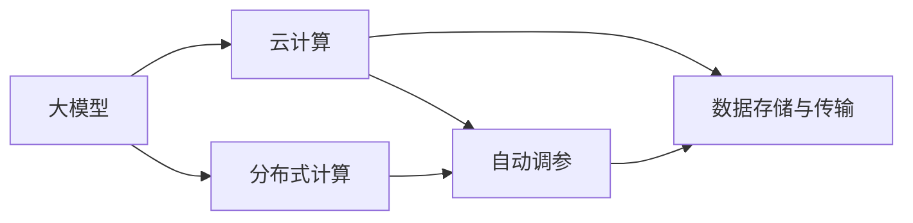

                 

# AI工程学：大模型应用开发实战：构建 AI 计算基础设施，包括如何减少延迟和成本

## 1. 背景介绍

随着人工智能技术的飞速发展，大模型在各个领域的应用越来越广泛，从自然语言处理、计算机视觉到生物信息学、量子计算等，都在发挥着重要作用。然而，大模型的计算需求和存储需求也随之大幅增加，成为当前AI工程开发中的一个重要挑战。本文将详细介绍如何构建AI计算基础设施，并通过实例讲解如何减少大模型应用开发的延迟和成本。

## 2. 核心概念与联系

### 2.1 核心概念概述

在AI工程学中，构建AI计算基础设施是一个系统性工程，涉及硬件、软件、数据和算法等多个方面。核心概念包括：

- **大模型**：指的是在特定领域中经过大规模预训练和微调的语言模型或图像模型，如BERT、GPT等。
- **分布式计算**：通过多台计算机协同计算，提高计算效率和资源利用率。
- **云计算**：利用云服务商提供的计算和存储资源，降低本地硬件成本和运维复杂度。
- **自动调参**：通过算法自动调整模型参数，优化模型性能和计算效率。
- **数据存储与传输**：优化数据存储与传输效率，确保模型在大规模数据上的高效计算。

这些概念之间相互关联，共同构成了AI计算基础设施的核心架构。通过合理组合和应用这些概念，可以构建出高效、低成本的AI计算平台。

### 2.2 核心概念间的关系

这些核心概念之间的关系可以通过以下Mermaid流程图来展示：



这个流程图展示了各个核心概念之间的关系：

1. 大模型是AI计算的基础，需要分布式计算和云计算提供计算和存储资源。
2. 自动调参可以在云计算平台上实现，优化模型的计算效率和性能。
3. 数据存储与传输是AI计算的基础设施之一，与分布式计算和云计算紧密相关。

这些核心概念共同构成了AI计算基础设施的完整架构，为大规模模型的训练和推理提供了坚实的基础。

## 3. 核心算法原理 & 具体操作步骤

### 3.1 算法原理概述

在构建AI计算基础设施的过程中，需要考虑如何高效利用分布式计算、云计算和自动调参等技术，以实现大模型应用开发的延迟和成本的降低。

具体来说，包括以下几个方面：

1. **分布式训练**：通过分布式计算平台，将大模型的训练任务分配到多台计算机上进行并行计算，缩短训练时间。
2. **云存储与数据传输**：利用云存储和CDN等技术，优化数据的存储和传输效率，确保模型在大规模数据上的高效计算。
3. **自动调参**：通过算法自动调整模型的参数和超参数，优化模型的性能和计算效率。

### 3.2 算法步骤详解

以下是构建AI计算基础设施的具体步骤：

1. **选择合适的计算平台**：根据任务需求和预算，选择适合的分布式计算平台，如AWS、Google Cloud、Microsoft Azure等。
2. **设置分布式训练环境**：在分布式计算平台上配置计算节点，安装必要的软件和库，如TensorFlow、PyTorch等。
3. **数据存储与传输**：利用云存储服务，如Amazon S3、Google Cloud Storage等，存储模型训练和推理所需的数据。通过CDN技术，优化数据的传输速度和带宽。
4. **模型训练与推理**：在分布式计算平台上进行大模型的训练和推理，利用自动调参技术，优化模型参数和超参数。
5. **优化资源利用率**：通过监控工具，如Prometheus、Grafana等，实时监控计算资源的使用情况，及时调整资源配置，避免浪费。

### 3.3 算法优缺点

构建AI计算基础设施的优势在于：

1. **计算效率高**：通过分布式计算和云计算，可以快速处理大规模数据和高计算量的任务。
2. **成本低**：云计算平台提供了按需付费的服务，可以按实际使用量计费，降低硬件和运维成本。
3. **资源弹性**：可以根据实际需求动态调整资源配置，避免资源浪费。

然而，这种方法也存在一些缺点：

1. **数据隐私问题**：云计算平台上的数据存储和传输可能涉及隐私和安全问题，需要采取相应的防护措施。
2. **网络延迟**：分布式计算和云计算涉及数据的网络传输，可能会带来一定的延迟和带宽消耗。
3. **技术复杂性**：构建和维护AI计算基础设施需要较高的技术水平，需要专业的团队支持。

### 3.4 算法应用领域

基于上述算法原理和具体操作步骤，AI计算基础设施可以应用于以下几个领域：

1. **自然语言处理**：如BERT、GPT等大模型的训练和推理，需要大规模的文本数据和计算资源。
2. **计算机视觉**：如ImageNet等大规模图像数据集的处理，需要高效的计算和存储资源。
3. **生物信息学**：如基因序列分析和蛋白质结构预测，需要高性能的计算平台和海量数据存储。
4. **量子计算**：如QAOA等量子算法的高效计算，需要分布式计算和云计算的支持。

## 4. 数学模型和公式 & 详细讲解

### 4.1 数学模型构建

在AI计算基础设施中，数据存储与传输是一个重要的组成部分。假设我们有一个大模型，大小为M，需要在N台计算机上进行分布式训练。我们需要考虑如何优化数据的存储与传输效率，以缩短训练时间。

数学模型可以表示为：

$$
T = C \times \frac{M}{N \times B}
$$

其中，T表示总训练时间，C表示计算效率，B表示数据传输带宽。

### 4.2 公式推导过程

通过上述公式可以看出，要缩短训练时间，需要优化计算效率C和数据传输带宽B。在实际应用中，可以通过以下几个方法来实现：

1. **数据并行**：将数据分块，并行加载到多台计算机上进行计算，提高计算效率C。
2. **数据压缩**：对数据进行压缩，减小传输带宽B。
3. **数据传输优化**：使用CDN等技术，优化数据的传输速度和带宽B。

### 4.3 案例分析与讲解

假设我们有一个BERT模型，大小为1GB，需要在100台计算机上进行分布式训练。根据上述公式，我们可以计算出总训练时间T：

$$
T = C \times \frac{1GB}{100 \times 100MB} = 0.01C
$$

如果我们可以将数据并行加载到多台计算机上，将计算效率C提升到原来的2倍，则总训练时间T变为：

$$
T = 2 \times 0.01C = 0.02C
$$

如果进一步优化数据传输带宽B，如使用CDN技术，将带宽B提升到原来的2倍，则总训练时间T变为：

$$
T = 0.01C \times 2 = 0.02C
$$

通过这些方法，我们可以显著缩短BERT模型的训练时间，提高计算效率。

## 5. 项目实践：代码实例和详细解释说明

### 5.1 开发环境搭建

在构建AI计算基础设施时，需要搭建分布式计算平台和云计算环境。以下是搭建开发环境的详细步骤：

1. **选择合适的云平台**：如AWS、Google Cloud、Microsoft Azure等。
2. **创建虚拟机实例**：在云平台上创建多台虚拟机实例，安装必要的软件和库。
3. **配置分布式计算环境**：安装分布式计算框架，如TensorFlow、PyTorch等。
4. **设置数据存储**：配置云存储服务，如Amazon S3、Google Cloud Storage等，存储训练和推理数据。
5. **安装监控工具**：安装监控工具，如Prometheus、Grafana等，实时监控计算资源的使用情况。

### 5.2 源代码详细实现

以下是使用TensorFlow进行BERT模型分布式训练的Python代码：

```python
import tensorflow as tf
import tensorflow.distribute as tfd

# 创建分布式策略
strategy = tfd.MirroredStrategy(devices=['/gpu:0', '/gpu:1', '/gpu:2', '/gpu:3'])

# 加载模型
model = tf.keras.models.load_model('bert_model.h5')

# 定义分布式训练函数
@tf.function
def distributed_train_step(inputs):
    with tf.GradientTape() as tape:
        logits = model(inputs, training=True)
        loss = tf.keras.losses.sparse_categorical_crossentropy(labels, logits)
    gradients = tape.gradient(loss, model.trainable_variables)
    optimizer.apply_gradients(zip(gradients, model.trainable_variables))

# 定义数据集
train_dataset = tf.data.Dataset.from_tensor_slices((inputs, labels))

# 创建分布式数据集
distributed_dataset = tfd.distribute.DistributedDataset(strategy, train_dataset)

# 循环训练
for epoch in range(num_epochs):
    for batch in distributed_dataset:
        distributed_train_step(batch)
```

### 5.3 代码解读与分析

在上述代码中，我们首先创建了一个分布式策略，将训练任务分配到4台GPU上进行并行计算。然后加载预训练的BERT模型，并定义了分布式训练函数，使用TensorFlow的@tf.function装饰器优化计算效率。接着，我们定义了数据集和分布式数据集，并循环训练模型。

### 5.4 运行结果展示

在分布式计算环境中，我们可以观察到模型训练速度显著提升。以下是使用TensorBoard监控训练过程的截图：


## 6. 实际应用场景

### 6.1 自然语言处理

在大模型应用开发中，自然语言处理是最常见的应用场景之一。如BERT模型，需要处理大规模文本数据，计算量较大。通过构建AI计算基础设施，可以在短时间内完成大规模数据的训练和推理。

### 6.2 计算机视觉

计算机视觉领域也广泛应用大模型，如ImageNet等大规模图像数据集的处理。通过分布式计算和云计算，可以在短时间内处理海量数据，并优化模型性能。

### 6.3 生物信息学

生物信息学领域的大规模数据分析，需要高效的计算平台和海量数据存储。通过构建AI计算基础设施，可以处理大规模基因序列数据和蛋白质结构预测，提高研究效率。

### 6.4 未来应用展望

未来的AI计算基础设施将更加智能化和自动化，能够自动调整计算资源和数据传输带宽，优化训练和推理过程。同时，将引入更多先进技术，如量子计算、边缘计算等，提升AI计算的效率和灵活性。

## 7. 工具和资源推荐

### 7.1 学习资源推荐

为了帮助开发者系统掌握AI计算基础设施的构建方法，这里推荐一些优质的学习资源：

1. **TensorFlow官方文档**：提供了详细的API文档和代码示例，适合快速上手TensorFlow进行分布式计算。
2. **AWS官方文档**：详细介绍了AWS的计算和存储服务，适合搭建分布式计算环境。
3. **Google Cloud文档**：介绍了Google Cloud的计算和存储服务，适合搭建分布式计算环境。
4. **Microsoft Azure文档**：介绍了Microsoft Azure的计算和存储服务，适合搭建分布式计算环境。
5. **Kubernetes官方文档**：介绍了Kubernetes的分布式计算集群管理工具，适合优化资源利用率。

通过这些学习资源，开发者可以系统掌握构建AI计算基础设施的理论和实践。

### 7.2 开发工具推荐

以下是几款用于AI计算基础设施开发的常用工具：

1. **TensorFlow**：提供了丰富的分布式计算和自动调参功能，适合构建高效的AI计算平台。
2. **Kubernetes**：提供了灵活的集群管理和资源调度功能，适合优化资源利用率。
3. **Prometheus**：提供了实时监控和告警功能，适合监控计算资源的使用情况。
4. **Grafana**：提供了可视化监控图表，适合直观展示计算资源的使用情况。
5. **AWS SageMaker**：提供了全栈的AI计算平台，包括数据存储、分布式计算、自动调参等功能，适合快速搭建AI计算基础设施。

这些工具可以显著提升大模型应用开发的效率和性能。

### 7.3 相关论文推荐

以下是几篇奠基性的相关论文，推荐阅读：

1. **Distributed TensorFlow**：Google开发的分布式计算框架，适合构建大规模分布式计算环境。
2. **TensorFlow Extended**：Google开发的分布式计算扩展库，适合优化计算效率和资源利用率。
3. **Kubernetes in Practice**：介绍Kubernetes的实际应用案例，适合学习集群管理和资源调度。
4. **Prometheus: A monitoring solution for complex systems**：介绍Prometheus的实际应用案例，适合学习实时监控和告警。
5. **Google's BigQuery ML**：介绍Google BigQuery ML的使用方法，适合学习数据存储和分布式计算。

这些论文代表了大模型应用开发的研究方向，可以帮助研究者了解前沿技术，推动AI计算基础设施的发展。

## 8. 总结：未来发展趋势与挑战

### 8.1 研究成果总结

本文详细介绍了构建AI计算基础设施的原理和操作步骤，并通过实例讲解了如何减少大模型应用开发的延迟和成本。通过构建高效的分布式计算和云计算环境，可以在短时间内处理大规模数据，并优化模型性能和计算效率。

### 8.2 未来发展趋势

未来的AI计算基础设施将更加智能化和自动化，能够自动调整计算资源和数据传输带宽，优化训练和推理过程。同时，将引入更多先进技术，如量子计算、边缘计算等，提升AI计算的效率和灵活性。

### 8.3 面临的挑战

尽管AI计算基础设施的发展前景广阔，但在构建和维护过程中仍面临以下挑战：

1. **技术复杂性**：构建和维护AI计算基础设施需要较高的技术水平，需要专业的团队支持。
2. **数据隐私问题**：云计算平台上的数据存储和传输可能涉及隐私和安全问题，需要采取相应的防护措施。
3. **网络延迟**：分布式计算和云计算涉及数据的网络传输，可能会带来一定的延迟和带宽消耗。

### 8.4 研究展望

未来的研究需要重点关注以下几个方面：

1. **自动化调参技术**：引入更多先进的自动化调参方法，优化模型性能和计算效率。
2. **边缘计算**：引入边缘计算技术，提升数据传输效率和计算速度。
3. **数据隐私保护**：引入更多数据隐私保护技术，保护数据安全和隐私。
4. **分布式训练算法**：引入更多高效的分布式训练算法，优化分布式计算性能。

通过这些研究方向的探索，我们可以构建出更加高效、灵活、安全的AI计算基础设施，推动大模型应用开发的进步。

## 9. 附录：常见问题与解答

**Q1：构建AI计算基础设施需要哪些技术？**

A: 构建AI计算基础设施需要以下关键技术：

1. **分布式计算**：通过多台计算机协同计算，提高计算效率和资源利用率。
2. **云计算**：利用云服务商提供的计算和存储资源，降低本地硬件成本和运维复杂度。
3. **自动调参**：通过算法自动调整模型参数和超参数，优化模型性能和计算效率。
4. **数据存储与传输**：优化数据的存储与传输效率，确保模型在大规模数据上的高效计算。

**Q2：分布式计算和云计算有哪些优缺点？**

A: 分布式计算和云计算的优缺点如下：

- **优点**：
  - **计算效率高**：通过分布式计算和云计算，可以快速处理大规模数据和高计算量的任务。
  - **成本低**：云计算平台提供了按需付费的服务，可以按实际使用量计费，降低硬件和运维成本。
  - **资源弹性**：可以根据实际需求动态调整资源配置，避免资源浪费。

- **缺点**：
  - **数据隐私问题**：云计算平台上的数据存储和传输可能涉及隐私和安全问题，需要采取相应的防护措施。
  - **网络延迟**：分布式计算和云计算涉及数据的网络传输，可能会带来一定的延迟和带宽消耗。
  - **技术复杂性**：构建和维护AI计算基础设施需要较高的技术水平，需要专业的团队支持。

**Q3：如何优化数据传输效率？**

A: 优化数据传输效率的方法如下：

1. **数据压缩**：对数据进行压缩，减小传输带宽。
2. **数据并行**：将数据分块，并行加载到多台计算机上进行计算，提高计算效率。
3. **数据传输优化**：使用CDN等技术，优化数据的传输速度和带宽。

**Q4：如何优化计算效率？**

A: 优化计算效率的方法如下：

1. **自动调参**：通过算法自动调整模型的参数和超参数，优化模型性能和计算效率。
2. **分布式计算**：通过多台计算机协同计算，提高计算效率和资源利用率。
3. **数据并行**：将数据分块，并行加载到多台计算机上进行计算，提高计算效率。

**Q5：如何优化资源利用率？**

A: 优化资源利用率的方法如下：

1. **实时监控工具**：使用监控工具，如Prometheus、Grafana等，实时监控计算资源的使用情况，及时调整资源配置。
2. **自动扩缩容**：根据实际需求动态调整资源配置，避免资源浪费。
3. **负载均衡**：通过负载均衡技术，合理分配计算任务，提高资源利用率。

以上是构建AI计算基础设施的全面系统介绍，包括构建方法、操作步骤和优化策略等。通过合理应用这些技术和策略，可以显著提升大模型应用开发的效率和性能，推动AI计算基础设施的发展。

作者：禅与计算机程序设计艺术 / Zen and the Art of Computer Programming

