                 

# AI技术在企业中的应用

> 关键词：人工智能,企业应用,机器学习,深度学习,大数据,云计算,自动化,智能决策,智慧管理

## 1. 背景介绍

### 1.1 问题由来
在数字化转型的大潮中，人工智能(AI)技术已经逐步渗透到各行各业，成为推动企业创新发展的关键力量。通过将AI技术应用于业务场景，企业能够提升效率、降低成本、增强竞争力。然而，AI技术在企业中的广泛应用，也伴随着一些挑战和问题，如数据隐私、算法可解释性、模型泛化等。本文将从背景和动机出发，系统介绍AI技术在企业中的应用实践，以期为企业在AI应用中提供参考。

### 1.2 问题核心关键点
AI技术在企业中的应用，主要围绕以下几个核心点展开：
- **数据驱动决策**：通过大数据和机器学习技术，帮助企业从海量数据中提取有价值的洞见，辅助决策。
- **流程自动化**：利用AI自动化流程，减少人工干预，提升效率。
- **智能客户服务**：通过AI技术优化客户服务流程，提高客户满意度和忠诚度。
- **个性化推荐**：通过机器学习算法，实现个性化产品推荐，提高用户转化率。
- **智能风控**：通过AI技术识别和预测风险，保障企业安全。
- **业务预测**：通过深度学习模型，对未来市场趋势进行预测，辅助战略决策。

这些核心点构成了AI技术在企业应用的主要框架，涉及多个领域和多个技术方向，需要企业根据自身业务特点进行策略选择和部署。

## 2. 核心概念与联系

### 2.1 核心概念概述

为更好地理解AI技术在企业中的应用，本节将介绍几个密切相关的核心概念：

- **人工智能(AI)**：利用计算机科学和数学原理，使机器模拟和扩展人的智能行为的技术。
- **机器学习(ML)**：通过数据训练模型，使机器具备预测和决策能力的技术。
- **深度学习(DL)**：一种特殊的机器学习方法，通过多层神经网络模型，学习数据中的复杂关系。
- **大数据(Big Data)**：规模庞大、种类繁多、速度快速的数据集合，用于分析和挖掘洞见。
- **云计算(Cloud Computing)**：通过互联网提供计算资源和服务，支持企业高效运行。
- **自动化(Automation)**：通过技术手段，减少人工干预，实现流程自动化。
- **智能决策(Intelligent Decision Making)**：利用AI技术，辅助企业进行数据驱动决策。
- **智慧管理(Smart Management)**：通过AI技术，实现企业运营的优化和智能化管理。

这些核心概念之间的逻辑关系可以通过以下Mermaid流程图来展示：


这个流程图展示了一系列与AI技术在企业应用密切相关的核心概念及其关系。

### 2.2 概念间的关系

这些核心概念之间存在着紧密的联系，形成了企业应用AI技术的基本生态系统。下面我通过几个Mermaid流程图来展示这些概念之间的关系。

#### 2.2.1 人工智能与机器学习的关系


这个流程图展示了人工智能与机器学习之间的联系。人工智能包括了机器学习和深度学习，而机器学习又细分为监督学习和无监督学习，深度学习则是机器学习中的一种特殊形式，主要用于处理复杂模式识别任务。

#### 2.2.2 大数据与云计算的关系


这个流程图展示了大数据与云计算之间的联系。大数据需要大量的计算和存储资源进行处理，云计算提供了弹性和分布式的计算和存储解决方案，从而支持大数据的存储和分析。

#### 2.2.3 自动化与智慧管理的关系


这个流程图展示了自动化与智慧管理之间的联系。自动化通过优化流程和自动化任务，提高企业运营效率，而智慧管理则通过智能决策和分析，实现企业的优化和智能化管理。

### 2.3 核心概念的整体架构

最后，我们用一个综合的流程图来展示这些核心概念在大数据企业应用中的整体架构：

```mermaid
graph TB
    A[企业运营数据] --> B[大数据采集]
    A --> C[数据清洗]
    A --> D[数据存储]
    B --> E[数据湖]
    C --> E
    D --> E
    E --> F[数据挖掘]
    E --> G[数据可视化]
    E --> H[机器学习]
    H --> I[监督学习]
    H --> J[无监督学习]
    H --> K[深度学习]
    F --> G
    G --> H
    F --> I
    F --> J
    F --> K
    F --> L[业务预测]
    L --> M[智能决策]
    L --> N[智能风控]
    L --> O[客户服务]
    O --> P[个性化推荐]
    O --> Q[智能分析]
    M --> P
    N --> Q
    M --> R[运营优化]
    R --> S[智慧管理]
    S --> T[企业运营]
```



这个综合流程图展示了从数据采集到最终应用于企业运营的完整过程。大数据企业通过采集、清洗、存储数据，进行数据挖掘、可视化、机器学习和深度学习，实现业务预测、智能决策、智能风控和智能客户服务等目标，最终提升企业运营效率和管理水平。

## 3. 核心算法原理 & 具体操作步骤
### 3.1 算法原理概述

企业应用AI技术，主要依赖于机器学习和深度学习算法。以下将详细解释这些算法的原理和核心思想。

#### 3.1.1 监督学习算法

监督学习算法通过已标注的数据，训练出能够预测新样本标签的模型。其核心思想是通过样本的特征和标签，学习样本之间的映射关系，从而实现对新样本的预测。监督学习算法在企业中的应用广泛，如客户分类、推荐系统、信用评分等。

#### 3.1.2 无监督学习算法

无监督学习算法通过未标注的数据，自动发现数据中的模式和结构。其核心思想是利用数据本身的特征，学习数据的内在关系，从而进行数据聚类、降维、关联规则发现等任务。无监督学习算法在企业中的应用包括异常检测、数据清洗、推荐系统等。

#### 3.1.3 深度学习算法

深度学习算法通过多层神经网络模型，学习数据中的复杂关系。其核心思想是通过多层非线性变换，提取数据的高层次特征，从而实现对复杂模式的识别和预测。深度学习算法在企业中的应用包括图像识别、语音识别、自然语言处理等。

### 3.2 算法步骤详解

企业应用AI技术，通常包括以下几个关键步骤：

**Step 1: 数据准备**
- 收集和清洗相关数据，包括数据采集、数据清洗、数据标注等步骤。
- 将数据划分为训练集、验证集和测试集，用于模型训练、调优和评估。

**Step 2: 模型选择与搭建**
- 根据业务需求和数据特征，选择合适的算法和模型架构。
- 搭建模型，包括定义输入输出、定义损失函数、定义优化器等。

**Step 3: 模型训练**
- 使用训练集数据对模型进行训练，通过优化算法最小化损失函数。
- 使用验证集数据进行模型调优，调整模型参数和超参数，避免过拟合。

**Step 4: 模型评估**
- 使用测试集数据对模型进行评估，计算准确率、召回率、F1分数等指标。
- 分析模型输出，检查模型的泛化能力和稳定性。

**Step 5: 模型部署**
- 将训练好的模型部署到生产环境，实现自动化流程和智能决策。
- 定期监控模型性能，根据业务需求进行模型更新和优化。

### 3.3 算法优缺点

企业应用AI技术，具有以下优点：
- **效率提升**：通过自动化流程和智能决策，显著提升企业运营效率。
- **成本降低**：通过机器学习算法优化资源分配，降低人工干预和运营成本。
- **决策辅助**：利用数据分析和智能算法，辅助企业进行数据驱动决策。

同时，也存在一些缺点：
- **数据依赖**：需要大量高质量的数据支持，否则模型效果可能不佳。
- **模型复杂**：深度学习模型参数量大，训练复杂，难以解释和维护。
- **隐私风险**：大规模数据处理可能涉及隐私泄露和数据安全问题。

### 3.4 算法应用领域

AI技术在企业中的应用广泛，涉及多个领域和多个技术方向。以下是几个典型的应用场景：

#### 3.4.1 客户服务

企业可以通过AI技术实现智能客服系统，提高客户服务效率和质量。具体应用包括：
- **智能聊天机器人**：通过自然语言处理技术，实现自动回复客户咨询，提高响应速度。
- **情感分析**：通过情感识别算法，分析客户情绪，提升客户体验。
- **客户反馈分析**：通过文本分析技术，提取客户反馈中的关键信息，优化产品和服务。

#### 3.4.2 营销与销售

企业可以通过AI技术实现个性化推荐和精准营销，提升销售业绩。具体应用包括：
- **推荐系统**：通过协同过滤、内容推荐等算法，实现个性化产品推荐，提高转化率。
- **客户细分**：通过聚类算法，对客户进行细分，实现精准营销。
- **市场预测**：通过时间序列预测算法，预测市场趋势，辅助决策。

#### 3.4.3 供应链管理

企业可以通过AI技术实现供应链优化和风险管理，提高供应链效率。具体应用包括：
- **需求预测**：通过时间序列预测算法，预测产品需求，优化库存管理。
- **供应商选择**：通过多指标评估算法，选择最佳供应商，降低供应链成本。
- **供应链风险预警**：通过异常检测算法，识别供应链风险，提前采取措施。

#### 3.4.4 金融风控

企业可以通过AI技术实现智能风控和风险管理，降低金融风险。具体应用包括：
- **信用评分**：通过机器学习算法，评估客户信用风险，优化贷款审批流程。
- **欺诈检测**：通过异常检测算法，识别欺诈行为，保护客户资产安全。
- **投资决策**：通过金融市场预测算法，辅助投资决策，提升投资收益。

## 4. 数学模型和公式 & 详细讲解 & 举例说明

### 4.1 数学模型构建

企业应用AI技术，通常依赖于数学模型和算法。以下将详细解释企业常用的数学模型和算法构建方法。

#### 4.1.1 监督学习模型

监督学习模型通常包括线性回归、逻辑回归、支持向量机、决策树等。以线性回归为例，其数学模型为：
$$
y = \theta_0 + \sum_{i=1}^n \theta_i x_i
$$
其中，$y$ 为输出，$\theta$ 为模型参数，$x_i$ 为输入特征。

#### 4.1.2 无监督学习模型

无监督学习模型通常包括K-means聚类、PCA降维、高斯混合模型等。以K-means聚类为例，其数学模型为：
$$
\min_{\mu_k} \sum_{i=1}^n \min_{k=1}^K (x_i - \mu_k)^2
$$
其中，$x_i$ 为数据点，$\mu_k$ 为聚类中心。

#### 4.1.3 深度学习模型

深度学习模型通常包括卷积神经网络(CNN)、循环神经网络(RNN)、长短期记忆网络(LSTM)等。以卷积神经网络为例，其数学模型为：
$$
h_{i+1} = f(\sum_{j=1}^{d} W_j h_i + b_j)
$$
其中，$h_i$ 为隐藏层激活，$W_j$ 和 $b_j$ 为权重和偏置，$f$ 为激活函数。

### 4.2 公式推导过程

以下以线性回归模型为例，展示其公式推导过程。

#### 4.2.1 公式推导

线性回归模型的目标是最小化预测值与真实值之间的平方误差。设训练集为 $(x_i, y_i)$，$i=1,2,\ldots,n$。则损失函数为：
$$
\mathcal{L}(\theta) = \frac{1}{2} \sum_{i=1}^n (y_i - \theta_0 - \sum_{j=1}^n \theta_j x_{ji})^2
$$
通过梯度下降算法，更新模型参数 $\theta$，使其最小化损失函数。设学习率为 $\alpha$，则更新公式为：
$$
\theta_j \leftarrow \theta_j - \alpha \frac{\partial \mathcal{L}(\theta)}{\partial \theta_j}
$$
其中，$\partial \mathcal{L}(\theta)/\partial \theta_j$ 为损失函数对参数 $\theta_j$ 的梯度。

#### 4.2.2 案例分析与讲解

假设有一个房价预测问题，已知数据集 $(x_i, y_i)$，其中 $x_i$ 为房屋面积，$y_i$ 为房价。使用线性回归模型进行预测，其步骤如下：
1. 收集和清洗数据集，去除异常值和缺失值。
2. 搭建线性回归模型，定义输入和输出。
3. 使用梯度下降算法训练模型，优化参数。
4. 使用测试集数据对模型进行评估，计算均方误差。

## 5. 项目实践：代码实例和详细解释说明

### 5.1 开发环境搭建

在进行AI项目实践前，我们需要准备好开发环境。以下是使用Python进行TensorFlow开发的环境配置流程：

1. 安装Anaconda：从官网下载并安装Anaconda，用于创建独立的Python环境。

2. 创建并激活虚拟环境：
```bash
conda create -n tensorflow-env python=3.8 
conda activate tensorflow-env
```

3. 安装TensorFlow：根据CUDA版本，从官网获取对应的安装命令。例如：
```bash
conda install tensorflow -c tf
```

4. 安装其他工具包：
```bash
pip install numpy pandas scikit-learn matplotlib tensorflow
```

完成上述步骤后，即可在`tensorflow-env`环境中开始AI项目实践。

### 5.2 源代码详细实现

这里我们以房价预测问题为例，给出使用TensorFlow进行线性回归模型的PyTorch代码实现。

首先，定义数据集和标签：

```python
import numpy as np
import pandas as pd
import tensorflow as tf

# 读取数据集
data = pd.read_csv('house_prices.csv')

# 提取输入特征和输出标签
features = data[['bedrooms', 'bathrooms', 'sqft_living']]
labels = data['price']

# 将数据转换为TensorFlow张量
features_tensor = tf.convert_to_tensor(features.values, dtype=tf.float32)
labels_tensor = tf.convert_to_tensor(labels.values, dtype=tf.float32)
```

然后，定义模型和优化器：

```python
# 定义线性回归模型
model = tf.keras.Sequential([
    tf.keras.layers.Dense(1, input_shape=[3])
])

# 定义优化器
optimizer = tf.keras.optimizers.Adam(learning_rate=0.01)
```

接着，定义训练和评估函数：

```python
# 定义训练函数
def train_model(model, features, labels, epochs):
    dataset = tf.data.Dataset.from_tensor_slices((features_tensor, labels_tensor))
    dataset = dataset.shuffle(buffer_size=100).batch(batch_size=32).repeat()

    @tf.function
    def train_step(inputs, labels):
        with tf.GradientTape() as tape:
            predictions = model(inputs)
            loss = tf.losses.mean_squared_error(labels, predictions)
        gradients = tape.gradient(loss, model.trainable_variables)
        optimizer.apply_gradients(zip(gradients, model.trainable_variables))
        return loss

    for epoch in range(epochs):
        total_loss = 0
        for batch in dataset:
            batch_features, batch_labels = batch
            batch_loss = train_step(batch_features, batch_labels)
            total_loss += batch_loss.numpy()
        print(f'Epoch {epoch+1}, loss: {total_loss/n len(dataset)}')

# 定义评估函数
def evaluate_model(model, features, labels):
    dataset = tf.data.Dataset.from_tensor_slices((features_tensor, labels_tensor))
    dataset = dataset.shuffle(buffer_size=100).batch(batch_size=32).repeat()

    @tf.function
    def evaluate_step(inputs, labels):
        predictions = model(inputs)
        mse = tf.losses.mean_squared_error(labels, predictions)
        return mse

    total_mse = 0
    for batch in dataset:
        batch_features, batch_labels = batch
        batch_mse = evaluate_step(batch_features, batch_labels)
        total_mse += batch_mse.numpy()
    print(f'Mean Squared Error: {total_mse/n len(dataset)}')
```

最后，启动训练流程并在测试集上评估：

```python
# 训练模型
train_model(model, features_tensor, labels_tensor, epochs=100)

# 评估模型
evaluate_model(model, features_tensor, labels_tensor)
```

以上就是使用TensorFlow对线性回归模型进行房价预测问题的完整代码实现。可以看到，TensorFlow提供了强大的自动微分和优化器功能，使得模型训练和评估变得简洁高效。

### 5.3 代码解读与分析

让我们再详细解读一下关键代码的实现细节：

**数据处理**：
- 使用Pandas库读取CSV文件，提取输入特征和输出标签。
- 将数据转换为TensorFlow张量，以便于TensorFlow的自动微分和优化器使用。

**模型定义**：
- 使用Sequential模型搭建线性回归模型，定义输入层和输出层。
- 定义Adam优化器，设置学习率为0.01。

**训练函数**：
- 将数据集转换为TensorFlow的Dataset对象，并进行预处理、批处理和重复。
- 定义训练函数，使用梯度下降算法更新模型参数。
- 在每个epoch结束后，计算平均损失，输出到控制台。

**评估函数**：
- 将数据集转换为TensorFlow的Dataset对象，并进行预处理、批处理和重复。
- 定义评估函数，使用均方误差算法计算模型预测与真实值之间的误差。
- 在每个batch结束后，计算平均均方误差，输出到控制台。

**训练和评估流程**：
- 使用train_model函数对模型进行训练，设定训练轮数为100。
- 使用evaluate_model函数对模型进行评估，输出均方误差。

通过这个完整的例子，可以清晰地看到TensorFlow在数据处理、模型定义、训练评估等方面的强大功能和便捷性。

## 6. 实际应用场景

### 6.1 智能客服系统

智能客服系统是企业应用AI技术的重要场景之一。传统客服系统需要大量人力，且服务效率低下，容易产生误解。而智能客服系统通过自然语言处理技术，可以24小时不间断服务，提升客户满意度和效率。

企业可以通过AI技术实现智能聊天机器人，通过自然语言处理技术，实现自动回复客户咨询，提升响应速度和质量。具体实现包括：
- **意图识别**：通过文本分类算法，识别客户咨询意图，自动匹配问题。
- **语义理解**：通过语言模型，理解客户咨询语义，生成相应回复。
- **对话管理**：通过对话管理系统，管理对话流程，引导客户解决问题。

#### 6.1.1 应用案例

某电商企业通过智能客服系统，提升了客户服务效率和质量。具体应用包括：
- **自动回复**：使用自然语言处理技术，自动回复客户咨询，减少人工干预。
- **情感分析**：通过情感识别算法，分析客户情绪，优化服务体验。
- **知识库查询**：通过文本搜索技术，快速查询知识库，提供专业解答。

### 6.2 金融风控

金融风控是企业应用AI技术的另一个重要场景。传统风控系统依赖人工审核，效率低、成本高。而AI技术通过大数据和机器学习，可以实现智能风控，降低风险。

企业可以通过AI技术实现智能风控系统，通过数据分析和机器学习算法，预测客户风险，优化贷款审批流程。具体实现包括：
- **信用评分**：通过机器学习算法，评估客户信用风险，优化贷款审批流程。
- **欺诈检测**：通过异常检测算法，识别欺诈行为，保护客户资产安全。
- **风险预警**：通过预测算法，预测风险事件，提前采取措施。

#### 6.2.1 应用案例

某银行通过智能风控系统，提高了贷款审批效率和准确性。具体应用包括：
- **信用评分**：使用机器学习算法，评估客户信用风险，优化审批流程。
- **欺诈检测**：通过异常检测算法，识别欺诈行为，保护客户资产安全。
- **风险预警**：通过预测算法，预测风险事件，提前采取措施。

### 6.3 供应链管理

供应链管理是企业应用AI技术的另一个重要场景。传统供应链管理依赖人工决策，效率低、风险高。而AI技术通过数据分析和智能算法，可以实现供应链优化和风险管理。

企业可以通过AI技术实现供应链优化系统，通过数据分析和智能算法，优化供应链管理。具体实现包括：
- **需求预测**：通过时间序列预测算法，预测产品需求，优化库存管理。
- **供应商选择**：通过多指标评估算法，选择最佳供应商，降低供应链成本。
- **风险预警**：通过异常检测算法，识别供应链风险，提前采取措施。

#### 6.3.1 应用案例

某物流公司通过供应链优化系统，提高了供应链效率和稳定性。具体应用包括：
- **需求预测**：使用时间序列预测算法，预测产品需求，优化库存管理。
- **供应商选择**：通过多指标评估算法，选择最佳供应商，降低供应链成本。
- **风险预警**：通过异常检测算法，识别供应链风险，提前采取措施。

### 6.4 未来应用展望

随着AI技术的发展，未来在企业中的应用将更加广泛和深入。以下是一些未来应用展望：

#### 6.4.1 智能决策

智能决策系统通过数据分析和机器学习算法，辅助企业进行数据驱动决策。具体应用包括：
- **销售预测**：通过时间序列预测算法，预测销售趋势，优化销售策略。
- **市场分析**：通过聚类算法，分析市场数据，发现新机会。
- **业务优化**：通过优化算法，优化业务流程，提高效率。

#### 6.4.2 个性化推荐

个性化推荐系统通过机器学习算法，实现个性化产品推荐，提高用户转化率。具体应用包括：
- **推荐算法**：通过协同过滤、内容推荐等算法，实现个性化产品推荐。
- **用户画像**：通过用户画像算法，建立用户特征模型，优化推荐效果。
- **实时推荐**：通过实时推荐算法，根据用户行为实时推荐产品。

#### 6.4.3 智能分析

智能分析系统通过数据分析和机器学习算法，优化企业运营和决策。具体应用包括：
- **运营优化**：通过优化算法，优化企业运营流程，提高效率。
- **财务分析**：通过数据分析算法，分析财务数据，提供财务洞见。
- **风险管理**：通过风险检测算法，识别风险事件，提前采取措施。

## 7. 工具和资源推荐

### 7.1 学习资源推荐

为了帮助开发者系统掌握AI技术在企业中的应用，这里推荐一些优质的学习资源：

1. 《Python机器学习》书籍：通过Python语言，介绍了机器学习算法和实际应用案例，适合初学者入门。
2. 《深度学习》课程：斯坦福大学开设的深度学习课程，涵盖了深度学习的基础理论和实践应用。
3. TensorFlow官方文档：提供了TensorFlow的详细使用说明和示例代码，适合深入学习和实践。
4. PyTorch官方文档：提供了PyTorch的详细使用说明和示例代码，适合深入学习和实践。
5. Kaggle平台：提供了大量数据集和机器学习竞赛，可以实战练习和交流分享。

通过对这些资源的学习实践，相信你一定能够快速掌握AI技术在企业中的应用，并用于解决实际的业务问题。

### 7.2 开发工具推荐

高效的开发离不开优秀的工具支持。以下是几款用于AI项目开发的常用工具：

1. Jupyter Note

