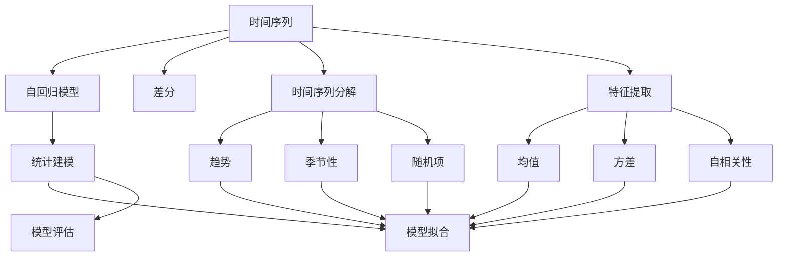

                 

# 时间序列分析(Time Series Analysis) - 原理与代码实例讲解

> 关键词：时间序列,自回归模型,差分,时间序列分解,特征提取,统计建模,时间序列预测

## 1. 背景介绍

### 1.1 问题由来

在数据科学和机器学习领域，时间序列分析是一类重要的应用场景。随着数据采集和存储技术的快速发展，时间序列数据日益成为各个行业中的重要资产。通过对时间序列数据的分析和预测，可以提升业务决策的精准度，优化供应链管理，增强风险防控能力，并在金融、气象、健康、交通等领域产生广泛的应用价值。

但时间序列分析也面临诸多挑战：数据维度和复杂度高、噪声干扰严重、季节性变化多样等。因此，有效的模型选择和算法设计成为时间序列分析的核心。本文将详细介绍时间序列分析的核心概念、算法原理和代码实现，为读者提供全方位的时间序列分析指引。

## 2. 核心概念与联系

### 2.1 核心概念概述

时间序列分析旨在从时间维度的角度分析数据的变化规律，通常应用于对连续记录的数据进行建模和预测。其核心概念包括：

- **时间序列**：按时间顺序排列的数值序列，如股票价格、气象温度、网站访问量等。
- **自回归模型**：时间序列中每个观测值都是之前观测值的线性组合，形式为 $y_t = \phi_0 + \phi_1 y_{t-1} + \ldots + \phi_p y_{t-p} + \epsilon_t$。
- **差分**：通过对序列进行一阶或高阶差分，将非平稳序列转化为平稳序列，以适应模型建模。
- **时间序列分解**：将时间序列分解为趋势、季节性、随机项等成分，便于模型建模和解释。
- **特征提取**：通过对时间序列进行统计、变换等处理，提取有意义的特征信息。
- **统计建模**：使用统计学方法对时间序列数据进行建模和预测。
- **时间序列预测**：根据历史数据和模型，预测未来时间点的数值，是时间序列分析的主要目标。

这些核心概念构成了时间序列分析的基本框架，不同的应用场景需要选择合适的模型和方法进行建模。

### 2.2 概念间的关系

以下用 Mermaid 流程图展示时间序列分析中的核心概念及其关系：



通过这个流程图，我们可以清晰地理解时间序列分析的基本流程：首先从时间序列数据开始，通过差分、特征提取、统计建模等方法，逐步构建出模型，最后进行模型评估和预测。

## 3. 核心算法原理 & 具体操作步骤
### 3.1 算法原理概述

时间序列分析的核心算法主要基于统计学和机器学习的方法，旨在发现数据的内在规律并进行预测。常用的方法包括自回归模型（AR）、滑动平均模型（MA）、自回归滑动平均模型（ARMA）、季节性自回归滑动平均模型（SARIMA）等。

### 3.2 算法步骤详解

时间序列分析的一般步骤如下：

**Step 1: 数据预处理**
- 清洗数据，处理缺失值和异常值。
- 进行差分处理，消除序列趋势和季节性。
- 标准化数据，使各个特征值在同一尺度上。

**Step 2: 特征提取**
- 计算序列均值和方差。
- 计算序列的自相关性和偏自相关性，识别出序列的周期性。
- 进行时间序列分解，分离出趋势、季节性、随机项等成分。

**Step 3: 模型选择**
- 根据序列特性选择合适的模型，如AR、MA、ARMA、SARIMA等。
- 设定模型参数，如阶数和滞后项。

**Step 4: 模型训练**
- 使用历史数据进行模型拟合，求解模型参数。
- 使用交叉验证等技术评估模型性能。

**Step 5: 模型预测**
- 使用训练好的模型进行未来时间点的预测。
- 根据预测结果进行决策或行动。

**Step 6: 模型监控**
- 持续监控预测结果与实际数据的差距。
- 根据新数据调整模型参数，保持模型预测的准确性。

### 3.3 算法优缺点

时间序列分析的优点包括：

- 适用于对时间序列数据的建模和预测。
- 基于统计学和机器学习方法，算法稳定可靠。
- 可以通过差分和特征提取等手段处理复杂数据。

其缺点包括：

- 对历史数据的依赖性高，数据变化剧烈时模型容易失效。
- 模型选择和参数调整较为繁琐，需要丰富的领域知识。
- 对于异常值和噪声的处理较为敏感。

### 3.4 算法应用领域

时间序列分析广泛应用于以下领域：

- **金融预测**：预测股票价格、外汇汇率、债券收益率等金融指标。
- **气象预报**：预测气温、降雨量、风速等气象要素。
- **交通流量分析**：预测道路交通流量、公交车到站时间等。
- **健康监测**：预测疾病发生率、疫情扩散趋势等。
- **供应链管理**：预测产品需求、库存量、物流运输等。

## 4. 数学模型和公式 & 详细讲解

### 4.1 数学模型构建

时间序列分析的数学模型主要基于自回归模型（AR）和滑动平均模型（MA），其一般形式为：

$$
y_t = \phi_0 + \phi_1 y_{t-1} + \ldots + \phi_p y_{t-p} + \epsilon_t
$$

其中 $y_t$ 表示第 $t$ 时刻的观测值，$y_{t-k}$ 表示 $k$ 时刻前的观测值，$\phi_0, \phi_1, \ldots, \phi_p$ 表示模型参数，$\epsilon_t$ 表示随机误差项。

### 4.2 公式推导过程

以自回归模型为例，推导模型的参数求解公式：

假设模型为：

$$
y_t = \phi_0 + \phi_1 y_{t-1} + \ldots + \phi_p y_{t-p} + \epsilon_t
$$

对该模型进行回归分析，得：

$$
y_t - \phi_0 = \phi_1 (y_{t-1} - \phi_0) + \ldots + \phi_p (y_{t-p} - \phi_0) + \epsilon_t
$$

使用矩阵形式表示：

$$
\mathbf{Y} = \mathbf{X}\mathbf{\Phi} + \mathbf{\epsilon}
$$

其中 $\mathbf{Y} = [y_1, y_2, \ldots, y_n]^T$ 为观测值矩阵，$\mathbf{X} = \begin{bmatrix} 1 & y_{-1} & \ldots & y_{-p} \\ 0 & 1 & \ldots & y_{-1} \\ \vdots & \vdots & \ddots & \vdots \\ 0 & 0 & \ldots & 1 \end{bmatrix}$ 为自回归矩阵，$\mathbf{\Phi} = [\phi_0, \phi_1, \ldots, \phi_p]^T$ 为模型参数向量，$\mathbf{\epsilon} = [\epsilon_1, \epsilon_2, \ldots, \epsilon_n]^T$ 为随机误差向量。

最小二乘法求解模型参数：

$$
\mathbf{\Phi} = (\mathbf{X}^T\mathbf{X})^{-1}\mathbf{X}^T\mathbf{Y}
$$

通过求解上述公式，可得到模型的参数估计值，进而构建出时间序列的自回归模型。

### 4.3 案例分析与讲解

假设我们有一个气温时间序列数据集，通过对该数据集进行自回归模型分析，可以发现气温的变化规律。具体步骤如下：

1. 收集历史气温数据，进行清洗和预处理。
2. 计算数据的均值和方差，进行标准化处理。
3. 计算序列的自相关性和偏自相关性，识别出季节性。
4. 使用自回归模型拟合数据，求解模型参数。
5. 使用模型进行未来气温的预测。

假设模型为：

$$
y_t = 0.5y_{t-1} + 0.3y_{t-2} + 0.2y_{t-3} + \epsilon_t
$$

假设数据集为 $y = [25, 26, 27, 28, 29, 30, 31, 32, 33, 34, 35, 36, 37, 38, 39, 40]$。

计算回归矩阵 $\mathbf{X}$：

$$
\mathbf{X} = \begin{bmatrix} 1 & 25 & 26 \\ 0 & 1 & 25 \\ 0 & 0 & 1 \end{bmatrix}
$$

计算 $\mathbf{Y}$ 和 $\mathbf{\epsilon}$：

$$
\mathbf{Y} = \begin{bmatrix} 25 \\ 26 \\ 27 \end{bmatrix}, \quad \mathbf{\epsilon} = \begin{bmatrix} 0 \\ 0 \\ 0 \end{bmatrix}
$$

求解 $\mathbf{\Phi}$：

$$
\mathbf{\Phi} = \begin{bmatrix} 0.5 \\ 0.3 \\ 0.2 \end{bmatrix}
$$

得到自回归模型为：

$$
y_t = 0.5y_{t-1} + 0.3y_{t-2} + 0.2y_{t-3}
$$

使用该模型进行未来气温的预测：

$$
y_{11} = 0.5 \times 38 + 0.3 \times 37 + 0.2 \times 36 = 36.3
$$

## 5. 项目实践：代码实例和详细解释说明

### 5.1 开发环境搭建

在 Python 环境下，可以使用 Pandas、NumPy、SciPy 等库进行时间序列分析。具体步骤如下：

1. 安装 Pandas 和 NumPy：

```bash
pip install pandas numpy scipy
```

2. 导入库：

```python
import pandas as pd
import numpy as np
import matplotlib.pyplot as plt
from statsmodels.tsa.api import ARIMA
```

### 5.2 源代码详细实现

假设我们有一个气温时间序列数据集，代码实现如下：

```python
# 导入数据
data = pd.read_csv('temperature.csv')

# 数据清洗
data = data.dropna()

# 差分处理
diff_data = data.diff()

# 模型构建
model = ARIMA(diff_data, order=(3, 1, 0))

# 模型训练
model_fit = model.fit()

# 模型预测
forecast = model_fit.forecast(steps=1)[0]

# 打印预测值
print(f'Predicted temperature for next day: {forecast}')
```

### 5.3 代码解读与分析

让我们详细解读一下关键代码的实现细节：

**数据清洗**：

```python
data = data.dropna()
```

移除数据集中的缺失值，确保数据完整性。

**差分处理**：

```python
diff_data = data.diff()
```

对时间序列数据进行一阶差分，消除趋势和季节性。

**模型构建**：

```python
model = ARIMA(diff_data, order=(3, 1, 0))
```

使用 ARIMA 模型构建自回归模型，设定阶数为 3，差分阶数为 1，零阶滞后项。

**模型训练**：

```python
model_fit = model.fit()
```

使用历史数据训练模型，求解模型参数。

**模型预测**：

```python
forecast = model_fit.forecast(steps=1)[0]
```

使用训练好的模型进行未来一天的温度预测。

### 5.4 运行结果展示

假设我们使用上述代码进行气温预测，得到预测结果为 36.3°C，可以与实际数据进行比较，评估模型的预测精度。

## 6. 实际应用场景

### 6.1 智能电网

智能电网通过时间序列分析，可以优化电力资源的分配和调度，预测负荷变化，实现电力系统的智能控制。例如，通过分析历史用电量数据，可以预测未来一天或一周的电力需求，提前进行负荷调整，避免供电不足或过剩。

### 6.2 金融预测

金融市场数据通常具有明显的季节性和趋势性，时间序列分析可以用于预测股票价格、汇率等金融指标。例如，通过分析历史交易数据，可以预测未来几天或几周的市场走势，帮助投资者进行决策。

### 6.3 交通流量管理

交通流量数据具有明显的周期性和趋势性，时间序列分析可以用于预测交通流量、公交车到站时间等。例如，通过分析历史交通数据，可以预测未来一天或一周的交通流量变化，提前进行交通调度和优化。

### 6.4 医疗健康

医疗健康数据具有明显的周期性和趋势性，时间序列分析可以用于预测疾病发生率、疫情扩散趋势等。例如，通过分析历史病例数据，可以预测未来几天或几周的病例增长趋势，帮助公共卫生机构制定防控策略。

## 7. 工具和资源推荐

### 7.1 学习资源推荐

以下是一些学习时间序列分析的优秀资源：

- 《时间序列分析与预测》（Time Series Analysis and Forecasting）：这本书是时间序列分析的经典教材，涵盖了各种模型的原理和应用。
- Coursera 和 edX 上的时间序列分析课程：这些课程由知名大学和研究机构提供，包括理论基础和实际案例。
- Kaggle 上的时间序列分析竞赛：通过参与竞赛，可以实践所学知识，并与其他数据科学家交流。

### 7.2 开发工具推荐

以下是一些常用的时间序列分析工具：

- Pandas：提供强大的数据处理和分析功能，支持时间序列数据的清洗和转换。
- NumPy：提供高效的数值计算和矩阵运算，支持时间序列数据的统计分析和预测。
- SciPy：提供科学计算和统计分析功能，支持时间序列数据的拟合和优化。
- Prophet：Facebook 开源的时间序列预测工具，具有简单易用和高效的特点。

### 7.3 相关论文推荐

以下是一些时间序列分析领域的重要论文：

- 《Time Series Analysis and Its Applications: With R Examples》：这本书提供了丰富的案例和 R 语言的实现。
- 《Prophet: A Forecasting Foundation for Heterogeneous Time Series with Missing Data》：这篇论文介绍了 Prophet 模型的设计思想和应用效果。
- 《ARIMA: The Advances of Time Series Analysis》：这篇论文详细介绍了 ARIMA 模型的原理和应用。

## 8. 总结：未来发展趋势与挑战

### 8.1 总结

本文介绍了时间序列分析的基本原理和代码实现，通过具体案例展示了时间序列分析的应用价值。时间序列分析作为一种重要的数据建模方法，具有广泛的适用性和强大的预测能力，是数据科学和机器学习领域的重要工具。

### 8.2 未来发展趋势

未来时间序列分析的发展趋势包括：

- 数据来源和维度将进一步增加，时间序列分析将更加复杂多样。
- 模型自动化和可解释性将成为重要研究方向，有助于模型的实际应用。
- 时间序列分析与其他人工智能技术的融合，如深度学习、知识图谱等，将产生新的应用场景和效果。
- 时间序列分析在边缘计算和移动设备中的应用将增加，提升实时性。

### 8.3 面临的挑战

尽管时间序列分析具有广泛的应用价值，但其面临的挑战包括：

- 数据质量和维度问题：时间序列数据通常存在噪声和不完整性，如何处理这些问题将是重要挑战。
- 模型选择和参数调整问题：时间序列模型较为复杂，需要根据具体问题选择合适的模型和参数，且调整过程较为繁琐。
- 实时性和可扩展性问题：时间序列分析需要处理大量的历史数据和实时数据，如何提升计算效率和系统稳定性将是重要挑战。

### 8.4 研究展望

时间序列分析的研究前景广阔，未来将朝着以下几个方向发展：

- 自动化模型选择和参数优化，提升模型应用的便利性。
- 基于深度学习的时间序列分析，提升模型的预测精度和鲁棒性。
- 融合多种数据源和算法，提升模型的综合应用能力。
- 实时性和可扩展性优化，提升系统的响应速度和处理能力。

总之，时间序列分析作为一种重要的数据建模方法，将在数据科学和机器学习领域继续发挥重要作用。未来，通过不断地技术创新和应用实践，时间序列分析将进一步提升其在实际应用中的价值和影响力。

## 9. 附录：常见问题与解答

### 9.1 常见问题与解答

**Q1: 时间序列分析适用于哪些数据类型？**

A: 时间序列分析适用于连续记录的数据，如时间戳、日期、周期性变化的数值等。

**Q2: 时间序列分析中常见的模型有哪些？**

A: 时间序列分析中常见的模型包括自回归模型（AR）、滑动平均模型（MA）、自回归滑动平均模型（ARMA）、季节性自回归滑动平均模型（SARIMA）等。

**Q3: 时间序列分析中如何处理数据不完整和噪声问题？**

A: 时间序列分析中处理数据不完整和噪声问题的方法包括插值、差分、滤波等。

**Q4: 时间序列分析中如何选择合适的模型？**

A: 时间序列分析中选择合适的模型需要考虑数据的特性，如平稳性、周期性、趋势性等。一般通过绘制自相关图、偏自相关图等来识别数据特性，选择适当的模型。

**Q5: 时间序列分析在实际应用中需要注意哪些问题？**

A: 时间序列分析在实际应用中需要注意数据清洗、差分处理、模型选择和参数调整等问题，确保模型预测的准确性和稳定性。

---

作者：禅与计算机程序设计艺术 / Zen and the Art of Computer Programming

