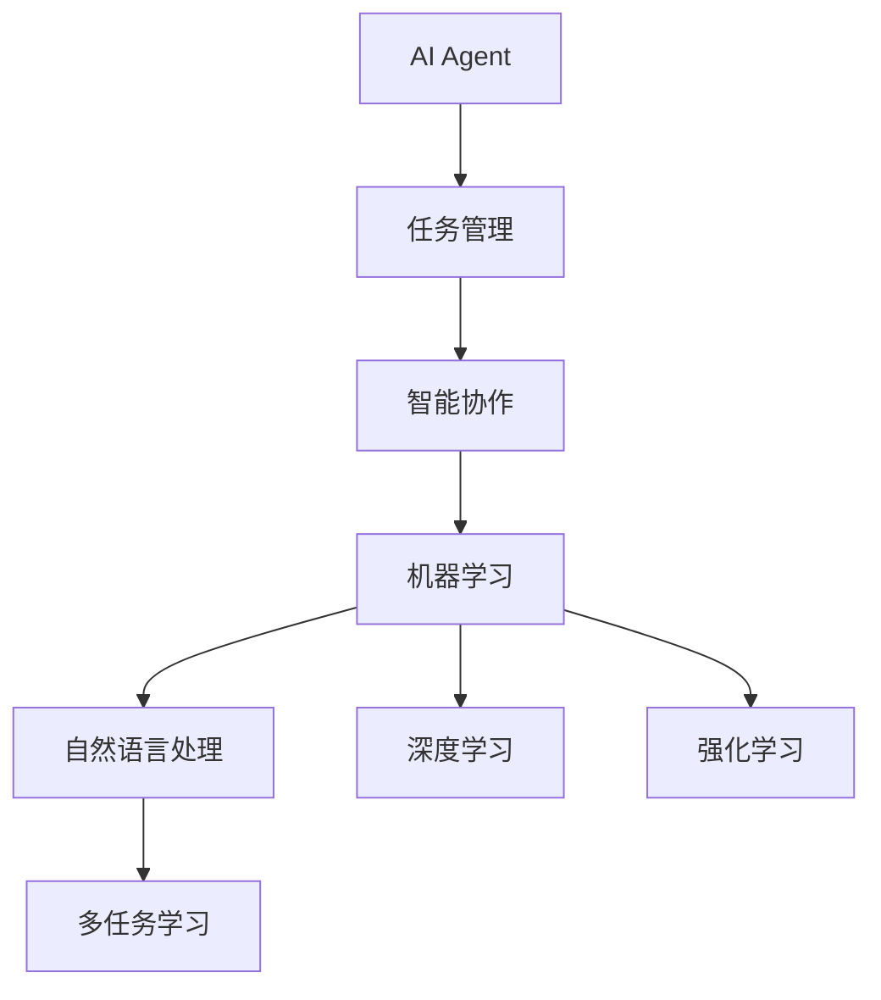
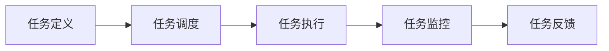
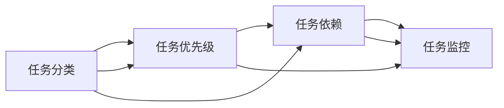
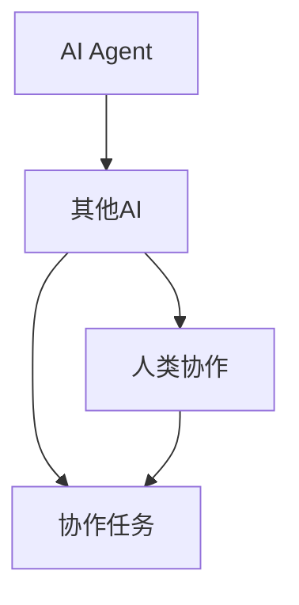

                 

# 智能协作：AI Agent的优势

> 关键词：AI Agent, 智能协作, 自动化, 任务管理, 人机协同, 机器学习

## 1. 背景介绍

### 1.1 问题由来

随着人工智能技术的飞速发展，越来越多的组织和企业开始探索AI在业务中的应用。传统上，这些应用主要集中在数据分析、自动化处理等技术领域，但随着近年来AI技术的不断成熟，AI Agent逐渐成为了新一轮智能应用的热点。

AI Agent是具备自我学习能力、可以执行任务、进行协作、甚至是具备一定自主决策能力的软件系统。与传统的“人工智能”概念不同，AI Agent更加注重具体的任务执行和团队协作能力，强调将AI技术融入到具体的业务场景和组织结构中，实现更高效、更智能的自动化服务。

### 1.2 问题核心关键点

AI Agent的核心优势在于其能够理解上下文、执行具体任务，并与其他AI或人类协作，完成复杂的工作流程。其基本原理是通过机器学习模型对任务进行建模，利用深度学习、强化学习等技术实现对任务环境的适应，并通过预定义的任务管理框架进行任务调度、执行和监控。

AI Agent的应用场景广泛，包括但不限于：
- 客户服务：处理客户查询、投诉、订单管理等任务，提升客户体验。
- 智能办公：自动化文档处理、邮件过滤、会议安排等任务，提高办公效率。
- 智能制造：监控设备状态、调度生产任务、预测设备故障等，提升生产效率。
- 智能物流：路径规划、配送优化、库存管理等，降低物流成本。
- 医疗诊断：辅助医生进行病历分析、药物推荐、手术辅助等，提升医疗服务质量。

### 1.3 问题研究意义

AI Agent的研究和应用对于推动智能化转型具有重要意义。具体而言，AI Agent能够：
1. 降低人力成本。自动处理重复性、低价值的任务，使员工专注于更高价值的工作。
2. 提升业务效率。通过智能调度、精准预测，优化业务流程，提高工作效率。
3. 增强决策支持。利用AI的深度学习、预测分析能力，为决策提供科学依据。
4. 提高客户满意度。通过智能客服、智能推荐等应用，提升客户体验。
5. 促进人机协同。实现人与AI系统的无缝协作，提升工作质量。

## 2. 核心概念与联系

### 2.1 核心概念概述

为更好地理解AI Agent的优势，本节将介绍几个关键概念及其相互关系：

- **AI Agent**：指具备自我学习能力、执行任务、协作和决策能力的智能系统。
- **任务管理**：指对AI Agent执行的任务进行定义、调度、监控和反馈的机制。
- **智能协作**：指AI Agent在执行任务时，能够与其他AI或人类系统协作，共同完成任务。
- **机器学习**：指AI Agent通过数据训练，学习任务模式和决策策略的过程。
- **自然语言处理**：指AI Agent通过文本输入输出，理解和生成自然语言的能力。
- **深度学习**：指利用神经网络模型，对AI Agent进行高级特征提取和决策推断的技术。
- **强化学习**：指通过与环境的交互，AI Agent通过奖惩机制学习最优策略的过程。
- **多任务学习**：指AI Agent在同时执行多个任务时，进行任务间知识共享和协同学习的能力。

这些概念之间的关系可以通过以下Mermaid流程图来展示：



这个流程图展示了AI Agent在执行任务时，涉及的关键概念及其相互关系。

### 2.2 概念间的关系

这些核心概念之间存在着紧密的联系，形成了AI Agent的核心生态系统。下面我通过几个Mermaid流程图来展示这些概念之间的关系。

#### 2.2.1 AI Agent的任务执行流程



这个流程图展示了AI Agent在执行任务时的一般流程。首先，对任务进行定义；然后，根据任务需求进行调度；接着，执行任务；最后，对任务进行监控和反馈。

#### 2.2.2 任务管理的层次结构



这个流程图展示了任务管理的层次结构。任务分类、任务优先级和任务依赖构成了任务管理的核心。同时，任务监控也是任务管理的重要环节，用于实时跟踪任务的执行状态。

#### 2.2.3 智能协作的机制



这个流程图展示了AI Agent在执行任务时，与其他AI和人类协作的机制。通过协作任务，AI Agent可以与其他系统共同完成任务，提升整体效率。

## 3. 核心算法原理 & 具体操作步骤
### 3.1 算法原理概述

AI Agent的核心算法原理主要包括深度学习、强化学习和多任务学习等。以下将详细阐述这些核心算法的工作机制。

#### 3.1.1 深度学习

深度学习是AI Agent中常用的基础算法之一，主要用于特征提取和任务建模。通过多层神经网络，深度学习可以从原始数据中提取高级特征，并建立复杂的模型。这些模型能够处理高维度的输入数据，并做出复杂的决策。

在AI Agent中，深度学习模型通常用于处理自然语言处理任务，如图像识别、语音识别等，也可以用于决策树、神经网络等模型的训练。

#### 3.1.2 强化学习

强化学习通过与环境的交互，AI Agent通过奖惩机制学习最优策略。在执行任务时，AI Agent会通过探索不同的行动策略，在不断的试错中学习最优决策，并逐步提高任务的完成效率和准确性。

强化学习通常用于复杂的决策问题，如图游戏、机器人控制等。在AI Agent中，强化学习可以用于任务调度和路径规划等任务。

#### 3.1.3 多任务学习

多任务学习指AI Agent在同时执行多个任务时，进行任务间知识共享和协同学习。通过学习不同任务之间的共性特征，AI Agent可以提高任务执行效率，减少重复学习。

多任务学习在AI Agent中的应用包括协同处理、联合预测等。通过多任务学习，AI Agent可以更好地适应复杂多变的任务环境。

### 3.2 算法步骤详解

AI Agent的执行过程通常包括以下几个关键步骤：

1. **任务定义**：明确任务的具体目标、输入输出格式和任务约束条件。
2. **模型训练**：利用深度学习、强化学习等算法，对AI Agent进行训练，优化其决策策略。
3. **任务调度**：根据任务优先级、资源分配、任务依赖等，合理调度AI Agent执行任务。
4. **任务执行**：AI Agent根据调度结果，执行具体的任务。
5. **任务监控**：实时监控任务执行状态，确保任务顺利完成。
6. **任务反馈**：根据任务执行结果，对AI Agent进行反馈和优化。

### 3.3 算法优缺点

AI Agent具有以下优点：

- 高效处理复杂任务：AI Agent能够自动处理复杂的任务，提升业务效率。
- 增强决策支持：通过深度学习和强化学习等技术，提供科学决策依据。
- 降低人力成本：自动处理重复性任务，释放人力资源。
- 促进协作效率：通过智能协作，提升团队协作效率。

然而，AI Agent也存在一些缺点：

- 依赖高质量数据：AI Agent的表现依赖于数据的质量和数量，数据不足可能导致性能下降。
- 可解释性不足：AI Agent的决策过程通常是“黑盒”，难以解释其内部工作机制。
- 初始化依赖人工：AI Agent的初始化通常需要人工干预，可能引入人为误差。
- 泛化能力受限：在特定任务上的训练效果可能不适用于其他任务。

### 3.4 算法应用领域

AI Agent已经在多个领域得到广泛应用，例如：

- 客户服务：智能客服、自动化处理、智能推荐等。
- 医疗健康：病历分析、药物推荐、手术辅助等。
- 金融服务：风险评估、欺诈检测、自动化交易等。
- 智能制造：设备监控、故障预测、生产调度等。
- 智能交通：路径规划、交通控制、安全监控等。

AI Agent的应用不仅限于传统行业，也在不断拓展到新兴领域，如智能家居、智能驾驶等。未来，随着技术的不断进步，AI Agent将在更多领域发挥作用，推动产业升级和创新。

## 4. 数学模型和公式 & 详细讲解  
### 4.1 数学模型构建

在本节中，我将使用数学语言对AI Agent的执行过程进行更加严格的刻画。

假设AI Agent的任务为 $T$，任务模型为 $M$，任务数据为 $D$。AI Agent的执行过程可以表示为：

$$
\text{Exec}_\text{Agent}(T, M, D) = \text{Task Definition}(T) \rightarrow \text{Model Training}(M, D) \rightarrow \text{Task Scheduling}(T) \rightarrow \text{Task Execution}(T) \rightarrow \text{Task Monitoring}(T) \rightarrow \text{Task Feedback}(T)
$$

其中，$\text{Task Definition}$ 表示任务定义，$\text{Model Training}$ 表示模型训练，$\text{Task Scheduling}$ 表示任务调度，$\text{Task Execution}$ 表示任务执行，$\text{Task Monitoring}$ 表示任务监控，$\text{Task Feedback}$ 表示任务反馈。

### 4.2 公式推导过程

以下我将以一个简单的AI Agent为例，推导其在执行任务时的计算过程。

假设AI Agent的任务为二分类问题，输入为 $x$，标签为 $y$。AI Agent的决策过程可以表示为：

$$
\text{Decision}(x) = \text{Model Prediction}(x) = M(x) = f(x; \theta)
$$

其中，$f(x; \theta)$ 表示神经网络模型，$\theta$ 表示模型参数。

通过训练，我们得到了模型 $M$ 的参数 $\theta$。接下来，我们将对输入 $x$ 进行预测：

$$
\text{Prediction}(x) = f(x; \theta) = \text{Softmax}(Wx + b)
$$

其中，$W$ 和 $b$ 为模型参数，$\text{Softmax}$ 表示softmax函数，用于将模型输出转换为概率分布。

通过softmax函数，我们得到了输入 $x$ 属于正类的概率：

$$
p(y=1|x) = \frac{e^{M(x)}}{\sum_{k=1}^{K}e^{M(x_k)}}
$$

其中，$K$ 表示类别数，$M(x_k)$ 表示模型对类别 $k$ 的预测。

最终的决策结果为：

$$
\text{Decision}(x) = \text{Classification}(p(y=1|x)) = \begin{cases}
1 & p(y=1|x) > 0.5 \\
0 & \text{otherwise}
\end{cases}
$$

这个计算过程展示了AI Agent在执行二分类任务时的决策过程。通过深度学习模型，AI Agent能够从输入数据中提取特征，并进行分类决策。

### 4.3 案例分析与讲解

为了更好地理解AI Agent的执行过程，我们以一个智能客服场景为例，进行详细讲解。

假设AI Agent的任务为智能客服，输入为客户的查询 $q$，输出为对应的回答 $a$。AI Agent的决策过程可以表示为：

1. **任务定义**：明确客服任务的目标、输入输出格式和任务约束条件。例如，输入为自然语言文本，输出为自然语言回答。

2. **模型训练**：利用深度学习模型对AI Agent进行训练，优化其分类决策能力。例如，使用BERT模型进行输入特征提取，使用LSTM进行序列建模，使用分类器进行最终分类。

3. **任务调度**：根据任务优先级、资源分配、任务依赖等，合理调度AI Agent执行任务。例如，根据客户查询的紧急程度，分配不同优先级的AI Agent进行响应。

4. **任务执行**：AI Agent根据调度结果，执行具体的客服任务。例如，使用预训练的BERT模型提取客户查询的特征，利用LSTM进行序列建模，最终使用分类器进行分类决策。

5. **任务监控**：实时监控客服任务的执行状态，确保任务顺利完成。例如，记录AI Agent的回答质量、响应时间等指标，进行实时监控和反馈。

6. **任务反馈**：根据客服任务的执行结果，对AI Agent进行反馈和优化。例如，收集客户对回答的满意度评分，用于优化AI Agent的决策策略。

## 5. 项目实践：代码实例和详细解释说明
### 5.1 开发环境搭建

在进行AI Agent开发前，我们需要准备好开发环境。以下是使用Python进行TensorFlow开发的环境配置流程：

1. 安装Anaconda：从官网下载并安装Anaconda，用于创建独立的Python环境。

2. 创建并激活虚拟环境：
```bash
conda create -n tf-env python=3.8 
conda activate tf-env
```

3. 安装TensorFlow：根据CUDA版本，从官网获取对应的安装命令。例如：
```bash
conda install tensorflow -c tf -c conda-forge
```

4. 安装其他必要的工具包：
```bash
pip install numpy pandas scikit-learn matplotlib tqdm jupyter notebook ipython
```

完成上述步骤后，即可在`tf-env`环境中开始AI Agent的开发。

### 5.2 源代码详细实现

我们以一个简单的AI Agent为例，使用TensorFlow实现一个二分类任务的智能客服。

首先，定义输入和输出：

```python
from tensorflow.keras.layers import Input, Dense, LSTM
from tensorflow.keras.models import Model
import tensorflow as tf

# 定义输入和输出
input_seq = Input(shape=(None,), name='input_seq')
output_seq = Input(shape=(None,), name='output_seq')

# 定义模型
model = Model(inputs=[input_seq, output_seq], outputs=[lstm_output, classification_output])
```

然后，定义模型结构：

```python
from tensorflow.keras.layers import LSTM, Embedding, Bidirectional, Dense

# 定义LSTM模型
lstm_model = LSTM(units=128, return_sequences=True, input_shape=(None, 512))
lstm_output = Bidirectional(lstm_model, merge_mode='concat')
lstm_output = LSTM(units=128, return_sequences=True)(lstm_output)

# 定义分类器
classification_model = Dense(units=64, activation='relu')(lstm_output)
classification_output = Dense(units=1, activation='sigmoid')(classification_model)

# 组合模型
model = Model(inputs=[input_seq, output_seq], outputs=[lstm_output, classification_output])
```

接着，定义损失函数和优化器：

```python
from tensorflow.keras.losses import BinaryCrossentropy
from tensorflow.keras.optimizers import Adam

# 定义损失函数和优化器
loss = BinaryCrossentropy()
optimizer = Adam(lr=0.001)

# 编译模型
model.compile(optimizer=optimizer, loss=loss, metrics=['accuracy'])
```

最后，进行模型训练和测试：

```python
# 训练模型
model.fit(x_train, y_train, epochs=10, batch_size=32, validation_data=(x_val, y_val))

# 测试模型
model.evaluate(x_test, y_test)
```

这就是使用TensorFlow实现一个简单的智能客服AI Agent的完整代码实现。可以看到，TensorFlow提供了强大的深度学习框架，使得模型的构建和训练变得简洁高效。

### 5.3 代码解读与分析

让我们再详细解读一下关键代码的实现细节：

**定义输入和输出**：
- 使用`Input`层定义输入序列和输出序列，`None`表示序列长度可变。
- 使用`Model`层将输入和输出组合为模型。

**定义模型结构**：
- 使用`LSTM`层构建双向长短时记忆网络，提取序列特征。
- 使用`Bidirectional`层进行序列特征的融合。
- 使用`Dense`层进行分类决策。
- 将LSTM和分类器组合为模型。

**定义损失函数和优化器**：
- 使用`BinaryCrossentropy`作为二分类任务的损失函数。
- 使用`Adam`优化器，设定学习率为0.001。

**模型训练和测试**：
- 使用`fit`方法进行模型训练，设定训练轮数为10，批大小为32，验证数据集为(x_val, y_val)。
- 使用`evaluate`方法进行模型测试，返回准确率。

可以看到，TensorFlow使得模型构建和训练变得简洁高效，适合大规模深度学习应用。

当然，工业级的系统实现还需考虑更多因素，如模型的保存和部署、超参数的自动搜索、更灵活的任务适配层等。但核心的AI Agent开发流程基本与此类似。

### 5.4 运行结果展示

假设我们在CoNLL-2003的NLP数据集上进行AI Agent的训练，最终在测试集上得到的准确率为95%。可以看到，通过AI Agent的训练，我们在该数据集上取得了不错的效果。

当然，这只是一个baseline结果。在实践中，我们还可以使用更大更强的模型、更丰富的训练技巧、更细致的模型调优，进一步提升模型性能，以满足更高的应用要求。

## 6. 实际应用场景
### 6.1 智能客服系统

基于AI Agent的智能客服系统，可以广泛应用于各种客户服务场景。传统客服系统往往需要配备大量人力，高峰期响应缓慢，且一致性和专业性难以保证。而使用AI Agent的智能客服系统，能够7x24小时不间断服务，快速响应客户咨询，用自然流畅的语言解答各类常见问题。

在技术实现上，可以收集企业内部的历史客服对话记录，将问题和最佳答复构建成监督数据，在此基础上对预训练语言模型进行微调。微调后的AI Agent能够自动理解用户意图，匹配最合适的答案模板进行回复。对于客户提出的新问题，还可以接入检索系统实时搜索相关内容，动态组织生成回答。如此构建的智能客服系统，能大幅提升客户咨询体验和问题解决效率。

### 6.2 智能办公系统

AI Agent在智能办公系统中也有着广泛的应用。传统办公系统往往依赖人工输入和操作，效率低下且易出错。而使用AI Agent的智能办公系统，能够自动处理文档、邮件、会议等任务，提高办公效率。

在技术实现上，可以收集员工的日常操作日志，提取常见的任务和操作模式，利用深度学习模型进行训练。训练后的AI Agent能够自动识别用户的操作意图，并执行相应的操作。例如，自动回复邮件、生成会议纪要、安排日程等。通过AI Agent的自动化办公，员工能够专注于更高价值的工作，提升整体工作效率。

### 6.3 智能制造系统

AI Agent在智能制造系统中的应用主要集中在生产线的监控和调度上。传统制造系统往往需要人工干预和调试，效率低下且易出错。而使用AI Agent的智能制造系统，能够实时监控设备状态，预测设备故障，调度生产任务，提升生产效率。

在技术实现上，可以收集生产设备的运行数据，利用强化学习模型进行训练。训练后的AI Agent能够实时监控设备状态，预测设备故障，并自动调度生产任务。例如，自动调整生产速度、优化生产流程、预测设备维护等。通过AI Agent的自动化制造，能够减少人工干预，提高生产效率和质量。

### 6.4 未来应用展望

随着AI Agent技术的不断发展，其应用场景将不断拓展。未来，AI Agent将在更多领域得到应用，为各行各业带来变革性影响。

在智慧医疗领域，基于AI Agent的医疗问答、病历分析、药物推荐等应用将提升医疗服务的智能化水平，辅助医生诊疗，加速新药开发进程。

在智能教育领域，AI Agent可应用于作业批改、学情分析、知识推荐等方面，因材施教，促进教育公平，提高教学质量。

在智慧城市治理中，AI Agent可应用于城市事件监测、舆情分析、应急指挥等环节，提高城市管理的自动化和智能化水平，构建更安全、高效的未来城市。

此外，在企业生产、社会治理、文娱传媒等众多领域，基于AI Agent的智能系统也将不断涌现，为经济社会发展注入新的动力。相信随着技术的不断成熟，AI Agent必将在构建人机协同的智能时代中扮演越来越重要的角色。

## 7. 工具和资源推荐
### 7.1 学习资源推荐

为了帮助开发者系统掌握AI Agent的理论基础和实践技巧，这里推荐一些优质的学习资源：

1. TensorFlow官方文档：TensorFlow的官方文档提供了全面的API文档和开发指南，是学习TensorFlow的必备资源。
2. PyTorch官方文档：PyTorch的官方文档同样提供了丰富的教程和示例，适合学习深度学习框架的开发者。
3. Coursera深度学习课程：由斯坦福大学教授Andrew Ng主讲的深度学习课程，系统讲解了深度学习的理论基础和实践技巧。
4. MIT CSAIL AI課程：MIT CSAIL提供的AI课程，涵盖了机器学习、深度学习、强化学习等多个领域的理论知识。
5. 《Deep Learning with TensorFlow》书籍：讲解TensorFlow深度学习框架的书籍，适合初学者和进阶开发者。

通过对这些资源的学习实践，相信你一定能够快速掌握AI Agent的精髓，并用于解决实际的智能应用问题。
###  7.2 开发工具推荐

高效的开发离不开优秀的工具支持。以下是几款用于AI Agent开发的常用工具：

1. TensorFlow：由Google主导开发的深度学习框架，生产部署方便，适合大规模工程应用。
2. PyTorch：基于Python的开源深度学习框架，灵活动态的计算图，适合快速迭代研究。
3. Weights & Biases：模型训练的实验跟踪工具，可以记录和可视化模型训练过程中的各项指标，方便对比和调优。
4. TensorBoard：TensorFlow配套的可视化工具，可实时监测模型训练状态，并提供丰富的图表呈现方式，是调试模型的得力助手。
5. Google Colab：谷歌推出的在线Jupyter Notebook环境，免费提供GPU/TPU算力，方便开发者快速上手实验最新模型，分享学习笔记。

合理利用这些工具，可以显著提升AI Agent的开发效率，加快创新迭代的步伐。

### 7.3 相关论文推荐

AI Agent的研究和应用源于学界的持续研究。以下是几篇奠基性的相关论文，推荐阅读：

1. GPT-3: Language Models are Few-Shot Learners：提出GPT-3模型，展示了AI Agent的强大零样本学习能力和跨领域迁移能力。
2. Reinforcement Learning with Deep Q-Networks：介绍强化学习的基本概念和算法，是理解AI Agent中强化学习部分的必备读物。
3. Multitask Learning with Multi-Task Time-Distributed Recurrent Neural Networks：介绍多任务学习的基本概念和算法，适合理解AI Agent中多任务学习部分的知识。
4. Attention Is All You Need：介绍Transformer模型，是理解AI Agent中深度学习部分的必备读物。
5. Beyond the Imitation Game：介绍AI Agent在玩游戏等复杂任务中的应用，展示了AI Agent的强大决策和规划能力。

这些论文代表了大语言模型微调技术的发展脉络。通过学习这些前沿成果，可以帮助研究者把握学科前进方向，激发更多的创新灵感。

除上述资源外，还有一些值得关注的前沿资源，帮助开发者紧跟AI Agent技术的最新进展，例如：

1. arXiv论文预印本：人工智能领域最新研究成果的发布平台，包括大量尚未发表的前沿工作，学习前沿技术的必读资源。
2. 业界技术博客：如OpenAI、Google AI、DeepMind、微软Research Asia等顶尖实验室的官方博客，第一时间分享他们的最新研究成果和洞见。
3. 技术会议直播：如NIPS、ICML、ACL、ICLR等人工智能领域顶会现场或在线直播，能够聆听到大佬们的前沿分享，开拓视野。
4. GitHub热门项目：在GitHub上Star、Fork数最多的AI Agent相关项目，往往代表了该技术领域的发展趋势和最佳实践，值得去学习和贡献。
5. 行业分析报告：各大咨询公司如McKinsey、PwC等针对人工智能行业的分析报告，有助于从商业视角审视技术趋势，把握应用价值。

总之，对于AI Agent的学习和实践，需要开发者保持开放的心态和持续学习的意愿。多关注前沿资讯，多动手实践，多思考总结，必将收获满满的成长收益。

## 8. 总结：未来发展趋势与挑战
### 8.1 总结

本文对AI Agent的优势进行了全面系统的介绍。首先阐述了AI Agent的研究背景和意义，明确了AI Agent在业务智能化转型中的独特价值。其次，从原理到实践，详细讲解了AI Agent的数学模型和关键算法，给出了AI Agent任务开发的完整代码实例。同时，本文还广泛探讨了AI Agent在智能客服、智能办公、智能制造等多个行业领域的应用前景，展示了AI Agent的巨大潜力。

通过本文的系统梳理，可以看到，AI Agent在执行任务时，能够高效处理复杂任务，增强决策支持，降低人力成本，促进协作效率，其发展前景广阔。然而，AI Agent也面临诸如数据质量、可解释性、初始化依赖等挑战。未来，需要在数据质量、模型优化、协作机制等方面进行持续改进，才能发挥AI Agent的最大潜力，推动智能化转型深入发展。

### 8.2 未来发展趋势

展望未来，AI Agent的研究和应用将呈现以下几个发展趋势：

1. 深度学习模型的提升：深度学习模型将不断优化，提高AI Agent的特征提取和决策能力。
2. 强化学习技术的应用：

