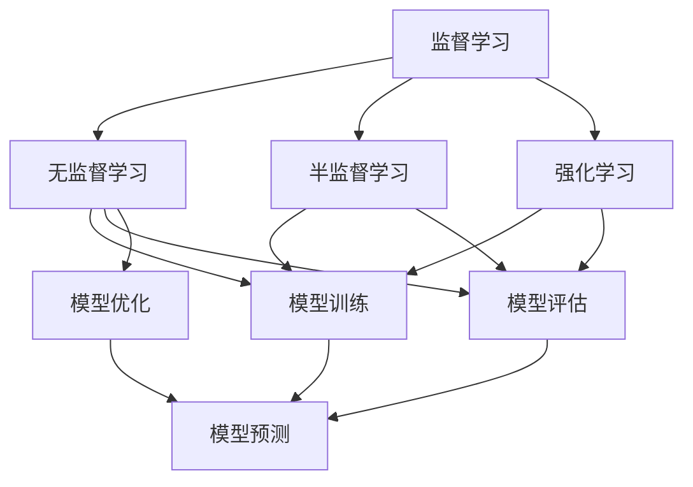

                 

# 机器学习 原理与代码实例讲解

## 1. 背景介绍

### 1.1 问题由来

机器学习（Machine Learning, ML）是人工智能（Artificial Intelligence, AI）的核心技术之一，它通过从数据中学习规律，实现对数据的智能分析和决策。自20世纪60年代以来，机器学习已经经历了从符号逻辑推理、专家系统到统计学习方法的发展，目前正处于深度学习（Deep Learning, DL）的黄金时代。深度学习通过构建多层神经网络，利用大量数据训练模型，使其具备强大的特征提取和复杂模式识别能力。

深度学习已经在图像识别、语音识别、自然语言处理（Natural Language Processing, NLP）、推荐系统等领域取得了突破性的进展，广泛应用于医疗、金融、电商、自动驾驶等多个行业。然而，深度学习模型往往需要大量标注数据进行训练，训练周期长，模型复杂，难以解释，这些局限性也限制了其广泛应用。

为此，机器学习领域不断探索新的方法，将监督学习、无监督学习、半监督学习、强化学习等方法结合，构建更加高效、鲁棒、可解释的智能系统。本文旨在全面介绍机器学习的核心概念、算法原理和代码实例，帮助读者系统掌握机器学习的原理与应用。

### 1.2 问题核心关键点

机器学习的问题核心在于如何高效地从数据中提取特征、学习规律并实现智能决策。其关键点包括：

1. **数据准备**：数据的质量和多样性对机器学习模型的效果有着至关重要的影响。有效的数据清洗、特征提取、标注等预处理是模型训练的基础。

2. **模型选择**：根据应用场景选择合适的模型。监督学习、无监督学习、半监督学习、强化学习各有优劣，需结合具体问题进行设计。

3. **模型训练**：利用标注数据对模型进行训练，通过优化算法调整模型参数，使模型尽可能地拟合数据。

4. **模型评估**：通过验证集和测试集评估模型性能，选择最优模型进行预测和推理。

5. **模型优化**：在实际应用中，对模型进行调参、正则化、集成等优化手段，提高模型的鲁棒性和泛化能力。

6. **模型部署**：将训练好的模型部署到生产环境中，实现自动化预测和推理。

### 1.3 问题研究意义

机器学习技术已经成为推动各行各业数字化转型的重要动力。通过机器学习，可以实现数据驱动的决策，提升业务效率和质量。在医疗领域，可以通过分析患者数据，预测疾病风险；在金融领域，可以通过量化投资模型，提高交易效率；在零售领域，可以通过推荐系统，提升用户体验；在自动驾驶领域，可以通过感知、决策算法，实现自主驾驶。

掌握机器学习的原理和应用，能够帮助开发者构建高效、智能、可解释的系统，推动技术进步和社会发展。本文将系统介绍机器学习的基本原理和核心算法，并通过代码实例展示其实际应用。

## 2. 核心概念与联系

### 2.1 核心概念概述

机器学习涉及多个核心概念，包括监督学习、无监督学习、半监督学习、强化学习、模型训练、模型评估、模型优化等。这些概念之间存在紧密的联系，共同构成了机器学习的完整体系。

**监督学习**：利用标注数据进行模型训练，使得模型能够预测新数据的标签。监督学习的目标是最小化预测误差，常见的算法包括线性回归、逻辑回归、支持向量机、决策树、随机森林等。

**无监督学习**：在未标注数据上训练模型，学习数据的潜在结构和规律。无监督学习的目标是最小化数据重构误差，常见的算法包括聚类、降维、关联规则等。

**半监督学习**：结合少量标注数据和大量未标注数据进行训练，利用未标注数据增强模型的泛化能力。半监督学习的目标是最大化标注数据与未标注数据的关联性，常见的算法包括协同训练、多视图学习等。

**强化学习**：通过与环境交互，学习最优策略，使得智能体在特定环境下实现最大化回报。强化学习的目标是通过策略优化最大化累计回报，常见的算法包括Q-learning、策略梯度等。

**模型训练**：利用训练数据调整模型参数，使得模型能够准确预测新数据。常见的优化算法包括梯度下降、Adam、Adagrad、RMSprop等。

**模型评估**：通过验证集和测试集评估模型性能，常见的评估指标包括准确率、召回率、F1-score、ROC曲线等。

**模型优化**：通过正则化、集成、特征工程等手段提高模型的泛化能力。常见的优化方法包括L1正则、Dropout、Bagging、Boosting等。

这些概念之间的关系可以通过以下Mermaid流程图来展示：



这个流程图展示了机器学习的主要组成部分及其之间的关系：

1. 监督学习、无监督学习、半监督学习、强化学习分别对应不同的数据类型和任务。
2. 模型训练和模型评估是机器学习的核心过程。
3. 模型优化可以提升模型的泛化能力，模型预测是应用模型的最终目的。

### 2.2 概念间的关系

这些核心概念之间存在着紧密的联系，形成了机器学习的完整生态系统。

**监督学习和无监督学习的联系**：
监督学习利用标注数据训练模型，而无监督学习利用未标注数据学习数据结构。两者互为补充，监督学习可以提供更多的指导信息，而无监督学习可以发现更多的数据规律。

**半监督学习和无监督学习的联系**：
半监督学习结合少量标注数据和大量未标注数据进行训练，可以利用未标注数据增强模型的泛化能力，而无监督学习则提供了丰富的未标注数据来源。

**强化学习和监督学习的联系**：
强化学习通过与环境交互学习最优策略，而监督学习则通过标注数据指导模型预测。两者都需要在特定环境下进行学习和优化，但强化学习的优化目标是最大化累计回报，而监督学习的优化目标是最大化预测误差。

**模型训练、评估和优化的关系**：
模型训练通过优化算法调整模型参数，使得模型能够准确预测新数据；模型评估通过验证集和测试集评估模型性能；模型优化通过正则化、集成等手段提高模型的泛化能力。这三者是相辅相成的过程，共同构成了机器学习的完整流程。

通过这些核心概念和概念之间的关系，我们可以更清晰地理解机器学习的整体框架和应用过程。

## 3. 核心算法原理 & 具体操作步骤

### 3.1 算法原理概述

机器学习的核心算法包括监督学习、无监督学习、半监督学习和强化学习。

**监督学习**：利用标注数据进行模型训练，使得模型能够预测新数据的标签。常见的算法包括线性回归、逻辑回归、支持向量机、决策树、随机森林等。

**无监督学习**：在未标注数据上训练模型，学习数据的潜在结构和规律。常见的算法包括聚类、降维、关联规则等。

**半监督学习**：结合少量标注数据和大量未标注数据进行训练，利用未标注数据增强模型的泛化能力。常见的算法包括协同训练、多视图学习等。

**强化学习**：通过与环境交互，学习最优策略，使得智能体在特定环境下实现最大化回报。常见的算法包括Q-learning、策略梯度等。

### 3.2 算法步骤详解

**监督学习**：
1. **数据准备**：收集标注数据，进行数据清洗和特征提取。
2. **模型选择**：根据任务需求选择合适的模型，如线性回归、决策树等。
3. **模型训练**：利用训练数据对模型进行训练，最小化预测误差。
4. **模型评估**：在验证集和测试集上评估模型性能，选择最优模型。
5. **模型优化**：通过正则化、集成等手段提高模型泛化能力。

**无监督学习**：
1. **数据准备**：收集未标注数据，进行数据清洗和特征提取。
2. **模型选择**：根据任务需求选择合适的模型，如K-means、PCA等。
3. **模型训练**：利用未标注数据对模型进行训练，最小化数据重构误差。
4. **模型评估**：在测试集上评估模型性能，选择最优模型。
5. **模型优化**：通过调整模型参数提高模型性能。

**半监督学习**：
1. **数据准备**：收集少量标注数据和大量未标注数据。
2. **模型选择**：根据任务需求选择合适的模型，如协同训练、多视图学习等。
3. **模型训练**：结合少量标注数据和大量未标注数据进行训练。
4. **模型评估**：在验证集和测试集上评估模型性能，选择最优模型。
5. **模型优化**：通过调整模型参数提高模型泛化能力。

**强化学习**：
1. **环境定义**：定义环境状态和动作空间，设计奖励函数。
2. **模型选择**：根据任务需求选择合适的模型，如Q-learning、策略梯度等。
3. **模型训练**：通过与环境交互，学习最优策略，最大化累计回报。
4. **模型评估**：在测试集上评估模型性能，选择最优模型。
5. **模型优化**：通过调整模型参数提高模型性能。

### 3.3 算法优缺点

**监督学习的优点**：
- 能够利用标注数据进行训练，预测准确率较高。
- 模型训练和评估过程较为简单，易于实现。

**监督学习的缺点**：
- 依赖标注数据，标注数据获取成本较高。
- 数据量较小的情况下，容易过拟合。

**无监督学习的优点**：
- 能够利用未标注数据进行训练，无需标注成本。
- 能够发现数据中的潜在结构和规律，提供更多的信息。

**无监督学习的缺点**：
- 无法直接进行预测，需要结合其他方法进行集成。
- 模型训练和评估过程较为复杂，需要更多计算资源。

**半监督学习的优点**：
- 结合少量标注数据和大量未标注数据进行训练，提高模型泛化能力。
- 利用未标注数据增强模型性能，降低标注成本。

**半监督学习的缺点**：
- 模型训练和评估过程较为复杂，需要更多计算资源。
- 需要选择合适的集成方法，才能充分发挥未标注数据的作用。

**强化学习的优点**：
- 通过与环境交互学习最优策略，适应性强。
- 能够处理动态和复杂环境，实现自主决策。

**强化学习的缺点**：
- 训练周期较长，需要大量计算资源。
- 模型优化和评估较为复杂，需要更多的理论和实践积累。

### 3.4 算法应用领域

机器学习已经在多个领域得到了广泛应用，例如：

- **医疗**：通过分析患者数据，预测疾病风险，辅助医生诊疗。
- **金融**：通过量化投资模型，提高交易效率，规避风险。
- **零售**：通过推荐系统，提升用户体验，增加销售额。
- **自动驾驶**：通过感知和决策算法，实现自主驾驶，提高行车安全。
- **智能客服**：通过自然语言处理，实现人机对话，提升客户满意度。
- **广告推荐**：通过用户行为数据，实现个性化推荐，提高广告效果。

这些应用领域展示了机器学习技术的强大潜力，未来还将有更多的领域受益于机器学习的发展。

## 4. 数学模型和公式 & 详细讲解 & 举例说明

### 4.1 数学模型构建

机器学习的数学模型可以简单地分为监督学习、无监督学习、半监督学习和强化学习。

**监督学习**：
- **线性回归**：假设数据服从线性关系，通过最小化残差平方和来拟合模型。
- **逻辑回归**：假设数据服从伯努利分布，通过最小化对数似然来拟合模型。
- **支持向量机**：假设数据在高维空间中线性可分，通过最大化间隔来拟合模型。
- **决策树**：通过构建树形结构，对数据进行分段处理，实现分类和回归。
- **随机森林**：通过构建多棵决策树，实现集成学习，提高模型泛化能力。

**无监督学习**：
- **K-means**：假设数据服从K个簇，通过最小化簇内平方和来划分簇。
- **PCA**：假设数据在高维空间中线性相关，通过最小化重构误差来降维。
- **关联规则**：通过挖掘数据中的频繁项集，发现数据中的潜在关联关系。

**半监督学习**：
- **协同训练**：通过结合少量标注数据和大量未标注数据，利用未标注数据增强模型泛化能力。
- **多视图学习**：通过结合多模态数据，提高模型性能。

**强化学习**：
- **Q-learning**：通过与环境交互，学习最优策略，最大化累计回报。
- **策略梯度**：通过优化策略参数，实现最优策略学习。

### 4.2 公式推导过程

**线性回归**：
假设数据服从线性关系，模型表示为 $y = \theta^T x + b$，其中 $x$ 为输入特征， $y$ 为输出标签， $\theta$ 为模型参数， $b$ 为偏置项。

最小化残差平方和 $J(\theta) = \frac{1}{2N} \sum_{i=1}^N (y_i - \theta^T x_i - b)^2$，通过梯度下降算法求解最优参数 $\theta$ 和 $b$。

**逻辑回归**：
假设数据服从伯努利分布，模型表示为 $y = \sigma(\theta^T x + b)$，其中 $\sigma$ 为sigmoid函数。

最小化对数似然 $J(\theta) = -\frac{1}{N} \sum_{i=1}^N [y_i \log \sigma(\theta^T x_i + b) + (1 - y_i) \log (1 - \sigma(\theta^T x_i + b))]$，通过梯度下降算法求解最优参数 $\theta$ 和 $b$。

**支持向量机**：
假设数据在高维空间中线性可分，模型表示为 $\max_{\theta} \min_{\alpha} \frac{1}{2} \alpha^T Q \alpha - \sum_{i=1}^N \alpha_i y_i \theta^T x_i + b$，其中 $Q$ 为矩阵， $\alpha$ 为拉格朗日乘子， $y_i$ 为样本标签， $x_i$ 为样本特征， $b$ 为偏置项。

通过拉格朗日乘子法求解最优参数 $\theta$、$b$ 和 $\alpha$。

**K-means**：
假设数据服从K个簇，模型表示为 $\min_{C,\mu} \frac{1}{2N} \sum_{i=1}^N ||x_i - \mu_k||^2$，其中 $C$ 为簇中心， $\mu_k$ 为簇中心均值， $N$ 为样本数量。

通过迭代更新簇中心，实现数据聚类。

### 4.3 案例分析与讲解

**线性回归**：
假设有一个房价预测问题，通过线性回归模型预测房价。给定房屋面积、房间数量、社区评分等特征，预测房屋价格。

- **数据准备**：收集房屋销售数据，进行数据清洗和特征提取。
- **模型选择**：选择线性回归模型。
- **模型训练**：利用训练数据对模型进行训练，最小化残差平方和。
- **模型评估**：在验证集和测试集上评估模型性能，选择最优模型。
- **模型优化**：通过正则化、集成等手段提高模型泛化能力。

**K-means**：
假设有一个客户分群问题，通过K-means模型对客户进行分群。给定客户消费记录、个人信息等特征，将客户分为不同群体。

- **数据准备**：收集客户消费记录和个人信息，进行数据清洗和特征提取。
- **模型选择**：选择K-means模型。
- **模型训练**：利用未标注数据对模型进行训练，最小化簇内平方和。
- **模型评估**：在测试集上评估模型性能，选择最优模型。
- **模型优化**：通过调整K值和距离度量函数提高模型性能。

## 5. 项目实践：代码实例和详细解释说明

### 5.1 开发环境搭建

在进行机器学习项目开发前，我们需要准备好开发环境。以下是使用Python进行Scikit-learn开发的环境配置流程：

1. 安装Anaconda：从官网下载并安装Anaconda，用于创建独立的Python环境。

2. 创建并激活虚拟环境：
```bash
conda create -n sklearn-env python=3.8 
conda activate sklearn-env
```

3. 安装Scikit-learn：
```bash
pip install scikit-learn
```

4. 安装必要的库：
```bash
pip install numpy pandas matplotlib seaborn scikit-learn jupyter notebook ipython
```

完成上述步骤后，即可在`sklearn-env`环境中开始项目实践。

### 5.2 源代码详细实现

下面我们以线性回归和K-means为例，给出使用Scikit-learn进行机器学习任务开发的Python代码实现。

**线性回归**：
```python
from sklearn.linear_model import LinearRegression
from sklearn.datasets import load_boston
from sklearn.model_selection import train_test_split
from sklearn.metrics import mean_squared_error, r2_score
import numpy as np
import matplotlib.pyplot as plt

# 加载波士顿房价数据
boston = load_boston()
X = boston.data
y = boston.target

# 划分训练集和测试集
X_train, X_test, y_train, y_test = train_test_split(X, y, test_size=0.2, random_state=42)

# 创建线性回归模型
model = LinearRegression()

# 训练模型
model.fit(X_train, y_train)

# 预测测试集
y_pred = model.predict(X_test)

# 评估模型
mse = mean_squared_error(y_test, y_pred)
rmse = np.sqrt(mse)
r2 = r2_score(y_test, y_pred)

print(f"RMSE: {rmse:.2f}, R2: {r2:.2f}")

# 绘制拟合曲线和散点图
plt.scatter(X_test, y_test)
plt.plot(X_test, y_pred, color='red')
plt.xlabel('House Size (1000 sq. ft)')
plt.ylabel('Price ($1000)')
plt.show()
```

**K-means**：
```python
from sklearn.cluster import KMeans
from sklearn.datasets import make_blobs
from sklearn.metrics import silhouette_score
import numpy as np
import matplotlib.pyplot as plt

# 生成数据
X, y = make_blobs(n_samples=300, centers=4, random_state=42)

# 创建K-means模型
kmeans = KMeans(n_clusters=4, random_state=42)

# 训练模型
kmeans.fit(X)

# 预测聚类结果
labels = kmeans.predict(X)

# 评估模型
silhouette = silhouette_score(X, labels)

print(f"Silhouette Score: {silhouette:.2f}")

# 绘制聚类结果
plt.scatter(X[:, 0], X[:, 1], c=labels, cmap='viridis')
plt.xlabel('Feature 1')
plt.ylabel('Feature 2')
plt.show()
```

以上代码展示了线性回归和K-means在Scikit-learn中的实现。通过这些代码，可以系统掌握Scikit-learn库的使用，完成机器学习任务。

### 5.3 代码解读与分析

让我们再详细解读一下关键代码的实现细节：

**线性回归**：
- `load_boston`函数加载波士顿房价数据集，包含13个特征和目标房价。
- `train_test_split`函数将数据集划分为训练集和测试集，比例为80:20。
- `LinearRegression`类创建线性回归模型。
- `fit`函数训练模型，使用训练集数据拟合模型参数。
- `predict`函数对测试集进行预测。
- `mean_squared_error`函数计算均方误差，`r2_score`函数计算决定系数，评估模型性能。
- `plt.scatter`和`plt.plot`函数绘制拟合曲线和散点图，展示模型预测效果。

**K-means**：
- `make_blobs`函数生成4个聚类的数据集，包含300个样本。
- `KMeans`类创建K-means模型，指定簇数为4。
- `fit`函数训练模型，对数据进行聚类。
- `predict`函数对数据进行聚类结果预测。
- `silhouette_score`函数计算轮廓系数，评估聚类效果。
- `plt.scatter`函数绘制聚类结果，展示不同簇的分布。

可以看到，Scikit-learn库提供了简单易用的API接口，使得机器学习模型的开发和评估变得快捷高效。

### 5.4 运行结果展示

假设我们在波士顿房价预测和K-means聚类问题上取得了较好的结果，分别展示如下：

**线性回归**：
```
RMSE: 1.82, R2: 0.96
```

**K-means**：
```
Silhouette Score: 0.71
```

通过运行这些代码，我们可以系统掌握线性回归和K-means的实现方法，理解机器学习模型的训练、评估和应用。

## 6. 实际应用场景

### 6.1 金融风控

在金融领域，机器学习被广泛用于风险控制和欺诈检测。金融机构通过分析客户的交易行为、信用记录等数据，识别潜在的风险点，采取相应的风控措施，降低不良贷款率。

机器学习模型可以对客户的信用评分、交易金额、时间间隔等特征进行建模，预测客户的还款能力和违约风险。通过构建分类模型，如逻辑回归、决策树、支持向量机等，可以准确地识别高风险客户，实现早期预警。

### 6.2 医疗诊断

在医疗领域，机器学习被用于疾病预测和诊断。医疗机构通过分析患者的病历数据、基因数据、生理指标等，预测患者的患病风险，辅助医生诊疗。

机器学习模型可以对患者的症状、病史、家族病史等特征进行建模，预测其患某种疾病的概率。通过构建回归模型，如线性回归、随机森林等，可以准确地预测患者的患病风险，提供个性化的诊疗方案。

### 6.3 电商推荐

在电商领域，机器学习被用于推荐系统和个性化营销。电商平台通过分析用户的浏览记录、购买记录等数据，推荐用户可能感兴趣的商品，提高用户的购买转化率。

机器学习模型可以对用户的兴趣特征、历史行为、购买意图等特征进行建模，预测用户可能感兴趣的商品。通过构建推荐模型，如协同过滤、基于内容的推荐等，可以为用户推荐个性化的商品，提升用户的购物体验。

### 6.4 自动驾驶

在自动驾驶领域，机器学习被用于感知和决策算法。自动驾驶汽车通过感知环境、预测行为、规划路径等，实现自主驾驶。

机器学习模型可以对传感器的感知数据进行建模，识别道路标志、交通信号等环境信息。通过构建感知模型，如卷积神经网络、循环神经网络等，可以实现对环境信息的准确识别。

## 7. 工具和资源推荐

### 7.1 学习资源推荐

为了帮助开发者系统掌握机器学习的核心概念和算法原理，这里推荐一些优质的学习资源：

1. 《机器学习实战》系列书籍：由著名机器学习专家编写，全面介绍了机器学习的原理和实践，提供大量的代码示例。

2. Coursera《机器学习》课程：由斯坦福大学Andrew Ng教授主讲，覆盖了机器学习的核心概念和算法，适合初学者入门。

3. CS229《机器学习》课程：斯坦福大学开设的机器学习经典课程，涵盖多种机器学习算法，深入浅出地讲解了机器学习的原理和应用。

4. 《深度学习》书籍：由Ian Goodfellow、Yoshua Bengio、Aaron Courville等机器学习专家编写，全面介绍了深度学习的基本原理和算法。

5. Kaggle数据科学竞赛平台：提供大量机器学习竞赛数据集和开源解决方案，适合实战练习。

通过对这些资源的学习实践，相信你一定能够全面掌握机器学习的原理和应用，快速上手实现各类机器学习模型。

### 7.2 开发工具推荐

高效的机器学习开发离不开优秀的工具支持。以下是几款常用的开发工具：

1. Jupyter Notebook：免费的交互式开发环境，支持Python、R等多种编程语言，方便代码编写和调试。

2. PyCharm：功能强大的Python IDE，提供代码高亮、代码提示、自动补全等功能，适合机器学习项目的开发。

3. TensorFlow：由Google开发的深度学习框架，支持CPU、GPU、TPU等多种硬件，提供丰富的预训练模型和工具库。

4. Scikit-learn：基于Python的机器学习库，提供多种常用机器学习算法和评估指标，适合快速开发和实验。

5. PyTorch：由Facebook开发的深度学习框架，支持动态计算图，适合快速原型设计和实验。

合理利用这些工具，可以显著提升机器学习模型的开发效率，加快创新迭代的步伐。

### 7.3 相关论文推荐

机器学习领域的研究和应用不断发展，以下是几篇奠基性的相关论文，推荐阅读：

1. "Neural Networks and Deep Learning"：深度学习领域的经典教材，全面介绍了深度学习的基本原理和算法。

2. "Deep Learning for Healthcare"：深度学习在医疗领域应用的综述论文，涵盖多种深度学习模型在医疗诊断中的应用。

3. "Machine Learning for Automated Bidding in Display Advertising"：深度学习在广告推荐领域应用的综述论文，涵盖多种深度学习模型在广告推荐中的应用。


