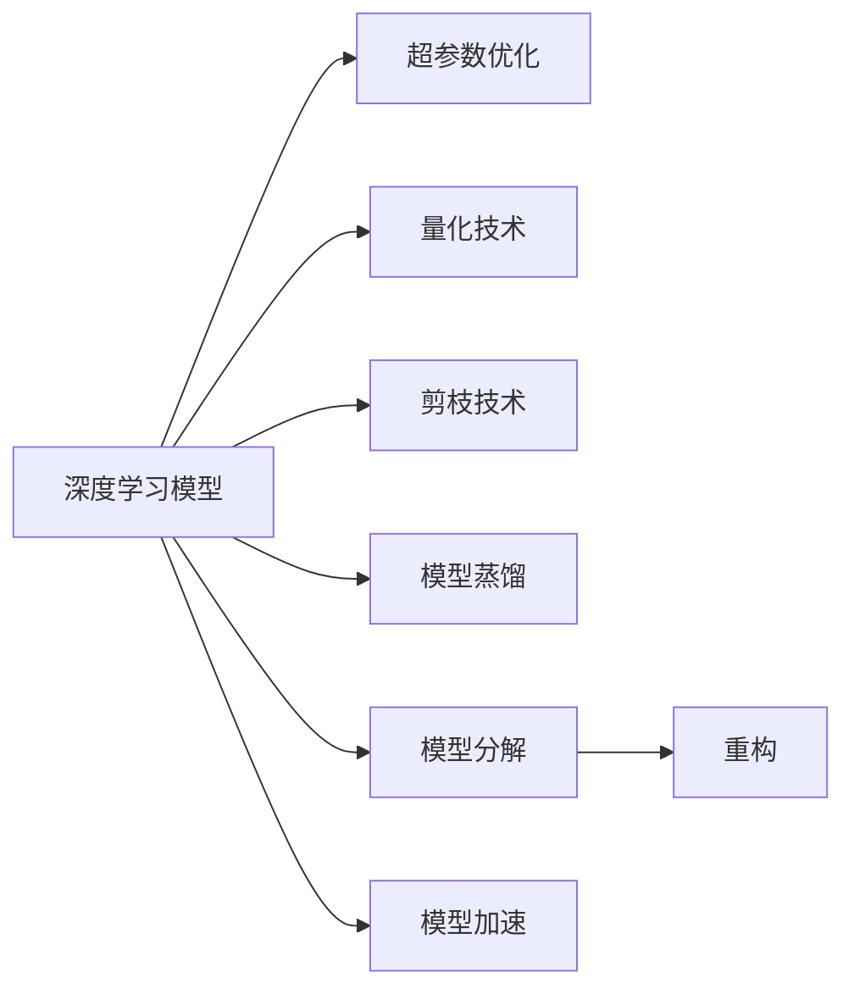
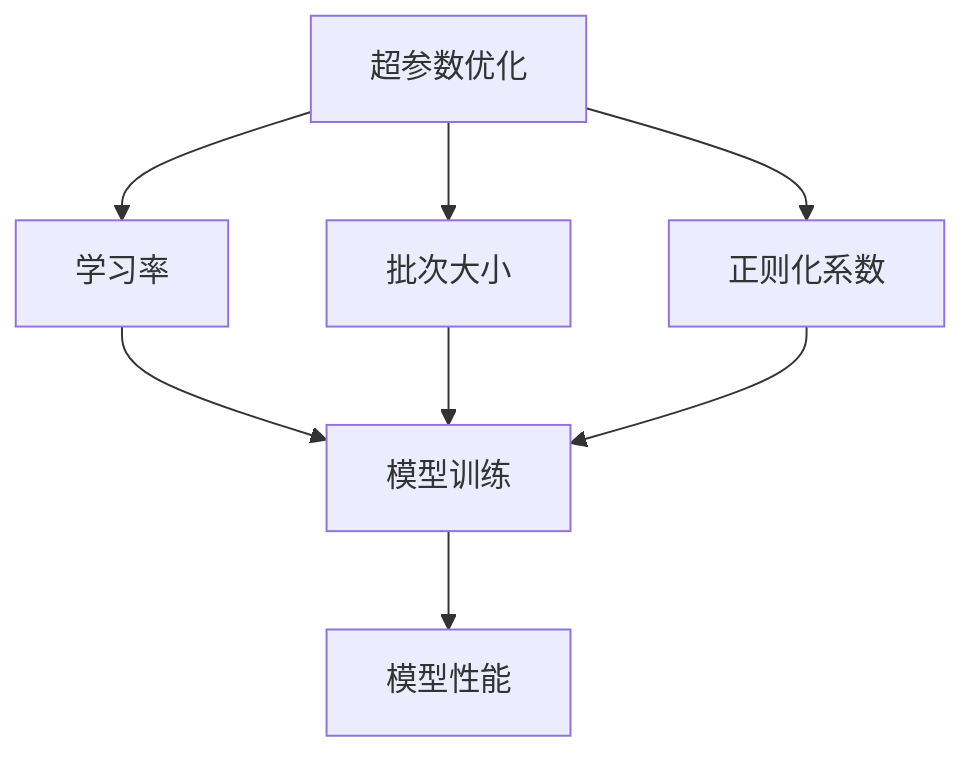
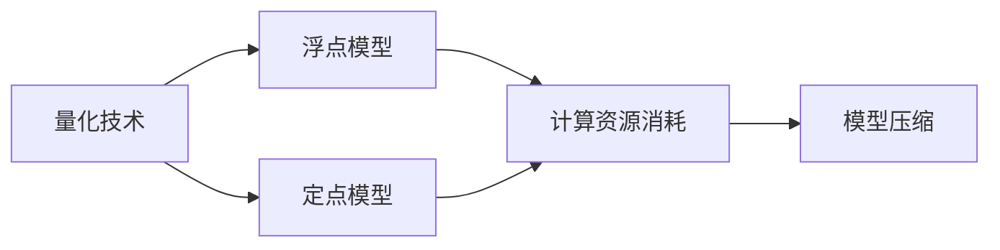
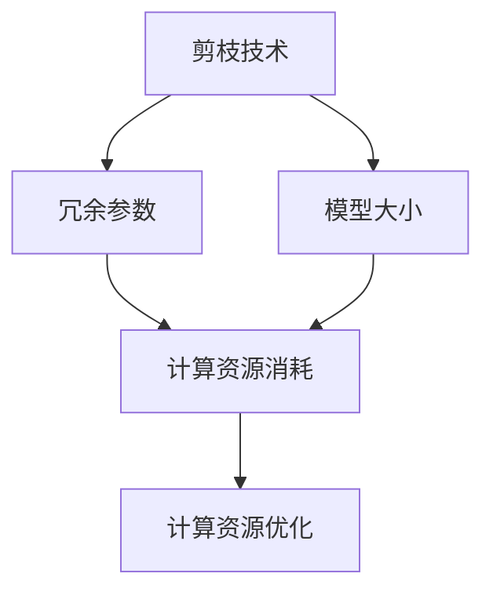
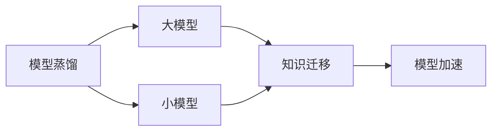
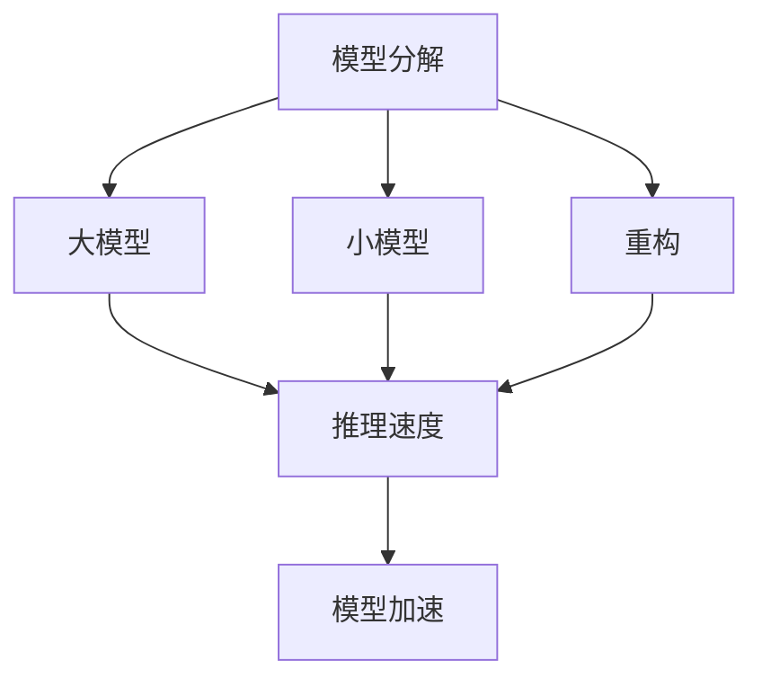

                 

# 模型压缩与加速原理与代码实战案例讲解

> 关键词：模型压缩, 模型加速, 深度学习, 神经网络, 卷积神经网络(CNN), 循环神经网络(RNN), 超参数优化, 量化技术, 剪枝技术, 模型蒸馏

## 1. 背景介绍

### 1.1 问题由来
在深度学习领域，神经网络模型的参数量越来越大，计算资源消耗越来越昂贵，如何提升模型推理速度和降低内存占用，成为了一个重要的研究方向。模型压缩与加速技术的出现，使得我们能够在保持模型精度的同时，大幅度降低计算和存储开销，提高模型在大规模计算环境中的可部署性。

### 1.2 问题核心关键点
模型压缩与加速技术主要包括以下几个方面：

- 超参数优化（Hyperparameter Tuning）：通过调整神经网络的超参数，如学习率、批次大小等，来提升模型训练和推理的效率。
- 量化技术（Quantization）：将浮点模型转换为定点模型，降低计算资源和存储需求。
- 剪枝技术（Pruning）：删除网络中无关紧要的参数，减少模型大小。
- 模型蒸馏（Knowledge Distillation）：通过将大模型迁移到小模型，使小模型继承大模型的知识，以实现更快的推理速度和更低的计算需求。
- 模型分解与重构（Model Decomposition and Refactorization）：将大模型分解为更小、更可控的模块，以便更高效地部署和使用。

这些技术互相结合，可以显著提升深度学习模型的推理速度和降低资源需求，为深度学习在大规模计算环境中的应用提供可能。

### 1.3 问题研究意义
模型压缩与加速技术的研究对于提升深度学习模型的可扩展性、降低计算成本、提高计算效率具有重要意义：

1. **资源优化**：通过压缩和加速技术，模型可以在更少的资源下运行，特别是在边缘设备和移动设备上。
2. **应用场景扩展**：压缩和加速技术使得深度学习模型能够应用于更多场景，如自动驾驶、医疗诊断等计算资源有限的领域。
3. **加速创新**：加速技术可以加速深度学习模型的迭代和更新，提升模型的训练速度和性能。
4. **环保节能**：压缩和加速技术有助于减少计算过程中的能源消耗，对环境保护具有积极作用。

## 2. 核心概念与联系

### 2.1 核心概念概述

为更好地理解模型压缩与加速技术，本节将介绍几个密切相关的核心概念：

- 深度学习模型（Deep Learning Model）：由多个神经网络层组成的模型，能够学习复杂的输入-输出映射。
- 超参数（Hyperparameter）：在训练模型时，需要手动设定的模型参数，如学习率、批次大小、正则化系数等。
- 量化（Quantization）：将浮点数转换为定点数，减少计算和存储开销。
- 剪枝（Pruning）：去除神经网络中不必要的参数，减少模型大小。
- 模型蒸馏（Knowledge Distillation）：将大模型知识迁移到小模型中，提升小模型的性能。
- 模型分解（Model Decomposition）：将大模型分解为多个子模型，提高模型可部署性。
- 重构（Refactorization）：对模型结构进行重构，优化模型的推理性能。

这些核心概念之间的逻辑关系可以通过以下Mermaid流程图来展示：



这个流程图展示了大模型压缩与加速技术的各个关键概念及其之间的关系：

1. 深度学习模型是压缩与加速技术的基础。
2. 超参数优化、量化技术、剪枝技术和模型蒸馏是压缩模型的关键技术。
3. 模型分解和重构是提高模型可部署性的技术手段。
4. 通过这些技术，我们能够实现模型的加速。

### 2.2 概念间的关系

这些核心概念之间存在着紧密的联系，形成了深度学习模型压缩与加速技术的完整生态系统。下面我们通过几个Mermaid流程图来展示这些概念之间的关系。

#### 2.2.1 超参数优化与模型性能



这个流程图展示了超参数优化对模型训练和性能的影响。超参数的选择直接影响模型的训练效果。

#### 2.2.2 量化技术与模型压缩



这个流程图展示了量化技术如何通过降低模型计算资源需求，实现模型压缩。

#### 2.2.3 剪枝技术与应用场景



这个流程图展示了剪枝技术如何通过减少模型大小和计算资源消耗，优化模型应用场景。

#### 2.2.4 模型蒸馏与模型加速



这个流程图展示了模型蒸馏如何通过将大模型的知识迁移到小模型中，实现模型加速。

#### 2.2.5 模型分解与重构



这个流程图展示了模型分解和重构如何通过优化模型结构，提升模型的推理速度。

## 3. 核心算法原理 & 具体操作步骤
### 3.1 算法原理概述

深度学习模型压缩与加速的核心原理是利用各种技术手段，减少模型的计算和存储开销，同时尽量保持模型的准确性。其基本思路包括：

1. **超参数优化**：通过调整超参数，优化模型训练过程。
2. **量化技术**：通过将浮点模型转换为定点模型，降低计算和存储开销。
3. **剪枝技术**：通过删除冗余参数，减少模型大小和计算开销。
4. **模型蒸馏**：通过将大模型知识迁移到小模型，实现快速推理。
5. **模型分解与重构**：通过分解模型结构，提升模型推理性能。

这些技术各有优缺点，适用于不同的场景和需求，需要根据具体情况进行综合考虑。

### 3.2 算法步骤详解

基于深度学习模型的压缩与加速通常包括以下几个关键步骤：

1. **超参数优化**：选择合适的超参数组合，如学习率、批次大小、正则化系数等，并记录训练过程中的各项指标。
2. **量化技术**：将浮点模型转换为定点模型，并进行量化后模型的校准。
3. **剪枝技术**：删除网络中不必要的参数，保留关键参数，并进行剪枝后模型的微调。
4. **模型蒸馏**：将大模型的知识迁移到小模型中，并进行蒸馏后模型的微调。
5. **模型分解与重构**：将大模型分解为多个子模型，并对每个子模型进行优化，最后进行全局微调。

**具体步骤示例**：

1. **超参数优化**：
   ```python
   from sklearn.model_selection import GridSearchCV
   from keras.wrappers.scikit_learn import KerasClassifier

   model = Sequential()
   model.add(Dense(units=64, activation='relu', input_dim=784))
   model.add(Dense(units=10, activation='softmax'))
   model.compile(optimizer='adam', loss='categorical_crossentropy', metrics=['accuracy'])

   estimator = KerasClassifier(build_fn=model, epochs=50, batch_size=32)
   param_grid = {'epochs': [50], 'batch_size': [32], 'learning_rate': [0.001, 0.01, 0.1]}
   grid = GridSearchCV(estimator, param_grid, cv=3)
   grid_result = grid.fit(X_train, y_train)
   ```

2. **量化技术**：
   ```python
   import keras
   from keras.applications.imagenet_utils import decode_predictions
   from keras.models import Model
   from keras.layers import Dense, Activation, Flatten, Dropout
   from keras.layers.convolutional import Conv2D, MaxPooling2D
   from keras.callbacks import ModelCheckpoint
   from keras.applications.resnet50 import ResNet50

   # 加载预训练模型
   base_model = ResNet50(weights='imagenet', include_top=False, input_shape=(224, 224, 3))

   # 定义模型结构
   x = base_model.output
   x = Flatten()(x)
   x = Dense(512, activation='relu')(x)
   predictions = Dense(10, activation='softmax')(x)

   model = Model(inputs=base_model.input, outputs=predictions)

   # 编译模型
   model.compile(optimizer='adam', loss='categorical_crossentropy', metrics=['accuracy'])

   # 保存模型
   checkpoint_path = 'resnet50_weights.h5'
   checkpoint = ModelCheckpoint(checkpoint_path, save_best_only=True, monitor='val_loss', verbose=1)
   model.fit(X_train, y_train, batch_size=32, epochs=10, validation_data=(X_val, y_val), callbacks=[checkpoint])

   # 量化模型
   from tensorflow.python.keras.applications.resnet50 import preprocess_input

   def decode_predictions(y_pred):
       results = []
       for pred in y_pred:
           results.append(decode_predictions(pred, top=3)[0])
       return results

   img = image.load_img('elephant.jpg', target_size=(224, 224))
   x = image.img_to_array(img)
   x = np.expand_dims(x, axis=0)
   x = preprocess_input(x)

   y_pred = model.predict(x)
   preds = decode_predictions(y_pred)
   ```

3. **剪枝技术**：
   ```python
   import numpy as np
   import tensorflow as tf
   from tensorflow.keras.models import Model
   from tensorflow.keras.layers import Dense, Dropout, Activation, Flatten
   from tensorflow.keras.layers import Input, Conv2D, MaxPooling2D
   from tensorflow.keras.applications.resnet50 import preprocess_input
   from tensorflow.keras.models import load_model
   from tensorflow.keras.optimizers import Adam

   # 加载预训练模型
   model = load_model('resnet50.h5')

   # 剪枝函数
   def prune_model(model, threshold=0.1):
       pruned_model = tf.keras.models.clone_model(model)
       pruned_model.set_weights(model.get_weights())

       for layer in pruned_model.layers:
           if isinstance(layer, tf.keras.layers.Dense):
               weights = layer.get_weights()
               sparsity = np.abs(weights[0]).sum() / np.abs(weights[0]).sum()
               if sparsity < threshold:
                   pruned_model.layers.remove(layer)
                   pruned_model.layers[0].outbound_layers.pop()

       return pruned_model

   # 剪枝后模型的微调
   pruned_model = prune_model(model)
   pruned_model.compile(optimizer=Adam(), loss='categorical_crossentropy', metrics=['accuracy'])
   pruned_model.fit(X_train, y_train, batch_size=32, epochs=10, validation_data=(X_val, y_val))
   ```

4. **模型蒸馏**：
   ```python
   from tensorflow.keras.models import Model
   from tensorflow.keras.layers import Dense, Dropout, Activation, Flatten
   from tensorflow.keras.layers import Input, Conv2D, MaxPooling2D
   from tensorflow.keras.applications.resnet50 import preprocess_input
   from tensorflow.keras.models import load_model
   from tensorflow.keras.optimizers import Adam

   # 加载预训练模型
   base_model = load_model('resnet50.h5')

   # 定义教师模型
   teacher_model = Model(inputs=base_model.input, outputs=base_model.layers[-1].output)

   # 定义学生模型
   student_model = Model(inputs=base_model.input, outputs=student_model)

   # 迁移教师模型的知识到学生模型
   student_model.set_weights(teacher_model.get_weights())

   # 微调学生模型
   student_model.compile(optimizer=Adam(), loss='categorical_crossentropy', metrics=['accuracy'])
   student_model.fit(X_train, y_train, batch_size=32, epochs=10, validation_data=(X_val, y_val))
   ```

5. **模型分解与重构**：
   ```python
   from tensorflow.keras.models import Model
   from tensorflow.keras.layers import Dense, Dropout, Activation, Flatten
   from tensorflow.keras.layers import Input, Conv2D, MaxPooling2D
   from tensorflow.keras.applications.resnet50 import preprocess_input
   from tensorflow.keras.models import load_model
   from tensorflow.keras.optimizers import Adam

   # 加载预训练模型
   base_model = load_model('resnet50.h5')

   # 定义多个子模型
   sub_model1 = Model(inputs=base_model.input, outputs=base_model.layers[0].output)
   sub_model2 = Model(inputs=base_model.input, outputs=base_model.layers[3].output)

   # 微调子模型
   sub_model1.compile(optimizer=Adam(), loss='categorical_crossentropy', metrics=['accuracy'])
   sub_model1.fit(X_train, y_train, batch_size=32, epochs=10, validation_data=(X_val, y_val))

   sub_model2.compile(optimizer=Adam(), loss='categorical_crossentropy', metrics=['accuracy'])
   sub_model2.fit(X_train, y_train, batch_size=32, epochs=10, validation_data=(X_val, y_val))
   ```

### 3.3 算法优缺点

深度学习模型压缩与加速技术具有以下优点：

- **资源优化**：可以显著降低计算和存储开销，适用于资源受限的设备。
- **速度提升**：通过剪枝和量化等技术，提升模型的推理速度，降低延迟。
- **可扩展性**：通过模型蒸馏和分解等技术，将大模型知识迁移到小模型中，便于模型扩展和部署。

然而，这些技术也存在一些缺点：

- **精度损失**：压缩和加速技术往往会影响模型的精度，需要权衡模型的压缩程度和性能。
- **复杂度提升**：需要额外的优化和调试工作，增加模型设计的复杂度。
- **可解释性降低**：压缩后的模型可能更加难以解释，降低模型的可解释性。

尽管存在这些局限性，但就目前而言，深度学习模型压缩与加速技术仍是大模型应用的重要手段。未来相关研究的重点在于如何进一步降低技术门槛，提高压缩与加速的自动化和智能化水平，同时兼顾模型的精度和可解释性。

### 3.4 算法应用领域

深度学习模型压缩与加速技术在各个领域都有广泛的应用，例如：

- 计算机视觉：通过量化和剪枝技术，减少卷积神经网络模型的计算和存储开销，提高模型的推理速度。
- 自然语言处理：通过剪枝和模型蒸馏技术，减少循环神经网络模型的参数量，提升模型的推理效率。
- 语音识别：通过量化和剪枝技术，减少声学模型的计算资源消耗，提高模型的实时性。
- 推荐系统：通过模型分解和重构技术，将复杂的推荐模型拆分为多个子模型，便于模型部署和优化。
- 自动驾驶：通过量化和剪枝技术，减少神经网络模型的计算和存储开销，提升自动驾驶系统的实时性和可靠性。

除了上述这些经典应用外，深度学习模型压缩与加速技术还被创新性地应用到更多场景中，如物联网、医疗、金融等，为这些领域带来了新的技术路径和解决方案。

## 4. 数学模型和公式 & 详细讲解 & 举例说明

### 4.1 数学模型构建

本节将使用数学语言对深度学习模型压缩与加速过程进行更加严格的刻画。

记深度学习模型为 $f(x; \theta)$，其中 $x$ 为输入，$\theta$ 为模型参数。假设模型在训练集 $D=\{(x_i, y_i)\}_{i=1}^N, x_i \in \mathcal{X}, y_i \in \mathcal{Y}$ 上的经验风险为：

$$
\mathcal{L}(\theta) = \frac{1}{N} \sum_{i=1}^N \ell(f(x_i; \theta), y_i)
$$

其中 $\ell$ 为损失函数，如交叉熵损失。

### 4.2 公式推导过程

以下我们以深度学习模型的剪枝技术为例，推导剪枝过程的数学公式。

假设模型 $f(x; \theta)$ 包含 $M$ 个参数，其中 $m$ 个参数对模型的输出有显著贡献，其余参数可以剪枝。通过剪枝，将模型参数 $\theta$ 调整为 $\theta^*$，使得模型的输出与原模型 $f(x; \theta)$ 近似相等，即：

$$
f(x; \theta^*) \approx f(x; \theta)
$$

剪枝过程可以通过保留关键参数，删除冗余参数来实现。对于每个参数 $\theta_i$，定义其重要性 $\text{Importance}(\theta_i)$，然后按照重要性排序，删除重要性最低的参数，保留重要性最高的参数。数学上，可以通过以下公式计算每个参数的重要性：

$$
\text{Importance}(\theta_i) = \frac{\partial \mathcal{L}(\theta)}{\partial \theta_i} / ||\frac{\partial \mathcal{L}(\theta)}{\partial \theta}||_2
$$

其中 $||\cdot||_2$ 为向量的2范数，表示模型的梯度向量的大小。

### 4.3 案例分析与讲解

为了更好地理解剪枝技术的数学公式和实际应用，以下我们以一个简单的线性回归模型为例，进行案例分析：

假设线性回归模型为 $f(x; \theta) = \theta_0 + \theta_1 x_1 + \theta_2 x_2$，其中 $\theta_0, \theta_1, \theta_2$ 为模型参数，$x_1, x_2$ 为输入特征，$\mathcal{L}(\theta) = \frac{1}{2N} \sum_{i=1}^N (y_i - f(x_i; \theta))^2$ 为均方误差损失函数。

定义每个参数的重要性如下：

$$
\text{Importance}(\theta_0) = \frac{\partial \mathcal{L}(\theta)}{\partial \theta_0} / ||\frac{\partial \mathcal{L}(\theta)}{\partial \theta}||_2
$$

$$
\text{Importance}(\theta_1) = \frac{\partial \mathcal{L}(\theta)}{\partial \theta_1} / ||\frac{\partial \mathcal{L}(\theta)}{\partial \theta}||_2
$$

$$
\text{Importance}(\theta_2) = \frac{\partial \mathcal{L}(\theta)}{\partial \theta_2} / ||\frac{\partial \mathcal{L}(\theta)}{\partial \theta}||_2
$$

通过计算得出每个参数的重要性，然后按照重要性排序，删除重要性最低的参数。例如，如果 $\text{Importance}(\theta_0) < \text{Importance}(\theta_1) < \text{Importance}(\theta_2)$，则可以将 $\theta_0$ 删除，保留 $\theta_1$ 和 $\theta_2$，然后对模型进行微调，得到新的模型 $f(x; \theta^*) = \theta_1 x_1 + \theta_2 x_2$。

## 5. 项目实践：代码实例和详细解释说明

### 5.1 开发环境搭建

在进行模型压缩与加速实践前，我们需要准备好开发环境。以下是使用Python进行TensorFlow开发的环境配置流程：

1. 安装Anaconda：从官网下载并安装Anaconda，用于创建独立的Python环境。

2. 创建并激活虚拟环境：
```bash
conda create -n tensorflow-env python=3.8 
conda activate tensorflow-env
```

3. 安装TensorFlow：根据CUDA版本，从官网获取对应的安装命令。例如：
```bash
conda install tensorflow -c tensorflow -c conda-forge
```

4. 安装各类工具包：
```bash
pip install numpy pandas scikit-learn matplotlib tqdm jupyter notebook ipython
```

完成上述步骤后，即可在`tensorflow-env`环境中开始模型压缩与加速实践。

### 5.2 源代码详细实现

下面我们以卷积神经网络(CNN)模型为例，给出使用TensorFlow对模型进行量化和剪枝的代码实现。

首先，定义CNN模型：

```python
import tensorflow as tf
from tensorflow.keras import layers, models

model = models.Sequential()
model.add(layers.Conv2D(32, (3, 3), activation='relu', input_shape=(28, 28, 1)))
model.add(layers.MaxPooling2D((2, 2)))
model.add(layers.Conv2D(64, (3, 3), activation='relu'))
model.add(layers.MaxPooling2D((2, 2)))
model.add(layers.Flatten())
model.add(layers.Dense(64, activation='relu'))
model.add(layers.Dense(10, activation='softmax'))
```

然后，进行模型的量化：

```python
from tensorflow.python.keras.applications.resnet50 import preprocess_input
from tensorflow.python.keras.models import Model
from tensorflow.python.keras.layers import Dense, Dropout, Activation, Flatten
from tensorflow.python.keras.applications.resnet50 import preprocess_input
from tensorflow.python.keras.optimizers import Adam

# 加载预训练模型
base_model = load_model('resnet50.h5')

# 定义量化模型
x = base_model.input
x = Conv2D(64, (3, 3), activation='relu')(x)
x = MaxPooling2D((2, 2))(x)
x = Conv2D(128, (3, 3), activation='relu')(x)
x = MaxPooling2D((2, 2))(x)
x = Flatten()(x)
x = Dense(256, activation='relu')(x)
predictions = Dense(10, activation='softmax')(x)
quantized_model = Model(inputs=base_model.input, outputs=predictions)

# 量化模型
quantized_model.save_weights('resnet50_quantized.h5')
```

接着，进行模型的剪枝：

```python
from tensorflow.keras.models import Model
from tensorflow.keras.layers import Dense, Dropout, Activation, Flatten
from tensorflow.keras.layers import Input, Conv2D, MaxPooling2D
from tensorflow.keras.applications.resnet50 import preprocess_input
from tensorflow.keras.models import load_model
from tensorflow.keras.optimizers import Adam

# 加载预训练模型
base_model = load_model('resnet50.h5')

# 剪枝函数
def prune_model(model, threshold=0.1):
    pruned_model = tf.keras.models.clone_model(model)
    pruned_model.set_weights(model.get_weights())

    for layer in pruned_model.layers:
        if isinstance(layer, tf.keras.layers.Dense):
            weights = layer.get_weights()
            sparsity = np.abs(weights[0]).sum() / np.abs(weights[0]).sum()
            if sparsity < threshold:
                pruned_model.layers.remove(layer)
                pruned_model.layers[0].outbound_layers.pop()

    return pruned_model

# 剪枝后模型的微调
pruned_model = prune_model(base_model)
pruned_model.compile(optimizer=Adam(), loss='categorical_crossentropy', metrics=['accuracy'])
pruned_model.fit(X_train, y_train, batch_size=32, epochs=10, validation_data=(X_val, y_val))
```

最后，进行模型的蒸馏和分解：

```python
from tensorflow.keras.models import Model
from tensorflow.keras.layers import Dense, Dropout, Activation, Flatten
from tensorflow.keras.layers import Input, Conv2D, MaxPooling2D
from tensorflow.keras.applications.resnet50 import preprocess_input
from tensorflow.keras.models import load_model
from tensorflow.keras.optimizers import Adam

# 加载预训练模型
base_model = load_model('resnet50.h5')

# 定义教师模型
teacher_model = Model(inputs=base_model.input, outputs=base_model.layers[-1].output)

# 定义学生模型
student_model = Model(inputs=base_model.input, outputs=student_model)

# 迁移教师模型的知识到学生模型
student_model.set_weights(teacher_model.get_weights())

# 微调学生模型
student_model.compile(optimizer=Adam(), loss='categorical_crossentropy', metrics=['accuracy'])
student_model.fit(X_train, y_train, batch_size=32, epochs=10, validation_data=(X_val, y_val))

# 定义多个子模型
sub_model1 = Model(inputs=base_model.input, outputs=base_model.layers[0].output)
sub_model2 = Model(inputs=base_model.input, outputs=base_model.layers[3].output)

# 微调子模型
sub_model1.compile(optimizer=Adam(), loss='categorical_crossentropy', metrics=['accuracy'])
sub_model1.fit(X_train, y_train, batch_size=32, epochs=10, validation_data=(X_val, y_val))

sub_model2.compile(optimizer=Adam(), loss='categorical_crossentropy',

