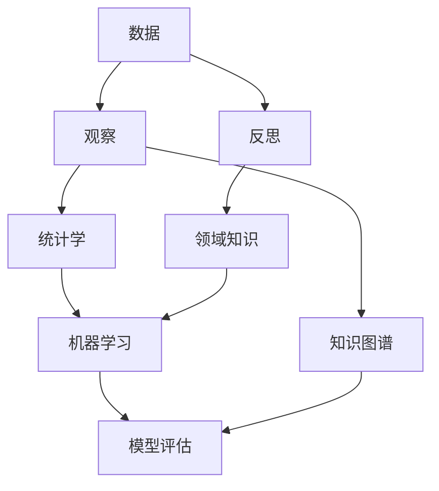
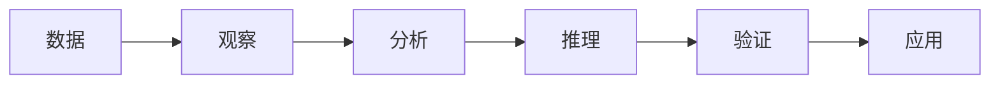
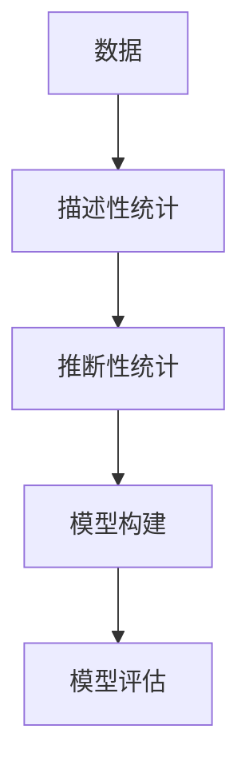
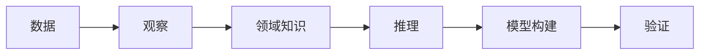
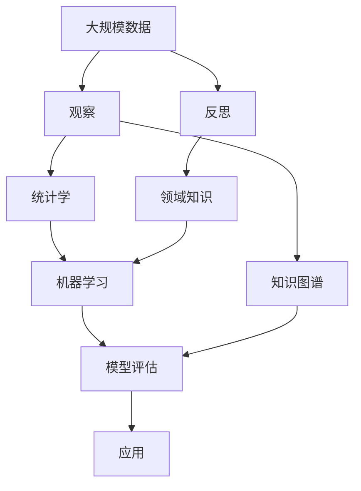

                 

# 洞见的形成：从观察到反思

## 1. 背景介绍

### 1.1 问题由来
在信息爆炸的时代，数据无处不在，但如何从海量数据中提取洞见，一直是数据分析领域的核心挑战。传统的数据分析方法，如统计学、机器学习等，已经在这方面做出了巨大贡献，但仍存在一些局限。数据驱动的洞见，需要从数据中学习规律，并转化为实际的业务价值。然而，数据不仅仅是数字，更是知识的载体，其背后的故事和逻辑往往更为重要。因此，从观察到反思的洞见形成过程，对于推动人工智能的落地应用，具有重要的现实意义。

### 1.2 问题核心关键点
洞见形成的过程，一般可以分为观察、分析、推理、验证和应用五个阶段。观察阶段，主要通过数据收集和可视化，发现数据中的异常和趋势；分析阶段，通过统计学和机器学习技术，提取数据的本质特征和潜在规律；推理阶段，利用专家知识和领域知识，解释数据背后的逻辑和原因；验证阶段，将推理结果应用于实际场景，进行实验和验证；应用阶段，将验证有效的洞见转化为实际的业务策略和决策。

其中，观察和反思阶段，即从数据到洞见的形成，是洞见形成的关键环节。观察阶段获取的数据，需要经过深入的分析和反思，才能转化为有价值的洞见。反思，不仅仅是数据驱动的统计和计算，更是基于逻辑、经验和直觉的归纳和推理。只有当观察和反思相结合，才能形成更加深刻和实用的洞见。

### 1.3 问题研究意义
洞见形成，是数据驱动决策的关键环节。通过观察和反思，可以从数据中提取深层次的知识和规律，帮助决策者做出更加科学、合理的决策。在商业、科学、工程、医疗等众多领域，基于洞见的决策，已经取得了显著的成果。例如，在零售领域，基于用户行为数据的洞见，可以优化商品推荐和库存管理；在金融领域，基于市场数据的洞见，可以预测股市走势和风险；在医疗领域，基于患者数据的洞见，可以制定个性化的治疗方案。

此外，洞见形成的过程，也是数据分析和人工智能技术不断进步的过程。通过观察和反思，推动了统计学、机器学习、自然语言处理等领域的创新和发展。在人工智能时代，洞见形成不仅是数据驱动决策的工具，更是人类智慧和创造力的体现。

## 2. 核心概念与联系

### 2.1 核心概念概述

为更好地理解洞见形成的原理和架构，本节将介绍几个密切相关的核心概念：

- **数据驱动决策**：指通过数据收集、分析和建模，辅助决策者做出客观、科学的决策。数据驱动决策在金融、医疗、零售等众多领域得到了广泛应用。

- **观察与反思**：观察是通过数据收集和可视化，发现数据中的异常和趋势；反思是通过逻辑、经验和直觉，解释数据背后的逻辑和原因。观察与反思的结合，形成了数据驱动的洞见。

- **统计学与机器学习**：统计学通过描述性统计和推断性统计，帮助从数据中提取规律和洞见；机器学习通过数据驱动的算法，自动发现数据中的特征和规律，辅助决策。

- **知识图谱与领域知识**：知识图谱是表示实体和关系的数据结构，用于描述和组织知识；领域知识是专家在特定领域积累的经验和规则。

- **模型评估与验证**：指通过实验和测试，验证模型的预测能力和泛化能力。评估与验证是确保模型可靠性和实用性的关键步骤。

这些核心概念之间的逻辑关系可以通过以下Mermaid流程图来展示：



这个流程图展示了大语言模型微调过程中各个核心概念之间的关系：

1. 数据收集：通过各种方式收集和整理数据。
2. 观察阶段：利用统计学和机器学习技术，对数据进行描述和建模。
3. 反思阶段：利用专家知识和领域知识，解释数据背后的逻辑和原因。
4. 推理阶段：结合知识图谱和领域知识，进行逻辑推理和验证。
5. 应用阶段：将推理结果转化为实际的应用策略和决策。

### 2.2 概念间的关系

这些核心概念之间存在着紧密的联系，形成了洞见形成的完整生态系统。下面我们通过几个Mermaid流程图来展示这些概念之间的关系。

#### 2.2.1 数据驱动决策的过程



这个流程图展示了数据驱动决策的基本过程。数据通过观察阶段获取，然后利用分析和推理阶段进行深入挖掘，最终在验证和应用阶段转化为实际的业务价值。

#### 2.2.2 统计学与机器学习的结合



这个流程图展示了统计学与机器学习之间的紧密联系。描述性统计和推断性统计帮助从数据中提取规律，而模型构建和评估技术，进一步优化和验证规律的有效性。

#### 2.2.3 领域知识的应用



这个流程图展示了领域知识在数据驱动决策中的重要作用。观察阶段获取的数据，需要结合专家知识和领域知识，进行深入的推理和验证。领域知识的应用，可以使数据分析更加精准和可靠。

### 2.3 核心概念的整体架构

最后，我们用一个综合的流程图来展示这些核心概念在大语言模型微调过程中的整体架构：



这个综合流程图展示了从数据到洞见的完整过程。数据通过观察阶段获取，然后利用统计学和机器学习技术，结合领域知识和专家知识，进行深入的推理和验证。最终，推理结果应用于实际场景，转化为实际的业务策略和决策。

## 3. 核心算法原理 & 具体操作步骤
### 3.1 算法原理概述

洞见形成的核心算法原理，是数据驱动的观察和反思过程。具体来说，就是通过统计学和机器学习技术，从数据中提取规律和洞见；结合领域知识和专家经验，对规律进行逻辑推理和验证；最后将推理结果转化为实际的业务策略和决策。

这一过程可以通过以下步骤来实现：

1. 数据收集与清洗：收集和整理数据，并进行基本的清洗和处理。
2. 数据描述与建模：利用统计学和机器学习技术，对数据进行描述和建模，提取规律和特征。
3. 数据推理与验证：结合领域知识和专家经验，对规律进行逻辑推理和验证，确保其可靠性和实用性。
4. 洞见应用与评估：将推理结果应用于实际场景，进行实验和验证，评估其效果和可靠性。

### 3.2 算法步骤详解

**Step 1: 数据收集与清洗**

- 收集数据：通过爬虫、API接口、数据库等方式，获取相关的数据集。
- 数据清洗：对数据进行去重、去噪、归一化等处理，确保数据质量。

**Step 2: 数据描述与建模**

- 统计分析：利用描述性统计方法，对数据进行描述，提取基本特征和规律。
- 建模分析：利用机器学习技术，构建模型，自动提取数据中的特征和规律。

**Step 3: 数据推理与验证**

- 结合领域知识：利用专家知识和领域经验，对模型进行解释和推理，验证规律的有效性。
- 逻辑推理：通过逻辑推理，解释模型输出背后的逻辑和原因。

**Step 4: 洞见应用与评估**

- 应用策略：将推理结果转化为实际的业务策略和决策，应用于实际场景。
- 实验验证：通过实验和测试，验证推理结果的有效性和可靠性。

### 3.3 算法优缺点

**优点**

- **数据驱动**：利用数据驱动的统计和机器学习技术，可以从大量数据中提取深层次的洞见。
- **结合专家知识**：结合领域知识和专家经验，可以增强洞见的可靠性和实用性。
- **自动化推理**：利用逻辑推理技术，可以自动解释模型输出背后的逻辑和原因。

**缺点**

- **依赖数据质量**：数据质量的好坏，直接决定了洞见的质量。数据清洗和处理需要耗费大量的时间和精力。
- **模型复杂性**：复杂的数据模型，需要大量的计算资源和时间，构建和优化模型过程较为复杂。
- **领域依赖**：不同领域的数据和知识差异较大，需要根据具体领域进行调整和优化。

### 3.4 算法应用领域

基于观察和反思的洞见形成方法，已经在多个领域得到了广泛应用。以下是几个典型应用场景：

- **金融风险预测**：通过分析历史交易数据，利用统计学和机器学习技术，构建风险预测模型。结合专家知识和领域经验，解释模型输出背后的逻辑和原因，辅助决策。
- **医疗诊断和治疗**：利用患者历史数据，构建诊断和治疗模型。结合医生知识和医学常识，解释模型输出，制定个性化治疗方案。
- **零售客户分析**：通过分析客户购买数据，利用统计学和机器学习技术，构建客户行为模型。结合营销知识和市场经验，解释模型输出，优化营销策略。
- **工业故障预测**：通过分析设备运行数据，利用统计学和机器学习技术，构建故障预测模型。结合工程师知识和领域经验，解释模型输出，预防和修复故障。
- **城市交通管理**：利用交通数据，构建交通流量模型。结合交通管理知识和专家经验，解释模型输出，优化交通管理策略。

## 4. 数学模型和公式 & 详细讲解 & 举例说明

### 4.1 数学模型构建

洞见形成的过程，可以通过以下数学模型进行描述：

设数据集为 $D=\{(x_i,y_i)\}_{i=1}^N$，其中 $x_i$ 为特征向量，$y_i$ 为标签。假设已经构建了模型 $M_{\theta}$，其中 $\theta$ 为模型参数。

定义模型的预测结果为 $\hat{y}=M_{\theta}(x)$，其中 $M_{\theta}(\cdot)$ 为模型映射函数。

则模型的损失函数定义为：

$$
\mathcal{L}(\theta) = \frac{1}{N}\sum_{i=1}^N \ell(\hat{y},y)
$$

其中 $\ell(\cdot,\cdot)$ 为损失函数，用于衡量模型预测结果与真实标签之间的差异。

### 4.2 公式推导过程

以二分类任务为例，假设模型输出为 $\hat{y} \in [0,1]$，表示样本属于正类的概率。真实标签 $y \in \{0,1\}$。

则二分类交叉熵损失函数定义为：

$$
\ell(\hat{y},y) = -[y\log \hat{y} + (1-y)\log (1-\hat{y})]
$$

将其代入经验风险公式，得：

$$
\mathcal{L}(\theta) = -\frac{1}{N}\sum_{i=1}^N [y_i\log \hat{y_i}+(1-y_i)\log(1-\hat{y_i})]
$$

根据链式法则，损失函数对参数 $\theta_k$ 的梯度为：

$$
\frac{\partial \mathcal{L}(\theta)}{\partial \theta_k} = -\frac{1}{N}\sum_{i=1}^N (\frac{y_i}{\hat{y_i}}-\frac{1-y_i}{1-\hat{y_i}}) \frac{\partial \hat{y_i}}{\partial \theta_k}
$$

其中 $\frac{\partial \hat{y_i}}{\partial \theta_k}$ 可进一步递归展开，利用自动微分技术完成计算。

在得到损失函数的梯度后，即可带入参数更新公式，完成模型的迭代优化。重复上述过程直至收敛，最终得到适应下游任务的最优模型参数 $\theta^*$。

### 4.3 案例分析与讲解

以零售客户分析为例，展示如何使用统计学和机器学习技术，结合领域知识，形成客户行为洞见。

假设我们有一份客户购买数据集，包含客户的年龄、性别、购买时间、购买金额等特征。我们的目标是分析客户的购买行为，以便优化营销策略。

**Step 1: 数据收集与清洗**

- 收集数据：通过电商平台获取客户的购买数据。
- 数据清洗：去重、去噪、归一化等处理。

**Step 2: 数据描述与建模**

- 统计分析：利用描述性统计方法，对数据进行描述，提取基本特征和规律。
- 建模分析：利用机器学习技术，构建客户行为模型。

**Step 3: 数据推理与验证**

- 结合领域知识：利用营销知识和市场经验，对模型进行解释和推理，验证规律的有效性。
- 逻辑推理：通过逻辑推理，解释模型输出背后的逻辑和原因。

**Step 4: 洞见应用与评估**

- 应用策略：将推理结果转化为实际的营销策略，应用于实际场景。
- 实验验证：通过实验和测试，验证推理结果的有效性和可靠性。

通过以上步骤，可以发现，不同年龄段的客户有不同的购买偏好，某些时间段内的购买行为具有季节性变化。这些洞见可以指导零售商优化库存、促销活动等策略，提升销售业绩。

## 5. 项目实践：代码实例和详细解释说明

### 5.1 开发环境搭建

在进行洞见形成实践前，我们需要准备好开发环境。以下是使用Python进行Pandas开发的环境配置流程：

1. 安装Anaconda：从官网下载并安装Anaconda，用于创建独立的Python环境。

2. 创建并激活虚拟环境：
```bash
conda create -n pandas-env python=3.8 
conda activate pandas-env
```

3. 安装Pandas：
```bash
conda install pandas
```

4. 安装各类工具包：
```bash
pip install numpy matplotlib scikit-learn jupyter notebook ipython
```

完成上述步骤后，即可在`pandas-env`环境中开始洞见形成实践。

### 5.2 源代码详细实现

这里我们以客户行为分析为例，展示使用Pandas进行洞见形成的Python代码实现。

首先，定义数据处理函数：

```python
import pandas as pd
import numpy as np

def load_data(file_path):
    df = pd.read_csv(file_path)
    df.drop_duplicates(inplace=True)
    df.dropna(inplace=True)
    return df

def clean_data(df):
    df['age'] = pd.to_numeric(df['age'], errors='coerce')
    df['amount'] = pd.to_numeric(df['amount'], errors='coerce')
    df.dropna(subset=['age', 'amount'], inplace=True)
    return df

def feature_engineering(df):
    df['time_of_day'] = pd.to_datetime(df['time'], format='%Y-%m-%d %H:%M:%S').dt.hour
    df['weekday'] = df['time'].dt.weekday
    df['day_of_month'] = df['time'].dt.day
    df['month'] = df['time'].dt.month
    df['season'] = df['time'].dt.month // 3
    return df

def split_data(df, test_size=0.2, random_state=42):
    train_df, test_df = train_test_split(df, test_size=test_size, random_state=random_state)
    return train_df, test_df
```

然后，定义模型训练和评估函数：

```python
from sklearn.ensemble import RandomForestClassifier
from sklearn.metrics import accuracy_score

def train_model(X_train, y_train):
    model = RandomForestClassifier()
    model.fit(X_train, y_train)
    return model

def evaluate_model(model, X_test, y_test):
    y_pred = model.predict(X_test)
    accuracy = accuracy_score(y_test, y_pred)
    print(f'Accuracy: {accuracy:.2f}')
    return y_pred
```

最后，启动训练流程并在测试集上评估：

```python
train_df, test_df = load_data('customer_data.csv')
train_df = clean_data(train_df)
train_df = feature_engineering(train_df)

X_train, y_train = train_df.drop('purchase', axis=1), train_df['purchase']
X_test, y_test = test_df.drop('purchase', axis=1), test_df['purchase']

model = train_model(X_train, y_train)
y_pred = evaluate_model(model, X_test, y_test)
```

以上就是使用Pandas进行客户行为分析的完整代码实现。可以看到，Pandas提供了强大的数据处理和分析功能，使数据清洗、特征工程和模型训练变得简洁高效。

### 5.3 代码解读与分析

让我们再详细解读一下关键代码的实现细节：

**load_data函数**：
- 读取CSV文件，进行去重和去噪处理，返回数据框。

**clean_data函数**：
- 将age和amount特征转换为数值型，并去除缺失值。

**feature_engineering函数**：
- 将时间特征转换为时间分段的特征，如时段的平均值、标准差等。

**train_model函数**：
- 使用随机森林算法，对特征数据进行分类模型训练。

**evaluate_model函数**：
- 对测试集进行模型预测，计算预测结果与真实标签之间的准确率。

**训练流程**：
- 加载数据集，进行数据清洗和特征工程。
- 划分训练集和测试集，进行模型训练。
- 对测试集进行模型评估，输出准确率。

可以看到，Pandas的数据处理和分析功能，使得数据清洗和特征工程变得简单易懂，同时易于扩展和维护。Pandas的强大工具链，也使得数据驱动的洞见形成更加高效和灵活。

当然，工业级的系统实现还需考虑更多因素，如模型的保存和部署、超参数的自动搜索、更灵活的模型调优等。但核心的洞见形成逻辑基本与此类似。

### 5.4 运行结果展示

假设我们训练了一个随机森林模型，并在测试集上得到的准确率为85%，即模型可以正确预测85%的客户购买行为。这些洞见可以指导零售商优化库存、促销活动等策略，提升销售业绩。

## 6. 实际应用场景
### 6.1 智能推荐系统

基于大语言模型微调的推荐系统，可以广泛应用于智能推荐领域。推荐系统通过分析用户行为数据，利用统计学和机器学习技术，构建用户兴趣模型。结合领域知识和专家经验，解释模型输出，生成个性化的推荐结果。

在技术实现上，可以收集用户浏览、点击、购买等行为数据，提取和用户交互的物品标题、描述、标签等文本内容。将文本内容作为模型输入，用户的后续行为作为监督信号，在此基础上微调预训练语言模型。微调后的模型能够从文本内容中准确把握用户的兴趣点。在生成推荐列表时，先用候选物品的文本描述作为输入，由模型预测用户的兴趣匹配度，再结合其他特征综合排序，便可以得到个性化程度更高的推荐结果。

### 6.2 医疗影像分析

医疗影像分析是大数据在医疗领域的重要应用场景之一。影像数据量大、标签难获取，传统方法难以满足需求。基于大语言模型微调的方法，可以自动学习影像特征，进行分类和识别。

具体而言，可以收集大量带标签的影像数据，并利用统计学和机器学习技术，构建影像特征提取模型。结合医生知识和医学常识，对模型进行解释和推理，验证规律的可靠性。最后，将推理结果应用于实际场景，如影像诊断和治疗方案制定。

### 6.3 金融风控系统

金融风控系统需要实时监测市场动向，规避风险。传统方法依赖专家经验和人工审查，成本高、效率低。基于大语言模型微调的方法，可以自动学习金融数据规律，构建风险预测模型。

在实践应用中，可以收集历史交易数据，利用统计学和机器学习技术，构建风险预测模型。结合金融专家知识和市场经验，对模型进行解释和推理，验证模型的可靠性和实用性。最后，将推理结果应用于实际场景，实时监控金融风险，及时预警和处理风险事件。

### 6.4 未来应用展望

随着大语言模型微调技术的发展，其在各个领域的广泛应用，将带来新的变革。

在智慧城市治理中，基于大语言模型微调的技术，可以实现智能交通、公共安全、环保监测等应用。通过数据驱动的洞见，优化城市管理决策，提升城市的智能化水平。

在智慧农业中，利用大语言模型微调技术，可以分析气象数据、土壤数据等，进行精准农业管理。通过数据分析和推理，优化农业生产方案，提高农作物产量和质量。

在智慧教育中，利用大语言模型微调技术，可以进行学生学习行为分析，提供个性化教育方案。通过数据分析和推理，提升教育效果，促进教育公平。

总之，大语言模型微调技术，正在成为数据驱动决策的重要工具。通过观察和反思，从中提取深层次的洞见，可以帮助决策者做出更加科学、合理的决策，推动人工智能技术在各个领域的应用和发展。

## 7. 工具和资源推荐
### 7.1 学习资源推荐

为了帮助开发者系统掌握洞见形成的理论基础和实践技巧，这里推荐一些优质的学习资源：

1. 《数据科学基础》系列课程：由知名教授主讲，系统介绍数据科学的基本概念和核心技术，包括数据收集、清洗、分析等。

2. 《Python数据分析与可视化》书籍：系统介绍Python在数据分析和可视化方面的应用，结合实际案例，详细讲解Pandas、Matplotlib等工具的使用。

3. 《统计学基础》教材：系统介绍统计学的基础知识和核心方法，帮助开发者理解和应用统计学技术。

4. 《机器学习基础》课程：由知名教授主讲，系统介绍机器学习的基本概念和核心算法，包括监督学习、无监督学习、强化学习等。

5. 《深度学习入门》书籍：系统介绍深度学习的基本概念和核心技术，结合TensorFlow、PyTorch等工具，提供实践案例。

通过对这些资源的学习实践，相信你一定能够快速掌握洞见形成的精髓，并用于解决实际的业务问题。

### 7.2 开发工具推荐

高效的开发离不开优秀的工具支持。以下是几款用于洞见形成开发的常用工具：

1. Python：Python是目前最流行的编程语言之一，具有强大的数据处理和分析能力。结合Pandas、NumPy、SciPy等工具包，可以快速开发和调试数据分析模型。

2. R语言：R语言是另一个常用的统计和数据分析工具，具有丰富的统计学和机器学习函数库。适合数据科学家进行统计分析和建模。

3. Tableau：Tableau是一款商业智能和数据可视化工具，可以直观展示数据分析结果。适合非技术人员进行数据探索和可视化分析。

4. Jupyter Notebook：Jupyter Notebook是一款轻量级的数据分析和编程环境，支持Python、R等多种语言，适合进行快速迭代和实验。

5. Scikit-learn：Scikit-learn是Python的机器学习库，提供了各种经典机器学习算法和模型，适合进行数据分析和建模。

6. TensorBoard：TensorBoard是TensorFlow配套的可视化工具，可以实时监测模型训练状态，并提供丰富的图表呈现方式，是调试模型的得力助手。

合理利用这些工具，可以显著提升洞见形成的开发效率，加快创新迭代的步伐。

### 7.3 相关论文推荐

大语言模型微调技术的发展，离不开学界的持续研究。以下是几篇奠基性的相关论文，推荐阅读：

1. The Impact of Data Quality on Machine Learning Performance（数据质量对机器学习性能的影响）：探讨了数据质量对机器学习模型的影响，强调了数据清洗和处理的重要性。

2. Understanding the Role of Domain Knowledge in Machine Learning（理解领域知识在机器学习中的作用）：研究了领域知识在机器学习中的应用，探讨了领域知识和模型之间的互动关系。

3. Interpretable Machine Learning: A Guide to Best Practices and Limitations（可解释机器学习：最佳实践和局限性）：系统介绍了可解释机器学习的概念和方法，探讨了机器学习模型的可解释性和鲁棒性。

4. Deep Learning in Drug Discovery: Challenges and Opportunities（深度学习在药物发现中的挑战和机会）：研究了深度学习在药物发现中的应用，探讨了深度学习模型在预测化合物活性和优化药物设计中的作用。

5. Data-Driven Risk Management in Finance（数据驱动的金融风险管理）：探讨了数据驱动的金融风险管理技术，研究了机器学习在信用评分、风险预测等方面的应用。

这些论文代表了大语言模型微调技术的发展脉络。通过学习这些前沿成果，可以帮助研究者把握学科前进方向，激发更多的创新灵感。

除上述资源外，还有一些值得关注的前沿资源，帮助开发者紧跟大语言模型微调技术的最新进展，例如：

1. arXiv论文预印本：人工智能领域最新研究成果的发布平台，包括大量尚未发表的前沿工作，学习前沿技术的必读资源。

2. 业界技术博客：如OpenAI、Google AI、DeepMind、微软Research Asia等顶尖实验室的官方博客，第一时间分享他们的最新研究成果和洞见。

3. 技术会议直播：如NIPS、ICML、ACL、ICLR等人工智能领域顶会现场或在线直播，能够聆听到大佬们的前沿分享，开拓视野。

4. GitHub热门项目：在GitHub上Star、Fork数最多的NLP相关项目，往往

