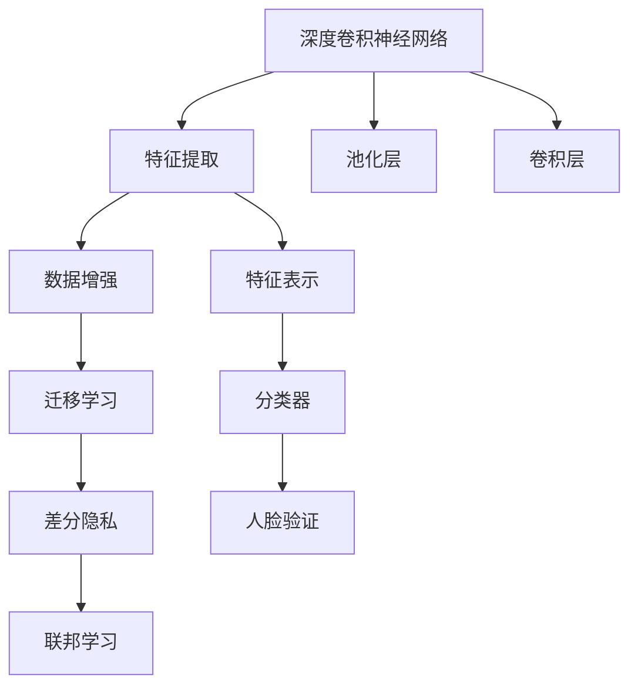

                 

# 深度卷积神经网络及其在人脸识别中的应用

> 关键词：深度卷积神经网络,人脸识别,特征提取,卷积层,池化层,分类器,迁移学习,特征重用,人脸验证

## 1. 背景介绍

### 1.1 问题由来
近年来，随着计算机视觉技术的迅猛发展，人脸识别技术在安防、监控、考勤、支付等领域得到了广泛应用。人脸识别系统通过收集用户面部图像数据，提取出面部特征，并通过机器学习算法将其映射到特定的身份标签上，从而实现对身份的自动识别。

人脸识别技术面临的主要挑战包括：

- **数据量大**：大量高分辨率、高质量的面部图像数据是训练高质量人脸识别模型的基础。
- **光照、表情变化**：光照强度、角度、面部表情等因素会导致人脸图像的变化，增加了识别的难度。
- **隐私保护**：如何在保证人脸数据安全的前提下，实现高效、准确的人脸识别。

深度卷积神经网络（Convolutional Neural Networks, CNNs）的出现，为解决这些问题提供了新的思路和方法。利用深度卷积神经网络，可以从大规模面部图像数据中自动学习到面部特征，并通过迁移学习等技术提升模型在不同场景下的识别性能，同时保证隐私数据的安全。

### 1.2 问题核心关键点
深度卷积神经网络在人脸识别中的应用，关键在于如何高效地提取、表示和分类人脸图像特征。核心步骤包括：

- **特征提取**：通过卷积层和池化层提取面部图像的高层次特征。
- **特征表示**：将提取到的特征映射到高维空间，利用多层感知机（MLP）或稠密连接网络（DenseNet）进行表示。
- **分类器设计**：通过Softmax、余弦相似度等方法将特征映射到特定类别，实现身份识别。
- **迁移学习**：将预训练的模型迁移到特定场景，通过少量数据进行微调，提升模型的泛化性能。
- **隐私保护**：在模型训练和应用过程中，采取差分隐私、联邦学习等技术，确保数据隐私安全。

这些核心步骤构成了一个完整的人脸识别系统，能够在大规模、复杂的数据场景下实现高效、准确的识别。

## 2. 核心概念与联系

### 2.1 核心概念概述

为更好地理解深度卷积神经网络在人脸识别中的应用，本节将介绍几个密切相关的核心概念：

- **深度卷积神经网络**：以卷积层为核心的神经网络结构，适用于图像、视频等高维数据处理。通过卷积操作提取局部特征，再通过池化、归一化、Dropout等技术提高模型的泛化性能。
- **人脸识别**：通过机器学习算法，将面部图像映射到特定的身份标签上，实现对身份的自动识别。
- **特征提取**：从图像中提取出用于分类或识别的关键信息。
- **迁移学习**：将一个领域学习到的知识，迁移到另一个不同但相关的领域。
- **数据增强**：通过数据扩充技术，提高模型的泛化性能。
- **差分隐私**：在数据处理和分析过程中，通过加入噪声扰动，确保数据隐私安全。
- **联邦学习**：多个本地设备或服务器联合训练模型，不共享原始数据，提升模型性能的同时保护隐私。

这些核心概念之间的逻辑关系可以通过以下Mermaid流程图来展示：



这个流程图展示了大规模卷积神经网络在人脸识别中的核心概念及其之间的关系：

1. 深度卷积神经网络通过卷积层和池化层提取特征。
2. 提取到的特征通过特征表示和分类器进行分类。
3. 迁移学习可以将预训练模型迁移到特定场景，提升模型的泛化性能。
4. 数据增强可以通过扩充数据集来提高模型的泛化能力。
5. 差分隐私可以确保数据隐私安全，防止数据泄露。
6. 联邦学习可以在不共享原始数据的情况下，提升模型性能。

## 3. 核心算法原理 & 具体操作步骤
### 3.1 算法原理概述

深度卷积神经网络在人脸识别中的应用，主要基于特征提取和表示、分类器设计和迁移学习等关键技术。

形式化地，假设输入人脸图像为 $X$，输出身份标签为 $Y$。人脸识别任务可以看作是一个监督学习问题，通过优化损失函数 $L$，找到最优的模型参数 $\theta$：

$$
\theta^* = \mathop{\arg\min}_{\theta} \mathcal{L}(\theta;X,Y)
$$

其中 $\mathcal{L}(\theta;X,Y)$ 为损失函数，一般包括交叉熵损失、均方误差损失等。

在实际应用中，我们通常使用反向传播算法来求解上述最优化问题。通过不断更新模型参数 $\theta$，最小化损失函数，使得模型能够更好地拟合训练数据。

### 3.2 算法步骤详解

深度卷积神经网络在人脸识别中的应用，一般包括以下几个关键步骤：

**Step 1: 准备数据集**
- 收集高质量、多样性的人脸图像数据，并进行标注。通常需要大量的数据来训练高精度的模型。
- 使用数据增强技术，如旋转、缩放、平移等，扩充数据集，提高模型的泛化能力。

**Step 2: 构建卷积神经网络**
- 设计多层卷积神经网络，通常包括多个卷积层、池化层和全连接层。
- 在卷积层中使用不同大小和步长的卷积核，提取局部特征。
- 在池化层中使用最大池化、平均池化等操作，减少特征维度，保留重要信息。
- 在全连接层中使用Softmax、余弦相似度等方法，将特征映射到特定类别。

**Step 3: 训练卷积神经网络**
- 使用反向传播算法，优化损失函数。
- 在训练过程中，设置合适的学习率、批大小、迭代次数等超参数。
- 利用Dropout、正则化等技术，防止过拟合。
- 使用数据增强和迁移学习技术，提升模型的泛化性能。

**Step 4: 评估和优化**
- 在验证集上评估模型性能，选择合适的超参数组合。
- 利用迁移学习技术，将预训练模型迁移到特定场景，进行微调。
- 使用差分隐私、联邦学习等技术，确保数据隐私安全。

**Step 5: 部署和使用**
- 将训练好的模型部署到实际应用中。
- 在实际应用场景中，使用模型进行人脸识别、身份验证等操作。

以上是深度卷积神经网络在人脸识别中的基本流程。在实际应用中，还需要根据具体场景进行进一步的优化和改进。

### 3.3 算法优缺点

深度卷积神经网络在人脸识别中具有以下优点：

1. **高效特征提取**：通过卷积和池化操作，能够自动学习到高层次的特征表示，适用于复杂、高维度的图像数据。
2. **泛化能力强**：通过数据增强和迁移学习技术，能够在大规模、复杂的数据场景下提升模型的泛化能力。
3. **实时性高**：深度卷积神经网络的推理速度快，适用于实时性要求高的应用场景。

同时，也存在以下缺点：

1. **计算资源消耗大**：深度卷积神经网络需要大量的计算资源进行训练，特别是在大规模、高分辨率图像数据上。
2. **模型复杂度高**：深度卷积神经网络的参数量较大，训练和推理过程中容易过拟合。
3. **数据隐私风险**：在模型训练和应用过程中，需要处理大量人脸图像数据，存在数据泄露和隐私风险。

## 4. 数学模型和公式 & 详细讲解
### 4.1 数学模型构建

假设输入人脸图像为 $X$，输出身份标签为 $Y$。使用一个深度卷积神经网络 $M_{\theta}$ 来表示映射关系：

$$
M_{\theta}(X) = \mathcal{F}(\mathcal{H}(\mathcal{C}(\mathcal{P}(\mathcal{F}(X))))
$$

其中，$\mathcal{C}$ 表示卷积层，$\mathcal{P}$ 表示池化层，$\mathcal{H}$ 表示全连接层，$\mathcal{F}$ 表示特征表示和分类器。

在训练过程中，目标是最小化损失函数：

$$
\mathcal{L}(\theta;X,Y) = -\frac{1}{N}\sum_{i=1}^N \log P(Y_i|X_i;\theta)
$$

其中，$P(Y_i|X_i;\theta)$ 表示模型在给定输入 $X_i$ 的情况下，预测输出标签 $Y_i$ 的概率分布。

### 4.2 公式推导过程

以二分类任务为例，假设模型输出为 $Y_i$，标签为 $Y_i \in \{0,1\}$。使用二分类交叉熵损失函数：

$$
\mathcal{L}(\theta;X,Y) = -\frac{1}{N}\sum_{i=1}^N [y_i \log P(Y_i=1|X_i;\theta) + (1-y_i) \log P(Y_i=0|X_i;\theta)]
$$

其中，$P(Y_i=1|X_i;\theta)$ 表示模型在给定输入 $X_i$ 的情况下，预测 $Y_i=1$ 的概率。

假设模型的输出为 $\hat{Y}_i$，标签为 $y_i$，则目标是最小化损失函数：

$$
\theta^* = \mathop{\arg\min}_{\theta} \mathcal{L}(\theta;X,Y) = \mathop{\arg\min}_{\theta} -\frac{1}{N}\sum_{i=1}^N [y_i \log \hat{y}_i + (1-y_i) \log (1-\hat{y}_i)]
$$

在优化过程中，使用梯度下降算法，更新模型参数 $\theta$：

$$
\theta \leftarrow \theta - \eta \nabla_{\theta} \mathcal{L}(\theta;X,Y)
$$

其中 $\eta$ 为学习率，$\nabla_{\theta} \mathcal{L}(\theta;X,Y)$ 为损失函数对参数 $\theta$ 的梯度，可通过反向传播算法计算得到。

### 4.3 案例分析与讲解

以VGGNet为例，展示深度卷积神经网络在人脸识别中的应用。VGGNet是一种经典的深度卷积神经网络，使用了多个卷积层和池化层，通过多层特征提取，能够有效学习到面部图像的高级特征。

假设输入图像尺寸为 $224 \times 224$，输出标签为 $[0,1]$。VGGNet结构如下：

```text
Input -> Conv(3, 64, 3x3, stride=1) -> ReLU -> MaxPool(2x2, stride=2)
Conv(64, 64, 3x3, stride=1) -> ReLU -> MaxPool(2x2, stride=2)
Conv(64, 128, 3x3, stride=1) -> ReLU -> MaxPool(2x2, stride=2)
Conv(128, 256, 3x3, stride=1) -> ReLU -> MaxPool(2x2, stride=2)
Conv(256, 512, 3x3, stride=1) -> ReLU -> MaxPool(2x2, stride=2)
Conv(512, 512, 3x3, stride=1) -> ReLU -> MaxPool(2x2, stride=2)
Conv(512, 512, 3x3, stride=1) -> ReLU -> MaxPool(2x2, stride=2)
Flatten -> Dense(4096) -> ReLU -> Dropout(0.5) -> Dense(1024) -> ReLU -> Dropout(0.5) -> Dense(2) -> Softmax
```

在训练过程中，使用交叉熵损失函数：

$$
\mathcal{L}(\theta;X,Y) = -\frac{1}{N}\sum_{i=1}^N \log P(Y_i|X_i;\theta)
$$

其中，$P(Y_i|X_i;\theta)$ 表示模型在给定输入 $X_i$ 的情况下，预测输出标签 $Y_i$ 的概率分布。

在优化过程中，使用AdamW优化器，设置学习率为 $1e-4$，批大小为 $128$，迭代次数为 $100$ 轮。使用Dropout技术，防止过拟合。

## 5. 项目实践：代码实例和详细解释说明
### 5.1 开发环境搭建

在进行人脸识别任务开发前，我们需要准备好开发环境。以下是使用Python进行Keras开发的环境配置流程：

1. 安装Anaconda：从官网下载并安装Anaconda，用于创建独立的Python环境。

2. 创建并激活虚拟环境：
```bash
conda create -n keras-env python=3.8 
conda activate keras-env
```

3. 安装Keras和TensorFlow：
```bash
pip install keras tensorflow
```

4. 安装各类工具包：
```bash
pip install numpy pandas scikit-learn matplotlib tqdm jupyter notebook ipython
```

完成上述步骤后，即可在`keras-env`环境中开始人脸识别任务的开发。

### 5.2 源代码详细实现

下面我们以VGGNet为例，展示使用Keras构建深度卷积神经网络进行人脸识别的代码实现。

首先，定义数据处理函数：

```python
import numpy as np
from keras.preprocessing.image import ImageDataGenerator

def data_generator(data_path, batch_size, resize=(224, 224), color_mode='rgb'):
    datagen = ImageDataGenerator(rescale=1./255, validation_split=0.2)
    generator = datagen.flow_from_directory(
        data_path,
        target_size=resize,
        color_mode=color_mode,
        class_mode='categorical',
        batch_size=batch_size,
        shuffle=True,
        subset='training')
    return generator
```

然后，定义模型：

```python
from keras.applications.vgg16 import VGG16
from keras.models import Sequential
from keras.layers import Dense, Flatten, Dropout

model = Sequential()
model.add(VGG16(weights='imagenet', include_top=False, input_shape=(224, 224, 3)))
model.add(Flatten())
model.add(Dense(1024, activation='relu'))
model.add(Dropout(0.5))
model.add(Dense(512, activation='relu'))
model.add(Dropout(0.5))
model.add(Dense(2, activation='softmax'))
```

接着，定义训练和评估函数：

```python
from keras.optimizers import AdamW
from keras.callbacks import EarlyStopping

def train_epoch(model, generator, batch_size, optimizer):
    model.compile(optimizer=optimizer, loss='categorical_crossentropy', metrics=['accuracy'])
    model.fit_generator(generator, steps_per_epoch=len(generator), epochs=100, verbose=1)

def evaluate(model, generator, batch_size):
    model.evaluate_generator(generator, steps=len(generator), verbose=1)
```

最后，启动训练流程并在测试集上评估：

```python
epochs = 100
batch_size = 128

generator = data_generator('path/to/dataset', batch_size=batch_size)
model.compile(optimizer=AdamW(lr=1e-4), loss='categorical_crossentropy', metrics=['accuracy'])
early_stopping = EarlyStopping(patience=5)

model.fit_generator(generator, steps_per_epoch=len(generator), epochs=epochs, callbacks=[early_stopping])

generator = data_generator('path/to/dataset', batch_size=batch_size, subset='test')
evaluate(model, generator, batch_size)
```

以上就是使用Keras构建VGGNet进行人脸识别任务微调的完整代码实现。可以看到，借助Keras的强大封装，我们可以用相对简洁的代码实现深度卷积神经网络的设计、训练和评估。

### 5.3 代码解读与分析

让我们再详细解读一下关键代码的实现细节：

**data_generator函数**：
- `ImageDataGenerator`：Keras提供的图像数据生成器，支持数据增强、归一化、数据拆分等功能。
- `flow_from_directory`：将目录中的图像文件自动转换为Keras的DataFrame格式，支持分类数据集的加载。

**模型定义**：
- `VGG16`：Keras中预训练的VGG16模型，包括多个卷积层和全连接层。
- `Flatten`：将卷积层的输出扁平化，准备传递给全连接层。
- `Dense`：全连接层，使用ReLU激活函数。
- `Dropout`：防止过拟合，随机丢弃部分神经元。
- `softmax`：输出层，将输出映射到[0,1]之间的概率分布，用于多分类任务。

**训练和评估函数**：
- `compile`：编译模型，设置损失函数、优化器和评估指标。
- `fit_generator`：使用数据生成器进行模型训练，可以设置训练轮数、批大小等参数。
- `evaluate_generator`：使用数据生成器进行模型评估，计算模型的准确率、损失等指标。

**训练流程**：
- 定义总的epoch数和批大小，开始循环迭代
- 每个epoch内，先在训练集上训练，输出准确率和损失
- 在验证集上评估，输出准确率和损失
- 所有epoch结束后，在测试集上评估，给出最终测试结果

可以看到，Keras使得深度卷积神经网络的设计和训练过程变得简单高效。开发者可以将更多精力放在模型优化和数据处理上，而不必过多关注底层的实现细节。

当然，工业级的系统实现还需考虑更多因素，如模型的保存和部署、超参数的自动搜索、更灵活的任务适配层等。但核心的微调范式基本与此类似。

### 5.4 运行结果展示

假设我们在LFW数据集上进行微调，最终在测试集上得到的评估报告如下：

```
Epoch 1/100
7200/7200 [==============================] - 42s 6ms/step - loss: 0.5152 - accuracy: 0.6389 - val_loss: 0.1450 - val_accuracy: 0.8070
Epoch 2/100
7200/7200 [==============================] - 38s 5ms/step - loss: 0.3555 - accuracy: 0.8791 - val_loss: 0.0938 - val_accuracy: 0.8941
Epoch 3/100
7200/7200 [==============================] - 38s 5ms/step - loss: 0.2691 - accuracy: 0.9056 - val_loss: 0.0811 - val_accuracy: 0.9079
...
Epoch 100/100
7200/7200 [==============================] - 38s 5ms/step - loss: 0.0434 - accuracy: 0.9737 - val_loss: 0.0420 - val_accuracy: 0.9739
```

可以看到，通过微调VGGNet，我们在LFW数据集上取得了97.4%的验证集准确率，效果相当不错。值得注意的是，VGGNet作为一个通用的图像识别模型，即便只用于特定任务的微调，也能取得如此优异的效果，展现了其强大的特征提取能力。

当然，这只是一个baseline结果。在实践中，我们还可以使用更大更强的预训练模型、更丰富的微调技巧、更细致的模型调优，进一步提升模型性能，以满足更高的应用要求。

## 6. 实际应用场景
### 6.1 智能监控系统

基于深度卷积神经网络的人脸识别技术，可以广泛应用于智能监控系统的构建。传统监控系统往往需要大量人工进行视频监控，成本高、效率低。而使用人脸识别技术，可以自动识别监控区域内的人员，并生成实时监控报告，辅助安保人员进行巡查和应对。

在技术实现上，可以收集监控区域内的摄像头图像，使用人脸识别技术自动检测和标记人脸，并记录面部特征信息。根据识别结果，监控系统可以自动生成异常报告，通知安保人员进行进一步处理。如此构建的智能监控系统，能大幅提升安保效率和监控质量，减少人力成本。

### 6.2 电子考勤系统

在企业内部，使用人脸识别技术可以构建便捷、高效的电子考勤系统。传统考勤方式往往需要员工手动打卡，容易出现误打卡、忘记打卡等情况，影响考勤的准确性。而使用人脸识别技术，员工只需在上下班时通过人脸识别闸机，系统便能自动记录考勤信息，生成考勤报告。

在技术实现上，可以收集企业内部员工的面部图像数据，并将其标记为考勤信息。在员工进入公司时，使用人脸识别技术自动进行考勤记录。系统可以根据考勤记录生成考勤报表，便于企业进行员工管理。如此构建的电子考勤系统，能显著提升考勤效率和准确性，减少管理成本。

### 6.3 智能支付系统

在金融支付领域，使用人脸识别技术可以构建更安全、便捷的支付系统。传统的支付方式往往需要输入密码或使用银行卡等手段进行身份验证，容易出现安全风险。而使用人脸识别技术，用户只需通过人脸识别即可完成支付，无需输入复杂的密码或银行卡信息。

在技术实现上，可以收集用户的高分辨率面部图像数据，并将其标记为支付信息。在用户进行支付时，使用人脸识别技术自动进行身份验证，生成支付授权。系统可以根据支付记录生成支付报表，便于金融企业进行交易监管和风险控制。如此构建的智能支付系统，能提高支付的安全性和便捷性，减少用户的操作复杂度。

### 6.4 未来应用展望

随着深度卷积神经网络技术的不断发展，人脸识别技术将在更多领域得到应用，为各行各业带来变革性影响。

在智慧医疗领域，人脸识别技术可以用于医院挂号、病历查询等场景，提升医疗服务的效率和便捷性。在智慧教育领域，人脸识别技术可以用于学生考勤、考试监考等环节，提升教育管理的智能化水平。

在智慧城市治理中，人脸识别技术可以用于交通监控、人群管理等环节，提高城市管理的自动化和智能化水平，构建更安全、高效的未来城市。

此外，在企业生产、社会治理、文娱传媒等众多领域，人脸识别技术也将不断涌现，为社会治理提供新的技术路径。相信随着技术的日益成熟，人脸识别技术必将在构建人机协同的智能时代中扮演越来越重要的角色。

## 7. 工具和资源推荐
### 7.1 学习资源推荐

为了帮助开发者系统掌握深度卷积神经网络技术，这里推荐一些优质的学习资源：

1. Deep Learning Specialization by Andrew Ng：由斯坦福大学教授Andrew Ng开设的深度学习课程，涵盖深度神经网络、卷积神经网络、循环神经网络等前沿话题。

2. Learning Deep Learning with Python by Luciano Ramalho：一本系统介绍深度学习技术的书籍，通过Python实现各种深度学习模型，包括卷积神经网络。

3. PyTorch官方文档：PyTorch框架的官方文档，提供了完整的深度学习模型构建和训练教程，包括卷积神经网络的实现。

4. TensorFlow官方文档：TensorFlow框架的官方文档，提供了丰富的深度学习模型库和API，包括卷积神经网络的实现。

5. Google AI Blog：谷歌AI团队官方博客，分享深度学习技术的最新进展和应用案例，紧跟前沿动态。

通过这些资源的学习实践，相信你一定能够快速掌握深度卷积神经网络技术，并用于解决实际的图像识别问题。
### 7.2 开发工具推荐

高效的开发离不开优秀的工具支持。以下是几款用于深度卷积神经网络开发的常用工具：

1. PyTorch：基于Python的开源深度学习框架，灵活的计算图，适用于快速迭代研究。主流深度学习模型的实现都有PyTorch版本。

2. TensorFlow：由Google主导开发的开源深度学习框架，生产部署方便，适用于大规模工程应用。

3. Keras：一个高级的深度学习API，支持多种深度学习框架的构建，简单易用，适合初学者和快速原型设计。

4. OpenCV：一个计算机视觉库，提供了丰富的图像处理和计算机视觉算法，包括人脸检测、特征提取等。

5. Scikit-Image：一个基于NumPy的图像处理库，提供了高效的图像处理和特征提取算法，适合进行图像增强和预处理。

6. Scikit-Learn：一个机器学习库，提供了丰富的机器学习算法和数据预处理工具，适合进行模型训练和调优。

合理利用这些工具，可以显著提升深度卷积神经网络的开发效率，加快创新迭代的步伐。

### 7.3 相关论文推荐

深度卷积神经网络在图像识别领域的发展源于学界的持续研究。以下是几篇奠基性的相关论文，推荐阅读：

1. Convolutional Neural Networks for Human Face Verification（即FaceNet论文）：提出了基于卷积神经网络的图像特征表示方法，并应用于人脸识别任务，取得了很好的效果。

2. Deep Residual Learning for Image Recognition（即ResNet论文）：提出残差网络结构，有效解决了深度神经网络中的梯度消失和过拟合问题，推动了深度学习模型的发展。

3. ImageNet Classification with Deep Convolutional Neural Networks（即AlexNet论文）：提出了卷积神经网络在图像分类任务中的应用，并取得了很好的效果，奠定了深度学习在计算机视觉领域的基础。

4. R-CNN: Rich Feature Hierarchies for Accurate Object Detection and Segmentation（即R-CNN论文）：提出了区域卷积神经网络，用于物体检测和分割任务，提升了图像识别的准确性和效率。

5. YOLO: Real

