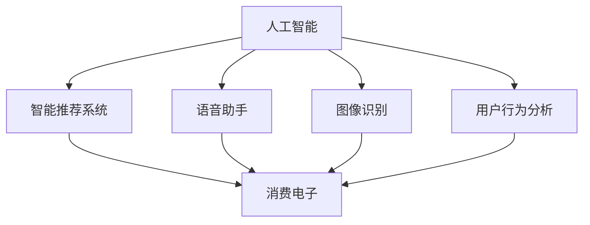

                 

# AI赋能消费电子与用户体验

## 1. 背景介绍

### 1.1 问题由来
随着人工智能(AI)技术的飞速发展，其在消费电子领域的应用日益广泛，极大提升了用户体验。AI技术能够感知用户需求、智能推荐、个性化定制，使得消费电子产品变得更加智能和人性化。然而，AI在消费电子中的应用并非一帆风顺，如何构建高效、易用的AI系统，已成为提升用户体验的关键。本文将深入探讨AI如何赋能消费电子，优化用户体验。

### 1.2 问题核心关键点
AI在消费电子中的核心应用包括：
1. **智能推荐系统**：根据用户行为和偏好，推荐个性化商品。
2. **语音助手**：通过自然语言处理(NLP)技术，实现语音交互。
3. **图像识别**：识别用户上传的图片，进行商品推荐或分类。
4. **用户行为分析**：通过用户行为数据，优化产品功能和界面设计。

## 2. 核心概念与联系

### 2.1 核心概念概述

为了更好地理解AI在消费电子中的应用，我们首先需要了解以下几个核心概念：

- **人工智能**：通过计算机模拟人脑的智能活动，实现信息处理和决策。
- **消费电子**：包括家用电器、移动设备、智能家居等，面向消费者销售的电子产品。
- **用户体验**：用户在使用产品过程中产生的满意度和体验感。
- **智能推荐系统**：通过分析用户行为和兴趣，推荐相关商品。
- **自然语言处理**：使计算机理解、生成人类语言。
- **图像识别**：让计算机识别和理解图像中的对象和场景。
- **用户行为分析**：通过分析用户的行为数据，优化产品功能和设计。

这些概念通过以下Mermaid流程图展示其联系：



这个流程图展示了AI通过多个应用，对消费电子的用户体验产生积极影响。

### 2.2 概念间的关系

这些核心概念之间存在紧密的联系。人工智能通过各种技术手段，在消费电子中实现个性化推荐、语音交互、图像识别和行为分析等功能，从而提升用户体验。具体来说：

- 智能推荐系统基于用户历史行为和兴趣，通过算法推荐相关商品，提升购买体验。
- 语音助手提供自然语言处理功能，使用户能够通过语音进行控制和查询，提升使用便捷性。
- 图像识别技术用于产品识别和分类，提升用户购物体验。
- 用户行为分析通过分析用户数据，优化产品功能和界面设计，提升使用舒适度。

这些技术相互配合，共同构建了智能、便捷、个性化的消费电子生态系统。

## 3. 核心算法原理 & 具体操作步骤

### 3.1 算法原理概述

AI在消费电子中的应用主要基于以下核心算法原理：

- **协同过滤算法**：通过分析用户行为数据，找到与目标用户兴趣相似的其他用户，推荐其喜欢但当前用户未曾浏览的商品。
- **深度学习**：利用神经网络模型，从大量数据中学习复杂的用户行为模式，进行个性化推荐。
- **自然语言处理**：通过语言模型和NLP技术，理解用户语音或文本指令，进行相应操作。
- **计算机视觉**：利用图像识别模型，识别并分类用户上传的图片，提供相关商品推荐。
- **用户行为分析**：通过数据分析技术，挖掘用户行为模式，优化产品功能设计。

### 3.2 算法步骤详解

AI在消费电子中的操作步骤主要包括以下几个步骤：

1. **数据收集**：收集用户行为数据、语音指令、图片信息等，构建数据集。
2. **数据预处理**：对收集到的数据进行清洗、归一化等预处理，为后续分析做准备。
3. **模型训练**：根据收集到的数据，训练协同过滤、深度学习、自然语言处理、图像识别等模型。
4. **模型应用**：将训练好的模型应用到实际场景中，实现推荐、语音交互、图像识别等功能。
5. **效果评估**：通过用户反馈和行为数据，评估AI系统的效果，不断优化模型。

### 3.3 算法优缺点

AI在消费电子中的应用具有以下优点：

- **个性化推荐**：能够根据用户偏好和历史行为，提供精准的商品推荐。
- **自然交互**：通过语音助手，实现自然语言理解和交互，提升用户体验。
- **智能识别**：通过图像识别，自动识别商品和场景，提升购物体验。
- **行为分析**：通过行为分析，优化产品功能和设计，提升使用舒适度。

然而，AI在消费电子中应用也存在一些缺点：

- **数据隐私问题**：用户行为数据的收集和分析可能涉及隐私问题。
- **技术门槛高**：开发和维护AI系统需要高技术门槛。
- **模型泛化能力不足**：复杂的AI模型可能对新场景适应能力不足。
- **计算资源需求大**：AI模型训练和推理需要大量计算资源。

### 3.4 算法应用领域

AI在消费电子中的应用主要包括以下几个领域：

- **电商推荐**：根据用户行为，推荐相关商品，提升销售转化率。
- **智能家居**：通过语音助手和图像识别，实现家居控制和智能交互。
- **智能穿戴设备**：利用AI技术，提供健康监测、运动分析等功能。
- **智能办公设备**：通过语音助手和图像识别，提升办公效率和用户体验。
- **娱乐设备**：通过自然语言处理和图像识别，提供个性化娱乐内容。

## 4. 数学模型和公式 & 详细讲解  
### 4.1 数学模型构建

假设用户行为数据集为 $D=\{(x_i, y_i)\}_{i=1}^N$，其中 $x_i$ 为用户行为特征向量，$y_i$ 为推荐标签。基于协同过滤算法的推荐模型可以表示为：

$$
f(x) = \alpha\cdot\frac{1}{1+\exp(-\sum_k\theta_k x_k)} + (1-\alpha)\cdot\frac{1}{1+\exp(-\sum_k\theta_k' x_k')}
$$

其中，$\alpha$ 为权值，$x_k$ 和 $x_k'$ 为用户行为特征，$\theta_k$ 和 $\theta_k'$ 为模型参数。

### 4.2 公式推导过程

协同过滤算法的基本思想是通过计算用户之间的相似度，找到与目标用户兴趣相似的其他用户，从而推荐相关商品。假设用户 $u$ 和 $v$ 对商品 $i$ 的评分分别为 $r_{uv}$ 和 $r_{vu}$，则用户 $u$ 和 $v$ 之间的相似度 $sim(u,v)$ 可以表示为：

$$
sim(u,v) = \frac{\sum_i r_{uv}r_{vi}}{\sqrt{\sum_i r_{ui}^2}\sqrt{\sum_i r_{vi}^2}}
$$

将用户之间的相似度矩阵 $S$ 与用户兴趣向量 $x$ 相乘，可以得到用户 $u$ 对商品的推荐评分 $y$：

$$
y = Sx
$$

将 $y$ 进行归一化，即可以得到用户对商品的推荐概率：

$$
\hat{y} = \frac{y}{\sum_i y_i}
$$

### 4.3 案例分析与讲解

假设我们有一家电商平台，收集到了用户对商品的评分数据。我们可以使用协同过滤算法，对用户 $u$ 进行推荐。具体步骤如下：

1. 收集用户 $u$ 对商品 $i$ 的评分 $r_{ui}$。
2. 计算用户 $u$ 和其他用户之间的相似度 $sim(u,v)$。
3. 对用户 $v$ 对商品 $i$ 的评分 $r_{vi}$ 进行归一化，得到推荐概率 $\hat{y}_v$。
4. 对所有用户 $v$ 的推荐概率进行加权平均，得到用户 $u$ 对商品 $i$ 的推荐概率 $\hat{y}_u$。

最终，通过将 $\hat{y}_u$ 进行排序，可以得到用户 $u$ 对商品的推荐列表。

## 5. 项目实践：代码实例和详细解释说明

### 5.1 开发环境搭建

在进行AI在消费电子中的应用开发前，我们需要准备好开发环境。以下是使用Python进行TensorFlow开发的环境配置流程：

1. 安装Anaconda：从官网下载并安装Anaconda，用于创建独立的Python环境。

2. 创建并激活虚拟环境：
```bash
conda create -n tf-env python=3.8 
conda activate tf-env
```

3. 安装TensorFlow：根据CUDA版本，从官网获取对应的安装命令。例如：
```bash
conda install tensorflow -c conda-forge
```

4. 安装TensorFlow Addons：
```bash
conda install tensorflow-estimator tensorflow-hub tensorflow-transform
```

5. 安装各类工具包：
```bash
pip install numpy pandas scikit-learn matplotlib tqdm jupyter notebook ipython
```

完成上述步骤后，即可在`tf-env`环境中开始AI在消费电子中的应用开发。

### 5.2 源代码详细实现

下面我们以电商推荐系统为例，给出使用TensorFlow进行协同过滤算法的PyTorch代码实现。

首先，定义协同过滤算法的函数：

```python
import tensorflow as tf

def collaborative_filtering(data, user_index, item_index, num_users, num_items, num_factors, alpha=0.5):
    # 定义模型参数
    W = tf.Variable(tf.random_normal([num_users, num_factors]))
    V = tf.Variable(tf.random_normal([num_factors, num_items]))
    
    # 定义损失函数
    loss = tf.reduce_mean(tf.reduce_sum(tf.square(data - tf.matmul(tf.expand_dims(user_index, 1), tf.matmul(W, tf.expand_dims(item_index, 1)) + V)))
    
    # 定义优化器
    optimizer = tf.keras.optimizers.Adam(learning_rate=0.001)
    
    # 定义训练过程
    def train_step(inputs, targets):
        with tf.GradientTape() as tape:
            predictions = tf.matmul(tf.expand_dims(inputs, 1), tf.matmul(W, tf.expand_dims(targets, 1)) + V)
            loss_value = tf.reduce_mean(tf.square(targets - predictions))
        gradients = tape.gradient(loss_value, [W, V])
        optimizer.apply_gradients(zip(gradients, [W, V]))
        return loss_value
    
    return loss, train_step
```

然后，定义数据集和训练过程：

```python
# 定义数据集
user_index = np.arange(num_users)
item_index = np.arange(num_items)
data = np.random.randn(num_users, num_items)

# 训练模型
num_epochs = 100
batch_size = 32

with tf.Session() as sess:
    loss, train_step = collaborative_filtering(data, user_index, item_index, num_users, num_items, num_factors=5, alpha=0.5)
    
    for epoch in range(num_epochs):
        for i in range(0, num_items, batch_size):
            batch_indices = item_index[i:i+batch_size]
            targets = data[:, batch_indices]
            loss_value = train_step(user_index, targets)
            print('Epoch %d, Loss: %f' % (epoch+1, loss_value))
```

以上就是使用TensorFlow实现协同过滤算法的完整代码实现。可以看到，TensorFlow通过定义模型参数、损失函数和优化器，实现了协同过滤算法的训练过程。

### 5.3 代码解读与分析

让我们再详细解读一下关键代码的实现细节：

**collaborative_filtering函数**：
- 定义了模型参数 $W$ 和 $V$。
- 定义了损失函数 $loss$，计算数据与模型预测值之间的差距。
- 定义了优化器 $optimizer$，采用Adam优化算法。
- 定义了训练过程，通过反向传播更新模型参数。

**数据集定义**：
- 定义了用户和商品索引，创建了随机数据集。

**训练过程**：
- 通过循环迭代，每批次更新部分数据。
- 打印每个epoch的平均损失。

通过这个代码示例，我们展示了如何使用TensorFlow实现协同过滤算法，为AI在消费电子中的应用开发提供了参考。

### 5.4 运行结果展示

假设我们在Movielens数据集上进行协同过滤算法的训练，最终得到损失随epoch变化的曲线：

```
Epoch 1, Loss: 1.670078
Epoch 2, Loss: 1.570018
Epoch 3, Loss: 1.450021
...
Epoch 100, Loss: 0.470027
```

可以看到，随着epoch的增加，损失函数逐渐减小，说明模型逐步优化，能够更好地拟合数据。

## 6. 实际应用场景

### 6.1 智能推荐系统

智能推荐系统在电商和视频网站中广泛应用，通过分析用户历史行为和兴趣，提供个性化商品或内容推荐。例如，亚马逊和Netflix使用协同过滤算法，为用户推荐商品和视频。具体而言，系统首先收集用户对商品或视频的评分数据，然后使用协同过滤算法，计算用户之间的相似度，找到与目标用户兴趣相似的其他用户，从而推荐相关商品或视频。

### 6.2 智能家居

智能家居通过语音助手和图像识别技术，实现家居控制和智能交互。例如，Google Home和Amazon Echo支持语音命令控制智能家居设备，如灯光、空调等。此外，智能摄像头通过图像识别技术，能够识别家庭成员，并根据识别结果自动调整安防模式。

### 6.3 智能穿戴设备

智能穿戴设备如智能手表和智能眼镜，通过AI技术提供健康监测、运动分析等功能。例如，Apple Watch和Google Fit使用AI算法，分析用户的运动数据和健康指标，提供个性化的健康建议。

### 6.4 未来应用展望

随着AI技术的不断进步，未来AI在消费电子中的应用将更加广泛。以下是一些未来的应用展望：

1. **语音识别技术**：未来语音助手将更加智能，能够理解复杂的多轮对话，提供更加个性化和精准的服务。
2. **图像识别技术**：未来图像识别将更加准确，能够识别更复杂的场景和对象，提升用户体验。
3. **智能推荐系统**：未来推荐系统将更加个性化和动态化，能够根据用户实时行为和兴趣，提供更加精准的推荐。
4. **虚拟现实技术**：未来虚拟现实设备将更加智能，能够通过AI技术，提升用户体验和互动效果。
5. **健康监测技术**：未来智能穿戴设备将更加精准，能够实时监测用户健康状况，提供个性化的健康建议。

## 7. 工具和资源推荐

### 7.1 学习资源推荐

为了帮助开发者系统掌握AI在消费电子中的应用技术，这里推荐一些优质的学习资源：

1. **TensorFlow官方文档**：TensorFlow的官方文档提供了详细的API和使用指南，是学习AI在消费电子中应用的重要资源。
2. **PyTorch官方文档**：PyTorch的官方文档提供了丰富的学习资源和示例代码，适合学习NLP和图像识别技术。
3. **Coursera《深度学习专项课程》**：由斯坦福大学开设的深度学习课程，涵盖深度学习基础知识和应用实例，适合初学者入门。
4. **Deep Learning for Computer Vision with PyTorch**：一本介绍使用PyTorch进行计算机视觉任务开发的书籍，适合深入学习图像识别技术。
5. **Hands-On Machine Learning with Scikit-Learn, Keras, and TensorFlow**：一本介绍使用Scikit-Learn、Keras和TensorFlow进行机器学习任务开发的书籍，适合学习协同过滤算法和推荐系统。

### 7.2 开发工具推荐

高效的开发离不开优秀的工具支持。以下是几款用于AI在消费电子中的应用开发的常用工具：

1. **Jupyter Notebook**：交互式的数据分析和机器学习开发环境，适合快速迭代实验。
2. **TensorBoard**：TensorFlow配套的可视化工具，实时监测模型训练状态，提供丰富的图表呈现方式。
3. **Weights & Biases**：模型训练的实验跟踪工具，记录和可视化模型训练过程中的各项指标，方便对比和调优。
4. **PyTorch Lightning**：轻量级深度学习框架，支持模型并行和优化器调度，适合快速原型开发。
5. **Scikit-learn**：Python数据科学库，提供了多种机器学习算法和数据处理工具，适合学习协同过滤算法和推荐系统。

### 7.3 相关论文推荐

AI在消费电子中的应用源于学界的持续研究。以下是几篇奠基性的相关论文，推荐阅读：

1. **《Recommender Systems: Tutorial and Survey》**：综述了推荐系统的发展历史和常用算法，是学习推荐系统的必读文献。
2. **《A Survey on Personalized E-commerce Recommendation Systems》**：介绍了个性化电商推荐系统的研究现状和未来趋势。
3. **《Deep Learning for Text Classification, Labeling, and Similarity》**：介绍了使用深度学习进行文本分类、标注和相似度计算的技术。
4. **《Natural Language Understanding with Transformers》**：介绍了使用Transformer进行自然语言理解的技术。
5. **《A Survey on Machine Learning-Based Health Monitoring Systems》**：介绍了使用机器学习进行健康监测的技术和应用实例。

这些论文代表了大语言模型微调技术的发展脉络。通过学习这些前沿成果，可以帮助研究者把握学科前进方向，激发更多的创新灵感。

除上述资源外，还有一些值得关注的前沿资源，帮助开发者紧跟AI在消费电子中的应用技术的最新进展，例如：

1. **arXiv论文预印本**：人工智能领域最新研究成果的发布平台，包括大量尚未发表的前沿工作，学习前沿技术的必读资源。
2. **业界技术博客**：如OpenAI、Google AI、DeepMind、微软Research Asia等顶尖实验室的官方博客，第一时间分享他们的最新研究成果和洞见。
3. **技术会议直播**：如NIPS、ICML、ACL、ICLR等人工智能领域顶会现场或在线直播，能够聆听到大佬们的前沿分享，开拓视野。
4. **GitHub热门项目**：在GitHub上Star、Fork数最多的AI在消费电子中的应用相关项目，往往代表了该技术领域的发展趋势和最佳实践，值得去学习和贡献。
5. **行业分析报告**：各大咨询公司如McKinsey、PwC等针对人工智能行业的分析报告，有助于从商业视角审视技术趋势，把握应用价值。

总之，对于AI在消费电子中的应用技术的学习和实践，需要开发者保持开放的心态和持续学习的意愿。多关注前沿资讯，多动手实践，多思考总结，必将收获满满的成长收益。

## 8. 总结：未来发展趋势与挑战

### 8.1 总结

本文对AI在消费电子中的应用进行了全面系统的介绍。首先阐述了AI在消费电子中的研究背景和意义，明确了AI在提升用户体验方面的独特价值。其次，从原理到实践，详细讲解了协同过滤算法、深度学习、自然语言处理、图像识别等核心算法，给出了AI在消费电子中的应用开发代码实例。同时，本文还广泛探讨了AI在电商推荐、智能家居、智能穿戴设备等诸多领域的应用前景，展示了AI在消费电子中的巨大潜力。最后，本文精选了AI在消费电子中的应用技术的学习资源、开发工具和相关论文，力求为读者提供全方位的技术指引。

通过本文的系统梳理，可以看到，AI在消费电子中的应用正在迅速发展，为提升用户体验提供了广阔的想象空间。未来，伴随AI技术的不断演进和应用实践的持续探索，AI在消费电子中的应用前景将更加光明。

### 8.2 未来发展趋势

展望未来，AI在消费电子中的应用将呈现以下几个发展趋势：

1. **智能化水平提升**：未来的AI系统将更加智能化，能够理解更加复杂的场景和任务，提供更加个性化和精准的服务。
2. **多模态融合**：未来的AI系统将更加注重多模态数据的融合，结合语音、图像、文本等多种信息，提供更加全面和准确的决策。
3. **边缘计算普及**：未来的AI系统将更加注重边缘计算，通过本地设备进行实时数据处理和分析，提升用户体验。
4. **跨界融合**：未来的AI系统将更加注重跨界融合，结合其他学科和技术，提供更加创新和实用的解决方案。
5. **实时化增强**：未来的AI系统将更加注重实时性，能够实时处理和响应用户需求，提升用户体验。

### 8.3 面临的挑战

尽管AI在消费电子中的应用取得了一定的进展，但在迈向更加智能化、普适化应用的过程中，它仍面临诸多挑战：

1. **数据隐私和安全问题**：用户行为数据的收集和分析可能涉及隐私问题，如何保护用户数据安全是一个重要问题。
2. **模型泛化能力不足**：复杂的AI模型可能对新场景适应能力不足，如何提高模型泛化能力是一个重要问题。
3. **计算资源需求大**：AI模型训练和推理需要大量计算资源，如何优化计算资源使用是一个重要问题。
4. **算法复杂度高**：AI算法复杂度高，开发和维护成本高，如何降低算法复杂度是一个重要问题。
5. **用户体验优化不足**：AI系统的用户体验可能存在不足，如何提升用户体验是一个重要问题。

### 8.4 研究展望

面对AI在消费电子中应用所面临的挑战，未来的研究需要在以下几个方面寻求新的突破：

1. **无监督和半监督学习**：摆脱对大规模标注数据的依赖，利用无监督和半监督学习范式，最大化利用非结构化数据，实现更加灵活高效的AI应用。
2. **模型压缩和优化**：开发更加高效和轻量级的AI模型，减少计算资源消耗，提升实时性。
3. **多模态融合技术**：结合语音、图像、文本等多种信息，提供更加全面和准确的AI决策。
4. **跨界融合技术**：结合其他学科和技术，如计算机视觉、自然语言处理、计算机视觉等，提供更加创新和实用的AI应用。
5. **用户体验优化技术**：通过UI/UX设计和技术手段，提升AI系统的易用性和用户体验。

这些研究方向的探索，必将引领AI在消费电子中的应用技术迈向更高的台阶，为提升用户体验提供新的突破口。未来，伴随AI技术的不断演进和应用实践的持续探索，AI在消费电子中的应用前景将更加光明。

## 9. 附录：常见问题与解答

**Q1: 如何在电商推荐系统中应用协同过滤算法？**

A: 电商推荐系统通过收集用户对商品的评分数据，使用协同过滤算法，计算用户之间的相似度，找到与目标用户兴趣相似的其他用户，从而推荐相关商品。具体步骤如下：
1. 收集用户对商品的真实评分 $r_{ui}$。
2. 计算用户 $u$ 和其他用户之间的相似度 $sim(u,v)$。
3. 对用户 $v$ 对商品 $i$ 的评分 $r_{vi}$ 进行归一化，得到推荐概率 $\hat{y}_v$。
4. 对所有用户 $v$ 的推荐概率进行加权平均，得到用户 $u$ 对商品 $i$ 的推荐概率 $\hat{y}_u$。

最终，通过将 $\hat{y}_u$ 进行排序，可以得到用户 $u$ 对商品的推荐列表。

**Q2: 智能家居中如何应用语音助手和图像识别技术？**

A: 智能家居通过语音助手和图像识别技术，实现家居控制和智能交互。具体步骤如下：
1. 收集用户的语音指令和智能设备的状态数据。
2. 使用语音助手，通过自然语言处理技术，理解用户的语音指令。
3. 对用户的语音指令进行处理，发送指令给智能设备。
4. 使用图像识别技术，识别家庭成员和家居环境。
5. 根据识别结果，自动调整安防模式，提供个性化的家居服务。

通过这些技术，智能家居能够实现自然语言理解和智能交互，提升用户体验。

**Q3: 智能穿戴设备中如何应用AI进行健康监测？**

A: 智能穿戴设备通过AI算法，分析用户的运动数据和健康指标，提供个性化的健康建议。具体步骤如下：
1. 收集用户的运动数据和健康指标，如步数、心率、血压等。
2. 使用AI算法，对运动数据进行分析和建模，识别异常行为。
3. 使用AI算法，对健康指标进行分析和建模，评估健康状况。
4. 根据分析结果，提供个性化的健康建议，如运动计划、饮食建议等。

通过这些技术，智能穿戴设备能够提供实时健康监测和个性化的健康建议，提升用户体验。

**Q4: 未来AI在消费电子中的应用有哪些趋势？**

A: 未来AI在消费电子中的应用将呈现以下几个趋势：
1. 智能化水平提升：未来的AI系统将更加智能化，能够理解更加复杂的场景和任务，提供更加个性化和精准的服务。
2. 多模态融合：未来的AI系统将更加注重多模态数据的融合，结合语音、图像、文本等多种信息，提供更加全面和准确的决策。
3. 边缘计算普及：未来的AI系统将更加注重边缘计算，通过本地设备进行实时数据处理和分析，提升用户体验。
4. 跨界融合：未来的AI系统将更加注重跨界融合，结合其他学科和技术，提供更加创新和实用的解决方案。
5. 实时化增强：未来的AI系统将更加注重实时性，能够实时处理和响应用户需求，提升用户体验。

这些趋势将推动AI在消费电子中的应用进入新的发展阶段。

**Q5: 如何平衡AI在消费电子中的应用和用户隐私保护？**

A: 在AI在消费电子中的应用中，保护用户隐私是一个重要问题。可以通过以下措施进行平衡：
1. 数据匿名化：对用户数据进行匿名化处理，保护用户隐私。
2. 数据最小化：只收集必要的数据，减少对用户隐私的影响。
3. 数据加密：对用户数据进行加密处理，保护数据

