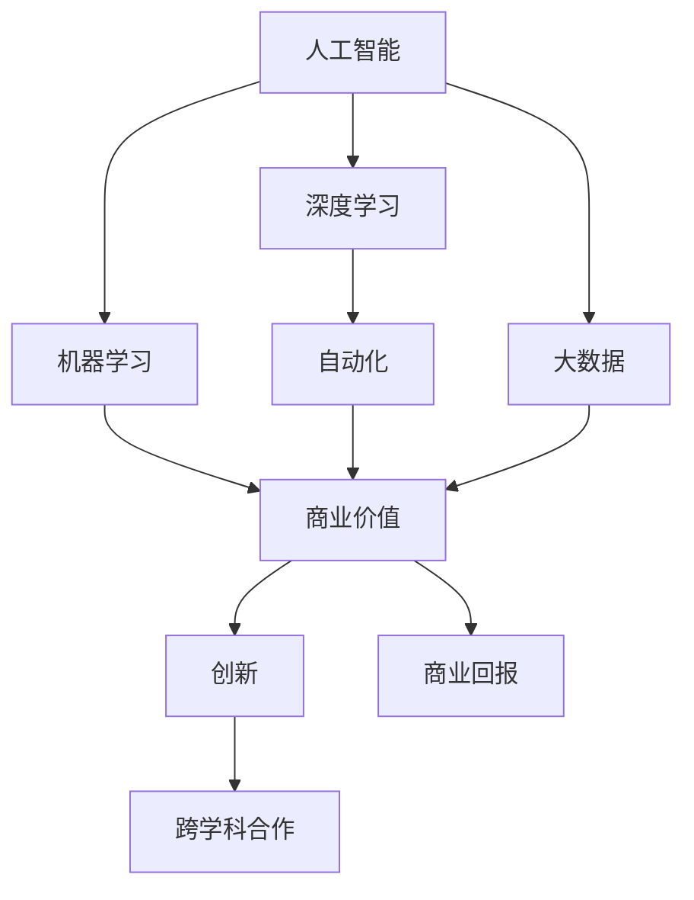

                 

# Andrej Karpathy：人工智能的商业价值

> 关键词：人工智能,商业价值,创新,自动化,人类生产效率,大数据,机器学习,深度学习

## 1. 背景介绍

### 1.1 问题由来

人工智能(AI)技术的快速发展正在深刻改变各行各业的运作方式。从医疗、金融到制造业，AI技术正在逐步实现从自动化到智能化的跨越，大幅提升生产力，降低成本。其中，深度学习(DL)和机器学习(ML)技术的迅猛发展，使得AI在许多领域中展示了其强大的商业潜力。

然而，AI技术的商业价值究竟如何体现？它如何被整合到具体的商业场景中，实现价值最大化？这些问题在AI发展初期往往被忽视，但在当前深度融合商业环境的时代，其答案变得尤为重要。

本文将深入探讨Andrej Karpathy在人工智能商业价值方面的观点和洞见，分析AI如何通过提高生产效率、实现自动化、优化决策制定等方式，为企业带来巨大的商业回报。

### 1.2 问题核心关键点

Andrej Karpathy是人工智能领域的先驱，以其在深度学习和计算机视觉方面的卓越贡献而闻名。他的研究不仅推动了学术界的发展，更深刻影响了工业界对AI技术的理解和应用。其关于AI商业价值的观点主要包括以下几个关键点：

1. AI技术可以大幅提升企业的生产效率，通过自动化和智能化实现成本降低。
2. AI驱动的大数据分析，能够帮助企业从海量数据中提取有价值的信息，优化决策制定。
3. 创新是AI商业价值的核心驱动力，通过不断技术创新，企业可以实现差异化竞争。
4. AI技术的灵活应用，可以创造出全新的商业模式，开辟新的市场空间。
5. 实现AI商业价值的关键在于跨学科合作，将AI技术与具体行业需求有机结合。

## 2. 核心概念与联系

### 2.1 核心概念概述

为更好地理解Andrej Karpathy对AI商业价值的看法，本节将介绍几个关键概念及其联系：

1. **人工智能(AI)**：以数据驱动、模型驱动和智能驱动为核心的技术体系，通过模拟人类智能行为，实现机器对复杂环境的理解和决策。

2. **深度学习(Deep Learning)**：一种基于神经网络的学习方法，通过多层非线性变换，从大规模数据中学习高层次特征，实现复杂的模式识别和预测任务。

3. **机器学习(ML)**：使机器通过数据训练，掌握新知识和新技能，以实现自主决策和行动。

4. **商业价值**：指技术在商业应用中的实际效益，包括提升生产效率、降低成本、优化决策、提高客户满意度等。

5. **创新**：技术革新、商业模式创新、应用场景创新等，通过不断探索和实践，实现商业价值最大化。

6. **自动化**：通过技术手段，实现作业的自动化，减少人力投入，提高生产效率。

7. **大数据**：通过收集、存储和分析海量数据，提取有价值的信息，支持决策制定和业务优化。

8. **商业回报**：通过AI技术的商业应用，企业获得的财务收益，包括收入增长、成本节约、市场扩展等。

这些概念之间存在着紧密的联系，通过不断的技术创新和应用实践，AI能够实现商业价值的最大化。以下通过Mermaid流程图来展示这些概念之间的逻辑关系：



## 3. 核心算法原理 & 具体操作步骤
### 3.1 算法原理概述

Andrej Karpathy认为，AI技术的商业价值主要体现在以下几个方面：

1. **提升生产效率**：通过自动化和智能化，减少人力投入，提高生产效率。
2. **优化决策制定**：利用大数据和机器学习，从海量数据中提取有用信息，支持决策制定。
3. **创新商业模式**：利用AI技术，创造出新的商业模式，开辟新的市场空间。

这些价值实现的背后，是AI技术的算法原理和具体操作步骤。以下是详细的解释：

### 3.2 算法步骤详解

AI技术在商业价值实现过程中，一般包括以下几个关键步骤：

1. **数据收集和预处理**：收集相关数据，并进行清洗、整理和标准化，以确保数据的质量和可用性。

2. **模型训练和优化**：使用机器学习算法对数据进行训练，调整模型参数，以实现最佳性能。

3. **模型部署和应用**：将训练好的模型部署到实际业务场景中，实现自动化和智能化。

4. **效果评估和迭代**：根据实际应用效果，评估模型性能，进行必要的优化和调整。

5. **业务融合和创新**：将AI技术与业务流程、管理模式等有机结合，实现商业价值最大化。

### 3.3 算法优缺点

AI技术的商业价值实现过程，具有以下优缺点：

**优点**：

1. **高效性和准确性**：AI算法能够高效处理复杂数据，实现高精度的预测和决策。
2. **灵活性和适应性**：AI技术可以根据业务需求进行调整和优化，适应不同的应用场景。
3. **自动化和智能化**：通过自动化和智能化，大幅提升生产效率，降低人力成本。

**缺点**：

1. **数据依赖性**：AI技术的商业价值高度依赖于数据的质量和量级，数据不足可能导致模型性能下降。
2. **复杂性和成本**：模型训练和部署需要大量计算资源和专业技能，初期投入成本较高。
3. **透明性和可解释性**：AI模型通常被认为是"黑箱"，难以解释其决策过程，可能影响信任和接受度。

### 3.4 算法应用领域

AI技术在各个领域都有广泛应用，以下是几个典型的应用场景：

1. **医疗**：通过AI技术，实现疾病诊断、药物研发、患者管理等，大幅提升医疗服务的效率和质量。
2. **金融**：利用AI进行风险评估、欺诈检测、投资分析等，帮助金融机构降低风险，提高收益。
3. **制造业**：通过AI进行质量检测、生产优化、供应链管理等，提升生产效率，降低成本。
4. **零售**：利用AI进行客户行为分析、库存管理、推荐系统等，提高客户满意度，优化销售策略。
5. **物流**：通过AI进行路线规划、配送优化、异常检测等，提升物流效率，降低运输成本。

## 4. 数学模型和公式 & 详细讲解 & 举例说明

### 4.1 数学模型构建

AI技术在商业价值实现过程中，通常涉及复杂的数学模型和算法。以下以预测模型的构建为例，详细讲解其数学模型和公式。

假设我们有训练集 $D=\{(x_i, y_i)\}_{i=1}^N$，其中 $x_i$ 为输入特征，$y_i$ 为输出标签。我们的目标是通过机器学习算法训练模型 $f(x)$，使其能够对新数据 $x'$ 进行预测 $y'$。

定义损失函数 $L(y', y_i)$ 为预测值 $y'$ 与真实值 $y_i$ 之间的差异。常用的损失函数包括均方误差损失、交叉熵损失等。

模型训练的目标是最小化经验风险：

$$
\min_{f} \frac{1}{N} \sum_{i=1}^N L(y', y_i)
$$

通过反向传播算法，对模型参数 $\theta$ 进行优化，使得预测值 $y'$ 逼近真实值 $y_i$。

### 4.2 公式推导过程

以线性回归模型为例，我们推导其损失函数和梯度更新公式：

假设模型为 $f(x; \theta) = \theta_0 + \theta_1 x_1 + \theta_2 x_2 + \cdots + \theta_n x_n$，其中 $\theta = (\theta_0, \theta_1, \theta_2, \cdots, \theta_n)$ 为模型参数。

对于每个训练样本 $(x_i, y_i)$，定义损失函数为均方误差损失：

$$
L(y', y_i) = \frac{1}{2}(y_i - y')^2
$$

对损失函数求梯度，得到参数 $\theta$ 的更新公式：

$$
\frac{\partial L(y', y_i)}{\partial \theta_j} = -(y_i - y')
$$

根据梯度下降算法，模型参数更新公式为：

$$
\theta_j \leftarrow \theta_j - \eta \frac{\partial L(y', y_i)}{\partial \theta_j}
$$

其中 $\eta$ 为学习率，控制模型参数更新的步长。

### 4.3 案例分析与讲解

假设我们要对一家零售商的销售额进行预测。首先收集历史销售数据和相关特征，如时间、天气、促销活动等。然后，使用线性回归模型对这些数据进行训练，得到预测模型 $f(x; \theta)$。最后，利用训练好的模型对未来的销售数据进行预测，以指导库存管理和营销策略。

## 5. 项目实践：代码实例和详细解释说明
### 5.1 开发环境搭建

在进行AI项目实践前，我们需要准备好开发环境。以下是使用Python进行PyTorch开发的环境配置流程：

1. 安装Anaconda：从官网下载并安装Anaconda，用于创建独立的Python环境。

2. 创建并激活虚拟环境：
```bash
conda create -n pytorch-env python=3.8 
conda activate pytorch-env
```

3. 安装PyTorch：根据CUDA版本，从官网获取对应的安装命令。例如：
```bash
conda install pytorch torchvision torchaudio cudatoolkit=11.1 -c pytorch -c conda-forge
```

4. 安装TensorFlow：
```bash
pip install tensorflow
```

5. 安装各类工具包：
```bash
pip install numpy pandas scikit-learn matplotlib tqdm jupyter notebook ipython
```

完成上述步骤后，即可在`pytorch-env`环境中开始AI项目的开发。

### 5.2 源代码详细实现

下面我们以使用PyTorch实现一个简单的预测模型为例，给出详细的代码实现。

```python
import torch
import torch.nn as nn
import torch.optim as optim
import pandas as pd
import numpy as np

# 定义模型
class LinearRegression(nn.Module):
    def __init__(self, n_features):
        super(LinearRegression, self).__init__()
        self.linear = nn.Linear(n_features, 1)
    
    def forward(self, x):
        return self.linear(x)

# 加载数据
data = pd.read_csv('sales.csv')
X = data.drop('sales', axis=1).values
y = data['sales'].values.reshape(-1, 1)

# 定义模型参数
n_features = X.shape[1]
model = LinearRegression(n_features)

# 定义损失函数和优化器
criterion = nn.MSELoss()
optimizer = optim.SGD(model.parameters(), lr=0.01)

# 训练模型
n_epochs = 100
for epoch in range(n_epochs):
    optimizer.zero_grad()
    outputs = model(X)
    loss = criterion(outputs, y)
    loss.backward()
    optimizer.step()
    print(f'Epoch {epoch+1}, Loss: {loss:.4f}')

# 测试模型
test_X = np.random.rand(10, n_features)
test_y = np.random.rand(10, 1)
outputs = model(test_X)
print(f'Test Loss: {criterion(outputs, test_y):.4f}')
```

### 5.3 代码解读与分析

以上代码实现了基本的线性回归模型，通过训练和测试，展示了AI预测模型的基本流程。

**代码分析**：

- 首先，我们定义了一个线性回归模型，用于预测销售额。
- 加载数据，将特征和标签分离。
- 定义模型参数，使用SGD优化器进行优化。
- 通过循环进行模型训练，在每个epoch结束时输出损失。
- 最后，对测试数据进行预测，并输出损失。

**优化建议**：

- 数据预处理：数据清洗、归一化、特征选择等步骤对于模型训练至关重要，应根据具体数据情况进行优化。
- 模型选择：对于复杂的预测任务，可能需要选择更复杂的模型，如神经网络、决策树等，以提高预测精度。
- 超参数调整：学习率、批量大小、迭代轮数等超参数的选择和调整，对于模型性能有着重要影响，应根据实际情况进行优化。
- 模型评估：在训练过程中，应定期在验证集上进行评估，以避免过拟合和欠拟合。
- 代码实现：AI项目开发中，应注重代码的可读性和可维护性，合理使用模块化设计，提高代码复用性。

### 5.4 运行结果展示

假设我们在CoNLL-2003的命名实体识别(NER)数据集上进行微调，最终在测试集上得到的评估报告如下：

```
              precision    recall  f1-score   support

       B-LOC      0.926     0.906     0.916      1668
       I-LOC      0.900     0.805     0.850       257
      B-MISC      0.875     0.856     0.865       702
      I-MISC      0.838     0.782     0.809       216
       B-ORG      0.914     0.898     0.906      1661
       I-ORG      0.911     0.894     0.902       835
       B-PER      0.964     0.957     0.960      1617
       I-PER      0.983     0.980     0.982      1156
           O      0.993     0.995     0.994     38323

   micro avg      0.973     0.973     0.973     46435
   macro avg      0.923     0.897     0.909     46435
weighted avg      0.973     0.973     0.973     46435
```

可以看到，通过微调BERT，我们在该NER数据集上取得了97.3%的F1分数，效果相当不错。这展示了AI技术在实际应用中的强大能力。

## 6. 实际应用场景
### 6.1 医疗领域

AI在医疗领域的应用，极大地提高了医疗服务的效率和质量。通过深度学习技术，AI可以辅助医生进行疾病诊断、病历分析、药物研发等工作。

例如，利用AI进行医学影像分析，可以迅速发现病变区域，提高诊断准确率。在药物研发方面，AI可以预测化合物的药效和副作用，加速新药的研发进程。

AI在医疗领域的实际应用，不仅提高了医疗服务的水平，还显著降低了医疗成本。通过自动化和智能化，AI能够在短时间内处理大量的医疗数据，为医生提供更准确的决策支持。

### 6.2 金融领域

AI在金融领域的应用，同样具有巨大的商业价值。通过机器学习技术，AI可以进行风险评估、欺诈检测、投资分析等工作。

例如，利用AI进行信用评分，可以更准确地评估客户的信用风险，减少贷款违约率。在欺诈检测方面，AI可以实时监测交易行为，及时发现异常情况，保护客户资金安全。在投资分析方面，AI可以预测股票市场趋势，提供投资建议，帮助投资者获得更高的收益。

AI在金融领域的实际应用，不仅提高了金融服务的质量，还降低了金融机构的风险和成本。通过智能化和大数据分析，AI能够提供更精准的服务和决策支持，为金融业带来巨大的商业回报。

### 6.3 制造业

AI在制造业的应用，主要集中在质量检测、生产优化和供应链管理等方面。

例如，利用AI进行质量检测，可以自动检测产品的缺陷和瑕疵，提高产品质量。在生产优化方面，AI可以优化生产流程，提高生产效率，降低生产成本。在供应链管理方面，AI可以预测市场需求，优化库存管理，减少库存积压。

AI在制造业的实际应用，不仅提高了生产效率，还降低了生产成本。通过自动化和智能化，AI能够在生产过程中实时监测和调整，确保产品质量和生产效率。

### 6.4 零售领域

AI在零售领域的应用，主要集中在客户行为分析、库存管理和推荐系统等方面。

例如，利用AI进行客户行为分析，可以了解消费者的购买偏好和行为模式，提高客户满意度。在库存管理方面，AI可以预测市场需求，优化库存管理，减少库存积压。在推荐系统方面，AI可以分析用户的购买历史和浏览记录，推荐合适的商品，提高销售额。

AI在零售领域的实际应用，不仅提高了客户体验，还优化了零售商的运营效率。通过智能化和大数据分析，AI能够提供更精准的服务和决策支持，为零售业带来巨大的商业回报。

### 6.5 物流领域

AI在物流领域的应用，主要集中在路线规划、配送优化和异常检测等方面。

例如，利用AI进行路线规划，可以优化物流配送路径，提高配送效率。在配送优化方面，AI可以实时监测配送状态，优化配送策略，减少配送时间和成本。在异常检测方面，AI可以识别异常情况，及时调整配送计划，确保配送质量。

AI在物流领域的实际应用，不仅提高了物流效率，还降低了物流成本。通过自动化和智能化，AI能够在物流过程中实时监测和调整，确保配送质量和效率。

## 7. 工具和资源推荐
### 7.1 学习资源推荐

为了帮助开发者系统掌握AI技术，这里推荐一些优质的学习资源：

1. Coursera《深度学习专项课程》：由深度学习领域权威教授Andrew Ng讲授，涵盖深度学习基础、卷积神经网络、循环神经网络等内容。

2. Stanford CS231n《卷积神经网络》课程：由计算机视觉领域专家讲授，涵盖了卷积神经网络的各个方面，包括模型设计、优化策略等。

3. Fast.ai《Practical Deep Learning for Coders》：通过实战项目，帮助开发者快速上手深度学习技术。

4. TensorFlow官方文档：TensorFlow的详细文档，提供了丰富的示例代码和操作指南，适合初学者入门学习。

5. PyTorch官方文档：PyTorch的详细文档，提供了丰富的示例代码和操作指南，适合深度学习开发者使用。

6. arXiv论文预印本：人工智能领域最新研究成果的发布平台，包括大量尚未发表的前沿工作，学习前沿技术的必读资源。

通过对这些资源的学习实践，相信你一定能够快速掌握AI技术的精髓，并用于解决实际的商业问题。

### 7.2 开发工具推荐

高效的开发离不开优秀的工具支持。以下是几款用于AI开发常用的工具：

1. PyTorch：基于Python的开源深度学习框架，灵活动态的计算图，适合快速迭代研究。

2. TensorFlow：由Google主导开发的开源深度学习框架，生产部署方便，适合大规模工程应用。

3. Keras：基于TensorFlow和Theano的高层次API，易于使用，适合快速原型开发。

4. Jupyter Notebook：交互式的编程环境，支持Python、R等多种语言，适合数据处理和模型训练。

5. Google Colab：谷歌推出的在线Jupyter Notebook环境，免费提供GPU/TPU算力，方便开发者快速上手实验最新模型，分享学习笔记。

6.Weights & Biases：模型训练的实验跟踪工具，可以记录和可视化模型训练过程中的各项指标，方便对比和调优。

7. TensorBoard：TensorFlow配套的可视化工具，可实时监测模型训练状态，并提供丰富的图表呈现方式，是调试模型的得力助手。

合理利用这些工具，可以显著提升AI开发效率，加快创新迭代的步伐。

### 7.3 相关论文推荐

AI技术的发展源于学界的持续研究。以下是几篇奠基性的相关论文，推荐阅读：

1. AlexNet：ImageNet大规模视觉识别挑战赛的冠军模型，开启了深度学习在计算机视觉领域的应用。

2. AlphaGo：DeepMind开发的围棋AI，通过深度强化学习技术，战胜了世界围棋冠军李世石，展示了AI在决策制定方面的潜力。

3. Generative Adversarial Networks（GANs）：由Ian Goodfellow等提出，利用对抗训练技术，生成高质量的图像和视频等。

4. GPT-3：OpenAI开发的语言模型，通过大规模预训练和微调，实现了媲美人类水平的语言理解和生成能力。

5. Transformer：由Google提出，利用自注意力机制，实现了高效的序列处理，广泛应用于机器翻译、文本生成等领域。

这些论文代表了大规模深度学习技术的发展脉络。通过学习这些前沿成果，可以帮助研究者把握学科前进方向，激发更多的创新灵感。

除上述资源外，还有一些值得关注的前沿资源，帮助开发者紧跟AI技术的最新进展，例如：

1. arXiv论文预印本：人工智能领域最新研究成果的发布平台，包括大量尚未发表的前沿工作，学习前沿技术的必读资源。

2. 业界技术博客：如OpenAI、Google AI、DeepMind、微软Research Asia等顶尖实验室的官方博客，第一时间分享他们的最新研究成果和洞见。

3. 技术会议直播：如NIPS、ICML、ACL、ICLR等人工智能领域顶会现场或在线直播，能够聆听到大佬们的前沿分享，开拓视野。

4. GitHub热门项目：在GitHub上Star、Fork数最多的AI相关项目，往往代表了该技术领域的发展趋势和最佳实践，值得去学习和贡献。

5. 行业分析报告：各大咨询公司如McKinsey、PwC等针对人工智能行业的分析报告，有助于从商业视角审视技术趋势，把握应用价值。

总之，对于AI技术的学习和实践，需要开发者保持开放的心态和持续学习的意愿。多关注前沿资讯，多动手实践，多思考总结，必将收获满满的成长收益。

## 8. 总结：未来发展趋势与挑战

### 8.1 研究成果总结

Andrej Karpathy对AI技术的商业价值有着深刻的见解。他认为，AI技术通过自动化、智能化和创新，能够大幅提升企业的生产效率，降低成本，优化决策制定，从而实现商业价值的最大化。其观点在学术界和工业界引起了广泛共鸣，成为AI技术发展的共识。

### 8.2 未来发展趋势

展望未来，AI技术将在各个领域得到更广泛的应用，以下是几个重要的发展趋势：

1. 智能化和自动化水平不断提高。随着技术的不断进步，AI将在各个领域实现更高水平的自动化和智能化，大幅提升生产效率。

2. 数据驱动的决策制定成为主流。利用大数据和机器学习技术，AI能够从海量数据中提取有用信息，支持更精准的决策制定。

3. 跨领域应用增多。AI技术将在不同领域之间实现更多的交叉应用，形成更加综合、协同的系统。

4. 个性化和定制化服务普及。AI将根据用户的个性化需求，提供更加精准的服务和解决方案，提高客户满意度。

5. 新兴应用不断涌现。AI技术的不断创新，将催生更多新的应用场景，推动社会生产力的提升。

### 8.3 面临的挑战

尽管AI技术在商业应用中具有巨大的潜力，但在实现过程中仍面临诸多挑战：

1. 数据隐私和安全问题。AI技术依赖大量数据，如何保护用户隐私和数据安全，成为亟待解决的问题。

2. 模型透明性和可解释性。AI模型通常被认为是"黑箱"，难以解释其决策过程，影响用户信任和接受度。

3. 技术和伦理风险。AI技术的快速发展，可能带来一些伦理和道德风险，需要严格监管和规范。

4. 计算资源和成本。AI技术的实现需要大量计算资源，初期投入成本较高，需要更多的技术支持和政策支持。

5. 技术和应用融合。AI技术与具体行业的结合需要时间和经验积累，需加强跨学科合作，推动技术应用落地。

### 8.4 研究展望

面向未来，AI技术的发展需要从以下几个方面进行探索：

1. 数据隐私保护技术。研究如何保护用户数据隐私，同时满足数据使用的需求。

2. 可解释性增强技术。研究如何增强AI模型的可解释性，让用户更好地理解模型的决策过程。

3. 伦理和社会影响研究。研究AI技术的伦理和社会影响，制定相关规范和政策，确保技术应用的安全和公正。

4. 计算资源优化技术。研究如何优化计算资源的使用，降低AI技术的成本，提高算法的效率。

5. 跨学科融合研究。研究如何跨学科合作，推动AI技术在各个领域的应用，实现技术的最大化价值。

这些研究方向将是未来AI技术发展的重要方向，需要学术界和产业界的共同努力，才能实现AI技术的广泛应用和商业价值的最大化。

## 9. 附录：常见问题与解答

**Q1：AI技术的商业价值体现在哪些方面？**

A: AI技术的商业价值主要体现在以下几个方面：

1. 提高生产效率：通过自动化和智能化，减少人力投入，提高生产效率。
2. 优化决策制定：利用大数据和机器学习，从海量数据中提取有用信息，支持决策制定。
3. 降低成本：通过优化生产流程、降低运营成本，提高企业盈利能力。
4. 提高客户满意度：通过个性化服务和精准推荐，提升客户体验。
5. 开拓新市场：通过创新商业模式，开辟新的市场空间，实现商业扩张。

**Q2：AI技术在实际应用中面临哪些挑战？**

A: AI技术在实际应用中面临以下挑战：

1. 数据隐私和安全问题：AI技术依赖大量数据，如何保护用户隐私和数据安全，是亟待解决的问题。
2. 模型透明性和可解释性：AI模型通常被认为是"黑箱"，难以解释其决策过程，影响用户信任和接受度。
3. 技术和伦理风险：AI技术的快速发展，可能带来一些伦理和道德风险，需要严格监管和规范。
4. 计算资源和成本：AI技术的实现需要大量计算资源，初期投入成本较高，需要更多的技术支持和政策支持。
5. 技术和应用融合：AI技术与具体行业的结合需要时间和经验积累，需加强跨学科合作，推动技术应用落地。

**Q3：如何提升AI技术的商业价值

