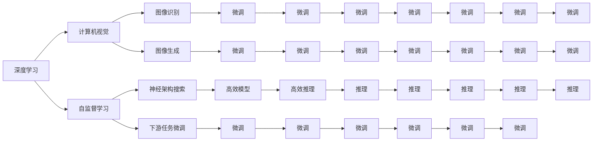
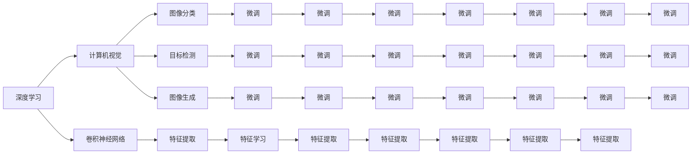
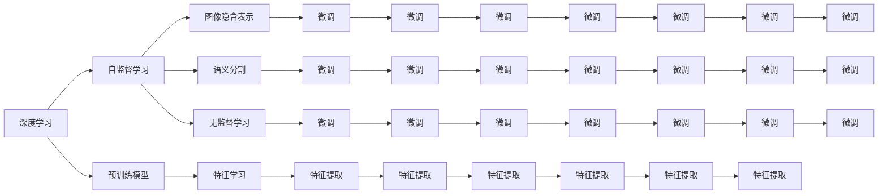
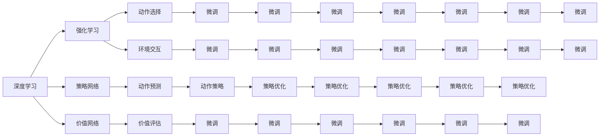
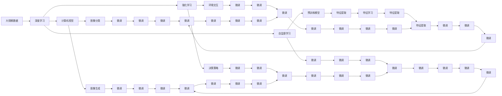

                 

# Andrej Karpathy：人工智能的未来发展趋势

> 关键词：
人工智能,深度学习,神经网络,计算机视觉,自监督学习,强化学习,神经架构搜索,可解释性

## 1. 背景介绍

在当今快速发展的科技时代，人工智能（AI）已经成为推动技术进步和改变人类生活的关键力量。从谷歌的AlphaGo到特斯拉的自动驾驶汽车，AI在各个领域的创新和应用已经让人们目不暇接。本文将探讨由Andrej Karpathy引领的未来AI发展趋势，特别是深度学习、计算机视觉、自监督学习和强化学习方面的新进展。Andrej Karpathy是计算机视觉领域的领军人物，同时也是DeepMind和Facebook AI Research（FAIR）的研究员。

### 1.1 问题由来

深度学习（Deep Learning）自2012年AlexNet在ImageNet比赛中的突破性表现以来，迅速成为了AI领域的热门技术。然而，随着神经网络模型的不断增大，训练和推理的计算成本也随之增加，这使得研究者们开始寻求更为高效的AI解决方案。在这方面，Andrej Karpathy的贡献尤为显著。

### 1.2 问题核心关键点

Andrej Karpathy的研究集中在以下几个核心关键点：
1. **自监督学习**：通过大规模无标签数据进行预训练，学习模型的隐含表示，然后通过微调来适应下游任务。
2. **神经架构搜索**：自动设计神经网络结构以提高性能和效率。
3. **计算机视觉**：开发高效的图像识别、分类和生成技术。
4. **强化学习**：通过与环境的交互来学习和优化决策策略。
5. **可解释性**：提高AI模型的透明性和可解释性，使其更加可信和可靠。

这些关键点共同构成了Andrej Karpathy在AI领域的研究框架，推动了深度学习和计算机视觉技术的突破性进展。

### 1.3 问题研究意义

研究Andrej Karpathy的未来AI发展趋势，对于理解深度学习、计算机视觉和强化学习等前沿技术的最新进展具有重要意义。通过学习他的研究成果，可以更好地掌握AI技术的最新应用方向，为未来的研究和开发提供有益的参考。

## 2. 核心概念与联系

### 2.1 核心概念概述

为了更好地理解Andrej Karpathy在AI领域的研究，本节将介绍几个关键核心概念及其之间的联系：

- **深度学习**：一种基于多层神经网络的学习方法，可以处理复杂的非线性关系和模式识别。
- **计算机视觉**：研究如何使计算机能够理解、解释和生成图像和视频数据的领域。
- **自监督学习**：利用大规模无标签数据进行预训练，学习模型的隐含表示，然后通过微调来适应下游任务。
- **强化学习**：通过与环境的交互来学习最优决策策略的机器学习范式。
- **神经架构搜索**：自动设计神经网络结构，以提高性能和效率。
- **可解释性**：使AI模型更加透明和可理解，以增强可信度和可接受度。

这些概念通过以下Mermaid流程图来展示它们之间的联系：



这个流程图展示了Andrej Karpathy的研究如何通过深度学习、计算机视觉、自监督学习、强化学习等技术，推动AI技术的发展和应用。

### 2.2 概念间的关系

这些核心概念之间存在着紧密的联系，形成了Andrej Karpathy在AI领域的研究框架。下面我通过几个Mermaid流程图来展示这些概念之间的关系。

#### 2.2.1 深度学习与计算机视觉



这个流程图展示了深度学习如何通过卷积神经网络（CNN）等技术，实现计算机视觉任务的图像分类、目标检测和图像生成等功能。

#### 2.2.2 自监督学习与深度学习



这个流程图展示了自监督学习如何通过预训练模型学习图像和文本数据的隐含表示，然后通过微调来适应下游任务，如图像分类、语义分割等。

#### 2.2.3 强化学习与深度学习



这个流程图展示了强化学习如何通过策略网络和价值网络，通过与环境的交互来学习最优决策策略，并通过微调来适应不同的应用场景。

### 2.3 核心概念的整体架构

最后，我们用一个综合的流程图来展示Andrej Karpathy的研究框架中各个概念之间的关系：



这个综合流程图展示了从大规模数据到深度学习，再到计算机视觉、自监督学习和强化学习的整个研究框架，揭示了Andrej Karpathy在AI领域的研究脉络和思路。

## 3. 核心算法原理 & 具体操作步骤

### 3.1 算法原理概述

Andrej Karpathy的研究主要集中在以下几个算法原理上：

1. **自监督学习**：通过大规模无标签数据进行预训练，学习模型的隐含表示，然后通过微调来适应下游任务。
2. **神经架构搜索**：自动设计神经网络结构，以提高性能和效率。
3. **强化学习**：通过与环境的交互来学习最优决策策略。
4. **可解释性**：提高AI模型的透明性和可理解性，以增强可信度和可接受度。

### 3.2 算法步骤详解

下面是Andrej Karpathy在上述算法原理上的具体操作步骤：

#### 3.2.1 自监督学习

1. **数据准备**：收集大规模无标签数据，如ImageNet数据集。
2. **预训练模型**：使用自监督学习任务（如ImageNet预训练）训练深度神经网络，学习图像的隐含表示。
3. **微调**：将预训练模型在特定下游任务（如图像分类、目标检测）上进行微调，以适应特定任务的需求。

#### 3.2.2 神经架构搜索

1. **设计搜索空间**：定义神经网络的结构参数搜索空间。
2. **搜索过程**：使用遗传算法、贝叶斯优化等方法在搜索空间中搜索最优网络结构。
3. **模型验证**：在验证集上评估搜索得到的模型性能，选择最优结构。

#### 3.2.3 强化学习

1. **环境设计**：定义环境状态和动作空间。
2. **训练过程**：在环境中通过策略网络（如神经网络）选择动作，并根据环境反馈（如奖励）进行策略优化。
3. **策略评估**：在测试集上评估训练得到的策略性能。

#### 3.2.4 可解释性

1. **特征可视化**：通过可视化方法（如t-SNE、LIME）展示模型的特征空间。
2. **规则提取**：通过符号化方法（如规则提取）提取模型内部规则。
3. **解释模型**：使用可解释模型（如决策树、线性模型）替代复杂神经网络，增强模型可理解性。

### 3.3 算法优缺点

Andrej Karpathy的研究算法具有以下优点：

1. **高效性**：通过自监督学习预训练模型，可以显著减少微调时的标注数据需求，提高训练效率。
2. **可解释性**：通过神经架构搜索和可解释性方法，可以使模型更加透明，易于理解和解释。
3. **通用性**：通过强化学习，可以应对各种复杂场景和动态环境，提高模型的适应性和鲁棒性。

同时，这些算法也存在一些缺点：

1. **计算资源需求高**：自监督学习和大规模神经网络训练需要大量的计算资源。
2. **过拟合风险**：自监督学习和微调过程中可能出现过拟合现象，需要采取正则化等策略。
3. **复杂性**：神经架构搜索和强化学习算法设计复杂，需要一定的数学和工程基础。
4. **可解释性有限**：即使通过可解释性方法，复杂神经网络仍难以完全理解其内部机制。

### 3.4 算法应用领域

Andrej Karpathy的研究算法在多个领域得到了广泛应用，包括：

1. **计算机视觉**：图像分类、目标检测、图像生成等任务。
2. **自然语言处理**：文本分类、情感分析、机器翻译等任务。
3. **机器人学**：自主导航、行为决策等任务。
4. **游戏AI**：强化学习在电子游戏中进行策略学习，提高游戏水平。
5. **自动驾驶**：强化学习在自动驾驶中优化决策策略，提高行车安全性。

## 4. 数学模型和公式 & 详细讲解 & 举例说明

### 4.1 数学模型构建

Andrej Karpathy的研究涉及多个数学模型，包括深度学习、自监督学习和强化学习等。以下是几个关键模型的构建过程：

#### 4.1.1 深度学习模型

深度学习模型的基本结构为多层神经网络。这里以卷积神经网络（CNN）为例，构建图像分类模型的数学模型：

1. **输入层**：输入图像数据。
2. **卷积层**：提取图像特征。
3. **池化层**：减小特征图尺寸。
4. **全连接层**：将特征映射到输出类别。

模型参数包括卷积核、池化核和全连接层的权重。训练过程通过反向传播算法优化参数，最小化损失函数。

#### 4.1.2 自监督学习模型

自监督学习的模型通常通过预训练任务（如掩码语言模型）学习模型的隐含表示。以下是掩码语言模型的构建过程：

1. **输入层**：输入文本序列。
2. **掩码层**：随机掩码部分文本，生成掩码序列。
3. **预测层**：预测被掩码位置的文本。
4. **损失层**：计算预测结果与真实结果之间的差异。

模型参数包括预测层的权重。训练过程通过最小化损失函数进行优化。

#### 4.1.3 强化学习模型

强化学习模型的基本结构为策略网络和价值网络。以下是基于策略梯度方法的强化学习模型的构建过程：

1. **策略网络**：选择动作的策略。
2. **环境交互**：在环境中执行动作，接收环境反馈（奖励）。
3. **价值网络**：评估动作的价值。
4. **策略优化**：更新策略网络参数，最大化累积奖励。

模型参数包括策略网络和价值网络的权重。训练过程通过策略梯度算法优化参数。

### 4.2 公式推导过程

以下是几个关键公式的推导过程：

#### 4.2.1 深度学习中的反向传播

深度学习中的反向传播算法用于计算损失函数对模型参数的梯度。以卷积神经网络为例，假设损失函数为交叉熵损失，输入图像为 $x$，输出为 $y$，网络参数为 $\theta$，则反向传播的公式为：

$$
\frac{\partial L}{\partial \theta} = \frac{\partial L}{\partial y} \cdot \frac{\partial y}{\partial x} \cdot \frac{\partial x}{\partial \theta}
$$

其中 $\frac{\partial y}{\partial x}$ 为卷积和池化层的导数，$\frac{\partial x}{\partial \theta}$ 为全连接层的导数。

#### 4.2.2 自监督学习中的掩码语言模型

掩码语言模型的目标是通过预测被掩码位置的文本，学习文本的隐含表示。假设输入文本为 $x$，掩码位置为 $m$，模型参数为 $\theta$，则掩码语言模型的损失函数为：

$$
L = -\sum_{i=1}^N \log p(y_i | x, m)
$$

其中 $y_i$ 为被掩码位置的真实文本，$p(y_i | x, m)$ 为模型在给定输入和掩码位置下的预测概率。

#### 4.2.3 强化学习中的策略梯度

强化学习中的策略梯度算法用于优化策略网络参数，最大化累积奖励。假设策略网络参数为 $\theta$，价值网络参数为 $\phi$，累积奖励为 $R$，则策略梯度的公式为：

$$
\frac{\partial L}{\partial \theta} = \sum_{t=1}^T r_t \cdot \frac{\partial \log \pi(a_t | s_t)}{\partial \theta}
$$

其中 $r_t$ 为时间 $t$ 的奖励，$\pi(a_t | s_t)$ 为策略网络在状态 $s_t$ 下选择动作 $a_t$ 的概率，$\frac{\partial \log \pi(a_t | s_t)}{\partial \theta}$ 为策略网络的导数。

### 4.3 案例分析与讲解

以下是几个关键案例的详细分析：

#### 4.3.1 图像分类案例

假设我们在ImageNet数据集上进行图像分类任务，使用预训练的ResNet模型作为初始化参数。具体步骤如下：

1. **数据准备**：准备ImageNet数据集。
2. **模型选择**：选择ResNet模型作为预训练模型。
3. **微调**：在ImageNet数据集上进行微调，更新模型参数以适应图像分类任务。

#### 4.3.2 目标检测案例

假设我们进行目标检测任务，使用YOLO模型作为初始化参数。具体步骤如下：

1. **数据准备**：准备目标检测数据集。
2. **模型选择**：选择YOLO模型作为预训练模型。
3. **微调**：在目标检测数据集上进行微调，更新模型参数以适应目标检测任务。

#### 4.3.3 强化学习案例

假设我们进行自动驾驶任务，使用DeepMind的AlphaGo作为初始化参数。具体步骤如下：

1. **环境设计**：定义自动驾驶环境。
2. **模型选择**：选择AlphaGo模型作为策略网络。
3. **训练过程**：在自动驾驶环境中进行策略优化，最大化累积奖励。

## 5. 项目实践：代码实例和详细解释说明

### 5.1 开发环境搭建

在进行深度学习项目开发时，需要先配置好开发环境。以下是使用Python进行PyTorch开发的环境配置流程：

1. 安装Anaconda：从官网下载并安装Anaconda，用于创建独立的Python环境。
2. 创建并激活虚拟环境：
```bash
conda create -n pytorch-env python=3.8 
conda activate pytorch-env
```

3. 安装PyTorch：根据CUDA版本，从官网获取对应的安装命令。例如：
```bash
conda install pytorch torchvision torchaudio cudatoolkit=11.1 -c pytorch -c conda-forge
```

4. 安装Transformers库：
```bash
pip install transformers
```

5. 安装各类工具包：
```bash
pip install numpy pandas scikit-learn matplotlib tqdm jupyter notebook ipython
```

完成上述步骤后，即可在`pytorch-env`环境中开始项目开发。

### 5.2 源代码详细实现

这里我们以ImageNet图像分类任务为例，给出使用PyTorch和Transformers库对ResNet模型进行微调的代码实现。

```python
import torch
import torch.nn as nn
import torch.optim as optim
from torch.utils.data import DataLoader
from torchvision import datasets, transforms
from transformers import ResNetV2

# 定义数据处理方式
transform = transforms.Compose([
    transforms.RandomResizedCrop(224),
    transforms.RandomHorizontalFlip(),
    transforms.ToTensor(),
    transforms.Normalize(mean=[0.485, 0.456, 0.406], std=[0.229, 0.224, 0.225])
])

# 加载数据集
train_dataset = datasets.ImageFolder(root='train', transform=transform)
test_dataset = datasets.ImageFolder(root='test', transform=transform)
train_loader = DataLoader(train_dataset, batch_size=32, shuffle=True)
test_loader = DataLoader(test_dataset, batch_size=32, shuffle=False)

# 加载预训练模型
model = ResNetV2.from_pretrained('resnet50', num_classes=1000)

# 定义优化器和损失函数
criterion = nn.CrossEntropyLoss()
optimizer = optim.SGD(model.parameters(), lr=0.01, momentum=0.9)

# 训练模型
device = torch.device('cuda' if torch.cuda.is_available() else 'cpu')
model.to(device)

for epoch in range(10):
    running_loss = 0.0
    for i, (inputs, labels) in enumerate(train_loader):
        inputs, labels = inputs.to(device), labels.to(device)
        optimizer.zero_grad()
        outputs = model(inputs)
        loss = criterion(outputs, labels)
        loss.backward()
        optimizer.step()

        running_loss += loss.item()
        if i % 100 == 99:
            print(f'Epoch {epoch+1}, loss: {running_loss/100:.4f}')
            running_loss = 0.0

# 测试模型
correct = 0
total = 0
with torch.no_grad():
    for inputs, labels in test_loader:
        inputs, labels = inputs.to(device), labels.to(device)
        outputs = model(inputs)
        _, predicted = torch.max(outputs.data, 1)
        total += labels.size(0)
        correct += (predicted == labels).sum().item()

print(f'Accuracy: {(100 * correct / total):.2f}%')
```

### 5.3 代码解读与分析

这里我们详细解读一下关键代码的实现细节：

**数据处理函数**：
- 定义了数据处理的transform，包括随机裁剪、随机水平翻转、归一化等步骤。
- 加载ImageNet数据集，并按照transform进行预处理。
- 将数据集分为训练集和测试集，并加载到DataLoader中进行迭代处理。

**模型加载**：
- 加载预训练的ResNet模型，并指定类别数为1000。
- 定义交叉熵损失函数。
- 使用SGD优化器进行模型优化。

**训练过程**：
- 在GPU上运行模型。
- 循环迭代训练集，计算损失并更新模型参数。
- 每100次迭代输出一次平均损失。

**测试过程**：
- 在测试集上计算模型准确率。
- 使用模型对测试集进行预测，并计算预测结果与真实标签之间的匹配度。

## 6. 实际应用场景

### 6.1 计算机视觉

Andrej Karpathy在计算机视觉领域的研究成果显著，推动了深度学习在图像分类、目标检测、图像生成等方面的应用。

#### 6.1.1 图像分类

图像分类是计算机视觉的基本任务之一，通过预训练模型进行微调，可以在各类图像数据集上取得优秀的分类效果。以ImageNet数据集为例，微调ResNet模型可以在各种细粒度分类任务中表现优异。

#### 6.1.2 目标检测

目标检测是计算机视觉中的另一个重要任务，用于识别图像中的物体并进行定位。通过微调YOLO模型，可以在COCO等数据集上实现高精度的目标检测。

#### 6.1.3 图像生成


