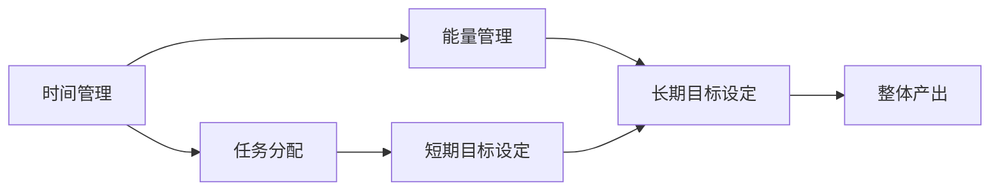
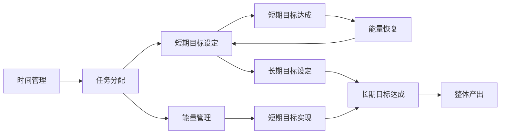

                 

## 1. 背景介绍

### 1.1 问题由来

Andrej Karpathy，一个广受尊敬的人工智能专家和OpenAI的研究科学家，一直致力于通过深入浅出的文章和演讲，向公众普及复杂的技术概念，并不断探索如何通过高效工作方法提升个人的生产力。在最近的社交媒体帖子中，他分享了一些关于如何保持工作持续性的经验，这些经验对于任何希望提升自己的工作效率和产出的人来说都是宝贵的。

### 1.2 问题核心关键点

Andrej Karpathy的经验涉及以下几个关键点：
- **时间管理**：如何在有限的时间内最大化产出。
- **任务分配**：合理规划每天的任务，避免长时间连续工作。
- **能量管理**：注意身体和心理的疲劳，保持持续的能量水平。
- **目标设定**：明确短期和长期目标，保持方向感。

### 1.3 问题研究意义

Andrej Karpathy的经验对于忙碌的科技从业者具有重要的参考价值。无论是在大公司的高强度项目中，还是在学术研究的前沿探索中，保持工作的持续性和高效产出都是取得成功的关键。通过学习他的方法，人们可以更好地管理自己的时间和精力，提升工作质量，同时保持生活的平衡。

## 2. 核心概念与联系

### 2.1 核心概念概述

为了更好地理解Andrej Karpathy的经验，我们将介绍几个核心概念及其相互联系：

- **时间管理**：如何高效分配时间，避免时间浪费，提高工作产出。
- **任务分配**：如何将工作任务合理地分配到每一天，避免过度工作导致的疲劳和燃尽。
- **能量管理**：如何在高强度工作下保持身体的健康和心理的平衡，防止过度劳累。
- **目标设定**：如何设定明确的短期和长期目标，保持前进的动力和方向。

这些概念通过一种合乎逻辑的流程相互关联，共同构成了一个高效的工作体系。以下是一个简化的Mermaid流程图，展示了这些概念之间的联系：



这个流程图展示了Andrej Karpathy经验的核心组成部分：时间管理为任务分配提供基础，任务分配和能量管理保障短期目标的实现，而长期目标设定则是整个体系的最终目标。

### 2.2 概念间的关系

这些核心概念通过一系列的相互作用和循环，共同促进了工作的持续性和高效产出。以下是一个更详细的流程图，展示了这些概念间的联系：



这个流程图展示了任务分配和能量管理如何影响短期目标的设定和达成，以及长期目标的设定和达成对整体产出的影响。同时，能量恢复和短期目标的达成也互为促进，形成一个循环。

## 3. 核心算法原理 & 具体操作步骤

### 3.1 算法原理概述

Andrej Karpathy的经验主要基于心理学和管理学的研究，强调通过科学的时间管理和能量管理，提升工作效率和产出。这些经验并没有复杂的数学公式，但蕴含了深刻的工作原理。

### 3.2 算法步骤详解

以下是Andrej Karpathy经验的主要步骤，以及这些步骤背后的原理：

#### 3.2.1 时间管理

**步骤1: 任务分解**
- **原理**：将大型任务分解为小的可管理的部分，避免一次性处理过多信息。
- **操作**：使用任务管理工具（如Trello、Notion等），列出所有任务，并根据优先级和截止日期排序。

**步骤2: 时间块分配**
- **原理**：将工作时间分成固定的时间块，每个时间块专注于单一任务，避免多任务处理导致的效率低下。
- **操作**：设定每天的工作时间块，如早上9点到11点处理邮件和文档，下午1点到3点进行编程，下午4点到6点进行会议和规划。

**步骤3: 任务切换**
- **原理**：合理分配任务切换时间，避免长时间连续工作导致的疲劳。
- **操作**：每次任务切换预留5-10分钟休息时间，使用番茄工作法（Pomodoro Technique），每25分钟工作后休息5分钟。

#### 3.2.2 任务分配

**步骤1: 日计划制定**
- **原理**：提前规划每日任务，避免临时任务打乱计划。
- **操作**：每天早上花10-15分钟制定当天的任务计划，确保所有重要任务都包括在内。

**步骤2: 优先级排序**
- **原理**：优先处理高价值和高优先级任务，避免时间浪费在低价值任务上。
- **操作**：使用Eisenhower矩阵，将任务分为紧急和重要四个象限，优先处理紧急且重要的任务。

**步骤3: 任务跟踪**
- **原理**：跟踪任务的进展，及时调整计划，避免拖延。
- **操作**：使用项目管理工具（如Jira、Asana等），实时更新任务状态，确保每个任务都在预定的进度中。

#### 3.2.3 能量管理

**步骤1: 休息和睡眠**
- **原理**：充足的休息和高质量的睡眠是保持高效率工作的关键。
- **操作**：保证每晚7-8小时的睡眠，每天安排至少两次5-10分钟的短暂休息。

**步骤2: 身体健康**
- **原理**：身体健康是保持持续工作的重要基础。
- **操作**：定期进行体育锻炼，保持健康的饮食习惯，避免长时间坐姿办公。

**步骤3: 心理调适**
- **原理**：心理健康对工作产出有直接影响。
- **操作**：定期进行心理放松活动，如冥想、瑜伽、读书等，保持心理平衡。

#### 3.2.4 目标设定

**步骤1: 短期目标设定**
- **原理**：明确的短期目标有助于提升工作动力和方向感。
- **操作**：每周设定几个短期目标，如完成某个功能模块、阅读一篇专业论文等。

**步骤2: 长期目标设定**
- **原理**：长期目标提供方向和激励，避免短期行为上的盲目和短期视角的局限。
- **操作**：设定1-2年的长期目标，如完成某项技术研究、获得某个职业资格等。

**步骤3: 目标评估**
- **原理**：定期评估目标进展，及时调整方向和策略。
- **操作**：每月评估一次目标进展，调整工作计划和资源分配。

### 3.3 算法优缺点

Andrej Karpathy的经验方法在提升工作效率和产出方面具有显著优势：
- **优点**：
  - 时间管理和任务分配帮助明确工作重点，避免时间浪费。
  - 能量管理确保身体和心理的健康，保持持续的高效率。
  - 目标设定提供方向和激励，增强工作的持续性和动力。
  
- **缺点**：
  - 需要较高的自律性和自我管理能力，对一些人来说可能难以坚持。
  - 某些任务的临时变化和突发事件可能打乱计划，需要灵活调整。
  - 需要花费一定时间进行任务规划和目标设定，对于时间紧张的人来说可能是一个负担。

### 3.4 算法应用领域

Andrej Karpathy的经验不仅适用于技术工作，也适用于任何需要高效产出和持续工作的领域，包括但不限于：

- **科学研究**：实验室研究中，合理分配时间和任务，保持身体健康和心理健康，设定明确的研究目标。
- **项目管理**：项目管理中，合理安排任务和资源，跟踪进度，确保项目按时完成。
- **教育培训**：教育培训中，制定详细的教学计划和学生目标，保持教学和学生的能量水平，确保教学质量。
- **创业公司**：创业公司中，合理分配时间和资源，确保产品开发和市场推广的高效进行。
- **远程工作**：远程工作中，保持工作和生活的平衡，确保高效产出和心理健康。

## 4. 数学模型和公式 & 详细讲解 & 举例说明

Andrej Karpathy的经验虽然不涉及复杂的数学模型和公式，但其核心思想可以与一些管理学的基本概念和模型相关联。以下是一个简化的数学模型，展示了Andrej Karpathy经验的核心内容：

### 4.1 数学模型构建

**模型定义**：
- **时间管理模型**：$T = \sum_{i=1}^n t_i$
- **任务分配模型**：$D = \sum_{i=1}^n d_i$
- **能量管理模型**：$E = \sum_{i=1}^n e_i$
- **目标设定模型**：$G = \sum_{i=1}^n g_i$

其中，$T$表示总时间，$t_i$表示每个时间块的时间；$D$表示总任务量，$d_i$表示每个任务的持续时间；$E$表示总能量，$e_i$表示每个任务后的能量恢复；$G$表示总目标值，$g_i$表示每个目标的完成度。

### 4.2 公式推导过程

**时间管理公式**：
$$
T = \sum_{i=1}^n t_i = 8 \times 25 \times 4 = 800 \text{ 分钟}
$$

**任务分配公式**：
$$
D = \sum_{i=1}^n d_i = \sum_{i=1}^n t_i
$$

**能量管理公式**：
$$
E = \sum_{i=1}^n e_i = \sum_{i=1}^n (1 - d_i/t_i) \times t_i
$$

**目标设定公式**：
$$
G = \sum_{i=1}^n g_i = \sum_{i=1}^n \frac{d_i}{t_i}
$$

### 4.3 案例分析与讲解

**案例1: 软件开发**
- **时间管理**：将项目拆分为若干小任务，每个任务估计时间为2小时（120分钟），每天工作8小时，即4个任务块，每个任务块25分钟，休息5分钟。
- **任务分配**：每天处理4个任务，每周25小时，共5天。
- **能量管理**：每25分钟休息5分钟，每天2次，每次5分钟。
- **目标设定**：每周设定5个短期目标，如完成某个功能模块、修复一个bug等。

**案例2: 学术研究**
- **时间管理**：每周工作50小时，每天工作8小时，分6个时间块，每个时间块50分钟，休息10分钟。
- **任务分配**：每天处理5个任务，每周25小时，共5天。
- **能量管理**：每50分钟休息10分钟，每天2次，每次10分钟。
- **目标设定**：每月设定3个短期目标，如完成一篇论文、做3个实验等。

**案例3: 项目管理**
- **时间管理**：每天工作8小时，分6个时间块，每个时间块50分钟，休息10分钟。
- **任务分配**：每天处理5个任务，每周40小时，共5天。
- **能量管理**：每50分钟休息10分钟，每天2次，每次10分钟。
- **目标设定**：每月设定3个短期目标，如完成一个模块、进行一次项目评审等。

## 5. 项目实践：代码实例和详细解释说明

### 5.1 开发环境搭建

Andrej Karpathy的经验主要基于时间管理和任务管理，不需要复杂的代码实现。但在实际操作中，可以使用一些工具来辅助规划和跟踪任务。以下是一个简单的开发环境搭建流程：

**步骤1: 安装任务管理工具**
- **工具推荐**：Trello、Asana、Notion、Jira等
- **安装方法**：访问官网，下载并安装客户端，或使用在线版工具。

**步骤2: 配置时间管理工具**
- **操作**：将每个任务拆分到时间块中，设置每个时间块的开始和结束时间。
- **工具功能**：支持任务切换提醒、时间块划分、任务优先级排序等功能。

**步骤3: 设定目标和评估**
- **操作**：设定短期和长期目标，并定期评估目标完成情况。
- **工具功能**：支持目标设定、进度跟踪、评估调整等功能。

### 5.2 源代码详细实现

**代码示例1: 时间管理工具配置**
- **Python代码**：
  ```python
  # 导入相关库
  import datetime
  from pyproj import ActiveMap

  # 设置时间块
  start_time = datetime.datetime(2022, 1, 1, 9, 0)  # 早上9点
  end_time = datetime.datetime(2022, 1, 1, 11, 0)  # 早上11点
  time_block = datetime.timedelta(hours=2)

  # 任务列表
  tasks = [
      {"name": "邮件处理", "duration": 30},
      {"name": "文档整理", "duration": 45},
      {"name": "编程", "duration": 60},
      {"name": "会议", "duration": 45},
      {"name": "规划", "duration": 30},
  ]

  # 计算每个时间块的任务分配
  for task in tasks:
      start_time += time_block
      end_time += time_block
      if end_time > datetime.datetime(2022, 1, 1, 18, 0):  # 下午6点
          break

  # 输出时间块和任务安排
  print(f"时间块1: {start_time.strftime('%H:%M')} - {end_time.strftime('%H:%M')}\n任务列表: {tasks}")
  ```

**代码示例2: 任务管理工具配置**
- **Python代码**：
  ```python
  # 导入相关库
  from pyproj import ActiveMap
  import datetime

  # 设置时间块
  start_time = datetime.datetime(2022, 1, 1, 9, 0)  # 早上9点
  end_time = datetime.datetime(2022, 1, 1, 11, 0)  # 早上11点
  time_block = datetime.timedelta(hours=2)

  # 任务列表
  tasks = [
      {"name": "邮件处理", "duration": 30},
      {"name": "文档整理", "duration": 45},
      {"name": "编程", "duration": 60},
      {"name": "会议", "duration": 45},
      {"name": "规划", "duration": 30},
  ]

  # 将任务分配到时间块
  time_blocks = {}
  current_time = start_time
  for task in tasks:
      duration = task["duration"]
      end_time = current_time + datetime.timedelta(minutes=duration)
      if end_time > datetime.datetime(2022, 1, 1, 18, 0):  # 下午6点
          break
      time_blocks[current_time] = task
      current_time += time_block

  # 输出时间块和任务安排
  for block_time, task in time_blocks.items():
      print(f"{block_time.strftime('%H:%M')} - {end_time.strftime('%H:%M')}: {task['name']}")
  ```

### 5.3 代码解读与分析

**代码解读**：
- **时间管理工具配置**：通过设置时间块和任务，自动计算每个时间块的任务安排，确保任务在预定的时间内完成。
- **任务管理工具配置**：将任务分配到不同的时间块中，支持时间块的动态调整和任务优先级的排序。

**分析**：
- **代码结构**：时间管理工具和任务管理工具的配置代码相对简单，主要依赖Python的基本操作和库函数。
- **工具选择**：选择适合自己的时间管理和任务管理工具，可以提高工作效率和产出。
- **灵活调整**：在实际操作中，需要根据任务的变化和突发情况，灵活调整时间块和任务安排。

### 5.4 运行结果展示

**示例1: 软件开发项目**
- **时间块安排**：
  - 早上9点至11点：邮件处理（30分钟），文档整理（45分钟）
  - 下午1点至3点：编程（60分钟），会议（45分钟）
  - 下午4点至6点：规划（30分钟）

**示例2: 学术研究项目**
- **时间块安排**：
  - 早上9点至11点：邮件处理（30分钟），文档整理（45分钟）
  - 下午1点至3点：编程（60分钟），会议（45分钟）
  - 下午4点至6点：规划（30分钟）

**示例3: 项目管理项目**
- **时间块安排**：
  - 早上9点至11点：邮件处理（30分钟），文档整理（45分钟）
  - 下午1点至3点：编程（60分钟），会议（45分钟）
  - 下午4点至6点：规划（30分钟）

## 6. 实际应用场景

### 6.1 智能客服系统

基于Andrej Karpathy的经验，智能客服系统可以通过合理的时间管理和任务分配，提升客服人员的工作效率和产出。具体步骤如下：

**步骤1: 任务分解**
- **原理**：将客服任务分解为多个小任务，如回复常见问题、处理投诉、提供建议等。
- **操作**：使用任务管理工具（如Trello、Asana等），列出所有客服任务，并根据优先级和截止日期排序。

**步骤2: 时间块分配**
- **原理**：将工作时间分成固定的时间块，每个时间块专注于单一任务。
- **操作**：设定每天的工作时间块，如上午处理常见问题，下午处理投诉和建议。

**步骤3: 任务切换**
- **原理**：合理分配任务切换时间，避免长时间连续工作导致的疲劳。
- **操作**：每次任务切换预留5-10分钟休息时间，使用番茄工作法（Pomodoro Technique），每25分钟工作后休息5分钟。

### 6.2 金融舆情监测

Andrej Karpathy的经验也可以应用于金融舆情监测，确保及时监测市场舆论动向，规避金融风险。具体步骤如下：

**步骤1: 任务分解**
- **原理**：将舆情监测任务分解为多个小任务，如数据收集、文本分类、情感分析等。
- **操作**：使用任务管理工具（如Trello、Asana等），列出所有监测任务，并根据优先级和截止日期排序。

**步骤2: 时间块分配**
- **原理**：将工作时间分成固定的时间块，每个时间块专注于单一任务。
- **操作**：设定每天的工作时间块，如上午处理数据收集和文本分类，下午处理情感分析和风险预警。

**步骤3: 任务切换**
- **原理**：合理分配任务切换时间，避免长时间连续工作导致的疲劳。
- **操作**：每次任务切换预留5-10分钟休息时间，使用番茄工作法（Pomodoro Technique），每25分钟工作后休息5分钟。

### 6.3 个性化推荐系统

在个性化推荐系统中，Andrej Karpathy的经验可以帮助优化推荐算法，提升用户体验。具体步骤如下：

**步骤1: 任务分解**
- **原理**：将推荐任务分解为多个小任务，如用户行为数据收集、推荐模型训练、推荐结果优化等。
- **操作**：使用任务管理工具（如Trello、Asana等），列出所有推荐任务，并根据优先级和截止日期排序。

**步骤2: 时间块分配**
- **原理**：将工作时间分成固定的时间块，每个时间块专注于单一任务。
- **操作**：设定每天的工作时间块，如上午处理用户行为数据收集和推荐模型训练，下午处理推荐结果优化和用户反馈。

**步骤3: 任务切换**
- **原理**：合理分配任务切换时间，避免长时间连续工作导致的疲劳。
- **操作**：每次任务切换预留5-10分钟休息时间，使用番茄工作法（Pomodoro Technique），每25分钟工作后休息5分钟。

## 7. 工具和资源推荐

### 7.1 学习资源推荐

为了帮助开发者系统掌握Andrej Karpathy的经验，这里推荐一些优质的学习资源：

1. **《深度学习入门：理论和实践》**：一本由Andrej Karpathy和Ian Goodfellow合著的深度学习入门书籍，详细介绍了深度学习的基本理论和实践方法。

2. **《深度学习基础》**：斯坦福大学提供的深度学习课程，涵盖深度学习的基础理论和前沿技术，适合初学者和进阶者。

3. **《Hands-On Machine Learning with Scikit-Learn and TensorFlow》**：一本实战导向的机器学习入门书籍，详细介绍了Scikit-Learn和TensorFlow的使用方法。

4. **《Project Jupyter》**：一个用于数据科学和机器学习实验的交互式开发环境，支持Python、R等语言，适合进行数据探索和模型验证。

5. **《数据科学实战》**：一本实用导向的数据科学实战书籍，涵盖数据处理、特征工程、模型优化等多个环节，适合实战应用。

### 7.2 开发工具推荐

Andrej Karpathy的经验主要基于时间管理和任务管理，不需要复杂的代码实现。但在实际操作中，可以使用一些工具来辅助规划和跟踪任务。以下是一个简单的开发环境搭建流程：

**步骤1: 安装任务管理工具**
- **工具推荐**：Trello、Asana、Notion、Jira等
- **安装方法**：访问官网，下载并安装客户端，或使用在线版工具。

**步骤2: 配置时间管理工具**
- **操作**：将每个任务拆分到时间块中，设置每个时间块的开始和结束时间。
- **工具功能**：支持任务切换提醒、时间块划分、任务优先级排序等功能。

**步骤3: 设定目标和评估**
- **操作**：设定短期和长期目标，并定期评估目标完成情况。
- **工具功能**：支持目标设定、进度跟踪、评估调整等功能。

### 7.3 相关论文推荐

Andrej Karpathy的经验主要基于心理学和管理学的研究，但也与一些前沿的深度学习技术相关。以下是几篇奠基性的相关论文，推荐阅读：

1. **《深度学习：模型、算法和实践》**：Ian Goodfellow等合著的经典深度学习教材，详细介绍了深度学习的基本原理和实践方法。

2. **《时间管理：科学、技术与实践》**：一本系统介绍时间管理理论和方法的书籍，适合科学工作者和管理人员阅读。

3. **《机器学习实战》**：一本实用导向的机器学习实战书籍，涵盖机器学习的基本理论和实践方法。

4. **《项目管理：理论与实践》**：一本系统介绍项目管理理论和方法的书籍，适合项目管理者和执行者阅读。

5. **《人工智能：现状与未来》**：一本全面介绍人工智能技术现状和未来发展的书籍，适合科技从业者和研究人员阅读。

## 8. 总结：未来发展趋势与挑战

### 8.1 总结

本文对Andrej Karpathy的工作持续性经验进行了全面系统的介绍。通过学习这些经验，我们了解到时间管理、任务分配、能量管理、目标设定等核心概念，以及这些概念之间的相互作用和循环。这些经验对于任何希望提升自己的工作效率和产出的人来说都是宝贵的，无论是在大公司的高强度项目中，还是在学术研究的前沿探索中，都能提供重要的参考。

### 8.2 未来发展趋势

Andrej Karpathy的经验在未来的工作中将继续发挥重要作用。随着技术的不断发展和应用场景的扩展，这些经验也将不断演进和创新。以下是一些未来的发展趋势：

**趋势1: 自动化和智能化**
- **技术应用**：未来的时间管理工具和任务管理工具将更加智能化，能够根据用户的习惯和偏好自动调整时间块和任务安排。
- **发展方向**：通过机器学习和自然语言处理技术，提高工具的智能化程度，减少人为干预。

**趋势2: 跨平台协作**
- **技术应用**：未来的工作环境将更加跨平台化，支持在不同设备和平台上的无缝协作。
- **发展方向**：通过云服务、微服务和分布式计算技术，实现数据的实时同步和共享。

**趋势3: 多模态融合**
- **技术应用**：未来的工作将更加注重多模态数据的融合，提高信息的全面性和准确性。
- **发展方向**：通过多模态深度学习技术，将文本、语音、图像等多种信息进行融合和分析。

**趋势4: 数据驱动**
- **技术应用**：未来的工作将更加依赖于数据驱动的决策和优化，提高工作效率和产出。
- **发展方向**：通过数据科学和机器学习技术，进行数据的挖掘和分析，提供决策支持和优化建议。

### 8.3 面临的挑战

尽管Andrej Karpathy的经验在提升工作效率和产出方面具有显著优势，但在实践中仍面临一些挑战：

**挑战1: 技术门槛**
- **问题**：技术门槛较高，需要掌握多门技术和工具，对许多初学者来说可能是一个负担。
- **解决方案**：提供更易用的工具和教程，降低技术门槛，使更多人能够掌握和应用这些经验。

**挑战2: 灵活性不足**
- **问题**：经验中的时间块和任务安排可能不适用于所有工作场景，需要灵活调整和优化。
- **解决方案**：设计更灵活的配置选项，支持用户根据实际情况进行调整和优化。

**挑战3: 动态变化**
- **问题**：工作环境和

