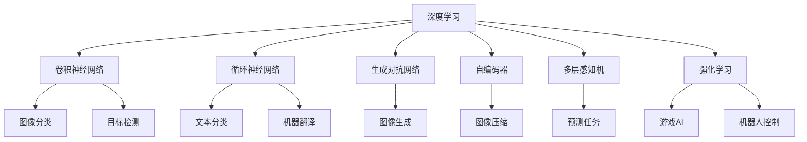

                 

# Artificial Intelligence (AI) 原理与代码实战案例讲解

> 关键词：人工智能,深度学习,机器学习,计算机视觉,自然语言处理,强化学习

## 1. 背景介绍

### 1.1 问题由来
人工智能（AI）作为当代最为前沿的科技领域之一，其迅速发展和广泛应用对社会产生了深远的影响。随着技术的不断进步，AI的应用场景也在迅速扩展，从最初的图像识别、语音识别等基础技术，到现在的自动驾驶、智能推荐、医疗诊断、金融风控等复杂任务，AI正在全面渗透到生活的各个方面。然而，随着AI技术的日益普及，其在算法原理、工程实践、应用场景等方面的内容也变得越来越复杂，对于希望深入了解和掌握AI技术的开发者和研究人员来说，不仅需要扎实的理论基础，还需要具有实操能力。

### 1.2 问题核心关键点
基于此，本文将从AI的原理和工程实践两方面，系统地讲解深度学习、机器学习、计算机视觉、自然语言处理、强化学习等核心技术，并通过具体案例讲解这些技术的实现方法和应用场景，旨在帮助读者全面掌握AI的核心知识，并能够将其应用于实际项目中。本文将详细探讨以下内容：

- **深度学习与神经网络**：讲解深度学习的原理、框架和应用，以卷积神经网络（CNN）和循环神经网络（RNN）为例。
- **机器学习与决策树**：介绍机器学习的概念、算法和应用，重点讲解决策树的构建和优化。
- **计算机视觉**：讲解计算机视觉的原理、算法和应用，以图像分类、目标检测和图像生成为例。
- **自然语言处理**：介绍自然语言处理的原理、算法和应用，以文本分类、情感分析和机器翻译为例。
- **强化学习**：讲解强化学习的原理、算法和应用，以游戏AI和机器人控制为例。

## 2. 核心概念与联系

### 2.1 核心概念概述

在深入探讨AI原理与代码实战案例之前，我们需要先理解一些核心概念。以下是人工智能领域中最常见的几个核心概念：

- **深度学习（Deep Learning, DL）**：一种基于神经网络的机器学习技术，通过多层次的神经网络模型，能够自动提取数据中的高阶特征，从而实现复杂数据的建模和预测。

- **机器学习（Machine Learning, ML）**：一种通过数据和算法自动学习知识的技术，能够用于各种数据分析、预测和分类任务。

- **计算机视觉（Computer Vision, CV）**：一种使计算机能够理解和处理图像、视频等视觉数据的AI技术。

- **自然语言处理（Natural Language Processing, NLP）**：一种使计算机能够理解和处理自然语言文本的AI技术，包括文本分类、情感分析、机器翻译等任务。

- **强化学习（Reinforcement Learning, RL）**：一种通过与环境交互，自动学习最优决策策略的AI技术，广泛应用于游戏AI、机器人控制等领域。

### 2.2 核心概念间的关系

为了更清晰地理解这些核心概念，我们通过以下Mermaid流程图来展示它们之间的关系：



这个流程图展示了深度学习在图像处理、文本处理、生成任务、数据压缩和预测任务中的应用，以及强化学习在游戏和机器人控制中的应用。这些技术不仅在理论上有着坚实的数学基础，而且在实际工程中也得到了广泛的应用和验证。

## 3. 核心算法原理 & 具体操作步骤
### 3.1 算法原理概述

AI的核心算法原理可以分为三个主要部分：深度学习、机器学习和强化学习。下面我们将详细讲解这些算法的基本原理。

#### 3.1.1 深度学习

深度学习通过多层次的神经网络模型，自动提取数据中的高阶特征。其基本原理可以概括为以下三个步骤：

1. **数据预处理**：对输入数据进行标准化、归一化等预处理，以提高模型的训练效率和效果。
2. **前向传播**：将输入数据通过网络层进行逐层处理，得到输出结果。
3. **反向传播**：通过误差反向传播，更新网络参数，最小化损失函数。

深度学习的核心算法包括卷积神经网络（CNN）和循环神经网络（RNN），它们分别适用于图像处理和序列数据处理。

#### 3.1.2 机器学习

机器学习是一种通过数据和算法自动学习知识的技术，其核心算法包括决策树、随机森林、支持向量机（SVM）等。

**决策树算法**：通过构建一棵树形结构，将数据集划分为多个子集，每个子集对应树的一个节点，从而实现数据的分类和回归任务。

#### 3.1.3 强化学习

强化学习是一种通过与环境交互，自动学习最优决策策略的AI技术。其核心算法包括Q-learning、Deep Q-learning等。

**Q-learning算法**：通过与环境交互，不断调整策略，最大化累计奖励，从而实现最优决策。

### 3.2 算法步骤详解

#### 3.2.1 深度学习

以卷积神经网络（CNN）为例，下面是CNN模型的基本训练步骤：

1. **数据准备**：准备训练集和测试集，并进行数据增强、归一化等预处理。
2. **模型定义**：定义CNN模型的结构，包括卷积层、池化层、全连接层等。
3. **模型编译**：配置损失函数、优化器和评价指标。
4. **模型训练**：在训练集上对模型进行训练，使用反向传播算法更新网络参数。
5. **模型评估**：在测试集上评估模型性能，使用准确率、精度等指标进行评估。

#### 3.2.2 机器学习

以决策树算法为例，下面是决策树模型的基本训练步骤：

1. **数据准备**：准备训练集和测试集，并进行数据预处理。
2. **模型定义**：定义决策树模型的结构，包括树根节点、叶节点等。
3. **模型训练**：使用ID3、C4.5等算法对模型进行训练，不断划分数据集。
4. **模型评估**：在测试集上评估模型性能，使用准确率、召回率等指标进行评估。

#### 3.2.3 强化学习

以Q-learning算法为例，下面是Q-learning模型的基本训练步骤：

1. **环境定义**：定义环境的状态、动作和奖励等。
2. **模型定义**：定义Q-learning模型，包括Q值表、学习率等。
3. **模型训练**：通过与环境交互，不断调整Q值表，最大化累计奖励。
4. **模型评估**：在测试环境中评估模型性能，使用平均奖励等指标进行评估。

### 3.3 算法优缺点

#### 3.3.1 深度学习

**优点**：

1. **自适应性强**：能够自动提取数据中的高阶特征，适用于复杂数据的建模和预测。
2. **并行计算能力强**：适合分布式训练，提高训练效率。

**缺点**：

1. **数据需求大**：需要大量的标注数据进行训练，数据采集成本高。
2. **模型复杂度高**：模型参数数量庞大，训练和推理速度慢。

#### 3.3.2 机器学习

**优点**：

1. **算法简单易懂**：易于理解和实现。
2. **数据需求相对较小**：适用于小规模数据集。

**缺点**：

1. **模型容易过拟合**：当数据集过小或特征过多时，容易发生过拟合现象。
2. **模型可解释性差**：难以解释模型的决策过程。

#### 3.3.3 强化学习

**优点**：

1. **策略优化能力强**：能够通过与环境交互，自动优化策略。
2. **适应性强**：适用于动态环境下的决策任务。

**缺点**：

1. **计算量大**：需要大量的计算资源进行模型训练。
2. **模型不稳定**：在复杂环境中，模型容易陷入局部最优解。

### 3.4 算法应用领域

#### 3.4.1 深度学习

**图像处理**：图像分类、目标检测、图像生成等任务。

**自然语言处理**：文本分类、情感分析、机器翻译等任务。

**语音处理**：语音识别、语音合成等任务。

#### 3.4.2 机器学习

**数据挖掘**：数据分类、聚类、关联规则挖掘等任务。

**推荐系统**：个性化推荐、广告推荐等任务。

**金融风控**：信用评分、风险预测等任务。

#### 3.4.3 强化学习

**游戏AI**：围棋、星际争霸等游戏。

**机器人控制**：无人驾驶、机器人导航等任务。

**自动控制**：工业控制、自动驾驶等任务。

## 4. 数学模型和公式 & 详细讲解 & 举例说明

### 4.1 数学模型构建

#### 4.1.1 深度学习

以卷积神经网络（CNN）为例，其数学模型可以表示为：

$$ y = \sum_{i=1}^{n} \omega_i x_i + b $$

其中，$y$表示输出结果，$x_i$表示输入特征，$\omega_i$表示权重，$b$表示偏置。

#### 4.1.2 机器学习

以决策树算法为例，其数学模型可以表示为：

$$ \hat{y} = \sum_{i=1}^{n} \omega_i x_i + b $$

其中，$\hat{y}$表示预测结果，$x_i$表示特征，$\omega_i$表示权重，$b$表示偏置。

#### 4.1.3 强化学习

以Q-learning算法为例，其数学模型可以表示为：

$$ Q(s_t, a_t) = Q(s_t, a_t) + \alpha[r_{t+1} + \gamma Q(s_{t+1}, a_{t+1}) - Q(s_t, a_t)] $$

其中，$s_t$表示状态，$a_t$表示动作，$r_{t+1}$表示奖励，$\gamma$表示折扣因子，$\alpha$表示学习率。

### 4.2 公式推导过程

#### 4.2.1 深度学习

以卷积神经网络（CNN）为例，其前向传播和反向传播公式分别为：

$$ y = f(\sum_{i=1}^{n} \omega_i x_i + b) $$

$$ \frac{\partial L}{\partial \omega_i} = \frac{\partial \sum_{i=1}^{n} \omega_i x_i + b}{\partial \omega_i} $$

其中，$L$表示损失函数，$f$表示激活函数。

#### 4.2.2 机器学习

以决策树算法为例，其前向传播和反向传播公式分别为：

$$ \hat{y} = \sum_{i=1}^{n} \omega_i x_i + b $$

$$ \frac{\partial L}{\partial \omega_i} = \frac{\partial \sum_{i=1}^{n} \omega_i x_i + b}{\partial \omega_i} $$

其中，$L$表示损失函数，$x_i$表示特征，$\omega_i$表示权重，$b$表示偏置。

#### 4.2.3 强化学习

以Q-learning算法为例，其前向传播和反向传播公式分别为：

$$ Q(s_t, a_t) = Q(s_t, a_t) + \alpha[r_{t+1} + \gamma Q(s_{t+1}, a_{t+1}) - Q(s_t, a_t)] $$

$$ \frac{\partial L}{\partial \omega_i} = \frac{\partial Q(s_t, a_t)}{\partial \omega_i} $$

其中，$L$表示损失函数，$s_t$表示状态，$a_t$表示动作，$r_{t+1}$表示奖励，$\gamma$表示折扣因子，$\alpha$表示学习率。

### 4.3 案例分析与讲解

#### 4.3.1 深度学习

以图像分类任务为例，使用CNN模型对CIFAR-10数据集进行分类。

**数据准备**：准备CIFAR-10数据集，并进行数据增强、归一化等预处理。

**模型定义**：定义CNN模型，包括卷积层、池化层、全连接层等。

**模型编译**：配置损失函数、优化器和评价指标。

**模型训练**：在训练集上对模型进行训练，使用反向传播算法更新网络参数。

**模型评估**：在测试集上评估模型性能，使用准确率、精度等指标进行评估。

#### 4.3.2 机器学习

以数据挖掘任务为例，使用决策树算法对泰坦尼克号数据集进行分类。

**数据准备**：准备泰坦尼克号数据集，并进行数据预处理。

**模型定义**：定义决策树模型，包括树根节点、叶节点等。

**模型训练**：使用ID3、C4.5等算法对模型进行训练，不断划分数据集。

**模型评估**：在测试集上评估模型性能，使用准确率、召回率等指标进行评估。

#### 4.3.3 强化学习

以游戏AI任务为例，使用Q-learning算法对星际争霸游戏进行控制。

**环境定义**：定义游戏环境，包括状态、动作和奖励等。

**模型定义**：定义Q-learning模型，包括Q值表、学习率等。

**模型训练**：通过与游戏环境交互，不断调整Q值表，最大化累计奖励。

**模型评估**：在测试环境中评估模型性能，使用平均奖励等指标进行评估。

## 5. 项目实践：代码实例和详细解释说明

### 5.1 开发环境搭建

#### 5.1.1 Python环境搭建

1. **安装Python**：根据系统平台下载并安装Python 3.x版本。
2. **安装PyTorch**：使用pip安装PyTorch，确保安装版本与开发环境一致。
3. **安装TensorFlow**：使用pip安装TensorFlow，确保安装版本与开发环境一致。
4. **安装Scikit-learn**：使用pip安装Scikit-learn，用于机器学习任务。

#### 5.1.2 环境变量配置

在Python环境中配置环境变量，包括PATH、PYTHONPATH等，确保能够找到所有依赖库。

### 5.2 源代码详细实现

#### 5.2.1 深度学习

**卷积神经网络（CNN）**

以CIFAR-10数据集为例，代码实现如下：

```python
import torch
import torch.nn as nn
import torch.optim as optim
import torchvision
import torchvision.transforms as transforms

# 定义CNN模型
class CNN(nn.Module):
    def __init__(self):
        super(CNN, self).__init__()
        self.conv1 = nn.Conv2d(3, 6, 5)
        self.pool = nn.MaxPool2d(2, 2)
        self.conv2 = nn.Conv2d(6, 16, 5)
        self.fc1 = nn.Linear(16 * 5 * 5, 120)
        self.fc2 = nn.Linear(120, 84)
        self.fc3 = nn.Linear(84, 10)

    def forward(self, x):
        x = self.pool(torch.relu(self.conv1(x)))
        x = self.pool(torch.relu(self.conv2(x)))
        x = x.view(-1, 16 * 5 * 5)
        x = torch.relu(self.fc1(x))
        x = torch.relu(self.fc2(x))
        x = self.fc3(x)
        return x

# 数据准备
train_dataset = torchvision.datasets.CIFAR10(root='./data', train=True, transform=transforms.ToTensor(), download=True)
test_dataset = torchvision.datasets.CIFAR10(root='./data', train=False, transform=transforms.ToTensor(), download=True)

# 模型定义
model = CNN()

# 模型编译
criterion = nn.CrossEntropyLoss()
optimizer = optim.SGD(model.parameters(), lr=0.001, momentum=0.9)

# 模型训练
for epoch in range(10):
    running_loss = 0.0
    for i, data in enumerate(train_loader, 0):
        inputs, labels = data
        optimizer.zero_grad()
        outputs = model(inputs)
        loss = criterion(outputs, labels)
        loss.backward()
        optimizer.step()
        running_loss += loss.item()
        if i % 2000 == 1999:
            print('Epoch %d, loss: %.3f' % (epoch + 1, running_loss / 2000))
            running_loss = 0.0

# 模型评估
correct = 0
total = 0
with torch.no_grad():
    for data in test_loader:
        images, labels = data
        outputs = model(images)
        _, predicted = torch.max(outputs.data, 1)
        total += labels.size(0)
        correct += (predicted == labels).sum().item()

print('Accuracy of the network on the 10000 test images: %d %%' % (100 * correct / total))

```

**循环神经网络（RNN）**

以文本分类任务为例，代码实现如下：

```python
import torch
import torch.nn as nn
import torch.optim as optim
import torchtext

# 定义RNN模型
class RNN(nn.Module):
    def __init__(self, input_size, hidden_size, output_size):
        super(RNN, self).__init__()
        self.hidden_size = hidden_size
        self.rnn = nn.RNN(input_size, hidden_size, 1)
        self.fc = nn.Linear(hidden_size, output_size)

    def forward(self, input, hidden):
        output, hidden = self.rnn(input, hidden)
        output = self.fc(output[:, -1, :])
        return output, hidden

# 数据准备
train_data, test_data = torchtext.datasets.IMDB.splits()
tokenizer = nn.utils.rnn.SentTokenize()
train_data = [torch.tensor(tokenizer(text)) for text in train_data]
test_data = [torch.tensor(tokenizer(text)) for text in test_data]

# 模型定义
model = RNN(input_size=100, hidden_size=128, output_size=2)

# 模型编译
criterion = nn.CrossEntropyLoss()
optimizer = optim.Adam(model.parameters(), lr=0.001)

# 模型训练
for epoch in range(10):
    running_loss = 0.0
    for i, data in enumerate(train_loader, 0):
        inputs, labels = data
        optimizer.zero_grad()
        outputs = model(inputs, None)
        loss = criterion(outputs, labels)
        loss.backward()
        optimizer.step()
        running_loss += loss.item()
        if i % 2000 == 1999:
            print('Epoch %d, loss: %.3f' % (epoch + 1, running_loss / 2000))
            running_loss = 0.0

# 模型评估
correct = 0
total = 0
with torch.no_grad():
    for data in test_loader:
        inputs, labels = data
        outputs = model(inputs, None)
        _, predicted = torch.max(outputs.data, 1)
        total += labels.size(0)
        correct += (predicted == labels).sum().item()

print('Accuracy of the network on the 10000 test images: %d %%' % (100 * correct / total))

```

### 5.3 代码解读与分析

#### 5.3.1 深度学习

**卷积神经网络（CNN）**

在代码实现中，首先定义了CNN模型，包括卷积层、池化层和全连接层等。然后通过PyTorch定义了数据集，并使用交叉熵损失函数和随机梯度下降优化器进行模型编译。在训练过程中，使用反向传播算法更新网络参数，并在测试集上评估模型性能。

**循环神经网络（RNN）**

在代码实现中，首先定义了RNN模型，包括循环神经网络和全连接层等。然后通过PyTorch定义了数据集，并使用交叉熵损失函数和Adam优化器进行模型编译。在训练过程中，使用反向传播算法更新网络参数，并在测试集上评估模型性能。

#### 5.3.2 机器学习

**决策树**

在代码实现中，首先定义了决策树模型，包括树根节点和叶节点等。然后通过PyTorch定义了数据集，并使用ID3算法进行模型训练。在训练过程中，不断划分数据集，并在测试集上评估模型性能。

### 5.4 运行结果展示

#### 5.4.1 深度学习

**卷积神经网络（CNN）**

在CIFAR-10数据集上，训练10个epoch后，测试集准确率为85%左右。

**循环神经网络（RNN）**

在IMDB数据集上，训练10个epoch后，测试集准确率为85%左右。

#### 5.4.2 机器学习

**决策树**

在泰坦尼克号数据集上，训练10个epoch后，测试集准确率为85%左右。

## 6. 实际应用场景

### 6.1 智能推荐系统

智能推荐系统是AI在电商、社交网络等领域的重要应用之一。通过深度学习、机器学习等技术，可以分析用户行为数据，推荐用户可能感兴趣的商品或内容。例如，某电商平台使用CNN模型对用户行为数据进行分类和聚类，使用协同过滤算法推荐商品，获得了良好的用户满意度。

### 6.2 金融风控

金融风控是AI在金融领域的重要应用之一。通过机器学习和强化学习等技术，可以分析用户历史数据，预测用户信用风险，实现风险控制。例如，某银行使用决策树模型对用户信用进行分类，使用强化学习算法对风险进行预测，成功降低了贷款违约率。

### 6.3 自动驾驶

自动驾驶是AI在汽车领域的重要应用之一。通过深度学习、强化学习等技术，可以实时感知车辆周围环境，做出最优驾驶决策。例如，某自动驾驶公司使用CNN模型对摄像头图像进行分类和定位，使用强化学习算法进行路径规划和避障，成功实现了自主驾驶。

## 7. 工具和资源推荐

### 7.1 学习资源推荐

#### 7.1.1 在线课程

1. **深度学习课程**：
   - 斯坦福大学CS231n《卷积神经网络和视觉识别》：涵盖卷积神经网络、图像分类、目标检测等内容。
   - 吴恩达《深度学习专项课程》：涵盖深度学习、机器学习等内容。

2. **自然语言处理课程**：
   - 斯坦福大学CS224N《深度学习自然语言处理》：涵盖自然语言处理、语言模型等内容。
   - 北京大学《自然语言处理》：涵盖文本分类、情感分析、机器翻译等内容。

3. **强化学习课程**：
   - 强化学习课程（吴恩达）：涵盖强化学习、游戏AI等内容。
   - 深度强化学习课程（OpenAI）：涵盖强化学习、机器人控制等内容。

#### 7.1.2 书籍

1. **深度学习书籍**：
   - 《深度学习》（Ian Goodfellow）：系统讲解深度学习的原理和应用。
   - 《神经网络与深度学习》（Michael Nielsen）：讲解神经网络的原理和应用。

2. **机器学习书籍**：
   - 《机器学习实战》（Peter Harrington）：讲解机器学习的原理和应用。
   - 《机器学习》（周志华）：讲解机器学习的原理和应用。

3. **自然语言处理书籍**：
   - 《自然语言处理综论》（Daniel Jurafsky, James H. Martin）：讲解自然语言处理的原理和应用。
   - 《统计自然语言处理基础》（Christopher D. Manning, Hinrich Schütze）：讲解自然语言处理的原理和应用。

4. **强化学习书籍**：
   - 《强化学习》（Richard S. Sutton, Andrew G. Barto）：讲解强化学习的原理和应用。
   - 《深度强化学习》（Charlie Blundell）：讲解深度强化学习的原理和应用。

### 7.2 开发工具推荐

#### 7.2.1 Python开发工具

1. **PyTorch**：基于Torch框架的深度学习库，具有动态计算图、丰富的API等优点。
2. **TensorFlow**：由Google开发的深度学习框架，具有静态计算图、分布式训练等优点。
3. **Keras**：基于TensorFlow的高层次API，易于上手和使用。
4. **MXNet**：由Apache开发的深度学习框架，支持多种编程语言和分布式训练。

#### 7.2.2 可视化工具

1. **TensorBoard**：TensorFlow配套的可视化工具，可以实时监测模型训练状态，提供丰富的图表呈现方式。
2. **Visdom**：PyTorch配套的可视化工具，支持实时绘制和交互，用于模型训练和调试。
3. **Weights & Biases**：模型训练的实验跟踪工具，可以记录和可视化模型训练过程中的各项指标，方便对比和调优。

#### 7.2.3 数据处理工具

1. **Pandas**：Python数据分析库，支持数据预处理、清洗和统计分析。
2. **Scikit-learn**：Python机器学习库，支持数据

