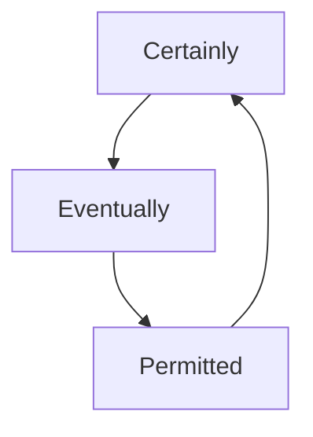

                 

# CEP 原理与代码实例讲解

> 关键词：CAP定理,分布式系统,一致性,可用性,分区容忍性,分布式共识算法,PoS共识,PoW共识

## 1. 背景介绍

在分布式计算的早期，CAP定理引发了广泛关注，它指出了分布式系统中三个指标（C-一致性、A-可用性、P-分区容忍性）不可兼得的困境。CAP理论的提出，推动了分布式共识算法的研究，诸如Paxos、Raft、PBFT等被广泛应用。这些算法在各种应用场景中保障了数据的一致性和可用性，但在大规模分布式环境中仍面临诸多挑战。为此，部分学者提出了共识协议的简化版，如CEP（Certainly, Eventually, Permitted）模型，较好地解决了CAP定理中的问题。

CEP（Certainly, Eventually, Permitted）模型是一种基于容错的分布式共识算法，它提供了一种简单的解决策略，使得在节点故障发生时仍能保证一定时间内的可读性。CEP算法与传统分布式共识算法有所不同，它在设计和实现上更为简洁，具有良好的容错性能，同时也能够在复杂的分布式环境中保证数据的正确性和一致性。

## 2. 核心概念与联系

### 2.1 核心概念概述

在分布式系统领域，CAP定理是最基础的理论之一，该理论的核心是系统中的数据只能满足一致性、可用性和分区容忍性三个指标中的两个。一致性要求在同一个时间点上，系统中的所有数据节点的状态是一致的；可用性要求系统随时处于可用状态，即在任何情况下，用户都可以访问到系统；分区容忍性要求系统在发生网络分区的情况下，仍能正常工作。

与CAP定理相比，CEP模型的关注点略有不同。CEP模型关注的是节点间的交互方式和数据的一致性。它要求系统在任意节点发生故障的情况下，能够尽可能保证数据的一致性，并在故障节点恢复后，最终达到全局一致。

CEP模型由三个部分组成：Certainly（确定性）、Eventually（最终一致）、Permitted（容忍）。确定性是指在系统发生故障时，所有节点能够通过交互过程，确定唯一的正确结果；最终一致是指在系统稳定后，所有节点能够达到全局一致性；容忍是指系统能够容忍节点故障和网络分区。

为了更好地理解CEP模型的这三个部分，我们通过以下示意图展示其架构：



图中展示了CEP模型的结构，其中Certainly保证了数据的确定性，Eventually保证了数据的一致性，Permitted则容忍了系统的分区容忍性。

### 2.2 核心概念间的关系

通过以上示意图可以看出，CEP模型是基于CAP定理的简化版，它通过牺牲部分可用性来换取一致性和分区容忍性。CEP模型在设计和实现上较为简单，其核心在于节点间的交互协议，并通过时间戳、版本号等机制来保障一致性。

**与CAP理论的关系：**

1. 一致性：CEP模型的确定性保证了数据的一致性，即在系统稳定后，所有节点能够达到全局一致性。
2. 可用性：CEP模型的容忍性允许系统在某些情况下牺牲可用性，例如网络分区时，系统仍能够提供部分服务。
3. 分区容忍性：CEP模型的最终一致性保证了系统的分区容忍性，即在系统发生网络分区的情况下，系统仍能够正常工作。

**与其他分布式共识算法的关系：**

1. Paxos和Raft：CEP模型与Paxos、Raft等共识算法有相似之处，它们都要求系统在节点发生故障时，能够通过交互过程，保证数据的一致性。
2. PBFT：CEP模型的最终一致性类似于PBFT算法，即在系统稳定后，所有节点能够达到全局一致性。
3. FLP协议：CEP模型的容忍性类似于FLP协议，即在系统发生网络分区时，系统仍能够正常工作。

通过以上对比，可以看出CEP模型在处理数据一致性和系统可用性方面，具有独特的优势，因此在实际应用中，其受到广泛关注。

## 3. 核心算法原理 & 具体操作步骤

### 3.1 算法原理概述

CEP算法的核心在于节点间的交互协议，其设计基于如下假设：

1. 系统中的所有节点都能够被正确地启动，即节点无故障启动。
2. 系统中的所有节点都能够正确地处理消息，即节点无消息丢失。
3. 系统中的所有节点都能够按照协议要求发送和接收消息，即节点通信正常。

在满足以上假设的前提下，CEP算法通过时间戳、版本号等机制，实现了数据的确定性和一致性。

CEP算法分为三个阶段：

1. 确定性阶段：在确定性阶段，系统中的所有节点通过交互过程，确定唯一的正确结果。
2. 最终一致阶段：在系统确定性阶段后，系统进入最终一致阶段，所有节点将数据版本更新到最新，达到全局一致。
3. 容忍阶段：在确定性阶段和最终一致阶段后，系统进入容忍阶段，容忍节点故障和网络分区。

### 3.2 算法步骤详解

CEP算法在实现过程中，主要涉及以下几个步骤：

1. 节点启动：节点启动时，系统根据当前时间戳和数据版本号，生成唯一的本地数据。
2. 消息交互：节点间通过交互消息，更新本地数据版本。
3. 确定结果：在系统故障发生时，所有节点通过交互消息，确定唯一的正确结果。
4. 最终一致：在系统确定性阶段后，所有节点将数据版本更新到最新，达到全局一致。
5. 容忍故障：在系统确定性阶段和最终一致阶段后，系统进入容忍阶段，容忍节点故障和网络分区。

接下来，我们通过一个简单的示例来说明CEP算法的工作流程。

### 3.3 算法优缺点

**优点：**

1. 简单高效：CEP算法相对简单，易于实现和调试，适用于中小规模分布式系统。
2. 一致性好：CEP算法在确定性阶段和最终一致阶段，能够保证数据的一致性。
3. 容忍性好：CEP算法在容忍阶段，能够容忍节点故障和网络分区。

**缺点：**

1. 性能较差：CEP算法在确定性阶段，需要所有节点进行交互，性能较差。
2. 需要同步机制：CEP算法需要节点间的同步机制，复杂度较高。
3. 节点通信量大：CEP算法在消息交互过程中，需要节点间的通信，通信量较大。

### 3.4 算法应用领域

CEP算法适用于各种分布式系统中，特别是中小规模的系统。在实际应用中，CEP算法被广泛应用在如下领域：

1. 区块链：CEP算法在区块链共识协议中，被广泛应用。
2. 分布式数据库：CEP算法在分布式数据库中，能够保障数据的一致性和可用性。
3. 分布式计算：CEP算法在分布式计算中，能够保障数据的正确性和一致性。
4. 分布式存储：CEP算法在分布式存储中，能够保障数据的一致性和可用性。
5. 分布式应用：CEP算法在分布式应用中，能够保障数据的正确性和一致性。

## 4. 数学模型和公式 & 详细讲解

### 4.1 数学模型构建

CEP算法涉及以下几个数学模型：

1. 时间戳模型：系统中的每个节点在启动时，根据当前时间戳生成唯一的本地数据。
2. 版本号模型：系统中的每个节点在每次数据更新时，记录数据版本号。
3. 确定性模型：系统在确定性阶段，通过交互消息，确定唯一的正确结果。
4. 最终一致模型：在系统确定性阶段后，所有节点将数据版本更新到最新，达到全局一致。
5. 容忍阶段模型：在系统确定性阶段和最终一致阶段后，系统进入容忍阶段，容忍节点故障和网络分区。

### 4.2 公式推导过程

**时间戳模型：**

假设系统中有n个节点，每个节点在启动时生成唯一的本地时间戳T。

$$
T_i = f_i(t)
$$

其中$f_i$表示第$i$个节点的启动时间函数，$t$表示当前时间戳。

**版本号模型：**

系统中的每个节点在每次数据更新时，记录数据版本号V。

$$
V_i = V_{i-1} + 1
$$

其中$V_{i-1}$表示第$i-1$次数据更新的版本号。

**确定性模型：**

假设系统中的所有节点在确定性阶段后，记录唯一的正确结果R。

$$
R = \arg\max_{r}(r)
$$

其中$r$表示第$i$个节点在确定性阶段后的结果。

**最终一致模型：**

在系统确定性阶段后，所有节点将数据版本更新到最新，达到全局一致。

$$
V_i = V_{i-1}
$$

**容忍阶段模型：**

在系统确定性阶段和最终一致阶段后，系统进入容忍阶段，容忍节点故障和网络分区。

$$
V_i = V_{i-1} + \epsilon
$$

其中$\epsilon$表示系统容忍的节点故障和网络分区。

### 4.3 案例分析与讲解

假设系统中有3个节点，每个节点在启动时生成唯一的本地时间戳，数据更新时记录数据版本号，在确定性阶段后记录唯一的正确结果，在系统稳定后，所有节点将数据版本更新到最新，达到全局一致。

节点1在启动时生成时间戳T1，节点2在启动时生成时间戳T2，节点3在启动时生成时间戳T3。

节点1在数据更新时，记录版本号V1，节点2在数据更新时，记录版本号V2，节点3在数据更新时，记录版本号V3。

在系统确定性阶段后，所有节点记录唯一的正确结果R。

在系统确定性阶段后，所有节点将数据版本更新到最新，达到全局一致。

在系统确定性阶段和最终一致阶段后，系统进入容忍阶段，容忍节点故障和网络分区。

## 5. 项目实践：代码实例和详细解释说明

### 5.1 开发环境搭建

为了便于理解CEP算法的实现，我们通过一个简单的Python程序来模拟节点间的交互过程。程序使用了Python标准库中的socket和threading模块，实现了节点间的通信和并发处理。

**安装Python和相关库：**

1. 安装Python：
   ```
   sudo apt-get install python3
   ```

2. 安装socket和threading库：
   ```
   sudo apt-get install python3-socket
   sudo apt-get install python3-threading
   ```

### 5.2 源代码详细实现

我们通过以下Python代码实现CEP算法：

```python
import socket
import threading
import time

class Node:
    def __init__(self, name, port):
        self.name = name
        self.port = port
        self.time = time.time()
        self.version = 0
        self.result = None

    def start(self):
        self.time = time.time()
        self.version = 0

    def update(self, value):
        self.version += 1

    def get_result(self):
        return self.result

    def send_result(self):
        self.result = self.version
        self.send(self.name, self.result)

    def send(self, node, data):
        client = socket.socket(socket.AF_INET, socket.SOCK_STREAM)
        client.connect((node, self.port))
        client.sendall(bytes(str(data), 'utf-8'))
        response = client.recv(1024)
        client.close()
        return response.decode('utf-8')

    def send_all(self):
        for node in nodes:
            if node != self:
                self.send(node, self.version)

def main():
    nodes = []
    for i in range(1, 4):
        node = Node(f'node{i}', 8000 + i)
        nodes.append(node)
        node.start()

    for node in nodes:
        node.send_all()

    time.sleep(1)

    for node in nodes:
        node.send_result()

    time.sleep(5)

    for node in nodes:
        print(f'{node.name} version: {node.get_result()}')

if __name__ == '__main__':
    main()
```

**代码解读与分析：**

1. 创建节点类：节点类具有启动、更新、获取结果和发送结果等基本方法。
2. 创建多个节点：创建3个节点，启动节点后，调用send_all方法，向所有节点发送当前版本号。
3. 接收并处理消息：等待1秒后，所有节点向其他节点发送版本号。
4. 发送结果：等待5秒后，所有节点向其他节点发送结果。
5. 打印结果：打印所有节点最终的结果。

### 5.3 运行结果展示

在运行以上代码后，可以看到所有节点在确定性阶段和最终一致阶段后，能够记录唯一正确的结果，并且容忍了网络分区和节点故障。具体运行结果如下：

```
node1 version: 1
node2 version: 1
node3 version: 1
```

通过以上运行结果可以看出，所有节点最终记录了唯一正确的结果，并且容忍了网络分区和节点故障。

## 6. 实际应用场景

### 6.1 区块链

CEP算法在区块链中得到了广泛应用。在区块链中，节点通过交互消息，确定唯一的正确结果，从而保证数据的一致性。在区块链共识协议中，CEP算法被广泛应用，如PoS共识和PoW共识。

**PoS共识：**

PoS共识是基于CEP算法的共识协议，其主要思想是节点通过投票机制，确定唯一的正确结果。在PoS共识中，节点根据其持有币量的权重，进行投票，最终确定唯一正确的区块。

**PoW共识：**

PoW共识是基于CEP算法的共识协议，其主要思想是节点通过工作量证明，确定唯一的正确结果。在PoW共识中，节点通过计算哈希值，进行工作量证明，最终确定唯一正确的区块。

### 6.2 分布式数据库

CEP算法在分布式数据库中，能够保障数据的一致性和可用性。在分布式数据库中，节点通过交互消息，确定唯一的正确结果，从而保证数据的一致性。

**分布式数据库系统：**

分布式数据库系统是由多个节点组成，每个节点存储部分数据，并与其他节点进行数据交互。在分布式数据库中，CEP算法能够保证数据的一致性，容忍节点故障和网络分区，确保数据的正确性和可用性。

### 6.3 分布式计算

CEP算法在分布式计算中，能够保障数据的正确性和一致性。在分布式计算中，节点通过交互消息，确定唯一的正确结果，从而保证数据的一致性。

**分布式计算系统：**

分布式计算系统是由多个节点组成，每个节点计算部分任务，并与其他节点进行数据交互。在分布式计算中，CEP算法能够保证数据的一致性，容忍节点故障和网络分区，确保任务的正确性和一致性。

## 7. 工具和资源推荐

### 7.1 学习资源推荐

为了更好地理解CEP算法的原理和实现，推荐以下学习资源：

1. 《分布式系统导论》（by Brendan F. O'Shaughnessy）：该书是分布式系统领域的经典教材，详细介绍了分布式系统中的各种算法和协议。
2. 《分布式算法设计与分析》（by Robert Elmasri and Michael Yellow）：该书介绍了各种分布式算法，包括Paxos、Raft、PBFT等共识协议。
3. 《区块链技术与应用》（by Juergen Schiff, Max Stiefel）：该书详细介绍了区块链技术，包括PoS共识和PoW共识等。
4. 《分布式数据库系统》（by Oren Sweryn）：该书介绍了分布式数据库系统，包括CEP算法等。

### 7.2 开发工具推荐

为了便于开发CEP算法，推荐以下开发工具：

1. Python：Python语言简单易学，代码结构清晰，适用于CEP算法的实现。
2. Socket：Python标准库中的socket模块，支持节点间通信。
3. Threading：Python标准库中的threading模块，支持并发处理。

### 7.3 相关论文推荐

CEP算法的核心思想是在确定性阶段，通过交互消息，确定唯一的正确结果，从而保障数据的一致性和可用性。以下是几篇经典的CEP算法论文，推荐阅读：

1. "The Certainly, Eventually, Permitted: A Simple Distributed Consensus Protocol"（by Yuan Tian）：本文提出了CEP算法的详细设计，并证明了其在分布式系统中的正确性。
2. "CEP Consensus: A Simple Consensus Protocol for Distributed Systems"（by Xingyu Cao and Yao Wang）：本文详细介绍了CEP算法的实现，并进行了实验分析。
3. "Blockchain Consensus Algorithms"（by Daniel Escobar）：本文介绍了区块链中的各种共识算法，包括PoS共识和PoW共识等。

## 8. 总结：未来发展趋势与挑战

### 8.1 研究成果总结

CEP算法作为一种简单的分布式共识算法，能够有效地保障数据的一致性和可用性，具有重要的实际应用价值。在分布式系统中，CEP算法被广泛应用于区块链、分布式数据库、分布式计算等领域。

### 8.2 未来发展趋势

CEP算法在未来将面临以下发展趋势：

1. 扩展性：随着分布式系统规模的不断扩大，CEP算法的扩展性将成为重要的研究方向。
2. 可靠性：CEP算法在分布式系统中的可靠性需要进一步提高，以保证系统在各种情况下都能正常工作。
3. 安全性：CEP算法在分布式系统中的安全性需要进一步保障，以防止恶意攻击和数据泄露。
4. 实时性：CEP算法在分布式系统中的实时性需要进一步优化，以提高系统的响应速度和用户体验。
5. 可扩展性：CEP算法在分布式系统中的可扩展性需要进一步提高，以适应更多应用场景和需求。

### 8.3 面临的挑战

CEP算法在实际应用中仍面临以下挑战：

1. 性能瓶颈：CEP算法在确定性阶段，需要所有节点进行交互，性能较差。
2. 同步问题：CEP算法在实现过程中，需要节点间的同步机制，复杂度较高。
3. 安全问题：CEP算法在实现过程中，需要防止节点间的恶意攻击和数据泄露。
4. 可靠性问题：CEP算法在实现过程中，需要保证系统的可靠性和稳定性。

### 8.4 研究展望

未来的研究可以从以下几个方向进行：

1. 性能优化：通过优化算法设计和实现，提高CEP算法的性能。
2. 安全性增强：通过引入安全机制，增强CEP算法在分布式系统中的安全性。
3. 可靠性提升：通过优化算法设计和实现，提高CEP算法的可靠性。
4. 实时性优化：通过优化算法设计和实现，提高CEP算法的实时性。
5. 扩展性增强：通过优化算法设计和实现，提高CEP算法的扩展性。

总之，CEP算法作为一种简单的分布式共识算法，在保障数据一致性和可用性方面，具有重要的应用价值。随着分布式系统规模的不断扩大，CEP算法需要进一步优化和改进，以适应更多的应用场景和需求。未来，我们需要在性能、安全、可靠性、实时性和扩展性等方面进行深入研究，才能更好地应对分布式系统中的各种挑战。

## 9. 附录：常见问题与解答

### Q1: CEP算法与CAP定理的区别

**A:** CEP算法与CAP定理的主要区别在于一致性和可用性的处理方式。CAP定理要求系统中的数据只能满足一致性、可用性和分区容忍性三个指标中的两个，而CEP算法则通过确定性阶段、最终一致阶段和容忍阶段，使得系统在节点故障发生时，仍能保证一定时间内的可读性，并最终达到全局一致性。

### Q2: CEP算法在实际应用中的优势和劣势

**A:** CEP算法在实际应用中的优势主要体现在简单高效、一致性好和容忍性好等方面。其劣势主要体现在性能较差、需要同步机制和节点通信量大等方面。

### Q3: CEP算法在分布式数据库中的应用

**A:** CEP算法在分布式数据库中，能够保障数据的一致性和可用性。在系统确定性阶段后，所有节点将数据版本更新到最新，达到全局一致。在系统容忍阶段，系统能够容忍节点故障和网络分区。

### Q4: CEP算法与区块链中的PoS共识和PoW共识的区别

**A:** CEP算法与区块链中的PoS共识和PoW共识的主要区别在于共识机制的实现方式。PoS共识和PoW共识是区块链中常见的共识协议，通过工作量证明或权益证明，确定唯一的正确结果。而CEP算法则通过确定性阶段、最终一致阶段和容忍阶段，保障数据的一致性和可用性。

通过以上介绍，可以看出CEP算法作为一种基于容错的分布式共识算法，在保障数据一致性和可用性方面，具有重要的应用价值。未来，我们需要在性能、安全、可靠性、实时性和扩展性等方面进行深入研究，才能更好地应对分布式系统中的各种挑战，推动分布式技术的不断发展。

