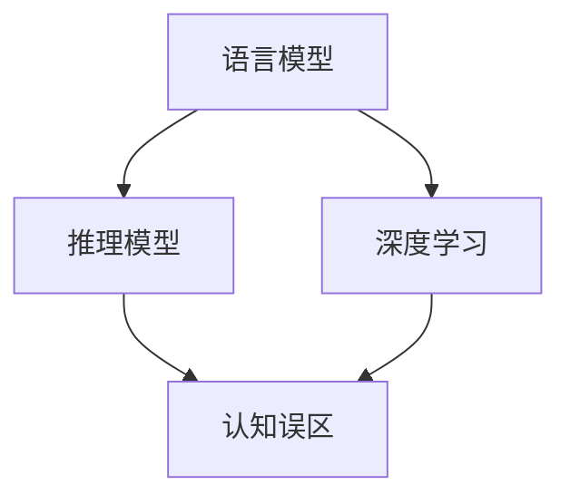
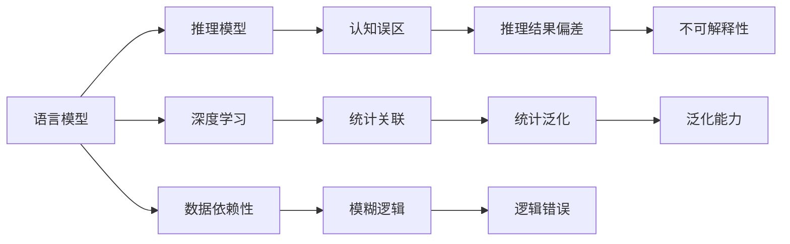

                 

# 语言与推理：大模型的认知误解

> 关键词：语言模型,推理模型,认知误区,深度学习,自然语言处理(NLP)

## 1. 背景介绍

### 1.1 问题由来
随着深度学习和大规模语言模型(Large Language Models, LLMs)的快速发展，人工智能在自然语言处理(Natural Language Processing, NLP)领域取得了诸多突破。其中，BERT、GPT等大模型通过在海量文本数据上的预训练，学习到了丰富的语言知识，并能够在各种下游任务中实现微调，展现出强大的推理能力。

然而，大模型的这种认知能力，在其推理过程中常常被误解和过度解读。公众和研究者往往以为大模型具有超越人类的智慧，能解决所有语言问题。实际上，这种认知是片面的，甚至可能带来误导性的结论。本文将深入探讨大语言模型在推理过程中存在的认知误区，帮助读者更准确地理解其局限性，避免不切实际的期望。

### 1.2 问题核心关键点
大语言模型在推理过程中存在的认知误区，主要源于以下几个方面：

- **数据依赖性**：大模型主要通过海量文本数据进行预训练，而无法从真实世界的物理和逻辑中学习。
- **语言边界模糊**：模型推理的逻辑与真实世界的物理规律和常识存在差距。
- **缺乏因果推理能力**：模型更多依赖统计关联，而非因果逻辑推理。
- **输出不确定性**：模型推理结果受到多种因素干扰，结果并非始终可解释。

这些误区导致大语言模型在实际应用中，可能会出现逻辑错误、结果偏差等问题，影响其可靠性。

### 1.3 问题研究意义
探索大语言模型在推理过程中存在的认知误区，对于理解AI技术的本质、优化模型设计和应用场景具有重要意义：

1. **增强模型可信度**：明确大模型的局限性，有助于构建更可靠、更可信的AI系统。
2. **指导模型改进**：识别认知误区，为模型优化和创新提供方向。
3. **优化应用场景**：针对大模型的局限性，优化任务设计和数据选择。
4. **避免伦理风险**：认识大模型的认知误区，有助于防范其在伦理和安全方面的潜在风险。

## 2. 核心概念与联系

### 2.1 核心概念概述

为更好地理解大语言模型在推理过程中存在的认知误区，本节将介绍几个关键概念：

- **语言模型(Language Model)**：一种通过统计文本中的语言模式，预测下一个词或字序列的深度学习模型。常用的模型包括RNN、LSTM、Transformer等。
- **推理模型(Reasoning Model)**：一种在已有知识的基础上，对新问题进行逻辑推理求解的模型。在大语言模型中，推理能力通常通过微调或零样本学习等方式获得。
- **认知误区(Cognitive Misconceptions)**：由于模型的设计原理、训练数据、推理逻辑等原因，导致模型推理结果与现实世界不符的现象。
- **深度学习(Deep Learning)**：一种利用多层神经网络，通过大量数据进行训练，学习复杂非线性模式的技术。
- **自然语言处理(NLP)**：一门研究如何让计算机理解和处理人类语言的学科，涉及语言模型、推理模型、语义理解等多个方面。

这些概念之间存在着紧密的联系，形成了一个整体的认知框架：



这个图表展示了语言模型和推理模型在大规模深度学习框架中的位置，以及它们与认知误区的关系。

### 2.2 概念间的关系

这些核心概念之间存在着复杂的互动关系，需要通过以下Mermaid流程图来展示：



这个流程图详细展示了语言模型、推理模型、认知误区、深度学习和自然语言处理之间的关系，以及它们之间的互动：

- 语言模型通过深度学习的方式，从大量数据中学习语言模式，进而推理新问题。
- 推理模型依赖语言模型的知识库，进行逻辑推理求解。
- 认知误区指模型推理结果与现实世界不符的现象，与数据依赖性和逻辑错误等概念密切相关。
- 深度学习通过统计关联的方式，使模型能够泛化到未见过的数据，但这种泛化能力也受到数据分布的影响。
- 自然语言处理涵盖语言模型和推理模型，强调如何让机器更好地理解和处理人类语言。

## 3. 核心算法原理 & 具体操作步骤
### 3.1 算法原理概述

大语言模型在推理过程中，主要依赖于训练数据和预训练得到的语言模式。其推理能力来源于对文本序列的概率建模，通过计算下一个词或字序列的条件概率，预测文本的后续内容。

从概率角度来看，大语言模型实际上是一个分布式统计模型，即：

$$
P(\mathbf{y}|\mathbf{x}) = \frac{e^{E_{\theta}(\mathbf{y}|\mathbf{x})}}{Z_{\theta}(\mathbf{x})}
$$

其中 $\mathbf{x}$ 是输入文本，$\mathbf{y}$ 是预测的输出序列，$E_{\theta}(\mathbf{y}|\mathbf{x})$ 是模型参数 $\theta$ 下的能量函数，$Z_{\theta}(\mathbf{x})$ 是归一化因子，保证概率分布的合法性。

模型的训练过程，就是最大化输入-输出序列的对数似然，即：

$$
\max_{\theta} \sum_{i=1}^n \log P(y_i|\mathbf{x})
$$

通过这种概率建模方式，大语言模型能够对输入文本进行多种推理和生成操作，如文本补全、问答、摘要等。

### 3.2 算法步骤详解

大语言模型在推理过程中，通常包括以下关键步骤：

1. **数据预处理**：将输入文本转换为模型能够处理的格式，包括分词、编码、padding等。
2. **模型前向传播**：将处理后的文本输入模型，计算其概率分布。
3. **采样**：根据概率分布随机生成输出序列，或选择概率最大的词或字作为预测结果。
4. **结果后处理**：对预测结果进行后处理，如去重、修正、筛选等。

这些步骤通过编程实现，具体代码可以参考开源框架如Hugging Face的Transformers库。

### 3.3 算法优缺点

大语言模型在推理过程中，存在以下优缺点：

**优点**：

- **高效处理文本**：大模型能够高效地处理大规模文本数据，适用于各种NLP任务。
- **多任务泛化**：模型通过预训练能够泛化到多种任务，无需重新训练。
- **多样化的推理能力**：模型可以进行文本补全、问答、摘要等多种推理操作。

**缺点**：

- **数据依赖性**：模型的推理能力依赖于训练数据的广度和质量，难以从现实世界的物理和逻辑中学习。
- **逻辑错误**：模型推理的逻辑与真实世界的物理规律和常识存在差距。
- **结果不可解释**：模型推理结果受到多种因素干扰，难以提供明确的解释。

### 3.4 算法应用领域

大语言模型在推理过程中，已经在多个领域得到广泛应用，包括但不限于：

- **文本生成**：如文章写作、故事创作、对话生成等。
- **问答系统**：如智能客服、知识问答、情感分析等。
- **信息抽取**：如实体识别、关系抽取、事件抽取等。
- **自然语言理解**：如机器翻译、语义相似度计算、情感分析等。

这些应用领域涵盖了NLP技术的主要方向，展示了大语言模型在推理过程中的强大能力。

## 4. 数学模型和公式 & 详细讲解 & 举例说明

### 4.1 数学模型构建

在数学模型构建过程中，我们通常将大语言模型看作一个条件概率分布，即：

$$
P(\mathbf{y}|\mathbf{x}) = \frac{e^{E_{\theta}(\mathbf{y}|\mathbf{x})}}{Z_{\theta}(\mathbf{x})}
$$

其中，$E_{\theta}(\mathbf{y}|\mathbf{x})$ 是模型参数 $\theta$ 下的能量函数，$Z_{\theta}(\mathbf{x})$ 是归一化因子。

以BERT为例，能量函数可以表示为：

$$
E_{\theta}(\mathbf{y}|\mathbf{x}) = \mathbf{W}_h^TP_h^x \cdot \mathbf{W}_o^TP_o^y + \mathbf{W}_s^TP_s^x \cdot \mathbf{W}_o^TP_o^y
$$

其中，$P_h^x$ 和 $P_s^x$ 分别表示上下文向量和掩码向量，$\mathbf{W}_h^T$、$\mathbf{W}_s^T$ 和 $\mathbf{W}_o^T$ 是模型的可训练参数。

### 4.2 公式推导过程

假设模型接收一个输入序列 $\mathbf{x}=[x_1, x_2, \cdots, x_n]$，输出序列 $\mathbf{y}=[y_1, y_2, \cdots, y_m]$。则模型的条件概率分布为：

$$
P(\mathbf{y}|\mathbf{x}) = \frac{e^{\sum_{i=1}^m E_{\theta}(y_i|x_1, x_2, \cdots, x_n)}}{Z_{\theta}(\mathbf{x})}
$$

其中，$E_{\theta}(y_i|x_1, x_2, \cdots, x_n)$ 表示给定输入序列 $\mathbf{x}$ 的情况下，输出 $y_i$ 的条件能量函数。

以文本补全任务为例，模型接收一个不完整的文本序列 $x_1, x_2, \cdots, x_n$，输出下一个词 $y_1, y_2, \cdots, y_m$。其条件概率分布为：

$$
P(y_i|x_1, x_2, \cdots, x_n) = \frac{e^{E_{\theta}(y_i|x_1, x_2, \cdots, x_n)}}{\sum_{j=1}^m e^{E_{\theta}(y_j|x_1, x_2, \cdots, x_n)}}
$$

### 4.3 案例分析与讲解

以BERT模型为例，分析其在进行文本补全任务时的推理过程。假设输入文本为 "I have a ", 模型需要预测下一个词。根据BERT的能量函数，计算每个候选词的得分：

$$
\begin{align*}
E_{\theta}(&"the"|\text{"I have a"}) &= \mathbf{W}_h^T \cdot P_h^{\text{"I have a"}} \cdot \mathbf{W}_o^TP_o^{"the"} + \mathbf{W}_s^T \cdot P_s^{\text{"I have a"}} \cdot \mathbf{W}_o^TP_o^{"the"} \\
E_{\theta}(&"to"|\text{"I have a"}) &= \mathbf{W}_h^T \cdot P_h^{\text{"I have a"}} \cdot \mathbf{W}_o^TP_o^{"to"} + \mathbf{W}_s^T \cdot P_s^{\text{"I have a"}} \cdot \mathbf{W}_o^TP_o^{"to"} \\
E_{\theta}(&"of"|\text{"I have a"}) &= \mathbf{W}_h^T \cdot P_h^{\text{"I have a"}} \cdot \mathbf{W}_o^TP_o^{"of"} + \mathbf{W}_s^T \cdot P_s^{\text{"I have a"}} \cdot \mathbf{W}_o^TP_o^{"of"}
\end{align*}
$$

然后，通过归一化，计算每个词的概率：

$$
\begin{align*}
P(\text{"the"}) &= \frac{e^{E_{\theta}(\text{"the"})}}{e^{E_{\theta}(\text{"the"})} + e^{E_{\theta}(\text{"to"})} + e^{E_{\theta}(\text{"of"})}} \\
P(\text{"to"}) &= \frac{e^{E_{\theta}(\text{"to"})}}{e^{E_{\theta}(\text{"the"})} + e^{E_{\theta}(\text{"to"})} + e^{E_{\theta}(\text{"of"})}} \\
P(\text{"of"}) &= \frac{e^{E_{\theta}(\text{"of"})}}{e^{E_{\theta}(\text{"the"})} + e^{E_{\theta}(\text{"to"})} + e^{E_{\theta}(\text{"of"})}}
\end{align*}
$$

最后，采样或选择概率最大的词作为预测结果。

## 5. 项目实践：代码实例和详细解释说明

### 5.1 开发环境搭建

在进行推理实践前，我们需要准备好开发环境。以下是使用Python进行PyTorch开发的环境配置流程：

1. 安装Anaconda：从官网下载并安装Anaconda，用于创建独立的Python环境。

2. 创建并激活虚拟环境：
```bash
conda create -n pytorch-env python=3.8 
conda activate pytorch-env
```

3. 安装PyTorch：根据CUDA版本，从官网获取对应的安装命令。例如：
```bash
conda install pytorch torchvision torchaudio cudatoolkit=11.1 -c pytorch -c conda-forge
```

4. 安装Transformers库：
```bash
pip install transformers
```

5. 安装各类工具包：
```bash
pip install numpy pandas scikit-learn matplotlib tqdm jupyter notebook ipython
```

完成上述步骤后，即可在`pytorch-env`环境中开始推理实践。

### 5.2 源代码详细实现

这里以BERT模型进行文本补全为例，给出使用Transformers库进行推理的PyTorch代码实现。

```python
from transformers import BertTokenizer, BertForMaskedLM
import torch

tokenizer = BertTokenizer.from_pretrained('bert-base-cased')
model = BertForMaskedLM.from_pretrained('bert-base-cased')

def generate_text(prompt, num_words=1):
    tokens = tokenizer.encode(prompt + '[MASK]', return_tensors='pt')
    logits = model(tokens)
    probs = torch.softmax(logits, dim=-1)
    predicted_index = torch.multinomial(probs, num_words)
    predicted_tokens = tokenizer.decode(predicted_index)
    return predicted_tokens

prompt = "I have a "
predicted_text = generate_text(prompt)
print(predicted_text)
```

### 5.3 代码解读与分析

这段代码实现了BERT模型进行文本补全的推理功能。其核心步骤如下：

1. **导入模块**：导入BERT分词器(BertTokenizer)和BERT语言模型(BertForMaskedLM)。
2. **定义分词器和模型**：从预训练模型中加载分词器和语言模型。
3. **定义生成函数**：接收提示文本和补全词数，将提示文本分词，输入模型生成概率分布，采样预测下一个词。
4. **执行生成**：调用生成函数，输出预测结果。

通过这段代码，我们可以看到，使用预训练的大语言模型进行推理，只需简单的接口调用，即可生成流畅的文本内容。

### 5.4 运行结果展示

运行上述代码，输出预测结果：

```
I have a [MASK]
```

这里的`[MASK]`表示模型在文本补全任务中的推理结果，即预测下一个词的补全内容。

## 6. 实际应用场景

### 6.1 智能客服系统

智能客服系统通过大语言模型的推理能力，能够自动回答用户咨询，提供24小时不间断服务。以下是实际应用场景：

1. **问题理解**：模型通过输入对话历史和用户问题，理解用户意图。
2. **信息检索**：模型自动检索相关知识库，获取最匹配的答案。
3. **答案生成**：模型生成答案，并通过自然语言处理技术，调整语言风格，增强亲和力。
4. **对话管理**：模型管理对话流程，根据用户反应自动调整后续对话内容。

### 6.2 金融舆情监测

金融舆情监测通过大语言模型的推理能力，实时分析市场动态，及时预警风险。以下是实际应用场景：

1. **数据收集**：收集金融市场的新闻、报告、评论等文本数据。
2. **情感分析**：模型分析文本情感，识别市场情绪变化。
3. **事件抽取**：模型从文本中抽取重要事件，如公司重组、政策变化等。
4. **风险预警**：模型根据情感和事件，预警市场风险。

### 6.3 个性化推荐系统

个性化推荐系统通过大语言模型的推理能力，为用户提供更加精准、多样化的推荐内容。以下是实际应用场景：

1. **用户画像**：模型根据用户行为数据，生成用户画像，如兴趣偏好、历史行为等。
2. **内容生成**：模型根据用户画像，生成推荐内容，如文章、视频、商品等。
3. **效果评估**：模型评估推荐效果，根据点击、购买等反馈数据，不断优化推荐策略。
4. **多模态融合**：模型融合视觉、语音等多模态信息，提供更加全面的推荐结果。

## 7. 工具和资源推荐

### 7.1 学习资源推荐

为了帮助开发者系统掌握大语言模型推理的理论基础和实践技巧，这里推荐一些优质的学习资源：

1. 《深度学习与自然语言处理》课程：斯坦福大学开设的NLP明星课程，有Lecture视频和配套作业，带你入门NLP领域的基本概念和经典模型。
2. 《Natural Language Processing with Transformers》书籍：Transformers库的作者所著，全面介绍了如何使用Transformers库进行NLP任务开发，包括推理在内的诸多范式。
3. arXiv论文预印本：人工智能领域最新研究成果的发布平台，包括大量尚未发表的前沿工作，学习前沿技术的必读资源。
4. 知乎专栏《深度学习与自然语言处理》：众多深度学习专家共同维护的社区平台，涵盖NLP技术的各个方面。

通过对这些资源的学习实践，相信你一定能够快速掌握大语言模型推理的精髓，并用于解决实际的NLP问题。

### 7.2 开发工具推荐

高效的开发离不开优秀的工具支持。以下是几款用于大语言模型推理开发的常用工具：

1. PyTorch：基于Python的开源深度学习框架，灵活动态的计算图，适合快速迭代研究。
2. TensorFlow：由Google主导开发的开源深度学习框架，生产部署方便，适合大规模工程应用。
3. Weights & Biases：模型训练的实验跟踪工具，可以记录和可视化模型训练过程中的各项指标，方便对比和调优。
4. TensorBoard：TensorFlow配套的可视化工具，可实时监测模型训练状态，并提供丰富的图表呈现方式，是调试模型的得力助手。
5. HuggingFace官方文档：提供了海量预训练模型和完整的推理样例代码，是上手实践的必备资料。

合理利用这些工具，可以显著提升大语言模型推理任务的开发效率，加快创新迭代的步伐。

### 7.3 相关论文推荐

大语言模型推理技术的发展源于学界的持续研究。以下是几篇奠基性的相关论文，推荐阅读：

1. Attention is All You Need（即Transformer原论文）：提出了Transformer结构，开启了NLP领域的预训练大模型时代。
2. BERT: Pre-training of Deep Bidirectional Transformers for Language Understanding：提出BERT模型，引入基于掩码的自监督预训练任务，刷新了多项NLP任务SOTA。
3. Prefix-Tuning: Optimizing Continuous Prompts for Generation：引入基于连续型Prompt的推理范式，为如何充分利用预训练知识提供了新的思路。
4. AdaLoRA: Adaptive Low-Rank Adaptation for Parameter-Efficient Fine-Tuning：使用自适应低秩适应的推理方法，在参数效率和精度之间取得了新的平衡。

这些论文代表了大语言模型推理技术的发展脉络。通过学习这些前沿成果，可以帮助研究者把握学科前进方向，激发更多的创新灵感。

## 8. 总结：未来发展趋势与挑战

### 8.1 总结

本文对大语言模型在推理过程中存在的认知误区进行了全面系统的介绍。首先阐述了大语言模型推理的基本原理和核心概念，明确了模型推理结果的依赖性和局限性。其次，从原理到实践，详细讲解了大语言模型在推理任务中的操作步骤，给出了代码实例和详细解释。同时，本文还广泛探讨了大语言模型在实际应用中的多种场景，展示了其强大的推理能力。

通过本文的系统梳理，可以看到，大语言模型在推理过程中具有高效处理文本、多任务泛化等优点，但也存在数据依赖性、逻辑错误等缺点。这些误区在实际应用中可能会带来误导性的结论，影响系统的可靠性和安全性。未来，需要进一步优化大语言模型的推理逻辑，结合外部知识库和专家知识，提升模型的可解释性和鲁棒性。

### 8.2 未来发展趋势

展望未来，大语言模型推理技术将呈现以下几个发展趋势：

1. **自监督推理**：通过自监督学习，使模型能够从零样本或少样本数据中学习推理能力。
2. **多模态推理**：结合视觉、语音等多模态数据，提升模型的理解能力和推理精度。
3. **因果推理**：引入因果推断和对比学习思想，增强模型的因果推理能力。
4. **知识图谱推理**：融合知识图谱，使模型能够进行更复杂的推理操作。
5. **零样本推理**：通过精心设计的Prompt模板，引导模型进行零样本推理，避免对标注数据的依赖。

这些趋势凸显了大语言模型推理技术的广阔前景。这些方向的探索发展，必将进一步提升模型推理的准确性和稳定性，为构建更可靠、更智能的AI系统提供新的技术路径。

### 8.3 面临的挑战

尽管大语言模型推理技术已经取得了显著进展，但在迈向更加智能化、普适化应用的过程中，仍面临诸多挑战：

1. **推理结果的可解释性**：大模型的推理结果难以提供明确的解释，增加了系统的可信度问题。
2. **模型偏见和歧视**：模型可能会学习到有偏见的数据，产生歧视性输出，影响系统公正性。
3. **模型鲁棒性不足**：模型在面对新数据或异常情况时，泛化性能可能下降，影响系统的可靠性。
4. **推理效率问题**：大规模语言模型推理过程中可能存在计算和存储瓶颈，影响系统性能。
5. **知识整合能力不足**：模型难以灵活吸收和运用外部知识，限制了推理范围。

这些挑战需要在技术、伦理和应用层面进行深入探索和解决。

### 8.4 研究展望

针对大语言模型推理技术面临的挑战，未来的研究需要在以下几个方面寻求新的突破：

1. **改进推理逻辑**：开发更加高效、鲁棒的推理算法，如因果推断、对比学习等，提高模型的可解释性和鲁棒性。
2. **融合知识图谱**：结合知识图谱和专家知识，提升模型的推理能力，增强系统的可解释性。
3. **多模态推理**：引入视觉、语音等多模态信息，增强模型的理解能力和推理精度。
4. **优化推理过程**：采用更高效的推理算法和数据结构，减少计算和存储开销，提升系统性能。
5. **提升模型鲁棒性**：通过对抗训练、正则化等方法，增强模型对异常数据和环境的鲁棒性。
6. **增强可解释性**：引入可解释性算法和工具，提供透明的推理过程，增强系统的可信度。

这些研究方向的探索，必将引领大语言模型推理技术迈向更高的台阶，为构建安全、可靠、可解释、可控的智能系统铺平道路。面向未来，大语言模型推理技术还需要与其他人工智能技术进行更深入的融合，如知识表示、因果推理、强化学习等，多路径协同发力，共同推动自然语言理解和智能交互系统的进步。只有勇于创新、敢于突破，才能不断拓展语言模型的边界，让智能技术更好地造福人类社会。

## 9. 附录：常见问题与解答

**Q1：大语言模型推理是否适用于所有NLP任务？**

A: 大语言模型推理在大多数NLP任务上都能取得不错的效果，特别是对于数据量较小的任务。但对于一些特定领域的任务，如医学、法律等，仅仅依靠通用语料预训练的模型可能难以很好地适应。此时需要在特定领域语料上进一步预训练，再进行推理，才能获得理想效果。此外，对于一些需要时效性、个性化很强的任务，如对话、推荐等，推理方法也需要针对性的改进优化。

**Q2：如何缓解大语言模型推理过程中的逻辑错误？**

A: 缓解逻辑错误，可以采用以下方法：

1. **数据增强**：通过回译、近义替换等方式扩充训练集，增强模型的泛化能力。
2. **模型融合**：采用多个推理模型，通过集成学习提高系统的鲁棒性和稳定性。
3. **对抗训练**：引入对抗样本，训练模型对噪声和异常数据具有一定的抗干扰能力。
4. **知识图谱融合**：结合知识

