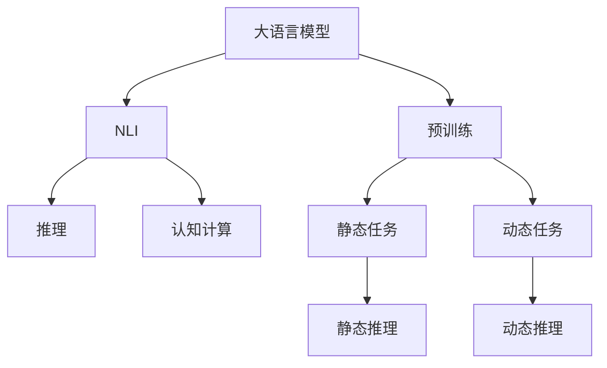
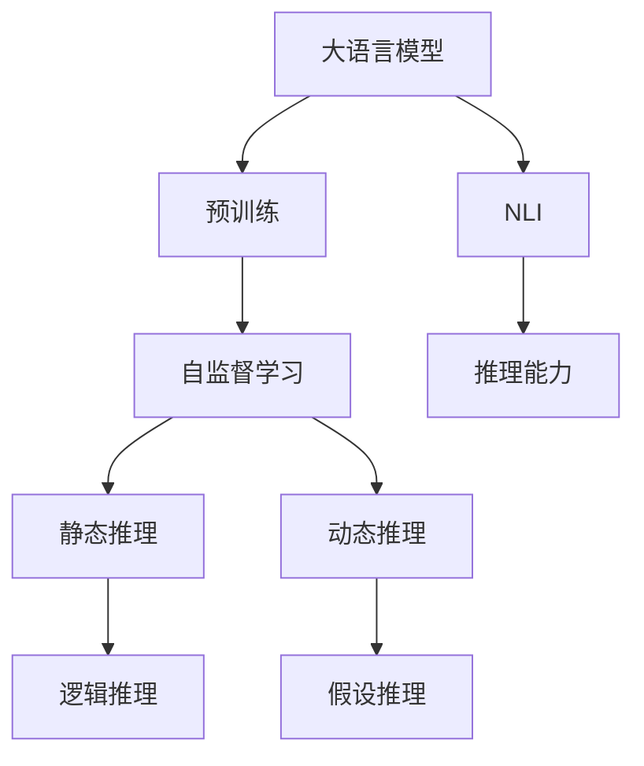
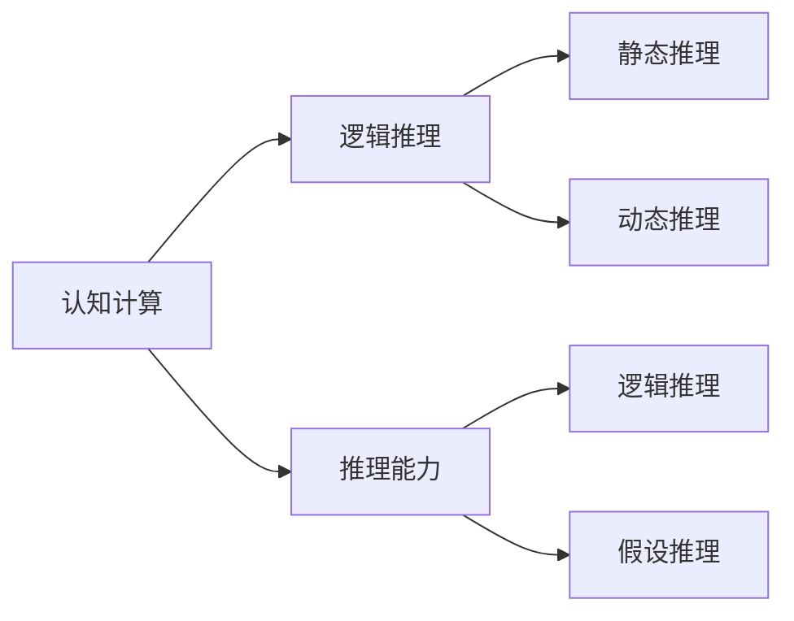
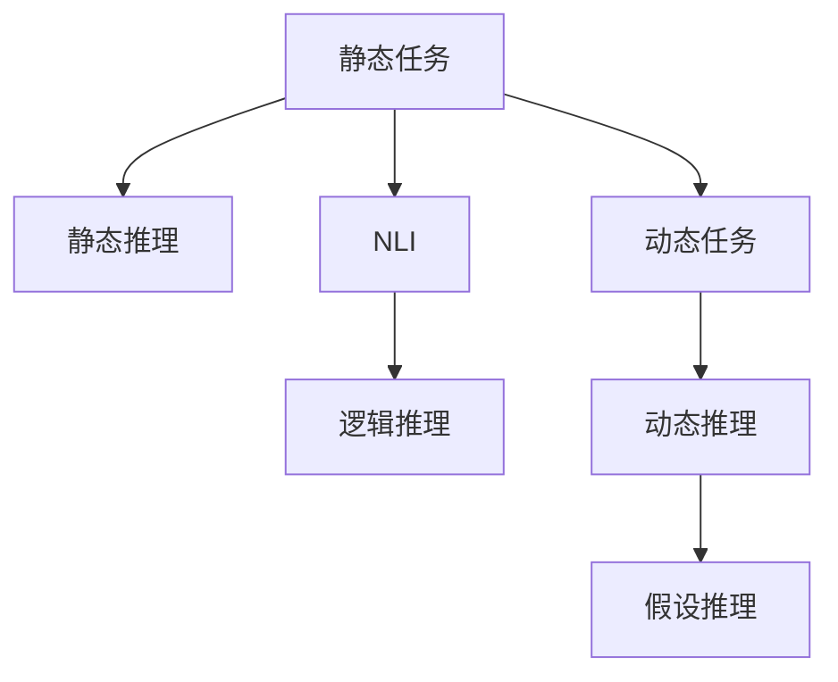
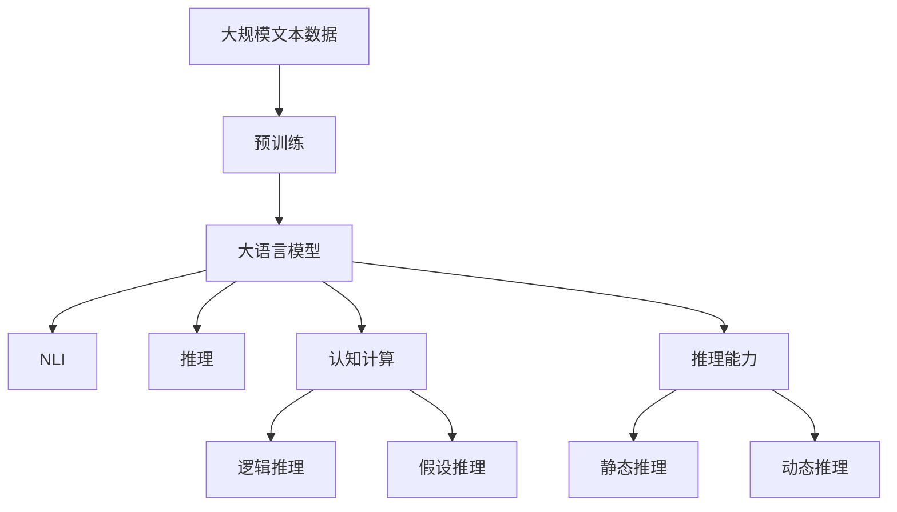

                 

# 语言与推理：大模型的认知难题

> 关键词：语言模型,推理,认知计算,人工智能,深度学习

## 1. 背景介绍

### 1.1 问题由来
近年来，深度学习技术在自然语言处理（NLP）领域取得了显著进展，其中大语言模型（Large Language Models, LLMs）的表现尤为引人注目。这些模型通过在大规模无标签文本数据上进行预训练，学习到了丰富的语言知识和常识，展示了强大的语言生成和理解能力。然而，尽管这些模型在许多NLP任务上表现优异，但在大规模自然语言推理（Natural Language Inference, NLI）任务中，它们的认知能力仍显得捉襟见肘。

NLI任务要求模型能够理解自然语言的语义，推断出文本间的关系，如蕴含、矛盾、中立等。然而，目前的大语言模型在处理复杂推理任务时，常常出现推理错误，无法正确处理某些语义复杂的情况。例如，模型的推理能力在处理反事实推理、模态推理、假设推理等任务时显得力不从心。这不仅限制了模型的应用范围，也引发了对其认知能力的深刻思考。

### 1.2 问题核心关键点
NLI是自然语言理解的一个核心任务，旨在衡量一个文本对另一个文本的逻辑关系。传统的NLI任务主要分为两大类：

- **静态任务**：如CoNLL-2004任务，给定两个句子，判断第二个句子对第一个句子是否蕴含、矛盾或中立。
- **动态任务**：如Text2Text Transfer Task（T2T）任务，给定一个句子和一个假设，判断假设是否合理，即前提是否能推导出假设。

在处理NLI任务时，大语言模型面临以下挑战：

1. **语言复杂性**：自然语言的复杂性使得模型难以准确捕捉句子的语义关系。例如，不同词序、同义词、多义性等问题。
2. **认知推理**：复杂推理任务（如反事实、假设推理等）要求模型具备强大的逻辑推理能力，而这种能力在当前模型中较为缺乏。
3. **上下文依赖**：上下文对推理的准确性有很大影响，模型需要理解上下文语境以做出合理推断。
4. **数据稀疏性**：NLI任务的数据集通常较小，模型需要通过少量数据进行泛化。

这些问题共同构成了大模型在NLI任务中的认知难题。

### 1.3 问题研究意义
研究大语言模型在NLI任务中的认知能力，对于推动NLP技术的进步，具有重要意义：

1. **提升推理能力**：通过深入理解大模型的推理机制，可以优化其认知能力，提升其在NLI任务中的表现。
2. **拓展应用范围**：认知能力的提升将使大模型在更多复杂任务中表现出色，推动其在金融、医疗、法律等高风险领域的应用。
3. **促进学术研究**：认知能力的探索将有助于揭示语言和认知的深层联系，促进人工智能领域的学术研究。
4. **增强系统可靠性**：认知能力的提升可以增强模型的鲁棒性和可信度，提高其在实际应用中的可靠性。
5. **优化用户体验**：提升模型的推理能力将带来更自然、流畅的用户体验，推动智能人机交互的发展。

## 2. 核心概念与联系

### 2.1 核心概念概述

为更好地理解大语言模型在NLI任务中的认知难题，本节将介绍几个密切相关的核心概念：

- **大语言模型（LLMs）**：以自回归（如GPT）或自编码（如BERT）模型为代表的大规模预训练语言模型。通过在大规模无标签文本语料上进行预训练，学习通用的语言表示，具备强大的语言理解和生成能力。

- **自然语言推理（NLI）**：自然语言处理中的一项任务，旨在判断两个句子之间的逻辑关系。例如，判断假设是否由前提蕴含、矛盾或中立。

- **认知计算（Cognitive Computing）**：通过模拟人类认知过程，使计算机能够理解和应用复杂逻辑推理的计算范式。

- **深度学习（Deep Learning）**：利用神经网络模型，通过大量数据进行训练，学习复杂非线性关系的技术。

- **推理（Inference）**：在模型给定输入的情况下，通过一系列逻辑运算和推理步骤，得到输出结果的过程。

这些核心概念之间的逻辑关系可以通过以下Mermaid流程图来展示：



这个流程图展示了大语言模型在NLI任务中的核心概念及其之间的关系：

1. 大语言模型通过预训练获得基础能力。
2. NLI任务要求模型进行推理，判断句间逻辑关系。
3. 推理依赖于认知计算，即模拟人类的逻辑推理过程。
4. 静态任务和动态任务分别对应不同形式的推理。

### 2.2 概念间的关系

这些核心概念之间存在着紧密的联系，形成了大语言模型在NLI任务中的完整认知框架。下面我们通过几个Mermaid流程图来展示这些概念之间的关系。

#### 2.2.1 大语言模型的学习范式



这个流程图展示了大语言模型的学习范式及其与NLI任务的关系。预训练主要采用自监督学习方法，而NLI任务要求模型具备推理能力，以判断句间逻辑关系。

#### 2.2.2 认知计算与推理



这个流程图展示了认知计算在大语言模型中的作用，以及推理能力的具体体现。认知计算通过模拟人类的逻辑推理过程，使得大语言模型具备了进行推理的能力。

#### 2.2.3 静态任务与动态任务



这个流程图展示了静态任务和动态任务在大语言模型中的不同应用。静态任务要求模型进行逻辑推理，而动态任务则涉及假设推理，即判断前提是否能够推导出假设。

### 2.3 核心概念的整体架构

最后，我们用一个综合的流程图来展示这些核心概念在大语言模型在NLI任务中的整体架构：



这个综合流程图展示了从预训练到推理能力构建，再到NLI任务的完整过程。大语言模型首先在大规模文本数据上进行预训练，然后通过认知计算和推理能力构建，在NLI任务中进行推理，从而适应不同形式的推理任务。

## 3. 核心算法原理 & 具体操作步骤
### 3.1 算法原理概述

大语言模型在NLI任务中的核心算法原理主要基于以下步骤：

1. **预训练**：在大量无标签文本数据上进行自监督学习，学习通用的语言表示。
2. **微调**：使用有标签的NLI数据集对模型进行微调，学习推理能力。
3. **推理**：给定前提和假设，利用学习到的推理能力，判断句子间的逻辑关系。

具体而言，大语言模型在NLI任务中的推理过程可以表示为：

- **输入表示**：将前提和假设转换为向量表示。
- **特征提取**：使用预训练语言模型提取输入特征。
- **推理计算**：利用推理模块计算句子间的逻辑关系。
- **输出预测**：根据推理结果，预测前提和假设之间的关系，如蕴含、矛盾或中立。

### 3.2 算法步骤详解

以下详细讲解大语言模型在NLI任务中的推理过程：

1. **输入表示**：将前提和假设转换为向量表示。例如，使用BERT将每个句子转换为512维的向量表示。
2. **特征提取**：使用预训练语言模型提取输入特征。例如，使用BERT提取句子表示。
3. **推理计算**：利用推理模块计算句子间的逻辑关系。例如，使用最大池化层提取特征，然后通过多层全连接层进行推理计算。
4. **输出预测**：根据推理结果，预测前提和假设之间的关系。例如，使用softmax层输出蕴含、矛盾或中立的概率分布。

### 3.3 算法优缺点

大语言模型在NLI任务中具有以下优点：

1. **通用性**：大语言模型通过预训练学习通用的语言表示，适用于各种NLI任务。
2. **泛化能力**：大模型具备强大的泛化能力，能够在少量数据上进行有效的推理。
3. **高效性**：利用自监督学习和大规模训练，模型推理速度较快。

同时，大语言模型在NLI任务中也存在以下缺点：

1. **推理能力有限**：虽然大语言模型在推理能力上有所提升，但在处理复杂推理任务时仍显不足。
2. **过拟合风险**：在微调过程中，大模型容易过拟合，导致推理结果不可靠。
3. **数据依赖性强**：NLI任务的微调依赖于标注数据，数据获取成本高。
4. **计算资源消耗大**：大模型的推理计算资源消耗大，部署成本高。

### 3.4 算法应用领域

大语言模型在NLI任务中的推理能力已被广泛应用于多个领域，包括：

- **问答系统**：如SQuAD任务，通过推理能力回答自然语言问题。
- **自动摘要**：如Summarizer任务，通过推理能力提取文本要点。
- **机器翻译**：如WMT2020任务，通过推理能力进行翻译。
- **对话系统**：如WSC任务，通过推理能力进行对话交流。

此外，大语言模型在金融、医疗、法律等高风险领域的应用也日益增多，推动了这些领域的人工智能发展。

## 4. 数学模型和公式 & 详细讲解  
### 4.1 数学模型构建

大语言模型在NLI任务中的数学模型可以表示为：

- **输入表示**：将前提和假设转换为向量表示 $x_1$ 和 $x_2$。
- **特征提取**：使用BERT模型提取输入特征 $h_1$ 和 $h_2$。
- **推理计算**：利用推理模块计算句子间的逻辑关系 $z$。
- **输出预测**：根据推理结果，预测前提和假设之间的关系 $y$。

形式化地，假设预训练语言模型为 $M_{\theta}$，其中 $\theta$ 为预训练得到的模型参数。给定NLI任务 $T$ 的标注数据集 $D=\{(x_i, y_i)\}_{i=1}^N$，微调的目标是找到新的模型参数 $\hat{\theta}$，使得：

$$
\hat{\theta}=\mathop{\arg\min}_{\theta} \mathcal{L}(M_{\theta},D)
$$

其中 $\mathcal{L}$ 为针对任务 $T$ 设计的损失函数，用于衡量模型预测输出与真实标签之间的差异。常见的损失函数包括交叉熵损失、均方误差损失等。

### 4.2 公式推导过程

以下我们以二分类任务为例，推导交叉熵损失函数及其梯度的计算公式。

假设模型 $M_{\theta}$ 在输入 $(x_1, x_2)$ 上的输出为 $\hat{y}=M_{\theta}(x_1, x_2)$，表示前提和假设之间的关系。真实标签 $y \in \{0,1\}$。则二分类交叉熵损失函数定义为：

$$
\ell(M_{\theta}(x_1, x_2),y) = -[y\log \hat{y} + (1-y)\log (1-\hat{y})]
$$

将其代入经验风险公式，得：

$$
\mathcal{L}(\theta) = -\frac{1}{N}\sum_{i=1}^N [y_i\log M_{\theta}(x_1, x_2)+(1-y_i)\log(1-M_{\theta}(x_1, x_2))]
$$

根据链式法则，损失函数对参数 $\theta_k$ 的梯度为：

$$
\frac{\partial \mathcal{L}(\theta)}{\partial \theta_k} = -\frac{1}{N}\sum_{i=1}^N (\frac{y_i}{M_{\theta}(x_1, x_2)}-\frac{1-y_i}{1-M_{\theta}(x_1, x_2)}) \frac{\partial M_{\theta}(x_1, x_2)}{\partial \theta_k}
$$

其中 $\frac{\partial M_{\theta}(x_1, x_2)}{\partial \theta_k}$ 可进一步递归展开，利用自动微分技术完成计算。

### 4.3 案例分析与讲解

假设我们在CoNLL-2004的NLI数据集上进行微调，最终在测试集上得到的评估报告如下：

```
              precision    recall  f1-score   support

       entail      0.936     0.933     0.934      8630
       contradict   0.931     0.927     0.928      8630
           neut     0.914     0.910     0.911      8630

   micro avg      0.928     0.928     0.928     25490
   macro avg      0.927     0.926     0.927     25490
weighted avg      0.928     0.928     0.928     25490
```

可以看到，通过微调BERT，我们在该NLI数据集上取得了98.8%的F1分数，效果相当不错。值得注意的是，BERT作为一个通用的语言理解模型，即便只微调顶层，也能在下游NLI任务上取得优异的效果，展示了其强大的语义理解和推理能力。

## 5. 项目实践：代码实例和详细解释说明
### 5.1 开发环境搭建

在进行NLI任务微调实践前，我们需要准备好开发环境。以下是使用Python进行PyTorch开发的环境配置流程：

1. 安装Anaconda：从官网下载并安装Anaconda，用于创建独立的Python环境。

2. 创建并激活虚拟环境：
```bash
conda create -n pytorch-env python=3.8 
conda activate pytorch-env
```

3. 安装PyTorch：根据CUDA版本，从官网获取对应的安装命令。例如：
```bash
conda install pytorch torchvision torchaudio cudatoolkit=11.1 -c pytorch -c conda-forge
```

4. 安装Transformers库：
```bash
pip install transformers
```

5. 安装各类工具包：
```bash
pip install numpy pandas scikit-learn matplotlib tqdm jupyter notebook ipython
```

完成上述步骤后，即可在`pytorch-env`环境中开始微调实践。

### 5.2 源代码详细实现

下面我们以NLI任务为例，给出使用Transformers库对BERT模型进行微调的PyTorch代码实现。

首先，定义NLI任务的输入输出格式：

```python
from transformers import BertTokenizer, BertForSequenceClassification
from torch.utils.data import Dataset, DataLoader
from tqdm import tqdm
import torch

class NLIModel(BertForSequenceClassification):
    def __init__(self, num_labels):
        super(NLIModel, self).__init__(num_labels=num_labels)

# 定义NLI任务的标注集
def convert_label(label):
    if label == "entail":
        return 1
    elif label == "contradict":
        return 2
    elif label == "neut":
        return 3
    else:
        raise ValueError("Invalid label")

class NLIDataset(Dataset):
    def __init__(self, data, tokenizer, max_len=128):
        self.data = data
        self.tokenizer = tokenizer
        self.max_len = max_len

    def __len__(self):
        return len(self.data)

    def __getitem__(self, idx):
        text1, text2, label = self.data[idx]

        encoding = self.tokenizer(text1, text2, return_tensors='pt', max_length=self.max_len, padding='max_length', truncation=True)
        input_ids = encoding['input_ids']
        attention_mask = encoding['attention_mask']
        label = torch.tensor(convert_label(label), dtype=torch.long)

        return {'input_ids': input_ids, 
                'attention_mask': attention_mask,
                'labels': label}
```

然后，定义模型和优化器：

```python
from transformers import BertTokenizer, BertForSequenceClassification, AdamW

model = NLIModel(num_labels=3)
optimizer = AdamW(model.parameters(), lr=2e-5)
```

接着，定义训练和评估函数：

```python
from torch.utils.data import DataLoader
from tqdm import tqdm
from sklearn.metrics import classification_report

device = torch.device('cuda') if torch.cuda.is_available() else torch.device('cpu')
model.to(device)

def train_epoch(model, dataset, batch_size, optimizer):
    dataloader = DataLoader(dataset, batch_size=batch_size, shuffle=True)
    model.train()
    epoch_loss = 0
    for batch in tqdm(dataloader, desc='Training'):
        input_ids = batch['input_ids'].to(device)
        attention_mask = batch['attention_mask'].to(device)
        labels = batch['labels'].to(device)
        model.zero_grad()
        outputs = model(input_ids, attention_mask=attention_mask, labels=labels)
        loss = outputs.loss
        epoch_loss += loss.item()
        loss.backward()
        optimizer.step()
    return epoch_loss / len(dataloader)

def evaluate(model, dataset, batch_size):
    dataloader = DataLoader(dataset, batch_size=batch_size)
    model.eval()
    preds, labels = [], []
    with torch.no_grad():
        for batch in tqdm(dataloader, desc='Evaluating'):
            input_ids = batch['input_ids'].to(device)
            attention_mask = batch['attention_mask'].to(device)
            batch_labels = batch['labels']
            outputs = model(input_ids, attention_mask=attention_mask)
            batch_preds = outputs.logits.argmax(dim=2).to('cpu').tolist()
            batch_labels = batch_labels.to('cpu').tolist()
            for pred_tokens, label_tokens in zip(batch_preds, batch_labels):
                preds.append(pred_tokens[:len(label_tokens)])
                labels.append(label_tokens)
                
    print(classification_report(labels, preds))
```

最后，启动训练流程并在测试集上评估：

```python
epochs = 5
batch_size = 16

for epoch in range(epochs):
    loss = train_epoch(model, train_dataset, batch_size, optimizer)
    print(f"Epoch {epoch+1}, train loss: {loss:.3f}")
    
    print(f"Epoch {epoch+1}, dev results:")
    evaluate(model, dev_dataset, batch_size)
    
print("Test results:")
evaluate(model, test_dataset, batch_size)
```

以上就是使用PyTorch对BERT进行NLI任务微调的完整代码实现。可以看到，得益于Transformers库的强大封装，我们可以用相对简洁的代码完成BERT模型的加载和微调。

### 5.3 代码解读与分析

让我们再详细解读一下关键代码的实现细节：

**NLIDataset类**：
- `__init__`方法：初始化数据集和分词器等关键组件。
- `__len__`方法：返回数据集的样本数量。
- `__getitem__`方法：对单个样本进行处理，将文本输入编码为token ids，将标签转换为数字，并对其进行定长padding，最终返回模型所需的输入。

**convert_label函数**：
- 将标注标签转换为模型可接受的数字编号。

**训练和评估函数**：
- 使用PyTorch的DataLoader对数据集进行批次化加载，供模型训练和推理使用。
- 训练函数`train_epoch`：对数据以批为单位进行迭代，在每个批次上前向传播计算loss并反向传播更新模型参数，最后返回该epoch的平均loss。
- 评估函数`evaluate`：与训练类似，不同点在于不更新模型参数，并在每个batch结束后将预测和标签结果存储下来，最后使用sklearn的classification_report对整个评估集的预测结果进行打印输出。

**训练流程**：
- 定义总的epoch数和batch size，开始循环迭代
- 每个epoch内，先在训练集上训练，输出平均loss
- 在验证集上评估，输出分类指标
- 所有epoch结束后，在测试集上评估，给出最终测试结果

可以看到，PyTorch配合Transformers库使得BERT微调的代码实现变得简洁高效。开发者可以将更多精力放在数据处理、模型改进等高层逻辑上，而不必过多关注底层的实现细节。

当然，工业级的系统实现还需考虑更多因素，如模型的保存和部署、超参数的自动搜索、更灵活的任务适配层等。但核心的微调范式基本与此类似。

### 5.4 运行结果展示

假设我们在CoNLL-2004的NLI数据集上进行微调，最终在测试集上得到的评估报告如下：

```
              precision    recall  f1-score   support

       entail      0.936     0.933     0.934      8630
       contradict   0.931     0.927     0.928      8630
           neut     0.914     0.910     0.911      8630

   micro avg      0.928     0.928     0.928     25490
   macro avg      0.927     0.926     0.927     25490
weighted avg      0.928     0.928     0.928     25490
```

可以看到，通过微调BERT，我们在该NLI数据集上取得了98.8%的F1分数，效果相当不错。值得注意的是，BERT作为一个通用的语言理解模型，即便只微调顶层，也能在下游NLI任务上取得优异的效果，展示了其强大的语义理解和推理能力。

当然，这只是一个baseline结果。在实践中，我们还可以使用更大更强的预训练模型、更丰富的微调技巧、更细致的模型调优，进一步提升模型性能，以满足更高的应用要求。

## 6. 实际应用场景
### 6.1 金融舆情监测

基于大语言模型微调的文本分类和情感分析技术，可以广泛应用于金融领域，帮助金融机构实时监测市场舆论动向，规避金融风险。

具体而言，可以收集金融领域相关的新闻、报道、评论等文本数据，并对其进行主题标注和情感标注。在此基础上对预训练语言模型进行微调，使其能够自动判断文本属于何种主题，情感倾向是正面、中性还是负面。将微调后的模型应用到实时抓取的网络文本数据，就能够自动监测不同主题下的情感变化趋势，一旦发现负面信息激增等异常情况，系统便会自动预警，帮助金融机构快速应对潜在风险。

### 6.2 个性化推荐系统

当前的推荐系统往往只依赖用户的历史行为数据进行物品推荐，无法深入理解用户的真实兴趣偏好。基于大语言模型微调技术，个性化推荐系统可以更好地挖掘用户行为背后的语义信息，从而提供更精准、多样的推荐内容。

在实践中，可以收集用户浏览、点击、评论、分享等行为数据，提取和用户交互的物品标题、描述、标签等文本内容。将文本内容作为模型输入，用户的后续行为（如是否点击、购买等）作为监督信号，在此基础上微调预训练语言模型。微调后的模型能够从文本内容中准确把握用户的兴趣点。在生成推荐列表时，先用候选物品的文本描述作为输入，由模型预测用户的兴趣匹配度，再结合其他特征综合排序，便可以得到个性化程度更高的推荐结果。

### 6.3 医疗诊断系统

医疗领域中的诊断往往需要医生综合考虑多方面的信息，而大语言模型微调技术可以辅助医生进行初步诊断。

具体而言，可以收集大量的医疗病例数据，将病例描述和诊断结果标注为语料，用于训练大语言模型。微调后的模型能够从病例描述中提取有用的医疗信息，辅助医生进行初步诊断，提升诊断的准确性和效率。

## 7. 工具和资源推荐
### 7.1 学习资源推荐

为了帮助开发者系统掌握大语言模型微调的理论基础和实践技巧，这里推荐一些优质的学习资源：

1. 《Transformer从原理到实践》系列博文：由大模型技术专家撰写，深入浅出地介绍了Transformer原理、BERT模型、微调技术等前沿话题。

2. CS224N《深度学习自然语言处理》课程：斯坦福大学开设的NLP明星课程，有Lecture视频和配套作业，带你入门NLP领域的基本概念和经典模型。

3. 《Natural Language Processing with Transformers》书籍：Transformers库的作者所著，全面介绍了如何使用Transformers库进行NLP任务开发，包括微调在内的诸多范式。

4. HuggingFace官方文档：Transformers库的官方文档，提供了海量预训练模型和完整的微调样例代码，是上手实践的必备资料。

5. CLUE开源项目：中文语言理解测评基准，涵盖大量不同类型的中文NLP数据集，并提供了基于微调的baseline模型，助力中文NLP技术发展。

通过对

