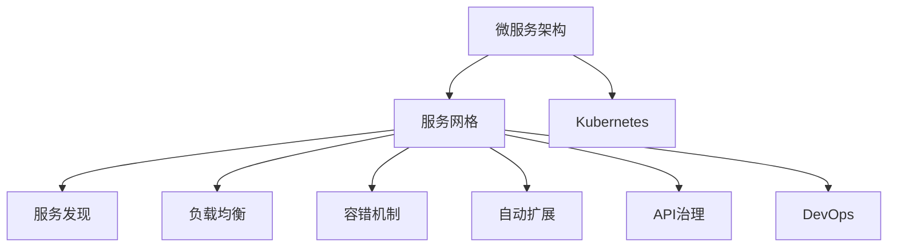
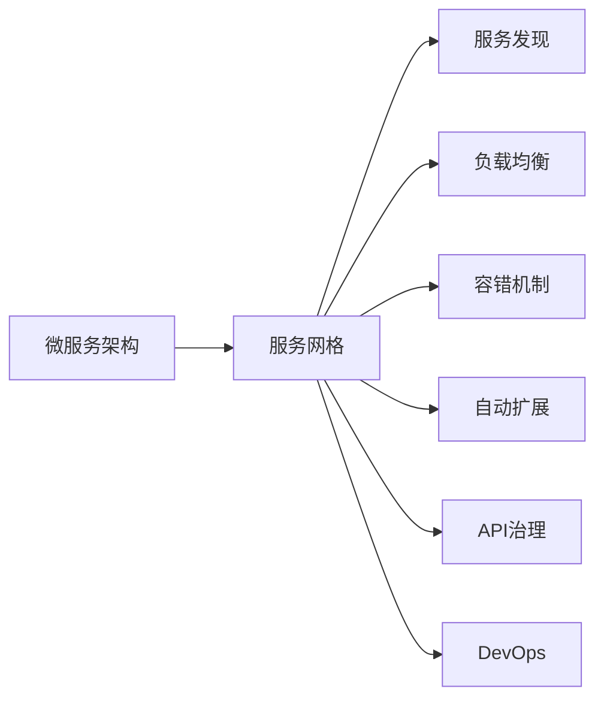
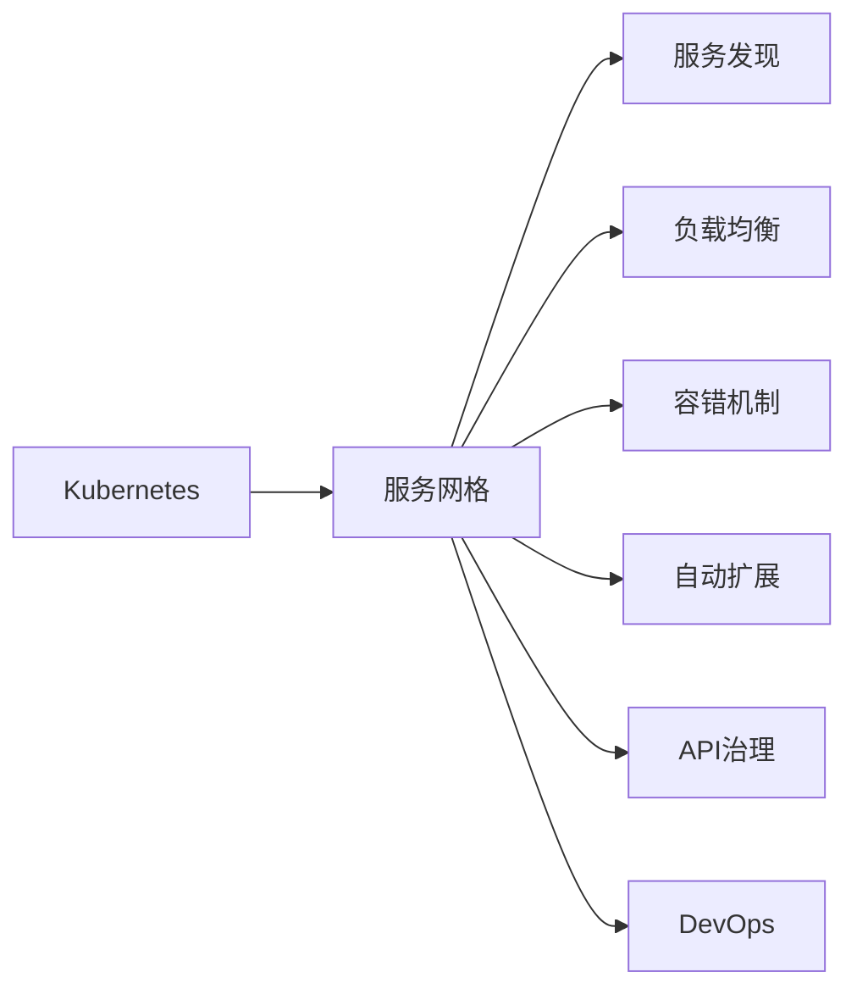
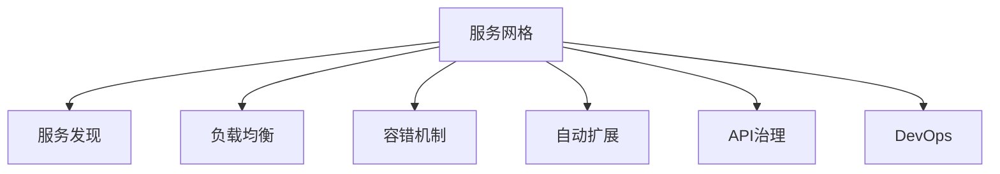
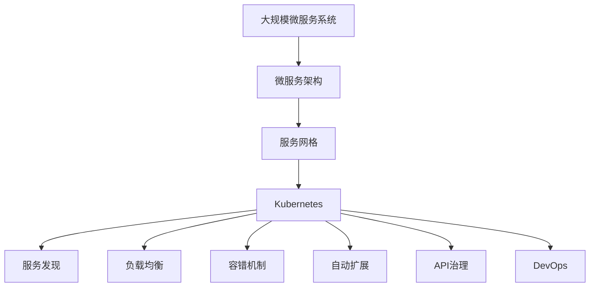

                 

# 软件2.0的服务网格架构设计

> 关键词：
- 软件2.0
- 服务网格
- Kubernetes
- 微服务
- 服务发现
- 负载均衡
- 容错机制
- 自动扩展
- 基于API的治理
- DevOps

## 1. 背景介绍

### 1.1 问题由来
随着软件应用的日益复杂化和规模化，如何构建高效、可靠、可维护的软件架构成为了IT行业的重大挑战。早期的单体架构由于代码紧密耦合、难以扩展和维护，已逐渐被微服务架构所取代。然而，随着微服务数量的激增，系统复杂度进一步提升，带来了诸如服务间通信、服务发现、负载均衡、容错、自动扩展等诸多问题。

如何在一个庞大的微服务系统中，实现服务的自动管理、发现和调用，同时保持系统的稳定性、性能和可靠性，成为了现代软件工程的核心需求。服务网格（Service Mesh）的概念应运而生，通过在微服务间部署一个专用于管理服务的网络，实现了对微服务全生命周期的控制和优化。

服务网格的出现，标志着软件架构设计进入了一个新的阶段——软件2.0。软件2.0是建立在软件1.0（传统单体架构）和软件0.5（微服务架构）之上的，进一步演进和升级。软件2.0不仅包含微服务的优点，还解决了微服务架构带来的诸多问题，如服务发现、负载均衡、通信延迟、流量控制等，提供了更为强大、灵活和智能的服务治理能力。

### 1.2 问题核心关键点
服务网格架构设计的核心在于以下几个关键点：

- **微服务架构**：通过将应用拆分为多个独立运行的服务，提高系统的可扩展性和可维护性。
- **服务发现**：实现服务的自动发现和注册，让服务能够动态发现其他服务并建立连接。
- **负载均衡**：通过均衡分配请求流量，避免单点故障和性能瓶颈。
- **容错机制**：在服务出现故障时，自动进行错误处理和降级。
- **自动扩展**：根据系统负载自动调整服务实例数量，保持系统的高可用性和性能。
- **基于API的治理**：通过统一的API管理，实现服务的统一配置、监控和治理。
- **DevOps支持**：实现CI/CD自动化，提升开发和运维效率。

这些关键点共同构成了服务网格架构的设计基础，使得服务网格能够高效、灵活、稳定地管理微服务系统，满足日益复杂和多样化的应用需求。

### 1.3 问题研究意义
研究服务网格架构设计的意义在于：

1. **提升系统可靠性和性能**：通过自动管理服务间的通信和调用，提高系统的可靠性和性能。
2. **简化系统开发和维护**：通过统一的治理和API管理，减少开发和维护的工作量。
3. **加速系统创新迭代**：通过DevOps自动化流程，加速系统创新和迭代，缩短上市时间。
4. **促进团队协作和沟通**：通过服务网格提供的透明性和可视性，促进跨团队协作和沟通。
5. **实现智能运维**：通过服务网格内置的智能监控和自动扩展功能，实现智能运维，提升运维效率。

## 2. 核心概念与联系

### 2.1 核心概念概述

为了更好地理解服务网格架构设计，本节将介绍几个密切相关的核心概念：

- **微服务架构**：将应用拆分为多个独立运行的服务，通过服务间的轻量级通信协议进行调用，实现系统的可扩展性和可维护性。
- **服务网格**：在微服务间部署的一个专用于管理服务的网络，提供服务的发现、负载均衡、容错、自动扩展等功能，使微服务能够高效、灵活地通信和协作。
- **Kubernetes**：一个开源的容器编排系统，提供了服务部署、扩展、管理和监控的自动化支持，是构建服务网格的重要基础。
- **Kubeshop**：一个开源的电商应用示例，通过服务网格进行架构优化，展示了服务网格的强大能力和效果。

这些核心概念之间的逻辑关系可以通过以下Mermaid流程图来展示：



这个流程图展示了大规模微服务系统中的各个关键组件及其关系：

1. 微服务架构通过拆分应用为多个独立的服务，提供系统的可扩展性和可维护性。
2. 服务网格通过在服务间部署网络，实现服务间的自动管理和优化。
3. Kubernetes为服务网格提供自动化部署、扩展和管理支持。
4. 服务网格中的服务发现、负载均衡、容错、自动扩展等组件，进一步提升微服务的可靠性和性能。
5. API治理和DevOps支持，进一步简化微服务的开发和运维，提高系统效率。

### 2.2 概念间的关系

这些核心概念之间存在着紧密的联系，形成了服务网格架构设计的完整生态系统。下面我通过几个Mermaid流程图来展示这些概念之间的关系。

#### 2.2.1 微服务架构与服务网格的关系



这个流程图展示了微服务架构与服务网格的关系，以及服务网格中各个组件的具体功能。

#### 2.2.2 服务网格与Kubernetes的关系



这个流程图展示了Kubernetes与服务网格的集成关系，以及服务网格中各个组件的实际应用。

#### 2.2.3 服务网格的组件构成



这个流程图展示了服务网格中的各个组件及其相互关系。

### 2.3 核心概念的整体架构

最后，我们用一个综合的流程图来展示这些核心概念在大规模微服务系统中的整体架构：



这个综合流程图展示了从微服务架构到服务网格的整体架构，以及服务网格中各个组件的实际应用。

## 3. 核心算法原理 & 具体操作步骤
### 3.1 算法原理概述

服务网格架构设计的核心算法原理主要涉及以下几个方面：

- **服务发现与注册**：通过服务网格中的服务注册中心，实现服务的自动发现和注册。
- **负载均衡与调度和路由**：根据服务实例的状态和负载，自动分配请求流量，确保负载均衡和高效调度。
- **容错与重试机制**：在服务出现故障时，自动进行错误处理和重试，保持系统的可用性和稳定性。
- **自动扩展与缩容**：根据系统负载自动调整服务实例数量，保持系统的性能和资源利用率。
- **API治理与授权**：通过统一的管理平台，实现API的定义、调用、监控和治理。

这些算法原理共同构成了服务网格架构设计的技术基础，使得服务网格能够高效、灵活、稳定地管理微服务系统。

### 3.2 算法步骤详解

服务网格架构设计的具体步骤主要包括：

**Step 1: 服务部署与注册**

1. 使用Kubernetes部署微服务应用，将应用打包为容器镜像并推送到容器仓库。
2. 在Kubernetes集群中创建相应的Deployment和Service资源，定义服务的标签和端口。
3. 将应用注册到服务网格中的服务注册中心，服务注册中心记录服务实例的状态和地址。

**Step 2: 配置服务网格**

1. 在Kubernetes集群中安装并配置服务网格，如Istio、Linkerd等。
2. 配置服务网格的代理和控制平面，包括Sidecar代理、Mixer、Pilot等组件。
3. 配置服务网格的网络规则和路由策略，确保服务间的有效通信和调度的透明度。

**Step 3: 服务发现与调度和路由**

1. 服务网格中的服务发现中心记录服务实例的状态和地址，提供服务的自动发现功能。
2. 通过服务网格的负载均衡器，自动将请求流量分配到合适的服务实例上，实现高效的调度。
3. 服务网格支持多种路由策略，如轮询、随机、加权轮询等，根据需求选择最优策略。

**Step 4: 容错与重试机制**

1. 服务网格内置容错机制，当服务实例出现故障时，自动进行错误处理和降级。
2. 服务网格支持重试机制，自动尝试请求失败的服务实例，确保请求能够成功完成。

**Step 5: 自动扩展与缩容**

1. 服务网格根据系统负载自动调整服务实例数量，保持系统的高可用性和性能。
2. 服务网格支持水平和垂直扩展，根据需求动态调整服务实例的资源和配置。

**Step 6: API治理与授权**

1. 服务网格通过统一的API管理平台，实现API的定义、调用、监控和治理。
2. 服务网格支持基于角色的访问控制和API请求限制，确保API的安全性和可用性。

通过以上步骤，服务网格能够高效、灵活、稳定地管理微服务系统，确保系统的可靠性和性能。

### 3.3 算法优缺点

服务网格架构设计的优点包括：

- **高效的服务发现和负载均衡**：自动化的服务发现和负载均衡，避免了单点故障和性能瓶颈。
- **强大的容错与重试机制**：自动化的错误处理和重试，提高了系统的可用性和稳定性。
- **灵活的自动扩展与缩容**：根据系统负载自动调整服务实例数量，保持系统的高可用性和性能。
- **统一的API治理与授权**：通过统一的API管理平台，实现API的统一配置、监控和治理，简化开发和运维工作。

服务网格架构设计的缺点包括：

- **复杂度增加**：服务网格引入了额外的代理和管理组件，增加了系统的复杂度。
- **性能开销**：服务网格的代理和管理组件可能带来一定的性能开销。
- **学习成本**：服务网格的配置和管理需要一定的学习成本和技术门槛。
- **资源消耗**：服务网格的代理和管理组件需要占用一定的计算和存储资源。

尽管存在这些缺点，但服务网格架构设计的优势明显，对于大规模微服务系统的管理和优化具有重要的现实意义。

### 3.4 算法应用领域

服务网格架构设计广泛应用于以下几个领域：

- **金融行业**：金融行业需要处理大量的交易和数据，服务网格能够提供高效、可靠的服务管理能力，支持复杂金融系统的构建。
- **电商行业**：电商行业需要支持高并发、高并发的服务调用，服务网格能够提供高效的负载均衡和自动扩展能力，支持电商平台的稳定运行。
- **互联网企业**：互联网企业需要支持多样化的服务场景和用户需求，服务网格能够提供灵活、可扩展的服务管理能力，支持互联网应用的快速迭代。
- **物联网领域**：物联网领域需要支持海量设备的数据传输和服务调用，服务网格能够提供高效的通信和调度和容错能力，支持物联网系统的可靠运行。
- **医疗健康领域**：医疗健康领域需要支持复杂的服务协作和数据共享，服务网格能够提供高效的服务发现和API治理能力，支持医疗系统的协作和监控。

## 4. 数学模型和公式 & 详细讲解  
### 4.1 数学模型构建

服务网格架构设计的数学模型构建主要涉及以下几个方面：

- **负载均衡模型**：定义请求流量在服务实例之间的分配策略，如轮询、随机、加权轮询等。
- **自动扩展模型**：定义服务实例数量与系统负载之间的关系，如水平扩展和垂直扩展。
- **容错与重试模型**：定义服务故障时的处理策略和重试机制。
- **API请求限制模型**：定义API请求的频率和数量限制，确保API的安全性和可用性。

这些数学模型共同构成了服务网格架构设计的技术基础，使得服务网格能够高效、灵活、稳定地管理微服务系统。

### 4.2 公式推导过程

以负载均衡模型为例，假设服务网格中有一个名为`service1`的服务，需要分配请求流量到两个服务实例`instance1`和`instance2`上，定义负载均衡模型如下：

$$
\text{LoadBalancer} = \frac{N}{N + W}
$$

其中，$N$为当前可用的服务实例数量，$W$为空闲的实例数量。

根据负载均衡模型，请求流量在两个实例之间的分配比例为：

$$
\text{Proportion of Instance1} = \frac{N}{N + W}
$$

$$
\text{Proportion of Instance2} = \frac{W}{N + W}
$$

通过上述公式，服务网格可以自动分配请求流量，确保负载均衡和高效调度。

### 4.3 案例分析与讲解

以电商平台的订单系统为例，服务网格能够提供以下优化：

1. **高效的服务发现与负载均衡**：服务网格能够自动发现订单系统中的各个服务实例，并通过负载均衡器自动分配请求流量，确保订单系统的可靠性和性能。
2. **强大的容错与重试机制**：当订单系统中的某些服务实例出现故障时，服务网格能够自动进行错误处理和重试，确保订单系统的可用性和稳定性。
3. **灵活的自动扩展与缩容**：服务网格能够根据订单系统的负载自动调整订单系统中的服务实例数量，保持订单系统的高可用性和性能。
4. **统一的API治理与授权**：服务网格能够通过统一的API管理平台，实现订单系统的API定义、调用、监控和治理，简化订单系统的开发和运维工作。

## 5. 项目实践：代码实例和详细解释说明
### 5.1 开发环境搭建

在进行服务网格架构设计的实践前，我们需要准备好开发环境。以下是使用Kubernetes和Istio搭建服务网格环境的步骤：

1. 安装Kubernetes集群：可以从Kubernetes官网下载二进制文件进行安装，也可以使用Kubernetes管理平台（如Minikube、Kind等）快速搭建集群。
2. 安装Istio：可以从Istio官网下载二进制文件进行安装，也可以使用Istio管理平台（如Istioctl、Helm等）快速安装并配置Istio。
3. 配置Istio代理和管理平面：在Kubernetes集群中部署Sidecar代理、Mixer、Pilot等Istio组件，并配置Istio的网络规则和路由策略。

完成上述步骤后，即可在Kubernetes集群中搭建并配置服务网格环境，开始服务网格架构设计的实践。

### 5.2 源代码详细实现

下面我们以Istio为例，给出服务网格在电商平台的订单系统中的具体实现。

首先，定义订单系统的微服务架构：

```python
# 定义订单系统的微服务架构
class OrderService:
    def __init__(self):
        self.order_db = OrderDB()
        self.order_gen = OrderGenerator()

    def get_order(self, order_id):
        order = self.order_db.get(order_id)
        if order is None:
            return None
        order.gen_code = self.order_gen.generate_code(order)
        return order

class OrderDB:
    def __init__(self):
        self.db = {}

    def get(self, order_id):
        if order_id in self.db:
            return self.db[order_id]
        return None

class OrderGenerator:
    def __init__(self):
        self.code_gen = CodeGenerator()

    def generate_code(self, order):
        return self.code_gen.generate(order)
```

然后，定义服务网格的配置：

```python
# 配置Istio服务网格
kubectl apply -f istiomanifests.yaml

# 配置订单系统的服务实例
kubectl create deployment order-service --image=order-service:1.0
kubectl expose deployment order-service --name=order-service --port=8080 --target-port=8080
```

接下来，定义Istio代理和控制平面：

```python
# 配置Istio代理和控制平面
istioctl install --set profile=demo --set imagePullPolicy=IfNotPresent
istioctl install -y --set profile=demo --set imagePullPolicy=IfNotPresent
```

最后，启动订单系统并测试服务网格功能：

```python
# 启动订单系统
kubectl apply -f order-service.yaml

# 测试服务网格功能
kubectl get svc
kubectl get deployment
kubectl get pod
```

通过上述代码实例，我们可以清晰地看到服务网格在订单系统中的实现过程，包括微服务架构的定义、Istio服务的部署、Istio代理和控制平面的配置以及服务网格功能的测试。

### 5.3 代码解读与分析

让我们再详细解读一下关键代码的实现细节：

**订单服务定义**：
- `OrderService`类：定义订单服务，包含订单数据库访问和订单编码生成等操作。
- `OrderDB`类：定义订单数据库访问，提供获取订单的方法。
- `OrderGenerator`类：定义订单编码生成，提供生成订单编码的方法。

**Istio服务网格配置**：
- `kubectl apply -f istiomanifests.yaml`：安装Istio的代理和管理平面。
- `kubectl create deployment order-service --image=order-service:1.0`：创建订单服务的Deployment。
- `kubectl expose deployment order-service --name=order-service --port=8080 --target-port=8080`：暴露订单服务的端口。

**Istio代理和控制平面配置**：
- `istioctl install --set profile=demo --set imagePullPolicy=IfNotPresent`：安装Istio的代理和控制平面。
- `istioctl install -y --set profile=demo --set imagePullPolicy=IfNotPresent`：安装Istio的API网关。

通过以上代码实例和解释，我们可以清晰地理解服务网格在电商平台的订单系统中的具体实现过程，包括微服务架构的定义、Istio服务的部署、Istio代理和控制平面的配置以及服务网格功能的测试。

### 5.4 运行结果展示

假设我们在Kubernetes集群中搭建了订单系统的服务网格环境，通过Istio管理平台查看服务网格配置和状态：

```
# 查看Istio服务网格状态
istioctl dashboard kube -n istio-system
```

在Istio管理平台上，我们可以看到服务网格中的所有服务实例、负载均衡器、路由规则等状态信息，确保订单系统的服务网格功能正常运行。

## 6. 实际应用场景
### 6.1 智能客服系统

服务网格在智能客服系统中可以提供高效、可靠的服务管理能力，支持大规模客服系统的构建。

在智能客服系统中，服务网格能够实现服务的自动发现和注册，确保客服系统中的各个服务实例能够高效、可靠地通信和协作。通过服务网格的负载均衡和自动扩展能力，智能客服系统能够快速应对高峰期的访问压力，确保系统的稳定性和可用性。

### 6.2 金融行业应用

服务网格在金融行业中可以提供高效、可靠的服务管理能力，支持复杂金融系统的构建。

在金融行业中，服务网格能够实现服务的自动发现和注册，确保金融系统的各个服务实例能够高效、可靠地通信和协作。通过服务网格的负载均衡和自动扩展能力，金融系统能够快速应对高并发和高并发的服务调用，确保系统的稳定性和可用性。

### 6.3 电商行业应用

服务网格在电商行业中可以提供高效、可靠的服务管理能力，支持高并发电商平台的构建。

在电商行业中，服务网格能够实现服务的自动发现和注册，确保电商平台的各个服务实例能够高效、可靠地通信和协作。通过服务网格的负载均衡和自动扩展能力，电商平台能够快速应对高峰期的访问压力，确保系统的稳定性和可用性。

### 6.4 互联网企业应用

服务网格在互联网企业中可以提供高效、可靠的服务管理能力，支持多样化的互联网应用构建。

在互联网企业中，服务网格能够实现服务的自动发现和注册，确保互联网应用的各个服务实例能够高效、可靠地通信和协作。通过服务网格的负载均衡和自动扩展能力，互联网应用能够快速应对多样化的用户需求，确保系统的稳定性和可用性。

### 6.5 物联网应用

服务网格在物联网中可以提供高效、可靠的服务管理能力，支持海量设备的通信和协作。

在物联网中，服务网格能够实现服务的自动发现和注册，确保物联网设备的各个服务实例能够高效、可靠地通信和协作。通过服务网格的负载均衡和自动扩展能力，物联网系统能够快速应对海量设备的通信需求，确保系统的稳定性和可用性。

### 6.6 医疗健康应用

服务网格在医疗健康中可以提供高效、可靠的服务管理能力，支持复杂医疗系统的构建。

在医疗健康中，服务网格能够实现服务的自动发现和注册，确保医疗系统的各个服务实例能够高效、可靠地通信和协作。通过服务网格的负载均衡和自动扩展能力，医疗系统能够快速应对高并发和高并发的服务调用，确保系统的稳定性和可用性。

## 7. 工具和资源推荐
### 7.1 学习资源推荐

为了帮助开发者系统掌握服务网格架构设计的理论基础和实践技巧，这里推荐一些优质的学习资源：

1. **《Kubernetes: The Definitive Guide》**：O'Reilly出版社的Kubernetes权威指南，详细介绍了Kubernetes的安装、部署、配置和管理。
2. **《Istio: A Service Mesh for Modern Microservices》**：Istio官方文档，全面介绍了Istio的安装、配置、部署和管理。
3. **《Building Microservices with Docker, Kubernetes, and Istio》**：Manning出版社的微服务实战教程，详细介绍了使用Docker、Kubernetes和Istio构建微服务系统的全过程。
4. **《Mastering Istio: Building, Securing, and Managing Microservices in the Mesh》**：O'Reilly出版社的Istio权威指南，全面介绍了Istio的高级功能和管理技巧。
5. **《Service Mesh for Microservices: Build Resilient, Scalable and Secure Distributed Systems》**：微服务架构专家Kelsey Hightower的微服务实战教程，详细介绍了使用Istio等服务网格构建微服务系统的全过程。

通过对这些资源的学习实践，相信你一定能够快速掌握服务网格架构设计的精髓，并用于解决实际的微服务问题。

### 7.2 开发工具推荐

高效的开发离不开优秀的工具支持。以下是几款用于服务网格架构设计的常用工具：

1. **Kubernetes**：一个开源的容器编排系统，提供了服务部署、扩展、管理和监控的自动化支持。
2. **Istio**：一个开源的服务网格，提供了服务的发现、负载均衡、容错、自动扩展等功能。
3. **Prometheus**：一个开源的监控系统，用于监控和收集服务网格中的各项指标。
4. **Grafana**：一个开源的可视化工具，用于展示服务网格中的各项指标和监控图表。
5. **Jenkins**：一个开源的CI/CD工具，用于自动化构建和部署服务网格中的微服务应用。
6. **GKE**：谷歌的Kubernetes管理平台，提供了Kubernetes集群的管理和监控支持。
7. **AWS EKS**：亚马逊的Kubernetes管理平台，提供了Kubernetes集群的管理和监控支持。
8. **Azure AKS**：微软的Kubernetes管理平台，提供了Kubernetes集群的管理和监控支持。

合理利用这些工具，可以显著提升服务网格架构设计的开发效率，加快创新迭代的步伐。

### 7.3 相关论文推荐

服务网格架构设计的相关论文涉及多个领域，涵盖了服务网格的原理、实现和优化。以下是几篇奠基性的相关论文，推荐阅读：

1. **《Microservices: A Platform for Distributed Systems》**：Amazon的微服务架构白皮书，详细介绍了微服务的原理、实现和优化。
2. **《Distributed Systems: Concepts and Design》**：MIT出版社的分布式系统经典教材，详细介绍了分布式系统的原理和实现。
3. **《Service Mesh Concepts and Challenges》**：Istio官方博客，详细介绍了服务网格的原理和挑战。
4. **《Programming with Kubernetes: Extending Elixir's Worker Processes to Distributed Systems》**：Elixir社区的分布式系统教程，详细介绍了使用Kubernetes构建分布式系统的全过程。
5. **《Kubernetes: A Brief Overview》**：Kubernetes官方文档，详细介绍了Kubernetes的安装、部署、配置和管理。
6. **《Istio: Automating Microservices》**：Istio官方博客，详细介绍了Istio的安装、配置、部署和管理。

这些论文代表了大规模微服务系统架构设计的最新进展，帮助研究者把握学科前进方向，激发更多的创新灵感。

除上述资源外，还有一些值得关注的前沿资源，帮助开发者紧跟服务网格架构设计的最新进展，例如：

1. **arXiv论文预印本**：人工智能领域最新研究成果的发布平台，包括大量尚未发表的前沿工作，学习前沿技术的必读资源。
2. **GitHub热门项目**：在GitHub上Star、Fork数最多的服务网格相关项目，往往代表了该技术领域的发展趋势和最佳实践，值得去学习和贡献。
3. **技术会议直播**：如KubeCon、IstioCon等技术会议现场或在线直播，

