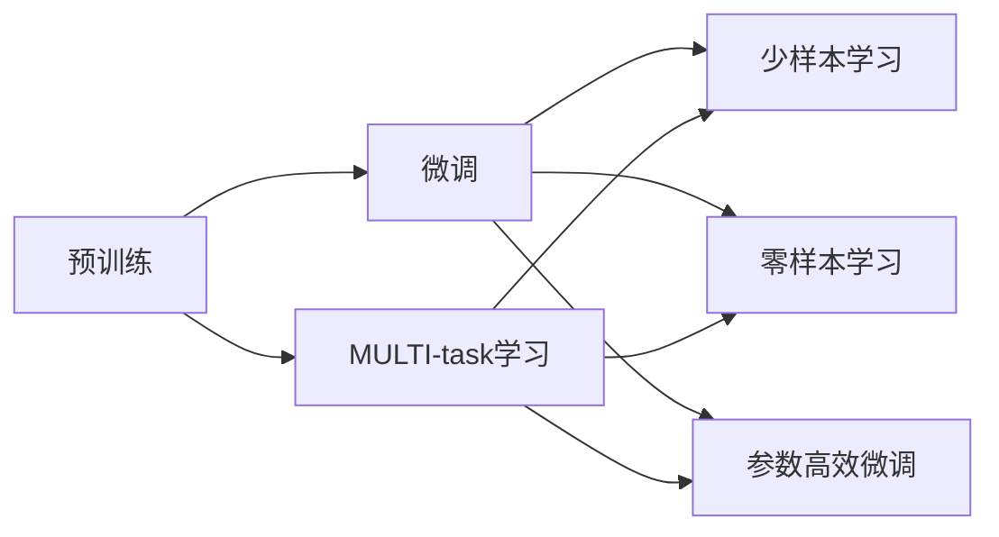
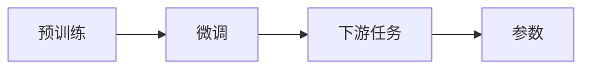
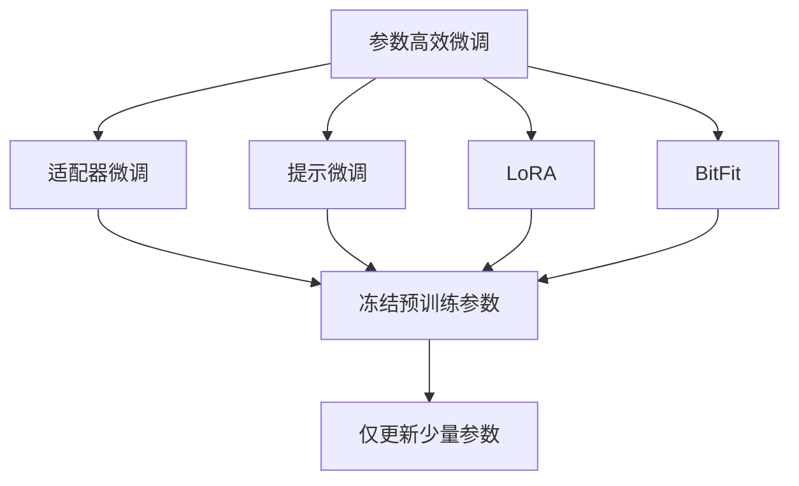
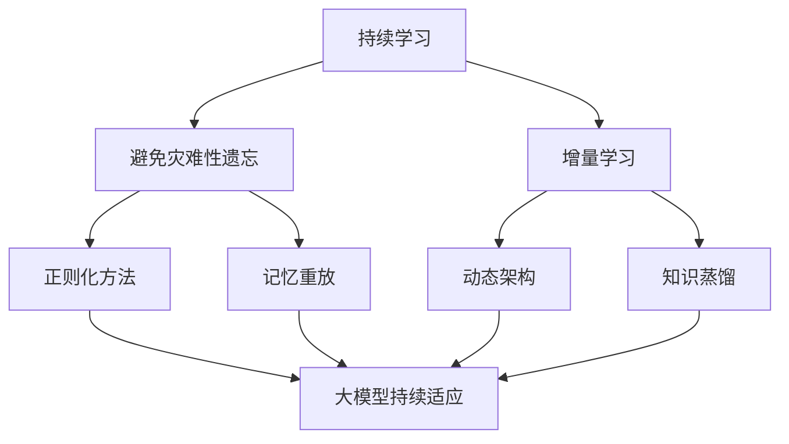
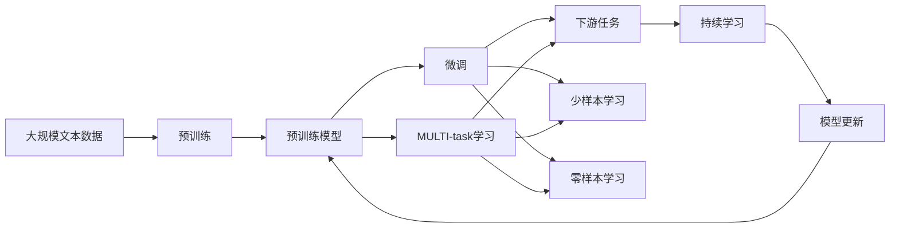

                 

# 迁移学习 (Transfer Learning) 原理与代码实例讲解

> 关键词：迁移学习, 微调 (Fine-tuning), 预训练 (Pre-training), 无监督学习 (Unsupervised Learning), 多任务学习 (Multi-task Learning), 参数高效微调 (Parameter-Efficient Fine-tuning, PEFT), 少样本学习 (Few-shot Learning)

## 1. 背景介绍

### 1.1 问题由来
迁移学习（Transfer Learning）是机器学习领域的一个重要概念，旨在将在一个任务上学习到的知识迁移到另一个相关任务上，以减少新任务所需的学习时间、数据量，提高模型的泛化能力。迁移学习的思想由来已久，但在深度学习时代，随着大规模预训练模型的出现，迁移学习成为一种强大的范式，推动了自然语言处理（NLP）、计算机视觉（CV）、语音识别等领域的快速发展。

近年来，诸如BERT、GPT等预训练大模型在众多任务上取得了优异表现，但这些模型通常在巨量无标签数据上预训练，学习到广泛的语言知识，对下游特定任务的效果仍有提升空间。迁移学习通过在预训练模型基础上进行微调，可以显著提升模型在下游任务上的性能，同时减少从头训练所需的成本和数据量。

### 1.2 问题核心关键点
迁移学习的主要核心在于：
- 预训练和微调：利用大规模无标签数据对模型进行预训练，然后在下游任务上对模型进行微调，以适应新任务。
- 无监督学习和有监督学习：预训练通常使用无监督学习技术，如自回归、自编码等，而微调则使用有监督学习，使用下游任务的标注数据。
- 多任务学习：通过联合训练多个相关任务，共享模型参数，提升模型的泛化能力和效率。
- 参数高效微调：在微调过程中只更新少量模型参数，以减少计算资源消耗。
- 少样本学习：在仅少量标注数据的情况下，利用模型泛化能力进行任务适配。

迁移学习在工业界的成功应用实例包括谷歌的BERT、微软的T5、OpenAI的GPT等模型，这些模型在多语言翻译、文本摘要、问答系统等任务上表现优异，证明了大规模预训练模型结合迁移学习的方法具有巨大的潜力。

### 1.3 问题研究意义
研究迁移学习对于推动人工智能技术的落地应用具有重要意义：

1. **减少从头训练成本**：在许多NLP任务中，从头训练一个大模型需要的数据量和计算资源都很大，利用迁移学习可以大幅降低这些成本。
2. **提升模型泛化能力**：预训练模型通过学习大规模数据，具备较强的泛化能力，能够在不同的数据分布上表现良好。
3. **加速任务适配**：通过微调，可以在短时间内使模型适应新的任务和数据，加速新任务的开发周期。
4. **促进跨领域知识迁移**：迁移学习有助于知识在不同领域之间的迁移，提升模型在不同场景下的表现。
5. **推动技术创新**：迁移学习催生了多种技术创新，如少样本学习、零样本学习、自监督学习等，推动了机器学习技术的发展。

## 2. 核心概念与联系

### 2.1 核心概念概述

为更好地理解迁移学习，本节将介绍几个密切相关的核心概念：

- **预训练（Pre-training）**：指在大规模无标签数据上，通过自监督学习任务训练通用语言模型的过程。常见的预训练任务包括自回归、自编码、掩码语言模型等。预训练使得模型学习到广泛的语言表示。

- **微调（Fine-tuning）**：指在预训练模型的基础上，使用下游任务的少量标注数据，通过有监督学习优化模型在该任务上的性能。微调通常只调整模型的一部分参数，以减少计算资源消耗。

- **多任务学习（Multi-task Learning）**：指在多个相关任务上联合训练模型，共享模型参数，提升模型的泛化能力和效率。

- **参数高效微调（Parameter-Efficient Fine-tuning, PEFT）**：指在微调过程中只更新少量模型参数，而固定大部分预训练权重不变，以提高微调效率，避免过拟合。

- **少样本学习（Few-shot Learning）**：指在仅少量标注数据的情况下，利用模型泛化能力进行任务适配，即利用已学知识进行新的任务推断。

- **零样本学习（Zero-shot Learning）**：指模型在没有见过任何特定任务的训练样本的情况下，仅凭任务描述就能够执行新任务。

- **多模态迁移学习（Multi-modal Transfer Learning）**：指将知识从一种模态迁移到另一种模态，如从文本迁移到图像或语音，提升跨模态任务的性能。

这些核心概念之间的逻辑关系可以通过以下Mermaid流程图来展示：



这个流程图展示了大规模预训练模型与微调、多任务学习、参数高效微调、少样本学习、零样本学习之间的关系。

### 2.2 概念间的关系

这些核心概念之间存在着紧密的联系，形成了迁移学习的完整生态系统。下面我们通过几个Mermaid流程图来展示这些概念之间的关系。

#### 2.2.1 预训练与微调的关系



这个流程图展示了预训练和微调的基本关系：预训练模型在无标签数据上学习通用的语言表示，然后在下游任务上进行微调，优化特定任务的表现。

#### 2.2.2 多任务学习与微调的关系


这个流程图展示了多任务学习与微调的关系：多任务学习通过联合训练多个相关任务，共享模型参数，提升模型的泛化能力和效率，然后对每个任务分别进行微调，优化其在特定任务上的性能。

#### 2.2.3 参数高效微调方法



这个流程图展示了几种常见的参数高效微调方法，包括适配器微调、提示微调、LoRA和BitFit。这些方法的共同特点是冻结大部分预训练参数，只更新少量参数，从而提高微调效率。

#### 2.2.4 持续学习在大模型中的应用



这个流程图展示了持续学习在大模型中的应用。持续学习的主要目标是避免灾难性遗忘和实现增量学习。通过正则化方法、记忆重放、动态架构和知识蒸馏等技术，可以使大模型持续适应新的任务和数据。

### 2.3 核心概念的整体架构

最后，我们用一个综合的流程图来展示这些核心概念在大模型迁移学习过程中的整体架构：



这个综合流程图展示了从预训练到微调，再到持续学习的完整过程。大模型首先在大规模文本数据上进行预训练，然后通过多任务学习、微调等技术对模型进行优化，最后通过持续学习技术，模型可以不断更新和适应新的任务和数据。 通过这些流程图，我们可以更清晰地理解迁移学习过程中各个核心概念的关系和作用，为后续深入讨论具体的迁移学习方法和技术奠定基础。

## 3. 核心算法原理 & 具体操作步骤
### 3.1 算法原理概述

迁移学习的核心思想是将在一个任务上学习到的知识迁移到另一个相关任务上。其核心算法基于深度神经网络，分为预训练和微调两个阶段：

1. **预训练**：在大规模无标签数据上，使用自监督学习任务训练通用语言模型。常见的预训练任务包括自回归、自编码、掩码语言模型等。预训练模型通过学习语言的基本结构、语义关系等，能够泛化到多种下游任务中。

2. **微调**：在预训练模型的基础上，使用下游任务的少量标注数据，通过有监督学习优化模型在该任务上的性能。微调通常只调整模型的一部分参数，以减少计算资源消耗。

### 3.2 算法步骤详解

迁移学习的一般流程包括以下几个关键步骤：

**Step 1: 准备预训练模型和数据集**
- 选择合适的预训练语言模型作为初始化参数，如BERT、GPT等。
- 准备下游任务的数据集，划分为训练集、验证集和测试集。

**Step 2: 设计任务适配层**
- 根据任务类型，在预训练模型顶层设计合适的输出层和损失函数。
- 对于分类任务，通常在顶层添加线性分类器和交叉熵损失函数。
- 对于生成任务，通常使用语言模型的解码器输出概率分布，并以负对数似然为损失函数。

**Step 3: 设置微调超参数**
- 选择合适的优化算法及其参数，如AdamW、SGD等，设置学习率、批大小、迭代轮数等。
- 设置正则化技术及强度，包括权重衰减、Dropout、Early Stopping等。
- 确定冻结预训练参数的策略，如仅微调顶层，或全部参数都参与微调。

**Step 4: 执行梯度训练**
- 将训练集数据分批次输入模型，前向传播计算损失函数。
- 反向传播计算参数梯度，根据设定的优化算法和学习率更新模型参数。
- 周期性在验证集上评估模型性能，根据性能指标决定是否触发Early Stopping。
- 重复上述步骤直到满足预设的迭代轮数或Early Stopping条件。

**Step 5: 测试和部署**
- 在测试集上评估微调后模型在特定任务上的性能，对比微调前后的精度提升。
- 使用微调后的模型对新样本进行推理预测，集成到实际的应用系统中。
- 持续收集新的数据，定期重新微调模型，以适应数据分布的变化。

以上是迁移学习的一般流程。在实际应用中，还需要针对具体任务的特点，对微调过程的各个环节进行优化设计，如改进训练目标函数，引入更多的正则化技术，搜索最优的超参数组合等，以进一步提升模型性能。

### 3.3 算法优缺点

迁移学习具有以下优点：

- **高效**：利用预训练模型的知识，显著减少从头训练所需的计算资源和数据量。
- **泛化能力强**：预训练模型通过学习大规模数据，具备较强的泛化能力，能够在不同的数据分布上表现良好。
- **适应性强**：通过微调，模型可以适应新的任务和数据，加速任务适配。
- **可解释性**：通过分析预训练模型的特征提取能力，可以为下游任务提供更清晰的可解释性。

同时，迁移学习也存在一些缺点：

- **依赖标注数据**：微调依赖下游任务的少量标注数据，标注数据的获取成本较高。
- **迁移能力有限**：当预训练模型和下游任务之间的差距较大时，迁移效果可能不明显。
- **模型偏差**：预训练模型的固有偏见、有害信息等，可能通过微调传递到下游任务，造成负面影响。
- **可解释性不足**：微调模型的决策过程通常缺乏可解释性，难以对其推理逻辑进行分析和调试。

尽管存在这些缺点，但就目前而言，迁移学习已成为大语言模型应用的重要方法。未来相关研究的重点在于如何进一步降低对标注数据的依赖，提高模型的泛化能力，同时兼顾可解释性和伦理安全性等因素。

### 3.4 算法应用领域

迁移学习在大规模预训练语言模型的基础上，广泛应用于各种NLP任务，包括但不限于：

- 文本分类：如情感分析、主题分类、意图识别等。
- 命名实体识别：识别文本中的人名、地名、机构名等特定实体。
- 关系抽取：从文本中抽取实体之间的语义关系。
- 问答系统：对自然语言问题给出答案。
- 机器翻译：将源语言文本翻译成目标语言。
- 文本摘要：将长文本压缩成简短摘要。
- 对话系统：使机器能够与人自然对话。

除了上述这些经典任务外，迁移学习还被创新性地应用到更多场景中，如可控文本生成、常识推理、代码生成、数据增强等，为NLP技术带来了全新的突破。随着预训练模型和迁移学习方法的不断进步，相信NLP技术将在更广阔的应用领域大放异彩。

## 4. 数学模型和公式 & 详细讲解 & 举例说明

### 4.1 数学模型构建

本节将使用数学语言对迁移学习过程进行更加严格的刻画。

记预训练语言模型为 $M_{\theta}$，其中 $\theta$ 为预训练得到的模型参数。假设微调任务的训练集为 $D=\{(x_i,y_i)\}_{i=1}^N, x_i \in \mathcal{X}, y_i \in \mathcal{Y}$。

定义模型 $M_{\theta}$ 在数据样本 $(x,y)$ 上的损失函数为 $\ell(M_{\theta}(x),y)$，则在数据集 $D$ 上的经验风险为：

$$
\mathcal{L}(\theta) = \frac{1}{N} \sum_{i=1}^N \ell(M_{\theta}(x_i),y_i)
$$

微调的优化目标是最小化经验风险，即找到最优参数：

$$
\theta^* = \mathop{\arg\min}_{\theta} \mathcal{L}(\theta)
$$

在实践中，我们通常使用基于梯度的优化算法（如AdamW、SGD等）来近似求解上述最优化问题。设 $\eta$ 为学习率，$\lambda$ 为正则化系数，则参数的更新公式为：

$$
\theta \leftarrow \theta - \eta \nabla_{\theta}\mathcal{L}(\theta) - \eta\lambda\theta
$$

其中 $\nabla_{\theta}\mathcal{L}(\theta)$ 为损失函数对参数 $\theta$ 的梯度，可通过反向传播算法高效计算。

### 4.2 公式推导过程

以下我们以二分类任务为例，推导交叉熵损失函数及其梯度的计算公式。

假设模型 $M_{\theta}$ 在输入 $x$ 上的输出为 $\hat{y}=M_{\theta}(x) \in [0,1]$，表示样本属于正类的概率。真实标签 $y \in \{0,1\}$。则二分类交叉熵损失函数定义为：

$$
\ell(M_{\theta}(x),y) = -[y\log \hat{y} + (1-y)\log (1-\hat{y})]
$$

将其代入经验风险公式，得：

$$
\mathcal{L}(\theta) = -\frac{1}{N}\sum_{i=1}^N [y_i\log M_{\theta}(x_i)+(1-y_i)\log(1-M_{\theta}(x_i))]
$$

根据链式法则，损失函数对参数 $\theta_k$ 的梯度为：

$$
\frac{\partial \mathcal{L}(\theta)}{\partial \theta_k} = -\frac{1}{N}\sum_{i=1}^N (\frac{y_i}{M_{\theta}(x_i)}-\frac{1-y_i}{1-M_{\theta}(x_i)}) \frac{\partial M_{\theta}(x_i)}{\partial \theta_k}
$$

其中 $\frac{\partial M_{\theta}(x_i)}{\partial \theta_k}$ 可进一步递归展开，利用自动微分技术完成计算。

在得到损失函数的梯度后，即可带入参数更新公式，完成模型的迭代优化。重复上述过程直至收敛，最终得到适应下游任务的最优模型参数 $\theta^*$。

### 4.3 案例分析与讲解

**案例一：文本分类**
假设我们有一份文本分类任务的数据集，包含一些电影评论的文本和相应的情感标签（如正面、负面）。我们使用BERT作为预训练模型，在电影评论数据集上进行微调。

首先，我们将文本数据分批次输入BERT模型，输出每个单词在序列中的概率分布。然后，我们将这些概率分布作为模型输出，使用交叉熵损失函数进行计算。对于每个评论，我们将其与标签拼接在一起，得到整体损失。最后，我们使用梯度下降算法，最小化整体损失函数，更新BERT模型的参数。

在实际应用中，我们还需要设计合适的训练集划分、优化器、学习率等超参数，并进行验证集的性能评估，避免过拟合。

**案例二：命名实体识别**
命名实体识别任务的目标是从文本中识别出人名、地名、机构名等实体。我们使用BERT作为预训练模型，在标注的NER数据集上进行微调。

具体步骤如下：
1. 将文本数据分批次输入BERT模型，输出每个单词在序列中的概率分布。
2. 对每个单词的概率分布进行后处理，得到每个实体的位置信息。
3. 使用IoU（Intersection over Union）作为损失函数，计算模型输出与真实标签的相似度。
4. 使用梯度下降算法，最小化IoU损失，更新BERT模型的参数。

在实际应用中，我们还需要设计合适的实体标签编码方式、损失函数等超参数，并进行验证集的性能评估，避免过拟合。

## 5. 项目实践：代码实例和详细解释说明

### 5.1 开发环境搭建

在进行迁移学习实践前，我们需要准备好开发环境。以下是使用Python进行PyTorch开发的环境配置流程：

1. 安装Anaconda：从官网下载并安装Anaconda，用于创建独立的Python环境。

2. 创建并激活虚拟环境：
```bash
conda create -n pytorch-env python=3.8 
conda activate pytorch-env
```

3. 安装PyTorch：根据CUDA版本，从官网获取对应的安装命令。例如：
```bash
conda install pytorch torchvision torchaudio cudatoolkit=11.1 -c pytorch -c conda-forge
```

4. 安装Transformers库：
```bash
pip install transformers
```

5. 安装各类工具包：
```bash
pip install numpy pandas scikit-learn matplotlib tqdm jupyter notebook ipython
```

完成上述步骤后，即可在`pytorch-env`环境中开始迁移学习实践。

### 5.2 源代码详细实现

这里我们以文本分类任务为例，给出使用Transformers库对BERT模型进行迁移学习的PyTorch代码实现。

首先，定义文本分类任务的数据处理函数：

```python
from transformers import BertTokenizer
from torch.utils.data import Dataset
import torch

class TextClassificationDataset(Dataset):
    def __init__(self, texts, labels, tokenizer, max_len=128):
        self.texts = texts
        self.labels = labels
        self.tokenizer = tokenizer
        self.max_len = max_len
        
    def __len__(self):
        return len(self.texts)
    
    def __getitem__(self, item):
        text = self.texts[item]
        label = self.labels[item]
        
        encoding = self.tokenizer(text, return_tensors='pt', max_length=self.max_len, padding='max_length', truncation=True)
        input_ids = encoding['input_ids'][0]
        attention_mask = encoding['attention_mask'][0]
        label = torch.tensor(label, dtype=torch.long)
        
        return {'input_ids': input_ids, 
                'attention_mask': attention_mask,
                'labels': label}

# 标签与id的映射
tag2id = {'negative': 0, 'positive': 1}
id2tag = {v: k for k, v in tag2id.items()}

# 创建dataset
tokenizer = BertTokenizer.from_pretrained('bert-base-cased')

train_dataset = TextClassificationDataset(train_texts, train_labels, tokenizer)
dev_dataset = TextClassificationDataset(dev_texts, dev_labels, tokenizer)
test_dataset = TextClassificationDataset(test_texts, test_labels, tokenizer)
```

然后，定义模型和优化器：

```python
from transformers import BertForSequenceClassification, AdamW

model = BertForSequenceClassification.from_pretrained('bert-base-cased', num_labels=len(tag2id))

optimizer = AdamW(model.parameters(), lr=2e-5)
```

接着，定义训练和评估函数：

```python
from torch.utils.data import DataLoader
from tqdm import tqdm
from sklearn.metrics import classification_report

device = torch.device('cuda') if torch.cuda.is_available() else torch.device('cpu')
model.to(device)

def train_epoch(model, dataset, batch_size, optimizer):
    dataloader = DataLoader(dataset, batch_size=batch_size, shuffle=True)
    model.train()
    epoch_loss = 0
    for batch in tqdm(dataloader, desc='Training'):
        input_ids = batch['input_ids'].to(device)
        attention_mask = batch['attention_mask'].to(device)
        labels = batch['labels'].to(device)
        model.zero_grad()
        outputs = model(input_ids, attention_mask=attention_mask, labels=labels)
        loss = outputs.loss
        epoch_loss += loss.item()
        loss.backward()
        optimizer.step()
    return epoch_loss / len(dataloader)

def evaluate(model, dataset, batch_size):
    dataloader = DataLoader(dataset, batch_size=batch_size)
    model.eval()
    preds, labels = [], []
    with torch.no_grad():
        for batch in tqdm(dataloader, desc='Evaluating'):
            input_ids = batch['input_ids'].to(device)
            attention_mask = batch['attention_mask'].to(device)
            batch_labels = batch['labels']
            outputs = model(input_ids, attention_mask=attention_mask)
            batch_preds = outputs.logits.argmax(dim=2).to('cpu').tolist()
            batch_labels = batch_labels.to('cpu').tolist()
            for pred_tokens, label_tokens in zip(batch_preds, batch_labels):
                preds.append(pred_tokens[:len(label_tokens)])
                labels.append(label_tokens)
                
    print(classification_report(labels, preds))
```

最后，启动训练流程并在测试集上评估：

```python
epochs = 5
batch_size = 16

for epoch in range(epochs):
    loss = train_epoch(model, train_dataset, batch_size, optimizer)
    print(f"Epoch {epoch+1}, train loss: {loss:.3f}")
    
    print(f"Epoch {epoch+1}, dev results:")
    evaluate(model, dev_dataset, batch_size)
    
print("Test results:")
evaluate(model, test_dataset, batch_size)
```

以上就是使用PyTorch对BERT进行文本分类任务迁移学习的完整代码实现。可以看到，得益于Transformers库的强大封装，我们可以用相对简洁的代码完成BERT模型的迁移学习。

### 5.3 代码解读与分析

让我们再详细解读一下关键代码的实现细节：

**TextClassificationDataset类**：
- `__init__`方法：初始化文本、标签、分词器等关键组件。
- `__len__`方法：返回数据集的样本数量。
- `__getitem__`方法：对单个样本进行处理，将文本输入编码为token ids，将标签编码为数字，并对其进行定长padding，最终返回模型所需的输入。

**tag2id和id2tag字典**：
- 定义了标签与数字id之间的映射关系，用于将token-wise的预测结果解码回真实的标签。

**训练和评估函数**：
- 使用PyTorch的DataLoader对数据集进行批次化加载，供模型训练和推理使用。
- 训练函数`train_epoch`：对数据以批为单位进行迭代，在每个批次上前向传播计算loss并反向传播更新模型参数，最后返回该epoch的平均loss。
- 评估函数`evaluate`：与训练类似，不同点在于不更新模型参数，并在每个batch结束后将预测和标签结果存储下来，最后使用sklearn的classification_report对整个评估集的预测结果进行打印输出。

**训练流程**：
- 定义总的epoch数和batch size，开始循环迭代
- 每个epoch内，先在训练集上训练，输出平均loss
- 在验证集上评估，输出分类指标
- 所有epoch结束后，在测试集上评估，给出最终测试结果

可以看到，PyTorch配合Transformers库使得BERT迁移学习的代码实现变得简洁高效。开发者可以将更多精力放在数据处理、模型改进等高层逻辑上，而不必过多关注底层的实现细节。

当然，工业级的系统实现还需考虑更多因素，如模型的保存和部署、超参数的自动搜索、更灵活的任务适配层等。但核心的迁移学习范式基本与此类似。

### 5.4 运行结果展示

假设我们在Co

