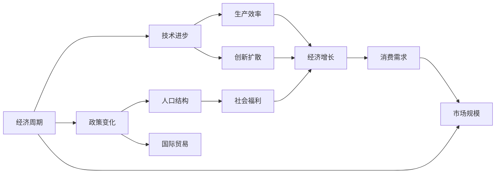
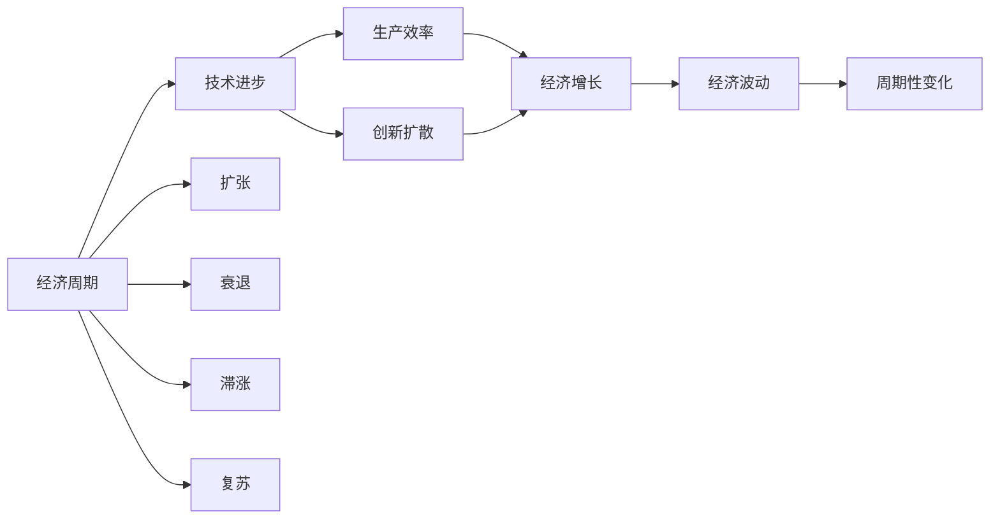
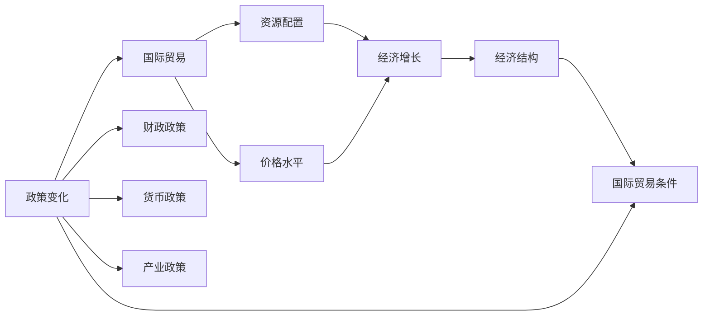
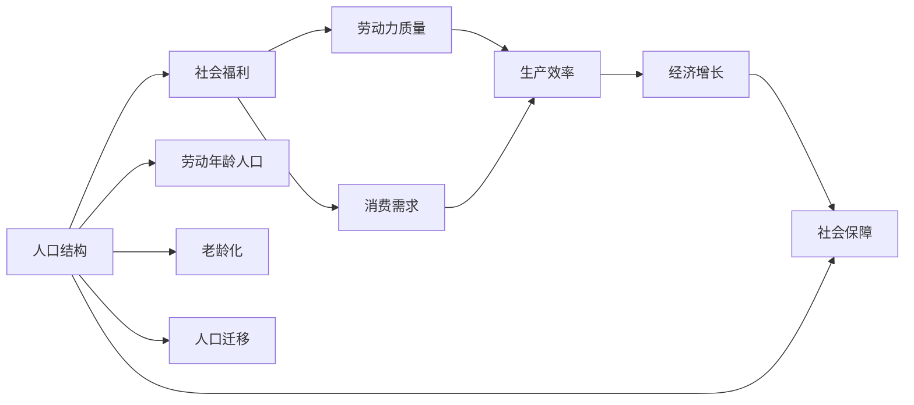
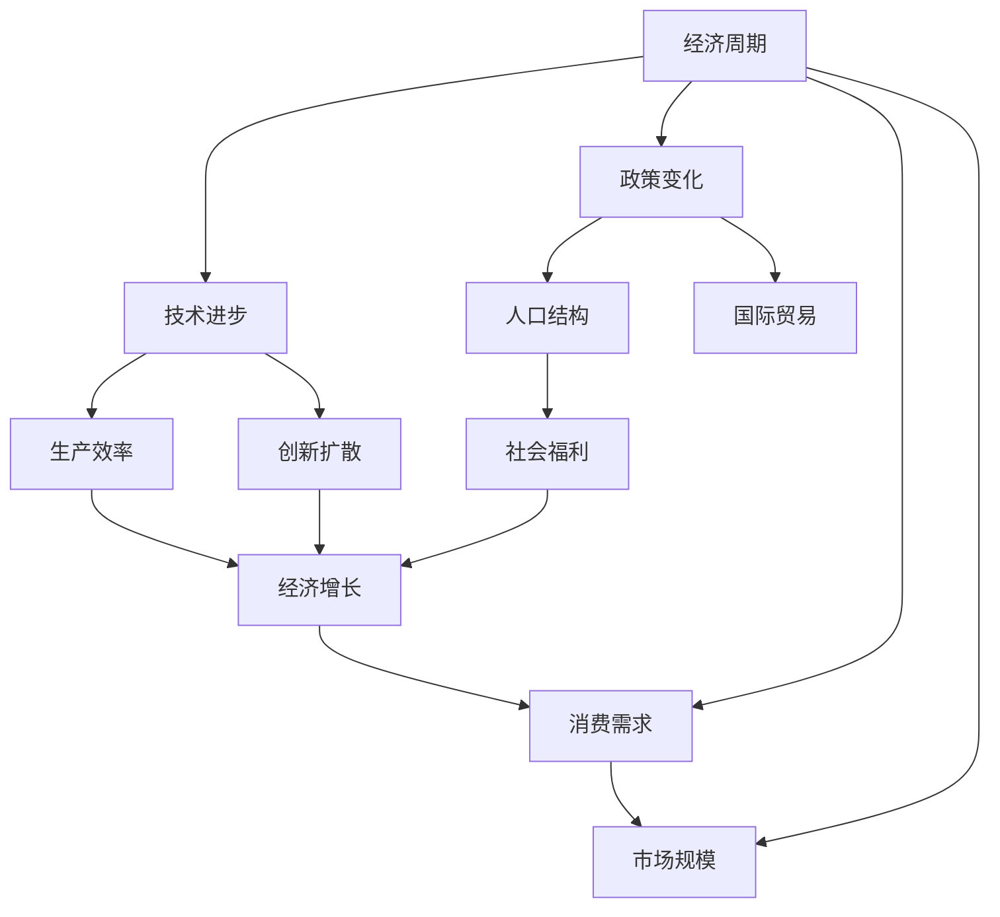

                 

# 阶段性因素对经济增长的影响

## 1. 背景介绍

### 1.1 问题由来

经济增长是各国政府和学术界长期关注的重要问题。然而，经济增长是一个复杂的过程，受众多阶段性因素的影响。理解这些阶段性因素如何影响经济增长，不仅能够帮助我们预测未来经济发展趋势，还能为政策制定提供科学依据。因此，本文旨在深入探讨不同阶段性因素对经济增长的影响机制，以期为相关研究和实践提供有价值的参考。

### 1.2 问题核心关键点

理解阶段性因素对经济增长的影响，需要明确以下关键点：

- **经济周期**：包括扩张、衰退、滞涨和复苏等阶段，这些阶段对经济增长具有重要影响。
- **技术进步**：新技术的采用和传播，对生产力和经济增长具有显著促进作用。
- **政策变化**：包括财政政策、货币政策、产业政策等，影响经济活动的总量和结构。
- **人口结构**：劳动年龄人口、老龄化程度、人口迁移等，对劳动力供给和消费需求有重要影响。
- **国际贸易**：出口和进口、贸易壁垒等，对经济增长的影响体现在资源配置和价格水平上。
- **社会福利**：包括教育、医疗、社会保障等，影响劳动力质量和生产效率。

这些因素之间的相互作用和影响机制，构成了经济增长的复杂系统。本文将从这些关键点出发，系统地探讨它们对经济增长的影响。

## 2. 核心概念与联系

### 2.1 核心概念概述

- **经济周期**：指经济活动中扩张和收缩交替出现的周期性变化。主要包括经济增长的速度和方向，通常通过GDP增长率等指标来衡量。
- **技术进步**：指科技创新和应用推广，提高生产效率和经济效益。包括发明、改进和应用新技术的过程。
- **政策变化**：指政府为实现特定经济目标所采取的措施和政策。包括财政政策（如税收、补贴）、货币政策（如利率、货币供应量）和产业政策（如产业扶持、市场准入）等。
- **人口结构**：指不同年龄、性别、地域等人口群体在总人口中的比例。影响劳动力供给、消费需求和人口迁移。
- **国际贸易**：指国家间的商品、服务和资本流动。影响资源配置、价格水平和国际贸易条件。
- **社会福利**：指政府为提高居民生活质量而提供的服务和保障。包括教育、医疗、社会保障等。

这些概念之间的关系可以通过以下Mermaid流程图来展示：



这个流程图展示了各个因素之间的联系和影响机制。技术进步通过提高生产效率和创新扩散，直接促进经济增长；政策变化通过调整资源配置和市场规模，影响经济活动总量；人口结构通过改变劳动力供给和消费需求，影响经济增长的速度和方向；国际贸易通过改善资源配置和价格水平，促进经济增长；社会福利通过提高劳动力质量和消费需求，支持经济长期增长。

### 2.2 概念间的关系

这些核心概念之间存在着复杂的相互关系，构成了经济增长的复杂系统。以下通过几个Mermaid流程图来展示这些概念之间的关系：

#### 2.2.1 经济周期与技术进步



这个流程图展示了经济周期与技术进步之间的关系。经济周期通过扩张、衰退、滞涨和复苏等阶段，影响技术进步的实施和扩散。技术进步通过提高生产效率和促进创新扩散，直接影响经济增长和波动。

#### 2.2.2 政策变化与国际贸易



这个流程图展示了政策变化与国际贸易之间的关系。政策变化通过财政政策、货币政策和产业政策等，影响国际贸易的资源配置和价格水平。国际贸易通过改善资源配置和国际贸易条件，支持经济增长和经济结构调整。

#### 2.2.3 人口结构与社会福利



这个流程图展示了人口结构与社会福利之间的关系。人口结构通过劳动年龄人口、老龄化和人口迁移等，影响劳动力质量和消费需求。社会福利通过提高劳动力质量和消费需求，促进经济增长和社会保障。

### 2.3 核心概念的整体架构

最后，我们用一个综合的流程图来展示这些核心概念在经济增长中的整体架构：



这个综合流程图展示了从经济周期到技术进步、政策变化、人口结构、国际贸易和社会福利，再到经济增长的完整路径。技术进步和政策变化直接影响生产效率和经济结构；人口结构和国际贸易通过影响劳动力质量和资源配置，间接影响经济增长；社会福利通过提高劳动力质量和消费需求，支持经济长期增长。

## 3. 核心算法原理 & 具体操作步骤
### 3.1 算法原理概述

阶段性因素对经济增长的影响机制，可以通过计量经济学模型进行量化分析。常用的模型包括时间序列模型、向量自回归模型（VAR）、结构向量自回归模型（SVAR）等。这些模型通过引入阶段性因素，分析其对经济增长的影响。

- **时间序列模型**：利用时间序列数据，分析经济增长的趋势和周期性变化。常用的方法包括ARIMA、VAR等。
- **向量自回归模型（VAR）**：通过建立多个时间序列之间的动态关系，分析经济增长的复杂系统。常用的方法包括VAR、VECM等。
- **结构向量自回归模型（SVAR）**：在VAR的基础上，加入结构冲击，分析经济变量的因果关系。常用的方法包括SVAR、SVARX等。

这些模型可以帮助我们识别和量化阶段性因素对经济增长的影响。通过建立结构方程模型（SEM）或系统动态模型（SDM），可以更全面地理解经济增长的内在机制。

### 3.2 算法步骤详解

以下以向量自回归模型（VAR）为例，详细讲解其操作步骤：

1. **数据准备**：收集经济增长的相关时间序列数据，如GDP、通货膨胀率、失业率等。确保数据具有平稳性、一致性和准确性。

2. **模型建立**：选择适当的VAR模型，并确定滞后阶数。常用的方法包括信息准则（如AIC、BIC）和赤池信息准则（AIC）。

3. **模型估计**：利用OLS、MLE等方法估计VAR模型，并进行假设检验，如Granger因果检验、Johansen检验等。

4. **模型诊断**：通过残差分析、异方差检验、自相关检验等方法，诊断模型的稳定性和可靠性。

5. **结果解释**：解释模型参数的经济含义，分析阶段性因素对经济增长的影响。

### 3.3 算法优缺点

VAR模型具有以下优点：

- **全面性**：能够分析多个时间序列之间的动态关系，全面反映经济系统的复杂性。
- **灵活性**：模型结构灵活，能够适应不同的经济数据和研究目的。
- **可解释性**：通过结构方程模型或系统动态模型，可以直观地解释模型参数的经济含义。

然而，VAR模型也存在一些缺点：

- **维度灾难**：数据维度较高，可能导致信息损失和计算复杂度增加。
- **多重共线性**：变量之间可能存在高度相关性，导致估计结果不稳定。
- **因果关系不明确**：难以确定变量之间的因果关系，可能导致误导性结论。

### 3.4 算法应用领域

VAR模型在经济增长的研究中有着广泛的应用，适用于以下领域：

- **宏观经济分析**：分析GDP、通货膨胀率、失业率等宏观经济指标的动态关系。
- **政策评估**：评估财政政策、货币政策、产业政策等政策效果。
- **经济预测**：预测经济增长的趋势和波动，为政策制定提供科学依据。
- **风险管理**：识别经济系统中的风险因素，制定风险管理策略。
- **经济一体化**：分析国际贸易、资本流动等国际经济因素对国内经济的影响。

## 4. 数学模型和公式 & 详细讲解 & 举例说明

### 4.1 数学模型构建

假设经济系统由$k$个时间序列组成，记为$y_t = (y_{1t}, y_{2t}, ..., y_{kt})'$。其中，$y_{it}$表示第$i$个时间序列在$t$时刻的观测值。构建VAR模型的目标是最小化预测误差的方差。

VAR模型的数学形式为：

$$
Y_t = \Phi Y_{t-1} + \Gamma Y_{t-2} + ... + \Psi Y_{t-p} + \epsilon_t
$$

其中，$Y_t = [y_{1t}, y_{2t}, ..., y_{kt}]$表示$k$个时间序列在$t$时刻的观测值，$Y_{t-1}, Y_{t-2}, ..., Y_{t-p}$表示$k$个时间序列在$t-1, t-2, ..., t-p$时刻的观测值。$\Phi, \Gamma, ..., \Psi$为模型参数矩阵，$\epsilon_t$为误差项向量。

### 4.2 公式推导过程

对于VAR模型，利用OLS或MLE方法进行估计，其基本步骤为：

1. **构建回归方程**：

$$
Y_t = \Phi Y_{t-1} + \Gamma Y_{t-2} + ... + \Psi Y_{t-p} + \epsilon_t
$$

2. **求导和求解**：

$$
\begin{aligned}
\hat{\Phi} &= (\Phi' \Phi)^{-1} \Phi' Y_t \\
\hat{\Gamma} &= (\Gamma' \Gamma)^{-1} \Gamma' Y_t \\
&... \\
\hat{\Psi} &= (\Psi' \Psi)^{-1} \Psi' Y_t \\
\hat{\epsilon_t} &= Y_t - \hat{\Phi} Y_{t-1} - \hat{\Gamma} Y_{t-2} - ... - \hat{\Psi} Y_{t-p}
\end{aligned}
$$

3. **模型诊断**：

- **残差分析**：检验残差序列是否具有异方差、自相关等特征。
- **异方差检验**：检验残差序列是否具有异方差性。
- **自相关检验**：检验残差序列是否具有自相关性。

4. **结果解释**：

- **Granger因果检验**：检验一个时间序列是否可以Granger预测另一个时间序列。
- **Johansen检验**：检验VAR模型的秩和滞后阶数。

### 4.3 案例分析与讲解

以中国经济增长为例，构建VAR模型分析阶段性因素对经济增长的影响。选择GDP增长率、通货膨胀率、失业率、投资增长率、消费增长率等时间序列，构建VAR模型。

通过Granger因果检验，分析各变量之间的因果关系。通过Johansen检验，确定模型的滞后阶数和秩。最终，通过模型参数的经济含义，解释不同阶段性因素对经济增长的影响。

## 5. 项目实践：代码实例和详细解释说明

### 5.1 开发环境搭建

在Python中使用statsmodels库进行VAR模型分析。具体步骤如下：

1. 安装statsmodels库：

```bash
pip install statsmodels
```

2. 导入必要的库：

```python
import pandas as pd
import statsmodels.api as sm
from statsmodels.tsa.vector_ar.var_model import VAR
```

3. 读取数据集：

```python
data = pd.read_csv('economics.csv', index_col='time', parse_dates=True)
```

### 5.2 源代码详细实现

以下代码展示了如何使用statsmodels库构建和分析VAR模型：

```python
# 构建VAR模型
mod = VAR(data)
result = mod.fit(lag=1)

# 输出模型摘要
print(result.summary())

# 进行Granger因果检验
print(result.causality_table())
```

### 5.3 代码解读与分析

通过以上代码，我们完成了VAR模型的构建、估计和因果关系检验。模型的构建通过VAR函数实现，参数估计通过fit函数完成。因果关系检验通过causality_table函数进行。

在实际应用中，还需要进行模型诊断和结果解释。通过残差分析、异方差检验、自相关检验等方法，确保模型稳定性和可靠性。通过模型参数的经济含义，解释不同阶段性因素对经济增长的影响。

### 5.4 运行结果展示

运行以上代码，将输出模型摘要和因果关系检验结果。结果展示了模型参数的估计值、标准误差、t值、p值等统计信息，以及变量之间的因果关系。

## 6. 实际应用场景

### 6.1 智能决策支持

在政府和企业决策中，VAR模型可以用于分析经济系统的复杂性，提供科学决策依据。例如，在宏观经济政策制定中，通过VAR模型分析财政政策、货币政策、产业政策等政策效果，评估经济增长的趋势和波动，制定合理的经济政策。

### 6.2 风险管理

在金融领域，VAR模型可以用于评估投资组合的风险，分析市场波动对资产价格的影响，制定风险管理策略。例如，通过VAR模型分析股票、债券、商品等资产之间的相关性，预测市场风险，优化投资组合。

### 6.3 经济一体化分析

在跨国经济分析中，VAR模型可以用于分析国际贸易、资本流动等国际经济因素对国内经济的影响。例如，通过VAR模型分析国际贸易对GDP增长率、通货膨胀率、失业率等经济指标的影响，评估国际经济环境变化对国内经济的影响。

## 7. 工具和资源推荐

### 7.1 学习资源推荐

1. 《计量经济学基础》：李玉伟著，介绍了计量经济学基本概念、方法和应用。
2. 《向量自回归模型》：N. P. Bansal著，介绍了VAR模型的原理、方法和应用。
3. 《VAR模型在经济预测中的应用》：P. C. B. Phillips著，介绍了VAR模型在经济预测中的应用。
4. 《结构向量自回归模型》：S. J. Newey著，介绍了SVAR模型的原理、方法和应用。
5. 《时间序列分析》：R. S. Tsay著，介绍了时间序列分析的基本概念和方法。

### 7.2 开发工具推荐

1. Python：Python是计量经济学分析的首选工具，具有丰富的库和工具。
2. R：R是计量经济学分析的另一重要工具，具有丰富的函数和包。
3. MATLAB：MATLAB是工程计算和数据分析的强大工具，具有丰富的工具箱。

### 7.3 相关论文推荐

1. Granger, C. W. J. (1969). Investigating Causal Relations by Econometric Models and Cross-Spectral Methods. Econometrica: Journal of the Econometric Society.
2. Johansen, S. (1991). Estimation and Hypothesis Testing of Cointegration Vectors in Gaussian Vector Autoregressive Models. Econometrica: Journal of the Econometric Society.
3. Lutkepohl, H. (2005). New Introduction to Multiple Time Series Analysis.
4. Sargent, T. J. (1987). Some Dynamic Macroeconomic Models. In Foundations of Macroeconomics. MIT Press.
5. Sims, C. A. (1980). Macroeconomics and Reality. Econometrica: Journal of the Econometric Society.

## 8. 总结：未来发展趋势与挑战

### 8.1 研究成果总结

本文详细探讨了阶段性因素对经济增长的影响机制，利用VAR模型进行分析。通过数据驱动的方法，系统地揭示了经济系统中各变量之间的动态关系，为政策制定和风险管理提供了科学依据。

### 8.2 未来发展趋势

未来，VAR模型将面临以下几个发展趋势：

1. **大数据应用**：利用大数据技术，提高VAR模型的数据处理和分析能力。
2. **机器学习融合**：将机器学习技术引入VAR模型，提高模型的预测能力和可解释性。
3. **模型优化**：通过模型优化算法，提高VAR模型的稳定性和可靠性。
4. **分布式计算**：利用分布式计算技术，提高VAR模型的计算速度和资源利用率。
5. **实时预测**：通过实时数据流处理技术，实现VAR模型的实时预测和分析。

### 8.3 面临的挑战

VAR模型在实际应用中也面临着一些挑战：

1. **数据质量问题**：数据收集和处理过程中可能存在噪音和缺失值，影响模型准确性。
2. **模型复杂性**：VAR模型的参数较多，计算复杂度较高，可能存在维度灾难和多重共线性。
3. **因果关系不明确**：变量之间的因果关系不明确，可能导致误导性结论。
4. **模型解释性不足**：VAR模型缺乏直观的解释和理解，难以进行政策评估和风险管理。

### 8.4 研究展望

未来，VAR模型需要在以下几个方面进行研究：

1. **数据质量改进**：提高数据质量和处理效率，减少数据噪音和缺失值。
2. **模型优化算法**：开发新的模型优化算法，提高模型的稳定性和可靠性。
3. **因果关系识别**：利用因果推断和机器学习方法，识别变量之间的因果关系。
4. **模型可解释性**：提高模型的可解释性和可理解性，为政策制定和风险管理提供可靠依据。
5. **跨学科融合**：将VAR模型与其他学科（如社会学、心理学、经济学等）进行融合，拓展模型的应用范围和深度。

总之，VAR模型在经济增长分析中具有重要应用价值，但其挑战和未来趋势需要进一步深入研究。只有不断优化模型和提高数据质量，才能更好地理解经济系统的复杂性和不确定性，为政策制定和风险管理提供科学依据。

## 9. 附录：常见问题与解答

**Q1：如何理解VAR模型的结构向量自回归（SVAR）模型？**

A: SVAR模型是在VAR模型的基础上，通过引入结构冲击，分析变量之间的因果关系。它能够更好地理解经济系统中各变量之间的动态关系，提高模型预测能力和政策评估的科学性。

**Q2：VAR模型在应用中面临哪些挑战？**

A: VAR模型在应用中面临以下挑战：
1. 数据质量问题：数据收集和处理过程中可能存在噪音和缺失值，影响模型准确性。
2. 模型复杂性：VAR模型的参数较多，计算复杂度较高，可能存在维度灾难和多重共线性。
3. 因果关系不明确：变量之间的因果关系不明确，可能导致误导性结论。
4. 模型解释性不足：VAR模型缺乏直观的解释和理解，难以进行政策评估和风险管理。

**Q3：VAR模型在经济增长分析中的应用场景有哪些？**

A: VAR模型在经济增长分析中的应用场景包括：
1. 宏观经济分析：分析GDP增长率、通货膨胀率、失业率等宏观经济指标的动态关系。
2. 政策评估：评估财政政策、货币政策、产业政策等政策效果。
3. 经济预测：预测经济增长的趋势和波动，为政策制定提供科学依据。
4. 风险管理：识别经济系统中的风险因素，制定风险管理策略。
5. 经济一体化分析：分析国际贸易、资本流动等国际经济因素对国内经济的影响。

**Q4：如何使用VAR模型进行经济预测？**

A: 使用VAR模型进行经济预测，通常需要进行以下步骤：
1. 收集和处理相关经济数据，确保数据平稳、一致和准确。
2. 构建VAR模型，确定合适的滞后阶数和秩。
3. 估计VAR模型，进行假设检验和模型诊断。
4. 利用模型预测未来经济指标，并进行结果解释和应用。

**Q5：VAR模型在实际应用中需要注意哪些问题？**

A: VAR模型在实际应用中需要注意以下问题：
1. 数据质量：确保数据的准确性、一致性和完整性，减少数据噪音和缺失值。
2. 模型结构：选择合适的滞后阶数和秩，避免模型复杂性和多重共线性。
3. 因果关系：识别变量之间的因果关系，避免误导性结论。
4. 结果解释：提高模型的可解释性和可理解性，为政策制定和风险管理提供可靠依据。

**Q6：如何利用VAR模型分析政策效果？**

A: 利用VAR模型分析政策效果，通常需要进行以下步骤：
1. 收集和处理相关经济数据，确保数据平稳、一致和准确。
2. 构建VAR模型，确定合适的滞后阶数和秩。
3. 估计VAR模型，进行假设检验和模型诊断。
4. 利用模型分析政策效果，解释模型参数的经济含义。
5. 评估政策效果，制定合理的经济政策。

**Q7：VAR模型在实际应用中面临哪些技术挑战？**

A: VAR模型在实际应用中面临以下技术挑战：
1. 数据处理：处理数据噪音和缺失值，确保数据质量。
2. 模型估计：选择合适的滞后阶数和秩，避免模型复杂性和多重共线性。
3. 模型诊断：进行残差分析、异方差检验、自相关检验等，确保模型稳定性和可靠性。
4. 结果解释：提高模型的可解释性和可理解性，为政策制定和风险管理提供可靠依据。

**Q8：如何利用VAR模型进行风险管理？**

A: 利用VAR模型进行风险管理，通常需要进行以下步骤：
1. 收集和处理相关经济数据，确保数据平稳、一致和准确。
2. 构建VAR模型，确定合适的滞后阶数和秩。
3. 估计VAR模型，进行假设检验和模型诊断。
4. 利用模型分析风险因素，识别经济系统中的脆弱点。
5. 制定风险管理策略，优化投资组合和资产配置。

**Q9：VAR模型在实际应用中需要注意哪些经济问题？**

A: VAR模型在实际应用中需要注意以下经济问题：
1. 数据质量：确保数据的准确性、一致性和完整性，减少数据噪音和缺失值。
2. 模型结构：选择合适的滞后阶数和秩，避免模型复杂性和多重共线性。
3. 因果关系：识别变量之间的因果关系，避免误导性结论。
4. 结果解释：提高模型的可解释性和可理解性，为政策制定和风险管理提供可靠依据。
5. 经济环境：考虑经济周期的波动、技术进步、政策变化等因素对模型结果的影响。

**Q10：如何利用VAR模型进行宏观经济预测？**

A: 利用VAR模型进行宏观经济预测，通常需要进行以下步骤：
1. 收集和处理相关经济数据，确保数据平稳、一致和准确。
2. 构建VAR模型，确定合适的滞后阶数和秩。
3. 估计VAR模型，进行假设检验和模型诊断。
4. 利用模型预测未来经济指标，并进行结果解释和应用。
5. 制定合理的经济政策，应对经济波动和不确定性。

**Q11：VAR模型在实际应用中需要注意哪些方法问题？**

A: VAR模型在实际应用中需要注意以下方法问题：
1. 数据处理：处理数据噪音和缺失值，确保数据质量。
2. 模型估计：选择合适的滞后阶数和秩，避免模型复杂性和多重共线性。
3. 模型诊断：进行残差分析、异方差检验、自相关检验等，确保模型稳定性和可靠性。
4. 结果解释：提高模型的可解释性和可理解性，为政策制定和风险管理提供可靠依据。
5. 模型优化：开发新的模型优化算法，提高模型的稳定性和可靠性。

**Q12：如何使用VAR模型进行风险管理？**

A: 利用VAR模型进行风险管理，通常需要进行以下步骤：
1. 收集和处理相关经济数据，确保数据平稳、一致和准确。
2. 构建VAR模型，确定合适的滞后阶数和秩。
3. 估计VAR模型，进行假设检验和模型诊断。
4. 利用模型分析风险因素，识别经济系统中的脆弱点。
5. 制定风险管理策略，优化投资组合和资产配置。

**Q13：VAR模型在实际应用中需要注意哪些数据问题？**

A: VAR模型在实际应用中需要注意以下数据问题：
1. 数据质量：确保数据的准确

