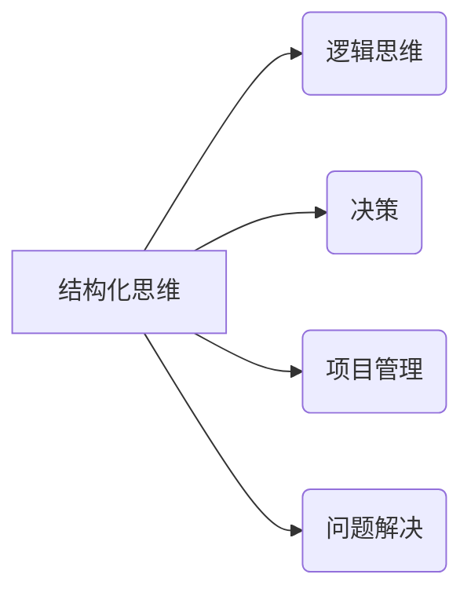

# 结构化思维的力量：从思维到行动

> 关键词：结构化思维，逻辑思维，决策，项目管理，问题解决，软件工程，认知心理学

## 1. 背景介绍

在信息爆炸的时代，人们每天都要处理大量的信息，这要求我们具备高效的信息处理能力和决策能力。结构化思维作为一种系统化、逻辑化的思考方式，能够帮助我们更好地理解复杂问题，提高决策质量，并最终实现行动的有效执行。本文将探讨结构化思维的核心概念、原理和应用，旨在帮助读者提升思维效率和行动能力。

### 1.1 问题的由来

随着社会的发展，信息处理和决策能力的重要性日益凸显。然而，许多人面临着以下问题：

- 面对复杂问题时，难以抓住核心，无法进行有效分析。
- 决策过程中，缺乏逻辑性，容易陷入主观臆断。
- 项目管理中，任务分配和进度控制困难重重。
- 问题解决时，缺乏系统性，难以找到根本原因。

这些问题都源于缺乏结构化思维。为了解决这些问题，我们需要学习和掌握结构化思维的方法和技巧。

### 1.2 研究现状

结构化思维作为一种认知工具，在多个领域得到了广泛应用，如管理学、心理学、工程学等。近年来，随着认知心理学的发展，结构化思维的理论基础也得到了进一步丰富。

### 1.3 研究意义

研究结构化思维对于以下方面具有重要意义：

- 提升个人和团队的思维效率。
- 增强决策的科学性和合理性。
- 提高项目管理水平。
- 促进问题解决能力的提升。

### 1.4 本文结构

本文将按照以下结构进行论述：

- 第2章介绍结构化思维的核心概念及其与其他相关概念的联系。
- 第3章阐述结构化思维的核心算法原理和具体操作步骤。
- 第4章介绍结构化思维的数学模型和公式，并结合实例进行讲解。
- 第5章通过项目实践，展示结构化思维在实际工作中的应用。
- 第6章探讨结构化思维在不同领域的应用场景和未来展望。
- 第7章推荐相关学习资源和开发工具。
- 第8章总结结构化思维的未来发展趋势和挑战。
- 第9章提供常见问题与解答。

## 2. 核心概念与联系

### 2.1 核心概念

- **结构化思维**：指在思考、分析、决策和解决问题时，运用逻辑、系统、模块化的方法，将复杂问题分解为可管理、可操作的部分，最终实现问题的有效解决。
- **逻辑思维**：指运用逻辑规则进行推理和判断的能力，是结构化思维的基础。
- **决策**：指在多种选择中，根据一定的目标，选择最佳行动方案的过程。
- **项目管理**：指在一定的资源约束条件下，对项目活动进行计划、组织、指挥、协调和控制，以确保项目目标的实现。
- **问题解决**：指通过分析问题、设计方案、实施解决方案的过程。

### 2.2 关系图



从关系图中可以看出，结构化思维是其他相关概念的基础，它贯穿于决策、项目管理和问题解决的全过程。

## 3. 核心算法原理 & 具体操作步骤

### 3.1 算法原理概述

结构化思维的算法原理可以概括为以下三个步骤：

1. **问题定义**：明确问题的性质、目标和约束条件。
2. **问题分解**：将复杂问题分解为若干个子问题，以便于分析和解决。
3. **子问题解决**：对分解后的子问题逐一进行解决，最终实现整体问题的解决。

### 3.2 算法步骤详解

#### 3.2.1 问题定义

问题定义是结构化思维的第一步，也是至关重要的一步。以下是一些问题定义的技巧：

- **明确问题性质**：确定问题属于哪一类问题，如决策问题、项目管理问题、问题解决等。
- **设定目标**：明确问题的目标，即希望通过解决该问题达到的结果。
- **识别约束条件**：分析问题的约束条件，如资源限制、时间限制等。

#### 3.2.2 问题分解

问题分解是将复杂问题分解为若干个子问题的过程。以下是一些问题分解的技巧：

- **识别关键因素**：找出影响问题解决的关键因素。
- **建立层级结构**：将问题分解为一级子问题、二级子问题等，形成一个层级结构。
- **划分责任范围**：明确每个子问题的责任范围。

#### 3.2.3 子问题解决

子问题解决是对分解后的子问题逐一进行解决的过程。以下是一些子问题解决的技巧：

- **制定解决方案**：针对每个子问题，制定具体的解决方案。
- **评估解决方案**：对每个解决方案进行评估，选择最优方案。
- **实施解决方案**：将最优方案付诸实施。

### 3.3 算法优缺点

#### 3.3.1 优点

- **提高思维效率**：结构化思维能够帮助我们更快地理解问题，提高思维效率。
- **增强决策质量**：结构化思维能够帮助我们做出更科学、合理的决策。
- **提升项目管理水平**：结构化思维能够帮助我们更好地规划、组织、指挥、协调和控制项目。
- **促进问题解决能力**：结构化思维能够帮助我们更快地找到问题的根本原因，并采取有效的解决措施。

#### 3.3.2 缺点

- **思维过程较为复杂**：结构化思维需要一定的思维训练和实践经验，对于初学者来说，可能需要较长时间才能熟练掌握。
- **缺乏灵活性**：在特定情况下，结构化思维可能过于僵化，难以适应复杂多变的环境。

### 3.4 算法应用领域

结构化思维的应用领域非常广泛，包括：

- **企业决策**：帮助企业制定战略规划、市场定位、产品开发等决策。
- **项目管理**：帮助项目经理规划、组织、指挥、协调和控制项目。
- **问题解决**：帮助个人和团队快速找到问题的根本原因，并采取有效的解决措施。
- **教育培训**：帮助教师和学生提高思维能力，提升学习效果。

## 4. 数学模型和公式 & 详细讲解 & 举例说明

### 4.1 数学模型构建

结构化思维可以抽象为一个数学模型，如下所示：

$$
\text{结构化思维} = \text{问题定义} \times \text{问题分解} \times \text{子问题解决}
$$

### 4.2 公式推导过程

结构化思维公式的推导过程如下：

1. **问题定义**：将问题转化为数学模型，如目标函数、约束条件等。
2. **问题分解**：将数学模型分解为若干个子模型。
3. **子问题解决**：对子模型进行求解，最终得到整体模型的解。

### 4.3 案例分析与讲解

以下是一个结构化思维在项目管理中的应用案例：

**案例**：某企业计划开发一款新产品，项目周期为12个月，预算为1000万元。

**问题定义**：如何在这个预算和时间内完成产品开发？

**问题分解**：

- **市场调研**：了解市场需求，确定产品功能。
- **产品设计**：根据市场需求，设计产品原型。
- **软件开发**：开发产品功能。
- **测试与优化**：测试产品功能，并进行优化。
- **上线与推广**：上线产品，并进行推广。

**子问题解决**：

- **市场调研**：通过问卷调查、访谈等方式收集市场信息。
- **产品设计**：根据市场调研结果，设计产品原型。
- **软件开发**：使用敏捷开发方法，分阶段完成软件开发。
- **测试与优化**：对软件进行测试，并根据测试结果进行优化。
- **上线与推广**：上线产品，并通过线上线下渠道进行推广。

通过结构化思维，该企业成功地在12个月内完成了新产品的开发，并在市场上取得了良好的口碑。

## 5. 项目实践：代码实例和详细解释说明

### 5.1 开发环境搭建

为了更好地理解结构化思维在软件工程中的应用，我们将以一个简单的软件开发项目为例进行说明。以下是在Python环境下进行软件开发的基本步骤：

1. **安装Python开发环境**：下载并安装Python，配置好Python环境。
2. **创建项目目录**：根据项目需求，创建项目目录。
3. **编写代码**：使用Python编写代码，实现软件功能。
4. **测试代码**：编写测试用例，测试代码功能。
5. **优化代码**：根据测试结果，优化代码。
6. **部署软件**：将软件部署到目标环境。

### 5.2 源代码详细实现

以下是一个简单的Python代码示例，实现一个计算两个数之和的功能：

```python
def add(a, b):
    """
    计算两个数的和
    :param a: 第一个数
    :param b: 第二个数
    :return: 两个数的和
    """
    return a + b

# 测试代码
if __name__ == "__main__":
    result = add(2, 3)
    print(f"The sum of 2 and 3 is: {result}")
```

### 5.3 代码解读与分析

以上代码实现了一个简单的函数`add`，用于计算两个数的和。代码中使用了注释来解释函数的用途和参数，提高了代码的可读性。

### 5.4 运行结果展示

运行上述代码，将得到以下输出：

```
The sum of 2 and 3 is: 5
```

这表明代码已经成功实现了计算两个数之和的功能。

## 6. 实际应用场景

### 6.1 企业决策

在企业管理中，结构化思维可以帮助企业进行战略规划、市场定位、产品开发等决策。以下是一个企业战略规划的案例：

**案例**：某互联网企业计划进行战略规划，确定未来3年的发展方向。

**问题定义**：如何制定该企业的战略规划？

**问题分解**：

- **市场分析**：分析行业发展趋势、竞争对手情况等。
- **内部资源分析**：分析企业内部资源，如技术、人才、资金等。
- **战略目标制定**：根据市场分析和内部资源分析，制定企业的战略目标。
- **战略路径设计**：设计实现战略目标的具体路径。

**子问题解决**：

- **市场分析**：通过市场调研、行业报告等方式收集市场信息。
- **内部资源分析**：通过内部调查、数据分析等方式收集内部资源信息。
- **战略目标制定**：根据市场分析和内部资源分析，制定企业的战略目标，如提升市场份额、拓展新市场等。
- **战略路径设计**：根据战略目标，设计实现目标的具体路径，如加强技术研发、拓展海外市场等。

### 6.2 项目管理

在项目管理中，结构化思维可以帮助项目经理规划、组织、指挥、协调和控制项目。以下是一个软件项目管理的案例：

**案例**：某软件开发团队计划开发一款新软件，项目周期为6个月，预算为50万元。

**问题定义**：如何在这个预算和时间内完成软件开发？

**问题分解**：

- **需求分析**：收集用户需求，确定软件功能。
- **系统设计**：设计软件系统架构。
- **软件开发**：开发软件功能。
- **测试与优化**：测试软件功能，并进行优化。
- **部署与上线**：部署软件到目标环境。

**子问题解决**：

- **需求分析**：通过问卷调查、访谈等方式收集用户需求。
- **系统设计**：根据需求分析，设计软件系统架构。
- **软件开发**：使用敏捷开发方法，分阶段完成软件开发。
- **测试与优化**：对软件进行测试，并根据测试结果进行优化。
- **部署与上线**：将软件部署到目标环境。

### 6.3 问题解决

在问题解决过程中，结构化思维可以帮助我们快速找到问题的根本原因，并采取有效的解决措施。以下是一个故障排查的案例：

**案例**：某企业网络出现故障，导致部分员工无法访问外部网络。

**问题定义**：如何排查并解决网络故障？

**问题分解**：

- **网络设备检查**：检查路由器、交换机等网络设备状态。
- **网络连接检查**：检查网络连接是否正常。
- **防火墙设置检查**：检查防火墙设置是否正确。
- **病毒扫描**：扫描网络中的病毒。

**子问题解决**：

- **网络设备检查**：检查路由器、交换机等网络设备状态，确认设备无故障。
- **网络连接检查**：检查网络连接是否正常，确认网络连接无问题。
- **防火墙设置检查**：检查防火墙设置是否正确，确认防火墙设置无误。
- **病毒扫描**：扫描网络中的病毒，确认网络中没有病毒。

通过结构化思维，该企业成功排除了网络故障，恢复了网络访问。

### 6.4 未来应用展望

随着人工智能、大数据等技术的发展，结构化思维在更多领域的应用前景将更加广阔。以下是一些未来可能的应用方向：

- **智能决策系统**：利用结构化思维构建智能决策系统，为政府、企业等提供决策支持。
- **智能问答系统**：利用结构化思维构建智能问答系统，为用户提供更加智能的问答服务。
- **智能客服系统**：利用结构化思维构建智能客服系统，提高客服效率和服务质量。
- **智能推荐系统**：利用结构化思维构建智能推荐系统，为用户提供更加精准的推荐服务。

## 7. 工具和资源推荐

### 7.1 学习资源推荐

- **书籍**：
  - 《结构化思考力》
  - 《金字塔原理》
  - 《麦肯锡教我的思考武器》
- **在线课程**：
  - 在线教育平台（如Coursera、edX等）上的结构化思维课程
  - 企业培训课程
- **论坛和社区**：
  - 结构化思维相关论坛和社区（如CSDN、知乎等）

### 7.2 开发工具推荐

- **思维导图软件**：
  - XMind
  - MindManager
  - FreeMind
- **项目管理工具**：
  - Trello
  - Jira
  - Asana
- **文档编辑软件**：
  - Microsoft Word
  - Google Docs
  - Sublime Text

### 7.3 相关论文推荐

- **《结构化思维：一种基于认知心理学的思维方法》**
- **《结构化思维在项目管理中的应用》**
- **《结构化思维在软件开发中的应用》**

## 8. 总结：未来发展趋势与挑战

### 8.1 研究成果总结

本文对结构化思维的核心概念、原理和应用进行了详细阐述，并通过实例展示了其在实际工作中的应用。研究表明，结构化思维是一种有效的思维方法，能够帮助我们更好地理解复杂问题，提高决策质量，并最终实现行动的有效执行。

### 8.2 未来发展趋势

随着人工智能、大数据等技术的发展，结构化思维将在以下方面得到进一步发展：

- **与其他认知科学的融合**：结构化思维将与认知科学、心理学等领域的研究成果相结合，形成更加完善的理论体系。
- **与人工智能技术的结合**：结构化思维将与其他人工智能技术相结合，如机器学习、自然语言处理等，形成更加智能化的应用。
- **在教育领域的应用**：结构化思维将被广泛应用于教育领域，帮助提高学生的思维能力和创新能力。

### 8.3 面临的挑战

尽管结构化思维具有诸多优势，但在实际应用中仍面临以下挑战：

- **思维习惯的转变**：人们需要改变传统的思维习惯，才能更好地运用结构化思维。
- **理论与实践的结合**：结构化思维需要与实践相结合，才能发挥其真正的价值。
- **跨领域的应用**：结构化思维在不同领域的应用需要针对具体情况进行调整和优化。

### 8.4 研究展望

为了更好地推广和应用结构化思维，未来的研究可以从以下几个方面进行：

- **建立结构化思维的评估体系**：制定一套科学、合理的评估体系，用于评估结构化思维的应用效果。
- **开发结构化思维的教学方法**：开发一套系统的教学方法，帮助人们更好地学习和应用结构化思维。
- **构建结构化思维的应用平台**：构建一个结构化思维的应用平台，为用户提供结构化思维的工具和资源。

## 9. 附录：常见问题与解答

### 9.1 问答

**问：结构化思维与线性思维有何区别？**

答：结构化思维是一种系统化、逻辑化的思考方式，强调对问题的全面分析和综合判断；而线性思维则是一种顺序性的思考方式，强调按部就班的逻辑推理。

**问：结构化思维是否适用于所有场景？**

答：结构化思维适用于大多数场景，但在一些需要创新和直觉的场景中，可能需要结合其他思维方法。

**问：如何培养结构化思维能力？**

答：可以通过以下途径培养结构化思维能力：
- 学习结构化思维的相关书籍和课程。
- 练习使用思维导图、鱼骨图等工具进行思维训练。
- 积极参与讨论和交流，锻炼逻辑思维和表达能力。
- 反思和总结自己的思维过程，不断改进。

**问：结构化思维在项目管理中的应用有哪些优势？**

答：结构化思维在项目管理中的应用优势包括：
- 提高项目管理效率。
- 降低项目风险。
- 提升项目质量。
- 促进团队协作。

作者：禅与计算机程序设计艺术 / Zen and the Art of Computer Programming