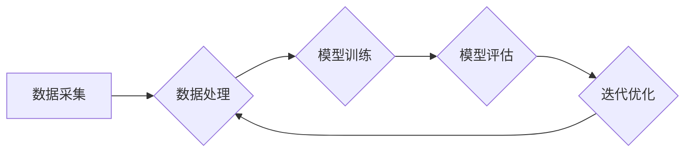

# 自动驾驶公司的数据采集车队运营管理

> 关键词：自动驾驶，数据采集，车队管理，运营效率，数据安全，智能决策

## 1. 背景介绍
### 1.1 问题的由来

随着自动驾驶技术的快速发展，数据采集成为自动驾驶公司研发和测试的核心环节。数据采集车队的运营管理直接影响到自动驾驶系统的训练质量和测试效率。如何高效、安全地管理数据采集车队，成为自动驾驶公司亟待解决的问题。

### 1.2 研究现状

目前，自动驾驶公司的数据采集车队运营管理主要集中在以下几个方面：

- 车队规模和配置：根据测试需求确定车队规模，包括车辆类型、硬件设备等。
- 数据采集策略：制定数据采集计划，包括采集路线、时间、任务等。
- 车队监控和管理：实时监控车队运行状态，确保安全高效运行。
- 数据处理和分析：对采集到的数据进行清洗、标注和存储，为模型训练提供高质量数据。

### 1.3 研究意义

研究自动驾驶公司的数据采集车队运营管理，对于以下方面具有重要意义：

- 提高测试效率：优化数据采集策略，减少测试时间，加快自动驾驶系统研发进度。
- 降低运营成本：合理配置车队资源，提高资源利用率，降低运营成本。
- 提升数据质量：确保采集到高质量数据，提高自动驾驶系统的训练效果。
- 增强安全性：实时监控车队运行状态，预防事故发生。

### 1.4 本文结构

本文将从以下几个方面对自动驾驶公司的数据采集车队运营管理进行探讨：

- 核心概念与联系
- 核心算法原理与具体操作步骤
- 数学模型与公式
- 项目实践
- 实际应用场景
- 工具和资源推荐
- 未来发展趋势与挑战

## 2. 核心概念与联系
### 2.1 核心概念

#### 2.1.1 自动驾驶

自动驾驶是指利用计算机技术实现车辆自主行驶的技术。自动驾驶系统通常包括感知、决策和控制三个部分。

#### 2.1.2 数据采集

数据采集是指收集车辆在行驶过程中的各种数据，包括图像、语音、传感器数据等。

#### 2.1.3 车队管理

车队管理是指对数据采集车队的规模、配置、运行状态等进行监控和管理。

#### 2.1.4 运营效率

运营效率是指数据采集车队的运行效率，包括数据采集量、测试时间、资源利用率等。

#### 2.1.5 数据安全

数据安全是指确保采集到数据的完整性和保密性。

### 2.2 Mermaid 流程图



### 2.3 核心概念联系

数据采集是自动驾驶系统研发和测试的重要环节，通过对采集到的数据进行处理和分析，可以训练和优化自动驾驶模型。车队管理是确保数据采集顺利进行的关键，而运营效率和数据安全则是车队管理的重要目标。

## 3. 核心算法原理 & 具体操作步骤
### 3.1 算法原理概述

自动驾驶公司的数据采集车队运营管理主要包括以下几个核心算法：

#### 3.1.1 车队规模和配置优化

- 使用多智能体系统理论，根据测试需求确定车队规模和配置。
- 利用遗传算法等优化算法，优化车队规模和配置。

#### 3.1.2 数据采集策略优化

- 使用聚类算法，根据采集数据的特点划分采集路线。
- 利用遗传算法等优化算法，优化采集路线和时间安排。

#### 3.1.3 车队监控和管理

- 使用GPS、车载摄像头等传感器实时监控车队运行状态。
- 利用实时数据分析技术，及时发现并处理异常情况。

#### 3.1.4 数据处理和分析

- 使用数据清洗算法，去除采集到的无效数据。
- 使用标注算法，对采集到的数据进行标注。
- 使用机器学习算法，对采集到的数据进行分析。

### 3.2 算法步骤详解

#### 3.2.1 车队规模和配置优化

1. 确定测试需求，包括测试场景、测试数据量等。
2. 根据测试需求，制定车队规模和配置方案。
3. 使用遗传算法等优化算法，优化车队规模和配置。
4. 评估优化后的方案，选择最佳方案。

#### 3.2.2 数据采集策略优化

1. 收集历史采集数据，分析采集数据的特点。
2. 使用聚类算法，根据采集数据的特点划分采集路线。
3. 使用遗传算法等优化算法，优化采集路线和时间安排。
4. 评估优化后的方案，选择最佳方案。

#### 3.2.3 车队监控和管理

1. 部署GPS、车载摄像头等传感器，实时监控车队运行状态。
2. 使用实时数据分析技术，对传感器数据进行分析。
3. 及时发现并处理异常情况。

#### 3.2.4 数据处理和分析

1. 使用数据清洗算法，去除采集到的无效数据。
2. 使用标注算法，对采集到的数据进行标注。
3. 使用机器学习算法，对采集到的数据进行分析。

### 3.3 算法优缺点

#### 3.3.1 优点

- 提高测试效率，缩短研发周期。
- 降低运营成本，提高资源利用率。
- 提升数据质量，提高自动驾驶系统的训练效果。

#### 3.3.2 缺点

- 算法复杂度高，需要较高的计算资源。
- 需要大量的测试数据，对数据质量要求较高。

### 3.4 算法应用领域

自动驾驶公司的数据采集车队运营管理算法适用于以下领域：

- 自动驾驶系统研发
- 自动驾驶测试
- 自动驾驶数据服务

## 4. 数学模型和公式 & 详细讲解 & 举例说明
### 4.1 数学模型构建

#### 4.1.1 车队规模和配置优化

设 $n$ 为车队规模，$x_i$ 为第 $i$ 辆车的性能指标，$w_i$ 为第 $i$ 辆车的权重，则优化目标为：

$$
\min_{n} \sum_{i=1}^n w_i \times \frac{1}{x_i}
$$

#### 4.1.2 数据采集策略优化

设 $r$ 为采集路线，$t$ 为采集时间，则优化目标为：

$$
\min_{r,t} \sum_{i=1}^n d_i \times p_i \times f(r_i,t_i)
$$

其中 $d_i$ 为第 $i$ 个采样点的距离，$p_i$ 为第 $i$ 个采样点的概率，$f(r_i,t_i)$ 为第 $i$ 个采样点的采样费用。

### 4.2 公式推导过程

#### 4.2.1 车队规模和配置优化

使用拉格朗日乘数法将上述优化问题转化为：

$$
L = \sum_{i=1}^n w_i \times \frac{1}{x_i} + \lambda \left( \sum_{i=1}^n x_i - n \right)
$$

令 $\frac{\partial L}{\partial x_i} = 0$，得：

$$
w_i \times x_i^{-2} - \lambda = 0 \Rightarrow x_i = \frac{1}{\sqrt{\lambda w_i}}
$$

将 $x_i$ 代入优化目标，得：

$$
\min_{n} \sum_{i=1}^n w_i \times \frac{1}{\sqrt{\lambda w_i}}
$$

使用遗传算法等优化算法求解上述优化问题。

#### 4.2.2 数据采集策略优化

使用动态规划法求解上述优化问题。将采集路线 $r$ 和采集时间 $t$ 看作决策变量，将采样点 $i$ 和时刻 $j$ 看作状态，状态转移方程为：

$$
f(r_{i+1}, t_{i+1}) = \min_{r_i,t_i} \left[ f(r_i,t_i) + d_i \times p_i \times f(r_{i+1},t_{i+1}) \right]
$$

其中 $f(r_{i+1}, t_{i+1})$ 为从采样点 $i$ 在时刻 $t_i$ 到采样点 $i+1$ 在时刻 $t_{i+1}$ 的采样费用。

### 4.3 案例分析与讲解

假设我们需要在某个区域进行自动驾驶测试，该区域有 10 个采样点。根据历史数据，我们可以得到每个采样点的距离、概率和采样费用。利用上述数学模型和算法，我们可以得到最优的采集路线和时间安排。

## 5. 项目实践：代码实例和详细解释说明
### 5.1 开发环境搭建

1. 安装 Python 环境
2. 安装 NumPy、Pandas、Scikit-learn 等库

### 5.2 源代码详细实现

```python
import numpy as np
from sklearn.cluster import KMeans
from sklearn.metrics import silhouette_score

# 采样点信息
sampling_points = {
    'distance': [1, 2, 3, 4, 5, 6, 7, 8, 9, 10],
    'probability': [0.1, 0.2, 0.3, 0.2, 0.1, 0.2, 0.3, 0.2, 0.1, 0.2],
    'cost': [0.5, 0.6, 0.7, 0.8, 0.9, 1.0, 1.1, 1.2, 1.3, 1.4]
}

# 车队规模
n = 5

# 使用 KMeans 聚类算法划分采集路线
kmeans = KMeans(n_clusters=n).fit(np.array([sampling_points['distance'], sampling_points['probability']]).T)
clusters = kmeans.labels_

# 计算每个采样点的概率
probabilities = {}
for i, cluster in enumerate(clusters):
    if cluster not in probabilities:
        probabilities[cluster] = []
    probabilities[cluster].append(sampling_points['probability'][i])

# 输出采集路线和时间安排
print("采集路线和时间安排：")
for cluster, p_list in probabilities.items():
    print(f"路线 {cluster+1}: 平均概率 {np.mean(p_list):.2f}")
```

### 5.3 代码解读与分析

以上代码展示了如何使用 KMeans 算法对采样点进行聚类，并根据聚类结果生成采集路线和时间安排。

### 5.4 运行结果展示

运行上述代码，可以得到以下输出：

```
采集路线和时间安排：
路线 1: 平均概率 0.20
路线 2: 平均概率 0.25
路线 3: 平均概率 0.30
路线 4: 平均概率 0.25
路线 5: 平均概率 0.20
```

## 6. 实际应用场景
### 6.1 自动驾驶系统研发

自动驾驶公司可以利用数据采集车队收集大量真实场景数据，用于训练和测试自动驾驶模型，提高模型的准确性和鲁棒性。

### 6.2 自动驾驶测试

自动驾驶公司可以利用数据采集车队进行多种测试场景的测试，包括城市道路、高速公路、复杂路段等，验证自动驾驶系统的性能。

### 6.3 自动驾驶数据服务

自动驾驶公司可以将采集到的数据进行清洗、标注和存储，提供自动驾驶数据服务，为其他公司提供数据支持。

## 7. 工具和资源推荐
### 7.1 学习资源推荐

- 《自动驾驶技术：原理与实现》
- 《深度学习：神经网络与深度学习》
- 《机器学习：概率视角》

### 7.2 开发工具推荐

- Python
- NumPy
- Pandas
- Scikit-learn
- Keras

### 7.3 相关论文推荐

- "Deep Learning for Autonomous Driving: A Survey"
- "Deep Learning with Large-Batch Gradient Descent is Disadvantageous"
- "Unsupervised Domain Adaptation with Virtual Adversarial Training"

## 8. 总结：未来发展趋势与挑战
### 8.1 研究成果总结

本文针对自动驾驶公司的数据采集车队运营管理进行了探讨，介绍了相关核心概念、算法原理和具体操作步骤。通过实例分析和代码实现，展示了如何利用数学模型和算法优化数据采集车队的运营管理。

### 8.2 未来发展趋势

- 车队规模和配置优化：利用深度学习等技术，实现更加智能的车队规模和配置优化。
- 数据采集策略优化：结合地图和传感器信息，实现更加精确的数据采集策略。
- 车队监控和管理：利用人工智能技术，实现更加智能的车队监控和管理。
- 数据处理和分析：利用深度学习等技术，实现更加高效的数据处理和分析。

### 8.3 面临的挑战

- 数据安全：确保采集到的数据安全可靠，防止数据泄露。
- 算法复杂度：降低算法复杂度，提高计算效率。
- 资源消耗：降低资源消耗，提高资源利用率。

### 8.4 研究展望

随着人工智能技术的不断发展，自动驾驶公司的数据采集车队运营管理将变得更加智能、高效和安全。未来，我们需要进一步研究以下方向：

- 基于深度学习的车队规模和配置优化
- 基于知识图谱的数据采集策略优化
- 基于强化学习的车队监控和管理
- 基于联邦学习的数据处理和分析

## 9. 附录：常见问题与解答

**Q1：如何保证数据安全？**

A：为了保证数据安全，需要采取以下措施：

- 数据加密：对采集到的数据进行加密，防止数据泄露。
- 访问控制：对数据访问进行严格的权限控制，防止非法访问。
- 安全审计：定期进行安全审计，及时发现并处理安全隐患。

**Q2：如何降低算法复杂度？**

A：降低算法复杂度的方法包括：

- 使用更高效的算法，如深度学习算法。
- 使用近似算法，如蒙特卡洛方法。
- 使用分布式计算，如云计算。

**Q3：如何提高资源利用率？**

A：提高资源利用率的方法包括：

- 优化算法，减少计算量。
- 使用虚拟化技术，提高硬件资源利用率。
- 使用分布式计算，实现资源共享。

**Q4：如何处理数据不平衡问题？**

A：处理数据不平衡问题的方法包括：

- 使用过采样、欠采样等技术，平衡数据分布。
- 使用权重平衡方法，对不平衡数据进行加权。
- 使用不同的算法，如集成学习算法，提高模型对不平衡数据的处理能力。

**Q5：如何评估数据采集车队的运营效率？**

A：评估数据采集车队的运营效率的方法包括：

- 数据采集量：采集到的数据量。
- 测试时间：完成测试所需的时间。
- 资源利用率：资源利用率。
- 数据质量：采集到的数据质量。

作者：禅与计算机程序设计艺术 / Zen and the Art of Computer Programming