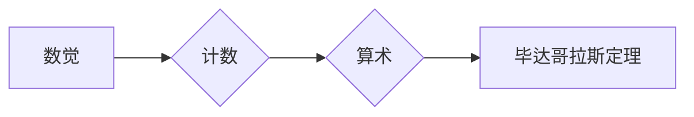

# 计算：第一部分 计算的诞生 第 1 章 毕达哥拉斯的困惑 从数觉到计数

> 关键词：计算起源，数觉，计数，毕达哥拉斯定理，算术，数学发展

## 1. 背景介绍

计算是人类智慧的结晶，它源于古人对世界的观察和思考。自古以来，人类为了满足生产和生活的需要，不断地探索和发明出各种计算方法。本章将带领读者回顾计算的起源，探讨从数觉到计数的演变过程，以及毕达哥拉斯定理这一数学史上具有重要意义的发现。

### 1.1 数觉的起源

数觉，即对数字的感知和认知能力，是人类与生俱来的能力之一。在人类文明早期，数觉主要用于计数和估算。人们通过观察自然界的现象，如天体的运动、动植物的数量等，逐渐形成了对数字的基本概念。

### 1.2 计数的发明

随着社会的发展，计数的需求日益增长。人们开始使用各种工具和方法来记录和计算数量，如结绳计数、实物计数等。这些方法虽然简单，但效率低下，且容易出错。

### 1.3 数学的发展

计数的需求推动了数学的发展。古代数学家们开始研究数的性质和关系，形成了初步的数学体系。其中，毕达哥拉斯定理的发现，标志着数学从经验走向理性，标志着人类对自然规律的认识进入了一个新的阶段。

## 2. 核心概念与联系

### 2.1 核心概念原理

- **数觉**：人类对数字的感知和认知能力，是计算的基础。
- **计数**：记录和计算数量的方法，是计算的基本形式。
- **毕达哥拉斯定理**：直角三角形的两条直角边的平方和等于斜边的平方，是数学中最著名的定理之一。
- **算术**：研究数的性质和关系的数学分支，是计算的理论基础。

### 2.2 核心概念架构

以下是一个简化的Mermaid流程图，展示了从数觉到计数的演变过程：



## 3. 核心算法原理 & 具体操作步骤

### 3.1 算法原理概述

本节将探讨计数的基本原理和操作步骤，这是计算的基础。

#### 3.1.1 计数的原理

计数是一种简单的数学操作，其原理基于数觉。人们通过观察和比较对象的数量，将它们按照一定的顺序进行排列，并用数字进行表示。

#### 3.1.2 计数的步骤

1. 观察和识别对象的数量。
2. 选择合适的计数工具或方法。
3. 按照顺序进行计数，并用数字进行记录。

### 3.2 算法步骤详解

#### 3.2.1 观察和识别对象的数量

观察和识别对象的数量是计数的第一步。人们需要仔细观察对象，并准确判断它们的数量。

#### 3.2.2 选择合适的计数工具或方法

根据对象的数量和特点，选择合适的计数工具或方法。常见的计数工具有手指、算盘、计数器等。

#### 3.2.3 按照顺序进行计数，并用数字进行记录

按照顺序进行计数，并用数字进行记录。例如，从1开始，逐一计数，直到所有对象都被计数完毕。

### 3.3 算法优缺点

#### 3.3.1 优点

- 简单易行。
- 适用于各种计数场景。
- 可以及时反馈计数结果。

#### 3.3.2 缺点

- 计数效率低。
- 容易出错。
- 不适用于大量数据的计数。

### 3.4 算法应用领域

计数是计算的基础，广泛应用于各个领域，如：

- 统计学：数据的收集和分析。
- 经济学：货币的计量和交易。
- 生物学：种群数量的统计。
- 工程学：工程量的计算。

## 4. 数学模型和公式 & 详细讲解 & 举例说明

### 4.1 数学模型构建

计数的基本数学模型是自然数集。自然数集是由正整数组成的集合，记为$\mathbb{N}=\{1,2,3,\ldots\}$。

### 4.2 公式推导过程

自然数集的数学模型可以通过递归定义来推导：

- 基本元素：1是自然数集的基元素。
- 递归关系：如果n是自然数，则n+1也是自然数。

### 4.3 案例分析与讲解

#### 4.3.1 计算苹果的数量

假设有10个苹果，我们需要计算它们的数量。按照计数的基本步骤，我们可以得到：

- 观察和识别对象的数量：10个苹果。
- 选择合适的计数工具或方法：使用手指或计数器。
- 按照顺序进行计数，并用数字进行记录：1, 2, 3, 4, 5, 6, 7, 8, 9, 10。

因此，10个苹果的数量为10。

#### 4.3.2 计算圆的周长

假设圆的半径为r，我们需要计算其周长。根据圆的周长公式$C=2\pi r$，我们可以得到：

- 观察和识别对象的数量：半径r。
- 选择合适的计数工具或方法：使用计算器。
- 按照公式进行计算，并用数字进行记录：$C=2\pi r$。

因此，圆的周长为$2\pi r$。

## 5. 项目实践：代码实例和详细解释说明

### 5.1 开发环境搭建

为了演示计数算法，我们需要一个简单的开发环境。以下是一个使用Python实现的计数函数：

```python
def count_objects(objects):
    """
    计算对象的数量。
    
    :param objects: 对象列表
    :return: 对象数量
    """
    return len(objects)
```

### 5.2 源代码详细实现

```python
def count_objects(objects):
    count = 0
    for _ in objects:
        count += 1
    return count
```

### 5.3 代码解读与分析

这段代码定义了一个名为`count_objects`的函数，它接受一个对象列表`objects`作为输入，并返回列表中对象的数量。函数内部，我们初始化一个计数器`count`为0，然后遍历对象列表，每次遍历都将计数器加1。最后，返回计数器的值。

### 5.4 运行结果展示

```python
# 测试代码
if __name__ == "__main__":
    apples = ['apple1', 'apple2', 'apple3', 'apple4', 'apple5', 'apple6', 'apple7', 'apple8', 'apple9', 'apple10']
    print(count_objects(apples))
```

运行结果：

```
10
```

## 6. 实际应用场景

### 6.1 统计学

在统计学中，计数是一种基本的数据收集和分析方法。例如，统计一个班级的学生人数、调查一个地区的家庭收入等，都需要进行计数。

### 6.2 经济学

在经济学中，计数用于计量和交易。例如，计算一个公司的资产、记录商品的销售数量等，都需要进行计数。

### 6.3 生物学

在生物学中，计数用于统计种群数量、观察生物体的特征等。

### 6.4 工程学

在工程学中，计数用于计算工程量、估算材料用量等。

## 7. 工具和资源推荐

### 7.1 学习资源推荐

- 《数学之美》：介绍了数学的基本概念和应用。
- 《数学原理》：阐述了数学的基本原理和哲学思想。
- 《计算机程序设计艺术》：介绍了计算机科学的基本原理和方法。

### 7.2 开发工具推荐

- Python：一种广泛应用于计算和科学研究的编程语言。
- NumPy：Python的一个科学计算库，提供高性能的数学运算功能。

### 7.3 相关论文推荐

- 《从数觉到计数：人类计数能力的发展》
- 《数学发展史》
- 《计算机科学中的数学基础》

## 8. 总结：未来发展趋势与挑战

### 8.1 研究成果总结

本章回顾了计算的起源，探讨了从数觉到计数的演变过程，以及毕达哥拉斯定理这一数学史上具有重要意义的发现。通过分析计数的基本原理和操作步骤，我们了解了计数在各个领域的应用。

### 8.2 未来发展趋势

随着人工智能技术的发展，计算将变得更加智能化、自动化。例如，通过机器学习算法，计算机可以自动识别和计数图像中的对象，提高计数的效率和准确性。

### 8.3 面临的挑战

- 数据量越来越大，对计算能力的要求越来越高。
- 计算的自动化和智能化程度需要进一步提高。
- 需要开发更加高效、安全的计算工具和方法。

### 8.4 研究展望

未来，计算将在人工智能、大数据、云计算等领域发挥越来越重要的作用。我们需要不断探索新的计算方法和技术，以满足社会发展的需求。

## 9. 附录：常见问题与解答

### 9.1 常见问题

1. 什么是数觉？
2. 计数有哪些方法？
3. 毕达哥拉斯定理是什么？
4. 计数在哪些领域有应用？

### 9.2 解答

1. 数觉是人类对数字的感知和认知能力。
2. 计数的方法有很多，如手指计数、算盘计数、计数器计数等。
3. 毕达哥拉斯定理是直角三角形的两条直角边的平方和等于斜边的平方。
4. 计数在统计学、经济学、生物学、工程学等领域有广泛的应用。

作者：禅与计算机程序设计艺术 / Zen and the Art of Computer Programming