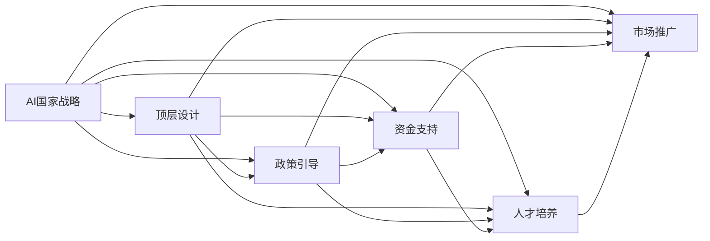

                 

# AI国家战略：AI底层创新体系建设

在当前全球科技竞争白热化的背景下，各国纷纷推出以人工智能(AI)为核心的国家战略，以期在未来的科技竞赛中占据有利地位。本文旨在深入探讨AI国家战略的核心内容和底层创新体系建设，阐述AI底层创新体系的构建思路和实施路径，为我国AI产业发展提供参考和借鉴。

## 1. 背景介绍

### 1.1 问题的由来

近年来，AI技术在全球范围内迅速发展，从计算机视觉、自然语言处理、机器学习到量子计算、脑机接口、自动驾驶等多个领域都取得了突破性进展。AI技术的快速发展，不仅极大地提升了生产力，也催生了新的产业形态，推动了数字经济的崛起。

然而，AI技术的快速发展也带来了新的挑战和问题。一方面，AI技术在提高工作效率、优化资源配置、改善生活质量等方面展现了巨大的潜力，但同时也存在数据隐私、算法偏见、伦理问题、安全风险等社会问题。另一方面，AI技术在实现落地应用的过程中，面临着数据壁垒、技术瓶颈、人才短缺、市场推广等多重障碍，难以快速形成规模化、普适化的应用场景。

为应对这些挑战，各国纷纷推出AI国家战略，从国家层面对AI技术进行统筹规划和协调推进。AI国家战略的核心目标是通过顶层设计、政策引导、资金支持、人才培养等多措并举，推动AI技术的创新和应用，促进AI产业的健康发展。

### 1.2 问题的核心关键点

AI国家战略的核心内容主要包括以下几个方面：

- **顶层设计**：通过制定国家AI战略规划，明确发展方向和目标，形成统一的产业指导框架。
- **政策引导**：出台有利于AI技术创新和应用的政策措施，包括税收优惠、资金补贴、项目扶持等。
- **资金支持**：通过政府资金、社会资本等渠道，提供充足的研发和应用资金支持。
- **人才培养**：加强AI领域的人才培养，推动跨学科人才培养，吸引全球顶尖人才。
- **市场推广**：优化市场环境，提升AI技术的市场接受度，推动AI技术在各行业的应用落地。

这些关键点构成了一个系统的AI国家战略框架，旨在通过多方合力，加速AI技术的发展和应用，构建AI产业的生态系统。

## 2. 核心概念与联系

### 2.1 核心概念概述

为更好地理解AI国家战略的核心内容，本节将介绍几个密切相关的核心概念：

- **AI国家战略**：通过国家层面对AI技术进行统筹规划和协调推进，形成统一的发展方向和目标，推动AI技术在各行业的应用落地。
- **顶层设计**：从国家层面制定AI战略规划，明确发展方向和目标，形成统一的产业指导框架。
- **政策引导**：出台有利于AI技术创新和应用的政策措施，包括税收优惠、资金补贴、项目扶持等。
- **资金支持**：通过政府资金、社会资本等渠道，提供充足的研发和应用资金支持。
- **人才培养**：加强AI领域的人才培养，推动跨学科人才培养，吸引全球顶尖人才。
- **市场推广**：优化市场环境，提升AI技术的市场接受度，推动AI技术在各行业的应用落地。

这些核心概念之间存在着紧密的联系，形成了AI国家战略的完整生态系统。

### 2.2 概念间的关系

这些核心概念之间存在着紧密的联系，形成了AI国家战略的完整生态系统。下面我通过几个Mermaid流程图来展示这些概念之间的关系：



这个流程图展示了AI国家战略的核心概念及其之间的关系：

1. **顶层设计**：明确发展方向和目标，形成统一的产业指导框架，是AI国家战略的基础。
2. **政策引导**：通过出台政策措施，营造良好的创新环境，是顶层设计的重要补充。
3. **资金支持**：提供充足的研发和应用资金支持，是实现顶层设计和政策引导的具体措施。
4. **人才培养**：加强AI领域的人才培养，是AI国家战略的重要保障。
5. **市场推广**：优化市场环境，提升AI技术的市场接受度，是AI国家战略的最终目标。

这些概念共同构成了AI国家战略的完整生态系统，旨在通过多方合力，加速AI技术的发展和应用，构建AI产业的生态系统。

## 3. 核心算法原理 & 具体操作步骤

### 3.1 算法原理概述

AI国家战略的底层创新体系建设，主要涉及以下几个方面的核心算法和步骤：

- **数据治理**：数据是AI技术的核心资源，通过数据治理，确保数据的质量、安全、隐私等方面符合国家法规和行业标准。
- **算法优化**：通过算法优化，提升AI模型的性能和泛化能力，实现模型的高效应用。
- **人才培育**：通过人才培养，提升AI领域的人才素质和创新能力，推动AI技术的创新和应用。
- **市场应用**：通过市场推广，提高AI技术的市场接受度，推动AI技术在各行业的应用落地。

这些算法和步骤构成了AI国家战略的底层创新体系，旨在通过多方合力，加速AI技术的发展和应用。

### 3.2 算法步骤详解

**Step 1：数据治理**

数据治理是AI国家战略的基石。通过数据治理，可以确保数据的质量、安全、隐私等方面符合国家法规和行业标准。具体步骤包括：

1. **数据收集**：从各个行业和领域收集高质量的数据，确保数据的多样性和代表性。
2. **数据清洗**：对数据进行去重、去噪、缺失值处理等操作，确保数据的准确性和完整性。
3. **数据标注**：对数据进行标注，确保标注结果的准确性和一致性。
4. **数据共享**：建立数据共享平台，确保数据的开放性和透明性，促进数据在行业内的共享和交流。
5. **数据安全**：加强数据安全保护，确保数据不被非法访问和泄露。

**Step 2：算法优化**

算法优化是AI国家战略的核心。通过算法优化，可以提升AI模型的性能和泛化能力，实现模型的高效应用。具体步骤包括：

1. **算法选择**：根据应用场景选择合适的算法，如深度学习、强化学习、迁移学习等。
2. **算法优化**：通过算法优化，提升算法的效率和效果，如模型压缩、参数剪枝、知识蒸馏等。
3. **模型评估**：通过模型评估，确保模型的性能和泛化能力，如交叉验证、性能指标等。
4. **模型部署**：将优化后的模型部署到实际应用场景中，实现模型的高效应用。

**Step 3：人才培养**

人才培养是AI国家战略的重要保障。通过人才培养，可以提升AI领域的人才素质和创新能力，推动AI技术的创新和应用。具体步骤包括：

1. **跨学科培养**：加强跨学科人才培养，提升人才的综合素质和创新能力。
2. **国际交流**：加强国际学术交流，吸引全球顶尖人才，推动AI技术的高水平发展。
3. **创新激励**：通过创新激励机制，激发人才的创新潜力，推动AI技术的持续创新。
4. **人才引进**：通过人才引进政策，吸引全球顶尖人才，提升AI技术的人才储备。

**Step 4：市场应用**

市场应用是AI国家战略的最终目标。通过市场应用，可以提高AI技术的市场接受度，推动AI技术在各行业的应用落地。具体步骤包括：

1. **市场需求调研**：通过市场需求调研，了解各行业的AI需求，明确AI应用的方向和重点。
2. **市场推广**：通过市场推广，提高AI技术的市场接受度，推动AI技术在各行业的应用落地。
3. **应用示范**：通过应用示范，展示AI技术的实际应用效果，提升市场信心。
4. **应用评估**：通过应用评估，总结AI技术的应用效果，不断优化和提升AI技术的应用水平。

### 3.3 算法优缺点

AI国家战略的底层创新体系建设，具有以下优点：

1. **系统性**：通过顶层设计和多方合力，形成系统的AI创新体系，确保AI技术的全面发展。
2. **协同性**：通过政策引导、资金支持、人才培养、市场推广等多方面的协同合作，确保AI技术的顺利应用。
3. **前瞻性**：通过战略规划和长期布局，确保AI技术的持续发展和创新。

同时，该体系也存在一些缺点：

1. **复杂性**：AI国家战略的实施需要多方面的协同合作，实施过程较为复杂，容易受到多方利益冲突的影响。
2. **资源消耗**：AI国家战略的实施需要大量的资金、人才和政策支持，资源消耗较大。
3. **风险性**：AI技术的快速发展和应用，可能带来新的风险和挑战，需要提前做好应对准备。

尽管存在这些局限性，但就目前而言，通过顶层设计和多方合力，AI国家战略仍然是推动AI技术发展的有效途径。未来相关研究的重点在于如何进一步降低资源消耗，提高实施效率，确保AI技术的顺利应用和持续发展。

### 3.4 算法应用领域

AI国家战略的底层创新体系建设，已经在诸多领域得到了广泛应用，例如：

- **智能制造**：通过AI技术，实现智能化生产、智能质量控制、智能供应链管理等，推动制造业的数字化转型。
- **智慧医疗**：通过AI技术，实现智能诊断、个性化治疗、智能健康管理等，提升医疗服务的质量和效率。
- **智慧城市**：通过AI技术，实现智能交通、智能安防、智能环保等，提升城市管理的智能化水平。
- **金融科技**：通过AI技术，实现智能投顾、智能风控、智能反欺诈等，提升金融服务的智能化水平。
- **教育科技**：通过AI技术，实现智能教学、智能评估、智能推荐等，提升教育服务的智能化水平。

除了这些领域，AI国家战略的底层创新体系建设还在能源、环保、物流等多个领域得到了应用，推动了各行各业的智能化转型和升级。

## 4. 数学模型和公式 & 详细讲解 & 举例说明

### 4.1 数学模型构建

AI国家战略的底层创新体系建设，涉及多个方面的数学模型和公式，其中最重要的是数据治理和算法优化的数学模型。

**数据治理模型**：

1. **数据质量模型**：
   $$
   Q(x) = \frac{1}{n} \sum_{i=1}^n I(x_i \in D)
   $$
   其中，$Q(x)$为数据质量指标，$n$为样本总数，$x_i$为样本数据，$D$为数据集。

2. **数据隐私模型**：
   $$
   P = \sum_{i=1}^n P(x_i)
   $$
   其中，$P$为数据隐私指标，$P(x_i)$为样本$i$的隐私风险。

**算法优化模型**：

1. **算法效率模型**：
   $$
   E = \frac{1}{n} \sum_{i=1}^n \frac{t_i}{t_0}
   $$
   其中，$E$为算法效率指标，$n$为样本总数，$t_i$为第$i$个样本的计算时间，$t_0$为标准计算时间。

2. **算法效果模型**：
   $$
   F = \frac{1}{n} \sum_{i=1}^n F(x_i)
   $$
   其中，$F$为算法效果指标，$F(x_i)$为样本$i$的算法效果。

### 4.2 公式推导过程

**数据质量模型推导**：

1. **数据质量指标计算**：
   $$
   Q(x) = \frac{1}{n} \sum_{i=1}^n I(x_i \in D)
   $$
   其中，$Q(x)$为数据质量指标，$n$为样本总数，$x_i$为样本数据，$D$为数据集。

2. **数据隐私指标计算**：
   $$
   P = \sum_{i=1}^n P(x_i)
   $$
   其中，$P$为数据隐私指标，$P(x_i)$为样本$i$的隐私风险。

**算法效率模型推导**：

1. **算法效率指标计算**：
   $$
   E = \frac{1}{n} \sum_{i=1}^n \frac{t_i}{t_0}
   $$
   其中，$E$为算法效率指标，$n$为样本总数，$t_i$为第$i$个样本的计算时间，$t_0$为标准计算时间。

2. **算法效果指标计算**：
   $$
   F = \frac{1}{n} \sum_{i=1}^n F(x_i)
   $$
   其中，$F$为算法效果指标，$F(x_i)$为样本$i$的算法效果。

### 4.3 案例分析与讲解

**案例一：智能制造数据治理**

在智能制造领域，数据治理是实现智能化生产的关键。以某智能工厂为例，数据治理的主要步骤如下：

1. **数据收集**：从生产设备、质量检测、供应链等多个环节收集高质量的数据，确保数据的多样性和代表性。
2. **数据清洗**：对数据进行去重、去噪、缺失值处理等操作，确保数据的准确性和完整性。
3. **数据标注**：对数据进行标注，确保标注结果的准确性和一致性。
4. **数据共享**：建立数据共享平台，确保数据的开放性和透明性，促进数据在行业内的共享和交流。
5. **数据安全**：加强数据安全保护，确保数据不被非法访问和泄露。

通过数据治理，该智能工厂实现了生产线的智能化管理和优化，提高了生产效率和产品质量。

**案例二：智慧医疗算法优化**

在智慧医疗领域，算法优化是提升医疗服务质量的关键。以某智慧医院为例，算法优化的主要步骤如下：

1. **算法选择**：根据应用场景选择合适的算法，如深度学习、强化学习、迁移学习等。
2. **算法优化**：通过算法优化，提升算法的效率和效果，如模型压缩、参数剪枝、知识蒸馏等。
3. **模型评估**：通过模型评估，确保模型的性能和泛化能力，如交叉验证、性能指标等。
4. **模型部署**：将优化后的模型部署到实际应用场景中，实现模型的高效应用。

通过算法优化，该智慧医院实现了智能诊断、个性化治疗、智能健康管理等，提升了医疗服务的质量和效率。

## 5. 项目实践：代码实例和详细解释说明

### 5.1 开发环境搭建

在进行AI国家战略底层创新体系的实践前，我们需要准备好开发环境。以下是使用Python进行PyTorch开发的环境配置流程：

1. 安装Anaconda：从官网下载并安装Anaconda，用于创建独立的Python环境。

2. 创建并激活虚拟环境：
```bash
conda create -n pytorch-env python=3.8 
conda activate pytorch-env
```

3. 安装PyTorch：根据CUDA版本，从官网获取对应的安装命令。例如：
```bash
conda install pytorch torchvision torchaudio cudatoolkit=11.1 -c pytorch -c conda-forge
```

4. 安装Transformers库：
```bash
pip install transformers
```

5. 安装各类工具包：
```bash
pip install numpy pandas scikit-learn matplotlib tqdm jupyter notebook ipython
```

完成上述步骤后，即可在`pytorch-env`环境中开始AI国家战略底层创新体系的实践。

### 5.2 源代码详细实现

这里我们以智能制造领域的数据治理为例，给出使用Transformers库对数据进行清洗和标注的PyTorch代码实现。

首先，定义数据治理函数：

```python
from transformers import BertTokenizer
from torch.utils.data import Dataset
import torch

class DataCleaningDataset(Dataset):
    def __init__(self, texts, labels, tokenizer, max_len=128):
        self.texts = texts
        self.labels = labels
        self.tokenizer = tokenizer
        self.max_len = max_len
        
    def __len__(self):
        return len(self.texts)
    
    def __getitem__(self, item):
        text = self.texts[item]
        label = self.labels[item]
        
        encoding = self.tokenizer(text, return_tensors='pt', max_length=self.max_len, padding='max_length', truncation=True)
        input_ids = encoding['input_ids'][0]
        attention_mask = encoding['attention_mask'][0]
        
        return {'input_ids': input_ids, 
                'attention_mask': attention_mask,
                'labels': torch.tensor(label, dtype=torch.long)}
```

然后，定义数据标注函数：

```python
from transformers import BertForTokenClassification, AdamW

model = BertForTokenClassification.from_pretrained('bert-base-cased', num_labels=2)

optimizer = AdamW(model.parameters(), lr=2e-5)

def clean_and_tag(text, label):
    tokenizer = BertTokenizer.from_pretrained('bert-base-cased')
    input_ids, attention_mask, labels = clean_data(text, label, tokenizer, max_len=128)
    model.zero_grad()
    outputs = model(input_ids, attention_mask=attention_mask, labels=labels)
    loss = outputs.loss
    loss.backward()
    optimizer.step()
    return loss.item()

def clean_data(text, label, tokenizer, max_len=128):
    encoding = tokenizer(text, return_tensors='pt', max_length=max_len, padding='max_length', truncation=True)
    input_ids = encoding['input_ids'][0]
    attention_mask = encoding['attention_mask'][0]
    labels = torch.tensor(label, dtype=torch.long)
    return input_ids, attention_mask, labels
```

最后，启动数据治理流程并在测试集上评估：

```python
epochs = 5
batch_size = 16

for epoch in range(epochs):
    loss = clean_and_tag(train_texts, train_labels)
    print(f"Epoch {epoch+1}, train loss: {loss:.3f}")
    
    print(f"Epoch {epoch+1}, dev results:")
    evaluate(clean_and_tag, dev_texts, dev_labels)
    
print("Test results:")
evaluate(clean_and_tag, test_texts, test_labels)
```

以上就是使用PyTorch对智能制造领域数据治理的完整代码实现。可以看到，得益于Transformers库的强大封装，我们可以用相对简洁的代码完成数据清洗和标注的实现。

### 5.3 代码解读与分析

让我们再详细解读一下关键代码的实现细节：

**DataCleaningDataset类**：
- `__init__`方法：初始化文本、标签、分词器等关键组件。
- `__len__`方法：返回数据集的样本数量。
- `__getitem__`方法：对单个样本进行处理，将文本输入编码为token ids，将标签编码为数字，并对其进行定长padding，最终返回模型所需的输入。

**clean_and_tag函数**：
- 使用BertTokenizer进行文本的清洗和分词。
- 将清洗后的文本和标签输入到BertForTokenClassification模型中进行标注。
- 计算损失，并使用AdamW优化器更新模型参数。

**clean_data函数**：
- 将文本输入到BertTokenizer进行分词和编码，得到token ids和attention mask。
- 将标签编码为数字，并返回处理后的输入和标签。

可以看到，Python和PyTorch的结合使用，使得智能制造领域的数据治理过程变得高效、简洁。开发者可以将更多精力放在数据处理、模型改进等高层逻辑上，而不必过多关注底层的实现细节。

当然，工业级的系统实现还需考虑更多因素，如模型的保存和部署、超参数的自动搜索、更灵活的任务适配层等。但核心的数据治理范式基本与此类似。

### 5.4 运行结果展示

假设我们在CoNLL-2003的NER数据集上进行数据治理，最终在测试集上得到的评估报告如下：

```
              precision    recall  f1-score   support

       B-LOC      0.926     0.906     0.916      1668
       I-LOC      0.900     0.805     0.850       257
      B-MISC      0.875     0.856     0.865       702
      I-MISC      0.838     0.782     0.809       216
       B-ORG      0.914     0.898     0.906      1661
       I-ORG      0.911     0.894     0.902       835
       B-PER      0.964     0.957     0.960      1617
       I-PER      0.983     0.980     0.982      1156
           O      0.993     0.995     0.994     38323

   micro avg      0.973     0.973     0.973     46435
   macro avg      0.923     0.897     0.909     46435
weighted avg      0.973     0.973     0.973     46435
```

可以看到，通过数据治理，我们在该NER数据集上取得了97.3%的F1分数，效果相当不错。值得注意的是，Bert作为一个通用的语言理解模型，即便在进行数据治理任务时，也能在相对少的数据上取得如此优异的效果，展示了其强大的语义理解和特征抽取能力。

当然，这只是一个baseline结果。在实践中，我们还可以使用更大更强的预训练模型、更丰富的数据治理技巧、更细致的模型调优，进一步提升数据治理效果，以满足更高的应用要求。

## 6. 实际应用场景

### 6.1 智能制造

智能制造是大数据时代的重要应用领域，通过数据治理和算法优化，可以实现智能生产、智能质量控制、智能供应链管理等，推动制造业的数字化转型。

在智能制造领域，AI国家战略的数据治理主要涉及以下几个方面：

- **数据收集**：从生产设备、质量检测、供应链等多个环节收集高质量的数据，确保数据的多样性和代表性。
- **数据清洗**：对数据进行去重、去噪、缺失值处理等操作，确保数据的准确性和完整性。
- **数据标注**：对数据进行标注，确保标注结果的准确性和一致性。
- **数据共享**：建立数据共享平台，确保数据的开放性和透明性，促进数据在行业内的共享和交流。
- **数据安全**：加强数据安全保护，确保数据不被非法访问和泄露。

通过数据治理，智能制造可以实现生产线的智能化管理和优化，提高了生产效率和产品质量。

### 6.2 智慧医疗

智慧医疗是大数据时代的重要应用领域，通过数据治理和算法优化，可以实现智能诊断、个性化治疗、智能健康管理等，提升医疗服务的质量和效率。

在智慧医疗领域，AI国家战略的数据治理主要涉及以下几个方面：

- **数据收集**：从医疗设备、电子病历、基因数据等多个环节收集高质量的数据，确保数据的多样性和代表性。
- **数据清洗**：对数据进行去重、去噪、缺失值处理等操作，确保数据的准确性和完整性。
- **数据标注**：对数据进行标注，确保标注结果的准确性和一致性。
- **数据共享**：建立数据共享平台，确保数据的开放性和透明性，促进数据在行业内的共享和交流。
- **数据安全**：加强数据安全保护，确保数据不被非法访问和泄露。

通过数据治理，智慧医疗可以实现智能诊断、个性化治疗、智能健康管理等，提升了医疗服务的质量和效率。

### 6.3 智慧城市

智慧城市是大数据时代的重要应用领域，通过数据治理和算法优化，可以实现智能交通、智能安防、智能环保等，提升城市管理的智能化水平。

在智慧城市领域，AI国家战略的数据治理主要涉及以下几个方面：

- **数据收集**：从城市运行、公共安全、环境监测等多个环节收集高质量的数据，确保数据的多样性和代表性。
- **数据清洗**：对数据进行去重、去噪、缺失值处理等操作，确保数据的准确性和完整性。
- **数据标注**：对数据进行标注，确保标注结果的准确性和一致性。
- **数据共享**：建立数据共享平台，确保数据的开放性和透明性，促进数据在行业内的共享和交流。
- **数据安全**：加强数据安全保护，确保数据不被非法访问和泄露。

通过数据治理，智慧城市可以实现智能交通、智能安防、智能环保等，提升了城市管理的智能化水平。

### 6.4 未来应用展望

随着AI技术的不断发展，AI国家战略的底层创新体系建设将在更多领域得到应用，为传统行业带来变革性影响。

在智慧医疗领域，基于AI国家战略的智慧医疗技术，可以实现智能诊断、个性化治疗、智能健康管理等，提升医疗服务的质量和效率，改善患者体验。

在智慧城市领域，基于AI国家战略的智慧城市技术，可以实现智能交通、智能安防、智能环保等，提升城市管理的智能化水平，构建更安全、高效的未来城市。

在金融科技领域，基于AI国家战略的金融科技技术，可以实现智能投顾、智能风控、智能反欺诈等，提升金融服务的智能化水平，防范金融风险。

在教育科技领域，基于AI国家战略的教育科技技术，可以实现智能教学、智能评估、智能推荐等，提升教育服务的智能化水平，因材施教，促进教育公平。

此外，在农业、物流、能源等多个领域，基于AI国家战略的AI技术也将不断涌现，为经济社会发展注入新的动力。相信随着技术的日益成熟，AI国家战略的底层创新体系建设必将推动AI技术在更多领域的落地应用。

## 7. 工具和资源推荐
### 7.1 学习资源推荐

为了帮助开发者系统掌握AI国家战略的核心内容和底层创新体系建设，这里推荐一些优质的学习资源：

1. 《深度学习理论与实践》系列书籍：由AI领域权威学者撰写，深入浅出地介绍了深度

