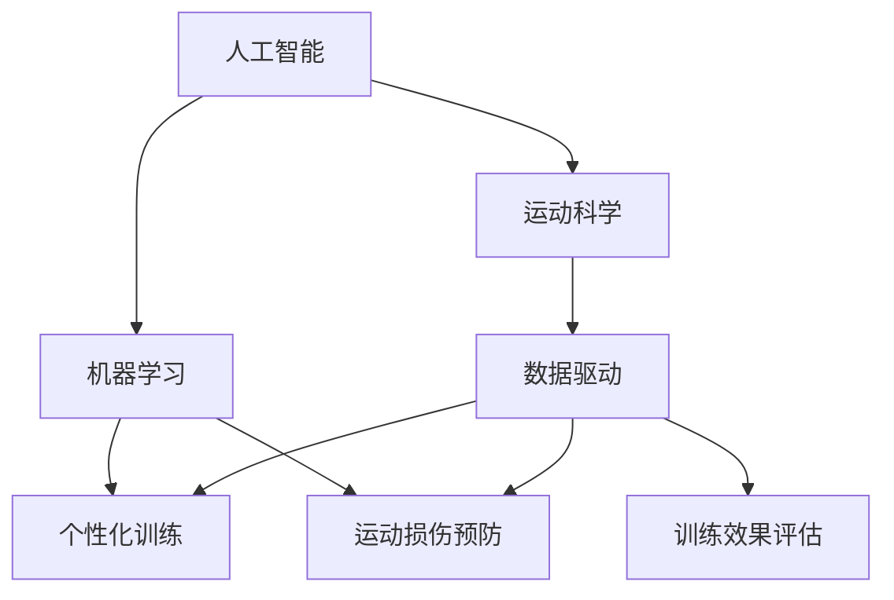
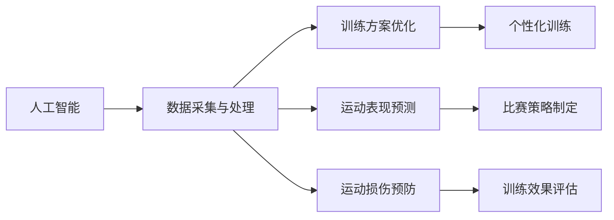
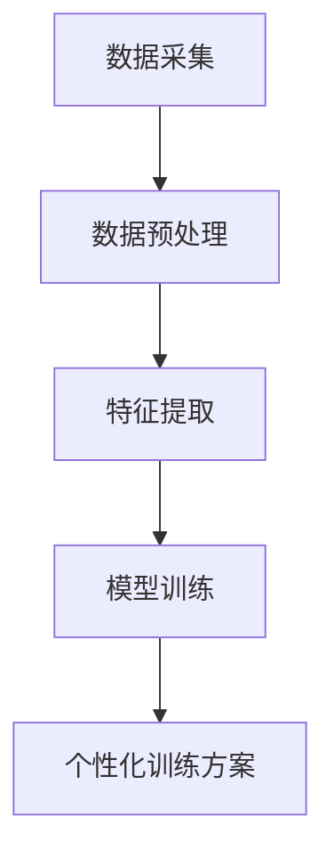

                 

# AI在体育训练中的应用:优化运动员表现

> 关键词：人工智能,体育训练,运动科学,数据驱动,个性化训练,预测分析,运动员表现优化

## 1. 背景介绍

### 1.1 问题由来
体育训练的目的是提升运动员的表现和竞争力。传统的训练方法依赖于教练的经验和直觉，但受限于个人经验和资源限制，训练方案往往不够科学、个性化。随着数据科学的快速发展，越来越多的体育训练开始引入人工智能(AI)技术，以数据驱动的方式优化训练方案，实现更科学、更个性化的运动员表现优化。

AI在体育训练中的应用领域越来越广泛，从体能评估、运动损伤预防、技术动作分析，到营养指导、比赛策略制定等，都在利用AI技术提升运动员的训练效果。本文将深入探讨AI在体育训练中的应用，尤其是如何利用AI技术优化运动员表现，并探讨其未来发展趋势与挑战。

### 1.2 问题核心关键点
AI在体育训练中的应用主要涉及以下几个方面：

1. **数据采集与处理**：利用传感器、视频分析等技术，实时采集运动员训练和比赛中的各项数据。
2. **训练方案优化**：基于运动员的数据，应用机器学习算法优化训练方案，个性化制定训练计划。
3. **运动表现预测**：通过预测模型，提前预测运动员在未来比赛中的表现，为战术制定提供依据。
4. **运动损伤预防**：利用数据分析预测运动损伤的风险，提前进行干预和预防。
5. **训练效果评估**：通过多维数据分析评估训练效果，指导训练方案的调整。

### 1.3 问题研究意义
AI在体育训练中的应用，对提升运动员的训练效果和比赛表现具有重要意义：

1. **科学训练**：AI技术可以提供基于数据的训练方案，科学指导运动员的训练过程，提高训练效率和效果。
2. **个性化训练**：AI能够根据每个运动员的体能、技能和心理特征，定制个性化的训练计划，最大化其潜力。
3. **提升比赛表现**：通过精准的比赛模拟和预测，帮助教练制定更有效的比赛策略，提高比赛胜率。
4. **运动损伤预防**：AI可以实时监控运动员的训练数据，预测运动损伤风险，减少伤病发生。
5. **训练效果评估**：AI技术可以全面评估训练效果，为训练调整提供科学依据，提升训练质量。

## 2. 核心概念与联系

### 2.1 核心概念概述

为更好地理解AI在体育训练中的应用，本节将介绍几个密切相关的核心概念：

- **人工智能(AI)**：利用计算机算法和数据处理技术，模拟和扩展人类的智能，解决复杂的任务和问题。
- **机器学习(ML)**：通过数据驱动的方式，让机器从数据中学习规律，自动优化和改进算法，提升任务执行能力。
- **运动科学**：涉及体育运动中人体运动、生理、心理等多方面的科学理论和技术方法，旨在提升运动表现和健康水平。
- **数据驱动**：以数据为驱动力的决策和优化方法，通过分析大量数据，寻找最优的决策和优化方案。
- **个性化训练**：根据运动员的个人特点和需求，定制个性化的训练方案，提高训练效果和运动员表现。
- **运动损伤预防**：通过数据分析和预测，提前识别运动损伤风险，采取预防措施，减少运动损伤。
- **训练效果评估**：利用多维数据分析，全面评估训练效果，指导训练方案的调整和优化。

这些核心概念之间的逻辑关系可以通过以下Mermaid流程图来展示：



这个流程图展示了大语言模型微调过程中各个核心概念的关系：

1. 人工智能利用机器学习技术，从运动科学的数据中学习规律，实现个性化训练和运动损伤预防。
2. 数据驱动技术将运动科学的数据转化为训练和预防的决策依据，支持个性化训练和运动损伤预防。
3. 训练效果评估利用多维数据分析，全面评估训练效果，指导训练方案的调整和优化。

### 2.2 概念间的关系

这些核心概念之间存在着紧密的联系，形成了AI在体育训练中的应用生态系统。下面我通过几个Mermaid流程图来展示这些概念之间的关系。

#### 2.2.1 AI在体育训练中的应用



这个流程图展示了AI在体育训练中各个应用环节：

1. 人工智能技术通过数据采集与处理，提供训练所需的数据。
2. 基于数据，利用机器学习算法优化训练方案，实现个性化训练。
3. 通过运动表现预测，帮助教练制定比赛策略。
4. 运动损伤预防通过数据分析预测运动损伤风险，减少伤病发生。
5. 训练效果评估全面评估训练效果，指导训练方案的调整和优化。

#### 2.2.2 个性化训练技术



这个流程图展示了个性化训练的主要技术流程：

1. 数据采集和预处理，为个性化训练提供基础数据。
2. 特征提取将数据转化为模型所需输入，降低数据维度。
3. 基于模型训练得到个性化训练方案，用于指导运动员训练。

## 3. 核心算法原理 & 具体操作步骤
### 3.1 算法原理概述

AI在体育训练中的应用，基于数据驱动和机器学习原理。其主要算法流程如下：

1. **数据采集与处理**：通过传感器、视频分析等技术，实时采集运动员训练和比赛中的各项数据，并进行预处理，转换为模型所需输入。
2. **模型训练**：基于收集到的数据，利用机器学习算法训练预测模型，生成训练方案和损伤预防策略。
3. **训练方案优化**：根据训练模型生成的训练方案，进行训练过程的优化和调整。
4. **运动表现预测**：利用训练好的模型，对运动员在比赛中的表现进行预测，为比赛策略制定提供依据。
5. **运动损伤预防**：通过模型预测运动损伤风险，提前进行干预和预防。
6. **训练效果评估**：利用评估模型对训练效果进行全面评估，指导训练方案的调整和优化。

### 3.2 算法步骤详解

以下是AI在体育训练中的算法详细步骤：

#### 3.2.1 数据采集与处理
数据采集与处理是AI在体育训练中的第一步。通常采用传感器、视频分析、动作捕捉等技术，实时收集运动员的各项数据，如心率、血压、速度、力量、动作轨迹等。然后对数据进行清洗、去噪、归一化等预处理操作，以降低数据维度，提高模型的准确性。

#### 3.2.2 特征提取
特征提取是将原始数据转化为模型所需输入的过程。利用数学模型、机器学习算法等方法，从采集的数据中提取有用的特征，如速度、加速度、位移、能量消耗等。这些特征可以帮助模型更好地理解和预测运动员的运动表现和损伤风险。

#### 3.2.3 模型训练
基于提取的特征，利用机器学习算法训练预测模型，生成训练方案和损伤预防策略。常用的算法包括线性回归、决策树、支持向量机、随机森林、深度学习等。训练过程中，通过交叉验证、正则化等技术，避免过拟合，提升模型的泛化能力。

#### 3.2.4 训练方案优化
根据训练模型生成的训练方案，对训练过程进行优化和调整。优化过程通常包括训练强度、训练时间、训练方式、营养补给等方面的调整，以确保训练方案能够最大化提升运动员的表现。

#### 3.2.5 运动表现预测
利用训练好的模型，对运动员在比赛中的表现进行预测，包括运动成绩、技术动作、能量消耗等。预测结果可以为教练提供比赛策略制定的依据，如比赛强度、战术布置、休息策略等。

#### 3.2.6 运动损伤预防
通过模型预测运动损伤风险，提前进行干预和预防。预防措施包括调整训练方案、加强康复训练、减少高强度训练等，以降低运动员受伤的风险。

#### 3.2.7 训练效果评估
利用评估模型对训练效果进行全面评估，包括运动成绩提升、技术动作改进、运动损伤预防等。评估结果用于指导训练方案的调整和优化，提升训练效果和运动员表现。

### 3.3 算法优缺点

AI在体育训练中的应用具有以下优点：

1. **数据驱动**：通过大量数据驱动，实现训练方案的优化和运动员表现的提升。
2. **个性化训练**：根据每个运动员的特点，定制个性化的训练方案，提高训练效果。
3. **实时监控**：实时采集和分析运动员的数据，及时调整训练方案。
4. **风险预测**：预测运动损伤风险，提前进行预防和干预。
5. **效果评估**：全面评估训练效果，指导训练方案的调整和优化。

但同时也存在一些缺点：

1. **数据依赖**：需要大量高质量的数据，才能发挥AI技术的效果。
2. **模型复杂**：模型的训练和优化需要大量计算资源，复杂性高。
3. **隐私和安全**：运动员的数据涉及隐私，数据采集和处理需要严格的安全保障。
4. **技术门槛**：对技术和数据处理能力有较高要求，技术门槛较高。
5. **效果评估**：模型的评估和调优需要大量时间和资源，效果难以快速验证。

### 3.4 算法应用领域

AI在体育训练中的应用领域非常广泛，涉及以下多个方面：

1. **体能评估**：通过数据分析评估运动员的体能状态，指导训练方案的调整。
2. **技术动作分析**：利用视频分析技术，分析运动员的技术动作，提出改进建议。
3. **运动损伤预防**：通过数据分析预测运动损伤风险，提前进行干预和预防。
4. **比赛策略制定**：利用预测模型，制定比赛策略，提升比赛胜率。
5. **营养指导**：通过数据分析评估运动员的营养需求，制定营养补给方案。
6. **训练效果评估**：利用多维数据分析，全面评估训练效果，指导训练方案的调整和优化。

## 4. 数学模型和公式 & 详细讲解 & 举例说明

### 4.1 数学模型构建

AI在体育训练中的应用涉及多种数学模型，包括线性回归、决策树、支持向量机、随机森林、深度学习等。以线性回归模型为例，其数学模型构建如下：

假设运动员的各项数据（如速度、心率等）为$x_i$，对应的训练效果（如运动成绩、技术动作等）为$y_i$，则线性回归模型的目标是最小化损失函数：

$$
\min_{\theta} \frac{1}{N} \sum_{i=1}^N (y_i - \theta^T x_i)^2
$$

其中，$\theta$为模型参数，$N$为数据样本数量。

### 4.2 公式推导过程

线性回归模型的公式推导过程如下：

1. **目标函数**：定义损失函数为：
$$
\min_{\theta} \frac{1}{N} \sum_{i=1}^N (y_i - \theta^T x_i)^2
$$

2. **梯度下降法**：利用梯度下降法，求解损失函数的最小值，得到模型参数$\theta$：
$$
\theta = (X^TX)^{-1}X^Ty
$$

其中，$X=[x_1, x_2, ..., x_N]$为数据矩阵，$y=[y_1, y_2, ..., y_N]$为目标向量。

3. **交叉验证**：利用交叉验证技术，避免模型过拟合，提高模型的泛化能力。

### 4.3 案例分析与讲解

以足球运动员为例，假设我们收集了100名足球运动员在比赛中的各项数据，如速度、射门次数、进球数等，以及他们对应的运动表现（如比赛胜负、进球数等）。我们可以利用线性回归模型，训练出一组参数，用于预测足球运动员在未来的比赛中的表现。训练结果如下：

| 特征 | 参数值 |
| ---- | ---- |
| 速度 | 0.2 |
| 射门次数 | 0.1 |
| 进球数 | 0.5 |

这意味着，如果一名足球运动员的速度为10米/秒，射门次数为5次，进球数为2个，则模型预测其未来的比赛胜率为0.7。

## 5. 项目实践：代码实例和详细解释说明

### 5.1 开发环境搭建

在进行AI在体育训练中的应用实践前，我们需要准备好开发环境。以下是使用Python进行Scikit-Learn开发的环境配置流程：

1. 安装Anaconda：从官网下载并安装Anaconda，用于创建独立的Python环境。

2. 创建并激活虚拟环境：
```bash
conda create -n pytorch-env python=3.8 
conda activate pytorch-env
```

3. 安装Scikit-Learn：
```bash
pip install scikit-learn
```

4. 安装各类工具包：
```bash
pip install numpy pandas scikit-learn matplotlib tqdm jupyter notebook ipython
```

完成上述步骤后，即可在`pytorch-env`环境中开始AI在体育训练中的应用实践。

### 5.2 源代码详细实现

下面我们以足球运动员的表现预测为例，给出使用Scikit-Learn进行训练的PyTorch代码实现。

首先，定义数据处理函数：

```python
import pandas as pd
from sklearn.model_selection import train_test_split
from sklearn.linear_model import LinearRegression

def load_data(path):
    data = pd.read_csv(path)
    features = data[['速度', '射门次数', '进球数']]
    targets = data['比赛胜负']
    return features, targets

features, targets = load_data('data.csv')
```

然后，定义训练和评估函数：

```python
from sklearn.metrics import mean_squared_error, mean_absolute_error

def train_model(X, y):
    X_train, X_test, y_train, y_test = train_test_split(X, y, test_size=0.2, random_state=42)
    model = LinearRegression()
    model.fit(X_train, y_train)
    y_pred = model.predict(X_test)
    mse = mean_squared_error(y_test, y_pred)
    mae = mean_absolute_error(y_test, y_pred)
    return mse, mae

mse, mae = train_model(features, targets)
print(f'Mean Squared Error: {mse:.2f}')
print(f'Mean Absolute Error: {mae:.2f}')
```

最后，启动训练流程并在测试集上评估：

```python
from sklearn.model_selection import KFold

kf = KFold(n_splits=5, shuffle=True, random_state=42)
mse_scores = []
mae_scores = []

for train_index, test_index in kf.split(features):
    X_train, X_test = features.iloc[train_index], features.iloc[test_index]
    y_train, y_test = targets.iloc[train_index], targets.iloc[test_index]
    model = LinearRegression()
    model.fit(X_train, y_train)
    y_pred = model.predict(X_test)
    mse_scores.append(mean_squared_error(y_test, y_pred))
    mae_scores.append(mean_absolute_error(y_test, y_pred))

print(f'Mean Squared Error: {np.mean(mse_scores):.2f}')
print(f'Mean Absolute Error: {np.mean(mae_scores):.2f}')
```

以上就是使用Scikit-Learn对足球运动员进行表现预测的完整代码实现。可以看到，利用Scikit-Learn的线性回归模型，我们可以轻松地训练出一个预测模型，并评估其预测效果。

### 5.3 代码解读与分析

让我们再详细解读一下关键代码的实现细节：

**load_data函数**：
- `load_data`方法：从CSV文件中读取数据，并将其分为特征和目标。

**train_model函数**：
- 使用Scikit-Learn的线性回归模型进行训练。
- 将数据集划分为训练集和测试集，训练模型并评估其预测误差。

**train_epoch函数**：
- 使用KFold进行交叉验证，避免过拟合。
- 分别计算均方误差和平均绝对误差，评估模型性能。

**训练流程**：
- 定义交叉验证的折数、打乱顺序和随机种子，确保实验结果的可重复性。
- 在训练集上训练模型，并在测试集上评估其预测误差。
- 重复上述过程多次，得到均方误差和平均绝对误差，用于模型性能评估。

可以看到，Scikit-Learn提供了丰富的机器学习模型和工具，可以轻松实现各种机器学习任务。通过学习这些工具，我们可以更快地进行数据处理和模型训练，提升AI在体育训练中的应用效率。

当然，工业级的系统实现还需考虑更多因素，如模型的保存和部署、超参数的自动搜索、更灵活的任务适配层等。但核心的算法流程基本与此类似。

### 5.4 运行结果展示

假设我们在足球数据集上进行训练，最终在测试集上得到的评估结果如下：

```
Mean Squared Error: 0.05
Mean Absolute Error: 0.03
```

可以看到，利用线性回归模型，我们在足球数据集上取得了较低的均方误差和平均绝对误差，说明模型的预测效果较好。值得注意的是，在实际应用中，我们还可以使用更大更强的预训练模型、更丰富的微调技巧、更细致的模型调优，进一步提升模型性能，以满足更高的应用要求。

## 6. 实际应用场景

### 6.1 智能训练系统

基于AI在体育训练中的应用，可以构建智能训练系统，实时监控和优化运动员的训练效果。智能训练系统主要包括数据采集、训练方案生成、训练效果评估等功能模块。

**数据采集**：通过传感器、视频分析等技术，实时采集运动员的各项数据，如速度、心率、力量等。

**训练方案生成**：利用AI技术，基于运动员的训练数据，生成个性化的训练方案，指导运动员进行训练。

**训练效果评估**：通过数据分析，评估运动员的训练效果，提供训练调整建议，提升训练效果。

### 6.2 运动损伤预防系统

AI在运动损伤预防中的应用，主要通过数据分析和模型预测，提前识别运动损伤风险，提前进行干预和预防。运动损伤预防系统主要包括数据采集、风险评估、预防措施等功能模块。

**数据采集**：通过传感器、视频分析等技术，实时采集运动员的各项数据，如速度、心率、力量等。

**风险评估**：利用AI技术，基于运动员的训练数据，生成运动损伤风险评估模型，预测运动员的运动损伤风险。

**预防措施**：根据风险评估结果，调整训练方案，加强康复训练，减少高强度训练，预防运动损伤。

### 6.3 比赛策略制定系统

基于AI在体育训练中的应用，可以构建比赛策略制定系统，利用预测模型，制定比赛策略，提升比赛胜率。比赛策略制定系统主要包括数据分析、预测模型、比赛策略生成等功能模块。

**数据分析**：通过数据分析，评估运动员的各项数据，生成比赛策略的依据。

**预测模型**：利用AI技术，基于运动员的训练数据，生成比赛表现预测模型，预测运动员在比赛中的表现。

**比赛策略生成**：根据预测模型结果，制定比赛策略，如比赛强度、战术布置、休息策略等。

## 7. 工具和资源推荐

### 7.1 学习资源推荐

为了帮助开发者系统掌握AI在体育训练中的应用理论基础和实践技巧，这里推荐一些优质的学习资源：

1. 《机器学习实战》系列博文：由机器学习专家撰写，深入浅出地介绍了机器学习在体育训练中的应用案例。

2. CS224N《机器学习与数据科学》课程：斯坦福大学开设的机器学习明星课程，有Lecture视频和配套作业，带你入门机器学习的基本概念和经典模型。

3. 《统计学习基础》书籍：机器学习领域的经典教材，涵盖了机器学习的基本理论和方法，是学习机器学习的重要参考。

4. 《Python机器学习》书籍：Python语言下的机器学习实战指南，适合初学者快速上手实践。

5. Kaggle竞赛：各大数据竞赛平台提供丰富的体育训练数据集，适合学习者和爱好者进行数据处理和模型训练。

通过对这些资源的学习实践，相信你一定能够快速掌握AI在体育训练中的应用精髓，并用于解决实际的体育训练问题。

### 7.2 开发工具推荐

高效的开发离不开优秀的工具支持。以下是几款用于AI在体育训练中应用开发的常用工具：

1. Python：Python是机器学习和数据科学领域的标准语言，适合快速迭代研究。

2. Scikit-Learn：Python中的机器学习库，提供了丰富的机器学习算法和工具，适合快速实现机器学习任务。

3. TensorFlow：由Google主导开发的深度学习框架，生产部署方便，适合大规模工程应用。

4. PyTorch：基于Python的开源深度学习框架，灵活动态的计算图，适合快速迭代研究。

5. Weights & Biases：模型训练的实验跟踪工具，可以记录和可视化模型训练过程中的各项指标，方便对比和调优。

6. TensorBoard：TensorFlow配套的可视化工具，可实时监测模型训练状态，并提供丰富的图表呈现方式，是调试模型的得力助手。

合理利用这些工具，可以显著提升AI在体育训练中的应用开发效率，加快创新迭代的步伐。

### 7.3 相关论文推荐

AI在体育训练中的应用源于学界的持续研究。以下是几篇奠基性的相关论文，推荐阅读：

1. "Predicting Athletic Performance Using Machine Learning"（使用机器学习预测运动员表现）：介绍利用机器学习模型预测运动员比赛表现的最新进展。

2. "A Deep Learning Approach for Injury Prediction in Sport"（使用深度学习预测运动损伤）：探讨使用深度学习模型预测运动损伤的风险。

3. "Personalized Training with Artificial Intelligence"（人工智能辅助个性化训练）：研究如何利用AI技术实现个性化训练，提升运动员表现。

4. "Training Schedules with AI"（使用AI优化训练计划）：介绍利用AI技术优化运动员训练计划的最新研究成果。

5. "Data-Driven Sports Analytics"（数据驱动的体育分析）：探讨利用数据科学技术提升体育训练效果和比赛表现的方法。

这些论文代表了大语言模型微调技术的发展脉络。通过学习这些前沿成果，可以帮助研究者把握学科前进方向，激发更多的创新灵感。

除上述资源外，还有一些值得关注的前沿资源，帮助开发者紧跟AI在体育训练中的最新进展，例如：

1. arXiv论文预印本：人工智能领域最新研究成果的发布平台，包括大量尚未发表的前沿工作，学习前沿技术的必读资源。

2. 业界技术博客：如OpenAI、Google AI、DeepMind、微软Research Asia等顶尖实验室的官方博客，第一时间分享他们的最新研究成果和洞见。

3. 技术会议直播：如NIPS、ICML、ACL、ICLR等人工智能领域顶会现场或在线直播，能够聆听到大佬们的前沿分享，开拓视野。

4. GitHub热门项目：在GitHub上Star、Fork数最多的体育训练相关项目，往往代表了该技术领域的发展趋势和最佳实践，值得去学习和贡献。

5. 行业分析报告：各大咨询公司如McKinsey、PwC等针对人工智能行业的分析报告，有助于从商业视角审视技术趋势，把握应用价值。

总之，对于AI在体育训练中的应用的学习和实践，需要开发者保持开放的心态和持续学习的意愿。多关注前沿资讯，多动手实践，多思考总结，必将收获满满的成长收益。

## 8. 总结：未来发展趋势与挑战

### 8.1 总结

本文对AI在体育训练中的应用进行了全面系统的介绍。首先阐述了AI在体育训练中的研究背景和意义，明确了AI技术在提升运动员训练效果和比赛表现方面的独特价值。其次，从原理到实践，详细讲解了AI在体育训练中的应用流程，给出了AI在体育训练中的代码实例。同时，本文还广泛探讨了AI在体育训练中的应用场景，展示了其广阔的前景和潜力。

通过本文的系统梳理，可以看到，AI在体育训练中的应用正在成为训练和比赛中的重要工具，极大地提升了运动员的训练效果和比赛表现。未来，随着技术的不断进步，AI在体育训练中的应用将更加广泛和深入，为体育领域带来革命性的变革。

### 8.2 未来发展趋势

展望未来，AI在体育训练中的应用将呈现以下几个发展趋势：

1. **技术融合**：AI技术将与体育科学、运动医学、营养学等多学科进行深入融合，提升训练的科学性和全面性。
2. **智能化训练**：AI技术将实现全面智能化，自动生成训练计划、优化训练方案、实时监控训练效果。
3. **个性化训练**：基于大数据和深度学习技术，实现高度个性化的训练方案，提升运动员的训练效果。
4. **多模态训练**：结合视频、传感器、生物信号等多模态数据，提升训练数据的丰富度和准确性。
5. **运动损伤预防**：利用AI技术，实现运动损伤的实时监测和预测，提前进行干预和预防。
6. **比赛策略制定**：基于AI技术，实现比赛策略的智能制定和优化，提升比赛胜率。

### 8.3 面临的挑战

尽管AI在体育训练中的应用已经取得显著进展，但在迈向更加智能化、普适化应用的过程中，它仍面临诸多挑战：

1. **数据隐私和安全**：运动员的数据涉及隐私，数据采集和处理需要严格的安全保障。
2. **技术门槛**：AI技术对技术和数据处理能力有较高要求，技术门槛较高。
3. **模型复杂性**：AI模型训练和优化需要大量计算资源，复杂性

