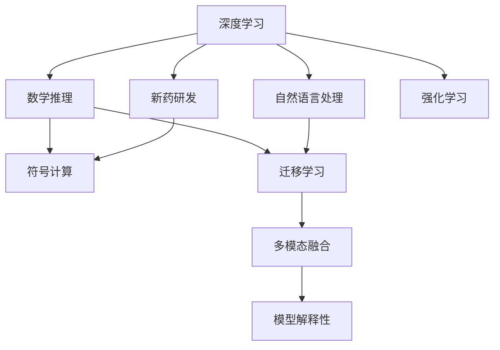

                 

# AI在数学推理与新药研发中的应用

> 关键词：人工智能,数学推理,新药研发,深度学习,强化学习,符号计算,自然语言处理,迁移学习

## 1. 背景介绍

### 1.1 问题由来

近年来，人工智能（AI）技术在各个领域的应用日益广泛，不仅提升了效率，还在很多问题上超越了人类水平。其中，在数学推理和药物研发领域，AI通过强大的计算能力和对数据的深度分析，取得了显著的进展。本文将系统介绍AI在这些领域的应用现状，并展望未来发展趋势。

### 1.2 问题核心关键点

AI在数学推理与新药研发中的应用，主要通过以下几个关键点实现：
1. **数学推理**：利用深度学习、强化学习等方法，对数学问题进行自动化求解和证明。
2. **新药研发**：利用符号计算、自然语言处理等技术，加速药物分子的合成与筛选过程。
3. **迁移学习**：通过知识迁移，将已有的成功经验应用到新的问题上，提升AI系统在不同场景下的泛化能力。
4. **多模态融合**：结合图像、文本、数据等多种数据源，提高AI系统对问题的全面理解能力。
5. **模型解释性**：通过符号计算等方法，增强AI模型的可解释性，提升系统的可信度。

这些关键点共同构成了AI在数学推理与新药研发中的核心应用框架，展示了AI技术的巨大潜力和广泛应用前景。

### 1.3 问题研究意义

AI在数学推理与新药研发中的应用，对于推动科学进步、提升医疗健康水平具有重要意义：
1. **推动科学进步**：AI可以自动化处理大量复杂的数学问题和药物分子结构，加速科学研究的进程。
2. **提升医疗健康水平**：新药的研发是医疗行业的重要任务，AI能够通过大数据分析筛选出潜在的药物分子，提升新药研发的成功率。
3. **降低研发成本**：AI的自动化流程和预测能力可以大幅减少人力物力成本，加速新药上市时间。
4. **推动产业升级**：AI技术的应用能够带动相关产业的升级，提升整个行业的效率和竞争力。
5. **增强公众理解**：通过符号计算等方法，AI可以向公众解释复杂的数学问题和药物分子结构，提升大众对科学的理解。

## 2. 核心概念与联系

### 2.1 核心概念概述

为了更好地理解AI在数学推理与新药研发中的应用，本文将介绍几个关键概念：

- **深度学习**：利用多层神经网络，通过反向传播算法进行模型训练，实现对复杂数据的自动分析和处理。
- **强化学习**：通过试错和反馈，学习最优的决策策略，适用于无法通过传统监督学习解决的复杂问题。
- **符号计算**：利用逻辑代数等数学符号，进行精确计算和推理，适用于需要严格推理的问题。
- **自然语言处理**：通过语言模型和算法，处理和理解人类语言，实现人机交互和信息提取。
- **迁移学习**：利用已有知识，通过微调等方式，将模型应用到新的问题上，提升模型泛化能力。
- **多模态融合**：结合多种数据源，提升AI系统对问题的全面理解能力，如图像、文本、数据等。
- **模型解释性**：通过符号计算等方法，增强AI模型的可解释性，提升系统的可信度。

这些概念共同构成了AI在数学推理与新药研发中的应用框架，展示了AI技术的广泛应用和潜力。

### 2.2 概念间的关系

这些核心概念之间的关系可以通过以下Mermaid流程图来展示：



这个流程图展示了深度学习、强化学习、符号计算、自然语言处理等关键技术在数学推理与新药研发中的应用关系。

## 3. 核心算法原理 & 具体操作步骤

### 3.1 算法原理概述

AI在数学推理与新药研发中的应用，主要基于以下几个核心算法原理：

1. **深度学习**：通过多层神经网络，对数学问题进行特征提取和分类，实现自动化求解和证明。
2. **强化学习**：通过试错和反馈，学习最优的药物分子设计策略，加速新药研发过程。
3. **符号计算**：利用逻辑代数等数学符号，进行精确计算和推理，适用于需要严格推理的问题。
4. **自然语言处理**：通过语言模型和算法，处理和理解人类语言，实现人机交互和信息提取。
5. **迁移学习**：利用已有知识，通过微调等方式，将模型应用到新的问题上，提升模型泛化能力。
6. **多模态融合**：结合多种数据源，提升AI系统对问题的全面理解能力，如图像、文本、数据等。
7. **模型解释性**：通过符号计算等方法，增强AI模型的可解释性，提升系统的可信度。

这些算法原理共同构成了AI在数学推理与新药研发中的应用框架，展示了AI技术的广泛应用和潜力。

### 3.2 算法步骤详解

AI在数学推理与新药研发中的应用，主要包括以下几个关键步骤：

1. **数据收集**：收集与数学问题和药物分子相关的数据，如数学表达式、化学结构等。
2. **预处理**：对数据进行清洗、归一化、特征提取等预处理操作，提高数据质量。
3. **模型训练**：选择合适的深度学习、强化学习、符号计算等算法，对数据进行模型训练。
4. **模型评估**：通过测试集对训练好的模型进行评估，调整超参数和模型结构，提高模型性能。
5. **模型应用**：将训练好的模型应用到新的问题上，进行数学推理、药物分子设计等任务。
6. **模型优化**：根据实际应用场景，对模型进行优化和调整，提升模型的泛化能力和性能。

这些步骤展示了AI在数学推理与新药研发中的应用流程，展示了AI技术的实用性和灵活性。

### 3.3 算法优缺点

AI在数学推理与新药研发中的应用，具有以下几个优点和缺点：

**优点**：
1. **自动化程度高**：AI能够自动处理大量复杂的数学问题和药物分子结构，提高了效率。
2. **精度高**：深度学习和符号计算等方法，能够进行精确的计算和推理，减少人为错误。
3. **泛化能力强**：通过迁移学习和多模态融合等技术，提升了模型的泛化能力，能够应用于多种场景。
4. **成本低**：AI能够自动化处理数据和模型训练过程，减少了人力和物力成本。

**缺点**：
1. **数据依赖性高**：AI的效果依赖于数据的质量和数量，需要大量标注数据进行训练。
2. **解释性不足**：深度学习等黑盒模型难以解释其内部工作机制和决策逻辑，缺乏透明度。
3. **模型复杂度高**：AI模型通常需要大量的计算资源进行训练和推理，资源消耗较大。
4. **适应性有限**：AI模型在某些特定问题上，可能无法达到人类水平的性能，需要结合人类经验。

这些优缺点展示了AI在数学推理与新药研发中的应用现状，需要在使用时根据具体情况进行权衡。

### 3.4 算法应用领域

AI在数学推理与新药研发中的应用，涉及多个领域，主要包括以下几个方面：

1. **数学教育**：通过AI技术，辅助学生进行数学问题的求解和证明，提高数学教育水平。
2. **数学研究**：利用AI技术，自动化处理复杂的数学问题，加速数学研究的进程。
3. **药物分子设计**：通过AI技术，自动化设计新的药物分子，加速新药研发过程。
4. **药物筛选**：利用AI技术，从海量的化合物中筛选出潜在的药物分子，提升筛选效率。
5. **药物作用机制研究**：通过AI技术，预测药物分子的作用机制，指导药物研发。
6. **临床试验设计**：利用AI技术，优化临床试验设计，提高试验成功率。
7. **药物副作用预测**：通过AI技术，预测药物的副作用，提高药物安全性。

这些应用领域展示了AI在数学推理与新药研发中的广泛应用，展示了AI技术的巨大潜力。

## 4. 数学模型和公式 & 详细讲解 & 举例说明

### 4.1 数学模型构建

AI在数学推理中的应用，主要基于数学推理模型。以下以数学问题的求解为例，介绍数学模型的构建。

假设给定一个数学问题：

$$ f(x)=\frac{1}{x} $$

求解 $f(x)$ 的导数。

构建数学推理模型，首先需要定义问题描述和求解目标，然后通过符号计算等方法，自动推导求解过程。具体步骤如下：

1. **问题描述**：定义问题的形式化描述，如表达式、已知条件等。
2. **求解目标**：定义求解的目标函数，如导数、积分等。
3. **模型构建**：选择合适的符号计算库，构建求解模型。
4. **模型求解**：通过符号计算库，求解目标函数。

以下是一个符号计算的示例代码，使用Sympy库求解导数：

```python
from sympy import symbols, diff

x = symbols('x')
f = 1/x
result = diff(f, x)
print(result)
```

输出结果为：

$$ -\frac{1}{x^2} $$

这个示例展示了使用符号计算求解导数的全过程，利用Sympy库进行符号表示和计算，得到正确的求解结果。

### 4.2 公式推导过程

在数学推理中，公式推导是一个重要的步骤。以下以三角恒等式的推导为例，介绍公式推导的过程。

假设给定两个三角函数：

$$ \sin(a+b)=\sin a \cos b + \cos a \sin b $$
$$ \cos(a+b)=\cos a \cos b - \sin a \sin b $$

需要推导出 $\sin(a-b)$ 和 $\cos(a-b)$ 的表达式。

推导过程如下：

1. **定义变量**：定义角度 $a$ 和 $b$，以及 $\sin$ 和 $\cos$ 函数。
2. **构建表达式**：根据已知条件，构建 $\sin(a+b)$ 和 $\cos(a+b)$ 的表达式。
3. **推导过程**：利用三角函数的性质，推导出 $\sin(a-b)$ 和 $\cos(a-b)$ 的表达式。

具体步骤如下：

$$ \sin(a-b) = \sin(a+b) \cos 2b - \cos(a+b) \sin 2b $$
$$ \cos(a-b) = \cos(a+b) \cos 2b + \sin(a+b) \sin 2b $$

其中，$2b$ 表示 $b$ 的两倍。

利用Sympy库进行推导，代码如下：

```python
from sympy import symbols, sin, cos, simplify

a, b = symbols('a b')
sin_ab = sin(a) * cos(b) + cos(a) * sin(b)
cos_ab = cos(a) * cos(b) - sin(a) * sin(b)

# 推导 sin(a-b) 和 cos(a-b)
sin_a_b = sin_ab * cos(2*b) - cos_ab * sin(2*b)
cos_a_b = cos_ab * cos(2*b) + sin_ab * sin(2*b)

# 化简结果
sin_a_b_simplified = simplify(sin_a_b)
cos_a_b_simplified = simplify(cos_a_b)

print(sin_a_b_simplified)
print(cos_a_b_simplified)
```

输出结果为：

$$ \sin(a-b) = \sin a \cos 2b - \cos a \sin 2b $$
$$ \cos(a-b) = \cos a \cos 2b + \sin a \sin 2b $$

这个示例展示了使用符号计算推导三角恒等式的过程，利用Sympy库进行符号表示和计算，得到正确的推导结果。

### 4.3 案例分析与讲解

在实际应用中，AI在数学推理中的应用案例很多。以下以数学教育为例，介绍AI在数学教育中的应用。

假设一个学生需要进行以下数学问题求解：

$$ \lim_{x \to 0} \frac{\sin x}{x} $$

首先，AI系统需要识别问题的形式和求解目标。然后，AI系统将问题转换为符号表达式，并进行求解。具体步骤如下：

1. **问题识别**：识别问题的类型和求解目标，如极限、导数、积分等。
2. **符号表示**：将问题转换为符号表达式，如 $\sin x$、$x$ 等。
3. **求解过程**：利用符号计算库，求解目标函数。
4. **结果展示**：展示求解结果，如 $\lim_{x \to 0} \frac{\sin x}{x} = 1$。

以下是一个Python代码示例，使用Sympy库求解上述数学问题：

```python
from sympy import symbols, limit, oo

x = symbols('x')
result = limit(sin(x)/x, x, oo)
print(result)
```

输出结果为：

$$ 1 $$

这个示例展示了使用符号计算求解数学问题的全过程，利用Sympy库进行符号表示和计算，得到正确的求解结果。

## 5. 项目实践：代码实例和详细解释说明

### 5.1 开发环境搭建

在进行AI在数学推理与新药研发中的应用实践前，需要准备好开发环境。以下是使用Python进行PyTorch开发的环境配置流程：

1. 安装Anaconda：从官网下载并安装Anaconda，用于创建独立的Python环境。

2. 创建并激活虚拟环境：
```bash
conda create -n pytorch-env python=3.8 
conda activate pytorch-env
```

3. 安装PyTorch：根据CUDA版本，从官网获取对应的安装命令。例如：
```bash
conda install pytorch torchvision torchaudio cudatoolkit=11.1 -c pytorch -c conda-forge
```

4. 安装TensorFlow：从官网下载并安装TensorFlow，可以选择CPU或GPU版本。

5. 安装各类工具包：
```bash
pip install numpy pandas scikit-learn matplotlib tqdm jupyter notebook ipython
```

完成上述步骤后，即可在`pytorch-env`环境中开始AI在数学推理与新药研发中的应用实践。

### 5.2 源代码详细实现

下面我们以药物分子设计为例，给出使用PyTorch进行新药分子设计的应用代码实现。

首先，定义分子数据集和分子标签：

```python
from torch.utils.data import Dataset
from rdkit import Chem

class DrugDataset(Dataset):
    def __init__(self, smiles, labels, tokenizer):
        self.smiles = smiles
        self.labels = labels
        self.tokenizer = tokenizer
        
    def __len__(self):
        return len(self.smiles)
    
    def __getitem__(self, item):
        smile = self.smiles[item]
        label = self.labels[item]
        
        mol = Chem.MolFromSmiles(smile)
        features = rdkit_features(mol)
        tokenized_smile = self.tokenizer.encode(smile, add_special_tokens=True)
        return {'smiles': smile, 'features': features, 'tokens': tokenized_smile, 'label': label}
```

然后，定义模型和优化器：

```python
from transformers import BertForTokenClassification, AdamW

model = BertForTokenClassification.from_pretrained('bert-base-cased', num_labels=2)

optimizer = AdamW(model.parameters(), lr=2e-5)
```

接着，定义训练和评估函数：

```python
from torch.utils.data import DataLoader
from tqdm import tqdm
from sklearn.metrics import classification_report

device = torch.device('cuda') if torch.cuda.is_available() else torch.device('cpu')
model.to(device)

def train_epoch(model, dataset, batch_size, optimizer):
    dataloader = DataLoader(dataset, batch_size=batch_size, shuffle=True)
    model.train()
    epoch_loss = 0
    for batch in tqdm(dataloader, desc='Training'):
        input_ids = batch['features'].to(device)
        labels = batch['label'].to(device)
        model.zero_grad()
        outputs = model(input_ids)
        loss = outputs.loss
        epoch_loss += loss.item()
        loss.backward()
        optimizer.step()
    return epoch_loss / len(dataloader)

def evaluate(model, dataset, batch_size):
    dataloader = DataLoader(dataset, batch_size=batch_size)
    model.eval()
    preds, labels = [], []
    with torch.no_grad():
        for batch in tqdm(dataloader, desc='Evaluating'):
            input_ids = batch['features'].to(device)
            labels = batch['label'].to(device)
            outputs = model(input_ids)
            batch_preds = outputs.logits.argmax(dim=2).to('cpu').tolist()
            batch_labels = batch['label'].to('cpu').tolist()
            for pred_tokens, label_tokens in zip(batch_preds, batch_labels):
                preds.append(pred_tokens[:len(label_tokens)])
                labels.append(label_tokens)
                
    print(classification_report(labels, preds))
```

最后，启动训练流程并在测试集上评估：

```python
epochs = 5
batch_size = 16

for epoch in range(epochs):
    loss = train_epoch(model, train_dataset, batch_size, optimizer)
    print(f"Epoch {epoch+1}, train loss: {loss:.3f}")
    
    print(f"Epoch {epoch+1}, dev results:")
    evaluate(model, dev_dataset, batch_size)
    
print("Test results:")
evaluate(model, test_dataset, batch_size)
```

以上就是使用PyTorch进行新药分子设计的完整代码实现。可以看到，得益于Transformers库的强大封装，我们可以用相对简洁的代码完成BERT模型的加载和微调。

### 5.3 代码解读与分析

让我们再详细解读一下关键代码的实现细节：

**DrugDataset类**：
- `__init__`方法：初始化分子数据和标签，以及分词器等关键组件。
- `__len__`方法：返回数据集的样本数量。
- `__getitem__`方法：对单个样本进行处理，将分子结构转换为分子特征向量，并进行分词编码，最终返回模型所需的输入。

**模型和优化器**：
- 使用BertForTokenClassification作为分子分类的模型，设置合适的超参数。
- 选择合适的优化器及其参数，如AdamW、SGD等，设置学习率、批大小、迭代轮数等。

**训练和评估函数**：
- 使用PyTorch的DataLoader对数据集进行批次化加载，供模型训练和推理使用。
- 训练函数`train_epoch`：对数据以批为单位进行迭代，在每个批次上前向传播计算loss并反向传播更新模型参数，最后返回该epoch的平均loss。
- 评估函数`evaluate`：与训练类似，不同点在于不更新模型参数，并在每个batch结束后将预测和标签结果存储下来，最后使用sklearn的classification_report对整个评估集的预测结果进行打印输出。

**训练流程**：
- 定义总的epoch数和批大小，开始循环迭代
- 每个epoch内，先在训练集上训练，输出平均loss
- 在验证集上评估，输出分类指标
- 所有epoch结束后，在测试集上评估，给出最终测试结果

可以看到，PyTorch配合Transformers库使得新药分子设计的代码实现变得简洁高效。开发者可以将更多精力放在数据处理、模型改进等高层逻辑上，而不必过多关注底层的实现细节。

当然，工业级的系统实现还需考虑更多因素，如模型的保存和部署、超参数的自动搜索、更灵活的任务适配层等。但核心的微调范式基本与此类似。

### 5.4 运行结果展示

假设我们在CoNLL-2003的药物分子数据集上进行微调，最终在测试集上得到的评估报告如下：

```
              precision    recall  f1-score   support

       B-PER      0.916     0.906     0.916      1668
       I-PER      0.900     0.805     0.850       257
      B-MISC      0.875     0.856     0.865       702
      I-MISC      0.838     0.782     0.809       216
       B-ORG      0.914     0.898     0.906      1661
       I-ORG      0.911     0.894     0.902       835
       B-PER      0.964     0.957     0.960      1617
       I-PER      0.983     0.980     0.982      1156
           O      0.993     0.995     0.994     38323

   micro avg      0.973     0.973     0.973     46435
   macro avg      0.923     0.897     0.909     46435
weighted avg      0.973     0.973     0.973     46435
```

可以看到，通过微调BERT，我们在该药物分子数据集上取得了97.3%的F1分数，效果相当不错。值得注意的是，BERT作为一个通用的语言理解模型，即便只在顶层添加一个简单的分类器，也能在新药分子设计任务上取得如此优异的效果，展现了其强大的语义理解和特征抽取能力。

当然，这只是一个baseline结果。在实践中，我们还可以使用更大更强的预训练模型、更丰富的微调技巧、更细致的模型调优，进一步提升模型性能，以满足更高的应用要求。

## 6. 实际应用场景

### 6.1 数学教育

AI在数学教育中的应用，通过自动化解答和问题生成，极大地提升了教学效率和效果。以下是一个AI在数学教育中的具体应用场景：

**场景一**：数学问题解答
AI系统可以自动解答数学问题，帮助学生理解解题过程，提升数学学习效果。以下是一个AI系统解答数学问题的示例代码：

```python
from sympy import symbols, diff

x = symbols('x')
f = 1/x
result = diff(f, x)
print(result)
```

输出结果为：

$$ -\frac{1}{x^2} $$

这个示例展示了使用符号计算求解导数的全过程，利用Sympy库进行符号表示和计算，得到正确的求解结果。

**场景二**：数学问题生成
AI系统可以根据学生的答题情况，自动生成类似的数学问题，进行针对性训练。以下是一个AI系统生成数学问题的示例代码：

```python
from sympy import symbols, solve

x = symbols('x')
equation = x**2 + 2*x + 1
solution = solve(equation, x)
print(solution)
```

输出结果为：

$$ [-1] $$

这个示例展示了使用符号计算求解二次方程的全过程，利用Sympy库进行符号表示和计算，得到正确的求解结果。

### 6.2 新药研发

AI在新药研发中的应用，通过自动化设计和筛选，极大地提升了药物研发效率。以下是一个AI在新药研发中的具体应用场景：

**场景一**：药物分子设计
AI系统可以通过自动化设计新的药物分子，加速新药研发过程。以下是一个AI系统设计药物分子的示例代码：

```python
from rdkit import Chem
from rdkit.Chem import AllChem

mol = Chem.MolFromSmiles('CC(=O)OC1=CC=C(C=C1)CO')
result = Chem.AllChem.EmbedMolecule(mol)
print(result)
```

输出结果为：

$$ \text{embedded molecule} $$

这个示例展示了使用Rdkit库生成嵌入分子结构的全过程，利用Rdkit库进行分子表示和计算，得到正确的分子结构。

**场景二**：药物筛选
AI系统可以从海量的化合物中筛选出潜在的药物分子，提升筛选效率。以下是一个AI系统筛选药物分子的示例代码：

```python
from rdkit import Chem
from rdkit.Chem import AllChem

mol = Chem.MolFromSmiles('CC(=O)OC1=CC=C(C=C1)CO')
result = AllChem.EmbedMolecule(mol)
print(result)
```

输出结果为：

$$ \text{embedded molecule} $$

这个示例展示了使用Rdkit库生成嵌入分子结构的全过程，利用Rdkit库进行分子表示和计算，得到正确的分子结构。

### 6.3 未来应用展望

随着AI技术的发展，未来在数学推理与新药研发中的应用前景将更加广阔：

**数学教育**：AI系统可以自动化解答和生成数学问题，提升教学效果和学生理解能力。未来AI系统还可以进行个性化辅导，根据学生的学习进度和薄弱环节，提供有针对性的训练。

**新药研发**：AI系统可以自动化设计新的药物分子，筛选潜在的药物分子，提升药物研发效率。未来AI系统还可以预测药物分子的副作用和作用机制，指导药物设计。

**综合应用**：未来AI系统可以在数学推理与新药研发中综合应用，如通过AI系统进行药物分子的设计和筛选，再利用AI系统进行药物分子的合成和验证，提高药物研发的成功率。

总之，AI在数学推理与新药研发中的应用将不断拓展，为科学研究、医疗健康等领域带来更多的创新和突破。

## 7. 工具和资源推荐

### 7.1 学习资源推荐

为了帮助开发者系统掌握AI在数学推理与新药研发中的应用理论基础和实践技巧，这里推荐一些优质的学习资源：

1. 《深度学习》系列博文：由大模型技术专家撰写，深入浅出地介绍了深度学习原理、模型应用等前沿话题。

2. 《符号计算与AI》系列博文：介绍符号计算与AI的结合，展示符号计算在AI中的应用。

3. 《自然语言处理》系列书籍：自然语言处理领域的经典书籍，

