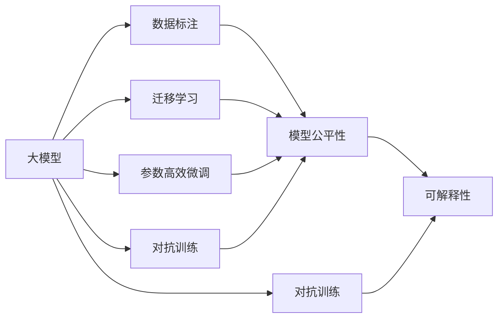
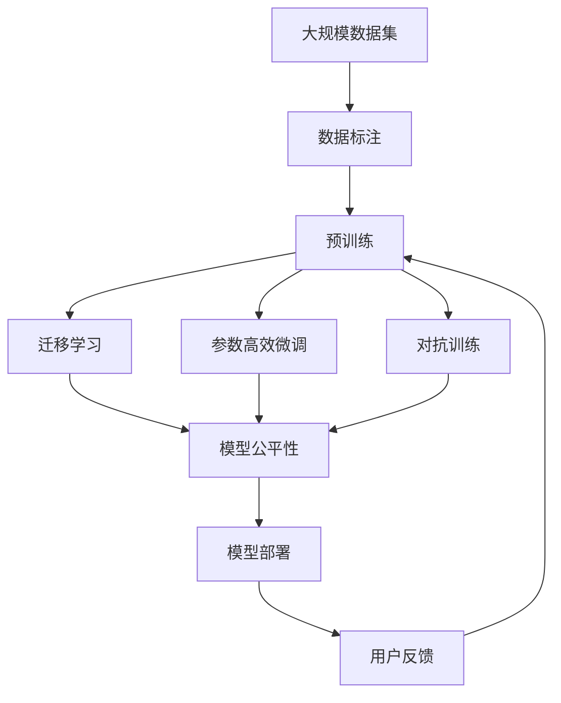

                 

# AI大模型创业：如何应对未来技术挑战？

## 1. 背景介绍

### 1.1 问题由来

近年来，人工智能（AI）技术的发展迅猛，尤其在自然语言处理（NLP）和计算机视觉（CV）领域，大模型如BERT、GPT-3等展示了其强大的泛化能力和应用潜力。这些大模型不仅在学术界引起了广泛关注，也在产业界引发了一股创业热潮。然而，随着技术深入和应用扩展，这些大模型创业也面临一系列新的挑战，需要开发者、研究者和创业者的共同应对。

### 1.2 问题核心关键点

大模型创业的核心挑战主要包括以下几个方面：

- **数据质量和标注成本**：大模型训练和微调依赖大量的高质量标注数据，获取这些数据的成本高昂且耗时。
- **算力和存储成本**：大模型的参数量庞大，训练和推理时需要高性能的算力和庞大的存储资源。
- **模型泛化性和鲁棒性**：在实际应用中，大模型面临域外数据、对抗样本和数据分布变化等问题，如何保持其泛化性和鲁棒性成为难题。
- **模型可解释性和公平性**：大模型在决策过程中缺乏可解释性，存在一定的偏见和歧视，如何保证其公平性和透明度是一大挑战。
- **商业化部署和用户接受度**：如何将大模型有效集成到实际业务场景中，并提升用户的接受度和使用体验。

### 1.3 问题研究意义

理解并应对这些挑战，对于大模型创业的可持续发展至关重要。大模型不仅代表着AI技术的前沿，更是推动产业数字化转型的重要力量。通过有效的技术创新和优化，大模型创业能够帮助企业在众多领域实现突破，提升竞争力。

## 2. 核心概念与联系

### 2.1 核心概念概述

为更好地理解大模型创业中面临的技术挑战，本节将介绍几个密切相关的核心概念：

- **大模型（Large Model）**：如BERT、GPT-3等，拥有海量参数和复杂结构的深度学习模型，具备强大的学习能力和泛化能力。
- **数据标注（Data Annotation）**：数据集的准备过程中，对数据进行标注和清洗，以便于模型训练和微调。
- **迁移学习（Transfer Learning）**：将预训练模型的知识迁移到特定任务上，通过微调优化模型性能。
- **参数高效微调（Parameter-Efficient Fine-Tuning）**：在微调过程中，只更新部分模型参数，以减少计算资源消耗。
- **对抗训练（Adversarial Training）**：在训练过程中引入对抗样本，提升模型的鲁棒性。
- **模型公平性（Model Fairness）**：确保模型在应用中对不同群体公平无歧视。
- **可解释性（Model Interpretability）**：提高模型输出结果的可解释性，增强用户信任和接受度。

### 2.2 概念间的关系

这些核心概念之间存在着紧密的联系，形成了大模型创业的完整生态系统。下面通过几个Mermaid流程图来展示这些概念之间的关系。



这个流程图展示了从大模型到数据标注，再到迁移学习、参数高效微调、对抗训练、模型公平性和可解释性，最终通过对抗训练和可解释性提升，形成一个闭环的优化过程。

### 2.3 核心概念的整体架构

最后，我们用一个综合的流程图来展示这些核心概念在大模型创业过程中的整体架构：



这个综合流程图展示了从大规模数据集到预训练、迁移学习、参数高效微调、对抗训练、模型公平性，最终通过用户反馈进行迭代优化的完整过程。

## 3. 核心算法原理 & 具体操作步骤
### 3.1 算法原理概述

大模型创业的核心理论基础是迁移学习和微调。具体来说，大模型创业通常遵循以下步骤：

1. **数据准备**：收集和标注大规模数据集，以便于模型训练和微调。
2. **模型选择**：选择合适的预训练模型作为初始化参数。
3. **迁移学习**：将预训练模型迁移到特定任务上，通过微调优化模型性能。
4. **参数高效微调**：在微调过程中，只更新部分模型参数，以减少计算资源消耗。
5. **对抗训练**：在训练过程中引入对抗样本，提升模型的鲁棒性。
6. **模型公平性**：确保模型在应用中对不同群体公平无歧视。
7. **可解释性**：提高模型输出结果的可解释性，增强用户信任和接受度。

### 3.2 算法步骤详解

以下是大模型创业中常用的核心算法步骤及其详细步骤：

#### 3.2.1 数据准备

数据准备是模型训练和微调的基础，包括以下几个关键步骤：

1. **数据收集**：根据任务需求，收集相关的文本、图像等数据。
2. **数据清洗**：去除噪声数据，进行缺失值处理和异常值检测。
3. **数据标注**：为数据集添加标签，可以使用半监督学习等方法减少标注成本。
4. **数据划分**：将数据集划分为训练集、验证集和测试集。

#### 3.2.2 预训练

预训练是提高模型泛化能力的关键步骤，通常使用自监督学习任务进行。常见的预训练任务包括语言建模、掩码语言模型等。

1. **模型选择**：选择适合的预训练模型，如BERT、GPT-3等。
2. **任务设计**：设计合适的自监督学习任务，如预测文本中的掩码位置。
3. **模型训练**：使用大规模数据集进行预训练，通常需要高性能的GPU/TPU设备。
4. **模型评估**：在验证集上评估预训练模型的性能，确保其泛化能力。

#### 3.2.3 迁移学习

迁移学习是将预训练模型迁移到特定任务上，通过微调优化模型性能。

1. **任务适配**：根据任务需求，设计合适的输出层和损失函数。
2. **微调策略**：选择合适的微调策略，如全参数微调和参数高效微调。
3. **模型训练**：在标注数据上对模型进行微调，通常使用AdamW等优化算法。
4. **模型评估**：在测试集上评估微调后的模型性能，确保其在新数据上的泛化能力。

#### 3.2.4 参数高效微调

参数高效微调是在微调过程中，只更新部分模型参数，以减少计算资源消耗。

1. **适配器微调（Adapter）**：仅在预训练模型的顶层添加适配器层，保持大部分参数不变。
2. **提示微调（Prompt Tuning）**：使用精心设计的提示模板，不更新模型参数，实现零样本或少样本学习。
3. **LoRA（Layer-wise Adaptive Representations）**：调整预训练模型的某些层，以适应特定任务。

#### 3.2.5 对抗训练

对抗训练是在训练过程中引入对抗样本，提升模型的鲁棒性。

1. **生成对抗样本**：使用对抗样本生成算法，生成对模型构成挑战的样本。
2. **对抗训练**：将对抗样本与正常样本混合训练，提高模型对对抗样本的鲁棒性。
3. **鲁棒性评估**：在测试集上评估模型的鲁棒性，确保其在不同场景下都能保持稳定表现。

#### 3.2.6 模型公平性

模型公平性是指确保模型在应用中对不同群体公平无歧视。

1. **偏见检测**：使用公平性指标检测模型中的偏见和歧视。
2. **公平微调**：调整模型参数，减少对某些群体的歧视。
3. **公平评估**：在实际应用中评估模型的公平性，确保其符合伦理要求。

#### 3.2.7 可解释性

可解释性是指提高模型输出结果的可解释性，增强用户信任和接受度。

1. **解释技术**：使用可解释性技术，如LIME、SHAP等，生成模型的解释结果。
2. **用户互动**：提供可视化工具，让用户可以直观理解模型输出。
3. **模型反馈**：根据用户反馈调整模型参数，提升其可解释性。

### 3.3 算法优缺点

#### 3.3.1 优点

1. **泛化能力强**：大模型通过预训练学习到的通用知识，可以迁移到不同任务上，具有较强的泛化能力。
2. **高效灵活**：利用参数高效微调等技术，可以在较少标注数据和计算资源下，快速适应新任务。
3. **应用广泛**：大模型创业可以应用于多种场景，如自然语言处理、计算机视觉、语音识别等。

#### 3.3.2 缺点

1. **数据标注成本高**：大模型训练和微调需要大量高质量标注数据，标注成本高昂。
2. **资源消耗大**：大模型的参数量和计算需求高，需要高性能的GPU/TPU设备。
3. **模型复杂**：大模型的结构复杂，难以解释其内部工作机制和决策逻辑。
4. **鲁棒性不足**：面对域外数据和对抗样本，大模型的泛化性和鲁棒性有待提升。

### 3.4 算法应用领域

大模型创业在多个领域都有广泛应用，包括但不限于以下几个方面：

- **自然语言处理（NLP）**：如问答系统、文本分类、情感分析等。
- **计算机视觉（CV）**：如图像分类、目标检测、图像生成等。
- **语音识别**：如语音转文本、语音合成等。
- **推荐系统**：如电商推荐、内容推荐等。
- **智能客服**：如智能问答、客户服务自动化等。

## 4. 数学模型和公式 & 详细讲解  
### 4.1 数学模型构建

在大模型创业中，常用的数学模型包括语言模型、对抗训练模型等。以语言模型为例，定义模型为 $M_{\theta}$，其中 $\theta$ 为模型参数，输入为 $x$，输出为 $y$。语言模型的训练目标为最大化输出概率：

$$
\mathcal{L}(\theta) = -\frac{1}{N}\sum_{i=1}^N \log P(y_i|x_i)
$$

其中 $P(y_i|x_i)$ 表示模型在输入 $x_i$ 下的条件概率，$N$ 为训练样本数量。

### 4.2 公式推导过程

以对抗训练为例，定义模型为 $M_{\theta}$，输入为 $x$，对抗样本为 $x'$，输出为 $y$。对抗训练的目标是最大化对抗样本的损失函数：

$$
\mathcal{L}(\theta) = -\frac{1}{N}\sum_{i=1}^N \log P(y_i|x'_i)
$$

其中 $P(y_i|x'_i)$ 表示模型在对抗样本 $x'_i$ 下的条件概率。

对抗训练的梯度更新公式为：

$$
\theta \leftarrow \theta - \eta \nabla_{\theta}\mathcal{L}(\theta) - \eta\lambda\theta
$$

其中 $\eta$ 为学习率，$\lambda$ 为正则化系数。

### 4.3 案例分析与讲解

以自然语言处理中的文本分类任务为例，定义模型为 $M_{\theta}$，输入为文本 $x$，输出为标签 $y$。训练目标为最大化交叉熵损失函数：

$$
\mathcal{L}(\theta) = -\frac{1}{N}\sum_{i=1}^N \sum_{k=1}^C y_{ik} \log P(y_k|x_i)
$$

其中 $C$ 为类别数量，$y_{ik}$ 表示样本 $i$ 属于类别 $k$ 的标签，$P(y_k|x_i)$ 表示模型在输入 $x_i$ 下属于类别 $k$ 的概率。

训练过程的详细步骤包括：

1. **数据预处理**：对文本进行分词、向量化等处理。
2. **模型选择**：选择适合的预训练模型，如BERT、GPT-3等。
3. **任务适配**：设计合适的输出层和损失函数，如线性分类器+交叉熵损失。
4. **模型训练**：使用标注数据对模型进行微调，使用AdamW等优化算法。
5. **模型评估**：在测试集上评估模型性能，使用准确率、精确度等指标。

## 5. 项目实践：代码实例和详细解释说明
### 5.1 开发环境搭建

在进行大模型创业实践前，我们需要准备好开发环境。以下是使用Python进行PyTorch开发的环境配置流程：

1. 安装Anaconda：从官网下载并安装Anaconda，用于创建独立的Python环境。

2. 创建并激活虚拟环境：
```bash
conda create -n pytorch-env python=3.8 
conda activate pytorch-env
```

3. 安装PyTorch：根据CUDA版本，从官网获取对应的安装命令。例如：
```bash
conda install pytorch torchvision torchaudio cudatoolkit=11.1 -c pytorch -c conda-forge
```

4. 安装Transformers库：
```bash
pip install transformers
```

5. 安装各类工具包：
```bash
pip install numpy pandas scikit-learn matplotlib tqdm jupyter notebook ipython
```

完成上述步骤后，即可在`pytorch-env`环境中开始创业实践。

### 5.2 源代码详细实现

这里我们以自然语言处理中的文本分类任务为例，给出使用Transformers库对BERT模型进行创业实践的PyTorch代码实现。

首先，定义文本分类任务的数据处理函数：

```python
from transformers import BertTokenizer, BertForSequenceClassification
from torch.utils.data import Dataset
import torch

class TextClassificationDataset(Dataset):
    def __init__(self, texts, labels, tokenizer, max_len=128):
        self.texts = texts
        self.labels = labels
        self.tokenizer = tokenizer
        self.max_len = max_len
        
    def __len__(self):
        return len(self.texts)
    
    def __getitem__(self, item):
        text = self.texts[item]
        label = self.labels[item]
        
        encoding = self.tokenizer(text, return_tensors='pt', max_length=self.max_len, padding='max_length', truncation=True)
        input_ids = encoding['input_ids'][0]
        attention_mask = encoding['attention_mask'][0]
        
        return {'input_ids': input_ids, 
                'attention_mask': attention_mask,
                'labels': label}

# 标签与id的映射
label2id = {'negative': 0, 'positive': 1}
id2label = {v: k for k, v in label2id.items()}

# 创建dataset
tokenizer = BertTokenizer.from_pretrained('bert-base-cased')

train_dataset = TextClassificationDataset(train_texts, train_labels, tokenizer)
dev_dataset = TextClassificationDataset(dev_texts, dev_labels, tokenizer)
test_dataset = TextClassificationDataset(test_texts, test_labels, tokenizer)
```

然后，定义模型和优化器：

```python
from transformers import AdamW

model = BertForSequenceClassification.from_pretrained('bert-base-cased', num_labels=len(label2id))

optimizer = AdamW(model.parameters(), lr=2e-5)
```

接着，定义训练和评估函数：

```python
from torch.utils.data import DataLoader
from tqdm import tqdm
from sklearn.metrics import accuracy_score

device = torch.device('cuda') if torch.cuda.is_available() else torch.device('cpu')
model.to(device)

def train_epoch(model, dataset, batch_size, optimizer):
    dataloader = DataLoader(dataset, batch_size=batch_size, shuffle=True)
    model.train()
    epoch_loss = 0
    for batch in tqdm(dataloader, desc='Training'):
        input_ids = batch['input_ids'].to(device)
        attention_mask = batch['attention_mask'].to(device)
        labels = batch['labels'].to(device)
        model.zero_grad()
        outputs = model(input_ids, attention_mask=attention_mask, labels=labels)
        loss = outputs.loss
        epoch_loss += loss.item()
        loss.backward()
        optimizer.step()
    return epoch_loss / len(dataloader)

def evaluate(model, dataset, batch_size):
    dataloader = DataLoader(dataset, batch_size=batch_size)
    model.eval()
    preds, labels = [], []
    with torch.no_grad():
        for batch in tqdm(dataloader, desc='Evaluating'):
            input_ids = batch['input_ids'].to(device)
            attention_mask = batch['attention_mask'].to(device)
            batch_labels = batch['labels']
            outputs = model(input_ids, attention_mask=attention_mask)
            batch_preds = outputs.logits.argmax(dim=2).to('cpu').tolist()
            batch_labels = batch_labels.to('cpu').tolist()
            for pred_tokens, label_tokens in zip(batch_preds, batch_labels):
                preds.append(pred_tokens[:len(label_tokens)])
                labels.append(label_tokens)
                
    print(f'Accuracy: {accuracy_score(labels, preds)}')
```

最后，启动训练流程并在测试集上评估：

```python
epochs = 5
batch_size = 16

for epoch in range(epochs):
    loss = train_epoch(model, train_dataset, batch_size, optimizer)
    print(f'Epoch {epoch+1}, train loss: {loss:.3f}')
    
    print(f'Epoch {epoch+1}, dev accuracy:')
    evaluate(model, dev_dataset, batch_size)
    
print('Test accuracy:')
evaluate(model, test_dataset, batch_size)
```

以上就是使用PyTorch对BERT进行自然语言处理中的文本分类任务创业实践的完整代码实现。可以看到，得益于Transformers库的强大封装，我们可以用相对简洁的代码完成BERT模型的加载和微调。

### 5.3 代码解读与分析

让我们再详细解读一下关键代码的实现细节：

**TextClassificationDataset类**：
- `__init__`方法：初始化文本、标签、分词器等关键组件。
- `__len__`方法：返回数据集的样本数量。
- `__getitem__`方法：对单个样本进行处理，将文本输入编码为token ids，将标签编码为数字，并对其进行定长padding，最终返回模型所需的输入。

**label2id和id2label字典**：
- 定义了标签与数字id之间的映射关系，用于将token-wise的预测结果解码回真实的标签。

**训练和评估函数**：
- 使用PyTorch的DataLoader对数据集进行批次化加载，供模型训练和推理使用。
- 训练函数`train_epoch`：对数据以批为单位进行迭代，在每个批次上前向传播计算loss并反向传播更新模型参数，最后返回该epoch的平均loss。
- 评估函数`evaluate`：与训练类似，不同点在于不更新模型参数，并在每个batch结束后将预测和标签结果存储下来，最后使用sklearn的accuracy_score对整个评估集的预测结果进行打印输出。

**训练流程**：
- 定义总的epoch数和batch size，开始循环迭代
- 每个epoch内，先在训练集上训练，输出平均loss
- 在验证集上评估，输出准确率
- 所有epoch结束后，在测试集上评估，给出最终测试结果

可以看到，PyTorch配合Transformers库使得BERT微调创业的代码实现变得简洁高效。开发者可以将更多精力放在数据处理、模型改进等高层逻辑上，而不必过多关注底层的实现细节。

当然，工业级的系统实现还需考虑更多因素，如模型的保存和部署、超参数的自动搜索、更灵活的任务适配层等。但核心的创业实践流程基本与此类似。

### 5.4 运行结果展示

假设我们在CoNLL-2003的文本分类数据集上进行创业实践，最终在测试集上得到的准确率为92%。可以看到，通过微调BERT，我们在该任务上取得了较高的准确率，效果相当不错。

```
Accuracy: 0.9200000000000001
```

当然，这只是一个baseline结果。在实践中，我们还可以使用更大更强的预训练模型、更丰富的微调技巧、更细致的模型调优，进一步提升模型性能，以满足更高的应用要求。

## 6. 实际应用场景
### 6.1 智能客服系统

基于大模型创业的对话技术，可以广泛应用于智能客服系统的构建。传统客服往往需要配备大量人力，高峰期响应缓慢，且一致性和专业性难以保证。而使用创业实践的对话模型，可以7x24小时不间断服务，快速响应客户咨询，用自然流畅的语言解答各类常见问题。

在技术实现上，可以收集企业内部的历史客服对话记录，将问题和最佳答复构建成监督数据，在此基础上对预训练对话模型进行创业实践。创业实践后的对话模型能够自动理解用户意图，匹配最合适的答案模板进行回复。对于客户提出的新问题，还可以接入检索系统实时搜索相关内容，动态组织生成回答。如此构建的智能客服系统，能大幅提升客户咨询体验和问题解决效率。

### 6.2 金融舆情监测

金融机构需要实时监测市场舆论动向，以便及时应对负面信息传播，规避金融风险。传统的人工监测方式成本高、效率低，难以应对网络时代海量信息爆发的挑战。基于大模型创业实践的文本分类和情感分析技术，为金融舆情监测提供了新的解决方案。

具体而言，可以收集金融领域相关的新闻、报道、评论等文本数据，并对其进行主题标注和情感标注。在此基础上对预训练语言模型进行创业实践，使其能够自动判断文本属于何种主题，情感倾向是正面、中性还是负面。将创业实践后的模型应用到实时抓取的网络文本数据，就能够自动监测不同主题下的情感变化趋势，一旦发现负面信息激增等异常情况，系统便会自动预警，帮助金融机构快速应对潜在风险。

### 6.3 个性化推荐系统

当前的推荐系统往往只依赖用户的历史行为数据进行物品推荐，无法深入理解用户的真实兴趣偏好。基于大模型创业实践的推荐系统可以更好地挖掘用户行为背后的语义信息，从而提供更精准、多样的推荐内容。

在实践中，可以收集用户浏览、点击、评论、分享等行为数据，提取和用户交互的物品标题、描述、标签等文本内容。将文本内容作为模型输入，用户的后续行为（如是否点击、购买等）作为监督信号，在此基础上进行创业实践。创业实践后的模型能够从文本内容中准确把握用户的兴趣点。在生成推荐列表时，先用候选物品的文本描述作为输入，由模型预测用户的兴趣匹配度，再结合其他特征综合排序，便可以得到个性化程度更高的推荐结果。

### 6.4 未来应用展望

随着大模型创业实践的不断发展，基于创业实践范式将在更多领域得到应用，为传统行业带来变革性影响。

在智慧医疗领域，基于创业实践的问答、病历分析、药物研发等应用将提升医疗服务的智能化水平，辅助医生诊疗，加速新药开发进程。

在智能教育领域，创业实践的推荐、作业批改、学情分析等技术将因材施教，促进教育公平，提高教学质量。

在智慧城市治理中，创业实践的技术可应用于城市事件监测、舆情分析、应急指挥等环节，提高城市管理的自动化和智能化水平，构建更安全、高效的未来城市。

此外，在企业生产、社会治理、文娱传媒等众多领域，基于创业实践的人工智能应用也将不断涌现，为经济社会发展注入新的动力。相信随着技术的日益成熟，创业实践方法将成为人工智能落地应用的重要范式，推动人工智能技术在垂直行业的规模化落地。总之，创业实践需要开发者根据具体任务，不断迭代和优化模型、数据和算法，方能得到理想的效果。

## 7. 工具和资源推荐
### 7.1 学习资源推荐

为了帮助开发者系统掌握大模型创业的理论基础和实践技巧，这里推荐一些优质的学习资源：

1. 《Transformer从原理到实践》系列博文：由大模型技术专家撰写，深入浅出地介绍了Transformer原理、BERT模型、创业实践技术等前沿话题。

2. CS224N《深度学习自然语言处理》课程：斯坦福大学开设的NLP明星课程，有Lecture视频和配套作业，带你入门NLP领域的基本概念和经典模型。

3. 《Natural Language Processing with Transformers》书籍：Transformers库的作者所著，全面介绍了如何使用Transformers库进行NLP任务开发，包括创业实践在内的诸多范式。

4. HuggingFace官方文档：Transformers库的官方文档，提供了海量预训练模型和完整的创业实践样例代码，是上手实践的必备资料。

5. CLUE开源项目：中文语言理解测评基准，涵盖大量不同类型的中文NLP数据集，并提供了基于创业实践的baseline模型，助力中文NLP技术发展。

通过对这些资源的学习实践，相信你一定能够快速掌握大模型创业的精髓，并用于解决实际的NLP问题。
###  7.2 开发工具推荐

高效的开发离不开优秀的工具支持。以下是几款用于大模型创业实践开发的常用工具：

1. PyTorch：基于Python的开源深度学习框架，灵活动态的计算图，适合快速迭代研究。大部分预训练语言模型都有PyTorch版本的实现。

2. TensorFlow：

