                 

# AI技术趋势与应用场景

## 1. 背景介绍

### 1.1 问题由来

近年来，人工智能（AI）技术取得了显著的进展，尤其在自然语言处理（NLP）、计算机视觉、机器人学等领域的突破，极大地推动了人工智能的产业化进程。人工智能技术的广泛应用，为各行各业带来了革命性的变革。例如，智能客服、自动驾驶、医疗诊断等领域的智能系统，大幅提升了用户体验和工作效率。同时，AI技术的快速发展，也引发了关于伦理、安全、隐私等问题的讨论。

### 1.2 问题核心关键点

人工智能技术的核心在于机器学习和深度学习，通过模拟人类学习方式，实现对数据模式的学习和识别。其中，神经网络是AI应用中最具代表性的一种模型。本文将重点介绍神经网络的核心概念和原理，以及其在实际应用场景中的表现和优劣，最后总结未来AI技术的发展趋势和面临的挑战。

### 1.3 问题研究意义

深入理解人工智能技术的原理和应用场景，对于推动AI技术的普及和产业化，具有重要的指导意义。一方面，通过了解AI技术的核心概念和算法原理，可以更好地应用于实际问题解决中，提升工作效率和创新能力。另一方面，通过对AI技术的伦理、安全、隐私等问题的探讨，可以更好地规范AI技术的开发和应用，确保其在服务人类社会的同时，不会带来新的风险和挑战。

## 2. 核心概念与联系

### 2.1 核心概念概述

为更好地理解人工智能技术，本节将介绍几个密切相关的核心概念：

- 神经网络（Neural Network）：一种模拟人类神经系统的计算模型，通过层层连接，实现对输入数据的复杂映射和特征提取。
- 深度学习（Deep Learning）：一种基于神经网络的机器学习范式，通过多层次的特征提取和表示学习，实现对复杂数据的学习和识别。
- 卷积神经网络（Convolutional Neural Network, CNN）：一种特殊的神经网络，适用于图像识别、语音识别等任务，通过卷积和池化操作提取局部特征。
- 循环神经网络（Recurrent Neural Network, RNN）：一种适用于序列数据处理的神经网络，通过循环结构实现对时间序列的建模。
- 长短期记忆网络（Long Short-Term Memory, LSTM）：一种改进的RNN结构，通过门控机制解决长期依赖问题，适用于文本生成、语音识别等任务。
- 生成对抗网络（Generative Adversarial Network, GAN）：一种基于对抗训练的生成模型，通过两个神经网络相互博弈，生成逼真的数据样本。
- 强化学习（Reinforcement Learning）：一种通过奖励和惩罚机制，引导模型在环境中进行学习，实现决策优化。
- 迁移学习（Transfer Learning）：一种通过在不同任务间共享知识，提升模型泛化能力的方法。
- 半监督学习（Semi-supervised Learning）：一种利用少量标注数据和大量未标注数据进行学习的方法，提升模型性能。
- 自监督学习（Self-supervised Learning）：一种不需要标注数据，通过数据自身特性进行学习的方法，提升模型泛化能力。

这些核心概念之间的逻辑关系可以通过以下Mermaid流程图来展示：

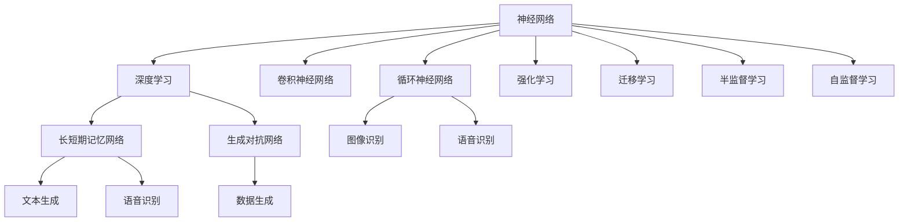

这个流程图展示了大规模AI技术的核心概念及其之间的关系：

1. 神经网络是深度学习的基础，通过多层次的特征提取和表示学习，实现对复杂数据的学习和识别。
2. 深度学习包括多种类型的神经网络，如卷积神经网络、循环神经网络、长短期记忆网络等，适用于不同的数据类型和任务。
3. 生成对抗网络通过对抗训练生成逼真的数据样本，适用于数据生成和图像识别等任务。
4. 强化学习通过奖励和惩罚机制，实现决策优化，适用于游戏、机器人控制等任务。
5. 迁移学习、半监督学习和自监督学习通过共享知识、利用大量未标注数据和数据自身特性进行学习，提升模型泛化能力。

这些核心概念共同构成了AI技术的学习框架，使其能够在各种场景下发挥强大的学习和应用能力。通过理解这些核心概念，我们可以更好地把握AI技术的原理和应用方向。

### 2.2 概念间的关系

这些核心概念之间存在着紧密的联系，形成了AI技术的完整生态系统。下面我通过几个Mermaid流程图来展示这些概念之间的关系。

#### 2.2.1 神经网络与深度学习的关系

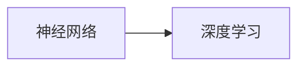

这个流程图展示了神经网络是深度学习的基础，通过多层次的特征提取和表示学习，实现对复杂数据的学习和识别。

#### 2.2.2 卷积神经网络与图像识别的关系

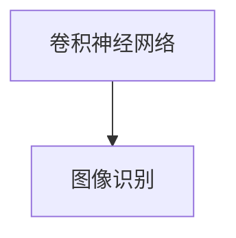

这个流程图展示了卷积神经网络适用于图像识别等任务，通过卷积和池化操作提取局部特征，实现对图像的分类和检测。

#### 2.2.3 循环神经网络与自然语言处理的关系

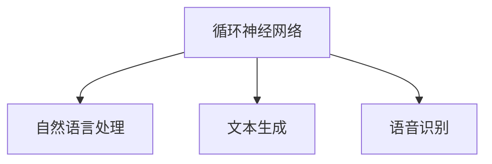

这个流程图展示了循环神经网络适用于自然语言处理等任务，通过循环结构实现对时间序列的建模，实现文本生成和语音识别。

#### 2.2.4 长短期记忆网络与文本生成和语音识别的关系

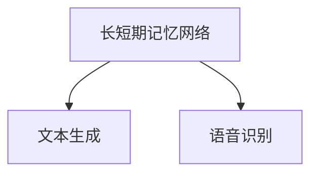

这个流程图展示了长短期记忆网络适用于文本生成和语音识别等任务，通过门控机制解决长期依赖问题，实现对长序列数据的建模。

#### 2.2.5 生成对抗网络与数据生成的关系

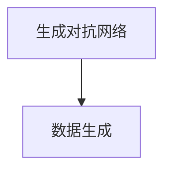

这个流程图展示了生成对抗网络适用于数据生成等任务，通过对抗训练生成逼真的数据样本，实现图像生成和数据增强。

#### 2.2.6 强化学习与游戏控制和机器人控制的关系

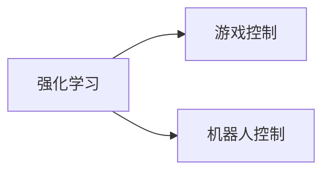

这个流程图展示了强化学习适用于游戏控制和机器人控制等任务，通过奖励和惩罚机制，实现决策优化，提升系统的智能水平。

#### 2.2.7 迁移学习与任务间知识共享的关系

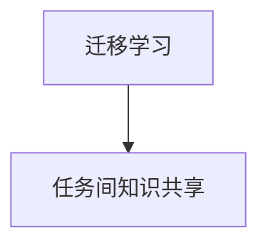

这个流程图展示了迁移学习适用于不同任务间知识共享，提升模型的泛化能力，避免从头训练带来的高成本和时间消耗。

#### 2.2.8 半监督学习与利用未标注数据的关系

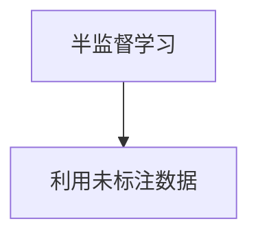

这个流程图展示了半监督学习适用于利用大量未标注数据进行学习，提升模型性能，降低标注成本。

#### 2.2.9 自监督学习与数据自身特性学习的关系

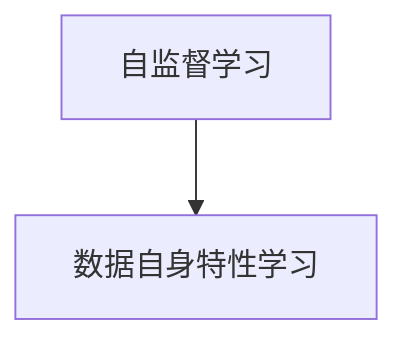

这个流程图展示了自监督学习适用于学习数据自身特性，提升模型泛化能力，降低标注成本。

### 2.3 核心概念的整体架构

最后，我们用一个综合的流程图来展示这些核心概念在大规模AI技术微调过程中的整体架构：

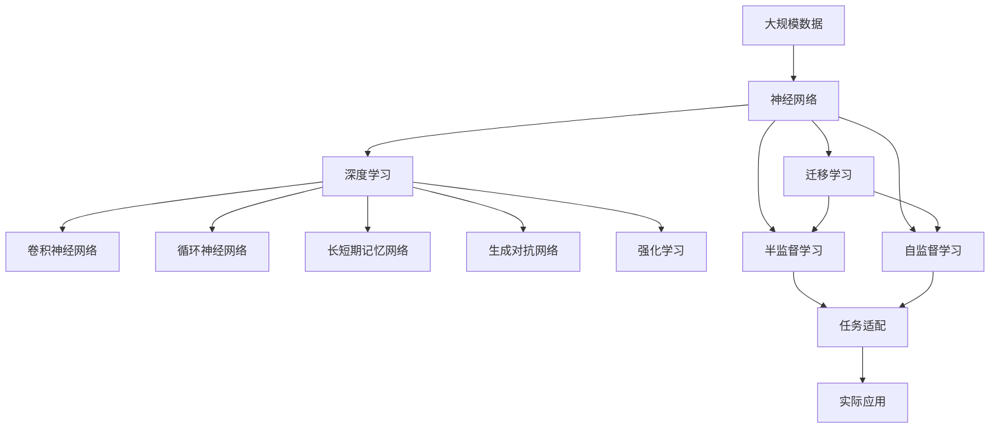

这个综合流程图展示了从大规模数据到大规模AI技术微调，再到实际应用的整体过程。大规模数据通过神经网络和深度学习模型进行预训练，然后通过迁移学习、半监督学习和自监督学习进一步提升模型性能，最后在实际应用中进行微调和优化，得到适应特定任务的高性能模型。 通过这些流程图，我们可以更清晰地理解大规模AI技术微调过程中各个核心概念的关系和作用，为后续深入讨论具体的微调方法和技术奠定基础。

## 3. 核心算法原理 & 具体操作步骤

### 3.1 算法原理概述

大规模AI技术的核心在于机器学习和深度学习，通过模拟人类学习方式，实现对数据模式的学习和识别。具体而言，深度学习模型通过多层次的特征提取和表示学习，实现对复杂数据的学习和识别。以下以神经网络为代表，介绍大规模AI技术的核心算法原理。

神经网络由多层神经元组成，通过前向传播和反向传播实现对数据的建模和优化。假设输入数据为 $\mathbf{x}$，输出标签为 $\mathbf{y}$，神经网络模型的结构如图：

```
Input Layer
|
|                W1
|                b1
|              *
|              *
|              *
|              *   ...
|              *   ...
|              *
|              *
|              *
|              *
|              *
|              *
|              *
|              *
|              *
|              *
|             ^
|            / \
|           /   \
|          /     \
|         /       \
|        /_________\
|            W2
|            b2
|             *
|             *
|             *
|             *
|             *
|             *
|             *
|             *
|             *
|             *
|             *
|             *
|             |
|             |
|            v
Output Layer
```

其中，输入层有 $n$ 个神经元，输出层有 $m$ 个神经元。中间层为隐藏层，有 $l$ 个神经元。每一层神经元的计算公式如下：

$$
z = \mathbf{w} \cdot \mathbf{x} + b
$$

$$
a = \sigma(z)
$$

其中，$\mathbf{w}$ 为权重矩阵，$\mathbf{b}$ 为偏置向量，$\sigma(z)$ 为激活函数。在深度学习中，一般使用 ReLU、Sigmoid、Tanh 等激活函数。

在深度学习中，前向传播的计算过程如下：

$$
z^{[1]} = \mathbf{w}^{[1]} \cdot \mathbf{x} + \mathbf{b}^{[1]}
$$

$$
a^{[1]} = \sigma(z^{[1]})
$$

$$
z^{[2]} = \mathbf{w}^{[2]} \cdot a^{[1]} + \mathbf{b}^{[2]}
$$

$$
a^{[2]} = \sigma(z^{[2]})
$$

$$
...
$$

$$
z^{[l]} = \mathbf{w}^{[l]} \cdot a^{[l-1]} + \mathbf{b}^{[l]}
$$

$$
a^{[l]} = \sigma(z^{[l]})
$$

$$
z^{[O]} = \mathbf{w}^{[O]} \cdot a^{[l]} + \mathbf{b}^{[O]}
$$

$$
\hat{y} = \sigma(z^{[O]})
$$

其中，$a^{[l]}$ 为第 $l$ 层的输出，$z^{[l]}$ 为第 $l$ 层的输入，$\mathbf{w}^{[l]}$ 和 $\mathbf{b}^{[l]}$ 分别为第 $l$ 层的权重矩阵和偏置向量。最终输出 $\hat{y}$ 为预测值。

深度学习的训练过程通过反向传播算法实现。假设损失函数为 $L(\mathbf{x},\mathbf{y},\hat{y})$，反向传播算法的计算过程如下：

$$
\frac{\partial L}{\partial z^{[l]}} = \frac{\partial L}{\partial a^{[l]}} \cdot \frac{\partial a^{[l]}}{\partial z^{[l]}}
$$

$$
\frac{\partial L}{\partial w^{[l]}} = \frac{\partial L}{\partial z^{[l]}} \cdot \frac{\partial z^{[l]}}{\partial w^{[l]}}
$$

$$
\frac{\partial L}{\partial b^{[l]}} = \frac{\partial L}{\partial z^{[l]}} \cdot \frac{\partial z^{[l]}}{\partial b^{[l]}}
$$

$$
\frac{\partial L}{\partial z^{[l-1]}} = \frac{\partial L}{\partial a^{[l]}} \cdot \frac{\partial a^{[l]}}{\partial z^{[l]}} \cdot \frac{\partial z^{[l]}}{\partial a^{[l-1]}} \cdot \frac{\partial a^{[l-1]}}{\partial z^{[l-1]}}
$$

通过反向传播算法，可以计算出每一层神经元的梯度，从而更新权重矩阵和偏置向量，实现模型的优化。

### 3.2 算法步骤详解

以下详细介绍大规模AI技术的核心算法步骤，具体以深度学习为例：

**Step 1: 准备数据集**

假设我们有一个训练集 $D=\{(\mathbf{x}_i,\mathbf{y}_i)\}_{i=1}^N$，其中 $\mathbf{x}_i$ 为输入数据，$\mathbf{y}_i$ 为输出标签。我们可以使用 Python 的 Pandas 库进行数据加载和预处理。例如：

```python
import pandas as pd

# 加载训练数据
train_df = pd.read_csv('train.csv')
```

**Step 2: 定义模型**

假设我们有一个 $m$ 层的深度学习模型，每层神经元的数量分别为 $n^{[l]}$，权重矩阵和偏置向量分别为 $\mathbf{W}^{[l]}$ 和 $\mathbf{b}^{[l]}$。我们可以使用 TensorFlow 或 PyTorch 等深度学习框架进行模型定义。例如，使用 TensorFlow：

```python
import tensorflow as tf

# 定义模型
model = tf.keras.Sequential([
    tf.keras.layers.Dense(64, activation='relu', input_shape=(784,)),
    tf.keras.layers.Dense(64, activation='relu'),
    tf.keras.layers.Dense(10)
])
```

**Step 3: 设置损失函数和优化器**

假设我们使用交叉熵损失函数，优化器为 Adam。我们可以使用 TensorFlow 或 PyTorch 等深度学习框架进行损失函数和优化器的定义。例如，使用 TensorFlow：

```python
# 定义损失函数
loss_fn = tf.keras.losses.SparseCategoricalCrossentropy(from_logits=True)

# 定义优化器
optimizer = tf.keras.optimizers.Adam(learning_rate=0.001)
```

**Step 4: 训练模型**

假设我们使用训练集 $D$ 进行模型训练，每轮迭代 $epoch$ 次，每次迭代使用 $batch\_size$ 个样本。我们可以使用 TensorFlow 或 PyTorch 等深度学习框架进行模型训练。例如，使用 TensorFlow：

```python
# 训练模型
for epoch in range(epoch):
    for i in range(0, len(train_df), batch_size):
        # 获取一批样本
        x_batch = train_df.iloc[i:i+batch_size, :-1].values
        y_batch = train_df.iloc[i:i+batch_size, -1].values
        
        # 前向传播
        logits = model(x_batch)
        
        # 计算损失
        loss_value = loss_fn(y_batch, logits)
        
        # 反向传播和参数更新
        with tf.GradientTape() as tape:
            loss_value = loss_fn(y_batch, logits)
        grads = tape.gradient(loss_value, model.trainable_variables)
        optimizer.apply_gradients(zip(grads, model.trainable_variables))
        
        # 记录训练结果
        ...
```

**Step 5: 评估模型**

假设我们使用测试集 $D_{test}$ 进行模型评估，计算模型在测试集上的准确率和损失。我们可以使用 TensorFlow 或 PyTorch 等深度学习框架进行模型评估。例如，使用 TensorFlow：

```python
# 评估模型
test_df = pd.read_csv('test.csv')
test_x = test_df.iloc[:, :-1].values
test_y = test_df.iloc[:, -1].values

# 前向传播
logits = model(test_x)

# 计算准确率和损失
accuracy = tf.keras.metrics.SparseCategoricalAccuracy()(tf.argmax(logits, axis=-1), test_y).numpy()
test_loss = loss_fn(test_y, logits).numpy()
print('Accuracy:', accuracy)
print('Test Loss:', test_loss)
```

### 3.3 算法优缺点

大规模AI技术具有以下优点：

1. 强大表达能力：深度学习模型具有强大的表达能力，可以处理复杂的非线性关系。
2. 高效学习：通过反向传播算法，深度学习模型可以快速学习到数据的特征和模式。
3. 广泛应用：深度学习模型在图像识别、自然语言处理、语音识别等领域得到了广泛应用。

然而，大规模AI技术也存在以下缺点：

1. 过拟合：深度学习模型容易出现过拟合问题，尤其是训练数据较少时。
2. 资源消耗大：深度学习模型需要大量的计算资源和存储空间，训练和推理成本较高。
3. 可解释性差：深度学习模型通常被视为"黑盒"模型，难以解释其内部工作机制和决策过程。

### 3.4 算法应用领域

大规模AI技术已经在图像识别、自然语言处理、语音识别等领域得到了广泛应用，以下是几个典型的应用场景：

**1. 图像识别**

图像识别是深度学习的重要应用之一。通过卷积神经网络，深度学习模型可以实现对图像的分类、检测和分割等任务。例如，LeNet、AlexNet、VGGNet、ResNet 等模型在图像识别领域取得了优异的效果。

**2. 自然语言处理**

自然语言处理是大规模AI技术的另一个重要应用领域。通过循环神经网络和长短期记忆网络，深度学习模型可以实现对文本的分类、情感分析、机器翻译等任务。例如，BERT、GPT、Transformer 等模型在自然语言处理领域取得了优异的效果。

**3. 语音识别**

语音识别是深度学习在音频处理领域的重要应用。通过循环神经网络和长短期记忆网络，深度学习模型可以实现对语音的识别和生成等任务。例如，DeepSpeech、Wav2Vec 等模型在语音识别领域取得了优异的效果。

**4. 推荐系统**

推荐系统是深度学习在推荐领域的重要应用。通过协同过滤和基于矩阵分解的方法，深度学习模型可以实现对用户的个性化推荐。例如，FM、DeepFM 等模型在推荐系统领域取得了优异的效果。

**5. 强化学习**

强化学习是大规模AI技术在决策优化领域的重要应用。通过强化学习，深度学习模型可以实现对智能体在环境中的学习和决策优化。例如，DQN、AlphaGo 等模型在强化学习领域取得了优异的效果。

## 4. 数学模型和公式 & 详细讲解 & 举例说明

### 4.1 数学模型构建

本节将使用数学语言对大规模AI技术的核心算法原理进行更加严格的刻画。

假设我们有一个 $m$ 层的深度学习模型，每层神经元的数量分别为 $n^{[l]}$，权重矩阵和偏置向量分别为 $\mathbf{W}^{[l]}$ 和 $\mathbf{b}^{[l]}$。假设输入数据为 $\mathbf{x}$，输出标签为 $\mathbf{y}$，损失函数为 $L(\mathbf{x},\mathbf{y},\hat{y})$。我们可以使用梯度下降算法进行模型训练。梯度下降算法的计算过程如下：

$$
\mathbf{w}^{[l]} \leftarrow \mathbf{w}^{[l]} - \eta \frac{\partial L}{\partial \mathbf{w}^{[l]}}
$$

$$
\mathbf{b}^{[l]} \leftarrow \mathbf{b}^{[l]} - \eta \frac{\partial L}{\partial \mathbf{b}^{[l]}}
$$

其中，$\eta$ 为学习率，$\partial L / \partial \mathbf{w}^{[l]}$ 和 $\partial L / \partial \mathbf{b}^{[l]}$ 为损失函数对权重矩阵和偏置向量的梯度。

### 4.2 公式推导过程

以下我们以二分类任务为例，推导交叉熵损失函数及其梯度的计算公式。

假设模型 $M_{\theta}$ 在输入 $\mathbf{x}$ 上的输出为 $\hat{y}=M_{\theta}(\mathbf{x}) \in [0,1]$，表示样本属于正类的概率。真实标签 $\mathbf{y} \in \{0,1\}$。则二分类交叉熵损失函数定义为：

$$
L(\mathbf{x},\mathbf{y},\hat{y}) = -[y\log \hat{y} + (1-y)\log (1-\hat{y})]
$$

将其代入损失函数，得：

$$
\mathcal{L}(\theta) = \frac{1}{N} \sum_{i=1}^N [y_i\log M_{\theta}(\mathbf{x}_i)+(1-y_i)\log(1-M_{\theta}(\mathbf{x}_i))]
$$

根据链式法则，损失函数对参数 $\theta_k$ 的梯度为：

$$
\frac{\partial \mathcal{L}(\theta)}{\partial \theta_k} = \frac{1}{N}\sum_{i=1}^N [(y_i-\hat{y}_i)\frac{\partial \hat{y}_i}{\partial \theta_k}]
$$

其中，$\frac{\partial \hat{y}_i}{\partial \theta_k}$ 可进一步递归展开，利用自动微分技术完成计算。

### 4.3 案例分析与讲解

以下我们将以一个简单的二分类任务为例，介绍大规模AI技术的实现过程。

假设我们有一个二分类任务，训练集为 $D=\{(\mathbf{x}_i,\mathbf{y}_i)\}_{i=1}^N$，其中 $\mathbf{x}_i$ 为输入数据，$\mathbf{y}_i \in \{0,1\}$ 为输出标签。我们定义一个简单的 $m$ 层深度学习模型，其中隐藏层神经元数量为 $n^{[1]}=64$，输出层神经元数量为 $n^{[O]}=1$。我们使用 TensorFlow 进行模型定义、损失函数和优化器的定义。例如：

```python
import tensorflow as tf

# 定义模型
model = tf.keras.Sequential([
    tf.keras.layers.Dense(64, activation='relu', input_shape=(784,)),
    tf.keras.layers.Dense(64, activation='relu'),
    tf.keras.layers.Dense(1)
])

# 定义损失函数
loss_fn = tf.keras.losses.BinaryCrossentropy(from_logits=True)

# 定义优化器
optimizer = tf.keras.optimizers.Adam(learning_rate=0.001)
```

我们使用训练集 $D$ 进行模型训练，每轮迭代 $epoch$ 次，每次迭代使用 $batch\_size$ 个样本。例如：

```python
# 训练模型
for epoch in range(epoch):
    for i in range(0, len(train_df), batch_size):
        # 获取一批样本
        x_batch = train_df.iloc[i:i+batch_size, :-1].values
        y_batch = train_df.iloc[i:i+batch_size, -1].values
        
        # 前向传播
        logits = model(x_batch)
        
        # 计算损失
        loss_value = loss_fn(y_batch, logits)
        
        # 反向传播和参数更新
        with tf.GradientTape() as tape:
            loss_value = loss_fn(y_batch, logits)
        grads = tape.gradient(loss_value, model.trainable_variables)
        optimizer.apply_gradients(zip(grads, model.trainable_variables))
        
        # 记录训练结果
        ...
```

我们使用测试集 $D_{test}$ 进行模型评估，计算模型在测试集上的准确率和损失。例如：

```python
# 评估模型
test_df = pd.read_csv('test.csv')
test_x = test_df.iloc[:, :-1].values
test_y = test_df.iloc[:, -1].values

# 前向传播
logits = model(test_x)

# 计算准确率和损失
accuracy = tf.keras.metrics.BinaryAccuracy()(tf.sigmoid(logits), test_y).numpy()
test_loss = loss_fn(test_y, logits).numpy()
print('Accuracy:', accuracy)
print('Test Loss:', test_loss)
```

以上就是使用 TensorFlow 进行大规模AI技术的实现过程。可以看到，通过深度学习模型，我们可以有效地处理复杂的数据关系，实现对数据的分类、回归等任务。

## 5. 项目实践：代码实例和详细解释说明

### 5.1 开发环境搭建

在进行大规模AI技术实践前，我们需要准备好开发环境。以下是使用Python进行TensorFlow开发的环境配置流程：

1. 安装Anaconda：从官网下载并安装Anaconda，用于创建独立的Python环境。

2. 创建并激活虚拟环境：
```bash
conda create -n tf-env python=3.8 
conda activate tf-env
```

3. 安装TensorFlow：根据CUDA版本，从官网获取对应的安装命令。例如：
```bash
conda install tensorflow
```

4. 安装其他工具包：
``

