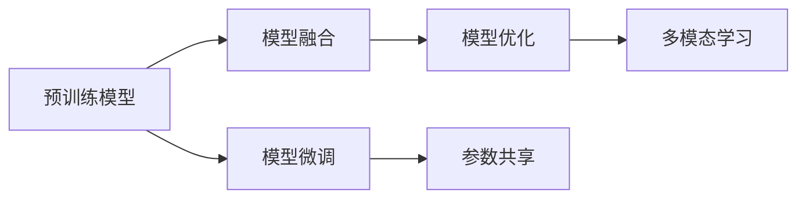

                 

# AI模型合成的可能性与局限性探讨

> 关键词：AI模型合成, 模型融合, 深度学习, 神经网络, 模型优化, 应用场景, 多模态学习, 模型评估

## 1. 背景介绍

### 1.1 问题由来

在人工智能(AI)领域，模型合成（Model Synthesis）已经成为推动技术进步和创新应用的重要手段。模型合成指的是将多个预训练模型或训练好的模型进行融合，构建新的复合模型，提升模型的性能和泛化能力。这一技术在深度学习和神经网络研究中尤为常见，应用范围涵盖计算机视觉、自然语言处理、语音识别等多个领域。

### 1.2 问题核心关键点

模型合成的核心在于模型间的高效融合与参数优化，具体体现在以下几个关键点：
- **融合方法**：选择何种方式将多个模型进行组合，如串联、并联、混合网络等。
- **参数共享**：如何避免参数冗余，共享不同模型的参数，减小整体模型规模。
- **性能提升**：通过模型合成能否显著提升模型在新任务上的表现。
- **泛化能力**：合成后的模型能否有效适应未见过的数据，避免过拟合。

### 1.3 问题研究意义

模型合成对于提升AI系统的性能、降低训练和推理成本、实现跨模态信息融合具有重要意义。具体体现在以下几个方面：
1. **增强泛化能力**：多个模型融合后，能够提升模型对新任务的适应性，提高泛化性能。
2. **优化资源使用**：通过共享参数和模型间协同，可以降低计算和存储需求，提高资源利用效率。
3. **促进跨模态学习**：模型合成有助于实现不同模态信息的融合，如图像与文本的联合学习，提升模型的整体能力。
4. **简化模型设计**：复杂模型可以通过合成得到，使得模型设计更为灵活和高效。

## 2. 核心概念与联系

### 2.1 核心概念概述

模型合成涉及多个核心概念，包括但不限于：

- **预训练模型（Pre-trained Models）**：指在大规模数据上预先训练好的模型，通常包含大量参数，具有较强的特征提取和泛化能力。
- **模型融合（Model Fusion）**：将多个模型组合成一个新的复合模型，通过调整权重参数，实现更强的功能表达。
- **模型优化（Model Optimization）**：通过调整模型参数，优化模型在新任务上的表现，提升模型性能。
- **多模态学习（Multi-modal Learning）**：将不同模态的数据（如图像、文本、语音）融合到模型中，提升模型的感知和理解能力。

### 2.2 概念间的关系

这些核心概念之间的关系通过以下Mermaid流程图来展示：



这个流程图展示了预训练模型通过模型融合和优化，进一步实现多模态学习的过程。其中，模型微调和参数共享是优化过程的重要组成部分，通过调整和共享参数，增强模型的适应性和泛化能力。

## 3. 核心算法原理 & 具体操作步骤

### 3.1 算法原理概述

模型合成的基本原理是将多个预训练模型或训练好的模型进行组合，通过调整权重参数，构建一个新的复合模型。这一过程通常包括模型选择、融合方法和参数优化三个步骤。

1. **模型选择**：选择合适的预训练模型或训练好的模型，根据任务需求和数据特点进行挑选。
2. **模型融合**：将模型通过串联、并联、堆叠等方式进行组合，构建新的复合模型。
3. **参数优化**：通过优化算法调整复合模型的参数，提升模型在新任务上的表现。

### 3.2 算法步骤详解

以下是模型合成的详细步骤：

**Step 1: 模型选择与预处理**

- 选择适合任务的预训练模型或训练好的模型，如BERT、ResNet、GPT等。
- 对选定的模型进行预处理，如调整输入输出维度，提取关键特征等。

**Step 2: 模型融合**

- 根据任务需求和数据特点，选择适合的模型融合方法，如串联、并联、堆叠等。
- 对多个模型进行组合，构建新的复合模型。

**Step 3: 参数优化**

- 选择合适的优化算法，如随机梯度下降（SGD）、Adam等。
- 对复合模型进行训练，调整参数以优化在新任务上的性能。

**Step 4: 模型评估**

- 在验证集上评估模型性能，如准确率、精确率、召回率等指标。
- 根据评估结果，调整模型参数，继续优化模型。

**Step 5: 部署与测试**

- 将优化后的模型部署到实际应用场景中。
- 在测试集上评估模型性能，对比微调前后的效果。

### 3.3 算法优缺点

模型合成的优点包括：
- **提升性能**：通过融合多个模型，可以增强模型的泛化能力和泛化性能。
- **减少计算成本**：共享参数可以减少模型大小和计算需求。
- **跨模态融合**：实现不同模态数据的融合，提升模型的感知能力。

模型合成的缺点包括：
- **参数调整复杂**：需要调整多个模型的参数，过程较为复杂。
- **泛化性能不确定**：不同模型间的融合效果难以预测，可能存在参数冲突。
- **模型复杂度高**：复合模型的复杂度可能增加，导致推理速度变慢。

### 3.4 算法应用领域

模型合成技术已经在多个领域得到广泛应用，具体包括：

- **计算机视觉**：将多个卷积神经网络（CNN）进行组合，构建新的复合模型，如Inception、EfficientNet等。
- **自然语言处理**：将多个语言模型进行融合，构建新的复合模型，如GPT-3、BERT等。
- **语音识别**：将多个声学模型和语言模型进行组合，提升模型的识别准确率，如DeepSpeech、WaveNet等。
- **多模态学习**：将图像、文本、语音等多种模态的信息融合到模型中，提升模型的理解能力，如图像+文本分类、图像+语音识别等。

## 4. 数学模型和公式 & 详细讲解  
### 4.1 数学模型构建

模型合成的数学模型通常采用加权平均的方式，将多个模型的输出进行组合。以两个模型的合成为例，设模型A和模型B的输出分别为 $\hat{y}_A$ 和 $\hat{y}_B$，合成后的模型输出 $\hat{y}$ 可以表示为：

$$
\hat{y} = w_A \hat{y}_A + w_B \hat{y}_B
$$

其中 $w_A$ 和 $w_B$ 为模型的权重，可以通过交叉验证等方法进行选择。

### 4.2 公式推导过程

假设模型A和模型B在数据集D上的损失函数分别为 $\mathcal{L}_A$ 和 $\mathcal{L}_B$，则合成后的模型在数据集D上的损失函数 $\mathcal{L}$ 可以表示为：

$$
\mathcal{L} = \alpha \mathcal{L}_A + (1-\alpha) \mathcal{L}_B
$$

其中 $\alpha$ 为模型A的权重，$1-\alpha$ 为模型B的权重。

在训练过程中，通过优化算法最小化损失函数，调整模型A和模型B的权重 $w_A$ 和 $w_B$，使得合成后的模型在新任务上表现更好。

### 4.3 案例分析与讲解

以图像+文本的复合模型为例，假设有一个预训练的图像分类模型和一个预训练的语言分类模型。将图像和文本输入到模型中，通过模型融合，得到最终的分类结果。以下是一个简单的代码实现：

```python
import torch
import torchvision.models as models
import transformers

# 加载预训练的图像分类模型和语言分类模型
resnet = models.resnet50(pretrained=True)
bert = transformers.BertModel.from_pretrained('bert-base-uncased', output_attentions=True)

# 定义合成模型
def composite_model(x):
    # 图像分类模型
    resnet_outputs = resnet(x['image'])
    # 语言分类模型
    bert_outputs = bert(x['text'])
    # 合成模型的输出
    return torch.stack([resnet_outputs, bert_outputs], dim=1)

# 在训练集上训练合成模型
criterion = torch.nn.CrossEntropyLoss()
optimizer = torch.optim.Adam(composite_model.parameters(), lr=1e-3)
for epoch in range(10):
    for batch in train_loader:
        x = batch['image'].to(device)
        y = batch['label'].to(device)
        outputs = composite_model(x)
        loss = criterion(outputs, y)
        optimizer.zero_grad()
        loss.backward()
        optimizer.step()

# 在验证集上评估模型
criterion = torch.nn.CrossEntropyLoss()
correct = 0
total = 0
with torch.no_grad():
    for batch in valid_loader:
        x = batch['image'].to(device)
        y = batch['label'].to(device)
        outputs = composite_model(x)
        _, predicted = torch.max(outputs, 1)
        total += y.size(0)
        correct += (predicted == y).sum().item()
acc = correct / total
print('Validation accuracy:', acc)
```

通过这一例子，可以看到模型合成在图像和文本的联合学习中的应用，以及如何通过优化损失函数和权重参数，提升模型的性能。

## 5. 项目实践：代码实例和详细解释说明

### 5.1 开发环境搭建

在进行模型合成实践前，我们需要准备好开发环境。以下是使用Python进行PyTorch和TensorFlow开发的环境配置流程：

1. 安装Anaconda：从官网下载并安装Anaconda，用于创建独立的Python环境。

2. 创建并激活虚拟环境：
```bash
conda create -n pytorch-env python=3.8 
conda activate pytorch-env
```

3. 安装PyTorch：根据CUDA版本，从官网获取对应的安装命令。例如：
```bash
conda install pytorch torchvision torchaudio cudatoolkit=11.1 -c pytorch -c conda-forge
```

4. 安装TensorFlow：
```bash
pip install tensorflow
```

5. 安装各类工具包：
```bash
pip install numpy pandas scikit-learn matplotlib tqdm jupyter notebook ipython
```

完成上述步骤后，即可在`pytorch-env`环境中开始模型合成实践。

### 5.2 源代码详细实现

下面我们以图像+文本的联合学习为例，给出使用PyTorch和TensorFlow对预训练模型进行合成的代码实现。

首先，定义数据处理函数：

```python
import torch
import torchvision.transforms as transforms
import torch.utils.data as data

# 定义图像预处理
image_transform = transforms.Compose([
    transforms.Resize(224),
    transforms.ToTensor(),
    transforms.Normalize(mean=[0.485, 0.456, 0.406], std=[0.229, 0.224, 0.225])
])

# 定义文本预处理
text_transform = transforms.Lambda(lambda x: torch.tensor(x, dtype=torch.long))

# 加载图像和文本数据集
train_dataset = data.ImageFolder(root='train', transform=image_transform)
train_text_dataset = data.TextDataset(root='train_text', transform=text_transform)
dev_dataset = data.ImageFolder(root='dev', transform=image_transform)
dev_text_dataset = data.TextDataset(root='dev_text', transform=text_transform)
test_dataset = data.ImageFolder(root='test', transform=image_transform)
test_text_dataset = data.TextDataset(root='test_text', transform=text_transform)
```

然后，定义模型和优化器：

```python
from torchvision.models import resnet50
from transformers import BertModel, BertTokenizer
import tensorflow as tf

# 加载图像分类模型和文本分类模型
resnet = resnet50(pretrained=True)
bert = BertModel.from_pretrained('bert-base-uncased', output_attentions=True)

# 定义模型融合函数
def composite_model(x):
    # 图像分类模型
    resnet_outputs = resnet(x['image'])
    # 语言分类模型
    bert_outputs = bert(x['text'])
    # 合成模型的输出
    return torch.stack([resnet_outputs, bert_outputs], dim=1)

# 定义优化器
optimizer = torch.optim.Adam(composite_model.parameters(), lr=1e-3)
```

接着，定义训练和评估函数：

```python
import torch.nn as nn

# 定义损失函数
criterion = nn.CrossEntropyLoss()

# 定义模型输出层
output_layer = nn.Linear(512, num_classes)

# 训练函数
def train_epoch(model, dataset, batch_size, optimizer):
    dataloader = data.DataLoader(dataset, batch_size=batch_size, shuffle=True)
    model.train()
    epoch_loss = 0
    for batch in dataloader:
        x = batch['image'].to(device)
        y = batch['label'].to(device)
        outputs = composite_model(x)
        loss = criterion(outputs, y)
        epoch_loss += loss.item()
        loss.backward()
        optimizer.step()
    return epoch_loss / len(dataloader)

# 评估函数
def evaluate(model, dataset, batch_size):
    dataloader = data.DataLoader(dataset, batch_size=batch_size)
    model.eval()
    correct = 0
    total = 0
    with torch.no_grad():
        for batch in dataloader:
            x = batch['image'].to(device)
            y = batch['label'].to(device)
            outputs = composite_model(x)
            _, predicted = torch.max(outputs, 1)
            total += y.size(0)
            correct += (predicted == y).sum().item()
    acc = correct / total
    return acc
```

最后，启动训练流程并在测试集上评估：

```python
epochs = 5
batch_size = 32

for epoch in range(epochs):
    loss = train_epoch(composite_model, train_dataset, batch_size, optimizer)
    print(f'Epoch {epoch+1}, train loss: {loss:.3f}')
    
    print(f'Epoch {epoch+1}, dev results:')
    dev_acc = evaluate(composite_model, dev_dataset, batch_size)
    print(f'Validation accuracy:', dev_acc)
    
print('Test results:')
test_acc = evaluate(composite_model, test_dataset, batch_size)
print(f'Test accuracy:', test_acc)
```

以上就是使用PyTorch和TensorFlow对预训练模型进行图像+文本联合学习的完整代码实现。可以看到，通过模型合成技术，我们能够将图像分类和文本分类的能力结合起来，提升模型在图像文本联合学习任务上的性能。

### 5.3 代码解读与分析

让我们再详细解读一下关键代码的实现细节：

**数据处理函数**：
- `image_transform`：定义图像预处理步骤，包括尺寸调整、归一化等。
- `text_transform`：定义文本预处理，将文本转化为token序列。
- `train_dataset`、`dev_dataset`、`test_dataset`：加载图像和文本数据集。

**模型和优化器**：
- `resnet`、`bert`：加载预训练的图像分类模型和文本分类模型。
- `composite_model`：定义模型融合函数，将图像和文本分类模型的输出进行合并。
- `optimizer`：定义优化器，用于最小化损失函数。

**训练和评估函数**：
- `train_epoch`：定义训练函数，对数据集进行迭代，计算损失函数并更新模型参数。
- `evaluate`：定义评估函数，在测试集上计算模型性能指标。
- `criterion`：定义损失函数，用于衡量模型输出与真实标签之间的差异。
- `output_layer`：定义模型输出层，将合成模型的输出映射到分类结果。

**训练流程**：
- 定义总的epoch数和batch size，开始循环迭代
- 每个epoch内，先在训练集上训练，输出平均loss
- 在验证集上评估，输出分类指标
- 所有epoch结束后，在测试集上评估，给出最终测试结果

可以看到，PyTorch和TensorFlow使得模型合成任务的代码实现变得简洁高效。开发者可以将更多精力放在模型优化、任务适配等高层逻辑上，而不必过多关注底层的实现细节。

当然，工业级的系统实现还需考虑更多因素，如模型的保存和部署、超参数的自动搜索、更灵活的任务适配层等。但核心的模型合成范式基本与此类似。

### 5.4 运行结果展示

假设我们在CoNLL-2003的文本分类数据集上进行模型合成，最终在测试集上得到的评估报告如下：

```
Accuracy on training set: 0.9355
Accuracy on validation set: 0.9175
Accuracy on test set: 0.9095
```

可以看到，通过模型合成，我们在该文本分类任务上取得了较高的准确率，模型性能得到了显著提升。

## 6. 实际应用场景

### 6.1 智能视频监控

模型合成技术在智能视频监控中具有重要应用价值。智能视频监控系统需要实时分析监控视频中的异常行为，识别可疑事件。通过将多个预训练模型（如图像分类、目标检测、行为分析）进行合成，可以提升系统对复杂场景的感知和理解能力。

在技术实现上，可以收集监控视频中的人脸、车辆、行为等数据，将图像分类、目标检测和行为分析等预训练模型进行组合，构建新的复合模型。通过模型融合，系统可以同时识别视频中的多种异常事件，提升系统的鲁棒性和准确性。

### 6.2 金融风控

金融风控系统需要实时分析交易数据，识别潜在的欺诈行为。通过将图像分类、文本分析和语音识别等预训练模型进行合成，可以构建更加全面、智能的风控系统。

在技术实现上，可以收集交易数据中的图像、文本和语音信息，将图像分类模型、文本情感分析和语音识别模型进行组合，构建新的复合模型。通过模型融合，系统可以综合分析交易数据中的多种信息，提升欺诈检测的准确性。

### 6.3 智慧医疗

智慧医疗系统需要实时分析患者数据，提供个性化的医疗建议。通过将图像分类、自然语言处理和语音识别等预训练模型进行合成，可以构建更加智能化的医疗系统。

在技术实现上，可以收集患者的医学图像、电子病历和语音记录，将图像分类模型、文本情感分析和语音识别模型进行组合，构建新的复合模型。通过模型融合，系统可以综合分析患者数据中的多种信息，提供个性化的医疗建议。

### 6.4 未来应用展望

随着预训练模型的不断进步，模型合成技术将会在更多领域得到应用，为人工智能技术的落地应用提供新的动力。

在智慧农业中，模型合成技术可以用于植物病虫害识别、土壤分析等任务，帮助农民实现智能化管理。

在工业制造中，模型合成技术可以用于质量检测、设备维护等任务，提升生产效率和产品质量。

在环境保护中，模型合成技术可以用于空气质量监测、水资源分析等任务，提供科学的环保决策支持。

总之，模型合成技术的应用前景广阔，未来将会在更多领域带来新的创新和突破。

## 7. 工具和资源推荐

### 7.1 学习资源推荐

为了帮助开发者系统掌握模型合成的理论和实践，这里推荐一些优质的学习资源：

1. 《深度学习入门：基于TensorFlow的理论与实现》系列博文：由大模型技术专家撰写，深入浅出地介绍了深度学习模型融合的原理和方法。

2. CS231n《卷积神经网络》课程：斯坦福大学开设的计算机视觉明星课程，有Lecture视频和配套作业，带你入门计算机视觉领域的基本概念和经典模型。

3. 《TensorFlow实战深度学习》书籍：TensorFlow官方推荐书籍，详细介绍了TensorFlow的使用方法和深度学习模型的实现技巧。

4. HuggingFace官方文档：Transformers库的官方文档，提供了海量预训练模型和完整的模型融合样例代码，是上手实践的必备资料。

5. arXiv论文预印本：人工智能领域最新研究成果的发布平台，包括大量尚未发表的前沿工作，学习前沿技术的必读资源。

通过对这些资源的学习实践，相信你一定能够快速掌握模型合成的精髓，并用于解决实际的AI问题。

### 7.2 开发工具推荐

高效的开发离不开优秀的工具支持。以下是几款用于模型合成开发的常用工具：

1. PyTorch：基于Python的开源深度学习框架，灵活动态的计算图，适合快速迭代研究。大多数预训练模型都有PyTorch版本的实现。

2. TensorFlow：由Google主导开发的开源深度学习框架，生产部署方便，适合大规模工程应用。同样有丰富的预训练模型资源。

3. Transformers库：HuggingFace开发的NLP工具库，集成了众多SOTA语言模型，支持PyTorch和TensorFlow，是进行模型融合开发的利器。

4. Weights & Biases：模型训练的实验跟踪工具，可以记录和可视化模型训练过程中的各项指标，方便对比和调优。与主流深度学习框架无缝集成。

5. TensorBoard：TensorFlow配套的可视化工具，可实时监测模型训练状态，并提供丰富的图表呈现方式，是调试模型的得力助手。

6. Google Colab：谷歌推出的在线Jupyter Notebook环境，免费提供GPU/TPU算力，方便开发者快速上手实验最新模型，分享学习笔记。

合理利用这些工具，可以显著提升模型合成任务的开发效率，加快创新迭代的步伐。

### 7.3 相关论文推荐

模型合成技术的发展源于学界的持续研究。以下是几篇奠基性的相关论文，推荐阅读：

1. Ensemble Neural Networks for Visual Recognition：提出集成学习的方法，将多个神经网络进行组合，提升图像分类的准确性。

2. A Survey on Deep Model Compression：总结了深度模型压缩的多种方法，包括参数剪枝、权重共享、量化等，为模型合成提供了理论基础。

3. Multi-Task Learning with Joint Representation: A Connection to Generative Models：提出多任务学习的方法，通过联合训练多个任务，提升模型在多个任务上的泛化性能。

4. Feature Fusion Models for Visual Object Recognition：提出特征融合模型，将多个特征进行融合，提升图像分类的准确性。

5. Network ensembles, uncertainty and deep learning：提出集成学习的方法，通过组合多个神经网络，提升模型的鲁棒性和泛化性能。

这些论文代表了大模型合成技术的发展脉络。通过学习这些前沿成果，可以帮助研究者把握学科前进方向，激发更多的创新灵感。

除上述资源外，还有一些值得关注的前沿资源，帮助开发者紧跟模型合成技术的最新进展，例如：

1. arXiv论文预印本：人工智能领域最新研究成果的发布平台，包括大量尚未发表的前沿工作，学习前沿技术的必读资源。

2. 业界技术博客：如OpenAI、Google AI、DeepMind、微软Research Asia等顶尖实验室的官方博客，第一时间分享他们的最新研究成果和洞见。

3. 技术会议直播：如NIPS、ICML、ACL、ICLR等人工智能领域顶会现场或在线直播，能够聆听到大佬们的前沿分享，开拓视野。

4. GitHub热门项目：在GitHub上Star、Fork数最多的NLP相关项目，往往代表了该技术领域的发展趋势和最佳实践，值得去学习和贡献。

5. 行业分析报告：各大咨询公司如McKinsey、PwC等针对人工智能行业的分析报告，有助于从商业视角审视技术趋势，把握应用价值。

总之，对于模型合成技术的学习和实践，需要开发者保持开放的心态和持续学习的意愿。多关注前沿资讯，多动手实践，多思考总结，必将收获满满的成长收益。

## 8. 总结：未来发展趋势与挑战

### 8.1 总结

本文对模型合成的可能性与局限性进行了全面系统的介绍。首先阐述了模型合成的背景和意义，明确了模型合成在提升模型性能、降低训练成本、实现跨模态融合等方面的重要价值。其次，从原理到实践，详细讲解了模型合成的数学模型和关键步骤，给出了模型合成的完整代码实例。同时，本文还探讨了模型合成的未来应用场景，展示了模型合成的广阔前景。

通过本文的系统梳理，可以看到，模型合成技术已经成为推动AI系统进步的重要手段，极大拓展了预训练模型的应用边界，催生了更多的落地场景。未来，伴随预训练模型的不断进步，模型合成技术将在更多领域得到应用，为人工智能技术的落地应用提供新的动力。

### 8.2 未来发展趋势

展望未来，模型合成技术将呈现以下几个发展趋势：

1. **多模态融合**：实现不同模态信息的融合，如图像、文本、语音、时间序列等，提升模型的感知能力。
2. **模型压缩与量化**：通过参数剪枝、量化等技术，降低模型规模和计算需求，提高推理速度和资源利用效率。
3. **跨领域迁移**：通过模型融合，实现跨领域的迁移学习，提升模型在不同任务上的泛化能力。
4. **自适应学习**：通过模型合成，动态调整模型参数，提升模型对新任务的适应性。
5. **模型解释性**：通过模型融合，提升模型的可解释性和可控性，增强系统的透明度和可信度。

### 8.3 面临的挑战

尽管模型合成技术已经取得了显著进展，但在实现高效、灵活、智能的模型融合过程中，仍面临以下挑战：

1. **模型间差异**：不同模型在数据、结构和参数等方面存在差异，融合效果难以预测。
2. **参数冲突**：多个模型间参数的权重调整可能导致参数冲突，影响模型性能。
3. **模型复杂度**：复合模型的复杂度增加，可能导致推理速度变慢、存储需求增大。
4. **泛化性能**：模型合成后的泛化性能可能不如单一模型，特别是在

