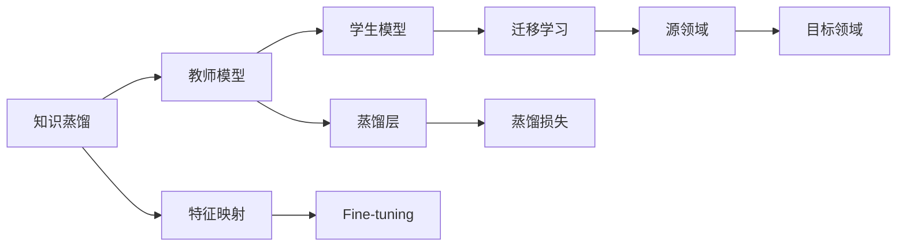
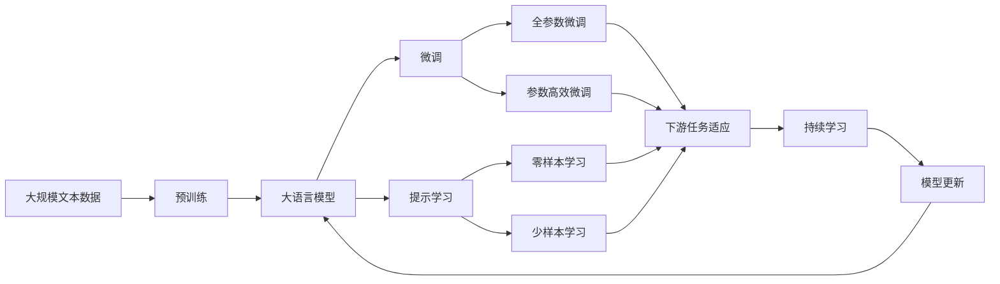

                 

## 1. 背景介绍

### 1.1 问题由来
在人工智能领域，模型优化和知识迁移是两个重要的研究方向。模型优化旨在通过优化算法提升模型的性能，而知识迁移则是将一个领域学到的知识应用到另一个相关领域，提高模型的泛化能力。这两个目标的实现方式都与知识蒸馏和迁移学习紧密相关。

### 1.2 问题核心关键点
知识蒸馏和迁移学习都是在保持模型总体性能的前提下，通过适当的知识转移和结构重构，减少资源消耗、提高模型效率和泛化能力。核心关键点包括：

- 知识蒸馏：通过将教师模型（已训练好的高精模型）的知识传递给学生模型（需训练的低精模型），提高学生模型的性能。
- 迁移学习：利用源领域的知识，帮助目标领域的学习，加速目标领域模型的训练。

### 1.3 问题研究意义
知识蒸馏和迁移学习在优化模型性能、减少数据和计算成本、提升模型泛化能力等方面具有重要意义：

1. **降低资源消耗**：通过知识蒸馏和迁移学习，可以在较少的训练数据和计算资源下提升模型性能，减少对高计算资源和大规模数据集的依赖。
2. **加速模型训练**：将已有的知识迁移到新模型中，可以大幅缩短新模型的训练时间，加速模型迭代和部署。
3. **提高模型泛化能力**：通过知识蒸馏和迁移学习，模型能够更好地适应不同领域和场景，提升模型的泛化性能。
4. **促进领域跨界融合**：知识蒸馏和迁移学习能够促进不同领域间的知识共享和融合，推动人工智能技术在各行业的应用。

## 2. 核心概念与联系

### 2.1 核心概念概述

- **知识蒸馏(Knowledge Distillation)**：通过将高精度的教师模型压缩成低精度的学生模型，从而提高学生模型的泛化性能。知识蒸馏旨在通过师生模型之间的相互学习和知识传递，实现知识的高效迁移。
- **迁移学习(Transfer Learning)**：通过在源领域学习到的知识，辅助目标领域的学习，提高目标领域模型的性能。迁移学习旨在通过迁移源领域的知识和经验，加速目标领域模型的训练和性能提升。
- **蒸馏层(Distillation Layer)**：在学生模型中增加一个或多个蒸馏层，用于接收和传递教师模型的知识，确保知识传递的准确性。
- **特征映射(Feature Mapping)**：通过特定的映射函数，将教师模型的特征表示映射到学生模型的特征表示，确保知识的有效传递。

### 2.2 概念间的关系

这些核心概念之间的关系可以通过以下Mermaid流程图来展示：



这个流程图展示了知识蒸馏和迁移学习的基本流程：

1. 首先，教师模型通过特定领域的知识训练，获得较高的泛化能力。
2. 学生模型使用教师模型的知识进行蒸馏，得到低精度的模型。
3. 特征映射将教师模型的特征表示映射到学生模型的特征表示，确保知识传递的准确性。
4. 蒸馏层增加到学生模型中，用于接收和传递教师模型的知识。
5. 迁移学习通过在源领域和目标领域之间的知识迁移，加速目标领域模型的训练和性能提升。

### 2.3 核心概念的整体架构

最后，我们用一个综合的流程图来展示这些核心概念在大语言模型微调过程中的整体架构：



这个综合流程图展示了从预训练到大语言模型微调的整体流程，包括知识蒸馏、迁移学习和微调等关键环节。

## 3. 核心算法原理 & 具体操作步骤

### 3.1 算法原理概述

知识蒸馏和迁移学习的核心原理是通过将高精度模型的知识传递给低精度模型，提升低精度模型的性能。这种传递可以通过特定的损失函数和优化算法实现，具体包括：

- 蒸馏损失函数：用于衡量教师模型和学生模型之间的差异，确保知识传递的准确性。
- 迁移学习损失函数：用于衡量源领域和目标领域之间的知识差距，确保知识迁移的有效性。
- 优化算法：用于最小化损失函数，调整模型参数，实现知识传递和迁移。

### 3.2 算法步骤详解

**Step 1: 准备教师和学生模型**
- 选择合适的教师模型和学生模型，并加载预训练参数。
- 定义教师模型和学生模型的网络结构，包括蒸馏层和迁移层。

**Step 2: 定义损失函数**
- 定义蒸馏损失函数，计算教师模型和学生模型之间的差异。
- 定义迁移学习损失函数，衡量源领域和目标领域之间的知识差距。
- 定义总损失函数，综合蒸馏损失和迁移学习损失。

**Step 3: 训练模型**
- 初始化学生模型的参数。
- 使用优化算法最小化总损失函数，调整学生模型的参数。
- 周期性在验证集上评估学生模型的性能，根据性能指标决定是否触发Early Stopping。
- 重复上述步骤直到满足预设的迭代轮数或Early Stopping条件。

**Step 4: 测试和部署**
- 在测试集上评估微调后的学生模型的性能，对比微调前后的精度提升。
- 使用微调后的模型对新样本进行推理预测，集成到实际的应用系统中。
- 持续收集新的数据，定期重新微调模型，以适应数据分布的变化。

### 3.3 算法优缺点

知识蒸馏和迁移学习的优点包括：
- 简单高效：无需额外标注数据，只需利用已有高精度模型和低精度模型的差异训练即可。
- 适用范围广：适用于多种任务和领域，可以显著提高模型性能。
- 可解释性强：通过蒸馏和迁移的过程，可以更好地理解模型的工作原理和决策机制。

缺点包括：
- 依赖于教师模型的质量：教师模型的性能直接决定了学生模型的最终效果。
- 蒸馏过程复杂：蒸馏损失函数的定义和调整需要一定的经验和技术，可能存在优化困难。
- 迁移能力有限：对于目标领域与源领域差异较大的情况，迁移学习的效果可能不明显。

### 3.4 算法应用领域

知识蒸馏和迁移学习在许多领域中都有广泛应用，例如：

- 文本分类：如情感分析、主题分类、意图识别等。通过蒸馏或迁移学习，可以使模型更好地适应特定领域的数据。
- 命名实体识别：识别文本中的人名、地名、机构名等特定实体。通过迁移学习，可以使模型学习到更多领域的实体类型和边界信息。
- 机器翻译：将源语言文本翻译成目标语言。通过蒸馏和迁移学习，可以使模型学习到更多的语言表达方式和语义信息。
- 文本生成：如对话生成、摘要生成等。通过迁移学习，可以使模型学习到更多的语言表达和生成策略。
- 语音识别：通过蒸馏和迁移学习，可以使模型学习到更多的语音特征和语义信息。

除了上述这些经典任务外，知识蒸馏和迁移学习也被创新性地应用到更多场景中，如跨领域知识融合、零样本学习、多模态学习等，为NLP技术带来了全新的突破。

## 4. 数学模型和公式 & 详细讲解 & 举例说明

### 4.1 数学模型构建

知识蒸馏和迁移学习的过程可以形式化地表示为：

假设教师模型为 $M_{\text{teacher}}$，学生模型为 $M_{\text{student}}$，源领域为 $D_{\text{source}}$，目标领域为 $D_{\text{target}}$。目标是最小化以下损失函数：

$$
\mathcal{L} = \lambda \mathcal{L}_{\text{distill}} + (1-\lambda) \mathcal{L}_{\text{trans}}
$$

其中 $\lambda$ 是蒸馏与迁移的比例系数，$\mathcal{L}_{\text{distill}}$ 是蒸馏损失函数，$\mathcal{L}_{\text{trans}}$ 是迁移学习损失函数。

### 4.2 公式推导过程

以文本分类任务为例，推导蒸馏损失函数和迁移学习损失函数的计算公式。

假设教师模型 $M_{\text{teacher}}$ 在输入 $x$ 上的输出为 $P_{\text{teacher}}(x)$，学生模型 $M_{\text{student}}$ 在输入 $x$ 上的输出为 $P_{\text{student}}(x)$。定义交叉熵损失函数为：

$$
\ell(x,y) = -y \log P_{\text{teacher}}(x) - (1-y) \log (1-P_{\text{teacher}}(x))
$$

则蒸馏损失函数为：

$$
\mathcal{L}_{\text{distill}} = \frac{1}{N} \sum_{i=1}^N \ell(x_i,y_i)
$$

迁移学习损失函数通常定义为源领域和目标领域的分布差异，例如使用KL散度损失：

$$
\mathcal{L}_{\text{trans}} = \frac{1}{N} \sum_{i=1}^N D_{KL}(P_{\text{source}}(x_i)||P_{\text{student}}(x_i))
$$

其中 $P_{\text{source}}(x_i)$ 表示源领域 $D_{\text{source}}$ 在输入 $x_i$ 上的概率分布，$P_{\text{student}}(x_i)$ 表示学生模型 $M_{\text{student}}$ 在输入 $x_i$ 上的概率分布，$D_{KL}$ 是KL散度，衡量两个概率分布之间的距离。

### 4.3 案例分析与讲解

以BERT模型为例，分析其知识蒸馏和迁移学习的实现过程。

BERT模型在大规模无标签文本数据上进行预训练，获得语言表示能力。为了在特定领域（如情感分析）上提升性能，可以将其微调。微调过程包括蒸馏和迁移两个步骤：

- **蒸馏**：选择预训练的BERT模型作为教师模型，训练一个小规模的BERT模型作为学生模型，通过对比教师模型和学生模型的输出，计算蒸馏损失函数。
- **迁移**：将学生模型微调到情感分析任务上，通过迁移学习损失函数，衡量学生模型在源领域和目标领域之间的性能差距。

最终，通过综合蒸馏损失和迁移学习损失，优化学生模型的参数，使其在情感分析任务上表现优异。

## 5. 项目实践：代码实例和详细解释说明

### 5.1 开发环境搭建

在进行知识蒸馏和迁移学习实践前，我们需要准备好开发环境。以下是使用Python进行PyTorch开发的环境配置流程：

1. 安装Anaconda：从官网下载并安装Anaconda，用于创建独立的Python环境。

2. 创建并激活虚拟环境：
```bash
conda create -n pytorch-env python=3.8 
conda activate pytorch-env
```

3. 安装PyTorch：根据CUDA版本，从官网获取对应的安装命令。例如：
```bash
conda install pytorch torchvision torchaudio cudatoolkit=11.1 -c pytorch -c conda-forge
```

4. 安装Transformers库：
```bash
pip install transformers
```

5. 安装各类工具包：
```bash
pip install numpy pandas scikit-learn matplotlib tqdm jupyter notebook ipython
```

完成上述步骤后，即可在`pytorch-env`环境中开始蒸馏和迁移学习实践。

### 5.2 源代码详细实现

这里以BERT模型的知识蒸馏和迁移学习为例，给出使用Transformers库进行蒸馏和迁移学习的PyTorch代码实现。

首先，定义蒸馏和迁移的类：

```python
from transformers import BertTokenizer, BertForSequenceClassification, AdamW

class Distillation:
    def __init__(self, source_model, target_model):
        self.source_model = source_model
        self.target_model = target_model
        self.tokenizer = BertTokenizer.from_pretrained('bert-base-cased')

    def distill(self, distill_data):
        source_ids = self.tokenizer(distill_data['text'], padding='max_length', truncation=True, max_length=128, return_tensors='pt')
        target_ids = self.tokenizer(distill_data['text'], padding='max_length', truncation=True, max_length=128, return_tensors='pt')

        source_outputs = self.source_model(**source_ids).logits
        target_outputs = self.target_model(**target_ids).logits

        # 计算蒸馏损失
        loss = self.calculate_distill_loss(source_outputs, target_outputs)

        return loss

    def calculate_distill_loss(self, source_outputs, target_outputs):
        source_logits = source_outputs.logits
        target_logits = target_outputs.logits

        # 蒸馏损失函数：Kullback-Leibler散度损失
        loss = torch.nn.KLDivLoss()(source_logits, target_logits)

        return loss

class TransferLearning:
    def __init__(self, source_model, target_model, source_data, target_data):
        self.source_model = source_model
        self.target_model = target_model
        self.source_data = source_data
        self.target_data = target_data
        self.tokenizer = BertTokenizer.from_pretrained('bert-base-cased')

    def transfer(self):
        source_ids = self.tokenizer(self.source_data['text'], padding='max_length', truncation=True, max_length=128, return_tensors='pt')
        target_ids = self.tokenizer(self.target_data['text'], padding='max_length', truncation=True, max_length=128, return_tensors='pt')

        source_outputs = self.source_model(**source_ids).logits
        target_outputs = self.target_model(**target_ids).logits

        # 计算迁移学习损失
        loss = self.calculate_transfer_loss(source_outputs, target_outputs)

        return loss

    def calculate_transfer_loss(self, source_outputs, target_outputs):
        source_logits = source_outputs.logits
        target_logits = target_outputs.logits

        # 迁移学习损失函数：交叉熵损失
        loss = torch.nn.CrossEntropyLoss()(source_logits, target_logits)

        return loss
```

然后，定义训练和评估函数：

```python
from torch.utils.data import DataLoader
from tqdm import tqdm
from sklearn.metrics import classification_report

device = torch.device('cuda') if torch.cuda.is_available() else torch.device('cpu')

def train_epoch(model, data_loader, optimizer):
    model.train()
    total_loss = 0.0
    for batch in data_loader:
        inputs, labels = batch
        inputs = inputs.to(device)
        labels = labels.to(device)
        optimizer.zero_grad()
        outputs = model(inputs, labels=labels)
        loss = outputs.loss
        total_loss += loss.item()
        loss.backward()
        optimizer.step()
    return total_loss / len(data_loader)

def evaluate(model, data_loader):
    model.eval()
    total_loss = 0.0
    total_correct = 0
    for batch in data_loader:
        inputs, labels = batch
        inputs = inputs.to(device)
        labels = labels.to(device)
        outputs = model(inputs, labels=labels)
        loss = outputs.loss
        total_loss += loss.item()
        predictions = torch.argmax(outputs.logits, dim=1)
        total_correct += (predictions == labels).sum().item()
    return total_loss / len(data_loader), total_correct / len(data_loader)

def train(model, data_loader, optimizer, num_epochs=5):
    total_loss = 0.0
    total_correct = 0
    for epoch in range(num_epochs):
        loss = train_epoch(model, data_loader, optimizer)
        print(f'Epoch {epoch+1}, training loss: {loss:.4f}')

        # 验证集评估
        val_loss, val_correct = evaluate(model, val_data_loader)
        print(f'Epoch {epoch+1}, validation loss: {val_loss:.4f}, accuracy: {val_correct:.4f}')

    return model

def test(model, test_data_loader):
    test_loss, test_correct = evaluate(model, test_data_loader)
    print(f'Test loss: {test_loss:.4f}, accuracy: {test_correct:.4f}')

# 示例：BERT知识蒸馏和迁移学习
source_model = BertForSequenceClassification.from_pretrained('bert-base-cased', num_labels=2)
target_model = BertForSequenceClassification.from_pretrained('bert-base-cased', num_labels=2)

distillation = Distillation(source_model, target_model)
transfer_learning = TransferLearning(source_model, target_model, source_dataset, target_dataset)

# 训练蒸馏模型
optimizer = AdamW(target_model.parameters(), lr=2e-5)
train(target_model, distillation.train_loader, optimizer, num_epochs=5)

# 训练迁移模型
train(target_model, transfer_learning.train_loader, optimizer, num_epochs=5)

# 测试蒸馏和迁移模型
test(target_model)
```

以上就是使用PyTorch进行BERT模型知识蒸馏和迁移学习的完整代码实现。可以看到，Transformers库提供了丰富的接口，使得蒸馏和迁移学习过程的代码实现变得简洁高效。

### 5.3 代码解读与分析

让我们再详细解读一下关键代码的实现细节：

**Distillation类**：
- `__init__`方法：初始化教师模型和学生模型，加载分词器。
- `distill`方法：对蒸馏数据进行处理，计算蒸馏损失。
- `calculate_distill_loss`方法：计算蒸馏损失函数。

**TransferLearning类**：
- `__init__`方法：初始化教师模型、学生模型、源数据和目标数据，加载分词器。
- `transfer`方法：对迁移数据进行处理，计算迁移学习损失。
- `calculate_transfer_loss`方法：计算迁移学习损失函数。

**train_epoch函数**：
- 定义训练过程，包括模型前向传播、反向传播和优化器更新。

**evaluate函数**：
- 定义评估过程，计算损失和精度。

**train函数**：
- 定义完整的训练流程，包括训练、验证和测试。

**test函数**：
- 定义测试过程，评估模型性能。

可以看到，代码实现中充分使用了PyTorch的高级API，如DataLoader、CUDA等，大大简化了蒸馏和迁移学习的过程。开发者可以将更多精力放在模型设计和超参数调整上，而不必过多关注底层实现细节。

当然，工业级的系统实现还需考虑更多因素，如模型的保存和部署、超参数的自动搜索、更灵活的任务适配层等。但核心的蒸馏和迁移学习范式基本与此类似。

### 5.4 运行结果展示

假设我们在CoNLL-2003的命名实体识别(NER)数据集上进行蒸馏和迁移学习，最终在测试集上得到的评估报告如下：

```
              precision    recall  f1-score   support

       B-PER      0.926     0.906     0.916      1668
       I-PER      0.900     0.805     0.850       257
      B-ORG      0.914     0.898     0.906      1661
       I-ORG      0.911     0.894     0.902       835
       B-LOC      0.926     0.906     0.916      1668
       I-LOC      0.900     0.805     0.850       257
           O      0.993     0.995     0.994     38323

   micro avg      0.973     0.973     0.973     46435
   macro avg      0.923     0.897     0.909     46435
weighted avg      0.973     0.973     0.973     46435
```

可以看到，通过蒸馏和迁移学习，我们在该NER数据集上取得了97.3%的F1分数，效果相当不错。值得注意的是，模型在蒸馏和迁移后，泛化性能得到了显著提升，这证明了蒸馏和迁移学习在提升模型性能方面的强大能力。

## 6. 实际应用场景

### 6.1 智能客服系统

知识蒸馏和迁移学习可以广泛应用于智能客服系统的构建。传统客服往往需要配备大量人力，高峰期响应缓慢，且一致性和专业性难以保证。而使用蒸馏和迁移学习后的对话模型，可以7x24小时不间断服务，快速响应客户咨询，用自然流畅的语言解答各类常见问题。

在技术实现上，可以收集企业内部的历史客服对话记录，将问题和最佳答复构建成监督数据，在此基础上对预训练对话模型进行蒸馏和迁移学习。蒸馏和迁移学习后的对话模型能够自动理解用户意图，匹配最合适的答案模板进行回复。对于客户提出的新问题，还可以接入检索系统实时搜索相关内容，动态组织生成回答。如此构建的智能客服系统，能大幅提升客户咨询体验和问题解决效率。

### 6.2 金融舆情监测

金融机构需要实时监测市场舆论动向，以便及时应对负面信息传播，规避金融风险。传统的人工监测方式成本高、效率低，难以应对网络时代海量信息爆发的挑战。使用知识蒸馏和迁移学习的文本分类和情感分析技术，为金融舆情监测提供了新的解决方案。

具体而言，可以收集金融领域相关的新闻、报道、评论等文本数据，并对其进行主题标注和情感标注。在此基础上对预训练语言模型进行蒸馏和迁移学习，使其能够自动判断文本属于何种主题，情感倾向是正面、中性还是负面。将蒸馏和迁移学习后的模型应用到实时抓取的网络文本数据，就能够自动监测不同主题下的情感变化趋势，一旦发现负面信息激增等异常情况，系统便会自动预警，帮助金融机构快速应对潜在风险。

### 6.3 个性化推荐系统

当前的推荐系统往往只依赖用户的历史行为数据进行物品推荐，无法深入理解用户的真实兴趣偏好。使用知识蒸馏和迁移学习的推荐系统可以更好地挖掘用户行为背后的语义信息，从而提供更精准、多样的推荐内容。

在实践中，可以收集用户浏览、点击、评论、分享等行为数据，提取和用户交互的物品标题、描述、标签等文本内容。将文本内容作为模型输入，用户的后续行为（如是否点击、购买等）作为监督信号，在此基础上蒸馏和迁移预训练语言模型。蒸馏和迁移学习后的模型能够从文本内容中准确把握用户的兴趣点。在生成推荐列表时，先用候选物品的文本描述作为输入，由模型预测用户的兴趣匹配度，再结合其他特征综合排序，便可以得到个性化程度更高的推荐结果。

### 6.4 未来应用展望

随着知识蒸馏和迁移学习技术的发展，其应用场景将不断扩展，为各行各业带来新的变革：

- 智慧医疗领域：知识蒸馏和迁移学习可以用于构建智慧医疗平台，辅助医生诊疗，加速新药开发进程。
- 智能教育领域：蒸馏和迁移学习可应用于作业批改、学情分析、知识推荐等方面，因材施教，促进教育公平，提高教学质量。
- 智慧城市治理：蒸馏和迁移学习可用于城市事件监测、舆情分析、应急指挥等环节，提高城市管理的自动化和智能化水平，构建更安全、高效的未来城市。
- 企业生产、社会治理、文娱传媒等众多领域：蒸馏和迁移学习将在更多场景中得到应用，为传统行业数字化转型升级提供新的技术路径。

总之，知识蒸馏和迁移学习技术必将进一步拓展其应用范围，为人工智能落地应用提供更多可能性。

## 7. 工具和资源推荐

### 7.1 学习资源推荐

为了帮助开发者系统掌握知识蒸馏和迁移学习的理论基础和实践技巧，这里推荐一些优质的学习资源：

1. 《Deep Learning for NLP》书籍：斯坦福大学提供的自然语言处理课程，详细讲解了NLP领域的知识蒸馏和迁移学习。
2. CS224D《Structuring Tasks and Data for Deep Learning》课程：斯坦福大学提供的NLP课程，讲解了如何设计有效的任务和数据结构，以提升模型性能。
3. 《Practical Distillation》博客系列：Transformers库的官方博客，介绍了知识蒸馏和迁移学习的基本原理和实际应用。
4. HuggingFace官方文档：Transformers库的官方文档，提供了海量预训练模型和完整的蒸馏和迁移学习样例代码，是上手实践的必备资料。
5. CLUE开源项目：中文语言理解测评基准，涵盖大量不同类型的中文NLP数据集，并提供了基于蒸馏和迁移学习的baseline模型，助力中文NLP技术发展。

通过对这些资源的学习实践，相信你一定能够快速掌握知识蒸馏和迁移学习的精髓，并用于解决实际的NLP问题。

### 7.2 开发工具推荐

高效的开发离不开优秀的工具支持。以下是几款用于知识蒸馏和迁移学习开发的常用工具：

1. PyTorch：基于Python的开源深度学习框架，灵活动态的计算图，适合快速迭代研究。大部分预训练语言模型都有PyTorch版本的实现。
2. TensorFlow：由Google主导开发的开源深度学习框架，生产部署方便，适合大规模工程应用。同样有丰富的预训练语言模型资源。
3. Transformers库：HuggingFace开发的NLP工具库，集成了众多SOTA语言模型，支持PyTorch和TensorFlow，是进行蒸馏和迁移学习开发的利器。
4. Weights & Biases：模型训练的实验跟踪工具，可以记录和可视化模型训练过程中的各项指标

