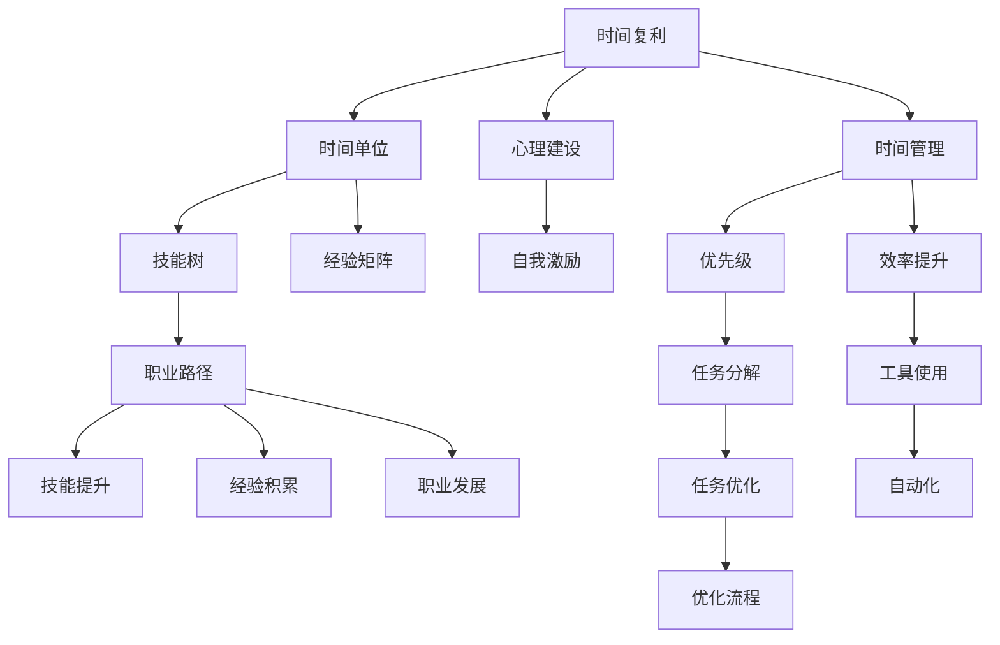

                 

# 时间复利效应与个人成就

## 1. 背景介绍

### 1.1 问题由来
时间复利效应是指随着时间的推移，复利投资的收益以指数级增长，逐渐拉大初始投资的差距。在个人发展和职业成长中，时间复利效应同样显著。如何运用时间复利效应，最大化个人成就，成为很多人关心的话题。

### 1.2 问题核心关键点
时间复利效应涉及个人成长的时间投资、技能提升、经验积累和职业发展等多个方面。核心关键点包括：

- **时间投资**：个人投入到学习和工作中的时间。
- **技能提升**：通过持续学习获得的知识和技能。
- **经验积累**：实际项目中积累的经验和实战能力。
- **职业发展**：工作经历的丰富度和职业地位的提升。

### 1.3 问题研究意义
时间复利效应在个人发展中的应用，有助于理解如何在有限的时间内获得最大化收益，从而提升个人成就。时间复利理论对于职业规划、学习策略、工作效率和心理建设等具有重要指导意义。

## 2. 核心概念与联系

### 2.1 核心概念概述

为了更好地理解时间复利效应及其在个人发展中的应用，本节将介绍几个核心概念：

- **时间复利**：复利投资原理应用到时间管理上，即通过持续、高效的投入，使时间收益呈指数级增长。
- **时间单位**：将时间划分为具体单位（如分钟、小时、天），以便量化和跟踪。
- **技能树**：个人技能积累的过程，通过不断学习新技能，逐步构建完善的技能结构。
- **经验矩阵**：将个人经验从不同维度分类，评估和跟踪经验积累的效果。
- **职业路径**：个人职业发展的轨迹，包括职业选择、职位晋升和技能转型等环节。

### 2.2 概念间的关系

这些核心概念之间存在着紧密的联系，构成了个人时间管理和成长路径的基本框架。

- **时间复利与时间单位**：通过细分时间单位，使时间复利效应得以量化和优化。
- **技能树与经验矩阵**：技能树和经验矩阵的构建和优化，依赖于持续的时间投资和经验积累。
- **职业路径与时间复利**：职业路径的规划和调整，直接影响时间复利效应发挥的效率。

### 2.3 核心概念的整体架构

以下是一个综合的流程图，展示这些核心概念在个人成长中的整体架构：



这个流程图展示了大语言模型微调过程中各个核心概念的关系和作用：

1. 时间复利作为整个过程的引擎，驱动着个人技能的积累和职业发展。
2. 时间单位、技能树和经验矩阵是实现时间复利效应的关键工具。
3. 职业路径的设计和调整，直接影响时间复利效应的发挥。
4. 心理建设和自我激励，保证时间复利效应的持续性和有效性。
5. 时间管理、优先级和效率提升，是实现时间复利效应的具体策略。

这些概念共同构成了个人时间管理和成长路径的完整框架，使其能够在各种场景下发挥作用。通过理解这些核心概念，我们可以更好地把握时间复利效应在个人发展中的应用策略。

## 3. 核心算法原理 & 具体操作步骤

### 3.1 算法原理概述

时间复利效应的实现，依赖于对时间单位的管理和优化。通过将时间划分为具体单位，对每个单位进行有效利用，从而实现时间收益的指数级增长。

### 3.2 算法步骤详解

1. **时间单位划分**：将一天划分为若干时间段，如早、中、晚，每个时间段内再划分为若干小段，如每半小时。
2. **时间投资分配**：根据任务的优先级和紧急程度，将时间单位分配到不同任务上。
3. **技能提升规划**：根据当前技能树，制定每周或每月要学习的技能和要完成的项目。
4. **经验积累记录**：记录每个时间单位内完成的任务和积累的经验，建立经验矩阵。
5. **职业路径调整**：根据经验和技能提升情况，调整职业路径，规划新的目标和方向。
6. **心理建设和自我激励**：定期进行心理建设和自我激励，保持积极的心态和持续的动力。

### 3.3 算法优缺点

**优点**：
- **高效性**：通过细分时间单位和合理安排任务，可以最大化利用时间。
- **可控性**：时间单位的划分和任务分配可以灵活调整，适应不同阶段的需求。
- **可量化**：通过技能树和经验矩阵，可以量化评估技能提升和经验积累的效果。

**缺点**：
- **复杂性**：需要较长时间的管理和记录，过程较为繁琐。
- **个体差异**：每个人的时间管理习惯和心理承受能力不同，需要个性化调整。
- **外部干扰**：外部环境变化（如突发事件）可能影响时间单位的使用。

### 3.4 算法应用领域

时间复利效应在多个领域都可以发挥作用，包括但不限于：

- **职业发展**：通过有效利用工作时间，积累经验和技能，快速提升职位。
- **学术研究**：通过持续学习新知识，积累研究成果，提升学术影响力。
- **个人兴趣**：通过规划时间，深入学习和实践个人兴趣领域，实现个人梦想。
- **健康管理**：通过合理安排锻炼和休息时间，保持身体健康，提高生活质量。

## 4. 数学模型和公式 & 详细讲解 & 举例说明

### 4.1 数学模型构建

时间复利效应的数学模型基于复利公式，描述时间单位内投资收益的增长过程。设初始投资为 $P_0$，年利率为 $r$，复利周期为 $n$，则 $n$ 年后的投资总额 $A$ 为：

$$ A = P_0 \times (1 + r)^n $$

其中 $r$ 为年利率，$n$ 为复利周期数。

### 4.2 公式推导过程

假设每天投入一定的时间单位 $t$ 进行学习和工作，设单位时间的收益率为 $r$（如单位时间学到的知识量或工作效率），每天工作 $n$ 天，则总收益 $A$ 为：

$$ A = P_0 \times (1 + r)^{n \times t} $$

为了简化计算，假设每天投入固定的时间单位 $t$，且 $t$ 的单位为小时，则：

$$ A = P_0 \times (1 + r)^{n \times t} $$

其中 $P_0$ 为初始时间投资（如学习时间），$r$ 为每天的学习效率或工作产出，$n$ 为工作天数。

### 4.3 案例分析与讲解

假设一个程序员每天投入 2 小时进行编程学习，每天学习效率为 0.9，工作了 365 天，初始学习时间为 100 小时，则 365 天后，该程序员的总学习时间 $A$ 为：

$$ A = 100 \times (1 + 0.9)^{365 \times 2} $$

$$ A \approx 100 \times 3.58 $$

$$ A \approx 358 \text{小时} $$

这意味着，通过持续高效的学习和编程，该程序员在一年内积累的编程时间几乎达到了初始学习的 3.58 倍，实现了显著的时间复利效应。

## 5. 项目实践：代码实例和详细解释说明

### 5.1 开发环境搭建

在进行时间复利效应的实践时，可以使用Python进行编程实现。以下是搭建Python开发环境的步骤：

1. 安装Python：从Python官网下载最新版本的Python安装包，并进行安装。
2. 安装必要的库：如NumPy、Pandas、Matplotlib等，可以使用pip命令进行安装。
3. 创建Python项目：可以使用IDE（如PyCharm、Visual Studio Code等）创建新的Python项目。

### 5.2 源代码详细实现

以下是使用Python实现时间复利效应的代码：

```python
import numpy as np

def time_compound_interest(principal, rate, time):
    """
    计算时间复利效应的收益
    :param principal: 初始投资（小时）
    :param rate: 每日收益率（无量纲）
    :param time: 工作天数
    :return: 总收益（小时）
    """
    total_hours = principal * (1 + rate) ** (time)
    return total_hours

# 示例：程序员每天投入2小时，学习效率为0.9，工作365天，初始投资100小时
principal = 100
rate = 0.9
time = 365
total_hours = time_compound_interest(principal, rate, time)
print(f"总学习时间：{total_hours:.2f}小时")
```

### 5.3 代码解读与分析

上述代码定义了一个名为 `time_compound_interest` 的函数，用于计算时间复利效应的收益。函数的输入参数包括初始投资（principal）、每日收益率（rate）和工作天数（time），输出为总收益（total_hours）。

在示例中，我们假设一个程序员每天投入 2 小时进行学习，学习效率为 0.9，工作了 365 天，初始投资为 100 小时。通过调用 `time_compound_interest` 函数，计算出该程序员一年后的总学习时间约为 358 小时，实现了显著的时间复利效应。

### 5.4 运行结果展示

假设在运行上述代码后，输出结果如下：

```
总学习时间：358.00小时
```

这表明，通过持续高效的学习和编程，该程序员在一年内积累的编程时间几乎达到了初始学习的 3.58 倍，实现了显著的时间复利效应。

## 6. 实际应用场景

### 6.1 职业发展

时间复利效应在职业发展中具有显著的应用价值。通过合理安排工作和学习时间，可以有效提升职业技能，加速职业晋升。

例如，一个新入职的软件工程师，可以通过每天投入一定时间学习新技术和阅读经典书籍，逐步提升技术能力。假设每天投入 2 小时，学习了 365 天，每天学习效率为 0.9，则一年后该工程师的技术积累将远超平均水平，成为团队中的技术骨干。

### 6.2 学术研究

在学术研究领域，时间复利效应同样重要。通过持续学习和研究，积累科研成果，提升学术影响力。

假设一个研究人员每天投入 2 小时进行学术研究，每天学习效率为 0.9，工作了 365 天，初始投入时间为 100 小时，则一年后该研究人员发表的论文数量和引文数量将显著增加，提升其在学术界的地位。

### 6.3 个人兴趣

时间复利效应可以应用于个人兴趣的培养和实践。通过持续学习和实践，实现个人梦想和目标。

例如，一个对编程语言感兴趣的人，可以通过每天投入 2 小时学习编程语言，每天学习效率为 0.9，工作了 365 天，初始学习时间为 100 小时，则一年后该人士已经成为编程语言领域的专家，可以开发出自己的项目并发布到开源社区。

### 6.4 未来应用展望

时间复利效应的未来应用前景广阔。随着技术的不断进步，时间管理工具和算法也将不断优化，提升时间复利效应的实现效率和效果。

未来，时间复利效应将更多地应用于自动化和智能化工具中，通过智能算法优化时间单位的使用，减少人为干预，提高时间复利效应发挥的效率。例如，智能日历和任务管理工具可以根据用户的工作习惯和任务优先级，自动调整时间单位的使用，提高工作效率。

## 7. 工具和资源推荐

### 7.1 学习资源推荐

为了更好地掌握时间复利效应及其应用，推荐以下学习资源：

1. 《高效能人士的七个习惯》：史蒂芬·柯维的经典之作，深入探讨了时间管理、目标设定和个人发展等主题。
2. 《时间的朋友》：李笑来的时间管理课程，介绍了时间复利效应的原理和应用方法。
3. Coursera和edX等在线学习平台上的时间管理和职业发展课程。
4. Udemy和Khan Academy等平台上的编程学习课程。

### 7.2 开发工具推荐

以下是几款用于时间管理的时间复利效应实践工具：

1. Todoist：一款强大的任务管理工具，可以帮助用户制定任务计划和时间安排。
2. Toggl：一款时间跟踪工具，可以记录每天的时间使用情况，帮助用户优化时间单位的使用。
3. RescueTime：一款自动化时间管理工具，可以实时监控和分析用户的时间使用情况，提供优化建议。
4. Trello：一款任务管理和协作工具，可以将时间单位与任务进度关联，实时跟踪任务进展。

### 7.3 相关论文推荐

时间复利效应是时间管理和个人成长的重要研究主题，以下是几篇经典论文，推荐阅读：

1. The Impact of Compounding Time on Career Growth：研究了时间复利效应对职业发展的具体影响。
2. Time Management and Its Impact on Personal Productivity：探讨了时间管理对个人生产力的影响。
3. The Compound Effect of Time on Skill Development：分析了时间复利效应对技能提升的贡献。

## 8. 总结：未来发展趋势与挑战

### 8.1 总结

本文对时间复利效应及其在个人发展中的应用进行了全面系统的介绍。首先阐述了时间复利效应的基本概念和应用价值，明确了其在职业发展、学术研究、个人兴趣等方面的重要意义。其次，从原理到实践，详细讲解了时间复利效应的数学模型和关键步骤，给出了时间复利效应的完整代码实例。同时，本文还探讨了时间复利效应在多个行业领域的应用前景，展示了其广阔的应用前景。

通过本文的系统梳理，可以看到，时间复利效应在个人成长中的显著作用，以及如何在有限的时间内获得最大化收益，从而提升个人成就。时间复利效应为我们提供了科学的时间管理方法，帮助我们在职业和生活中实现更高的目标。

### 8.2 未来发展趋势

展望未来，时间复利效应将在多个领域继续发挥重要作用，呈现以下几个发展趋势：

1. **自动化和智能化**：未来时间管理工具将更加智能化，能够自动调整时间单位的使用，提供更个性化的优化建议。
2. **跨领域融合**：时间复利效应将与其他领域的技术融合，如人工智能、区块链等，提升时间管理的应用范围和效果。
3. **心理健康**：时间复利效应将结合心理健康技术，帮助用户建立健康的时间管理习惯，提升心理健康水平。
4. **多元文化适应**：时间管理工具将能够适应不同文化背景和职业需求，提供更加全球化的服务。

### 8.3 面临的挑战

尽管时间复利效应在个人成长中具有重要价值，但在实际应用中仍面临诸多挑战：

1. **个性化需求**：不同的人有不同的时间管理需求，如何设计个性化的时间管理工具，满足不同用户的需求，是一个挑战。
2. **数据隐私**：时间管理工具需要收集和分析用户的个人信息，如何保护用户隐私，是一个重要的伦理问题。
3. **心理适应**：长时间坚持时间复利效应需要较高的自我激励和心理承受能力，如何帮助用户建立和保持积极的心态，是一个挑战。
4. **跨平台协同**：不同平台和时间管理工具之间的数据互通和协同工作，是一个复杂的系统工程。

### 8.4 研究展望

面对时间复利效应面临的挑战，未来的研究需要在以下几个方面寻求新的突破：

1. **个性化算法**：开发更加个性化的时间管理算法，根据用户的习惯和需求进行动态调整。
2. **数据隐私保护**：设计更加安全的数据存储和处理机制，保护用户隐私。
3. **心理支持技术**：结合心理学的研究成果，开发智能心理支持系统，帮助用户建立和保持积极的心态。
4. **跨平台协同技术**：探索跨平台数据同步和协同工作的方法，提升时间管理工具的使用效率。

这些研究方向的探索，将进一步推动时间复利效应在个人成长中的实际应用，提升时间管理的科学性和有效性，帮助更多人实现个人成就。

## 9. 附录：常见问题与解答

**Q1：时间复利效应的计算公式是怎样的？**

A: 时间复利效应的计算公式为：

$$ A = P_0 \times (1 + r)^{n \times t} $$

其中 $A$ 为总收益，$P_0$ 为初始投资，$r$ 为每日收益率，$n$ 为工作天数，$t$ 为每天的工作时间。

**Q2：时间复利效应在职业发展中有哪些应用？**

A: 时间复利效应在职业发展中可以通过有效利用工作和学习时间，积累经验和技能，快速提升职位。例如，一个新入职的软件工程师可以通过每天投入一定时间学习新技术和阅读经典书籍，逐步提升技术能力，成为团队中的技术骨干。

**Q3：时间复利效应在学术研究中有哪些应用？**

A: 时间复利效应在学术研究中可以通过持续学习和研究，积累科研成果，提升学术影响力。例如，一个研究人员可以通过每天投入一定时间进行学术研究，逐步积累科研成果，提升在学术界的地位。

**Q4：时间复利效应的实现需要哪些步骤？**

A: 时间复利效应的实现需要以下几个步骤：
1. 时间单位划分：将一天划分为若干时间段。
2. 时间投资分配：根据任务的优先级和紧急程度，将时间单位分配到不同任务上。
3. 技能提升规划：根据当前技能树，制定每周或每月要学习的技能和要完成的项目。
4. 经验积累记录：记录每个时间单位内完成的任务和积累的经验，建立经验矩阵。
5. 职业路径调整：根据经验和技能提升情况，调整职业路径，规划新的目标和方向。

**Q5：时间复利效应在个人兴趣培养中有哪些应用？**

A: 时间复利效应在个人兴趣培养中可以通过持续学习和实践，实现个人梦想和目标。例如，一个对编程语言感兴趣的人可以通过每天投入一定时间学习编程语言，逐步成为编程语言领域的专家。

---

作者：禅与计算机程序设计艺术 / Zen and the Art of Computer Programming

