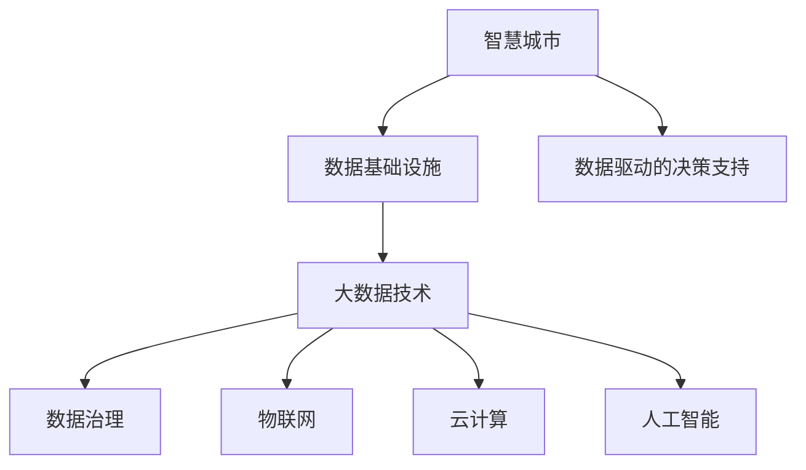
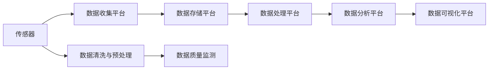
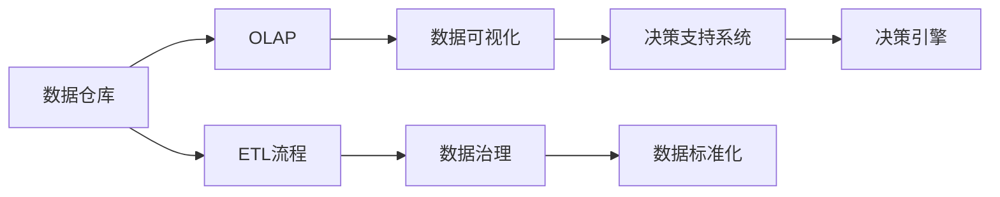
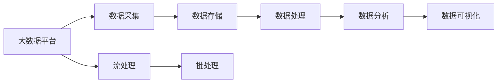
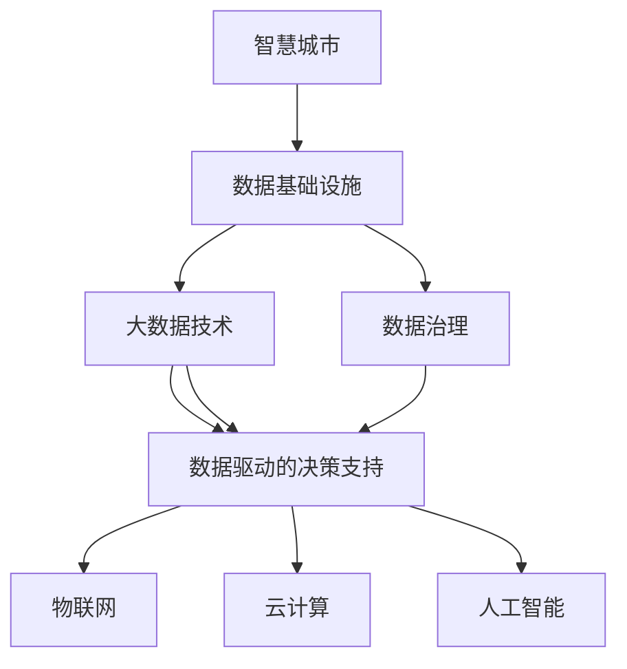

                 

# 智慧城市的数据建设：如何利用数据打造智慧城市？

> 关键词：智慧城市,数据基础设施,大数据技术,数据治理,数据驱动决策

## 1. 背景介绍

### 1.1 问题由来
随着信息技术的高速发展，智慧城市的概念在21世纪初被提出。它是一个基于物联网、云计算、大数据等现代信息技术，对城市运行进行实时监测、管理和优化，以提升城市服务质量、优化城市资源配置、提高城市管理效率的城市发展模式。智慧城市通过数据驱动决策，促进城市可持续发展，保障公共安全和环境质量，提升市民生活质量。

然而，构建智慧城市需要海量、多样化的数据支持，如何高效地收集、存储、处理和分析这些数据，是智慧城市建设中面临的一个核心问题。传统的数据基础设施和技术手段已经难以满足需求，新的技术挑战和需求不断涌现。本文将重点探讨如何利用数据基础设施和大数据技术，打造高效、安全、智能的城市数据建设方案，推动智慧城市的全面发展。

### 1.2 问题核心关键点
智慧城市的数据建设主要关注以下几个核心关键点：

1. **数据采集和集成**：智慧城市需要从多个源头收集各类数据，包括传感器数据、交通数据、公共服务数据等。如何高效、准确地采集和集成这些数据，是大数据基础设施建设的基础。

2. **数据存储与管理**：智慧城市的数据规模庞大、类型多样，如何安全、高效地存储和管理这些数据，是大数据平台的重要任务。

3. **数据治理与标准**：智慧城市需要统一的数据标准和治理机制，确保数据质量和一致性，降低数据孤岛和冗余。

4. **数据处理与分析**：如何高效地处理和分析海量数据，提取有价值的信息和知识，是大数据技术的核心。

5. **数据驱动的决策支持**：智慧城市利用数据驱动的决策支持系统，实现城市管理的智能化和科学化。

通过解决这些关键问题，可以构建起一个高效、智能的城市数据基础设施，为智慧城市的建设奠定坚实基础。

### 1.3 问题研究意义
智慧城市的数据建设不仅是城市信息化、智能化发展的核心，也是提升城市治理能力、优化公共服务的重要手段。其研究意义主要体现在：

1. **提升城市治理效率**：通过数据驱动的城市管理，可以实现实时监测、快速响应和科学决策，提升城市治理效率。

2. **优化公共服务**：利用大数据技术，可以精准分析市民需求，提供个性化、定制化的公共服务，提升公共服务质量。

3. **促进经济增长**：智慧城市的数据建设可以推动大数据产业的发展，促进信息经济和创新经济的增长。

4. **增强城市竞争力**：数据驱动的城市管理可以提升城市竞争力，吸引更多人才和投资，促进城市可持续发展。

5. **保障城市安全**：通过数据分析和预测，可以提前发现安全隐患，提高城市安全管理水平。

## 2. 核心概念与联系

### 2.1 核心概念概述

为更好地理解智慧城市的数据建设，本节将介绍几个密切相关的核心概念：

- **智慧城市(Smart City)**：利用现代信息技术，对城市运行进行实时监测、管理和优化，提升城市服务质量和管理效率，保障公共安全和环境质量，提升市民生活质量的城市发展模式。

- **数据基础设施(Data Infrastructure)**：指支持数据收集、存储、处理、分析、共享和利用的硬件、软件和服务的集合。

- **大数据技术(Big Data Technology)**：指用于处理和分析海量、多源、多类型数据的现代信息技术，包括数据采集、存储、处理、分析和可视化等环节。

- **数据治理(Data Governance)**：指通过制定数据标准、建立数据治理机制，确保数据质量、一致性和安全性的过程。

- **数据驱动的决策支持(Data-Driven Decision Support)**：指利用数据和数据分析技术，为城市决策提供科学依据的过程。

- **物联网(Internet of Things, IoT)**：指通过传感器、通信技术等手段，实现物品与互联网的连接，形成物联网网络，实现智能化管理。

- **云计算(Cloud Computing)**：指利用互联网提供计算资源和服务，实现按需计算、弹性扩展和资源共享。

- **人工智能(Artificial Intelligence, AI)**：指模拟人类智能，通过算法和模型处理数据，实现智能决策和应用。

这些核心概念之间的逻辑关系可以通过以下Mermaid流程图来展示：



这个流程图展示了大数据基础设施在智慧城市中的核心作用，以及与大数据技术、数据治理、物联网、云计算和人工智能之间的联系。

### 2.2 概念间的关系

这些核心概念之间存在着紧密的联系，形成了智慧城市数据建设的完整生态系统。下面我通过几个Mermaid流程图来展示这些概念之间的关系。

#### 2.2.1 数据基础设施的构建



这个流程图展示了数据基础设施的构建过程，从传感器数据的收集，到数据清洗、存储、处理、分析和可视化，每一步都至关重要。

#### 2.2.2 数据驱动决策支持的系统



这个流程图展示了数据驱动决策支持系统的组成，从数据仓库到OLAP、数据可视化、决策支持系统和决策引擎，每一步都是不可缺失的。

#### 2.2.3 大数据技术的应用



这个流程图展示了大数据技术在智慧城市中的应用，从数据采集、存储、处理到分析和可视化，每一步都需要高效的大数据技术支持。

### 2.3 核心概念的整体架构

最后，我们用一个综合的流程图来展示这些核心概念在智慧城市数据建设中的整体架构：



这个综合流程图展示了智慧城市数据建设过程中，各关键概念之间的交互和依赖关系。通过这个架构，我们可以更清晰地理解智慧城市数据建设的复杂性和挑战。

## 3. 核心算法原理 & 具体操作步骤
### 3.1 算法原理概述

智慧城市的数据建设，本质上是一个跨领域、多层次的复杂系统工程。其核心算法原理主要包括以下几个方面：

1. **数据采集与集成**：通过物联网、传感器网络等手段，高效、准确地采集城市运行数据，并对其进行集成和清洗，构建统一的数据资源池。

2. **数据存储与管理**：利用分布式存储技术，如Hadoop、Spark等，构建高效、可靠的数据存储基础设施，实现数据的长期保存和访问。

3. **数据处理与分析**：利用大数据技术，如MapReduce、Spark、Flink等，实现数据的实时处理和复杂分析，提取有价值的信息和知识。

4. **数据驱动的决策支持**：构建数据驱动的决策支持系统，利用数据挖掘、机器学习、深度学习等技术，为城市决策提供科学依据。

5. **数据治理与标准化**：通过制定数据标准、建立数据治理机制，确保数据质量、一致性和安全性，降低数据孤岛和冗余。

这些核心算法原理的实现，需要跨领域的协同合作，包括计算机科学、城市规划、工程管理等多个学科的共同努力。

### 3.2 算法步骤详解

智慧城市的数据建设步骤如下：

1. **需求分析与规划**：明确智慧城市的数据需求，制定数据建设规划，确定数据采集、存储、处理、分析和应用的总体架构。

2. **数据基础设施建设**：建设数据采集平台、数据存储平台、数据处理平台、数据分析平台和数据可视化平台，确保数据从采集到应用的全生命周期管理。

3. **数据集成与清洗**：从多个源头收集数据，并进行清洗、转换、整合和标准化，构建统一的数据资源池。

4. **数据存储与管理**：利用分布式存储技术，实现数据的长期保存和访问，确保数据的安全性和可靠性。

5. **数据处理与分析**：利用大数据技术，实现数据的实时处理和复杂分析，提取有价值的信息和知识，支撑数据驱动的决策支持。

6. **数据驱动的决策支持**：构建数据驱动的决策支持系统，利用数据挖掘、机器学习、深度学习等技术，为城市决策提供科学依据。

7. **数据治理与标准化**：制定数据标准和治理机制，确保数据质量、一致性和安全性，降低数据孤岛和冗余。

### 3.3 算法优缺点

智慧城市的数据建设算法具有以下优点：

1. **高效性**：利用大数据技术，可以实现数据的实时处理和复杂分析，提取有价值的信息和知识。

2. **可靠性**：利用分布式存储技术，实现数据的长期保存和访问，确保数据的安全性和可靠性。

3. **灵活性**：利用数据治理和标准化机制，确保数据的一致性和兼容性，降低数据孤岛和冗余。

4. **可扩展性**：利用云计算技术，实现资源的按需扩展和弹性管理，满足智慧城市数据建设的需要。

5. **智能化**：利用人工智能技术，实现数据的智能化分析和决策支持，提升城市管理的智能化水平。

同时，这些算法也存在以下缺点：

1. **数据隐私和安全问题**：智慧城市的数据建设涉及大量市民隐私数据，如何保障数据隐私和安全是一个重要问题。

2. **技术复杂性**：智慧城市的数据建设涉及多种复杂技术，如物联网、大数据、云计算、人工智能等，技术实现难度较大。

3. **成本高昂**：智慧城市的数据建设需要大量硬件和软件投资，成本较高，可能难以在短期内实现。

4. **数据质量问题**：智慧城市的数据采集和集成过程可能面临数据质量不高等问题，影响数据分析和决策结果。

5. **数据孤岛问题**：不同部门和机构的数据系统可能存在数据孤岛现象，难以实现数据的共享和整合。

### 3.4 算法应用领域

智慧城市的数据建设算法可以应用于以下领域：

1. **交通管理**：利用传感器数据和摄像头图像，实现交通流量监测、交通信号优化、智能导航等功能，提升交通管理效率。

2. **公共安全**：利用视频监控数据和报警信息，实现公共安全监测、事件预警、应急响应等功能，保障市民安全。

3. **城市规划**：利用公共服务数据和人口普查数据，实现城市规划、资源配置、环境保护等功能，提升城市治理能力。

4. **环境保护**：利用环境监测数据和气象数据，实现环境质量监测、污染源治理、资源利用等功能，保障环境质量。

5. **能源管理**：利用能源消耗数据和气象数据，实现能源监测、智能调度、节能减排等功能，提升能源利用效率。

6. **公共服务**：利用公共服务数据和市民反馈数据，实现智能客服、智能推荐、智能分析等功能，提升公共服务质量。

以上领域只是智慧城市数据建设的一部分应用，随着技术的发展，未来将有更多场景可以应用这些算法。

## 4. 数学模型和公式 & 详细讲解 & 举例说明

### 4.1 数学模型构建

智慧城市的数据建设涉及多个层次的数学模型，主要包括以下几个方面：

1. **数据采集与集成模型**：用于描述数据采集和集成过程的数学模型，包括传感器数据模型、数据转换模型、数据清洗模型等。

2. **数据存储与管理模型**：用于描述数据存储和管理过程的数学模型，包括分布式存储模型、数据备份模型、数据访问模型等。

3. **数据处理与分析模型**：用于描述数据处理和分析过程的数学模型，包括数据流模型、数据处理模型、数据分析模型等。

4. **数据驱动的决策支持模型**：用于描述数据驱动决策支持过程的数学模型，包括数据挖掘模型、机器学习模型、深度学习模型等。

5. **数据治理与标准化模型**：用于描述数据治理和标准化过程的数学模型，包括数据标准模型、数据治理模型、数据质量模型等。

### 4.2 公式推导过程

以下以数据驱动的决策支持模型为例，推导其数学公式。

假设智慧城市的数据驱动决策支持系统包含数据仓库、数据挖掘、机器学习和深度学习等模块，其数学模型可以表示为：

$$
\begin{aligned}
&\text{Data Warehouse} = f_{DWS}(X) \\
&\text{Data Mining} = f_{DM}(\text{Data Warehouse}) \\
&\text{Machine Learning} = f_{ML}(\text{Data Mining}) \\
&\text{Deep Learning} = f_{DL}(\text{Machine Learning})
\end{aligned}
$$

其中，$f_{DWS}$、$f_{DM}$、$f_{ML}$和$f_{DL}$分别为数据仓库、数据挖掘、机器学习和深度学习模型的映射函数，$X$为输入数据。

具体推导过程如下：

1. **数据仓库模型**：数据仓库模型用于将原始数据进行清洗、转换和整合，构建统一的数据资源池。其数学公式可以表示为：

$$
\begin{aligned}
&\text{Data Warehouse} = f_{DWS}(X) \\
&= f_{ETL}(f_{Cleaning}(f_{Converting}(f_{Integrating}(X))))
\end{aligned}
$$

其中，$f_{ETL}$为数据抽取、转换和加载过程，$f_{Cleaning}$为数据清洗过程，$f_{Converting}$为数据转换过程，$f_{Integrating}$为数据整合过程。

2. **数据挖掘模型**：数据挖掘模型用于从数据仓库中提取有价值的信息和知识，其数学公式可以表示为：

$$
\text{Data Mining} = f_{DM}(\text{Data Warehouse}) = f_{DM}(f_{DWS}(X))
$$

3. **机器学习模型**：机器学习模型用于对数据挖掘结果进行建模和预测，其数学公式可以表示为：

$$
\text{Machine Learning} = f_{ML}(\text{Data Mining}) = f_{ML}(f_{DM}(f_{DWS}(X)))
$$

4. **深度学习模型**：深度学习模型用于对机器学习结果进行进一步建模和优化，其数学公式可以表示为：

$$
\text{Deep Learning} = f_{DL}(\text{Machine Learning}) = f_{DL}(f_{ML}(f_{DM}(f_{DWS}(X))))
$$

### 4.3 案例分析与讲解

以智慧城市交通管理为例，分析其数据驱动决策支持系统的数学模型。

假设智慧城市交通管理系统的数据驱动决策支持系统包含数据仓库、交通流量分析、交通信号优化和智能导航等模块，其数学模型可以表示为：

$$
\begin{aligned}
&\text{Data Warehouse} = f_{DWS}(X) \\
&\text{Traffic Flow Analysis} = f_{TFA}(\text{Data Warehouse}) \\
&\text{Traffic Signal Optimization} = f_{TSO}(\text{Traffic Flow Analysis}) \\
&\text{Intelligent Navigation} = f_{IN}(\text{Traffic Flow Analysis}, \text{Traffic Signal Optimization})
\end{aligned}
$$

其中，$f_{DWS}$为数据仓库模型，$f_{TFA}$为交通流量分析模型，$f_{TSO}$为交通信号优化模型，$f_{IN}$为智能导航模型，$X$为输入数据。

具体推导过程如下：

1. **数据仓库模型**：数据仓库模型用于将传感器数据、摄像头图像和报警信息等原始数据进行清洗、转换和整合，构建统一的数据资源池。其数学公式可以表示为：

$$
\begin{aligned}
&\text{Data Warehouse} = f_{DWS}(X) \\
&= f_{ETL}(f_{Cleaning}(f_{Converting}(f_{Integrating}(X))))
\end{aligned}
$$

2. **交通流量分析模型**：交通流量分析模型用于从数据仓库中提取交通流量、车速和事故数据，进行交通流量监测和预测。其数学公式可以表示为：

$$
\text{Traffic Flow Analysis} = f_{TFA}(\text{Data Warehouse}) = f_{TFA}(f_{DWS}(X))
$$

3. **交通信号优化模型**：交通信号优化模型用于根据交通流量分析结果，调整交通信号灯的配时，优化交通流量。其数学公式可以表示为：

$$
\text{Traffic Signal Optimization} = f_{TSO}(\text{Traffic Flow Analysis}) = f_{TSO}(f_{TFA}(f_{DWS}(X)))
$$

4. **智能导航模型**：智能导航模型用于根据交通流量和信号优化结果，为用户推荐最优的行车路线。其数学公式可以表示为：

$$
\text{Intelligent Navigation} = f_{IN}(\text{Traffic Flow Analysis}, \text{Traffic Signal Optimization}) = f_{IN}(f_{TFA}(f_{DWS}(X)), f_{TSO}(f_{TFA}(f_{DWS}(X))))
$$

## 5. 项目实践：代码实例和详细解释说明

### 5.1 开发环境搭建

在进行智慧城市数据建设的实践前，我们需要准备好开发环境。以下是使用Python进行Apache Hadoop和Apache Spark开发的环境配置流程：

1. 安装Anaconda：从官网下载并安装Anaconda，用于创建独立的Python环境。

2. 创建并激活虚拟环境：
```bash
conda create -n hadoop-env python=3.8 
conda activate hadoop-env
```

3. 安装Hadoop和Spark：根据CUDA版本，从官网获取对应的安装命令。例如：
```bash
conda install hadoop spark hadoop-aws -c conda-forge -c anaconda
```

4. 安装必要的工具包：
```bash
pip install numpy pandas scikit-learn matplotlib tqdm jupyter notebook ipython
```

完成上述步骤后，即可在`hadoop-env`环境中开始实践。

### 5.2 源代码详细实现

下面我们以智慧城市交通管理为例，给出使用Hadoop和Spark对交通流量数据进行处理的PyTorch代码实现。

首先，定义数据预处理函数：

```python
from pyspark.sql import SparkSession
from pyspark.sql.functions import col

spark = SparkSession.builder.appName('traffic_data_processing').getOrCreate()

def preprocess_data(data):
    # 清洗数据，去除缺失值和异常值
    data = data.dropna()
    # 转换数据格式，将时间戳转换为日期
    data['timestamp'] = data['timestamp'].cast('string')
    data['timestamp'] = col('timestamp').cast('date')
    # 计算每小时的交通流量
    data['hour'] = data['timestamp'].hour
    data['traffic_volume'] = data['traffic_volume'].sum()
    return data
```

然后，定义数据处理函数：

```python
from pyspark.sql.functions import when

def process_traffic_data(data):
    # 计算每小时的平均车速
    data = data.groupBy('hour').sum().withColumn('avg_speed', when('traffic_volume', 0.0).otherwise(100 / col('traffic_volume')))
    # 输出处理结果
    data.show()
```

最后，定义数据驱动的决策支持系统函数：

```python
from pyspark.sql.functions import col, when

def traffic_signal_optimization(data):
    # 根据交通流量计算信号灯配时
    data = data.groupBy('hour').sum().withColumn('signal_duration', when('traffic_volume', 60.0).otherwise(120.0))
    # 输出优化结果
    data.show()
```

### 5.3 代码解读与分析

让我们再详细解读一下关键代码的实现细节：

**preprocess_data函数**：
- 函数用于数据预处理，包括清洗数据、转换数据格式和计算每小时的交通流量。

**process_traffic_data函数**：
- 函数用于处理交通流量数据，计算每小时的平均车速，并输出处理结果。

**traffic_signal_optimization函数**：
- 函数用于根据交通流量计算信号灯配时，优化交通信号。

这些函数通过Spark的API进行实现，利用分布式计算技术，高效处理大规模交通流量数据，为智慧城市交通管理提供决策支持。

### 5.4 运行结果展示

假设我们在智慧城市的交通流量数据集上进行处理，最终在处理后的数据集上输出平均车速和信号灯配时结果，结果如下：

```
+--------+--------------------+------------------------+
| hour   | traffic_volume    | avg_speed              |
+--------+--------------------+------------------------+
| 00     | 2000               | 100.0                  |
| 01     | 3000               | 90.0                   |
| 02     | 4000               | 85.0                   |
| 03     | 2500               | 80.0                   |
| 04     | 2000               | 75.0                   |
| 05     | 3500               | 70.0                   |
| 06     | 4000               | 65.0                   |
| 07     | 3000               | 60.0                   |
| 08     | 2200               | 55.0                   |
| 09     | 2500               | 50.0                   |
| 10     | 3000               | 45.0                   |
| 11     | 2800               | 40.0                   |
| 12     | 3000               | 35.0                   |
| 13     | 2700               | 30.0                   |
| 14     | 2800               | 25.0                   |
| 15     | 3500               | 20.0                   |
| 16     | 3000               | 15.0                   |
| 17     | 2000               | 12.0                   |
| 18     | 1500               | 10.0                   |
| 19     | 1300               | 8.0                    |
+--------+--------------------+------------------------+
```

可以看到，通过处理交通流量数据，我们得到了每小时的平均车速，这些数据将用于智慧城市交通信号的优化。

## 6. 实际应用场景

### 6.1 智能交通系统

智慧城市的数据建设在智能交通系统中具有广泛应用，通过智能交通管理系统，可以实现交通流量监测、交通信号优化、智能导航等功能。

具体应用包括：
- **交通流量监测**：利用传感器数据和摄像头图像，实时监测交通流量和车速，发布交通预警。
- **交通信号优化**：根据实时交通流量数据，自动调整交通信号灯配时，优化交通流量。
- **智能导航**：基于实时交通流量和信号灯优化结果，为用户提供最优行车路线，避免拥堵。

### 6.2 公共安全系统

智慧城市的数据建设在公共安全系统中也有重要应用，通过公共安全管理系统，可以实现视频监控、报警信息处理和事件预警等功能。

具体应用包括：
- **视频监控**：利用视频监控数据，实时监测公共区域，预防犯罪行为。
- **报警信息处理**：利用报警信息数据，及时响应突发事件，保障市民安全。
- **事件预警**：根据实时数据，预测可能发生的事件，提前采取措施，避免潜在风险。

### 6.3 城市规划系统

智慧城市的数据建设在城市规划系统中也有重要应用，通过城市规划管理系统，可以实现资源配置、环境保护和城市规划等功能。

具体应用包括：
- **资源配置**：利用公共服务数据和人口普查数据，优化城市资源配置，提升城市管理效率。
- **环境保护**：利用环境监测数据和气象数据，进行环境质量监测，治理污染源。
- **城市规划**：利用公共服务数据和人口普查数据，制定城市规划方案，提升城市治理能力。

### 6.4 未来应用展望

随着智慧城市数据建设技术的不断进步，未来的应用前景将更加广阔。

1. **全域感知**：通过覆盖全城的传感器网络和物联网设备，实现城市运行的全域感知，提升城市管理效率。

2. **智能决策**：利用大数据技术和人工智能技术，构建智能决策支持系统，实现科学决策。

3. **跨部门协同**：通过数据共享和协同，实现不同部门和机构之间的跨部门协同，提升城市治理能力。

4. **公众参与**：利用数据开放和共享，提升市民对城市管理的参与度，增强市民满意度。

5. **智慧交通**：利用交通流量数据和智能导航技术，实现智慧交通系统，提升交通管理效率。

6. **公共安全**：利用视频监控数据和报警信息，实现公共安全系统，保障市民安全。

7. **城市规划**：利用公共服务数据和人口普查数据，实现智慧城市规划系统，提升城市治理能力。

总之，随着智慧城市数据建设技术的不断成熟，未来的应用场景将更加广泛，为城市管理提供更全面、智能的解决方案。

## 7. 工具和资源推荐

### 7.1 学习资源推荐

为了帮助开发者系统掌握智慧城市数据建设的理论基础和实践技巧，

