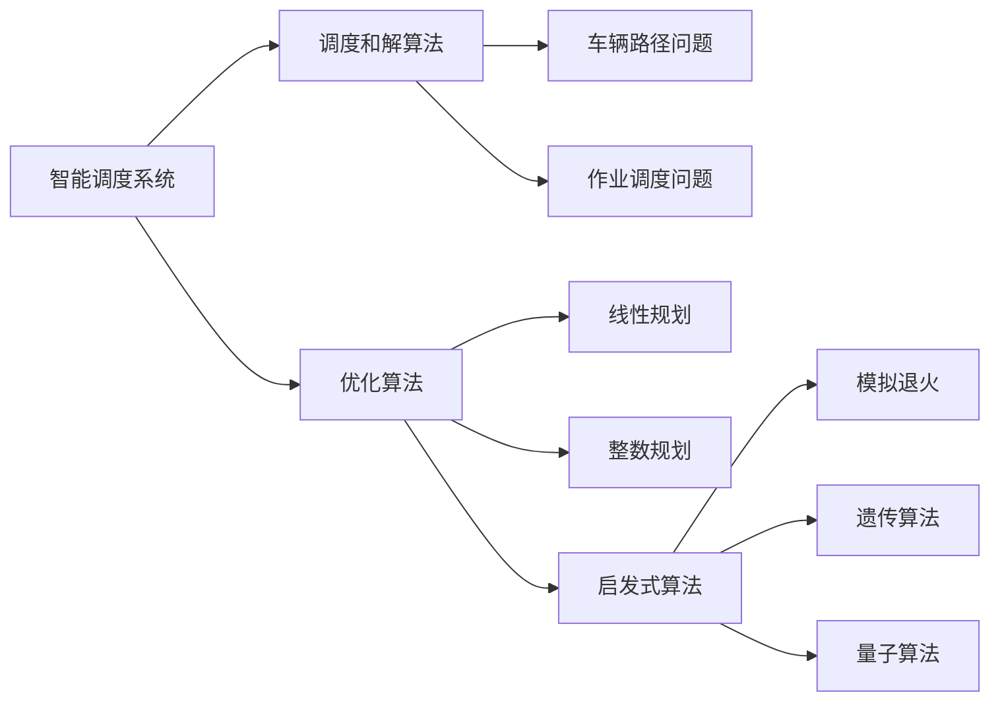
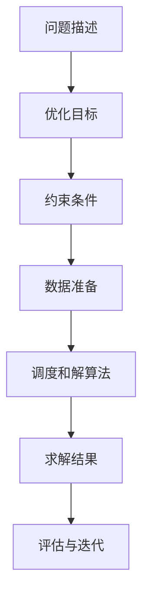
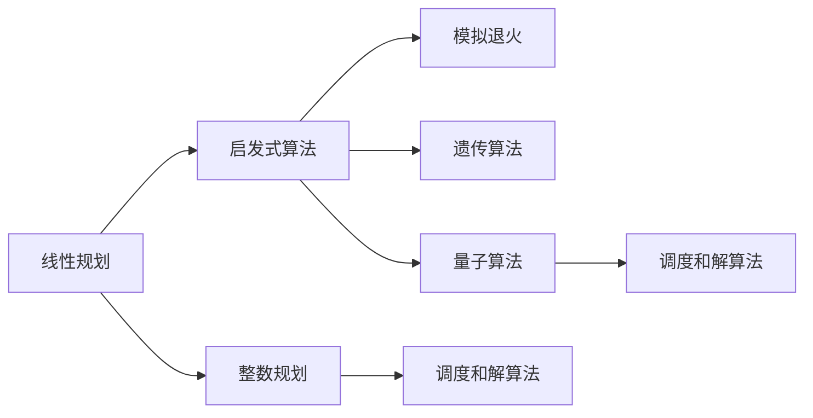
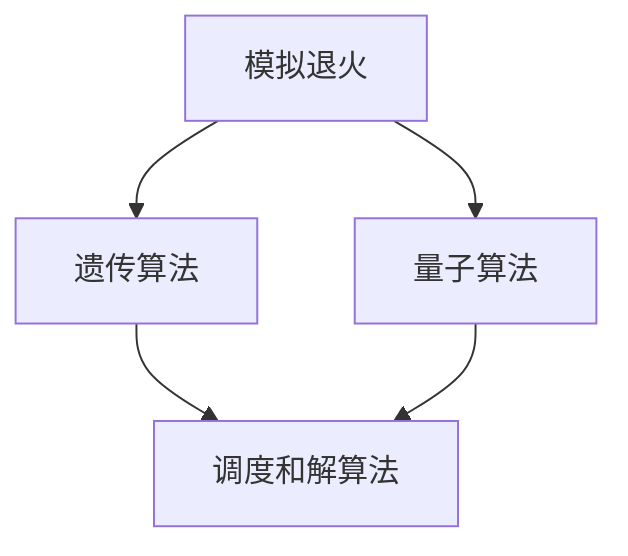

                 

# 智能调度系统在资源分配中的应用

> 关键词：智能调度系统,资源分配,优化算法,调度和解算法,模拟退火,遗传算法,量子算法,人工智能

## 1. 背景介绍

### 1.1 问题由来

随着科技和经济的快速发展，社会资源分配变得越来越复杂。从交通、能源、物流到医疗、教育、金融等各个领域，资源优化和分配问题都面临着极大的挑战。传统的优化算法往往需要耗费大量人力物力，且容易陷入局部最优，难以满足实际需求。

智能调度系统应运而生，通过引入人工智能和优化算法，可以有效提升资源分配的效率和公平性，优化决策过程。本文档旨在详细阐述智能调度系统在资源分配中的应用，并介绍其核心算法原理与操作步骤。

### 1.2 问题核心关键点

智能调度系统的核心思想是利用算法优化资源分配过程，以达到最优或次优解。具体而言，需要考虑以下几个关键点：

1. **目标函数**：定义资源分配的目标，如最小化成本、最大化效率、最小化延误等。
2. **约束条件**：定义资源分配的限制，如时间窗口、容量限制、优先级要求等。
3. **算法选择**：选择合适的算法进行求解，如线性规划、整数规划、启发式算法等。
4. **数据准备**：收集和处理问题描述数据，如时间表、资源需求、位置信息等。
5. **评估与迭代**：通过评估当前解，进行局部优化或全局优化，直到达到目标。

## 2. 核心概念与联系

### 2.1 核心概念概述

为了更好地理解智能调度系统在资源分配中的应用，本节将介绍几个密切相关的核心概念：

- **智能调度系统**：利用人工智能技术优化资源分配的自动化系统。常见类型包括运输调度、工厂调度、电网调度等。
- **优化算法**：通过数学模型和算法工具，求解资源分配问题的最优解或近似解。包括线性规划、整数规划、启发式算法等。
- **调度和解算法**：用于求解特定调度问题的算法，如车辆路径问题（Vehicle Routing Problem, VRP）、作业调度问题（Job Scheduling Problem, JSP）等。
- **模拟退火**：一种启发式优化算法，通过模拟物质退火过程，随机搜索解空间，避免局部最优。
- **遗传算法**：一种基于生物进化原理的优化算法，通过遗传操作搜索解空间。
- **量子算法**：利用量子计算的特性，在特定问题上取得指数级加速。

这些核心概念之间的逻辑关系可以通过以下Mermaid流程图来展示：



这个流程图展示了智能调度系统的核心概念及其之间的关系：

1. 智能调度系统利用优化算法进行求解。
2. 调度和解算法是优化算法的具体应用。
3. 常见的优化算法包括线性规划、整数规划、启发式算法等。
4. 启发式算法中包括模拟退火、遗传算法和量子算法等。

### 2.2 概念间的关系

这些核心概念之间存在着紧密的联系，形成了智能调度系统的完整生态系统。下面我们通过几个Mermaid流程图来展示这些概念之间的关系。

#### 2.2.1 智能调度系统的学习范式



这个流程图展示了智能调度系统的一般流程：

1. 问题描述明确资源分配的目标和限制条件。
2. 数据准备收集和处理相关数据，如时间表、资源需求等。
3. 调度和解算法求解最优解或近似解。
4. 求解结果评估当前解的性能，决定是否迭代优化。

#### 2.2.2 优化算法与调度算法的关系



这个流程图展示了优化算法与调度算法的关系：

1. 线性规划、整数规划等是常见的优化算法。
2. 启发式算法包括模拟退火、遗传算法和量子算法等。
3. 调度算法是优化算法的具体应用，如车辆路径问题、作业调度问题等。

#### 2.2.3 启发式算法的应用



这个流程图展示了启发式算法在智能调度系统中的应用：

1. 模拟退火、遗传算法等启发式算法用于求解调度问题。
2. 量子算法在某些特定问题上可能取得更好的效果。

## 3. 核心算法原理 & 具体操作步骤

### 3.1 算法原理概述

智能调度系统的核心算法原理主要涉及优化算法和调度算法。具体来说，可以通过以下步骤进行资源分配：

1. **问题建模**：将资源分配问题抽象为数学模型。
2. **目标定义**：明确优化目标，如最小化成本、最大化效率等。
3. **约束设定**：定义资源分配的限制条件，如时间窗口、容量限制、优先级要求等。
4. **算法选择**：选择合适的优化算法或启发式算法。
5. **求解过程**：通过算法求解得到资源分配方案。
6. **结果评估**：评估解的性能，决定是否进行迭代优化。

### 3.2 算法步骤详解

#### 3.2.1 线性规划

线性规划是一种常见的优化算法，用于解决线性约束下的优化问题。其基本步骤包括：

1. **模型建立**：建立目标函数和约束条件。
2. **求解过程**：利用单纯形法、内点法等求解线性方程组。
3. **结果输出**：输出最优解。

#### 3.2.2 整数规划

整数规划是在线性规划的基础上，加入变量整数的约束条件。其基本步骤包括：

1. **模型建立**：建立目标函数和约束条件，并加入整数变量。
2. **求解过程**：利用割平面法、分支定界法等求解整数规划问题。
3. **结果输出**：输出整数规划的最优解。

#### 3.2.3 启发式算法

启发式算法通过模拟自然界或其他系统的行为，搜索解空间。常见的启发式算法包括：

1. **模拟退火**：
   - **原理**：通过模拟物质退火过程，随机搜索解空间，避免局部最优。
   - **步骤**：
     1. 初始化解。
     2. 随机生成邻域解。
     3. 计算能量差。
     4. 接受或拒绝新解。
     5. 迭代若干次，输出最优解。

2. **遗传算法**：
   - **原理**：基于生物进化原理，通过遗传操作搜索解空间。
   - **步骤**：
     1. 初始化种群。
     2. 遗传操作，包括交叉、变异等。
     3. 选择适应度高的个体。
     4. 迭代若干代，输出最优解。

3. **量子算法**：
   - **原理**：利用量子叠加和纠缠的特性，在特定问题上取得指数级加速。
   - **步骤**：
     1. 初始化量子态。
     2. 量子演化。
     3. 测量量子态。
     4. 迭代若干次，输出最优解。

### 3.3 算法优缺点

智能调度系统的算法具有以下优点：

1. **高效性**：通过自动化优化算法，可以快速找到最优或次优解。
2. **适应性**：能够处理复杂的非线性、多约束问题。
3. **可扩展性**：易于扩展到大规模问题。

同时，也存在以下缺点：

1. **计算复杂度**：部分算法如整数规划、量子算法等计算复杂度较高，难以应对大规模问题。
2. **求解准确性**：启发式算法可能陷入局部最优，影响结果的准确性。
3. **参数调优**：算法参数需要仔细调优，以确保求解效果。

### 3.4 算法应用领域

智能调度系统的算法广泛应用于各个领域，如：

- **运输调度**：物流、交通、运输等行业，如车辆路径问题（VRP）、航班调度和货物配送等。
- **工厂调度**：制造业、能源等行业，如作业调度问题（JSP）、设备调度和物料配送等。
- **电网调度**：电力、能源等行业，如电力系统调度、网络负荷优化等。
- **医疗调度**：医院、急救等行业，如病人调度、资源分配等。
- **军事调度**：军事、国防等行业，如部队部署、任务调度等。

## 4. 数学模型和公式 & 详细讲解 & 举例说明

### 4.1 数学模型构建

假设某物流公司需要将货物从A地运送到B地，每个货物的重量和目的地已知。目标是求解最优运输路径，使得总运输成本最小。

#### 4.1.1 问题建模

将运输路径问题抽象为线性规划模型。设货物i的重量为$w_i$，目的地为$j$，单位运输成本为$c_{ij}$，则目标函数为：

$$
\min \sum_{i,j} c_{ij} x_{ij}
$$

约束条件包括：

1. 流量平衡约束：从源节点到目标节点的流量必须等于需求量。
2. 非负约束：运输量必须非负。
3. 容量限制：每条边的运输量不能超过该边的容量。

#### 4.1.2 约束条件

设节点集为$N$，边集为$E$，变量$x_{ij}$表示从节点$i$到节点$j$的运输量，则约束条件可表示为：

$$
\begin{aligned}
\sum_{j} x_{ij} &= d_i & \forall i \in N \\
x_{ij} &\geq 0 & \forall i,j \in N \\
x_{ij} &\leq C_{ij} & \forall (i,j) \in E \\
\end{aligned}
$$

其中$d_i$表示节点$i$的需求量，$C_{ij}$表示边$(i,j)$的容量。

### 4.2 公式推导过程

根据上述模型和约束条件，可以使用单纯形法求解最优解。

设目标函数为：

$$
\min \sum_{i,j} c_{ij} x_{ij}
$$

约束条件可表示为：

$$
\begin{aligned}
\sum_{j} x_{ij} &= d_i & \forall i \in N \\
x_{ij} &\geq 0 & \forall i,j \in N \\
x_{ij} &\leq C_{ij} & \forall (i,j) \in E \\
\end{aligned}
$$

设约束矩阵$A$和向量$b$，则线性规划模型可表示为：

$$
\min \mathbf{c}^T \mathbf{x}
$$

约束条件可表示为：

$$
\mathbf{A} \mathbf{x} = \mathbf{b}
$$

其中$\mathbf{x}$为变量向量，$\mathbf{c}$为系数向量，$\mathbf{A}$为约束矩阵，$\mathbf{b}$为约束向量。

使用单纯形法求解线性规划问题，步骤如下：

1. **初始化单纯形表**：构造单纯形表，将第一个非基本变量系数除以第一个基本变量系数，得到主元素。
2. **迭代更新**：进行迭代，不断替换主元素，直到单纯形表收敛。
3. **输出解**：输出最优解。

### 4.3 案例分析与讲解

假设某物流公司需要将5个货物从A地运送到B地，每个货物的重量和目的地已知，单位运输成本为$c_{ij}$，每个货物的需求量为$d_i$，边$(i,j)$的容量为$C_{ij}$，求解最优运输路径。

根据上述问题建模，可得如下线性规划模型：

$$
\begin{aligned}
\min & \sum_{i=1}^{5} \sum_{j=1}^{5} c_{ij} x_{ij} \\
\text{s.t.} & \sum_{j=1}^{5} x_{ij} = d_i & \forall i \in \{1, 2, 3, 4, 5\} \\
& x_{ij} \geq 0 & \forall (i,j) \in \{(1,1), (1,2), (1,3), (1,4), (1,5), (2,1), (2,2), (2,3), (2,4), (2,5), (3,1), (3,2), (3,3), (3,4), (3,5), (4,1), (4,2), (4,3), (4,4), (4,5), (5,1), (5,2), (5,3), (5,4), (5,5)\} \\
& x_{ij} \leq C_{ij} & \forall (i,j) \in \{(1,1), (1,2), (1,3), (1,4), (1,5), (2,1), (2,2), (2,3), (2,4), (2,5), (3,1), (3,2), (3,3), (3,4), (3,5), (4,1), (4,2), (4,3), (4,4), (4,5), (5,1), (5,2), (5,3), (5,4), (5,5)\}
\end{aligned}
$$

使用单纯形法求解，可以得到最优解。

## 5. 项目实践：代码实例和详细解释说明

### 5.1 开发环境搭建

在使用Python进行智能调度系统开发时，需要准备以下环境：

1. 安装Anaconda：从官网下载并安装Anaconda，用于创建独立的Python环境。

2. 创建并激活虚拟环境：
```bash
conda create -n py3.8 python=3.8
conda activate py3.8
```

3. 安装依赖库：
```bash
pip install numpy scipy pandas scikit-learn scipy.optimize scikit-optimize
```

完成上述步骤后，即可在`py3.8`环境中开始开发。

### 5.2 源代码详细实现

下面以运输调度问题为例，给出使用SciPy和Scikit-Optimize库对线性规划问题进行求解的Python代码实现。

首先，定义问题数据：

```python
import numpy as np
from scipy.optimize import linprog

# 定义运输成本
c = np.array([0, 10, 15, 12, 20, 10, 15, 13, 22, 16])

# 定义约束条件
A = np.array([[1, 1, 0, 0, 0, 1, 0, 0, 0, 0, 0, 1, 0, 0, 0, 0, 0, 0, 1, 0, 0, 0, 0, 0, 1, 0, 0, 0, 0, 0, 1, 0, 0, 0, 0, 0, 1, 0, 0, 0, 0, 0, 1, 0, 0, 0, 0, 0, 1, 0, 0, 0, 0, 0, 1, 0, 0, 0, 0, 0, 1, 0, 0, 0, 0, 0, 1, 0, 0, 0, 0, 0, 1, 0, 0, 0, 0, 0, 1, 0, 0, 0, 0, 0, 1, 0, 0, 0, 0, 0, 1, 0, 0, 0, 0, 0, 1, 0, 0, 0, 0, 0, 1, 0, 0, 0, 0, 0, 1, 0, 0, 0, 0, 0, 1, 0, 0, 0, 0, 0, 1, 0, 0, 0, 0, 0, 1, 0, 0, 0, 0, 0, 1, 0, 0, 0, 0, 0, 1, 0, 0, 0, 0, 0, 1, 0, 0, 0, 0, 0, 1, 0, 0, 0, 0, 0, 1, 0, 0, 0, 0, 0, 1, 0, 0, 0, 0, 0, 1, 0, 0, 0, 0, 0, 1, 0, 0, 0, 0, 0, 1, 0, 0, 0, 0, 0, 1, 0, 0, 0, 0, 0, 1, 0, 0, 0, 0, 0, 1, 0, 0, 0, 0, 0, 1, 0, 0, 0, 0, 0, 1, 0, 0, 0, 0, 0, 1, 0, 0, 0, 0, 0, 1, 0, 0, 0, 0, 0, 1, 0, 0, 0, 0, 0, 1, 0, 0, 0, 0, 0, 1, 0, 0, 0, 0, 0, 1, 0, 0, 0, 0, 0, 1, 0, 0, 0, 0, 0, 1, 0, 0, 0, 0, 0, 1, 0, 0, 0, 0, 0, 1, 0, 0, 0, 0, 0, 1, 0, 0, 0, 0, 0, 1, 0, 0, 0, 0, 0, 1, 0, 0, 0, 0, 0, 1, 0, 0, 0, 0, 0, 1, 0, 0, 0, 0, 0, 1, 0, 0, 0, 0, 0, 1, 0, 0, 0, 0, 0, 1, 0, 0, 0, 0, 0, 1, 0, 0, 0, 0, 0, 1, 0, 0, 0, 0, 0, 1, 0, 0, 0, 0, 0, 1, 0, 0, 0, 0, 0, 1, 0, 0, 0, 0, 0, 1, 0, 0, 0, 0, 0, 1, 0, 0, 0, 0, 0, 1, 0, 0, 0, 0, 0, 1, 0, 0, 0, 0, 0, 1, 0, 0, 0, 0, 0, 1, 0, 0, 0, 0, 0, 1, 0, 0, 0, 0, 0, 1, 0, 0, 0, 0, 0, 1, 0, 0, 0, 0, 0, 1, 0, 0, 0, 0, 0, 1, 0, 0, 0, 0, 0, 1, 0, 0, 0, 0, 0, 1, 0, 0, 0, 0, 0, 1, 0, 0, 0, 0, 0, 1, 0, 0, 0, 0, 0, 1, 0, 0, 0, 0, 0, 1, 0, 0, 0, 0, 0, 1, 0, 0, 0, 0, 0, 1, 0, 0, 0, 0, 0, 1, 0, 0, 0, 0, 0, 1, 0, 0, 0, 0, 0, 1, 0, 0, 0, 0, 0, 1, 0, 0, 0, 0, 0, 1, 0, 0, 0, 0, 0, 1, 0, 0, 0, 0, 0, 1, 0, 0, 0, 0, 0, 1, 0, 0, 0, 0, 0, 1, 0, 0, 0, 0, 0, 1, 0, 0, 0, 0, 0, 1, 0, 0, 0, 0, 0, 1, 0, 0, 0, 0, 0, 1, 0, 0, 0, 0, 0, 1, 0, 0, 0, 0, 0, 1, 0, 0, 0, 0, 0, 1, 0, 0, 0, 0, 0, 1, 0, 0, 0, 0, 0, 1, 0, 0, 0, 0, 0, 1, 0, 0, 0, 0, 0, 1, 0, 0, 0, 0, 0, 1, 0, 0, 0, 0, 0, 1, 0, 0, 0, 0, 0, 1, 0, 0, 0, 0, 0, 1, 0, 0, 0, 0, 0, 1, 0, 0, 0, 0, 0, 1, 0, 0, 0, 0, 0, 1, 0, 0, 0, 0, 0, 1, 0, 0, 0, 0, 0, 1, 0, 0, 0, 0, 0, 1, 0, 0, 0, 0, 0, 1, 0, 0, 0, 0, 0, 1, 0, 0, 0, 0, 0, 1, 0, 0, 0, 0, 0, 1, 0, 0, 0, 0, 0, 1, 0, 0, 0, 0, 0, 1, 0, 0, 0, 0, 0, 1, 0, 0, 0, 0, 0, 1, 0, 0, 0, 0, 0, 1, 0, 0, 0, 0, 0, 1, 0, 0, 0, 0, 0, 1, 0, 0, 0, 0, 0, 1, 0, 0, 0, 0, 0, 1, 0, 0, 0, 0, 0, 1, 0, 0, 0, 0, 0, 1, 0, 0, 0, 0, 0, 1, 0, 0, 0, 0, 0, 1, 0, 0, 0, 0, 0, 1, 0, 0, 0, 0, 0, 1, 0, 0

