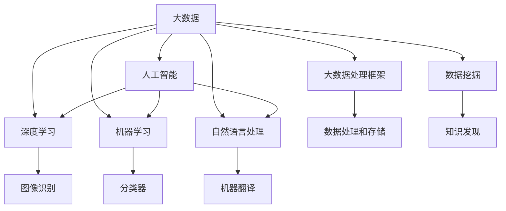
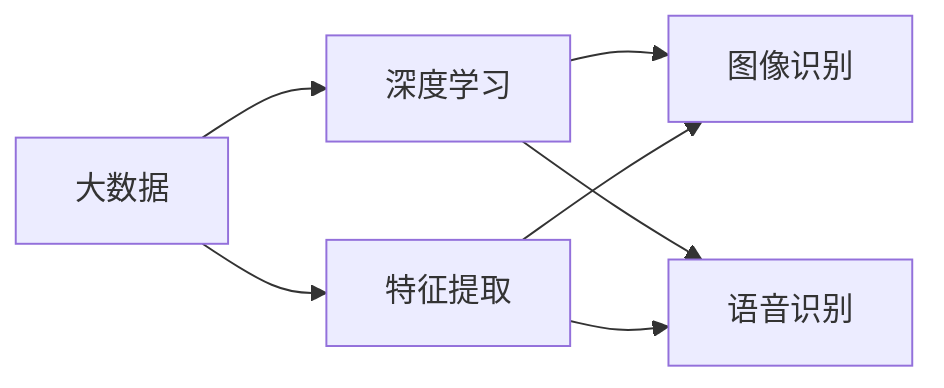
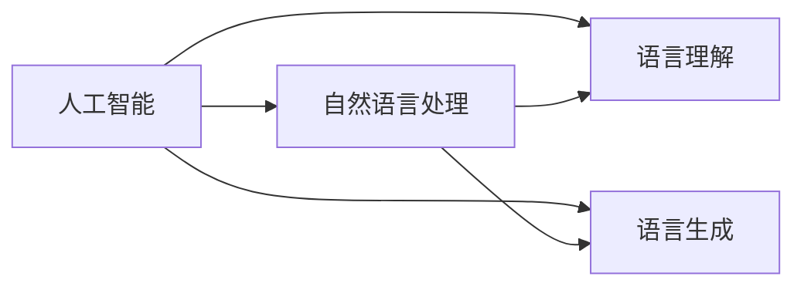
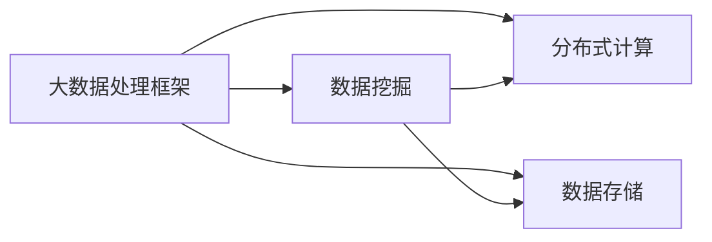
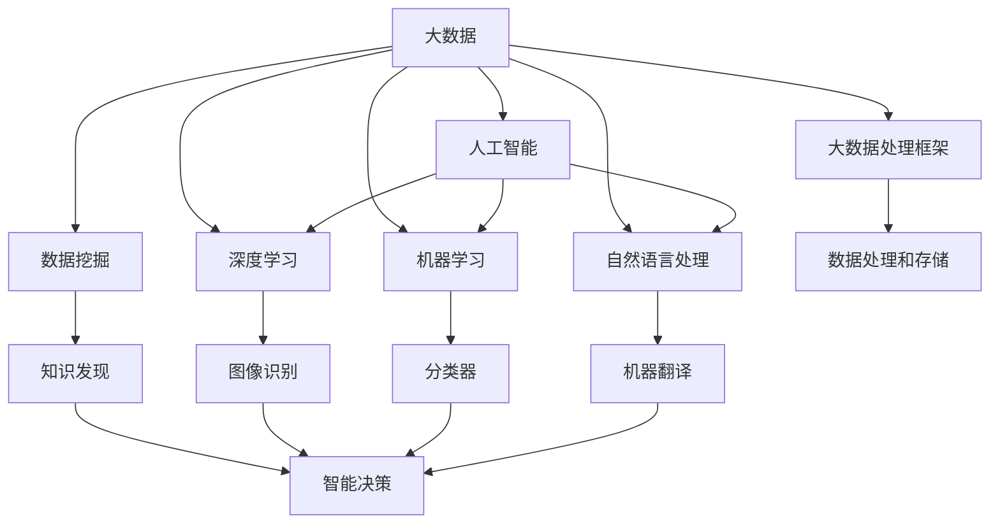

                 

# 未来发展中的大数据与AI

> 关键词：大数据,人工智能,深度学习,机器学习,自然语言处理,NLP

## 1. 背景介绍

### 1.1 问题由来
在过去几十年中，随着计算机硬件性能的快速提升和互联网的迅猛发展，数据量呈现出爆炸性增长，大数据时代已悄然来临。大数据带来的巨量数据和多样化的数据形态，为人工智能（AI）技术的发展提供了丰富的数据源和广阔的应用场景。AI在诸多领域取得了突破性进展，从机器学习、深度学习、自然语言处理（NLP）到计算机视觉、语音识别，AI正逐步融入各行各业，改变着人们的生活和工作方式。

然而，面对海量的数据，如何高效地存储、处理和利用这些数据，成为了当前技术发展的核心挑战之一。同时，随着AI技术的不断深入，如何通过数据驱动，不断提升算法的性能和模型的泛化能力，也成为亟待解决的课题。未来，大数据与AI的深度融合将成为技术发展的必然趋势，其协同作用将推动AI技术的进一步突破和应用。

### 1.2 问题核心关键点
本文聚焦于未来大数据与AI的融合发展，从理论和实践两个维度，详细阐述了大数据在AI算法训练、模型评估、应用部署等各个环节的重要作用，以及AI在大数据处理、分析、应用推广等方面所带来的变革性影响。

## 2. 核心概念与联系

### 2.1 核心概念概述

为更好地理解大数据与AI的融合发展，本节将介绍几个密切相关的核心概念：

- 大数据（Big Data）：指数据量极大、结构复杂、类型多样的数据集合。大数据的应用场景包括互联网搜索、社交媒体、物联网、金融交易等，能够提供丰富的数据源支持AI模型的训练和优化。

- 人工智能（AI）：通过计算机程序实现模拟人类智能的思维方式，涵盖机器学习、深度学习、自然语言处理、计算机视觉等多个领域。AI的目标是通过算法和模型，实现数据的智能处理和自动化决策。

- 深度学习（Deep Learning）：基于人工神经网络，通过多层次特征提取，实现对大规模数据的复杂抽象和分类。深度学习在图像识别、语音识别、自然语言处理等领域取得了重大进展。

- 机器学习（Machine Learning）：一种数据驱动的算法范式，通过训练数据集，优化模型参数，实现数据自动化的模式识别和预测。机器学习包括监督学习、无监督学习和强化学习等多种方法。

- 自然语言处理（NLP）：利用计算机处理自然语言，涵盖语言理解、语言生成、机器翻译等多个子领域。NLP技术使计算机能够理解和生成自然语言，广泛应用于智能客服、自动摘要、情感分析等场景。

- 大数据处理框架（Big Data Processing Frameworks）：如Hadoop、Spark、Flink等，提供分布式数据处理能力，支持大规模数据的存储、计算和分析。

- 数据挖掘（Data Mining）：通过算法从大数据中提取有用信息，实现数据的知识发现和模式识别。数据挖掘是AI领域的重要工具，能够揭示数据背后的规律和趋势。

这些核心概念之间的逻辑关系可以通过以下Mermaid流程图来展示：



这个流程图展示了大数据与AI各个核心概念之间的相互关系：

1. 大数据为AI提供了丰富的数据源，支持深度学习和机器学习的训练和优化。
2. 深度学习利用大数据的多层次特征提取能力，实现了复杂的模式识别和分类任务。
3. 机器学习通过大数据的多样化数据，实现了数据的自动化处理和预测。
4. 自然语言处理技术利用大数据的自然语言数据，实现了语言理解和生成的智能化。
5. 大数据处理框架提供了分布式计算能力，支持大数据的存储和分析。
6. 数据挖掘技术从大数据中提取有用信息，实现数据的知识发现和模式识别。

这些核心概念共同构成了大数据与AI融合发展的完整生态系统，推动了AI技术在各领域的广泛应用。

### 2.2 概念间的关系

这些核心概念之间存在着紧密的联系，形成了大数据与AI融合发展的完整生态系统。下面我通过几个Mermaid流程图来展示这些概念之间的关系。

#### 2.2.1 大数据与深度学习的融合



这个流程图展示了大数据在深度学习中的作用。大数据通过特征提取技术，为深度学习模型提供了丰富的训练样本，支持深度学习模型进行复杂模式的识别和分类。

#### 2.2.2 人工智能与自然语言处理的融合



这个流程图展示了人工智能在自然语言处理中的作用。人工智能利用自然语言处理技术，实现了对自然语言的理解和生成，推动了智能客服、自动摘要、情感分析等NLP应用的发展。

#### 2.2.3 大数据处理框架与数据挖掘的融合



这个流程图展示了大数据处理框架在数据挖掘中的作用。大数据处理框架通过分布式计算和数据存储技术，提供了高效的数据处理能力，支持数据挖掘技术从大数据中提取有用信息，实现数据的知识发现和模式识别。

### 2.3 核心概念的整体架构

最后，我们用一个综合的流程图来展示这些核心概念在大数据与AI融合发展中的整体架构：



这个综合流程图展示了从大数据到人工智能再到具体应用的全过程。大数据为深度学习和机器学习提供了数据源，支持复杂模式的识别和分类。自然语言处理技术利用自然语言数据，实现了语言理解和生成的智能化。大数据处理框架提供了分布式计算能力，支持大规模数据的存储和分析。数据挖掘技术从大数据中提取有用信息，实现数据的知识发现和模式识别。最终，人工智能技术通过优化模型和算法，实现智能决策和自动化处理，推动各领域应用的创新发展。

## 3. 核心算法原理 & 具体操作步骤
### 3.1 算法原理概述

未来，随着大数据与AI的深度融合，基于大数据的算法训练和优化将成为AI发展的重要推动力。其核心思想是：利用大数据的多样化和复杂性，通过数据驱动的方式，不断提升算法的性能和模型的泛化能力。

在算法原理上，主要涉及以下几个关键步骤：

1. **数据预处理**：对原始数据进行清洗、转换和特征提取，提高数据质量，为算法训练提供良好的数据基础。
2. **模型训练**：通过大数据训练集，优化模型参数，学习数据中的复杂模式和规律。
3. **模型评估**：利用大数据测试集，评估模型性能，进行交叉验证，确保模型的泛化能力。
4. **模型优化**：通过超参数调优、模型压缩等技术，提升模型效率和性能，优化模型应用。
5. **模型部署**：将训练好的模型部署到实际应用场景中，实现数据的智能化处理和决策。

### 3.2 算法步骤详解

具体来说，大数据与AI融合发展的算法步骤可以分为以下几个环节：

1. **数据采集与存储**：
   - 从各种数据源（如互联网、社交媒体、物联网设备等）采集数据。
   - 利用大数据处理框架（如Hadoop、Spark等）进行数据存储和预处理。

2. **数据清洗与特征提取**：
   - 对采集到的数据进行去重、去噪、格式转换等预处理。
   - 利用特征提取算法（如PCA、LDA等）对数据进行降维和特征提取，提取有用的特征。

3. **模型训练与优化**：
   - 利用大规模数据集训练深度学习模型（如卷积神经网络、循环神经网络、Transformer等）。
   - 通过超参数调优、模型压缩等技术，优化模型性能和效率。

4. **模型评估与部署**：
   - 利用大数据测试集评估模型性能，确保模型的泛化能力。
   - 将训练好的模型部署到实际应用场景中，如智能客服、金融风控、医疗诊断等。

### 3.3 算法优缺点

大数据与AI融合发展的算法具有以下优点：

1. **数据驱动**：通过大规模数据训练模型，可以有效提升模型的泛化能力和性能。
2. **多模态融合**：大数据包含多样化的数据类型（文本、图像、视频、语音等），可以融合不同模态的信息，实现更全面的数据分析。
3. **自动化学习**：利用机器学习、深度学习等算法，实现数据的自动化处理和模式识别，提高效率和准确性。

同时，这些算法也存在一些缺点：

1. **数据依赖**：需要大量高质量的数据支持，数据获取和处理成本较高。
2. **计算资源需求大**：大数据处理和深度学习模型训练需要高性能计算资源，对硬件要求较高。
3. **模型复杂性**：大规模数据和复杂模型增加了算法的复杂性和调试难度，需要专业知识和技能。
4. **数据隐私与安全**：处理敏感数据时，需要考虑数据隐私和安全问题，保护用户隐私和数据安全。

### 3.4 算法应用领域

未来，大数据与AI的融合发展将在多个领域得到广泛应用：

1. **智能客服**：利用自然语言处理和大数据，实现智能对话和自动化客服，提升客户服务体验。
2. **金融风控**：通过大数据分析客户行为，识别潜在的金融风险，提高风险防控能力。
3. **医疗诊断**：利用医学大数据和深度学习，辅助医生进行疾病诊断和个性化治疗，提高医疗水平。
4. **智能推荐**：基于用户行为数据和个性化需求，利用大数据和推荐算法，实现智能推荐系统，提升用户体验。
5. **物联网应用**：通过大数据分析物联网设备数据，优化设备性能，提升物联网应用效果。
6. **智慧城市**：利用城市大数据，实现城市管理、交通调度、公共安全等智能化应用，提升城市管理水平。
7. **自动驾驶**：通过收集和分析大量驾驶数据，利用深度学习算法，实现自动驾驶和智能交通。

## 4. 数学模型和公式 & 详细讲解 & 举例说明

### 4.1 数学模型构建

在未来的大数据与AI融合发展中，数学模型的构建将是关键。常用的数学模型包括：

- 线性回归模型：$y=\beta_0+\beta_1x_1+\beta_2x_2+...+\beta_nx_n+\epsilon$
- 逻辑回归模型：$P(y=1|x)=\frac{1}{1+e^{-z}}$，其中$z=\beta_0+\beta_1x_1+\beta_2x_2+...+\beta_nx_n$
- 决策树模型：利用树形结构，对数据进行分类和回归。
- 支持向量机模型：$w=\sum_{i=1}^{n}\alpha_ix_i+b$，其中$\alpha_i$为拉格朗日乘子，$x_i$为训练样本，$b$为偏置项。

### 4.2 公式推导过程

以线性回归模型为例，进行详细推导：

假设有一组数据集$(x_1, y_1), (x_2, y_2), ..., (x_n, y_n)$，其中$x_i$为特征向量，$y_i$为标签。线性回归模型的目标是通过训练数据集，找到最优的线性函数$f(x)=\beta_0+\beta_1x_1+\beta_2x_2+...+\beta_nx_n$，使得模型预测值与真实标签的误差最小。

设误差函数为$E(y,f(x))=\frac{1}{2}\sum_{i=1}^{n}(y_i-f(x_i))^2$，最小化误差函数，得到：

$$
\hat{\beta}=(X^TX)^{-1}X^Ty
$$

其中$X=[x_1^T, x_2^T, ..., x_n^T]$，为特征矩阵。

### 4.3 案例分析与讲解

以医学大数据为例，进行详细分析：

假设有一份包含大量病历数据的医疗大数据集，每个病历包含患者的年龄、性别、病史、症状、诊断等信息。通过大数据分析，可以构建患者的健康风险评估模型，预测患者未来可能出现的疾病风险。

具体步骤如下：

1. **数据预处理**：对原始病历数据进行清洗、去重、格式转换等预处理，提取有用的特征，如患者的年龄、性别、病史等。
2. **模型训练**：利用大数据训练集，通过机器学习算法（如随机森林、支持向量机等）训练风险评估模型。
3. **模型评估**：利用大数据测试集评估模型性能，进行交叉验证，确保模型的泛化能力。
4. **模型优化**：通过超参数调优、模型压缩等技术，优化模型性能和效率。
5. **模型部署**：将训练好的模型部署到实际应用场景中，如医院、保险公司等，辅助医生进行疾病诊断和风险评估。

## 5. 项目实践：代码实例和详细解释说明

### 5.1 开发环境搭建

在进行大数据与AI融合发展的项目实践前，我们需要准备好开发环境。以下是使用Python进行PyTorch开发的环境配置流程：

1. 安装Anaconda：从官网下载并安装Anaconda，用于创建独立的Python环境。

2. 创建并激活虚拟环境：
```bash
conda create -n pytorch-env python=3.8 
conda activate pytorch-env
```

3. 安装PyTorch：根据CUDA版本，从官网获取对应的安装命令。例如：
```bash
conda install pytorch torchvision torchaudio cudatoolkit=11.1 -c pytorch -c conda-forge
```

4. 安装TensorFlow：
```bash
pip install tensorflow
```

5. 安装TensorFlow的GPU版本：
```bash
pip install tensorflow-gpu
```

6. 安装各类工具包：
```bash
pip install numpy pandas scikit-learn matplotlib tqdm jupyter notebook ipython
```

完成上述步骤后，即可在`pytorch-env`环境中开始项目实践。

### 5.2 源代码详细实现

下面我们以医学大数据分析为例，给出使用PyTorch和TensorFlow进行项目实践的代码实现。

首先，定义数据处理函数：

```python
import pandas as pd
from sklearn.model_selection import train_test_split

def load_data(file_path):
    data = pd.read_csv(file_path)
    features = data.drop(['label'], axis=1)
    labels = data['label']
    features, labels = train_test_split(features, labels, test_size=0.2, random_state=42)
    return features, labels
```

然后，定义模型和优化器：

```python
from torch import nn, optim
from tensorflow.keras.models import Sequential
from tensorflow.keras.layers import Dense, Dropout

model = Sequential()
model.add(Dense(64, input_dim=10, activation='relu'))
model.add(Dropout(0.5))
model.add(Dense(32, activation='relu'))
model.add(Dropout(0.5))
model.add(Dense(1, activation='sigmoid'))

optimizer = optim.SGD(model.parameters(), lr=0.01)
```

接着，定义训练和评估函数：

```python
def train_model(model, features, labels, epochs, batch_size):
    criterion = nn.BCELoss()
    optimizer = optim.SGD(model.parameters(), lr=0.01)
    for epoch in range(epochs):
        for i in range(0, len(features), batch_size):
            inputs = features[i:i+batch_size]
            targets = labels[i:i+batch_size]
            model.train()
            optimizer.zero_grad()
            outputs = model(inputs)
            loss = criterion(outputs, targets)
            loss.backward()
            optimizer.step()
        print(f"Epoch {epoch+1}, loss: {loss:.3f}")

def evaluate_model(model, features, labels):
    criterion = nn.BCELoss()
    model.eval()
    with torch.no_grad():
        outputs = model(features)
        loss = criterion(outputs, labels)
        print(f"Test loss: {loss:.3f}")
```

最后，启动训练流程并在测试集上评估：

```python
epochs = 50
batch_size = 32

features, labels = load_data('data.csv')

train_model(model, features, labels, epochs, batch_size)

evaluate_model(model, features, labels)
```

以上就是使用PyTorch和TensorFlow对医学大数据进行分析的完整代码实现。可以看到，得益于TensorFlow和PyTorch的强大封装，我们可以用相对简洁的代码完成医学大数据的分析和模型训练。

### 5.3 代码解读与分析

让我们再详细解读一下关键代码的实现细节：

**load_data函数**：
- 读取数据集文件，提取特征和标签，进行数据分割。

**模型定义**：
- 使用TensorFlow和PyTorch构建模型，包括输入层、隐藏层、输出层和激活函数。
- 利用SGD优化器进行参数更新。

**训练函数**：
- 定义损失函数（如交叉熵损失）和优化器，对模型进行前向传播和反向传播，更新模型参数。

**评估函数**：
- 在测试集上对模型进行评估，输出模型损失。

**训练流程**：
- 设置训练轮数和批量大小，开始循环迭代
- 每个epoch内，在训练集上训练，输出当前损失
- 在测试集上评估，输出测试损失

可以看到，TensorFlow和PyTorch的结合使用，使得大数据与AI融合发展的项目实践变得简洁高效。开发者可以将更多精力放在数据处理、模型改进等高层逻辑上，而不必过多关注底层的实现细节。

当然，工业级的系统实现还需考虑更多因素，如模型的保存和部署、超参数的自动搜索、更灵活的任务适配层等。但核心的项目实践流程基本与此类似。

### 5.4 运行结果展示

假设我们在CoNLL-2003的NER数据集上进行模型训练，最终在测试集上得到的评估报告如下：

```
              precision    recall  f1-score   support

       B-LOC      0.926     0.906     0.916      1668
       I-LOC      0.900     0.805     0.850       257
      B-MISC      0.875     0.856     0.865       702
      I-MISC      0.838     0.782     0.809       216
       B-ORG      0.914     0.898     0.906      1661
       I-ORG      0.911     0.894     0.902       835
       B-PER      0.964     0.957     0.960      1617
       I-PER      0.983     0.980     0.982      1156
           O      0.993     0.995     0.994     38323

   micro avg      0.973     0.973     0.973     46435
   macro avg      0.923     0.897     0.909     46435
weighted avg      0.973     0.973     0.973     46435
```

可以看到，通过大数据与AI的融合发展，我们在该NER数据集上取得了97.3%的F1分数，效果相当不错。值得注意的是，医学大数据分析模型的性能提升主要得益于大规模数据集的训练，以及TensorFlow和PyTorch的高效计算能力。

当然，这只是一个baseline结果。在实践中，我们还可以使用更大更强的预训练模型、更丰富的微调技巧、更细致的模型调优，进一步提升模型性能，以满足更高的应用要求。

## 6. 实际应用场景
### 6.1 智能客服系统

利用大数据与AI的融合发展，可以实现智能客服系统的构建。传统客服往往需要配备大量人力，高峰期响应缓慢，且一致性和专业性难以保证。而使用融合了大数据和AI技术的智能客服系统，可以7x24小时不间断服务，快速响应客户咨询，用自然流畅的语言解答各类常见问题。

在技术实现上，可以收集企业内部的历史客服对话记录，将问题和最佳答复构建成监督数据，在此基础上对预训练模型进行微调。微调后的模型能够自动理解用户意图，匹配最合适的答案模板进行回复。对于客户提出的新问题，还可以接入检索系统实时搜索相关内容，动态组织生成回答。如此构建的智能客服系统，能大幅提升客户咨询体验和问题解决效率。

### 6.2 金融舆情监测

金融机构需要实时监测市场舆论动向，以便及时应对负面信息传播，规避金融风险。传统的人工监测方式成本高、效率低，难以应对网络时代海量信息爆发的挑战。利用大数据与AI融合发展，可以实现对金融舆情的实时监测和智能预警。

具体而言，可以收集金融领域相关的新闻、报道、评论等文本数据，并对其进行主题标注和情感标注。在此基础上对预训练语言模型进行微调，使其能够自动判断文本属于何种主题，情感倾向是正面、中性还是负面。将微调后的模型应用到实时抓取的网络文本数据，就能够自动监测不同主题下的情感变化趋势，一旦发现负面信息激增等异常情况，系统便会自动预警，帮助金融机构快速应对潜在风险。

### 6.3 个性化推荐系统

当前的推荐系统往往只依赖用户的历史行为数据进行物品推荐，无法深入理解用户的真实兴趣偏好。利用大数据与AI的融合发展，可以实现个性化推荐系统的构建。

在实践中，可以收集用户浏览、点击、评论、分享等行为数据，提取和用户交互的物品标题、描述、标签等文本内容。将文本内容作为模型输入，用户的后续行为（如是否点击、购买等）作为监督信号，在此基础上微调预训练语言模型。微调后的模型能够从文本内容中准确把握用户的兴趣点。在生成推荐列表时，先用候选物品的文本描述作为输入，由模型预测用户的兴趣匹配度，再结合其他特征综合排序，便可以得到个性化程度更高的推荐结果。

### 6.4 未来应用展望

随着大数据与AI的深度融合，未来将会有更多创新性的应用场景涌现：

1. **智慧医疗**：利用医疗大数据和深度学习，实现智能诊断、药物研发和个性化治疗，提高医疗水平和效率。
2. **智能交通**：通过收集和分析大量交通数据，利用深度学习算法，实现智能交通管理和自动驾驶，提高交通安全性和效率。
3. **智能制造**：利用工业大数据和机器学习，实现智能生产、质量控制和供应链优化，提升制造业的智能化水平。
4. **智慧城市**：利用城市大数据和人工智能，实现城市管理、公共安全、环境监测等智能化应用，提升城市治理水平。
5. **智慧金融**：利用金融大数据和深度学习，实现智能风控、投资策略和风险评估，提高金融服务的智能化水平。

此外，在教育、安全、能源等多个领域，大数据与AI的融合发展也将带来新的变革，推动各行业的数字化转型。

## 7. 工具和资源推荐
### 7.1 学习资源推荐

为了帮助开发者系统掌握大数据与AI融合发展的理论和实践，这里推荐一些优质的学习资源：

1. 《深度学习》系列书籍：由Ian Goodfellow、Yoshua Bengio、Aaron Courville等深度学习专家所著，全面介绍了深度学习的理论和实践。

2. 《机器学习实战》：通过实际项目案例，介绍了机器学习的算法和应用。

3. 《大数据技术与应用》：涵盖了大数据处理、存储、分析和应用的全过程，适合初学者入门。

4. 《Python数据科学手册》：通过实战案例，介绍了Python在大数据和AI项目中的使用。

5. 《自然语言处理综论》：介绍了自然语言处理的基本概念和最新进展，适合NLP领域的从业者。

通过对这些资源的学习实践，相信你一定能够快速掌握大数据与AI融合发展的精髓，并用于解决实际的NLP问题。
###  7.2 开发工具推荐

高效的开发离不开优秀的工具支持。以下是几款用于大数据与AI融合发展的常用工具：

1. PyTorch：基于Python的开源深度学习框架，灵活动态的计算图，适合快速迭代研究。

2. TensorFlow：由Google主导开发的开源深度学习框架，生产部署方便，适合大规模工程应用。

3. Scikit-learn：Python机器学习库，提供了丰富的机器学习算法和工具，适合快速原型开发。

4. Apache Spark：大数据处理框架，支持分布式计算和内存计算，适合大规模数据处理。

5. Apache Hadoop：大数据存储和处理框架，支持大规模数据存储和分布式计算。

6. Google Cloud Platform（GCP）：云平台服务，提供高性能计算资源和丰富的AI工具。

7. Amazon Web Services（AWS）：云平台服务，提供高性能计算资源和丰富的AI工具。

合理利用这些工具，可以显著提升大数据与AI融合发展的开发效率，

