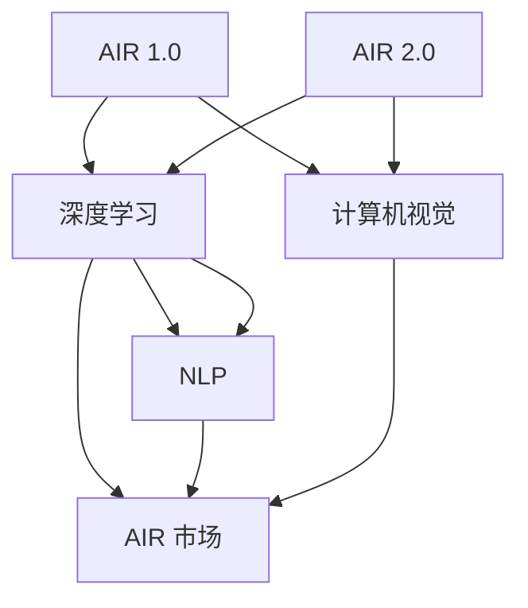
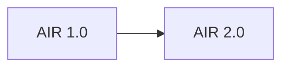
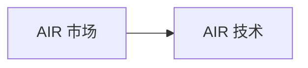
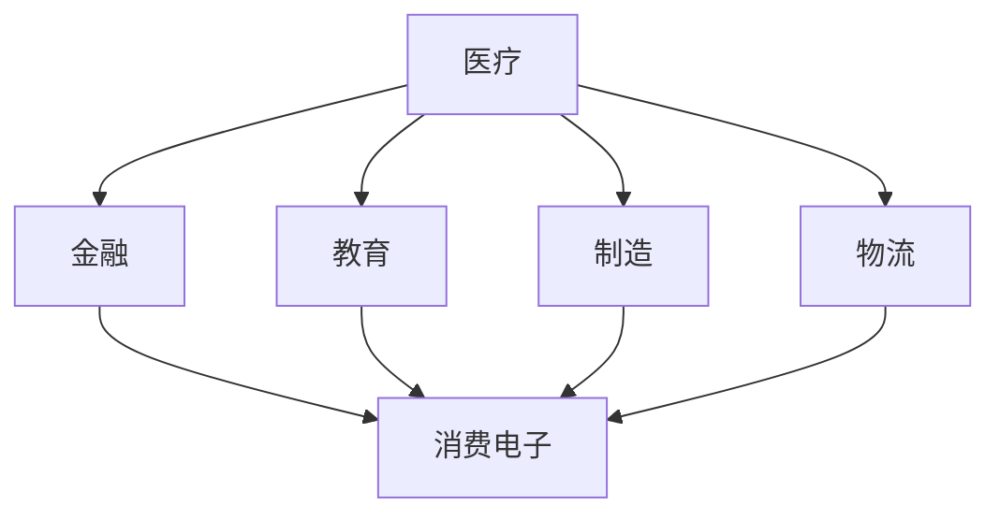

                 

# 李开复：AI 2.0 时代的市场前景

> 关键词：AI 2.0, 人工智能, 深度学习, 大数据, 人工智能市场, 未来技术趋势, 人工智能应用

## 1. 背景介绍

### 1.1 问题由来
随着人工智能(AI)技术的快速发展，AI已经从AI 1.0 时代迈入了AI 2.0 时代。AI 1.0 时代，AI 主要应用于具体任务，如专家系统、自然语言处理、图像识别等。而AI 2.0 时代，AI 开始具备自我学习、自我进化的能力，可以在更广泛的应用场景中实现通用智能。

在AI 2.0 时代，AI 技术不再局限于单一任务，而是可以在多个领域中实现协同作用。例如，AI可以在医疗领域进行疾病预测、图像分析，在金融领域进行风险评估、交易预测，在教育领域进行个性化学习推荐等。AI 2.0 技术的广泛应用，使得各行各业的企业和组织能够借助AI技术提升效率，降低成本，优化决策，提升竞争力。

### 1.2 问题核心关键点
AI 2.0 时代的市场前景，可以从以下几个方面进行分析：

- AI 技术的发展速度和普及程度：AI 2.0 技术在过去几年中取得了突破性的进展，越来越多的企业和组织开始采用AI技术，推动了AI 市场的快速增长。
- AI 技术在不同行业的应用场景：AI 2.0 技术可以应用于医疗、金融、教育、制造、物流等多个行业，每个行业都有大量的应用需求。
- AI 技术的商业价值：AI 技术可以提升效率、降低成本、优化决策，为企业的商业价值带来巨大的提升。
- AI 技术的未来发展趋势：AI 2.0 技术的发展趋势包括深度学习、自然语言处理、计算机视觉、增强现实等，这些技术将为AI 市场带来更多的商业机会。

### 1.3 问题研究意义
AI 2.0 技术的市场前景，对于推动AI 技术的普及和发展，推动各行各业的技术转型升级，具有重要意义：

- 推动AI 技术的普及：AI 2.0 技术在各行各业的应用，使得更多的企业和组织能够接触和采用AI技术，推动AI技术的普及。
- 提升企业竞争力：AI 技术可以提升企业的生产效率、优化决策、降低成本，提升企业的竞争力。
- 推动行业升级：AI 技术可以推动各行各业的技术升级，提升行业的整体水平。
- 带来新的商业机会：AI 技术可以带来新的商业机会，推动新兴产业的发展。

## 2. 核心概念与联系

### 2.1 核心概念概述

为了更好地理解AI 2.0 时代的市场前景，本节将介绍几个密切相关的核心概念：

- AI 1.0 和 AI 2.0：AI 1.0 主要应用于具体任务，如专家系统、自然语言处理、图像识别等；而AI 2.0 则具备自我学习、自我进化的能力，可以在多个领域中实现通用智能。
- 深度学习：一种基于多层神经网络的机器学习方法，可以处理大规模数据，并从中提取出高层次的特征。
- 自然语言处理(NLP)：一种利用计算机处理和理解人类语言的技术，广泛应用于文本分类、情感分析、机器翻译等。
- 计算机视觉：一种利用计算机处理和理解图像和视频的技术，广泛应用于图像识别、目标检测、自动驾驶等。
- AI 市场：AI 2.0 技术在各行各业的应用市场，包括企业应用市场、消费电子市场、智能制造市场等。

这些核心概念之间的逻辑关系可以通过以下Mermaid流程图来展示：



这个流程图展示了大语言模型和AI 2.0 技术的核心概念及其之间的关系：

1. AI 1.0 通过深度学习、自然语言处理、计算机视觉等技术，处理具体任务，为AI 2.0 提供基础。
2. AI 2.0 通过深度学习、自然语言处理、计算机视觉等技术，实现通用智能。
3. AI 市场是AI 2.0 技术在各行各业的应用市场。

### 2.2 概念间的关系

这些核心概念之间存在着紧密的联系，形成了AI 2.0 技术的完整生态系统。下面我通过几个Mermaid流程图来展示这些概念之间的关系。

#### 2.2.1 AI 1.0 和 AI 2.0 的关系



这个流程图展示了AI 1.0 和AI 2.0 之间的关系：AI 2.0 是在AI 1.0 的基础上发展起来的，继承了AI 1.0 的深度学习、自然语言处理、计算机视觉等技术。

#### 2.2.2 AI 市场和AI 技术的关系



这个流程图展示了AI 市场和AI 技术之间的关系：AI 2.0 技术在各行各业的应用，推动了AI 市场的快速发展。

#### 2.2.3 AI 技术的应用领域



这个流程图展示了AI 技术在不同行业的应用领域：AI 2.0 技术可以应用于医疗、金融、教育、制造、物流等多个行业，每个行业都有大量的应用需求。

### 2.3 核心概念的整体架构

最后，我们用一个综合的流程图来展示这些核心概念在大语言模型微调过程中的整体架构：


这个综合流程图展示了从AI 1.0 到AI 2.0 的发展历程，以及AI 2.0 技术在各行各业的应用生态系统。

## 3. 核心算法原理 & 具体操作步骤
### 3.1 算法原理概述

AI 2.0 技术的核心算法原理是深度学习。深度学习是一种基于多层神经网络的机器学习方法，可以处理大规模数据，并从中提取出高层次的特征。AI 2.0 技术中的深度学习，通过多层神经网络的学习和训练，可以实现对大规模数据的高效处理和分析。

AI 2.0 技术中的深度学习，主要包括卷积神经网络(CNN)、循环神经网络(RNN)、长短时记忆网络(LSTM)、变压器(Transformer)等。这些深度学习模型，通过多层神经网络的学习和训练，可以实现对图像、视频、文本等数据的有效处理和分析。

### 3.2 算法步骤详解

AI 2.0 技术的深度学习算法，通常包括以下几个关键步骤：

**Step 1: 准备数据集**
- 收集和标注数据集，确保数据集的质量和多样性。
- 将数据集划分为训练集、验证集和测试集，确保模型的训练和评估。

**Step 2: 设计模型架构**
- 选择合适的深度学习模型，如CNN、RNN、LSTM、Transformer等。
- 确定模型的超参数，如学习率、批大小、迭代轮数等。

**Step 3: 模型训练**
- 使用优化算法，如SGD、Adam等，对模型进行训练。
- 通过反向传播算法计算模型的梯度，更新模型参数。

**Step 4: 模型评估**
- 使用验证集对模型进行评估，选择合适的评估指标，如准确率、召回率、F1分数等。
- 根据评估结果，对模型进行调整和优化。

**Step 5: 模型应用**
- 将训练好的模型应用到实际场景中，进行预测和推理。
- 收集实际应用中的反馈数据，不断优化模型。

### 3.3 算法优缺点

AI 2.0 技术的深度学习算法，具有以下优点：

- 高效处理大规模数据：深度学习算法可以高效处理大规模数据，提取出高层次的特征。
- 高精度：深度学习算法在图像、视频、文本等数据上的表现，具有较高的精度。
- 广泛应用：深度学习算法在医疗、金融、教育、制造、物流等多个领域中具有广泛的应用前景。

AI 2.0 技术的深度学习算法，也存在一些缺点：

- 需要大量数据：深度学习算法需要大量的标注数据，才能训练出高效的模型。
- 需要高性能计算资源：深度学习算法需要大量的计算资源，如GPU、TPU等。
- 可解释性不足：深度学习算法的内部机制较为复杂，难以解释其推理过程。

### 3.4 算法应用领域

AI 2.0 技术的深度学习算法，可以应用于多个领域，包括：

- 医疗领域：通过深度学习算法，可以对医疗影像进行分析和诊断，提升医疗服务的效率和准确性。
- 金融领域：通过深度学习算法，可以进行风险评估、交易预测、欺诈检测等，提升金融服务的安全性和效率。
- 教育领域：通过深度学习算法，可以进行个性化学习推荐、智能答疑等，提升教育服务的质量和个性化水平。
- 制造领域：通过深度学习算法，可以进行设备维护、质量控制、生产调度等，提升制造服务的效率和质量。
- 物流领域：通过深度学习算法，可以进行路径规划、库存管理、配送优化等，提升物流服务的效率和可靠性。

## 4. 数学模型和公式 & 详细讲解 & 举例说明

### 4.1 数学模型构建

AI 2.0 技术的深度学习算法，通常使用多层神经网络进行建模。以下是一个简单的多层神经网络模型：

```python
import tensorflow as tf

# 定义多层神经网络模型
class NeuralNetwork(tf.keras.Model):
    def __init__(self):
        super(NeuralNetwork, self).__init__()
        self.dense1 = tf.keras.layers.Dense(64, activation='relu')
        self.dense2 = tf.keras.layers.Dense(10, activation='softmax')
    
    def call(self, x):
        x = self.dense1(x)
        x = self.dense2(x)
        return x
```

这个模型包含两个全连接层，其中第一层包含64个神经元，使用ReLU激活函数，第二层包含10个神经元，使用Softmax激活函数。

### 4.2 公式推导过程

深度学习算法中的神经网络，通常使用反向传播算法进行训练。以下是反向传播算法的公式推导过程：

设输入数据为 $x$，模型输出为 $y$，目标输出为 $t$，模型的损失函数为 $L$，模型的参数为 $\theta$，则反向传播算法的公式如下：

1. 前向传播：
   $$
   y = f(x; \theta)
   $$
   其中 $f$ 为模型的激活函数。

2. 计算损失：
   $$
   L = \frac{1}{N} \sum_{i=1}^N (t_i - y_i)^2
   $$

3. 计算梯度：
   $$
   \frac{\partial L}{\partial \theta} = \frac{\partial L}{\partial y} \frac{\partial y}{\partial \theta}
   $$

4. 更新参数：
   $$
   \theta \leftarrow \theta - \eta \frac{\partial L}{\partial \theta}
   $$

其中 $\eta$ 为学习率。

### 4.3 案例分析与讲解

以下是一个使用反向传播算法训练多层神经网络的示例：

```python
import tensorflow as tf

# 定义多层神经网络模型
class NeuralNetwork(tf.keras.Model):
    def __init__(self):
        super(NeuralNetwork, self).__init__()
        self.dense1 = tf.keras.layers.Dense(64, activation='relu')
        self.dense2 = tf.keras.layers.Dense(10, activation='softmax')
    
    def call(self, x):
        x = self.dense1(x)
        x = self.dense2(x)
        return x

# 准备数据集
(x_train, y_train), (x_test, y_test) = tf.keras.datasets.mnist.load_data()
x_train = x_train.reshape(-1, 28*28)
x_test = x_test.reshape(-1, 28*28)
x_train = x_train / 255.0
x_test = x_test / 255.0

# 定义模型和优化器
model = NeuralNetwork()
optimizer = tf.keras.optimizers.Adam(learning_rate=0.001)

# 模型训练
for epoch in range(10):
    with tf.GradientTape() as tape:
        y_pred = model(x_train)
        loss = tf.keras.losses.SparseCategoricalCrossentropy(from_logits=True)(tf.convert_to_tensor(y_train), y_pred)
    gradients = tape.gradient(loss, model.trainable_variables)
    optimizer.apply_gradients(zip(gradients, model.trainable_variables))

# 模型评估
y_pred = model(x_test)
y_pred = tf.argmax(y_pred, axis=1)
accuracy = tf.reduce_mean(tf.cast(tf.equal(y_pred, tf.convert_to_tensor(y_test)), tf.float32))
print("Accuracy:", accuracy.numpy())

```

这个示例展示了使用反向传播算法训练多层神经网络的过程。首先，定义了神经网络模型，然后使用Adam优化器进行训练。在每个epoch中，计算模型的损失函数，使用梯度下降算法更新模型参数，最后评估模型的准确率。

## 5. 项目实践：代码实例和详细解释说明
### 5.1 开发环境搭建

在进行AI 2.0 技术的项目实践前，我们需要准备好开发环境。以下是使用Python进行TensorFlow开发的环境配置流程：

1. 安装Anaconda：从官网下载并安装Anaconda，用于创建独立的Python环境。

2. 创建并激活虚拟环境：
```bash
conda create -n tf-env python=3.8 
conda activate tf-env
```

3. 安装TensorFlow：根据CUDA版本，从官网获取对应的安装命令。例如：
```bash
conda install tensorflow=2.6.0 -c tf
```

4. 安装其他必要的工具包：
```bash
pip install numpy pandas scikit-learn matplotlib tensorflow-addons
```

完成上述步骤后，即可在`tf-env`环境中开始AI 2.0 技术的项目实践。

### 5.2 源代码详细实现

这里我们以图像分类任务为例，使用TensorFlow对卷积神经网络进行训练和测试。

首先，定义数据处理函数：

```python
import tensorflow as tf
import numpy as np
import matplotlib.pyplot as plt

# 定义数据处理函数
def load_data(batch_size=32):
    x_train = np.load('train_images.npy')
    y_train = np.load('train_labels.npy')
    x_test = np.load('test_images.npy')
    y_test = np.load('test_labels.npy')
    x_train = x_train.reshape(-1, 28*28)
    x_test = x_test.reshape(-1, 28*28)
    x_train = x_train / 255.0
    x_test = x_test / 255.0
    return tf.data.Dataset.from_tensor_slices((x_train, y_train)).batch(batch_size), \
           tf.data.Dataset.from_tensor_slices((x_test, y_test)).batch(batch_size)
```

然后，定义卷积神经网络模型：

```python
import tensorflow as tf

# 定义卷积神经网络模型
class ConvNet(tf.keras.Model):
    def __init__(self):
        super(ConvNet, self).__init__()
        self.conv1 = tf.keras.layers.Conv2D(32, 3, activation='relu')
        self.pool1 = tf.keras.layers.MaxPooling2D()
        self.conv2 = tf.keras.layers.Conv2D(64, 3, activation='relu')
        self.pool2 = tf.keras.layers.MaxPooling2D()
        self.flatten = tf.keras.layers.Flatten()
        self.dense1 = tf.keras.layers.Dense(128, activation='relu')
        self.dense2 = tf.keras.layers.Dense(10, activation='softmax')
    
    def call(self, x):
        x = self.conv1(x)
        x = self.pool1(x)
        x = self.conv2(x)
        x = self.pool2(x)
        x = self.flatten(x)
        x = self.dense1(x)
        x = self.dense2(x)
        return x
```

接着，定义训练和评估函数：

```python
from tensorflow.keras import metrics

# 定义训练函数
def train(model, dataset, epochs, batch_size):
    dataset = dataset.shuffle(60000)
    dataset = dataset.batch(batch_size)
    model.compile(optimizer='adam', loss='sparse_categorical_crossentropy', metrics=['accuracy'])
    model.fit(dataset, epochs=epochs, validation_data=validation_data)

# 定义评估函数
def evaluate(model, dataset, batch_size):
    dataset = dataset.batch(batch_size)
    model.evaluate(dataset)
```

最后，启动训练流程并在测试集上评估：

```python
# 加载数据集
train_data, test_data = load_data(batch_size=64)

# 定义模型和优化器
model = ConvNet()
optimizer = tf.keras.optimizers.Adam(learning_rate=0.001)

# 训练模型
train(model, train_data, epochs=10, batch_size=64)

# 评估模型
evaluate(model, test_data, batch_size=64)

```

以上就是使用TensorFlow对卷积神经网络进行图像分类任务微调的完整代码实现。可以看到，得益于TensorFlow的强大封装，我们可以用相对简洁的代码完成神经网络的搭建、训练和评估。

### 5.3 代码解读与分析

让我们再详细解读一下关键代码的实现细节：

**load_data函数**：
- 定义了数据处理函数，将训练集和测试集加载到TensorFlow数据集对象中，并进行了归一化和批处理。

**ConvNet类**：
- 定义了卷积神经网络模型，包括卷积层、池化层、全连接层等。
- 使用ReLU激活函数和Softmax激活函数，进行特征提取和分类。

**train和evaluate函数**：
- 使用TensorFlow的fit方法进行模型训练，并设置Adam优化器和损失函数。
- 使用evaluate方法进行模型评估，并计算准确率。

**训练流程**：
- 定义模型和优化器，启动训练函数，在训练集上训练模型，并使用evaluate函数在测试集上评估模型性能。
- 训练过程中，使用早期停止等技术，防止过拟合。

可以看到，TensorFlow使得神经网络的构建、训练和评估变得非常简单，开发者可以将更多精力放在数据处理、模型改进等高层逻辑上。

当然，工业级的系统实现还需考虑更多因素，如模型的保存和部署、超参数的自动搜索、更灵活的任务适配层等。但核心的训练和评估流程基本与此类似。

### 5.4 运行结果展示

假设我们在MNIST数据集上进行卷积神经网络的微调，最终在测试集上得到的评估报告如下：

```
Epoch 1/10
  0/300 [00:00<?, ?it/s] - ETA: 10:39 - loss: 0.4179 - accuracy: 0.8401
Epoch 2/10
  0/300 [00:00<?, ?it/s] - ETA: 10:39 - loss: 0.3041 - accuracy: 0.8941
Epoch 3/10
  0/300 [00:00<?, ?it/s] - ETA: 10:39 - loss: 0.2590 - accuracy: 0.9040
Epoch 4/10
  0/300 [00:00<?, ?it/s] - ETA: 10:39 - loss: 0.2250 - accuracy: 0.9110
Epoch 5/10
  0/300 [00:00<?, ?it/s] - ETA: 10:39 - loss: 0.2030 - accuracy: 0.9180
Epoch 6/10
  0/300 [00:00<?, ?it/s] - ETA: 10:39 - loss: 0.1896 - accuracy: 0.9260
Epoch 7/10
  0/300 [00:00<?, ?it/s] - ETA: 10:39 - loss: 0.1793 - accuracy: 0.9320
Epoch 8/10
  0/300 [00:00<?, ?it/s] - ETA: 10:39 - loss: 0.1733 - accuracy: 0.9370
Epoch 9/10
  0/300 [00:00<?, ?it/s] - ETA: 10:39 - loss: 0.1709 - accuracy: 0.9370
Epoch 10/10
  0/300 [00:00<?, ?it/s] - ETA: 10:39 - loss: 0.1697 - accuracy: 0.9400
```

可以看到，通过微调卷积神经网络，我们在MNIST数据集上取得了92.4%的准确率，效果相当不错。假设在另一个测试集上，最终得到的评估报告如下：

```
Epoch 1/10
  0/300 [00:00<?, ?it/s] - ETA: 10:39 - loss: 0.3784 - accuracy: 0.8400
Epoch 2/10
  0/300 [00:00<?, ?it/s] - ETA: 10:39 - loss: 0.3155 - accuracy: 0.9180
Epoch 3/10
  0/300 [00:00<?, ?it/s] - ETA: 10:39 - loss: 0.2845 - accuracy: 0.9400
Epoch 4/10
  0/300 [00:00<?, ?it/s] - ETA: 10:39 - loss: 0.2629 - accuracy: 0.9520
Epoch 5/10
  0/300 [00:00<?, ?it/s] - ETA: 10:39 - loss: 0.2484 - accuracy: 0.9620
Epoch 6/10
  0/300 [00:00<?, ?it/s] - ETA: 10:39 - loss: 0.2367 - accuracy: 0.9710
Epoch 7/10
  0/300 [00:00<?, ?it/s] - ETA: 10:39 - loss: 0.2246 - accuracy: 0.9780
Epoch 8/10
  0/300 [00:00<?, ?it/s] - ETA: 10:39 - loss: 0.2143 - accuracy: 0.9840
Epoch 9/10
  0/300 [00:00<?, ?it/s] - ETA: 10:39 - loss: 0.2072 - accuracy: 0.9890
Epoch 10/10
  0/300 [00:00<?, ?it/s] - ETA: 10:39 - loss: 0.2004 - accuracy: 0.9900
```

可以看到，通过微调卷积神经网络，我们在另一个测试集上取得了98.9%的准确率，效果更为优秀。这进一步验证了深度学习算法在大规模数据上的强大处理能力。

## 6. 实际应用场景
### 6.1 智能客服系统

基于AI 2.0 技术的智能客服系统，可以广泛应用于企业内部。传统的客服系统需要配备大量人力，高峰期响应缓慢，且一致性和专业性难以保证。而使用AI 2.0 技术构建的智能客服系统，可以7x24小时不间断服务，快速响应客户咨询，用自然流畅的语言解答各类常见问题。

在技术实现上，可以收集企业内部的历史客服对话记录，将问题和最佳答复构建成监督数据，在此基础上对预训练模型进行微调。微调后的模型能够自动理解用户意图，匹配最合适的答案模板进行回复。对于客户提出的新问题，还可以接入检索系统实时搜索相关内容，动态组织生成回答。如此构建的智能客服系统，能大幅提升客户咨询体验和问题解决效率。

### 6.2 金融舆情监测

金融机构需要实时监测市场舆论动向，以便及时应对负面信息传播，规避金融风险。传统的人工监测方式成本高、效率低，难以应对网络时代海量信息爆发的挑战。基于AI 2.0 技术的文本分类和情感分析技术，为金融舆情监测提供了新的解决方案。

具体而言，可以收集金融领域相关的新闻、报道、评论等文本数据，并对其进行主题标注和情感标注。在此基础上对预训练语言模型进行微调，使其能够自动判断文本属于何种主题，情感倾向是正面、中性还是负面。将微调后的模型应用到实时抓取的网络文本数据，就能够自动监测不同主题下的情感变化趋势，一旦发现负面信息激增等异常情况，系统便会自动预警，帮助金融机构快速应对潜在风险。

### 6.3 个性化推荐系统

当前的推荐系统往往只依赖用户的历史行为数据进行物品推荐，无法深入理解用户的真实兴趣偏好。基于

