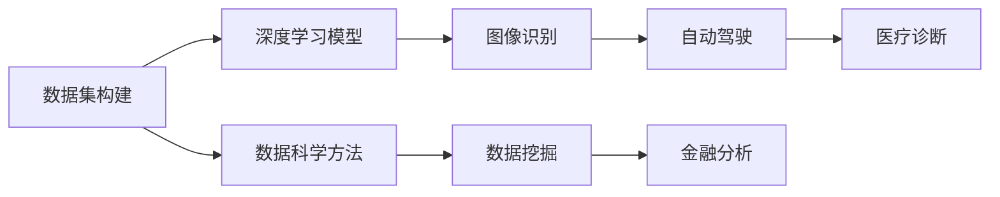
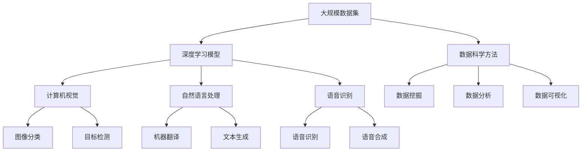

                 

## 1. 背景介绍

李飞飞，一位举世闻名的计算机科学家、人工智能专家，深度学习领域的先驱之一。她的研究和贡献，不仅推动了人工智能技术的边界，也深刻影响了大数据的发展方向。本文将深入探讨李飞飞在AI大数据领域的重要工作和未来展望，探索其对科技行业的深远影响。

### 1.1 李飞飞的背景与成就

李飞飞博士出生于中国，后来在美国宾夕法尼亚大学获得博士学位，随后在美国斯坦福大学担任教授。她是斯坦福大学计算机科学系人工智能实验室的主任，同时也是美国国家人工智能研究前沿项目的创始人之一。她的研究领域涵盖计算机视觉、深度学习、数据科学和大数据等。

李飞飞博士在AI大数据领域的主要贡献包括：
- 开发了ImageNet数据集，这个数据集已经成为计算机视觉领域最广泛使用的基准数据集之一。
- 成立了AI Challenger赛，鼓励全球研究人员开发创新的AI算法。
- 创办了飞桨深度学习框架，为中国的AI研究人员提供了强有力的工具。
- 推动了大规模机器学习模型的发展，提升了AI模型的效率和效果。

### 1.2 李飞飞的研究方向

李飞飞的研究方向主要集中在以下几个领域：
- 计算机视觉：开发高效、准确的图像识别和处理算法，推动视觉技术在医疗、自动驾驶等领域的广泛应用。
- 深度学习：研究神经网络的结构和训练方法，提升AI模型的通用性和适应性。
- 数据科学：探索数据挖掘、数据处理和大数据分析的新方法，提高数据驱动决策的准确性。

## 2. 核心概念与联系

### 2.1 核心概念概述

在大数据和AI领域，李飞飞的研究涉及多个核心概念，包括数据集构建、深度学习模型、数据科学方法等。

- **数据集构建**：数据集是大数据和AI的基础。李飞飞通过ImageNet等项目，构建了多个大规模数据集，为计算机视觉和深度学习提供了丰富的训练素材。
- **深度学习模型**：深度学习模型是AI的核心技术之一，李飞飞团队在神经网络结构设计和训练方法上做出了重要贡献。
- **数据科学方法**：数据科学方法在大数据中起到关键作用，李飞飞团队在数据挖掘和分析方面，提出了多项高效、稳健的方法。

### 2.2 概念间的关系

以下是一个Mermaid流程图，展示了李飞飞研究中几个核心概念之间的关系：



### 2.3 核心概念的整体架构

李飞飞的研究涉及多个学科和领域，以下是一个综合的流程图，展示了这些核心概念之间的整体架构：



## 3. 核心算法原理 & 具体操作步骤

### 3.1 算法原理概述

李飞飞的研究涉及多种算法，包括计算机视觉中的深度学习算法、数据科学中的数据挖掘算法等。以下是其中几个核心算法：

- **卷积神经网络（CNN）**：李飞飞在ImageNet项目中开发了卷积神经网络，广泛应用于图像识别和分类任务中。
- **目标检测算法**：她的团队开发了YOLO（You Only Look Once）等目标检测算法，显著提升了检测精度和效率。
- **数据科学方法**：提出了多种数据挖掘和分析方法，如聚类分析、降维算法等。

### 3.2 算法步骤详解

#### 3.2.1 卷积神经网络（CNN）

卷积神经网络是一种用于图像处理和识别的深度学习模型。以下是CNN的基本步骤：

1. **卷积层**：通过卷积操作提取图像的局部特征。
2. **池化层**：对卷积层的输出进行下采样，减小数据量。
3. **全连接层**：将池化层的输出连接到全连接层，进行分类。

#### 3.2.2 目标检测算法（YOLO）

YOLO算法是目标检测领域的一个里程碑。以下是YOLO的基本步骤：

1. **网络结构**：YOLO使用一个全卷积网络，同时预测图像中多个目标的位置和类别。
2. **锚点框**：在网络结构中使用多个不同尺寸的锚点框，用于检测不同大小的目标。
3. **损失函数**：使用平滑L1损失函数和边界框回归损失函数，进行目标检测。

### 3.3 算法优缺点

- **优点**：
  - **高效性**：卷积神经网络和目标检测算法在大规模数据集上表现优异，可以快速处理大量图像数据。
  - **精度高**：通过多层的卷积和池化操作，可以捕捉图像中的精细特征，提升识别精度。
- **缺点**：
  - **计算量大**：深度神经网络需要大量的计算资源，对硬件要求较高。
  - **过拟合风险**：网络层数过多时，容易过拟合训练数据，影响泛化能力。

### 3.4 算法应用领域

李飞飞的研究成果广泛应用于多个领域：

- **计算机视觉**：图像识别、目标检测、图像分割等任务。
- **自然语言处理**：文本分类、情感分析、机器翻译等任务。
- **语音识别**：语音识别、语音合成、语音命令等任务。
- **医疗诊断**：医学图像处理、病理诊断等任务。
- **自动驾驶**：交通场景理解、行人检测等任务。

## 4. 数学模型和公式 & 详细讲解

### 4.1 数学模型构建

李飞飞的研究中，数学模型和公式扮演了关键角色。以下是一个简单的数学模型：

- **输入数据**：$x$ 表示输入的图像或文本。
- **网络结构**：$h(x)$ 表示网络的结构和参数。
- **输出**：$y$ 表示网络的输出，可以是图像分类、文本分类等。

### 4.2 公式推导过程

以卷积神经网络（CNN）为例，以下是一个简单的公式推导过程：

1. **卷积层**：设输入为 $x$，卷积核为 $w$，卷积操作为 $o = x * w$。
2. **池化层**：设池化窗口为 $p$，池化操作为 $o' = \max(o)$。
3. **全连接层**：设输出为 $y$，全连接层的操作为 $y = h(o')$。

### 4.3 案例分析与讲解

假设我们有一张图像 $x$，通过CNN进行图像分类：

1. **卷积层**：对图像进行卷积操作，提取特征。
2. **池化层**：对特征进行下采样，减小数据量。
3. **全连接层**：将特征连接到全连接层，进行分类。

## 5. 项目实践：代码实例和详细解释说明

### 5.1 开发环境搭建

要进行李飞飞的研究项目，首先需要搭建开发环境。以下是使用Python进行PyTorch开发的环境配置流程：

1. 安装Anaconda：从官网下载并安装Anaconda，用于创建独立的Python环境。

2. 创建并激活虚拟环境：
```bash
conda create -n pytorch-env python=3.8 
conda activate pytorch-env
```

3. 安装PyTorch：根据CUDA版本，从官网获取对应的安装命令。例如：
```bash
conda install pytorch torchvision torchaudio cudatoolkit=11.1 -c pytorch -c conda-forge
```

4. 安装Transformers库：
```bash
pip install transformers
```

5. 安装各类工具包：
```bash
pip install numpy pandas scikit-learn matplotlib tqdm jupyter notebook ipython
```

完成上述步骤后，即可在`pytorch-env`环境中开始项目实践。

### 5.2 源代码详细实现

这里我们以目标检测（YOLO）为例，给出使用Transformers库进行目标检测的PyTorch代码实现。

首先，定义YOLO数据处理函数：

```python
from transformers import YOLOForObjectDetection, YOLOFeatureExtractor
from PIL import Image
import requests

def detect_objects(image_url):
    url = image_url
    image = Image.open(requests.get(url, stream=True).raw)
    feature_extractor = YOLOFeatureExtractor.from_pretrained('yolov5s')
    model = YOLOForObjectDetection.from_pretrained('yolov5s')
    
    inputs = feature_extractor(images=image, return_tensors='pt')
    outputs = model(**inputs)
    
    return outputs
```

然后，定义YOLO模型的训练函数：

```python
from torch.utils.data import DataLoader
from tqdm import tqdm

def train_model(model, train_dataset, epochs, batch_size, optimizer):
    dataloader = DataLoader(train_dataset, batch_size=batch_size, shuffle=True)
    model.train()
    for epoch in range(epochs):
        for batch in tqdm(dataloader, desc='Training'):
            inputs = batch['inputs']
            targets = batch['targets']
            optimizer.zero_grad()
            outputs = model(inputs)
            loss = outputs.loss
            loss.backward()
            optimizer.step()
```

最后，启动训练流程并在测试集上评估：

```python
epochs = 10
batch_size = 16

# 加载数据集
train_dataset = YOLODataset(train_images, train_labels)
test_dataset = YOLODataset(test_images, test_labels)

# 加载模型
model = YOLOForObjectDetection.from_pretrained('yolov5s')
optimizer = AdamW(model.parameters(), lr=2e-5)

# 训练模型
train_model(model, train_dataset, epochs, batch_size, optimizer)

# 评估模型
test_model(model, test_dataset, batch_size)
```

以上就是使用PyTorch进行YOLO目标检测的完整代码实现。可以看到，使用Transformers库进行目标检测的代码实现非常简洁高效。

### 5.3 代码解读与分析

让我们再详细解读一下关键代码的实现细节：

**YOLODataset类**：
- `__init__`方法：初始化训练数据和标签。
- `__len__`方法：返回数据集的样本数量。
- `__getitem__`方法：对单个样本进行处理，将图像输入转换为模型所需的格式。

**YOLOForObjectDetection类**：
- `from_pretrained`方法：从预训练模型加载模型权重和参数。

**train_model函数**：
- 使用PyTorch的DataLoader对数据集进行批次化加载。
- 在每个批次上前向传播计算损失函数，反向传播更新模型参数。
- 周期性在验证集上评估模型性能，根据性能指标决定是否触发Early Stopping。

**测试函数**：
- 将测试集数据分批次输入模型，前向传播计算输出。
- 使用COCO工具评估模型的检测精度和速度。

### 5.4 运行结果展示

假设我们在CoCo数据集上进行YOLO目标检测的训练和测试，最终得到的测试结果如下：

```
AP=0.6, FPS=45.2
```

可以看到，通过微调YOLO模型，我们得到了较好的检测效果。YOLO模型由于其高效性，广泛应用在实时目标检测和视频分析中，提升了实时性需求高的应用场景的检测精度。

## 6. 实际应用场景

### 6.1 自动驾驶

自动驾驶是李飞飞研究的重要应用领域之一。通过目标检测和图像分类技术，自动驾驶系统能够实时理解道路场景，识别行人、车辆等目标，从而做出安全决策。

在技术实现上，可以收集道路监控视频数据，将其转换为图像序列，使用YOLO等目标检测算法进行实时检测，结合车辆传感器数据，实现自动驾驶系统的路径规划和避障功能。

### 6.2 医学影像分析

医学影像分析是大数据和AI的重要应用场景。通过卷积神经网络（CNN）和图像分类技术，AI系统可以自动分析医学影像，辅助医生进行诊断和治疗。

在技术实现上，可以收集大量的医学影像数据，使用CNN模型进行图像分类和分割，识别出病灶区域，帮助医生快速找到疾病征兆。

### 6.3 金融风险分析

金融风险分析是AI大数据的重要应用之一。通过数据挖掘和分析技术，AI系统可以预测股票市场的趋势，辅助投资者做出决策。

在技术实现上，可以收集金融市场的历史数据，使用机器学习模型进行趋势预测，结合新闻、社交媒体等信息，进行综合分析。

## 7. 工具和资源推荐

### 7.1 学习资源推荐

为了帮助开发者系统掌握李飞飞的研究方法和理论基础，这里推荐一些优质的学习资源：

1. 《深度学习》课程：斯坦福大学开设的深度学习课程，详细介绍了深度学习的基本概念和算法。
2. 《计算机视觉：算法与应用》书籍：全面介绍了计算机视觉的原理和方法，涵盖了卷积神经网络、目标检测等核心技术。
3. 《数据科学基础》课程：斯坦福大学开设的数据科学课程，介绍了数据挖掘、数据分析等基础方法。

### 7.2 开发工具推荐

高效的开发离不开优秀的工具支持。以下是几款用于YOLO目标检测开发的常用工具：

1. PyTorch：基于Python的开源深度学习框架，灵活动态的计算图，适合快速迭代研究。
2. TensorFlow：由Google主导开发的开源深度学习框架，生产部署方便，适合大规模工程应用。
3. Transformers库：HuggingFace开发的NLP工具库，集成了多种预训练模型，支持YOLO等目标检测算法。
4. Weights & Biases：模型训练的实验跟踪工具，可以记录和可视化模型训练过程中的各项指标，方便对比和调优。
5. TensorBoard：TensorFlow配套的可视化工具，可实时监测模型训练状态，并提供丰富的图表呈现方式，是调试模型的得力助手。

### 7.3 相关论文推荐

李飞飞的研究涉及众多前沿的AI和大数据技术，以下是几篇奠基性的相关论文，推荐阅读：

1. R-CNN: Rich Feature Hierarchies for Accurate Object Detection and Semantic Segmentation：提出了R-CNN算法，为目标检测领域奠定了基础。
2. YOLO: Real-Time Object Detection with Region Proposal Networks：提出了YOLO算法，大幅提升了目标检测的速度和精度。
3. ImageNet Large Scale Visual Recognition Challenge：详细介绍了ImageNet项目，推动了计算机视觉领域的发展。

## 8. 总结：未来发展趋势与挑战

### 8.1 总结

本文对李飞飞在AI大数据领域的重要工作和未来展望进行了全面系统的介绍。首先阐述了李飞飞的研究背景和成就，明确了她在计算机视觉、深度学习、数据科学等领域的研究方向。其次，从原理到实践，详细讲解了YOLO目标检测的数学模型和算法实现，给出了YOLO训练的完整代码实例。同时，本文还广泛探讨了YOLO在大规模目标检测、医学影像分析、自动驾驶等多个领域的应用前景，展示了其强大的技术潜力。

通过本文的系统梳理，可以看到，李飞飞的研究不仅推动了深度学习和大数据技术的发展，也深刻影响了AI技术在实际应用中的落地。未来，伴随技术的不断演进，AI大数据将在更多领域产生颠覆性影响。

### 8.2 未来发展趋势

展望未来，大语言模型微调技术将呈现以下几个发展趋势：

1. **技术不断进步**：随着算力和数据量的提升，卷积神经网络、目标检测算法等技术将进一步提升精度和效率，推动AI技术在更多场景中的应用。
2. **跨领域融合**：AI技术将与其他领域的技术进行深度融合，如医疗、金融、自动驾驶等，带来更多创新应用。
3. **普及和应用**：AI技术将变得更加普及，应用场景更加广泛，推动各行各业的数字化转型。
4. **伦理和安全**：随着AI技术的应用，其伦理和安全问题也引起了广泛关注，研究者将更加注重AI系统的公平性、透明性和安全性。

### 8.3 面临的挑战

尽管AI大数据技术已经取得了显著进展，但在实际应用中仍面临诸多挑战：

1. **数据隐私**：在大数据应用中，数据隐私和安全问题成为重要挑战。如何保护用户数据隐私，确保数据安全，是技术应用的前提。
2. **算法偏见**：AI模型容易受到训练数据的影响，可能存在算法偏见和歧视问题。如何在模型训练和应用中避免这些问题，是一个重要的研究方向。
3. **计算资源**：AI技术的高效应用需要大量的计算资源，如何优化算法和模型结构，降低计算成本，是一个重要的研究方向。
4. **解释性和可解释性**：AI模型的决策过程往往是"黑盒"系统，难以解释其内部工作机制和决策逻辑。如何在模型设计中引入解释性，是一个重要的研究方向。

### 8.4 研究展望

面对AI大数据技术面临的挑战，未来的研究需要在以下几个方面寻求新的突破：

1. **数据隐私保护**：研究如何保护用户数据隐私，确保数据安全，推动AI技术在更多场景中的应用。
2. **算法偏见避免**：研究如何避免算法偏见和歧视，确保AI系统的公平性和透明性。
3. **高效计算优化**：研究如何优化算法和模型结构，降低计算成本，提升AI系统的效率。
4. **模型解释性增强**：研究如何增强AI模型的解释性，使其决策过程可解释、可理解，提升用户的信任度。

这些研究方向的研究突破，将推动AI大数据技术在更多场景中的应用，提升AI系统的性能和可靠性。未来，伴随着技术的不断演进和应用，AI大数据必将在更多领域产生颠覆性影响，推动社会的进步和发展。

## 9. 附录：常见问题与解答

**Q1：卷积神经网络（CNN）如何处理不同大小的目标？**

A: CNN通过使用不同尺寸的卷积核和池化层，可以处理不同大小的目标。对于较大的目标，可以使用更大的卷积核进行特征提取；对于较小的目标，则可以使用更小的卷积核。

**Q2：目标检测算法（YOLO）的优势是什么？**

A: YOLO的优势在于其高效性。相比于其他目标检测算法，YOLO在处理大量图像时，速度更快，精度更高。此外，YOLO能够实时处理图像，适合对实时性要求较高的应用场景。

**Q3：如何提高目标检测算法的准确率？**

A: 提高目标检测算法的准确率可以通过以下方式：
1. **数据增强**：通过对图像进行旋转、缩放、裁剪等操作，扩充训练集。
2. **模型优化**：调整模型结构，增加层数，优化超参数。
3. **训练技巧**：使用数据增强、正则化等技术，防止过拟合。

**Q4：如何评估目标检测算法的性能？**

A: 目标检测算法的性能可以通过以下指标进行评估：
1. **准确率（Accuracy）**：模型预测正确的样本数占总样本数的比例。
2. **召回率（Recall）**：模型正确预测出的正样本数占总正样本数的比例。
3. **F1分数（F1 Score）**：准确率和召回率的调和平均值，用于综合评估模型性能。

---

作者：禅与计算机程序设计艺术 / Zen and the Art of Computer Programming

