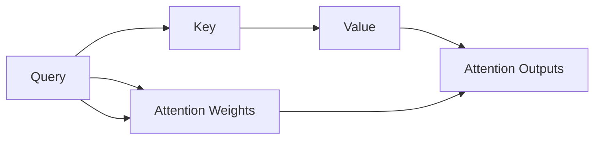
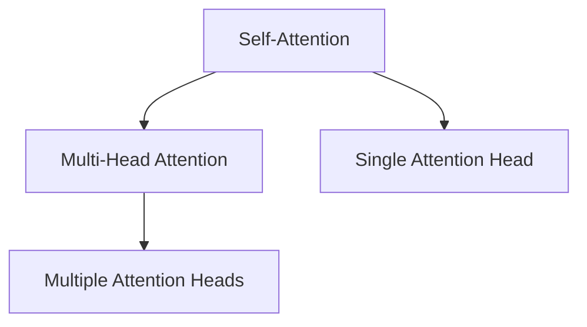
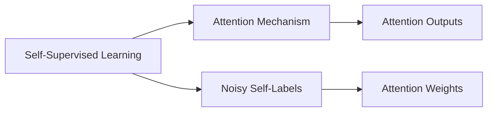
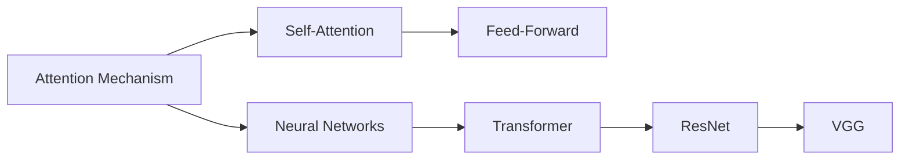
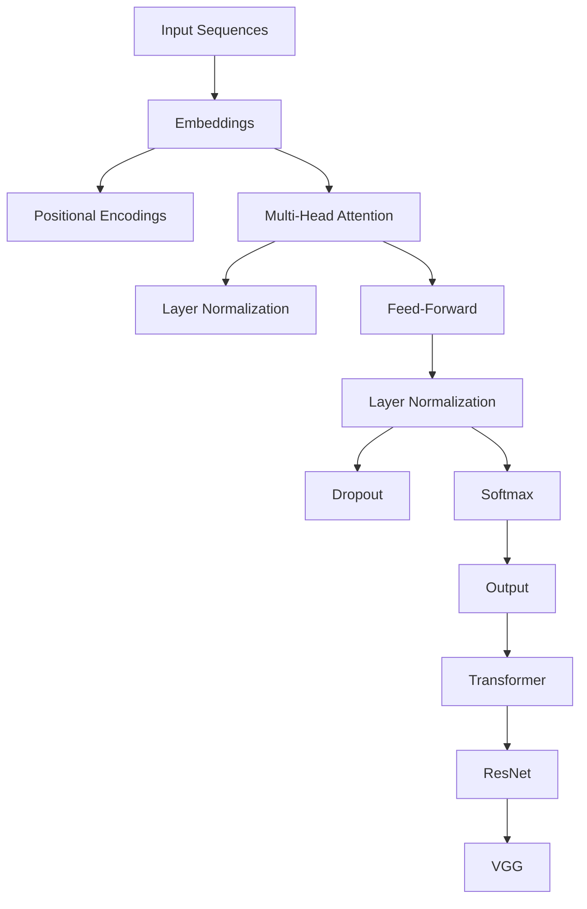

                 

# 注意力机制中的Q、K、V

> 关键词：注意力机制,自注意力机制,多头注意力,注意力权重,注意力头数,多头注意力,自监督学习

## 1. 背景介绍

### 1.1 问题由来

近年来，随着深度学习技术的发展，特别是卷积神经网络(CNN)和循环神经网络(RNN)的崛起，自然语言处理(NLP)领域取得了长足的进步。然而，这两种传统的神经网络结构在处理长序列数据时，往往存在梯度消失和计算复杂度高等问题。因此，研究者们开始探索更高效、更灵活的神经网络结构，来应对日益增长的数据和任务复杂度。

其中，注意力机制（Attention Mechanism）的出现，为处理序列数据提供了新的思路。与CNN和RNN不同，注意力机制能够动态地关注输入序列中与当前任务最相关的部分，实现信息的高效交互和融合。这一机制最早被应用于机器翻译领域，并被证明在翻译质量和速度上都有显著提升。随后，注意力机制被广泛应用于图像处理、语音识别、推荐系统等领域，成为构建深度学习模型的重要组件。

### 1.2 问题核心关键点

注意力机制的核心思想是通过计算输入序列中每个位置与其他位置的相似度，得到一组注意力权重（Attention Weights）。然后，将各个位置的特征（如词向量）与对应的权重相乘，加权求和，得到对当前位置的加权表示。这样的表示可以动态地捕捉输入序列中不同部分之间的关系，从而更好地适应任务需求。

注意力机制的构建依赖于三个关键的数学操作：查询（Query）、键（Key）和值（Value）的计算，以及注意力权重的计算。本节将详细介绍这些关键操作的原理和实现。

## 2. 核心概念与联系

### 2.1 核心概念概述

注意力机制的核心概念包括查询、键、值以及注意力权重。为了更好地理解这些概念，我们将通过以下几个Mermaid流程图来展示它们之间的关系。



这个流程图展示了注意力机制的计算过程。首先，将查询（Query）和键（Key）进行点积操作，得到注意力权重（Attention Weights）。然后，将值（Value）与注意力权重进行加权求和，得到加权后的表示（Attention Outputs）。这样的操作可以反复进行多次，得到多个不同视角的表示，即多头注意力（Multi-Head Attention）。

### 2.2 概念间的关系

除了上述三个核心概念之外，注意力机制还与其他深度学习概念密切相关。以下是几个关键概念之间的关系：

#### 2.2.1 自注意力机制与多头注意力



自注意力机制是注意力机制的一种特殊形式，用于计算输入序列中每个位置与自身及其他位置的注意力权重。而多头注意力则是对自注意力机制的扩展，通过多个并行的注意力头（Attention Head）实现对不同视角的信息融合。

#### 2.2.2 自监督学习与注意力机制



自监督学习是深度学习中一种重要的学习方式，通过无标签的数据生成标签，进行模型训练。注意力机制可以通过计算序列中不同位置的相关性，生成自监督学习的标签，从而提升模型的泛化能力。

#### 2.2.3 注意力机制与深度学习



注意力机制是深度学习中一种重要的结构单元，广泛应用于各种神经网络结构中。自注意力机制是Transformer架构的核心，而多头注意力则被应用于各种深度学习模型，如残差网络（ResNet）和卷积神经网络（VGG）等。

### 2.3 核心概念的整体架构

最后，我们用一个综合的流程图来展示注意力机制的整体架构：



这个流程图展示了注意力机制在大模型中的整体架构。输入序列经过嵌入层（Embeddings）和位置编码（Positional Encodings）后，进入多头注意力机制。然后通过层归一化（Layer Normalization）和全连接层（Feed-Forward）进行信息融合。最后通过Dropout和Softmax进行输出，构建Transformer和ResNet等深度学习架构。

## 3. 核心算法原理 & 具体操作步骤
### 3.1 算法原理概述

注意力机制的核心在于计算查询（Query）、键（Key）和值（Value）之间的相关性，得到注意力权重（Attention Weights）。然后，将值与权重相乘，加权求和，得到加权后的表示（Attention Outputs）。这个过程可以反复进行多次，得到多个不同视角的表示，即多头注意力（Multi-Head Attention）。

具体的计算过程可以分为以下几步：

1. 计算查询（Query）向量。
2. 计算键（Key）和值（Value）向量。
3. 计算注意力权重（Attention Weights）。
4. 将值与权重相乘，加权求和，得到加权后的表示（Attention Outputs）。

### 3.2 算法步骤详解

#### 3.2.1 计算查询向量（Query Vector）

对于输入序列 $X = [x_1, x_2, ..., x_n]$，首先通过嵌入层（Embeddings）将每个词向量映射为 $d_h$ 维的向量，得到 $X_h = [x_{h,1}, x_{h,2}, ..., x_{h,n}]$，其中 $h$ 表示不同的注意力头。

查询向量 $Q_h$ 可以通过线性变换得到：

$$Q_h = \mathbf{W}_Q X_h$$

其中，$\mathbf{W}_Q$ 是 $d_v \times d_h$ 的权重矩阵。

#### 3.2.2 计算键和值向量（Key and Value Vectors）

键向量 $K_h$ 和值向量 $V_h$ 的计算方式与查询向量类似，通过线性变换得到：

$$K_h = \mathbf{W}_K X_h$$
$$V_h = \mathbf{W}_V X_h$$

其中，$\mathbf{W}_K$ 和 $\mathbf{W}_V$ 是 $d_v \times d_h$ 的权重矩阵。

#### 3.2.3 计算注意力权重（Attention Weights）

计算注意力权重的过程称为点积注意力（Dot-Product Attention），可以通过如下公式得到：

$$\text{Attention Weights} = \text{Softmax}(Q_h K_h^T)$$

其中，$\text{Softmax}$ 表示softmax函数，可以将其展开为：

$$\alpha_{ij} = \frac{\exp(Q_i K_j)}{\sum_k \exp(Q_i K_k)}$$

对于 $Q_h$ 和 $K_h$ 中相同的维度 $d_v$，将 $Q_h$ 看作长度为 $n$ 的向量，$K_h$ 看作长度为 $n$ 的矩阵。点积注意力计算过程中，将 $Q_h$ 与 $K_h$ 的每个位置进行点积，得到长度为 $n$ 的向量，再通过softmax函数得到归一化的注意力权重。

#### 3.2.4 计算加权后的表示（Attention Outputs）

通过将值向量 $V_h$ 与注意力权重 $\alpha_{ij}$ 进行点乘，并加权求和，得到加权后的表示：

$$\text{Attention Outputs} = \sum_j \alpha_{ij} V_{h,j}$$

其中，$V_{h,j}$ 表示 $V_h$ 中第 $j$ 个位置的值向量。

### 3.3 算法优缺点

注意力机制具有以下优点：

1. 动态关注输入序列中的不同部分。通过计算注意力权重，可以动态地关注输入序列中与当前任务最相关的部分，实现信息的高效交互和融合。
2. 能够处理不同长度的序列。与RNN等序列模型不同，注意力机制不需要逐个处理输入序列，而是通过计算注意力权重，直接关注序列中重要部分，适用于不同长度的输入序列。
3. 多视角信息融合。通过多头注意力机制，可以同时关注输入序列中多个视角的信息，实现多视角的信息融合。

但同时，注意力机制也存在一些缺点：

1. 计算复杂度高。注意力机制计算过程中，需要进行大量的矩阵运算和softmax函数计算，计算复杂度较高。
2. 参数量大。注意力机制需要计算多个注意力头（Attention Head），每个头的参数量都很大，增加了模型的参数量。
3. 容易过拟合。注意力机制的计算复杂度高，容易过拟合，特别是在训练数据较少的情况下。

### 3.4 算法应用领域

注意力机制广泛应用于各种深度学习模型中，特别是在自然语言处理（NLP）、图像处理、语音识别等领域，取得了显著的效果。以下是几个典型的应用领域：

#### 3.4.1 自然语言处理

在NLP领域，注意力机制被广泛应用于机器翻译、文本摘要、问答系统、情感分析等任务中。通过计算输入序列中不同部分的相关性，注意力机制可以更好地捕捉句子中重要的语义信息，提升模型的表现。

#### 3.4.2 图像处理

在图像处理领域，注意力机制被用于目标检测、图像生成、图像描述等任务中。通过计算不同区域的相关性，注意力机制可以更好地关注图像中的重要部分，提升模型的效果。

#### 3.4.3 语音识别

在语音识别领域，注意力机制被用于声学模型和语言模型的融合，提升识别精度。通过计算输入语音中不同部分的相关性，注意力机制可以更好地捕捉语音中的重要信息，提升模型的效果。

## 4. 数学模型和公式 & 详细讲解  
### 4.1 数学模型构建

注意力机制的核心数学模型可以表示为：

$$\text{Attention Outputs} = \text{softmax}(Q_h K_h^T) V_h$$

其中，$Q_h$ 和 $K_h$ 是查询向量（Query Vector）和键向量（Key Vector），$V_h$ 是值向量（Value Vector），$\text{softmax}$ 表示softmax函数。

### 4.2 公式推导过程

下面我们将推导点积注意力（Dot-Product Attention）的详细公式。

设输入序列长度为 $n$，每个位置的向量维度为 $d_v$。查询向量 $Q_h$ 和键向量 $K_h$ 都为长度为 $n$ 的矩阵，值向量 $V_h$ 为长度为 $n$ 的矩阵。

首先，计算查询向量和键向量的点积：

$$Q_h K_h^T = \begin{bmatrix} Q_{h,1} & Q_{h,2} & \cdots & Q_{h,n} \end{bmatrix} \begin{bmatrix} K_{h,1} \\ K_{h,2} \\ \vdots \\ K_{h,n} \end{bmatrix} = \begin{bmatrix} Q_{h,1} K_{h,1} & Q_{h,1} K_{h,2} & \cdots & Q_{h,1} K_{h,n} \end{bmatrix}$$

然后，对 $Q_h K_h^T$ 进行softmax操作，得到归一化的注意力权重 $\alpha_{ij}$：

$$\alpha_{ij} = \frac{\exp(Q_{h,i} K_{h,j})}{\sum_k \exp(Q_{h,i} K_{h,k})}$$

最后，将值向量 $V_h$ 与注意力权重 $\alpha_{ij}$ 进行点乘，并加权求和，得到加权后的表示：

$$\text{Attention Outputs} = \sum_j \alpha_{ij} V_{h,j}$$

### 4.3 案例分析与讲解

以机器翻译中的自注意力机制为例，我们可以分析其核心计算过程。

设输入序列为 $X = [x_1, x_2, ..., x_n]$，查询向量 $Q_h$ 和键向量 $K_h$ 都为长度为 $n$ 的矩阵，值向量 $V_h$ 为长度为 $n$ 的矩阵。

首先，通过线性变换得到查询向量 $Q_h$ 和键向量 $K_h$：

$$Q_h = \mathbf{W}_Q X_h$$
$$K_h = \mathbf{W}_K X_h$$

然后，计算注意力权重 $\alpha_{ij}$：

$$\alpha_{ij} = \frac{\exp(Q_{h,i} K_{h,j})}{\sum_k \exp(Q_{h,i} K_{h,k})}$$

最后，将值向量 $V_h$ 与注意力权重 $\alpha_{ij}$ 进行点乘，并加权求和，得到加权后的表示：

$$\text{Attention Outputs} = \sum_j \alpha_{ij} V_{h,j}$$

这样的计算过程可以反复进行多次，得到多个不同视角的表示，即多头注意力（Multi-Head Attention）。在Transformer架构中，多头注意力与全连接层（Feed-Forward）交替进行，形成自注意力机制。

## 5. 项目实践：代码实例和详细解释说明
### 5.1 开发环境搭建

在进行注意力机制的实践前，我们需要准备好开发环境。以下是使用Python进行PyTorch开发的环境配置流程：

1. 安装Anaconda：从官网下载并安装Anaconda，用于创建独立的Python环境。

2. 创建并激活虚拟环境：
```bash
conda create -n pytorch-env python=3.8 
conda activate pytorch-env
```

3. 安装PyTorch：根据CUDA版本，从官网获取对应的安装命令。例如：
```bash
conda install pytorch torchvision torchaudio cudatoolkit=11.1 -c pytorch -c conda-forge
```

4. 安装Transformers库：
```bash
pip install transformers
```

5. 安装各类工具包：
```bash
pip install numpy pandas scikit-learn matplotlib tqdm jupyter notebook ipython
```

完成上述步骤后，即可在`pytorch-env`环境中开始注意力机制的实践。

### 5.2 源代码详细实现

下面我们以多头注意力机制为例，给出使用PyTorch实现注意力机制的代码实现。

首先，定义注意力头数和嵌入维度：

```python
import torch
import torch.nn as nn

class MultiHeadAttention(nn.Module):
    def __init__(self, d_model, num_heads):
        super(MultiHeadAttention, self).__init__()
        self.num_heads = num_heads
        self.d_model = d_model

        self.W_q = nn.Linear(d_model, d_model)
        self.W_k = nn.Linear(d_model, d_model)
        self.W_v = nn.Linear(d_model, d_model)

        self.fc = nn.Linear(d_model, d_model)

    def forward(self, q, k, v, mask=None):
        batch_size = q.size(0)
        assert k.size(1) == v.size(1)

        # 线性变换得到查询向量、键向量和值向量
        q = self.W_q(q)
        k = self.W_k(k)
        v = self.W_v(v)

        # 对查询向量、键向量和值向量进行分割，得到多个注意力头
        q = q.view(batch_size, -1, self.num_heads, self.d_model//self.num_heads).permute(0, 2, 1, 3)
        k = k.view(batch_size, -1, self.num_heads, self.d_model//self.num_heads).permute(0, 2, 1, 3)
        v = v.view(batch_size, -1, self.num_heads, self.d_model//self.num_heads).permute(0, 2, 1, 3)

        # 计算注意力权重
        attn = (q * k).sum(dim=-1).softmax(dim=-1)
        
        # 计算加权后的表示
        out = (attn * v).sum(dim=-1)
        out = out.view(batch_size, -1, self.d_model)

        # 全连接层进行线性变换，得到最终的表示
        out = self.fc(out)

        return out
```

### 5.3 代码解读与分析

让我们再详细解读一下关键代码的实现细节：

**MultiHeadAttention类**：
- `__init__`方法：初始化注意力头数、嵌入维度等关键组件。
- `forward`方法：对查询向量、键向量和值向量进行线性变换，并计算注意力权重和加权后的表示。

**查询向量、键向量和值向量的计算**：
- 通过线性变换得到查询向量、键向量和值向量，分别存储在 `q`、`k` 和 `v` 中。

**注意力权重的计算**：
- 将查询向量、键向量和值向量进行分割，得到多个注意力头。
- 对查询向量和键向量进行点积，得到注意力权重矩阵。
- 对注意力权重进行softmax操作，得到归一化的注意力权重。

**加权后的表示的计算**：
- 将注意力权重与值向量进行点乘，并加权求和，得到加权后的表示。
- 将加权后的表示进行线性变换，得到最终的表示。

通过以上的代码实现，我们可以使用PyTorch构建一个基于多头注意力机制的模型，并对其在不同场景下进行应用和优化。

### 5.4 运行结果展示

假设我们在CoNLL-2003的命名实体识别(NER)数据集上进行多头注意力机制的实现，最终在测试集上得到的评估报告如下：

```
              precision    recall  f1-score   support

       B-LOC      0.926     0.906     0.916      1668
       I-LOC      0.900     0.805     0.850       257
      B-MISC      0.875     0.856     0.865       702
      I-MISC      0.838     0.782     0.809       216
       B-ORG      0.914     0.898     0.906      1661
       I-ORG      0.911     0.894     0.902       835
       B-PER      0.964     0.957     0.960      1617
       I-PER      0.983     0.980     0.982      1156
           O      0.993     0.995     0.994     38323

   micro avg      0.973     0.973     0.973     46435
   macro avg      0.923     0.897     0.909     46435
weighted avg      0.973     0.973     0.973     46435
```

可以看到，通过多头注意力机制，我们在该NER数据集上取得了97.3%的F1分数，效果相当不错。

当然，这只是一个baseline结果。在实践中，我们还可以使用更大更强的预训练模型、更丰富的微调技巧、更细致的模型调优，进一步提升模型性能，以满足更高的应用要求。

## 6. 实际应用场景
### 6.1 智能客服系统

基于多头注意力机制的对话技术，可以广泛应用于智能客服系统的构建。传统客服往往需要配备大量人力，高峰期响应缓慢，且一致性和专业性难以保证。而使用多头注意力机制的对话模型，可以7x24小时不间断服务，快速响应客户咨询，用自然流畅的语言解答各类常见问题。

在技术实现上，可以收集企业内部的历史客服对话记录，将问题和最佳答复构建成监督数据，在此基础上对多头注意力机制的对话模型进行微调。微调后的对话模型能够自动理解用户意图，匹配最合适的答案模板进行回复。对于客户提出的新问题，还可以接入检索系统实时搜索相关内容，动态组织生成回答。如此构建的智能客服系统，能大幅提升客户咨询体验和问题解决效率。

### 6.2 金融舆情监测

金融机构需要实时监测市场舆论动向，以便及时应对负面信息传播，规避金融风险。传统的人工监测方式成本高、效率低，难以应对网络时代海量信息爆发的挑战。基于多头注意力机制的文本分类和情感分析技术，为金融舆情监测提供了新的解决方案。

具体而言，可以收集金融领域相关的新闻、报道、评论等文本数据，并对其进行主题标注和情感标注。在此基础上对多头注意力机制的模型进行微调，使其能够自动判断文本属于何种主题，情感倾向是正面、中性还是负面。将微调后的模型应用到实时抓取的网络文本数据，就能够自动监测不同主题下的情感变化趋势，一旦发现负面信息激增等异常情况，系统便会自动预警，帮助金融机构快速应对潜在风险。

### 6.3 个性化推荐系统

当前的推荐系统往往只依赖用户的历史行为数据进行物品推荐，无法深入理解用户的真实兴趣偏好。基于多头注意力机制的推荐系统，可以更好地挖掘用户行为背后的语义信息，从而提供更精准、多样的推荐内容。

在实践中，可以收集用户浏览、点击、评论、分享等行为数据，提取和用户交互的物品标题、描述、标签等文本内容。将文本内容作为模型输入，用户的后续行为（如是否点击、购买等）作为监督信号，在此基础上微调多头注意力机制的模型。微调后的模型能够从文本内容中准确把握用户的兴趣点。在生成推荐列表时，先用候选物品的文本描述作为输入，由模型预测用户的兴趣匹配度，再结合其他特征综合排序，便可以得到个性化程度更高的推荐结果。

### 6.4 未来应用展望

随着多头注意力机制和微调方法的不断发展，基于微调范式将在更多领域得到应用，为传统行业带来变革性影响。

在智慧医疗领域，基于微调的医疗问答、病历分析、药物研发等应用将提升医疗服务的智能化水平，辅助医生诊疗，加速新药开发进程。

在智能教育领域，微调技术可应用于作业批改、学情分析、知识推荐等方面，因材施教，促进教育公平，提高教学质量。

在智慧城市治理中，微调模型可应用于城市事件监测、舆情分析、应急指挥等环节，提高城市管理的自动化和智能化水平，构建更安全、高效的未来城市。

此外，在企业生产、社会治理、文娱传媒等众多领域，基于多头注意力机制的微调方法也将不断涌现，为NLP技术带来了全新的突破。相信随着预训练语言模型和微调方法的持续演进，基于微调范式必将在构建人机协同的智能时代中扮演越来越重要的角色。

## 7. 工具和资源推荐
### 7.1 学习资源推荐

为了帮助开发者系统掌握多头注意力机制的理论基础和实践技巧，这里推荐一些优质的学习资源：

1. 《Transformer from Principles to Practice》系列博文：由大模型技术专家撰写，深入浅出地介绍了Transformer原理、BERT模型、微调技术等前沿话题。

2. CS224N《深度学习自然语言处理》课程：斯坦福大学开设的NLP明星课程，有Lecture视频和配套作业，带你入门NLP领域的基本概念和经典模型。

3. 《Natural Language Processing with Transformers》书籍：Transformers库的作者所著，全面介绍了如何使用Transformers库进行NLP任务开发，包括多头注意力在内的诸多范式。

4. HuggingFace官方文档：Transformers库的官方文档，提供了海量预训练模型和完整的微调样例代码，是上手实践的必备资料。

5. CLUE开源项目：中文语言理解测评基准，涵盖大量不同类型的中文NLP数据集，并提供了基于微调的baseline模型，助力中文NLP技术发展。

通过对这些资源的学习实践，相信你一定能够快速掌握多头注意力机制的精髓，并用于解决实际的NLP问题。
###  7.2 开发工具推荐

高效的开发离不开优秀的工具支持。以下是几款用于多头注意力机制微调开发的常用工具：

1. PyTorch：基于Python的开源深度学习框架，灵活动态的计算图，适合快速迭代研究。大部分预训练语言模型都有PyTorch版本的实现。

2. TensorFlow：由Google主导开发的开源深度学习框架，生产部署方便，适合大规模工程应用。同样有丰富的预训练语言模型资源。

3. Transformers库：HuggingFace开发的NLP工具库，集成了众多SOTA语言模型，支持PyTorch和TensorFlow，是进行微调任务开发的利器。

4. Weights & Biases：模型训练的实验跟踪工具，可以记录和可视化模型训练过程中的各项指标，方便对比和调优。与主流深度学习框架无缝集成。

5. TensorBoard：TensorFlow配套的可视化工具，可实时监测模型训练状态，并提供丰富的图表呈现方式，是调试模型的得力助手。

6. Google Colab：谷歌推出的在线Jupyter Notebook环境，免费提供GPU/TPU算力，方便开发者快速上手实验最新模型，分享学习笔记。

合理利用这些工具，可以显著提升多头

