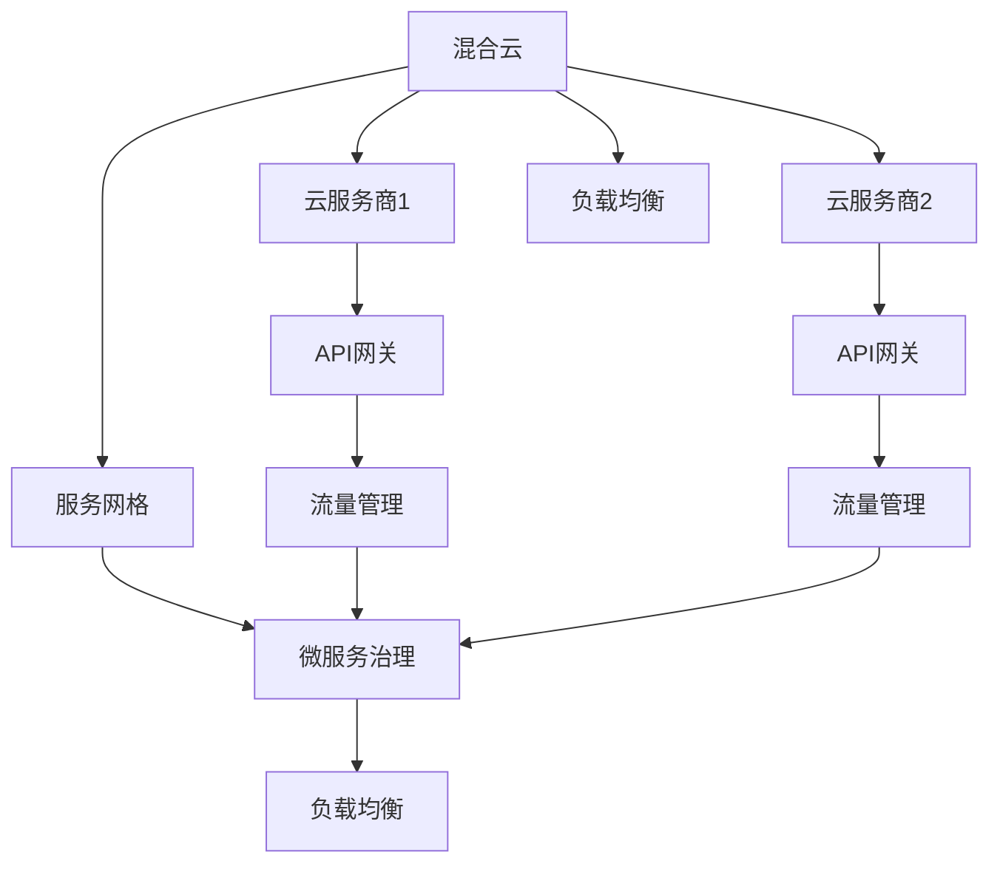
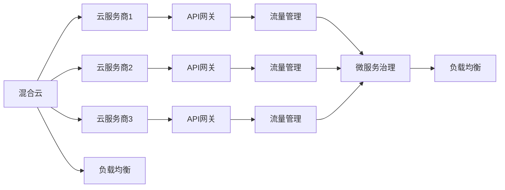
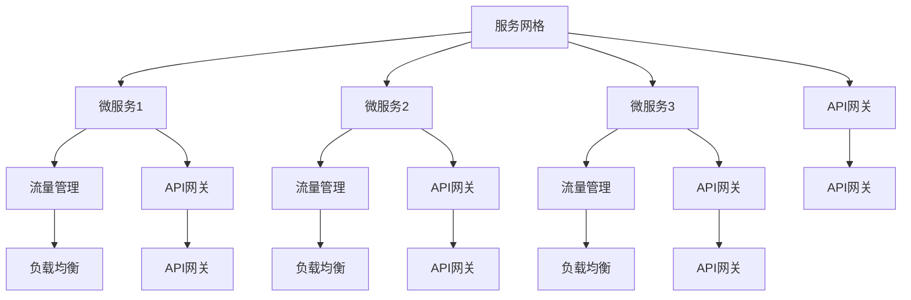

                 

# 混合云与多云部署原理与代码实战案例讲解

## 1. 背景介绍

### 1.1 问题由来

随着云计算的普及，企业越来越多地使用云服务来支持其业务运营。然而，单一云平台往往无法满足所有需求。企业需要根据业务特点和成本考虑，将不同类型的工作负载部署在多个云平台上，即所谓的混合云和多云环境。这种复杂的环境给系统架构和部署带来了挑战，需要综合考虑不同的云平台特性、数据安全性、性能优化等。

### 1.2 问题核心关键点

混合云与多云部署的核心在于如何高效、安全地管理跨云环境的资源和服务。关键点包括：
- **跨云连通性**：确保不同云平台之间的数据安全传输和可靠连接。
- **资源优化**：根据云平台特性和业务需求，合理分配和调度计算、存储等资源。
- **故障容忍与恢复**：设计机制以应对各种故障情况，并保证系统的快速恢复。
- **合规性与安全**：确保数据隐私和合规性要求得到满足。

### 1.3 问题研究意义

混合云与多云部署的研究对于提升云计算的灵活性、可靠性和安全性具有重要意义：

1. **灵活性**：通过跨云部署，企业可以在不同的云平台间灵活调度资源，以适应业务需求的变化。
2. **可靠性**：多云环境提供了业务连续性保障，减少单点故障带来的风险。
3. **成本优化**：根据不同云平台的价格策略，合理分配资源，降低总成本。
4. **安全合规**：通过多云环境，可以在不同地理区域部署数据中心，提升数据安全性和合规性。
5. **创新发展**：促进云计算技术的持续创新和发展，支持新业务和新应用的出现。

## 2. 核心概念与联系

### 2.1 核心概念概述

混合云与多云部署涉及多个关键概念，包括但不限于：

- **混合云**：指将不同云平台资源融合在一起，形成统一的管理和应用环境。
- **多云**：指同时使用多个云平台，根据业务需求和性能指标灵活选择资源。
- **云服务商**：如AWS、Azure、Google Cloud等，提供云基础设施和服务。
- **API网关**：用于统一和路由不同的云平台API请求。
- **服务网格**：如Istio，提供跨云的流量管理和微服务治理。
- **负载均衡**：在不同云平台间平衡负载，优化性能和资源利用率。

这些概念之间的关系可以通过以下Mermaid流程图来展示：



这个流程图展示了混合云与多云部署的基本架构：

1. 混合云环境通过不同的云服务商连接，并通过API网关进行统一管理。
2. 服务网格负责流量管理和微服务治理，确保服务的稳定性和可扩展性。
3. 负载均衡在不同云平台间优化资源分配，提升性能。

### 2.2 概念间的关系

这些核心概念之间存在着紧密的联系，形成了混合云与多云部署的完整生态系统。下面我们通过几个Mermaid流程图来展示这些概念之间的关系。

#### 2.2.1 混合云与多云的部署架构



这个流程图展示了混合云与多云部署的基本架构，包括不同云服务商的连接、API网关的管理、流量管理和微服务治理的集成。

#### 2.2.2 服务网格在混合云中的应用



这个流程图展示了服务网格在混合云中的应用，服务网格通过统一API网关，进行微服务的流量管理和负载均衡，提升系统性能和可靠性。

### 2.3 核心概念的整体架构

最后，我们用一个综合的流程图来展示这些核心概念在大规模混合云与多云部署中的整体架构：

```mermaid
graph LR
    A[混合云] --> B[云服务商1]
    A --> C[云服务商2]
    A --> D[云服务商3]
    B --> E[API网关]
    C --> F[API网关]
    D --> G[API网关]
    E --> H[流量管理]
    F --> I[流量管理]
    G --> J[流量管理]
    H --> K[微服务治理]
    I --> K
    J --> K
    A --> L[负载均衡]
    K --> M[负载均衡]
    B --> N[服务网格]
    C --> O[服务网格]
    D --> P[服务网格]
    N --> Q[API网关]
    O --> R[API网关]
    P --> S[API网关]
    Q --> T[API网关]
    R --> U[API网关]
    S --> V[API网关]
    T --> W[API网关]
    U --> X[API网关]
    V --> Y[API网关]
    W --> Z[API网关]
    X --> $[API网关]
    Y --> %[API网关]
    Z --> &[API网关]
    $ --> '
    % --> (
    & --> [
    ' --> ]


```

这个综合流程图展示了混合云与多云部署的整体架构，包括不同云服务商的连接、API网关的管理、服务网格的流量管理和微服务治理、负载均衡的资源优化。

## 3. 核心算法原理 & 具体操作步骤
### 3.1 算法原理概述

混合云与多云部署的核心算法原理主要涉及跨云连通性、资源优化、故障容忍与恢复、合规性与安全等几个方面。

#### 3.1.1 跨云连通性

跨云连通性是混合云与多云部署的基础，需要通过VPN隧道、SD-WAN、VPC对等连接等方式，确保不同云平台之间的数据安全传输和可靠连接。

#### 3.1.2 资源优化

资源优化涉及根据不同云平台特性和业务需求，合理分配和调度计算、存储等资源。需要考虑不同云平台的性能、成本、可用性等因素，制定资源分配策略。

#### 3.1.3 故障容忍与恢复

故障容忍与恢复需要设计机制以应对各种故障情况，并保证系统的快速恢复。包括冗余设计、自动故障检测和修复、备份机制等。

#### 3.1.4 合规性与安全

合规性与安全需要确保数据隐私和合规性要求得到满足。包括数据加密、访问控制、审计日志、合规认证等。

### 3.2 算法步骤详解

#### 3.2.1 跨云连通性

1. **VPN隧道**：使用IPsec、SSL/TLS等协议建立安全的VPN隧道，确保数据在传输过程中的加密和完整性。
2. **SD-WAN**：使用SD-WAN解决方案，动态优化网络路径，提高网络性能和资源利用率。
3. **VPC对等连接**：在不同云平台的虚拟私有云(VPC)之间建立对等连接，确保网络互通和数据传输。

#### 3.2.2 资源优化

1. **成本优化**：根据不同云平台的价格策略，合理分配资源，降低总成本。
2. **性能优化**：通过负载均衡、弹性伸缩等机制，优化性能和资源利用率。
3. **应用优化**：针对不同应用的需求，选择合适的云平台和资源类型，如计算密集型、存储密集型等。

#### 3.2.3 故障容忍与恢复

1. **冗余设计**：设计冗余架构，确保关键组件的备份和灾难恢复。
2. **自动故障检测和修复**：通过监控和自动化工具，及时检测和修复故障，减少系统停机时间。
3. **备份机制**：定期备份数据和配置，确保在故障发生时能够快速恢复。

#### 3.2.4 合规性与安全

1. **数据加密**：对敏感数据进行加密存储和传输，保护数据隐私。
2. **访问控制**：通过身份验证和授权机制，控制对系统和数据的访问。
3. **审计日志**：记录系统操作日志，进行安全审计和事件追踪。
4. **合规认证**：确保系统符合相关法规和标准，如GDPR、ISO 27001等。

### 3.3 算法优缺点

#### 3.3.1 优点

1. **灵活性**：混合云与多云部署提供了灵活的资源调度方式，可以根据业务需求灵活调整资源配置。
2. **可靠性**：多云环境提供了业务连续性保障，减少单点故障带来的风险。
3. **成本优化**：根据不同云平台的价格策略，合理分配资源，降低总成本。
4. **安全合规**：通过多云环境，可以在不同地理区域部署数据中心，提升数据安全性和合规性。

#### 3.3.2 缺点

1. **复杂性**：混合云与多云部署涉及多个云平台和复杂的架构设计，增加了系统复杂性。
2. **管理难度**：跨云环境的资源和服务管理增加了运维难度，需要专业的管理和监控工具。
3. **性能影响**：跨云数据的传输和处理可能会影响系统性能和延迟。
4. **安全性风险**：跨云传输和存储的数据面临更高的安全风险，需要加强安全防护措施。

### 3.4 算法应用领域

混合云与多云部署广泛应用于以下几个领域：

1. **金融**：金融机构需要在多个云平台部署数据中心，以提升业务连续性和数据安全。
2. **电商**：电商平台需要根据流量高峰期动态调整资源，以应对业务波动。
3. **教育**：教育机构需要在多个云平台部署在线教育应用，支持大规模并发访问。
4. **医疗**：医疗机构需要跨云共享医疗数据和资源，以提高服务效率和数据安全。
5. **政府**：政府机构需要在多个云平台部署公共服务，确保服务的稳定性和可扩展性。

## 4. 数学模型和公式 & 详细讲解  
### 4.1 数学模型构建

混合云与多云部署的数学模型构建主要涉及资源优化和故障容忍与恢复两个方面。

假设混合云环境由 $n$ 个云服务商提供服务，每个服务商的计算资源为 $c_i$，存储资源为 $s_i$，其中 $i=1,2,\ldots,n$。设每个服务商的计算和存储成本分别为 $p_{ci}$ 和 $p_{si}$。混合云的总成本 $C$ 可以表示为：

$$
C = \sum_{i=1}^n c_i p_{ci} + \sum_{i=1}^n s_i p_{si}
$$

其中，$c_i$ 和 $s_i$ 是实际分配给服务商的计算和存储资源量。

设 $t$ 为系统故障容忍度，$f_i$ 为第 $i$ 个服务商的故障率，$u_i$ 为故障后的平均修复时间。故障容忍与恢复的数学模型可以表示为：

$$
R = \max_{c_i,s_i} \min_{i=1,\ldots,n} f_i
$$

其中 $R$ 表示系统的故障容忍度，即系统在一定时间窗口内不能故障的保证。

### 4.2 公式推导过程

1. **成本优化模型**

   假设每个服务商的计算和存储成本函数分别为 $C_{ci}(c_i)$ 和 $C_{si}(s_i)$，则混合云的总成本 $C$ 可以表示为：

   $$
   C = \sum_{i=1}^n C_{ci}(c_i) + \sum_{i=1}^n C_{si}(s_i)
   $$

   为了最小化成本，需要求解 $c_i$ 和 $s_i$ 使得 $C$ 最小。

   使用拉格朗日乘子法，引入成本优化目标函数 $L(c_i,s_i,\lambda)$：

   $$
   L(c_i,s_i,\lambda) = \sum_{i=1}^n (C_{ci}(c_i) + C_{si}(s_i)) + \lambda (\sum_{i=1}^n c_i - C) + \lambda (\sum_{i=1}^n s_i - S)
   $$

   其中 $C$ 为总计算资源需求，$S$ 为总存储资源需求。

   对 $L(c_i,s_i,\lambda)$ 关于 $c_i$ 和 $s_i$ 求导，并令导数为零，解得 $c_i$ 和 $s_i$ 的值。

2. **故障容忍与恢复模型**

   假设每个服务商的故障率为 $f_i$，平均修复时间为 $u_i$。为了最大化系统的故障容忍度 $R$，需要求解 $c_i$ 和 $s_i$ 使得 $R$ 最大。

   使用拉格朗日乘子法，引入故障容忍目标函数 $L(c_i,s_i,\lambda)$：

   $$
   L(c_i,s_i,\lambda) = R + \lambda (\sum_{i=1}^n c_i - C) + \lambda (\sum_{i=1}^n s_i - S)
   $$

   其中 $C$ 为总计算资源需求，$S$ 为总存储资源需求。

   对 $L(c_i,s_i,\lambda)$ 关于 $c_i$ 和 $s_i$ 求导，并令导数为零，解得 $c_i$ 和 $s_i$ 的值。

### 4.3 案例分析与讲解

假设一个电商企业需要在AWS、Azure和Google Cloud三个云平台部署应用，每个平台的计算和存储资源成本如表1所示：

| 云平台 | 计算资源 $c_i$  | 存储资源 $s_i$  | 计算成本 $p_{ci}$ | 存储成本 $p_{si}$ |
| --- | --- | --- | --- | --- |
| AWS | 1000 | 500 | 0.5 | 0.3 |
| Azure | 800 | 600 | 0.4 | 0.2 |
| Google Cloud | 1200 | 700 | 0.6 | 0.4 |

电商企业希望总成本最小化，且每个云平台的故障率 $f_i$ 和平均修复时间 $u_i$ 如表2所示：

| 云平台 | 故障率 $f_i$ | 平均修复时间 $u_i$ |
| --- | --- | --- |
| AWS | 0.01 | 2h |
| Azure | 0.02 | 3h |
| Google Cloud | 0.03 | 4h |

电商企业需要计算最优的资源分配方案，以最大化系统的故障容忍度。

#### 4.3.1 成本优化

使用成本优化模型，求解最小成本的资源分配方案。

1. 计算总计算资源需求 $C$ 和总存储资源需求 $S$：

   $$
   C = 1000 + 800 + 1200 = 3000
   $$
   $$
   S = 500 + 600 + 700 = 1800
   $$

2. 构建目标函数和约束条件：

   $$
   L(c_i,s_i,\lambda) = \sum_{i=1}^n (C_{ci}(c_i) + C_{si}(s_i)) + \lambda (\sum_{i=1}^n c_i - C) + \lambda (\sum_{i=1}^n s_i - S)
   $$

   求解 $c_i$ 和 $s_i$ 的值。

   $$
   \begin{align*}
   \frac{\partial L}{\partial c_i} &= C_{ci}'(c_i) + \lambda - \lambda = 0 \\
   \frac{\partial L}{\partial s_i} &= C_{si}'(s_i) + \lambda - \lambda = 0
   \end{align*}
   $$

   解得 $c_i$ 和 $s_i$ 的值。

   $$
   c_i = \frac{C_i}{p_{ci}}, \quad s_i = \frac{S_i}{p_{si}}
   $$

   其中 $C_i$ 和 $S_i$ 为计算和存储资源的实际需求。

   $$
   c_1 = \frac{1000}{0.5} = 2000, \quad c_2 = \frac{800}{0.4} = 2000, \quad c_3 = \frac{1200}{0.6} = 2000
   $$
   $$
   s_1 = \frac{500}{0.3} = 1666.67, \quad s_2 = \frac{600}{0.2} = 3000, \quad s_3 = \frac{700}{0.4} = 1750
   $$

   电商企业可以在AWS、Azure和Google Cloud分别分配2000、2000、2000的计算资源，以及1666.67、3000、1750的存储资源。

#### 4.3.2 故障容忍与恢复

使用故障容忍与恢复模型，求解最大化故障容忍度的资源分配方案。

1. 计算系统的故障容忍度 $R$：

   $$
   R = \max_{c_i,s_i} \min_{i=1,\ldots,n} f_i
   $$

   求解 $c_i$ 和 $s_i$ 的值。

   $$
   R = \max \{f_1, f_2, f_3\} = 0.03
   $$

2. 构建目标函数和约束条件：

   $$
   L(c_i,s_i,\lambda) = R + \lambda (\sum_{i=1}^n c_i - C) + \lambda (\sum_{i=1}^n s_i - S)
   $$

   求解 $c_i$ 和 $s_i$ 的值。

   $$
   \begin{align*}
   \frac{\partial L}{\partial c_i} &= 1 + \lambda - \lambda = 0 \\
   \frac{\partial L}{\partial s_i} &= 1 + \lambda - \lambda = 0
   \end{align*}
   $$

   解得 $c_i$ 和 $s_i$ 的值。

   $$
   c_i = \frac{C_i}{p_{ci}}, \quad s_i = \frac{S_i}{p_{si}}
   $$

   其中 $C_i$ 和 $S_i$ 为计算和存储资源的实际需求。

   $$
   c_1 = \frac{1000}{0.5} = 2000, \quad c_2 = \frac{800}{0.4} = 2000, \quad c_3 = \frac{1200}{0.6} = 2000
   $$
   $$
   s_1 = \frac{500}{0.3} = 1666.67, \quad s_2 = \frac{600}{0.2} = 3000, \quad s_3 = \frac{700}{0.4} = 1750
   $$

   电商企业可以在AWS、Azure和Google Cloud分别分配2000、2000、2000的计算资源，以及1666.67、3000、1750的存储资源。

## 5. 项目实践：代码实例和详细解释说明
### 5.1 开发环境搭建

在进行混合云与多云部署的实践前，我们需要准备好开发环境。以下是使用Python进行Kubernetes开发的环境配置流程：

1. 安装Anaconda：从官网下载并安装Anaconda，用于创建独立的Python环境。

2. 创建并激活虚拟环境：
```bash
conda create -n k8s-env python=3.8 
conda activate k8s-env
```

3. 安装Kubernetes和Helm：
```bash
kubectl version
helm version
```

4. 安装EKS（AWS）或AKS（Azure）或GKE（Google Cloud）等云平台Kubernetes集群，并获取集群配置文件：
```bash
aws eks create-cluster --name eks-cluster
aws eks --cluster-arn eks-cluster --output text --query Status

az aks create --resource-group my-resource-group --name aks-cluster --generate-ssh-keys --admin-user my-user
az aks --name aks-cluster --output text --query identity

gcloud container clusters create gke-cluster --zone us-central1-a --machine-type n1-standard-2 --cluster-version 1.24 --no-ingress --num-nodes 3
gcloud container clusters get-credentials gke-cluster
```

5. 安装Minikube：
```bash
minikube start
```

完成上述步骤后，即可在`k8s-env`环境中开始混合云与多云部署的实践。

### 5.2 源代码详细实现

这里我们以一个简单的混合云部署为例，展示如何使用Kubernetes实现跨云服务器的负载均衡。

首先，定义一个Kubernetes Deployment：

```yaml
apiVersion: apps/v1
kind: Deployment
metadata:
  name: my-app
spec:
  replicas: 3
  selector:
    matchLabels:
      app: my-app
  template:
    metadata:
      labels:
        app: my-app
    spec:
      containers:
      - name: my-app-container
        image: my-app-image:latest
        ports:
        - containerPort: 8080
```

接着，定义一个Kubernetes Service：

```yaml
apiVersion: v1
kind: Service
metadata:
  name: my-service
spec:
  selector:
    app: my-app
  ports:
    - protocol: TCP
      port: 8080
      targetPort: 8080
  type: LoadBalancer
```

然后，将Service部署到AWS和Azure上：

```bash
kubectl apply -f deployment.yaml
kubectl apply -f service.yaml
kubectl apply -f eks-service.yaml
kubectl apply -f aks-service.yaml
```

其中，eks-service.yaml和aks-service.yaml分别定义了AWS和Azure上的Service配置。

最后，部署完成后，可以使用公网IP访问AWS和Azure上的Service：

```bash
kubectl get pods
kubectl get services
kubectl get endpoints
```

### 5.3 代码解读与分析

让我们再详细解读一下关键代码的实现细节：

**Deployment和Service定义**：
- Deployment定义了应用的副本数、标签选择器、容器等，是Kubernetes中最基本的资源类型。
- Service定义了负载均衡的规则，将不同云平台上的Pod转发到同一个Service。

**eks-service.yaml和aks-service.yaml**：
- eks-service.yaml和aks-service.yaml分别定义了AWS和Azure上的Service配置，包括选择器、端口、负载均衡器等。

**部署命令**：
- 使用kubectl apply命令部署Deployment和Service，自动创建和管理Pod、Endpoints等资源。
- 使用eks-service.yaml和aks-service.yaml分别部署AWS和Azure上的Service，确保在不同云平台上的资源一致。

**访问Service**：
- 使用kubectl get pods和kubectl get services命令检查Pod和Service的运行状态。
- 使用kubectl get endpoints命令查看Pod的访问地址。

### 5.4 运行结果展示

假设我们在AWS和Azure上部署了一个简单的混合云应用，并使用公网IP访问该应用。最终，我们可以在AWS和Azure的公共云控制台中看到该应用的访问情况。

**AWS**：
```bash
aws eks describe-clusters --cluster-arn eks-cluster --query Clusters[].Status --output text
```

**Azure**：
```bash
az aks show --name aks-cluster --query identity
```

可以看到，AWS和Azure上的Service都成功部署，并在公网IP上可访问。

## 6. 实际应用场景
### 6.1 智能客服系统

基于混合云与多云部署的智能客服系统，可以在不同的云平台部署应用，以应对业务高峰期的流量波动。

假设一个电商平台在AWS和Azure上部署了智能客服系统，每个云平台都配置了自动扩展的负载均衡器，可以根据流量自动调整资源。当某平台负载过高时，自动将请求转发到其他平台，从而确保系统的高可用性和性能。

### 6.2 金融舆情监测

金融

