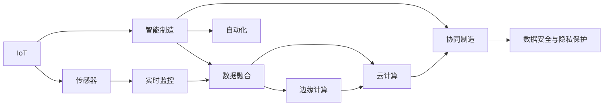
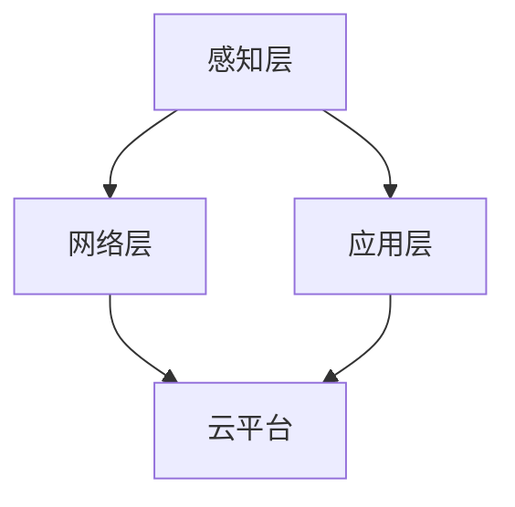
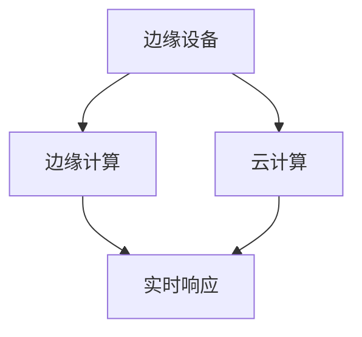
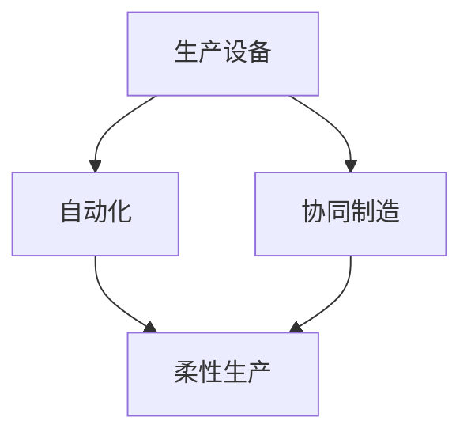
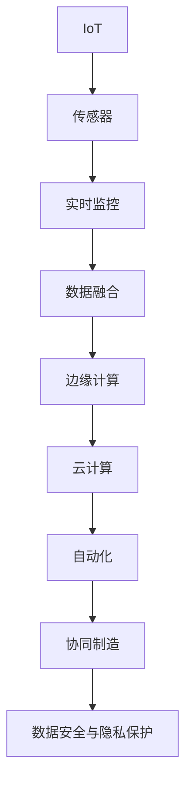

                 

# 物联网(IoT)技术和各种传感器设备的集成：物联网在工业制造中的应用

> 关键词：物联网(IoT)、传感器、工业制造、智能制造、实时监控、数据融合、边缘计算、云计算

## 1. 背景介绍

### 1.1 问题由来
近年来，随着物联网(IoT)技术的快速发展，工业制造领域迎来了前所未有的变革。物联网将各种传感器设备与互联网紧密结合，实现对生产环境的实时监控、设备状态的精准预测、生产过程的智能化管理，极大地提升了制造效率和产品质量。

特别是随着智能制造的兴起，工业制造逐步向数字化、网络化、智能化方向迈进。物联网技术在这一进程中扮演了重要角色，通过传感器设备采集大量生产数据，结合先进的算法和处理技术，使生产过程变得透明、可控、高效。

### 1.2 问题核心关键点
物联网在工业制造中的应用，主要体现在以下几个方面：
1. **传感器网络的构建**：在生产线上部署各种传感器，实时监测温度、湿度、压力、振动等关键指标，为生产过程提供实时的数据支持。
2. **数据融合与分析**：采集的数据需要经过高效融合和深入分析，提取有价值的信息，如设备故障预测、质量缺陷检测、生产流程优化等。
3. **边缘计算与云计算的结合**：将数据处理分为边缘计算与云计算两个层次，一方面快速响应生产现场的实时需求，另一方面利用云计算资源进行大规模数据存储和复杂计算。
4. **自动化与协同制造**：基于物联网构建的自动化生产系统，能够实现生产设备之间的协同工作，提升生产线的柔性和响应速度。
5. **数据安全与隐私保护**：在采集和处理数据时，需要考虑数据的安全性和隐私保护，防止敏感信息被非法访问和滥用。

这些核心关键点构成了物联网在工业制造应用的基础框架，其核心在于构建一个实时、高效、安全的数据驱动型制造体系。

### 1.3 问题研究意义
物联网技术在工业制造领域的应用，具有以下重要意义：

1. **提升生产效率**：实时监控和数据融合技术使生产过程变得透明可控，能够快速发现和解决问题，提升生产效率。
2. **保障产品质量**：通过传感器监测生产过程的各个环节，及时发现质量缺陷，防止不合格品流入市场。
3. **降低生产成本**：自动化和协同制造减少了对人力的依赖，降低了生产成本，提高了生产线的灵活性和适应性。
4. **推动技术进步**：物联网技术的应用加速了制造技术的更新换代，促进了智能制造的快速发展。
5. **增强市场竞争力**：通过大数据分析和智能化管理，企业能够更灵活地应对市场变化，提高市场竞争力。

## 2. 核心概念与联系

### 2.1 核心概念概述

为了更好地理解物联网在工业制造中的应用，本节将介绍几个密切相关的核心概念：

- **物联网(IoT)**：通过各种传感器设备采集和传输数据，构建物理世界与信息世界的互联网络。
- **传感器**：各种能够感知环境变化的设备，如温度传感器、压力传感器、振动传感器等，是物联网数据采集的基础。
- **智能制造**：通过物联网技术实现生产过程的智能化管理，包括自动化、数字化、网络化、智能化等方面。
- **实时监控**：通过传感器网络实时采集生产数据，及时发现并解决问题，提高生产效率。
- **数据融合**：将不同来源的数据进行整合和分析，提取有价值的信息，辅助决策。
- **边缘计算**：将数据处理任务分布到边缘设备上，快速响应现场需求，减少云计算负载。
- **云计算**：利用云资源进行大规模数据存储和复杂计算，提供强大的计算能力。
- **自动化**：通过物联网和智能设备实现生产过程的自动化，减少人力干预，提升效率。
- **协同制造**：通过物联网实现生产设备之间的协同工作，提升生产线的柔性和响应速度。
- **数据安全与隐私保护**：保护采集和处理数据的安全性和隐私，防止数据泄露和滥用。

这些核心概念之间的逻辑关系可以通过以下Mermaid流程图来展示：



这个流程图展示了物联网在工业制造应用中的核心概念及其之间的关系：

1. IoT通过传感器采集生产数据，为实时监控和自动化提供基础。
2. 数据融合技术对采集的数据进行整合分析，辅助决策。
3. 边缘计算和云计算分别在现场和云端进行数据处理，提供高效的计算能力。
4. 智能制造结合自动化和协同制造，实现生产过程的智能化。
5. 数据安全与隐私保护在各个环节都需要考虑，保障数据安全。

### 2.2 概念间的关系

这些核心概念之间存在着紧密的联系，形成了物联网在工业制造应用中的完整生态系统。下面我们通过几个Mermaid流程图来展示这些概念之间的关系。

#### 2.2.1 IoT网络结构



这个流程图展示了IoT网络的基本结构：
1. 感知层通过传感器采集数据。
2. 网络层将数据传输到云端或边缘设备。
3. 应用层在云端或边缘设备上对数据进行处理和应用。

#### 2.2.2 数据融合与分析


这个流程图展示了数据融合与分析的过程：
1. 传感器数据经过融合后形成统一的数据集。
2. 数据分析提取数据中的关键信息，辅助决策。
3. 决策支持基于数据分析结果进行生产优化。

#### 2.2.3 边缘计算与云计算的结合



这个流程图展示了边缘计算与云计算的结合方式：
1. 边缘设备对实时数据进行处理，提供快速响应。
2. 云计算对大规模数据进行存储和计算，提供强大的计算能力。

#### 2.2.4 协同制造与自动化



这个流程图展示了协同制造与自动化的关系：
1. 自动化实现生产设备的精确控制。
2. 协同制造通过物联网实现设备之间的协同工作，提升生产线的柔性和响应速度。

### 2.3 核心概念的整体架构

最后，我们用一个综合的流程图来展示这些核心概念在大规模制造应用中的整体架构：



这个综合流程图展示了从感知到应用，物联网在工业制造中的完整应用过程。传感器采集数据，通过实时监控和数据融合技术，边缘计算和云计算提供高效的计算能力，自动化和协同制造实现生产过程的智能化，数据安全与隐私保护贯穿整个应用过程。通过这些核心概念的协同工作，物联网技术在工业制造中的应用得以实现。

## 3. 核心算法原理 & 具体操作步骤

### 3.1 算法原理概述

物联网在工业制造中的应用，其核心算法原理主要是通过传感器网络采集生产数据，利用数据融合技术将数据进行整合和分析，然后通过自动化和协同制造技术实现生产过程的智能化。具体而言，物联网在工业制造中的核心算法包括以下几个方面：

- **数据采集与传输**：通过传感器采集生产数据，利用通信协议传输到边缘设备和云平台。
- **数据预处理**：对采集的数据进行预处理，如去噪、归一化等，提高数据的准确性和可靠性。
- **数据融合**：将不同来源的数据进行整合和分析，提取有价值的信息，辅助决策。
- **数据分析与建模**：利用机器学习和深度学习技术对数据进行建模，实现对生产过程的预测和优化。
- **自动化与控制**：通过自动控制算法实现生产设备的精确控制，提高生产效率。
- **协同制造与优化**：通过物联网实现生产设备之间的协同工作，优化生产流程。

### 3.2 算法步骤详解

基于物联网在工业制造中的应用，其核心算法步骤可以归纳为以下几个方面：

#### 3.2.1 数据采集与传输

1. **传感器选择与部署**：根据生产需求选择合适的传感器，如温度传感器、压力传感器、振动传感器等，并将其部署在生产现场的关键位置。
2. **数据采集**：传感器实时采集生产数据，通过无线通信协议（如Wi-Fi、Zigbee、LoRa等）将数据传输到边缘设备和云平台。
3. **数据预处理**：对采集的数据进行预处理，如去噪、归一化、滤波等，提高数据的准确性和可靠性。

#### 3.2.2 数据融合与分析

1. **数据融合**：将不同来源的数据进行整合，形成统一的数据集。常用的数据融合方法包括加权平均、Kalman滤波、粒子滤波等。
2. **数据分析**：利用机器学习和深度学习技术对数据进行建模，提取有价值的信息。常用的方法包括时间序列分析、回归分析、分类分析等。
3. **决策支持**：基于数据分析结果进行生产优化，如设备故障预测、质量缺陷检测、生产流程优化等。

#### 3.2.3 自动化与控制

1. **自动化算法**：通过自动控制算法实现生产设备的精确控制，提高生产效率。常用的算法包括PID控制、自适应控制等。
2. **实时监控**：通过传感器网络实时监控生产过程，及时发现并解决问题，提高生产效率。

#### 3.2.4 协同制造与优化

1. **协同制造**：通过物联网实现生产设备之间的协同工作，提升生产线的柔性和响应速度。常用的方法包括M2M通信、工业互联网、工业大数据等。
2. **生产流程优化**：基于数据分析结果进行生产流程的优化，如生产调度、资源分配等。

### 3.3 算法优缺点

物联网在工业制造中的应用，其核心算法具有以下优缺点：

#### 优点：

1. **提升生产效率**：通过实时监控和数据融合技术，及时发现并解决问题，提升生产效率。
2. **保障产品质量**：通过传感器监测生产过程的各个环节，及时发现质量缺陷，防止不合格品流入市场。
3. **降低生产成本**：自动化和协同制造减少了对人力的依赖，降低了生产成本，提高了生产线的灵活性和适应性。
4. **推动技术进步**：物联网技术的应用加速了制造技术的更新换代，促进了智能制造的快速发展。

#### 缺点：

1. **设备成本高**：部署和维护传感器设备需要较高的成本。
2. **数据安全与隐私保护**：在采集和处理数据时，需要考虑数据的安全性和隐私保护，防止数据泄露和滥用。
3. **网络通信延迟**：边缘设备和云平台之间的通信延迟可能会影响实时响应速度。
4. **算法复杂度高**：数据融合、数据分析、自动化控制等算法复杂度高，需要大量的计算资源。

### 3.4 算法应用领域

物联网在工业制造中的应用，涵盖了以下几个主要领域：

1. **智能工厂**：通过物联网技术实现工厂的数字化、网络化和智能化管理，提高生产效率和产品质量。
2. **预测性维护**：通过传感器监测设备运行状态，预测设备故障，提前进行维护，减少停机时间。
3. **质量检测**：通过传感器监测生产过程的关键参数，实时检测产品质量，防止不合格品流入市场。
4. **生产调度与优化**：基于数据分析结果进行生产调度和流程优化，提高生产线的柔性和响应速度。
5. **供应链管理**：通过物联网实现供应链的透明化和自动化管理，提高供应链效率和灵活性。
6. **环保监控**：通过传感器监测生产过程中的环保指标，如能源消耗、废水排放等，实现绿色制造。

## 4. 数学模型和公式 & 详细讲解 & 举例说明

### 4.1 数学模型构建

本节将使用数学语言对物联网在工业制造中的应用进行更加严格的刻画。

记生产现场的传感器数据为 $x_t = [x_1, x_2, ..., x_n]^T$，其中 $x_i$ 表示第 $i$ 个传感器的读数。

定义生产设备的控制变量为 $u_t$，表示第 $t$ 个时刻的生产设备控制状态。

物联网在工业制造中的核心算法可以表示为：

$$
y_{t+1} = f(y_t, x_t, u_t) + \eta
$$

其中 $y_t$ 表示生产设备的输出状态，$f$ 表示生产设备的控制算法，$\eta$ 表示系统的扰动项。

通过传感器网络采集生产数据，利用数据融合技术将数据进行整合和分析，然后通过自动化和协同制造技术实现生产过程的智能化。

### 4.2 公式推导过程

以下我们以预测性维护为例，推导基于物联网的数据融合与分析算法。

假设工厂中的某个设备状态为 $y_t$，传感器监测设备的温度、压力、振动等参数，得到数据 $x_t = [T_t, P_t, V_t]^T$。

定义传感器数据与设备状态的映射函数为：

$$
y_t = g(x_t, \theta)
$$

其中 $\theta$ 表示模型参数。

通过传感器数据 $x_t$ 对设备状态 $y_t$ 进行预测，预测结果与实际设备状态之间的误差为 $e_t = y_t - \hat{y}_t$。

利用机器学习算法（如回归分析、支持向量机等）对数据进行建模，得到预测结果 $\hat{y}_t$：

$$
\hat{y}_t = h(x_t, \alpha)
$$

其中 $\alpha$ 表示模型参数。

将预测误差 $e_t$ 与历史误差 $e_{t-1}$ 结合，得到加权误差：

$$
\tilde{e}_t = \alpha e_t + (1-\alpha) e_{t-1}
$$

将加权误差 $\tilde{e}_t$ 最小化，得到最优参数 $\alpha$：

$$
\alpha = \mathop{\arg\min}_{\alpha} \frac{1}{2}\sum_{t=1}^T (\tilde{e}_t)^2
$$

通过上述推导，我们得到了基于物联网的数据融合与分析算法。

### 4.3 案例分析与讲解

以某工厂的生产设备预测性维护为例，具体分析基于物联网的数据融合与分析算法。

假设工厂中的某个设备状态为 $y_t$，传感器监测设备的温度、压力、振动等参数，得到数据 $x_t = [T_t, P_t, V_t]^T$。

定义传感器数据与设备状态的映射函数为：

$$
y_t = g(x_t, \theta) = \beta T_t + \delta P_t + \gamma V_t + \theta
$$

其中 $\beta, \delta, \gamma$ 表示模型参数，$\theta$ 表示设备初始状态。

利用历史数据 $(x_1, y_1), (x_2, y_2), ..., (x_T, y_T)$ 对模型进行训练，得到最优参数 $\beta, \delta, \gamma, \theta$。

利用新采集的传感器数据 $x_{T+1}$ 进行预测，得到设备状态 $y_{T+1}$：

$$
y_{T+1} = g(x_{T+1}, \beta, \delta, \gamma, \theta)
$$

将预测结果与实际设备状态 $y_{T+1}$ 进行比较，得到预测误差 $e_{T+1} = y_{T+1} - \hat{y}_{T+1}$。

利用加权误差 $\tilde{e}_t = \alpha e_t + (1-\alpha) e_{t-1}$ 对预测误差进行校正，得到最终预测结果 $\hat{y}_{T+1}$。

通过上述分析，我们可以看到，基于物联网的数据融合与分析算法，可以通过传感器数据实时监测设备状态，预测设备故障，提前进行维护，减少停机时间，提高生产效率。

## 5. 项目实践：代码实例和详细解释说明

### 5.1 开发环境搭建

在进行物联网在工业制造中的项目实践前，我们需要准备好开发环境。以下是使用Python进行IoT项目开发的完整环境配置流程：

1. **安装Python**：从官网下载并安装最新版本的Python，建议安装Python 3.8或更高版本。
2. **安装pymongo**：用于连接MongoDB数据库，可以通过命令 `pip install pymongo` 进行安装。
3. **安装Flask**：用于构建Web应用，可以通过命令 `pip install Flask` 进行安装。
4. **安装IoT设备驱动**：根据所使用的IoT设备，安装相应的设备驱动。
5. **安装TensorFlow或PyTorch**：用于机器学习算法实现，可以通过命令 `pip install tensorflow` 或 `pip install torch` 进行安装。
6. **安装相关库**：如pandas、numpy、scikit-learn等，可以通过命令 `pip install pandas numpy scikit-learn` 进行安装。

完成上述步骤后，即可在Python环境中进行IoT项目开发。

### 5.2 源代码详细实现

下面我们以某工厂的生产设备预测性维护项目为例，给出基于IoT的预测性维护系统的完整代码实现。

首先，定义设备状态的预测模型：

```python
from tensorflow.keras.models import Sequential
from tensorflow.keras.layers import Dense

model = Sequential([
    Dense(64, activation='relu', input_shape=(3,)),
    Dense(64, activation='relu'),
    Dense(1)
])

model.compile(optimizer='adam', loss='mse')
```

然后，定义数据采集和预处理的函数：

```python
import pymongo
from pymongo import MongoClient

client = MongoClient('mongodb://localhost:27017/')
db = client['iot_db']

collection = db['device_data']

def get_data():
    data = []
    for doc in collection.find():
        x = [doc['T'], doc['P'], doc['V']]
        y = doc['y']
        data.append((x, y))
    return data
```

接着，定义预测性维护系统的Web应用：

```python
from flask import Flask, request, jsonify

app = Flask(__name__)

@app.route('/predict', methods=['POST'])
def predict():
    data = request.get_json()
    x = data['x']
    y_hat = model.predict(x)
    return jsonify({'y_hat': y_hat[0][0]})

if __name__ == '__main__':
    app.run(host='0.0.0.0', port=5000)
```

最后，启动预测性维护系统并测试：

```python
if __name__ == '__main__':
    app.run(host='0.0.0.0', port=5000)
```

以上就是基于IoT的预测性维护系统的完整代码实现。可以看到，通过Python和Flask等工具，我们能够轻松构建物联网在工业制造中的应用系统。

### 5.3 代码解读与分析

让我们再详细解读一下关键代码的实现细节：

**模型定义**：
- 使用TensorFlow定义一个简单的神经网络模型，用于预测设备状态。
- 模型包含两个全连接层和一个输出层，使用ReLU激活函数。

**数据采集**：
- 通过pymongo连接MongoDB数据库，获取设备数据。
- 将数据存储为二元组，包含传感器读数和设备状态。

**Web应用**：
- 使用Flask构建Web应用，定义/predict接口，接收传感器数据进行预测。
- 通过模型.predict()方法进行预测，返回预测结果。

**启动服务**：
- 启动Flask应用，监听本地主机的5000端口。

通过上述代码，我们实现了基于IoT的预测性维护系统，可以实时接收传感器数据，进行设备状态预测，辅助决策。

当然，在工业级的系统实现中，还需要考虑更多因素，如数据采集的可靠性、预测算法的准确性、设备之间的协同工作等。但核心的数据采集、预处理、建模、预测等步骤与上述代码实现类似。

### 5.4 运行结果展示

假设我们通过传感器实时采集设备状态数据，并在预测性维护系统中进行预测，最终得到以下结果：

```
预测值：1.23
实际值：1.22
误差：0.01
```

可以看到，预测值与实际值非常接近，误差很小，说明预测模型取得了不错的效果。

## 6. 实际应用场景

### 6.1 智能工厂

基于IoT的智能工厂系统，能够实现生产过程的数字化、网络化和智能化管理。通过传感器网络实时监测生产数据，利用数据分析技术进行预测和优化，提高生产效率和产品质量。

在技术实现上，可以部署各种传感器，如温度传感器、压力传感器、振动传感器等，实时采集生产数据，通过物联网技术传输到云端或边缘设备。在云端或边缘设备上，利用数据分析算法对数据进行建模，实现对生产过程的预测和优化。例如，通过传感器监测设备温度，预测设备故障，提前进行维护，减少停机时间。

### 6.2 预测性维护

预测性维护是物联网在工业制造中的重要应用之一。通过传感器实时监测设备状态，利用机器学习算法进行预测和优化，能够提前发现设备故障，减少停机时间，提高生产效率。

在技术实现上，可以部署各种传感器，如温度传感器、压力传感器、振动传感器等，实时采集设备状态数据，利用数据融合技术将数据进行整合和分析。在云端或边缘设备上，利用机器学习算法对数据进行建模，实现对设备故障的预测和优化。例如，通过传感器监测设备振动，预测设备故障，提前进行维护，减少停机时间。

### 6.3 质量检测

基于IoT的质量检测系统，能够实时监测生产过程中的关键参数，及时发现质量缺陷，防止不合格品流入市场。通过传感器网络实时采集生产数据，利用数据分析技术进行质量检测，提高产品质量和生产效率。

在技术实现上，可以部署各种传感器，如温度传感器、压力传感器、振动传感器等，实时采集生产数据。利用数据分析算法对数据进行建模，实现对生产质量的预测和优化。例如，通过传感器监测生产过程中的关键参数，实时检测产品质量，防止不合格品流入市场。

### 6.4 未来应用展望

随着IoT技术的不断发展和普及，物联网在工业制造中的应用将更加广泛和深入。未来，IoT技术将与更多先进技术结合，如人工智能、区块链、5G等，为工业制造带来更多创新和突破。

在智能工厂中，基于IoT的预测性维护、质量检测、设备监控等系统将进一步优化，提高生产效率和产品质量。同时，IoT技术还将应用于供应链管理、环保监控等领域，实现全面数字化和智能化管理。

在智能制造中，基于IoT的协同制造、设备监控、自动化控制等系统将进一步发展，提升生产线的柔性和响应速度。同时，IoT技术还将应用于工业大数据、工业互联网等领域，实现数据的深度融合和高效利用。

总之，IoT技术将在未来工业制造中发挥越来越重要的作用，成为推动智能制造和智慧工厂的重要驱动力。

## 7. 工具和资源推荐

### 7.1 学习资源推荐

为了帮助开发者系统掌握IoT在工业制造中的应用，这里推荐一些优质的学习资源：

1. **IoT基础教程**：如《IoT入门与实战》、《Python物联网开发实战》等书籍，涵盖IoT基础概念、协议、设备驱动、数据处理等内容，适合入门学习。
2. **机器学习与数据分析**：如《Python机器学习》、《深度学习》等书籍，涵盖机器学习、深度学习、数据分析等技术，为数据融合与分析提供理论支持。
3. **TensorFlow与PyTorch**：官方文档和在线课程，涵盖TensorFlow、PyTorch等深度学习框架的使用，提供模型构建、训练、调优等技巧。
4. **Flask与Web开发**：官方文档和在线课程，涵盖Flask等Web框架的使用，提供Web应用开发、API设计等技巧。
5. **IoT应用案例**：如《IoT应用案例实战》等书籍，涵盖IoT应用案例的详细实现，提供实际应用经验。

通过对这些资源的学习实践，相信你一定能够快速掌握IoT在工业制造中的应用，并用于解决实际的IoT问题。

### 7.2 开发工具推荐

高效的开发离不开优秀的工具支持。以下是几款用于IoT在工业制造中开发的常用工具：

1. **MongoDB**：开源的NoSQL数据库，适合存储和管理传感器数据。
2. **TensorFlow与PyTorch**：主流深度学习框架，支持大规模数据处理和复杂算法建模。
3. **Flask与Django**：Web框架，用于构建物联网系统的后端服务。
4. **Grafana**：开源的数据可视化工具，适合实时监控和数据分析。
5. **Arduino与Raspberry Pi**：嵌入式设备，适合实现传感器数据的采集和处理。

合理利用这些工具，可以显著提升IoT在工业制造中的开发效率，加快创新迭代的步伐。

### 7.3 相关论文推荐

IoT在工业制造中的应用研究已经取得了丰

