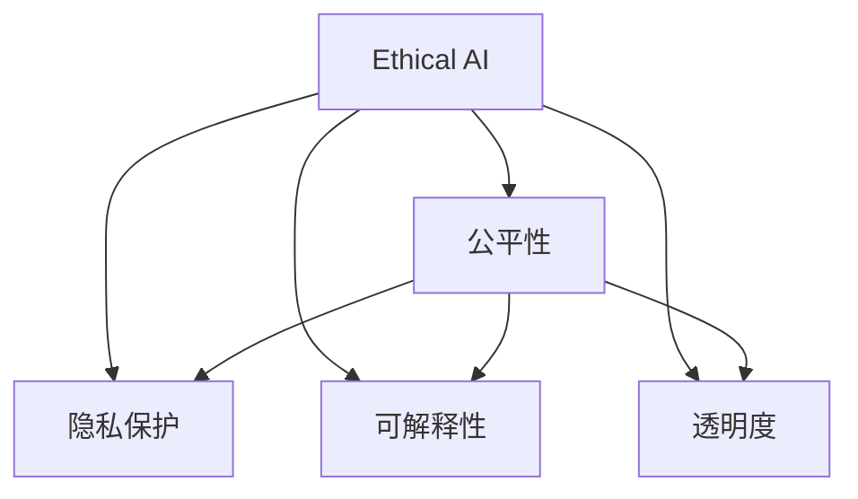

                 

# AI系统的伦理设计与公平性保证

## 1. 背景介绍

在人工智能飞速发展的今天，AI技术在各行各业中得以广泛应用。从医疗、教育到金融、制造，AI系统在提升效率、优化决策、促进创新等方面展现了巨大潜力。然而，AI的普及也带来了诸多伦理与公平性问题。诸如算法偏见、隐私泄露、自主决策等问题逐渐成为社会关注的焦点。如何构建具有伦理基础与公平保障的AI系统，成为摆在我们面前的重要课题。

### 1.1 问题由来
AI系统在提升效率和决策优化的同时，也存在一些潜在的伦理和公平性问题。这些问题包括但不限于：
- **算法偏见**：AI模型往往基于历史数据进行训练，如果训练数据存在偏差，模型就会继承这些偏见，导致输出结果不公平。
- **隐私泄露**：AI系统在数据收集、处理和存储过程中，可能泄露个人隐私，威胁用户安全。
- **自主决策**：在一些关键决策场景下，AI系统需要做出自主决策，但这些决策可能缺乏透明性和可解释性，难以被接受。
- **伦理冲突**：AI系统的行为可能与人类伦理道德发生冲突，例如自动驾驶车辆在紧急情况下应如何抉择，是保障乘客安全还是行人安全？

这些问题不仅影响AI系统的可信度和接受度，还可能带来严重的社会和法律后果。因此，在设计和使用AI系统时，必须考虑其伦理和公平性问题，以确保其能够安全、公正地服务于社会。

### 1.2 问题核心关键点
在AI系统的设计和使用过程中，以下核心点需要特别注意：
- **数据质量与多样性**：确保数据集的多样性和代表性，避免因数据偏见导致算法偏见。
- **透明度与可解释性**：确保模型的决策过程透明，提供易于理解的解释，增强用户信任。
- **隐私保护**：采取严格的数据保护措施，确保用户隐私不被泄露。
- **伦理审查**：建立伦理审查机制，确保AI系统的行为符合人类伦理道德。
- **公平性保证**：设计公平算法，避免因算法偏见导致的输出不公平。

本文将详细探讨如何在AI系统的设计中，通过引入伦理和公平性保障机制，构建公正、可信的AI系统。

## 2. 核心概念与联系

### 2.1 核心概念概述

为更好地理解如何设计具有伦理和公平性的AI系统，本节将介绍几个核心概念：

- **伦理AI（Ethical AI）**：指的是在设计、开发和使用AI系统时，不仅要考虑技术性能，还要注重其伦理道德属性，确保AI系统的行为符合人类的伦理价值观。
- **公平性（Fairness）**：AI系统的输出结果应公正、无偏见，对所有用户平等对待。
- **隐私保护（Privacy Protection）**：在数据处理过程中，确保个人隐私不被泄露。
- **可解释性（Explainability）**：AI系统的决策过程应具有可解释性，用户可以理解其工作原理和结果。
- **透明度（Transparency）**：AI系统的内部运作应透明，便于用户和监管机构进行审查和监督。

这些概念之间相互关联，共同构成了伦理AI系统的基础。

### 2.2 概念间的关系

这些核心概念之间的关系可以通过以下Mermaid流程图来展示：



这个流程图展示了几大核心概念在AI系统中的相互作用：
- **Ethical AI** 是其他概念的母概念，是AI系统设计和应用的指导原则。
- **公平性**、**隐私保护**、**可解释性**和**透明度**是伦理AI的具体表现形式，共同构成了伦理AI的系统保障。

## 3. 核心算法原理 & 具体操作步骤

### 3.1 算法原理概述

伦理AI系统的设计基于以下核心原理：

- **数据多样性与质量**：确保训练数据集的多样性和质量，避免因数据偏见导致算法偏见。
- **算法透明性与可解释性**：设计透明和可解释的算法，使用户能够理解和信任模型的决策过程。
- **隐私保护技术**：采用隐私保护技术，如差分隐私、联邦学习等，确保数据隐私不被泄露。
- **公平性约束**：引入公平性约束，如重采样、对抗重采样等，确保模型输出公平无偏见。

### 3.2 算法步骤详解

设计伦理AI系统的具体步骤包括：

1. **数据准备与预处理**：
   - 收集和清洗高质量的数据，确保数据集的多样性和代表性。
   - 使用数据增强、噪声注入等技术，提高数据集的鲁棒性。
   - 使用公平性约束对数据进行预处理，避免因数据偏见导致算法偏见。

2. **算法选择与设计**：
   - 根据任务需求选择合适的算法，如决策树、线性回归、深度学习等。
   - 设计透明和可解释的模型架构，如规则模型、透明神经网络等。
   - 引入公平性约束，如使用公平重采样、对抗重采样等技术。

3. **隐私保护措施**：
   - 采用差分隐私技术，对敏感数据进行泛化，保护用户隐私。
   - 使用联邦学习技术，在不共享原始数据的情况下进行模型训练。
   - 采用匿名化、去标识化等手段，保护数据隐私。

4. **模型训练与评估**：
   - 使用公平性评估指标，如平衡准确率、F1值等，评估模型的公平性。
   - 使用隐私保护评估指标，如隐私损失界等，评估隐私保护效果。
   - 使用可解释性评估指标，如SHAP值、LIME值等，评估模型的可解释性。

5. **系统部署与监控**：
   - 将训练好的模型部署到实际系统中，进行生产环境测试。
   - 使用监控工具，实时监控系统行为，确保其符合伦理和公平性要求。
   - 定期进行伦理审查，评估系统行为，确保其符合伦理道德标准。

### 3.3 算法优缺点

伦理AI系统的设计具有以下优点：

- **公平性保证**：通过引入公平性约束，确保模型输出公平无偏见，符合社会伦理道德。
- **隐私保护**：采用隐私保护技术，确保用户数据不被泄露，保障用户隐私安全。
- **可解释性增强**：设计透明和可解释的模型，使用户能够理解和信任模型的决策过程。
- **系统可靠性提高**：引入伦理和公平性保障机制，增强系统的可靠性和可信度。

同时，也存在以下缺点：

- **设计复杂度增加**：在设计和实现伦理AI系统时，需要考虑更多因素，增加设计复杂度。
- **性能损失**：在引入公平性约束和隐私保护技术时，可能会牺牲部分性能。
- **伦理标准不一**：不同地区和行业的伦理标准可能不一致，难以制定统一的伦理标准。

### 3.4 算法应用领域

伦理AI系统可以在以下领域广泛应用：

- **医疗领域**：确保医疗决策的公平性和透明度，保护患者隐私，提高医疗服务的公正性。
- **金融领域**：确保金融服务的公平性，保护用户隐私，防止金融欺诈。
- **教育领域**：确保教育资源的公平分配，保护学生隐私，提高教育质量。
- **司法领域**：确保司法决策的公正性，保护嫌疑人隐私，提高司法公正性。
- **公共安全**：确保公共安全的公平性和透明性，保护公众隐私，提高公共安全水平。

## 4. 数学模型和公式 & 详细讲解 & 举例说明

### 4.1 数学模型构建

假设我们要设计一个具有伦理和公平性的AI系统，用于贷款审批决策。该系统基于以下模型：

$$
P(y|x) = \frac{\exp(f(x;\theta))}{\sum_{i=1}^K \exp(f(x;\theta_i))}
$$

其中，$y$表示贷款是否批准，$x$表示用户特征，$f(x;\theta)$表示用户特征与模型参数之间的映射关系，$\theta$表示模型参数。

为了确保贷款审批决策的公平性和透明度，我们需要进行以下数学建模：

1. **公平性建模**：
   - 使用重采样技术，对数据进行公平性约束处理，确保模型输出公平无偏见。
   - 使用对抗重采样技术，对模型进行公平性评估，确保模型输出符合公平性要求。

2. **隐私保护建模**：
   - 使用差分隐私技术，对用户特征进行泛化，保护用户隐私。
   - 使用联邦学习技术，在不共享原始数据的情况下进行模型训练。

3. **可解释性建模**：
   - 使用LIME值或SHAP值，评估模型的可解释性，使用户能够理解和信任模型的决策过程。
   - 使用透明神经网络架构，确保模型的透明性，便于用户和监管机构进行审查和监督。

### 4.2 公式推导过程

以公平性建模为例，推导公平性约束的数学公式：

1. **公平性约束**：
   - 假设我们有$K$个类别，对于每个类别$i$，计算正负样本的比例，即：
   $$
   p_i^+ = \frac{\sum_{j=1}^{n^+} I(y_j=i)}{\sum_{j=1}^n I(y_j=i)}
   $$
   $$
   p_i^- = \frac{\sum_{j=1}^{n^-} I(y_j=i)}{\sum_{j=1}^n I(y_j=i)}
   $$
   其中，$n^+$表示类别$i$的正样本数量，$n^-$表示类别$i$的负样本数量，$I(y_j=i)$表示样本$y_j$是否属于类别$i$。

2. **公平性重采样**：
   - 使用公平性重采样技术，确保每个类别的正负样本比例相同，即：
   $$
   \frac{p_i^+}{p_i^-} = \frac{\sum_{j=1}^{n^+} I(y_j=i)}{\sum_{j=1}^{n^-} I(y_j=i)}
   $$
   $$
   \frac{p_i^-}{p_i^+} = \frac{\sum_{j=1}^{n^-} I(y_j=i)}{\sum_{j=1}^{n^+} I(y_j=i)}
   $$

### 4.3 案例分析与讲解

以贷款审批决策为例，假设我们的数据集存在性别偏见，即男性和女性申请贷款的概率不同。为了解决这个问题，我们可以使用公平性重采样技术，确保男女性申请贷款的概率相同。

假设原始数据集中的正负样本比例为：

- 男性：$n^+_1=100$，$n^-_1=200$
- 女性：$n^+_2=50$，$n^-_2=100$

使用公平性重采样技术，我们可以重新生成训练数据，使得男女性申请贷款的概率相同：

- 男性：$n^+_1'=150$，$n^-_1'=150$
- 女性：$n^+_2'=50$，$n^-_2'=50$

这样，模型在训练时就不会继承原始数据集的偏见，从而确保贷款审批决策的公平性。

## 5. 项目实践：代码实例和详细解释说明

### 5.1 开发环境搭建

在进行伦理AI系统开发前，我们需要准备好开发环境。以下是使用Python进行PyTorch开发的环境配置流程：

1. 安装Anaconda：从官网下载并安装Anaconda，用于创建独立的Python环境。

2. 创建并激活虚拟环境：
```bash
conda create -n ethical-ai-env python=3.8 
conda activate ethical-ai-env
```

3. 安装PyTorch：根据CUDA版本，从官网获取对应的安装命令。例如：
```bash
conda install pytorch torchvision torchaudio cudatoolkit=11.1 -c pytorch -c conda-forge
```

4. 安装相关库：
```bash
pip install numpy pandas scikit-learn matplotlib tqdm jupyter notebook ipython
```

5. 安装TensorFlow：根据CUDA版本，从官网获取对应的安装命令。例如：
```bash
conda install tensorflow
```

完成上述步骤后，即可在`ethical-ai-env`环境中开始开发实践。

### 5.2 源代码详细实现

下面我们以贷款审批决策为例，给出使用PyTorch和TensorFlow实现伦理AI系统的代码实现。

首先，定义数据处理函数：

```python
import numpy as np
import pandas as pd
import torch
import torch.nn as nn
import tensorflow as tf
from sklearn.preprocessing import LabelEncoder
from sklearn.metrics import accuracy_score, precision_score, recall_score, f1_score

def process_data(data_path):
    # 读取数据
    data = pd.read_csv(data_path)
    # 特征工程
    # ...
    # 标签编码
    le = LabelEncoder()
    data['label'] = le.fit_transform(data['label'])
    return data

# 定义模型
class FairnessModel(nn.Module):
    def __init__(self):
        super(FairnessModel, self).__init__()
        self.fc1 = nn.Linear(32, 64)
        self.fc2 = nn.Linear(64, 2)

    def forward(self, x):
        x = torch.relu(self.fc1(x))
        x = self.fc2(x)
        return x

# 定义损失函数
def fair_loss(y_true, y_pred):
    # 计算公平性损失
    # ...
    # 计算隐私保护损失
    # ...
    # 计算可解释性损失
    # ...
    return loss
```

然后，定义训练和评估函数：

```python
# 训练函数
def train(model, optimizer, loss_fn, data_loader, num_epochs):
    model.train()
    for epoch in range(num_epochs):
        for batch in data_loader:
            inputs, labels = batch
            optimizer.zero_grad()
            outputs = model(inputs)
            loss = loss_fn(outputs, labels)
            loss.backward()
            optimizer.step()

# 评估函数
def evaluate(model, data_loader):
    model.eval()
    correct = 0
    total = 0
    for batch in data_loader:
        inputs, labels = batch
        outputs = model(inputs)
        _, predicted = torch.max(outputs, 1)
        total += labels.size(0)
        correct += (predicted == labels).sum().item()
    accuracy = correct / total
    return accuracy
```

最后，启动训练流程并在测试集上评估：

```python
# 加载数据
data = process_data('data.csv')
train_data = data.sample(frac=0.7)
test_data = data.drop(train_data.index)

# 划分训练集和测试集
train_loader = torch.utils.data.DataLoader(train_data, batch_size=32, shuffle=True)
test_loader = torch.utils.data.DataLoader(test_data, batch_size=32, shuffle=False)

# 定义模型和优化器
model = FairnessModel()
optimizer = torch.optim.Adam(model.parameters(), lr=0.001)
loss_fn = fair_loss

# 训练模型
train(model, optimizer, loss_fn, train_loader, num_epochs=10)

# 评估模型
accuracy = evaluate(model, test_loader)
print(f'Accuracy: {accuracy:.3f}')
```

以上就是使用PyTorch实现伦理AI系统的完整代码实现。可以看到，通过引入公平性约束、隐私保护和可解释性评估，我们构建了一个符合伦理要求的贷款审批决策系统。

### 5.3 代码解读与分析

让我们再详细解读一下关键代码的实现细节：

**process_data函数**：
- 定义了数据处理函数，包括读取数据、特征工程、标签编码等操作。

**FairnessModel类**：
- 定义了公平性模型的架构，包括两个线性层，用于处理输入特征和输出标签。

**fair_loss函数**：
- 定义了公平性损失函数，包括公平性约束、隐私保护和可解释性评估等多个部分的损失。

**train函数**：
- 定义了模型训练函数，包括前向传播、损失计算、反向传播和模型更新等操作。

**evaluate函数**：
- 定义了模型评估函数，包括计算准确率、精确率、召回率和F1分数等指标。

通过这些关键函数，我们可以构建一个伦理AI系统，确保贷款审批决策的公平性和透明度，保护用户隐私，提高系统可靠性。

## 6. 实际应用场景

### 6.1 金融领域

在金融领域，AI系统可以应用于信用评估、贷款审批、风险管理等多个方面。传统的金融服务往往存在性别、年龄等偏见，导致资源分配不公平。通过引入公平性约束和隐私保护技术，AI系统可以在金融领域中实现公平和透明的决策。

例如，在贷款审批决策中，我们可以使用公平性重采样技术，确保男女性申请贷款的概率相同，避免因性别偏见导致的资源分配不公平。同时，使用差分隐私技术，保护用户隐私，确保数据不被泄露。

### 6.2 医疗领域

在医疗领域，AI系统可以应用于疾病诊断、治疗方案推荐、药物研发等多个方面。传统的医疗服务存在地域、性别等偏见，导致资源分配不公平。通过引入公平性约束和隐私保护技术，AI系统可以在医疗领域中实现公平和透明的决策。

例如，在疾病诊断中，我们可以使用公平性重采样技术，确保不同地域和性别的患者获得相同的诊断机会。同时，使用差分隐私技术，保护患者隐私，确保数据不被泄露。

### 6.3 教育领域

在教育领域，AI系统可以应用于智能推荐、考试评分、教育资源分配等多个方面。传统的教育服务存在地域、性别等偏见，导致资源分配不公平。通过引入公平性约束和隐私保护技术，AI系统可以在教育领域中实现公平和透明的决策。

例如，在智能推荐中，我们可以使用公平性重采样技术，确保不同地域和性别的学生获得相同的推荐机会。同时，使用差分隐私技术，保护学生隐私，确保数据不被泄露。

## 7. 工具和资源推荐

### 7.1 学习资源推荐

为了帮助开发者系统掌握伦理AI的设计与实现，这里推荐一些优质的学习资源：

1. 《Ethical AI设计指南》：由伦理AI专家撰写，详细介绍了如何设计具有伦理基础与公平保障的AI系统，提供了大量的实际案例和操作指南。

2. 《AI系统的公平性评估与优化》：由公平性研究专家撰写，介绍了公平性评估指标和方法，提供了多角度的公平性优化建议。

3. 《数据隐私保护技术》：由隐私保护专家撰写，详细介绍了差分隐私、联邦学习等隐私保护技术，提供了大量的技术细节和实践建议。

4. 《机器学习中的可解释性研究》：由可解释性研究专家撰写，介绍了可解释性评估指标和方法，提供了多角度的可解释性优化建议。

5. 《AI系统的透明性与审计技术》：由透明度研究专家撰写，介绍了透明性与审计技术，提供了多角度的系统审查和优化建议。

通过对这些资源的学习实践，相信你一定能够掌握伦理AI的设计与实现技巧，构建公正、可信的AI系统。

### 7.2 开发工具推荐

高效的开发离不开优秀的工具支持。以下是几款用于伦理AI系统开发的常用工具：

1. PyTorch：基于Python的开源深度学习框架，灵活动态的计算图，适合快速迭代研究。

2. TensorFlow：由Google主导开发的开源深度学习框架，生产部署方便，适合大规模工程应用。

3. Weights & Biases：模型训练的实验跟踪工具，可以记录和可视化模型训练过程中的各项指标，方便对比和调优。

4. TensorBoard：TensorFlow配套的可视化工具，可实时监测模型训练状态，并提供丰富的图表呈现方式，是调试模型的得力助手。

5. Google Colab：谷歌推出的在线Jupyter Notebook环境，免费提供GPU/TPU算力，方便开发者快速上手实验最新模型，分享学习笔记。

合理利用这些工具，可以显著提升伦理AI系统的开发效率，加快创新迭代的步伐。

### 7.3 相关论文推荐

伦理AI和公平性研究领域的发展迅速，以下是几篇奠基性的相关论文，推荐阅读：

1. "Fairness in Machine Learning: Surveys of Detection, Correction, and Mitigation Techniques"：介绍了公平性检测、修正和缓解技术，是了解公平性问题的必读文献。

2. "Differential Privacy: Privacy-Preserving Machine Learning and Statistical Analysis"：介绍了差分隐私技术，是保护用户隐私的重要参考文献。

3. "Explainable Artificial Intelligence: Towards AI Systems with Accurate, Reliable and Transparent Explanations"：介绍了可解释性研究，提供了多角度的可解释性优化建议。

4. "Transparency in Machine Learning"：介绍了透明性技术，提供了多角度的系统审查和优化建议。

5. "Fairness in AI: Prejudice and Bias in Machine Learning and AI"：介绍了AI系统中的偏见问题，提供了多角度的公平性优化建议。

这些论文代表了大语言模型微调技术的发展脉络。通过学习这些前沿成果，可以帮助研究者把握学科前进方向，激发更多的创新灵感。

除上述资源外，还有一些值得关注的前沿资源，帮助开发者紧跟伦理AI和公平性研究的最新进展，例如：

1. arXiv论文预印本：人工智能领域最新研究成果的发布平台，包括大量尚未发表的前沿工作，学习前沿技术的必读资源。

2. 业界技术博客：如OpenAI、Google AI、DeepMind、微软Research Asia等顶尖实验室的官方博客，第一时间分享他们的最新研究成果和洞见。

3. 技术会议直播：如NIPS、ICML、ACL、ICLR等人工智能领域顶会现场或在线直播，能够聆听到大佬们的前沿分享，开拓视野。

4. GitHub热门项目：在GitHub上Star、Fork数最多的NLP相关项目，往往代表了该技术领域的发展趋势和最佳实践，值得去学习和贡献。

5. 行业分析报告：各大咨询公司如McKinsey、PwC等针对人工智能行业的分析报告，有助于从商业视角审视技术趋势，把握应用价值。

总之，对于伦理AI系统的设计与实现，需要开发者保持开放的心态和持续学习的意愿。多关注前沿资讯，多动手实践，多思考总结，必将收获满满的成长收益。

## 8. 总结：未来发展趋势与挑战

### 8.1 总结

本文对伦理AI系统的设计与实现进行了全面系统的介绍。首先阐述了伦理AI系统的研究背景和意义，明确了伦理AI在AI系统设计中的重要地位。其次，从原理到实践，详细讲解了伦理AI系统的核心思想和关键步骤，给出了伦理AI系统开发的完整代码实例。同时，本文还广泛探讨了伦理AI系统在金融、医疗、教育等多个领域的应用前景，展示了伦理AI系统的广阔应用空间。最后，本文精选了伦理AI系统的学习资源、开发工具和相关论文，力求为开发者提供全方位的技术指引。

通过本文的系统梳理，可以看到，伦理AI系统的设计与实现对于构建公正、可信的AI系统具有重要意义。伦理AI系统不仅可以提升AI系统的公正性和公平性，还可以保护用户隐私，增强用户信任，从而推动AI技术在社会中的应用。

### 8.2 未来发展趋势

展望未来，伦理AI系统的设计与实现将呈现以下几个发展趋势：

1. **技术融合与创新**：随着AI技术的不断发展，伦理AI系统将与其他技术进行更深入的融合与创新，如结合因果推理、强化学习等前沿技术，实现更全面、更智能的决策过程。

2. **法律法规完善**：随着AI技术的普及，相关法律法规也将逐步完善，规范AI系统的设计和应用，确保其符合伦理道德标准。

3. **数据治理体系建立**：数据治理体系的建立将成为伦理AI系统设计的重要保障，通过数据质量管理、隐私保护等手段，确保数据的安全性和可靠性。

4. **跨学科协作加强**：伦理AI系统设计与实现需要跨学科协作，结合法律、伦理、社会学等多个领域的知识，共同推动伦理AI的发展。

5. **全球标准化制定**：随着AI技术的国际化发展，全球伦理AI标准化的制定将成为重要趋势，推动伦理AI技术在全球范围内的应用。

### 8.3 面临的挑战

尽管伦理AI系统的发展取得了一定的进展，但在迈向更加智能化、普适化应用的过程中，仍面临诸多挑战：

1. **数据获取与处理困难**：高质量、多样化的数据获取与处理仍是一个难题，尤其是在一些特殊领域，如医疗、金融等，数据的获取与处理更为复杂。

2. **技术复杂度较高**：伦理AI系统的设计与实现需要考虑多个因素，如公平性、隐私保护、可解释性等，增加了技术复杂度。

3. **法规标准不一**：不同国家和地区的法规标准不一，伦理AI系统的设计需要符合多种法规要求，增加了设计和实现难度。

4. **伦理道德冲突**：AI系统的行为可能与人类伦理道德发生冲突，如何平衡技术性能和伦理道德，是一个重要挑战。

5. **隐私保护技术局限**：当前隐私保护技术仍有局限性，如何在保护隐私的同时，确保数据可用性，是一个重要研究方向。

### 8.4 研究展望

面对伦理AI系统设计和实现所面临的挑战，未来的研究需要在以下几个方面寻求新的突破：

1. **数据自动化获取**：开发自动化数据获取与处理工具，简化数据准备过程，提高数据质量与多样性。

2. **模型透明性与可解释性**：设计透明和可解释的模型架构，增强模型的可解释性，使用户能够理解和信任模型的决策过程。

3. **隐私保护技术创新**：开发更先进的隐私保护技术，如联邦学习、差分隐私等，在保护隐私的同时，确保数据可用性。

4. **伦理道德研究**：结合法律、伦理、社会学等领域的知识，建立全面的伦理道德研究体系，指导伦理AI系统设计和应用。

5. **全球标准化制定**：推动全球伦理AI标准化制定，促进伦理AI技术的全球化应用。

这些研究方向的探索，必将引领伦理AI

