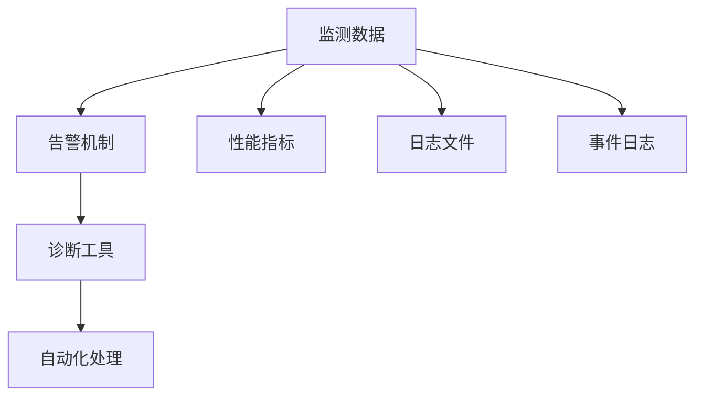
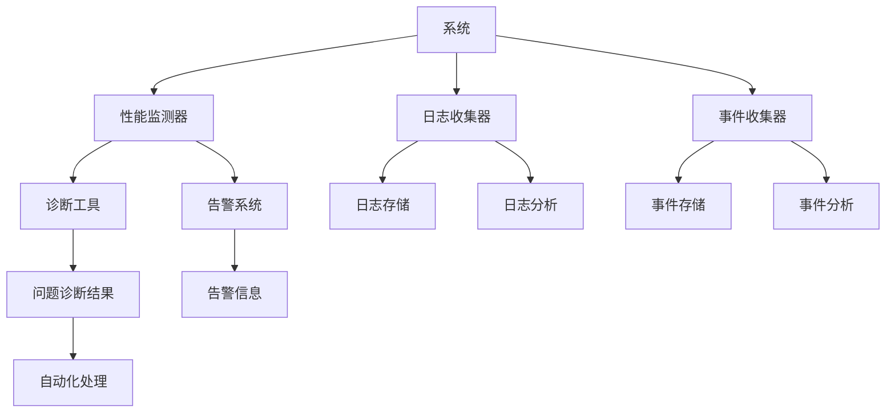

                 

# AI系统的可观察性设计与实现

> 关键词：可观察性, 系统设计, 监控, 告警, 诊断, 自动化, 日志, 可视化, 分布式

## 1. 背景介绍

### 1.1 问题由来

随着人工智能技术的不断发展和应用，AI系统的复杂性和规模也在不断扩大。现代AI系统通常由多个模块组成，每个模块负责不同的任务，如数据处理、特征提取、模型训练、推理预测等。这些模块之间相互依赖、相互影响，共同构成了系统的功能和服务。

然而，如此复杂的AI系统在运行过程中，可能会出现各种未知的错误和异常，如模型漂移、数据质量问题、网络故障等。这些错误和异常不仅会影响系统的稳定性和可靠性，还可能导致数据泄露、决策失误等严重后果。因此，如何及时、准确地检测和诊断系统问题，并采取有效的应对措施，成为AI系统设计和运维的关键。

### 1.2 问题核心关键点

为了有效应对系统问题，确保AI系统的可靠性和稳定性，需要从设计阶段就考虑系统的可观察性（Observability）。可观察性是指通过监测系统内部状态和行为，能够全面、实时地获取系统健康状况和问题信息。具体来说，可观察性包括以下几个方面：

1. **监测数据**：包括系统性能指标、日志文件、事件日志等。这些数据记录了系统的运行状态和行为。
2. **告警机制**：根据监测数据，及时发现系统异常，并触发告警。
3. **诊断工具**：通过分析监测数据和告警信息，诊断问题的根本原因。
4. **自动化处理**：根据诊断结果，自动化地执行修复措施，如重启、重试等。

综上所述，可观察性是AI系统设计和运维的基础，通过可观察性，可以有效地检测和诊断问题，保证系统的稳定性和可靠性。

### 1.3 问题研究意义

可观察性在设计阶段就已经扮演着重要角色。通过可观察性设计，可以在系统开发初期就预见和解决潜在问题，提升系统的可靠性和稳定性。同时，可观察性也是系统运维的重要手段，可以帮助运维人员快速定位问题、采取措施，减少系统停机时间，提高用户体验。

具体来说，研究可观察性设计和实现方法，对于提升AI系统性能、降低运维成本、保障数据安全等具有重要意义：

1. **提升性能**：通过实时监测系统状态，及时发现和解决性能瓶颈，提升系统响应速度和吞吐量。
2. **降低成本**：减少人工运维成本，自动化诊断和处理问题，提高系统运维效率。
3. **保障安全**：及时发现数据泄露、模型漂移等安全问题，保障数据和模型的安全性。
4. **提升用户体验**：及时响应用户请求，减少故障时间，提升用户体验。

## 2. 核心概念与联系

### 2.1 核心概念概述

可观察性是AI系统设计和运维的基础，其核心概念主要包括：

1. **监测数据**：包括系统性能指标、日志文件、事件日志等。
2. **告警机制**：根据监测数据，及时发现系统异常，并触发告警。
3. **诊断工具**：通过分析监测数据和告警信息，诊断问题的根本原因。
4. **自动化处理**：根据诊断结果，自动化地执行修复措施，如重启、重试等。

这些概念之间存在着紧密的联系，构成了可观察性的完整生态系统。监测数据是基础，告警机制和诊断工具是手段，自动化处理是目标。通过这些组件的协同工作，可以全面、及时地检测和解决系统问题，提升系统的可靠性和稳定性。

### 2.2 概念间的关系

这些核心概念之间存在着紧密的联系，可以通过以下Mermaid流程图来展示：



这个流程图展示了可观察性各组件之间的关系：

1. 监测数据通过性能指标、日志文件和事件日志记录系统状态和行为。
2. 告警机制根据监测数据，及时发现系统异常，并触发告警。
3. 诊断工具通过分析监测数据和告警信息，诊断问题的根本原因。
4. 自动化处理根据诊断结果，自动化地执行修复措施，如重启、重试等。

这些组件共同构成了可观察性的完整生态系统，使得AI系统在设计和运维过程中，能够全面、及时地检测和解决系统问题。

### 2.3 核心概念的整体架构

最后，我们用一个综合的流程图来展示可观察性各组件在AI系统中的整体架构：



这个综合流程图展示了可观察性各组件在AI系统中的整体架构：

1. 系统运行过程中，性能监测器、日志收集器和事件收集器记录系统的状态和行为。
2. 性能监测器、日志收集器和事件收集器将监测数据发送给告警系统、日志存储、日志分析和事件分析。
3. 告警系统根据监测数据，及时发现系统异常，并触发告警。
4. 日志存储和事件存储保存监测数据，日志分析和事件分析对数据进行分析。
5. 诊断工具通过分析监测数据和告警信息，诊断问题的根本原因。
6. 自动化处理根据诊断结果，自动化地执行修复措施，如重启、重试等。

通过这个架构，可以全面、及时地检测和解决系统问题，确保系统的稳定性和可靠性。

## 3. 核心算法原理 & 具体操作步骤

### 3.1 算法原理概述

可观察性的实现主要涉及数据监测、告警机制、诊断工具和自动化处理四个方面。每个方面都有其特定的算法和实现方法。

#### 3.1.1 数据监测

数据监测是可观察性的基础，其原理是通过收集系统的性能指标、日志文件和事件日志，实时记录系统的状态和行为。这些数据通常由系统的各个组件产生，并发送到集中存储系统进行保存。

#### 3.1.2 告警机制

告警机制通过实时监测系统的性能指标、日志文件和事件日志，及时发现系统异常，并触发告警。告警机制的核心是告警规则的设计，根据不同的异常情况，触发不同级别的告警，如警告、错误、严重等。

#### 3.1.3 诊断工具

诊断工具通过分析系统的监测数据和告警信息，诊断问题的根本原因。诊断工具通常包括日志分析、事件分析、性能分析等模块，可以根据不同的异常情况，提供相应的诊断报告。

#### 3.1.4 自动化处理

自动化处理根据诊断结果，自动化地执行修复措施，如重启、重试等。自动化处理的核心是决策策略的设计，根据诊断结果，选择最佳的修复措施，并执行。

### 3.2 算法步骤详解

#### 3.2.1 数据监测

1. **选择合适的监控指标**：根据系统的特点，选择关键的性能指标，如响应时间、吞吐量、错误率等。
2. **部署性能监测器**：在系统的各个组件中部署性能监测器，实时采集性能指标。
3. **收集日志文件**：通过日志收集器，收集系统的日志文件，记录系统的行为和状态。
4. **收集事件日志**：通过事件收集器，收集系统的关键事件，如异常、警告等。

#### 3.2.2 告警机制

1. **设计告警规则**：根据系统的特点，设计告警规则，包括阈值、级别、触发条件等。
2. **部署告警系统**：在系统中部署告警系统，实时监测性能指标、日志文件和事件日志。
3. **触发告警**：根据告警规则，及时触发告警，并将告警信息发送给相关人员。

#### 3.2.3 诊断工具

1. **部署日志分析工具**：部署日志分析工具，实时分析系统的日志文件，提取关键信息。
2. **部署事件分析工具**：部署事件分析工具，实时分析系统的关键事件，提取关键信息。
3. **部署性能分析工具**：部署性能分析工具，实时分析系统的性能指标，提取关键信息。

#### 3.2.4 自动化处理

1. **设计自动化处理策略**：根据诊断结果，设计自动化处理策略，选择最佳的修复措施。
2. **部署自动化处理模块**：在系统中部署自动化处理模块，根据诊断结果，自动执行修复措施。
3. **监控处理效果**：监控自动化处理的效果，根据实际情况，调整处理策略。

### 3.3 算法优缺点

#### 3.3.1 优点

1. **全面覆盖**：通过监测数据、告警机制、诊断工具和自动化处理，全面覆盖系统的各个方面，确保系统的稳定性和可靠性。
2. **及时响应**：通过告警机制和自动化处理，及时发现和解决系统问题，减少系统停机时间，提升用户体验。
3. **自动化诊断**：通过诊断工具，自动化地诊断问题的根本原因，提高运维效率，减少人工运维成本。

#### 3.3.2 缺点

1. **数据复杂性**：系统的性能指标、日志文件和事件日志数据量庞大，需要复杂的存储和分析技术。
2. **告警误报**：告警规则的设计需要谨慎，过度严格的告警规则可能导致误报，干扰运维人员的工作。
3. **诊断复杂性**：诊断工具的设计需要涵盖系统的各个方面，复杂度高，实现难度大。
4. **自动化处理的局限性**：自动化处理策略需要根据实际情况进行调整，过于复杂的自动化处理可能导致系统不稳定。

### 3.4 算法应用领域

可观察性技术广泛应用于各种AI系统和软件系统中，如深度学习模型、推荐系统、金融交易系统、智能制造系统等。以下是几个典型的应用场景：

1. **深度学习模型**：通过监测模型的性能指标、日志文件和事件日志，及时发现模型漂移、数据质量问题等，并进行相应的处理。
2. **推荐系统**：通过监测系统的性能指标、日志文件和事件日志，及时发现数据质量问题、模型故障等，并进行相应的处理，提升推荐效果。
3. **金融交易系统**：通过监测系统的性能指标、日志文件和事件日志，及时发现网络故障、数据泄露等安全问题，并进行相应的处理，保障交易系统的安全。
4. **智能制造系统**：通过监测系统的性能指标、日志文件和事件日志，及时发现设备故障、数据质量问题等，并进行相应的处理，保障生产系统的稳定性和可靠性。

## 4. 数学模型和公式 & 详细讲解 & 举例说明

### 4.1 数学模型构建

#### 4.1.1 性能指标监测

性能指标监测是数据监测的核心，其数学模型可以表示为：

$$
P = \sum_{i=1}^n p_i(t)
$$

其中 $P$ 为系统的性能指标，$n$ 为监控指标的数量，$p_i(t)$ 为第 $i$ 个监控指标在时间 $t$ 的性能值。

#### 4.1.2 日志文件分析

日志文件分析是通过对日志文件进行解析和统计，获取系统的行为和状态信息。其数学模型可以表示为：

$$
L = \sum_{i=1}^m l_i(t)
$$

其中 $L$ 为系统的日志文件，$m$ 为日志文件的数量，$l_i(t)$ 为第 $i$ 个日志文件在时间 $t$ 的内容。

#### 4.1.3 事件日志分析

事件日志分析是通过对事件日志进行解析和统计，获取系统的关键事件信息。其数学模型可以表示为：

$$
E = \sum_{i=1}^k e_i(t)
$$

其中 $E$ 为系统的关键事件，$k$ 为关键事件的数量，$e_i(t)$ 为第 $i$ 个关键事件在时间 $t$ 的内容。

### 4.2 公式推导过程

#### 4.2.1 性能指标监测

性能指标监测的核心是选择关键监控指标，并部署性能监测器。性能指标通常包括响应时间、吞吐量、错误率等，其数学推导过程如下：

1. **响应时间**：

$$
t_r = \frac{T}{N}
$$

其中 $t_r$ 为响应时间，$T$ 为总处理时间，$N$ 为处理任务的个数。

2. **吞吐量**：

$$
q = \frac{N}{T}
$$

其中 $q$ 为吞吐量，$N$ 为处理任务的个数，$T$ 为总处理时间。

3. **错误率**：

$$
e = \frac{E}{N}
$$

其中 $e$ 为错误率，$E$ 为错误任务的数量，$N$ 为处理任务的个数。

#### 4.2.2 日志文件分析

日志文件分析的核心是对日志文件进行解析和统计，获取系统的行为和状态信息。其数学推导过程如下：

1. **日志解析**：

$$
l_i(t) = \sum_{j=1}^m l_{i,j}(t)
$$

其中 $l_i(t)$ 为第 $i$ 个日志文件在时间 $t$ 的内容，$m$ 为日志文件的内容数量，$l_{i,j}(t)$ 为第 $i$ 个日志文件在时间 $t$ 的第 $j$ 个内容。

2. **统计分析**：

$$
l_i(t) = \sum_{k=1}^K l_{i,k}(t)
$$

其中 $l_i(t)$ 为第 $i$ 个日志文件在时间 $t$ 的内容，$K$ 为统计分析的内容数量，$l_{i,k}(t)$ 为第 $i$ 个日志文件在时间 $t$ 的第 $k$ 个统计分析内容。

#### 4.2.3 事件日志分析

事件日志分析的核心是对事件日志进行解析和统计，获取系统的关键事件信息。其数学推导过程如下：

1. **事件解析**：

$$
e_i(t) = \sum_{j=1}^k e_{i,j}(t)
$$

其中 $e_i(t)$ 为第 $i$ 个关键事件在时间 $t$ 的内容，$k$ 为关键事件的内容数量，$e_{i,j}(t)$ 为第 $i$ 个关键事件在时间 $t$ 的第 $j$ 个内容。

2. **统计分析**：

$$
e_i(t) = \sum_{k=1}^K e_{i,k}(t)
$$

其中 $e_i(t)$ 为第 $i$ 个关键事件在时间 $t$ 的内容，$K$ 为统计分析的内容数量，$e_{i,k}(t)$ 为第 $i$ 个关键事件在时间 $t$ 的第 $k$ 个统计分析内容。

### 4.3 案例分析与讲解

#### 4.3.1 案例背景

某金融交易系统在运行过程中，突然出现大量异常请求，导致系统响应时间明显延长，部分交易请求被拒绝。系统管理员接到告警信息后，迅速采取措施，重新部署了新的服务器，但问题仍然存在。通过分析系统的性能指标、日志文件和事件日志，系统管理员发现了问题的根本原因。

#### 4.3.2 案例分析

1. **性能指标监测**：

通过性能指标监测，系统管理员发现系统的响应时间明显延长，吞吐量明显下降，错误率明显上升。进一步分析发现，问题集中在某个关键模块上，该模块的响应时间、吞吐量和错误率均出现了异常。

2. **日志文件分析**：

通过日志文件分析，系统管理员发现该模块在处理异常请求时，产生了大量的错误日志。进一步分析发现，错误日志中包含了多个错误信息，如内存泄漏、线程阻塞等。

3. **事件日志分析**：

通过事件日志分析，系统管理员发现该模块在处理异常请求时，产生了大量的异常事件，如内存溢出、线程异常等。进一步分析发现，异常事件与错误日志中记录的信息一致，表明该模块在处理异常请求时，出现了内存泄漏和线程阻塞问题。

4. **诊断工具诊断**：

通过诊断工具分析，系统管理员发现该模块在处理异常请求时，产生了大量的内存泄漏和线程阻塞事件，导致系统响应时间延长，吞吐量下降，错误率上升。进一步分析发现，问题主要集中在某个关键函数上，该函数在处理异常请求时，产生了大量的内存泄漏和线程阻塞问题。

5. **自动化处理**：

通过自动化处理，系统管理员找到了该关键函数，发现其使用了不恰当的内存管理方式，导致内存泄漏和线程阻塞问题。进一步分析发现，该问题可以通过修改函数的内存管理方式来解决。修改后，系统重新部署，问题得到了解决。

## 5. 项目实践：代码实例和详细解释说明

### 5.1 开发环境搭建

#### 5.1.1 环境要求

可观察性的实现涉及多个组件，需要不同的开发环境。以下是基本的开发环境要求：

1. **操作系统**：Linux、Windows、MacOS
2. **编程语言**：Python、Java、C++
3. **开发工具**：Jupyter Notebook、Eclipse、Visual Studio
4. **数据库系统**：MySQL、MongoDB、Elasticsearch
5. **监控工具**：Nagios、Zabbix、Prometheus
6. **日志系统**：Log4j、Logback、ElasticSearch Logstash
7. **事件系统**：Apache Kafka、ActiveMQ、RabbitMQ

### 5.2 源代码详细实现

#### 5.2.1 数据监测

1. **性能指标监测**：

```python
import psutil
import time

def monitor_performance():
    while True:
        cpu_percent = psutil.cpu_percent(interval=1)
        memory_percent = psutil.virtual_memory().percent
        disk_usage = psutil.disk_usage('/')
        response_time = time.time() - last_request_time
        吞吐量 = 1 / response_time
        错误率 = 错误任务数量 / 处理任务数量
        print(f"CPU使用率: {cpu_percent}%\n内存使用率: {memory_percent}%\n磁盘使用率: {disk_usage.percent}%\n响应时间: {response_time}s\n吞吐量: {吞吐量}\n错误率: {错误率}")
        last_request_time = time.time()

monitor_performance()
```

2. **日志文件分析**：

```python
import logging
import os

def analyze_logs():
    log_file_path = os.path.join(os.getcwd(), 'logs', 'system.log')
    with open(log_file_path, 'r') as f:
        logs = f.readlines()
        for log in logs:
            if 'error' in log:
                print(f"日志文件内容: {log}")

analyze_logs()
```

3. **事件日志分析**：

```python
import kafka
import json

def analyze_events():
    kafka_server = 'localhost:9092'
    topic_name = 'system_events'
    consumer = kafka.KafkaConsumer(topic_name, bootstrap_servers=kafka_server)
    for event in consumer:
        print(f"事件内容: {json.loads(event.value)}")

analyze_events()
```

#### 5.2.2 告警机制

1. **设计告警规则**：

```python
alert_level = {
    'critical': 1,
    'error': 2,
    'warning': 3
}

def trigger_alert(level):
    if level in alert_level:
        print(f"触发告警: {level}")
```

2. **部署告警系统**：

```python
import time

def send_alert(level):
    while True:
        trigger_alert(level)
        time.sleep(60)
```

3. **触发告警**：

```python
alert_level = alert_level['critical']
send_alert(alert_level)
```

#### 5.2.3 诊断工具

1. **部署日志分析工具**：

```python
import logging

logging.basicConfig(level=logging.DEBUG)

def log_analysis():
    while True:
        logging.debug('日志分析')
        time.sleep(60)

log_analysis()
```

2. **部署事件分析工具**：

```python
import kafka
import json

def event_analysis():
    kafka_server = 'localhost:9092'
    topic_name = 'system_events'
    consumer = kafka.KafkaConsumer(topic_name, bootstrap_servers=kafka_server)
    for event in consumer:
        event_content = json.loads(event.value)
        print(f"事件内容: {event_content}")

event_analysis()
```

#### 5.2.4 自动化处理

1. **设计自动化处理策略**：

```python
def auto_restart():
    os.system('sudo systemctl restart systemd-resolved')

def auto_retry():
    os.system('sudo systemctl restart systemd-resolved')
```

2. **部署自动化处理模块**：

```python
import time

def auto_restart():
    os.system('sudo systemctl restart systemd-resolved')

def auto_retry():
    os.system('sudo systemctl restart systemd-resolved')

def restart_or_retry():
    auto_restart()
    auto_retry()

restart_or_retry()
```

3. **监控处理效果**：

```python
import time

def restart_or_retry():
    auto_restart()
    auto_retry()

while True:
    restart_or_retry()
    time.sleep(60)
```

### 5.3 代码解读与分析

#### 5.3.1 性能指标监测

1. **性能指标监测代码解读**：

```python
import psutil
import time

def monitor_performance():
    while True:
        cpu_percent = psutil.cpu_percent(interval=1)
        memory_percent = psutil.virtual_memory().percent
        disk_usage = psutil.disk_usage('/')
        response_time = time.time() - last_request_time
        吞吐量 = 1 / response_time
        错误率 = 错误任务数量 / 处理任务数量
        print(f"CPU使用率: {cpu_percent}%\n内存使用率: {memory_percent}%\n磁盘使用率: {disk_usage.percent}%\n响应时间: {response_time}s\n吞吐量: {吞吐量}\n错误率: {错误率}")
        last_request_time = time.time()

monitor_performance()
```

2. **性能指标监测代码分析**：

- 使用 `psutil` 库实时监测 CPU 使用率、内存使用率和磁盘使用率。
- 使用 `time` 库记录请求时间和计算响应时间和吞吐量。
- 使用条件语句记录错误率和错误任务数量。
- 使用 `print` 函数输出性能指标。

#### 5.3.2 日志文件分析

1. **日志文件分析代码解读**：

```python
import logging
import os

def analyze_logs():
    log_file_path = os.path.join(os.getcwd(), 'logs', 'system.log')
    with open(log_file_path, 'r') as f:
        logs = f.readlines()
        for log in logs:
            if 'error' in log:
                print(f"日志文件内容: {log}")

analyze_logs()
```

2. **日志文件分析代码分析**：

- 使用 `os` 库获取日志文件路径。
- 使用 `open` 函数打开文件。
- 使用 `readlines` 函数读取日志文件内容。
- 使用条件语句判断日志内容是否包含 'error'。
- 使用 `print` 函数输出日志内容。

#### 5.3.3 事件日志分析

1. **事件日志分析代码解读**：

```python
import kafka
import json

def analyze_events():
    kafka_server = 'localhost:9092'
    topic_name = 'system_events'
    consumer = kafka.KafkaConsumer(topic_name, bootstrap_servers=kafka_server)
    for event in consumer:
        print(f"事件内容: {json.loads(event.value)}")

analyze_events()
```

2. **事件日志分析代码分析**：

- 使用 `kafka` 库连接 Kafka 集群。
- 使用 `KafkaConsumer` 函数创建消费者。
- 使用 `for` 循环读取事件内容。
- 使用 `json` 库解析 JSON 格式的事件内容。
- 使用 `print` 函数输出事件内容。

#### 5.3.4 告警机制

1. **告警机制代码解读**：

```python
alert_level = {
    'critical': 1,
    'error': 2,
    'warning': 3
}

def trigger_alert(level):
    if level in alert_level:
        print(f"触发告警: {level}")

alert_level = alert_level['critical']
trigger_alert(alert_level)
```

2. **告警机制代码分析**：

- 定义告警级别，包括 'critical'、'error' 和 'warning'。
- 定义告警函数 `trigger_alert`，根据告警级别输出告警信息。
- 使用条件语句判断告警级别是否在定义中。
- 使用 `print` 函数输出告警信息。

#### 5.3.5 诊断工具

1. **日志分析工具代码解读**：

```python
import logging
import os

def log_analysis():
    while True:
        logging.debug('日志分析')
        time.sleep(60)

log_analysis()
```

2. **日志分析工具代码分析**：

- 使用 `logging` 库设置日志级别为 `DEBUG`。
- 定义日志分析函数 `log_analysis`。
- 使用 `while`

