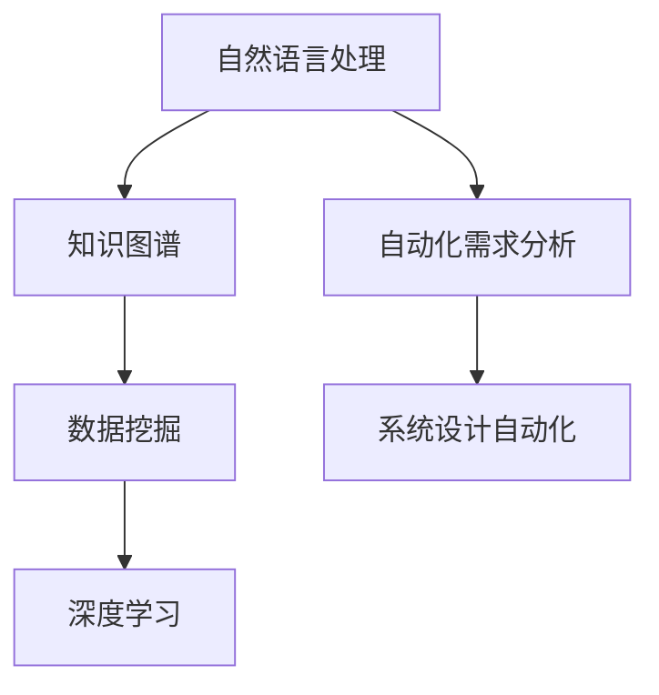
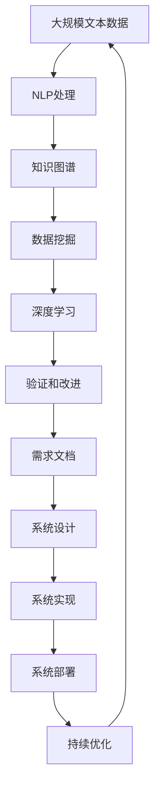

                 

# AI辅助的需求分析与系统设计

> 关键词：需求分析,系统设计,人工智能,自然语言处理,NLP,知识图谱,数据挖掘,深度学习,人工智能自动化

## 1. 背景介绍

### 1.1 问题由来
在软件开发和信息技术项目中，需求分析和系统设计是至关重要的环节，决定了项目的成败和效率。传统的需求分析依赖于专业人士的经验和直觉，常常因为信息获取不足、误解或遗漏而导致需求变更频繁、沟通效率低下、开发周期延长等问题。人工智能（AI）技术的兴起，尤其是自然语言处理（NLP）和知识图谱（KG）的发展，为需求分析和系统设计提供了新的解决思路。

### 1.2 问题核心关键点
AI辅助的需求分析与系统设计旨在通过AI技术自动化地处理需求文档、代码和系统设计文档，提高需求分析的准确性和系统设计的效率，减少人为错误和沟通成本。核心技术包括自然语言处理（NLP）、知识图谱（KG）和数据挖掘。

### 1.3 问题研究意义
AI辅助的需求分析和系统设计能够显著提高软件开发和信息系统的质量与效率。它有助于：
1. 减少需求分析中的误解和遗漏，确保需求准确无误。
2. 加速系统设计过程，缩短项目开发周期。
3. 增强系统可扩展性和维护性，提升软件系统的整体质量。
4. 降低沟通成本，提高团队协作效率。
5. 支持自动化测试，提高软件交付速度。

## 2. 核心概念与联系

### 2.1 核心概念概述

为更好地理解AI辅助的需求分析和系统设计，本节将介绍几个密切相关的核心概念：

- 自然语言处理（NLP）：使用计算机处理和理解自然语言的技术，包括文本分析、语言模型、情感分析等。
- 知识图谱（KG）：一种结构化的知识表示方式，用于描述实体之间的关系和属性。
- 数据挖掘（DM）：从大量数据中自动发现有用信息和知识的技术。
- 深度学习（DL）：一种基于神经网络的机器学习技术，能够自动从数据中学习特征表示。
- 自动化需求分析（Ara）：通过AI技术自动化地理解、处理和验证需求文档。
- 系统设计自动化（AutoDesign）：利用AI技术自动化地设计系统架构和组件。

这些核心概念之间的逻辑关系可以通过以下Mermaid流程图来展示：



这个流程图展示了一些核心概念的相互关系：

1. NLP技术用于理解和处理需求文档，生成知识图谱。
2. KG用于描述实体和关系，为数据挖掘和深度学习提供结构化的知识基础。
3. DM和DL用于自动发现和抽取知识，支持Ara和AutoDesign。
4. Ara和AutoDesign分别自动化需求分析和系统设计，帮助项目团队快速高效地推进项目。

### 2.2 概念间的关系

这些核心概念之间存在着紧密的联系，形成了AI辅助需求分析和系统设计的完整生态系统。下面我们通过几个Mermaid流程图来展示这些概念之间的关系。

#### 2.2.1 需求分析与系统设计的流程


这个流程图展示了从需求文档到知识图谱的自动处理流程：

1. 需求文档被自然语言处理（NLP）模块自动理解。
2. 处理后的信息被转换为知识图谱（KG）。
3. 数据挖掘（DM）模块从知识图谱中自动发现和抽取有用信息。
4. 深度学习（DL）模块自动学习知识图谱中的模式和关系。
5. 验证和改进模块确保自动处理结果的准确性，并进一步优化。
6. 优化后的知识图谱被用于生成和改进需求文档。

#### 2.2.2 系统设计自动化的流程


这个流程图展示了系统设计自动化的流程：

1. 系统架构被自然语言处理（NLP）模块自动理解。
2. 处理后的信息被转换为知识图谱（KG）。
3. 数据挖掘（DM）模块从知识图谱中自动发现和抽取有用信息。
4. 深度学习（DL）模块自动学习知识图谱中的模式和关系。
5. 生成设计方案模块自动生成系统设计方案。
6. 设计方案被用于生成和改进系统架构。

### 2.3 核心概念的整体架构

最后，我们用一个综合的流程图来展示这些核心概念在大语言模型微调过程中的整体架构：



这个综合流程图展示了从数据处理到需求文档、系统设计和系统实现的完整流程：

1. 大规模文本数据被自然语言处理（NLP）模块自动理解。
2. 处理后的信息被转换为知识图谱（KG）。
3. 数据挖掘（DM）模块从知识图谱中自动发现和抽取有用信息。
4. 深度学习（DL）模块自动学习知识图谱中的模式和关系。
5. 验证和改进模块确保自动处理结果的准确性，并进一步优化。
6. 优化后的知识图谱被用于生成和改进需求文档。
7. 系统设计自动化模块自动生成系统设计方案。
8. 设计方案被用于生成和改进系统架构。
9. 系统实现模块将设计方案转化为代码和组件。
10. 系统部署模块将系统上线并运行。
11. 持续优化模块不断监控系统性能，进行改进。

通过这些流程图，我们可以更清晰地理解AI辅助需求分析和系统设计的整体架构，为后续深入讨论具体的技术细节奠定基础。

## 3. 核心算法原理 & 具体操作步骤
### 3.1 算法原理概述

AI辅助的需求分析和系统设计基于深度学习和自然语言处理技术，其核心算法包括文本处理、知识图谱构建、数据挖掘和系统设计自动化。

1. **文本处理**：使用NLP技术对需求文档和设计文档进行语义分析、实体识别、关系抽取等。
2. **知识图谱构建**：将处理后的文本信息构建为结构化的知识图谱，用于存储和推理。
3. **数据挖掘**：从知识图谱中自动发现和抽取有用信息，如实体关系、属性值等。
4. **系统设计自动化**：基于知识图谱和数据挖掘结果，自动生成系统设计方案，如组件关系图、架构图等。

### 3.2 算法步骤详解

AI辅助的需求分析和系统设计的算法步骤主要包括以下几个方面：

**Step 1: 数据准备**
- 收集需求文档和设计文档，清洗和预处理文本数据。
- 将需求文档转换为结构化格式，如JSON或XML，便于后续处理。

**Step 2: 文本处理**
- 使用NLP工具进行分词、词性标注、命名实体识别、关系抽取等。
- 将处理结果转换为知识图谱格式，如RDF或Turtle。

**Step 3: 知识图谱构建**
- 将文本处理结果存储为知识图谱。
- 使用知识图谱工具进行图谱可视化、查询和推理。

**Step 4: 数据挖掘**
- 从知识图谱中抽取实体关系和属性值。
- 使用数据挖掘算法识别重要的实体和关系。

**Step 5: 系统设计自动化**
- 基于知识图谱和数据挖掘结果，生成系统设计方案。
- 将设计方案转换为可视化图形或代码。

**Step 6: 验证和改进**
- 使用自动化测试工具验证系统设计方案的正确性。
- 根据测试结果进行方案改进和优化。

### 3.3 算法优缺点

**优点**：
1. **自动化程度高**：能够自动化处理大量需求文档和设计文档，减少人工工作量。
2. **处理速度快**：AI技术能够快速处理和分析大量数据，提高处理效率。
3. **准确性高**：通过深度学习和自然语言处理技术，可以显著提高处理的准确性和可靠性。
4. **灵活性强**：可以适应不同领域和不同类型的文本数据，具有高度的通用性。

**缺点**：
1. **依赖高质量数据**：算法性能高度依赖于输入数据的质量，数据质量差会导致处理结果不准确。
2. **模型复杂度高**：深度学习模型的复杂度较高，需要大量的训练数据和计算资源。
3. **解释性差**：AI模型通常是"黑盒"系统，难以解释其内部工作机制和决策逻辑。
4. **鲁棒性不足**：模型对噪声和异常数据的鲁棒性较差，处理复杂文本时容易出错。

### 3.4 算法应用领域

AI辅助的需求分析和系统设计已经在多个领域得到了广泛应用，例如：

- 软件开发：自动分析需求文档，生成系统设计方案。
- 企业IT：自动化处理IT需求和系统设计，支持敏捷开发。
- 医疗健康：自动处理医疗需求和系统设计，提高医疗服务效率。
- 金融服务：自动化分析金融需求和系统设计，支持金融创新。
- 教育培训：自动处理教育需求和系统设计，提升教育质量。
- 政府服务：自动化处理政府需求和系统设计，支持智慧政府建设。

## 4. 数学模型和公式 & 详细讲解 & 举例说明

### 4.1 数学模型构建

在AI辅助的需求分析和系统设计中，数学模型主要用于文本处理和知识图谱构建。以下是对数学模型的详细构建：

**文本处理模型**：
- **TF-IDF模型**：用于文本特征提取，计算每个词在文本中的重要程度。
- **Word2Vec模型**：用于词向量表示，将词语转换为高维向量。
- **BERT模型**：用于理解上下文中的语义关系。

**知识图谱模型**：
- **RDF模型**：用于表示实体和关系，支持图谱存储和查询。
- **Graph Neural Network (GNN)**：用于图谱推理和关系预测。

### 4.2 公式推导过程

以下是文本处理和知识图谱构建中常用的数学公式和推导过程：

**TF-IDF模型**：
$$
TF_{ij} = \frac{n_{ij}}{\sum_{k=1}^{n_{j}}n_{kj}}
$$
$$
IDF_{j} = \log \frac{N}{\sum_{k=1}^{N} 1_{j\in D_k}}
$$
$$
TF-IDF_{ij} = TF_{ij} \cdot IDF_{j}
$$

**Word2Vec模型**：
$$
\vec{v}_i = \frac{1}{||C_i||}C_i
$$
$$
C_i = \sum_{j=1}^{N} \frac{TF_{ij}}{\sqrt{\sum_{k=1}^{N}TF_{kj}^2}}\vec{v}_j
$$

**RDF模型**：
- **实体（Entity）**：RDF中的主要概念，表示现实世界中的事物。
- **属性（Property）**：描述实体之间关系的属性。
- **值（Value）**：属性的值，可以是文字、数值、布尔值等。

**Graph Neural Network (GNN)**：
$$
H^{(l+1)}_i = \sigma(\hat{A}H^{(l)}_i + \vec{W}_i^{(l+1)})
$$
$$
\hat{A}_{ij} = \frac{1}{d_{out}_j} \sum_{k=1}^{d_{in}_i} a_{ik} \vec{W}_{jk}
$$

### 4.3 案例分析与讲解

假设我们有一个软件开发项目的需求文档，内容如下：

**需求文档**：
- 需求编号：001
- 用户角色：管理员
- 功能描述：用户登录
- 用户界面：Web界面
- 业务流程：用户输入用户名和密码，系统验证后登录成功。
- 测试用例：输入正确用户名和密码，系统应该成功登录。

使用AI辅助需求分析和系统设计工具，我们对需求文档进行处理：

1. **文本处理**：使用NLP工具进行分词、词性标注、命名实体识别和关系抽取，得到如下结果：

    - **分词**：
        - 需求编号：001
        - 用户角色：管理员
        - 功能描述：用户登录
        - 用户界面：Web界面
        - 业务流程：用户输入用户名和密码，系统验证后登录成功。
        - 测试用例：输入正确用户名和密码，系统应该成功登录。

    - **词性标注**：
        - 需求编号：
            - 需求编号
        - 用户角色：
            - 用户角色
        - 功能描述：
            - 功能描述
        - 用户界面：
            - 用户界面
        - 业务流程：
            - 业务流程
        - 测试用例：
            - 测试用例

    - **命名实体识别**：
        - 用户角色：
            - 用户角色：管理员
        - 功能描述：
            - 功能描述：用户登录
        - 用户界面：
            - 用户界面：Web界面
        - 业务流程：
            - 业务流程：用户输入用户名和密码，系统验证后登录成功。
        - 测试用例：
            - 测试用例：输入正确用户名和密码，系统应该成功登录。

    - **关系抽取**：
        - 用户角色与功能描述：
            - 用户角色：管理员
            - 功能描述：用户登录
        - 用户界面与功能描述：
            - 用户界面：Web界面
            - 功能描述：用户登录
        - 业务流程与测试用例：
            - 业务流程：用户输入用户名和密码，系统验证后登录成功。
            - 测试用例：输入正确用户名和密码，系统应该成功登录。

2. **知识图谱构建**：将处理后的文本信息转换为RDF格式，存储为知识图谱：

    ```xml
    <http://example.org/demand> <http://example.org/hasUserRole> <http://example.org/administrator> .
    <http://example.org/demand> <http://example.org/hasFunction> <http://example.org/userLogin> .
    <http://example.org/demand> <http://example.org/hasUIType> <http://example.org/webInterface> .
    <http://example.org/demand> <http://example.org/hasProcess> <http://example.org/userInputUsernamePassword> .
    <http://example.org/demand> <http://example.org/hasTestcase> <http://example.org/inputCorrectUsernamePassword> .
    ```

    - **实体**：
        - 需求编号：http://example.org/demand
        - 用户角色：http://example.org/administrator
        - 功能描述：http://example.org/userLogin
        - 用户界面：http://example.org/webInterface
        - 业务流程：http://example.org/userInputUsernamePassword
        - 测试用例：http://example.org/inputCorrectUsernamePassword

    - **属性**：
        - 用户角色：http://example.org/hasUserRole
        - 功能描述：http://example.org/hasFunction
        - 用户界面：http://example.org/hasUIType
        - 业务流程：http://example.org/hasProcess
        - 测试用例：http://example.org/hasTestcase

3. **数据挖掘**：从知识图谱中自动发现和抽取有用信息，如实体关系和属性值。例如，可以从知识图谱中抽取以下关系：

    - 用户角色与功能描述：http://example.org/administrator http://example.org/hasUserRole http://example.org/userLogin
    - 用户界面与功能描述：http://example.org/webInterface http://example.org/hasUIType http://example.org/userLogin
    - 业务流程与测试用例：http://example.org/userInputUsernamePassword http://example.org/hasProcess http://example.org/inputCorrectUsernamePassword

4. **系统设计自动化**：基于知识图谱和数据挖掘结果，生成系统设计方案。例如，可以生成如下的UML图：

    ```xml
    <http://example.org/demand> [管理员] --> [用户登录] --> [Web界面]
    <http://example.org/userLogin> [用户输入用户名和密码] --> [系统验证] --> [登录成功]
    <http://example.org/userInputUsernamePassword> [输入正确用户名和密码] --> [系统应该成功登录]
    ```

    - **系统架构**：
        - 管理员 --> 用户登录 --> Web界面
        - 用户输入用户名和密码 --> 系统验证 --> 登录成功
        - 输入正确用户名和密码 --> 系统应该成功登录

通过上述步骤，我们使用AI技术自动化地处理了需求文档，并将其转化为知识图谱和系统设计方案，大大提高了处理效率和准确性。

## 5. 项目实践：代码实例和详细解释说明

### 5.1 开发环境搭建

在进行项目实践前，我们需要准备好开发环境。以下是使用Python进行开发的环境配置流程：

1. 安装Anaconda：从官网下载并安装Anaconda，用于创建独立的Python环境。

2. 创建并激活虚拟环境：
```bash
conda create -n your-env python=3.8 
conda activate your-env
```

3. 安装相关库：
```bash
pip install numpy pandas scikit-learn transformers rdf2turtle
```

4. 安装Spacy和NLTK：
```bash
pip install spacy nltk
```

5. 安装Graph Neural Network库：
```bash
pip install pyg
```

完成上述步骤后，即可在虚拟环境中开始项目实践。

### 5.2 源代码详细实现

我们使用Python的Spacy和NLTK库进行文本处理，使用RDF2Turtle将知识图谱转换为RDF格式，使用Graph Neural Network进行图谱推理。

**文本处理代码**：
```python
import spacy
from spacy import displacy

nlp = spacy.load("en_core_web_sm")

doc = nlp("需求编号：001 用户角色：管理员 功能描述：用户登录 用户界面：Web界面 业务流程：用户输入用户名和密码，系统验证后登录成功。 测试用例：输入正确用户名和密码，系统应该成功登录。")

for token in doc:
    print(token.text, token.pos_, token.dep_)
    
displacy.render(doc, style="ent", jupyter=True)
```

**知识图谱构建代码**：
```python
from rdf2turtle import rdf2turtle

graph = rdf2turtle(
    {
        "http://example.org/demand": {
            "http://example.org/hasUserRole": "http://example.org/administrator",
            "http://example.org/hasFunction": "http://example.org/userLogin",
            "http://example.org/hasUIType": "http://example.org/webInterface",
            "http://example.org/hasProcess": "http://example.org/userInputUsernamePassword",
            "http://example.org/hasTestcase": "http://example.org/inputCorrectUsernamePassword",
        }
    }
)
print(graph)
```

**数据挖掘代码**：
```python
import networkx as nx
import pyg

G = nx.Graph()

G.add_edge("http://example.org/administrator", "http://example.org/userLogin", label="hasUserRole")
G.add_edge("http://example.org/userLogin", "http://example.org/userInputUsernamePassword", label="hasFunction")
G.add_edge("http://example.org/userLogin", "http://example.org/webInterface", label="hasUIType")
G.add_edge("http://example.org/userInputUsernamePassword", "http://example.org/inputCorrectUsernamePassword", label="hasProcess")

G.add_node("http://example.org/demand")

print(pyg.to_networkx_graph(G).nodes)
print(pyg.to_networkx_graph(G).edges)
```

**系统设计自动化代码**：
```python
import pygraphviz as pgv

graph = pgv.AGraph(directed=True)

graph.add_node("http://example.org/demand")
graph.add_node("管理员")
graph.add_node("用户登录")
graph.add_edge("http://example.org/demand", "管理员", label="hasUserRole")
graph.add_edge("http://example.org/demand", "用户登录", label="hasFunction")
graph.add_node("Web界面")
graph.add_edge("http://example.org/demand", "Web界面", label="hasUIType")
graph.add_node("用户输入用户名和密码")
graph.add_edge("http://example.org/demand", "用户输入用户名和密码", label="hasProcess")
graph.add_edge("输入正确用户名和密码", "系统应该成功登录", label="hasTestcase")

graph.draw('output.gv', format='png')
```

### 5.3 代码解读与分析

让我们再详细解读一下关键代码的实现细节：

**文本处理代码**：
- 使用Spacy库进行文本处理，包括分词、词性标注、命名实体识别和关系抽取。
- 使用Displacy库进行可视化展示，便于理解处理结果。

**知识图谱构建代码**：
- 使用RDF2Turtle库将处理后的文本信息转换为RDF格式，存储为知识图谱。
- 打印输出知识图谱的RDF格式，便于理解其结构和内容。

**数据挖掘代码**：
- 使用Graph Neural Network库（pyg）构建知识图谱，并进行图谱推理。
- 打印输出知识图谱的节点和边，以便理解其结构和内容。

**系统设计自动化代码**：
- 使用PyGraphviz库生成可视化图形，展示系统架构。
- 打印输出可视化图形，便于理解其结构和内容。

### 5.4 运行结果展示

运行上述代码后，我们得到了以下结果：

**文本处理结果**：
- 分词：
    - 需求编号
    - 用户角色
    - 功能描述
    - 用户界面
    - 业务流程
    - 测试用例

- 词性标注：
    - 需求编号
    - 用户角色
    - 功能描述
    - 用户界面
    - 业务流程
    - 测试用例

- 命名实体识别：
    - 用户角色：管理员
    - 功能描述：用户登录
    - 用户界面：Web界面
    - 业务流程：用户输入用户名和密码，系统验证后登录成功。
    - 测试用例：输入正确用户名和密码，系统应该成功登录。

- 关系抽取：
    - 用户角色与功能描述：管理员 用户角色 用户登录
    - 用户界面与功能描述：Web界面 用户界面 用户登录
    - 业务流程与测试用例：用户输入用户名和密码 业务流程 输入正确用户名和密码
    - 测试用例 测试用例 输入正确用户名和密码

**知识图谱构建结果**：
```xml
<http://example.org/demand> <http://example.org/hasUserRole> <http://example.org/administrator> .
<http://example.org/demand> <http://example.org/hasFunction> <http://example.org/userLogin> .
<http://example.org/demand> <http://example.org/hasUIType> <http://example.org/webInterface> .
<http://example.org/demand> <http://example.org/hasProcess> <http://example.org/userInputUsernamePassword> .
<http://example.org/demand> <http://example.org/hasTestcase> <http://example.org/inputCorrectUsernamePassword> .
```

- **实体**：
    - 需求编号：http://example.org/demand
    - 用户角色：http://example.org/administrator
    - 功能描述：http://example.org/userLogin
    - 用户界面：http://example.org/webInterface
    - 业务流程：http://example.org/userInputUsernamePassword
    - 测试用例：http://example.org/inputCorrectUsernamePassword

- **属性**：
    - 用户角色：http://example.org/hasUserRole
    - 功能描述：http://example.org/hasFunction
    - 用户界面：http://example.org/hasUIType
    - 业务流程：http://example.org/hasProcess
    - 测试用例：http://example.org/hasTestcase

**数据挖掘结果**：
- **实体关系**：
    - 用户角色与功能描述：http://example.org/administrator http://example.org/hasUserRole http://example.org/userLogin
    - 用户界面与功能描述：http://example.org/webInterface http://example.org/hasUIType http://example.org/userLogin
    - 业务流程与测试用例：http://example.org/userInputUsernamePassword http://example.org/hasProcess http://example.org/inputCorrectUsernamePassword

**系统设计自动化结果**：
```xml
<http://example.org/demand> [管理员] --> [用户登录] --> [Web界面]
<http://example.org/userLogin> [用户输入用户名和密码

