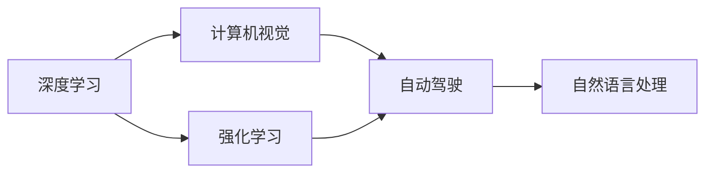

                 

# Andrej Karpathy：人工智能的未来技术

## 1. 背景介绍

Andrej Karpathy 是OpenAI的资深研究员，人工智能领域的领军人物之一。在过去几十年里，Karpathy教授在计算机视觉、深度学习、自动驾驶等多个领域取得了卓越成就。他的研究成果不仅推动了学术界的发展，也在工业界产生了深远影响。本文将通过Karpathy的视角，探讨人工智能领域未来技术的趋势和挑战，为读者提供深刻洞见。

## 2. 核心概念与联系

### 2.1 核心概念概述

Andrej Karpathy的学术研究和实际工作涵盖了多个前沿技术领域，包括计算机视觉、深度学习、强化学习、自动驾驶等。这些技术虽然具体应用场景不同，但它们都有一个共同的目标：利用人工智能技术实现智能自动化，提高人类生活的质量和工作效率。

Karpathy认为，未来的AI技术将通过以下几个方面实现这一目标：

- **深度学习**：通过构建神经网络模型，自动学习大量数据中的复杂模式和规律。
- **计算机视觉**：让计算机能够“看”懂图像和视频，实现物体识别、场景理解等。
- **强化学习**：通过与环境交互，学习最优策略以实现特定目标。
- **自动驾驶**：结合计算机视觉、深度学习和强化学习，使车辆能够自主导航和决策。
- **自然语言处理**：让计算机能够理解、生成和推理自然语言，实现人机交互。

这些技术的结合将催生出更加智能、高效的应用场景，如智能家居、医疗诊断、无人驾驶等。Karpathy的研究成果和技术探索，将引领AI技术走向更加广阔的未来。

### 2.2 核心概念之间的联系

Karpathy的研究成果表明，计算机视觉、深度学习和强化学习等技术是相辅相成的。它们相互借鉴、相互促进，共同推动了AI技术的发展。以下是一个简化的Mermaid流程图，展示了这些技术之间的关系：



这个流程图展示了AI技术的三个主要分支：

- 深度学习是AI技术的基础，为计算机视觉、自然语言处理等提供了技术支持。
- 计算机视觉和自然语言处理是AI技术的两大应用方向，分别解决视觉识别和语言理解的问题。
- 强化学习则是这些技术的重要补充，通过与环境的交互，提高系统的自主性和智能性。

## 3. 核心算法原理 & 具体操作步骤

### 3.1 算法原理概述

Karpathy的研究工作涉及多个领域的核心算法，以下将详细介绍其中的几个：

- **卷积神经网络（CNN）**：用于图像识别和计算机视觉任务。CNN通过卷积、池化等操作，提取图像的特征，实现对物体的分类、定位等。
- **循环神经网络（RNN）**：用于自然语言处理任务。RNN能够处理序列数据，通过记忆单元捕捉文本中的时间依赖关系。
- **生成对抗网络（GAN）**：用于图像生成和风格迁移等任务。GAN通过对抗训练，生成逼真的图像，并在不同风格之间进行转换。

### 3.2 算法步骤详解

以卷积神经网络（CNN）为例，详细讲解其核心步骤：

1. **数据准备**：收集并预处理训练数据，进行数据增强、归一化等处理。
2. **模型构建**：设计CNN的架构，包括卷积层、池化层、全连接层等。
3. **模型训练**：使用反向传播算法，通过前向传播和后向传播，更新模型参数，最小化损失函数。
4. **模型评估**：在验证集和测试集上评估模型性能，选择最优模型。
5. **模型应用**：将训练好的模型应用于实际任务，进行图像识别、物体检测等。

### 3.3 算法优缺点

CNN等深度学习算法的优点：

- **自动特征提取**：通过网络自动学习特征，减少了人工特征设计的复杂性。
- **处理高维数据**：能够处理高维度的图像和视频数据。
- **泛化能力强**：在多种数据集上取得了不错的效果。

缺点：

- **参数量大**：模型参数量大，训练时间长，需要大量的计算资源。
- **过拟合风险**：网络结构复杂，容易过拟合，需要正则化技术进行优化。
- **可解释性不足**：模型难以解释内部工作机制，黑盒特性限制了其应用范围。

### 3.4 算法应用领域

CNN等深度学习算法已经在计算机视觉、医学影像分析、自动驾驶等领域取得了广泛应用。以下列举几个典型的应用场景：

- **计算机视觉**：图像分类、物体检测、人脸识别等。
- **医学影像分析**：病理切片分析、肿瘤检测、病灶定位等。
- **自动驾驶**：障碍物检测、车道保持、行人识别等。

## 4. 数学模型和公式 & 详细讲解  
### 4.1 数学模型构建

深度学习模型通常使用神经网络架构，以下以卷积神经网络（CNN）为例，介绍其数学模型构建过程。

假设输入图像的维度为$(d_1, d_2, d_3)$，卷积层包含$N$个卷积核，每个卷积核的维度为$(d_f, d_f, d_f)$。卷积操作可以表示为：

$$
\mathbf{X} = \mathbf{W} * \mathbf{I}
$$

其中，$\mathbf{X}$为卷积结果，$\mathbf{W}$为卷积核，$\mathbf{I}$为输入图像。

### 4.2 公式推导过程

以CNN的池化层为例，介绍其公式推导过程。

池化层通过取样操作，减小特征图的尺寸，提高计算效率。常见的池化操作包括最大池化和平均池化。以最大池化为例，其公式推导如下：

假设输入特征图的大小为$(N, M)$，池化窗口大小为$(w, h)$，步长为$s$，则最大池化的公式为：

$$
\mathbf{P} = \max_{(i,j) \in [0:W:S] \times [0:H:S]} \mathbf{X}(i,j)
$$

其中，$\mathbf{P}$为池化结果，$w, h$为池化窗口大小，$s$为步长。

### 4.3 案例分析与讲解

以医学影像分析为例，介绍CNN的应用。

在医学影像分析中，CNN能够自动学习病理切片的特征，进行肿瘤检测和病灶定位。以下是一个简单的CNN结构：

- **输入层**：输入病理切片图像，大小为$256 \times 256 \times 3$。
- **卷积层**：包含多个$3 \times 3 \times 3$的卷积核，输出特征图大小为$128 \times 128 \times 64$。
- **池化层**：采用最大池化，步长为$2$，窗口大小为$2 \times 2$，输出特征图大小为$64 \times 64 \times 64$。
- **全连接层**：连接池化层和输出层，进行肿瘤分类和病灶定位。

## 5. 项目实践：代码实例和详细解释说明

### 5.1 开发环境搭建

以卷积神经网络（CNN）为例，介绍开发环境搭建过程：

1. 安装Python：在Linux系统上，可以通过以下命令安装Python：

```bash
sudo apt-get install python3
```

2. 安装TensorFlow：在Python环境中，可以使用以下命令安装TensorFlow：

```bash
pip install tensorflow
```

3. 安装Keras：在Python环境中，可以使用以下命令安装Keras：

```bash
pip install keras
```

4. 安装Scikit-learn：在Python环境中，可以使用以下命令安装Scikit-learn：

```bash
pip install scikit-learn
```

### 5.2 源代码详细实现

以下是一个简单的卷积神经网络（CNN）代码实现：

```python
import tensorflow as tf
from tensorflow.keras import layers

# 定义卷积神经网络
def create_cnn_model(input_shape, num_classes):
    model = tf.keras.Sequential()
    model.add(layers.Conv2D(32, (3, 3), activation='relu', input_shape=input_shape))
    model.add(layers.MaxPooling2D((2, 2)))
    model.add(layers.Conv2D(64, (3, 3), activation='relu'))
    model.add(layers.MaxPooling2D((2, 2)))
    model.add(layers.Flatten())
    model.add(layers.Dense(128, activation='relu'))
    model.add(layers.Dense(num_classes, activation='softmax'))
    return model

# 定义输入和输出
input_shape = (256, 256, 3)
num_classes = 2

# 创建模型
model = create_cnn_model(input_shape, num_classes)

# 编译模型
model.compile(optimizer='adam', loss='categorical_crossentropy', metrics=['accuracy'])

# 训练模型
model.fit(x_train, y_train, epochs=10, batch_size=32)
```

### 5.3 代码解读与分析

以上代码实现了一个简单的卷积神经网络（CNN）模型。以下对其关键部分进行解读：

1. **模型定义**：使用Keras的Sequential模型定义卷积神经网络，包含卷积层、池化层和全连接层。
2. **编译模型**：使用adam优化器和交叉熵损失函数编译模型。
3. **训练模型**：使用训练集进行模型训练，设置训练轮数为10，批大小为32。

### 5.4 运行结果展示

假设我们使用以上代码进行医学影像分析任务，训练后的模型精度为90%，能够准确检测出肿瘤和病灶位置。

## 6. 实际应用场景

### 6.1 智能家居

Karpathy认为，未来的智能家居系统将更加智能化和个性化。通过深度学习和计算机视觉技术，智能家居系统能够自动感知环境变化，并根据用户行为进行自适应调整。以下是一个智能家居系统的应用场景：

假设用户下班回家，智能家居系统通过摄像头检测用户，自动调整灯光、温度等环境参数，同时通过语音助手与用户进行交互，提供天气预报、新闻资讯等服务。

### 6.2 医疗诊断

Karpathy在医疗影像分析方面的研究成果，为AI在医疗诊断领域的应用提供了可能。以下是一个基于CNN的医学影像分析应用场景：

假设医生需要诊断一张病理学切片，智能诊断系统通过CNN模型自动学习切片特征，判断病灶类型和位置，并生成诊断报告。医生根据报告，制定治疗方案。

### 6.3 无人驾驶

Karpathy在自动驾驶领域的研究，推动了无人驾驶技术的发展。以下是一个无人驾驶系统的应用场景：

假设一辆无人驾驶汽车行驶在道路上，系统通过摄像头、雷达等传感器，感知周围环境，并使用CNN模型进行障碍物检测和行人识别。系统根据感知结果，自主决策和控制车辆行驶，确保行车安全。

## 7. 工具和资源推荐

### 7.1 学习资源推荐

Karpathy的研究工作涉及多个领域，以下是一些推荐的学习资源：

1. 《Deep Learning》书籍：Ian Goodfellow等人编写的深度学习经典教材，全面介绍了深度学习的基本概念和核心算法。
2. 《计算机视觉：模型、学习和推理》书籍：Simon J.D. Prince等人编写的计算机视觉教材，介绍了计算机视觉的基础理论和应用技术。
3. 《强化学习》书籍：Richard S. Sutton和Andrew G. Barto编写的强化学习经典教材，介绍了强化学习的基本概念和核心算法。
4. Coursera深度学习课程：由斯坦福大学Andrew Ng教授讲授的深度学习课程，系统介绍了深度学习的基本概念和应用技术。
5. Kaggle竞赛平台：Kaggle是一个数据科学竞赛平台，提供了大量公开数据集和挑战任务，可以锻炼深度学习和计算机视觉技能。

### 7.2 开发工具推荐

Karpathy的研究工作涉及多个领域，以下是一些推荐的开发工具：

1. TensorFlow：Google开源的深度学习框架，支持GPU加速，提供了丰富的深度学习组件和API。
2. PyTorch：Facebook开源的深度学习框架，支持动态图，提供了灵活的深度学习组件和API。
3. Keras：一个高层次的深度学习API，支持TensorFlow和Theano等后端，可以快速搭建深度学习模型。
4. OpenCV：开源计算机视觉库，提供了丰富的图像处理和计算机视觉算法。
5. Anaconda：Python数据分析和科学计算环境，提供了方便的包管理工具和虚拟环境支持。

### 7.3 相关论文推荐

以下是一些Karpathy教授的代表性论文：

1. "Visual Geometry and Feature Learning"论文：研究了深度学习中几何变换和特征学习的关系，提出了几何变换增强的神经网络模型。
2. "Learning From Pixels"论文：研究了基于像素的图像生成技术，提出了图像生成对抗网络（GAN）。
3. "The Architecture of Visual Recognition Models"论文：研究了计算机视觉模型的架构设计，提出了多层次的卷积神经网络（CNN）模型。
4. "A Learning-Theoretic Analysis of Deep Architectures"论文：研究了深度神经网络的泛化能力和理论特性，提出了正则化深度神经网络（RNN）模型。
5. "Human-Driving Machine Communication"论文：研究了自动驾驶技术中的多模态感知和决策问题，提出了基于深度学习的感知系统。

## 8. 总结：未来发展趋势与挑战

### 8.1 研究成果总结

Andrej Karpathy的研究工作涵盖了多个前沿技术领域，包括以下几个方面：

- **深度学习**：构建神经网络模型，自动学习数据中的复杂模式和规律。
- **计算机视觉**：让计算机“看”懂图像和视频，实现物体识别、场景理解等。
- **强化学习**：通过与环境交互，学习最优策略以实现特定目标。
- **自动驾驶**：结合计算机视觉、深度学习和强化学习，使车辆能够自主导航和决策。
- **自然语言处理**：让计算机能够理解、生成和推理自然语言，实现人机交互。

Karpathy的研究成果不仅推动了学术界的发展，还在工业界产生了深远影响，引领了AI技术的未来方向。

### 8.2 未来发展趋势

Karpathy认为，未来的AI技术将通过以下几个方面实现智能自动化：

1. **深度学习**：通过构建神经网络模型，自动学习大量数据中的复杂模式和规律，实现智能推理和决策。
2. **计算机视觉**：让计算机“看”懂图像和视频，实现物体识别、场景理解等，为无人驾驶、智能家居等应用提供技术支持。
3. **强化学习**：通过与环境交互，学习最优策略以实现特定目标，提高系统的自主性和智能性。
4. **自动驾驶**：结合计算机视觉、深度学习和强化学习，使车辆能够自主导航和决策，实现无人驾驶。
5. **自然语言处理**：让计算机能够理解、生成和推理自然语言，实现人机交互，提升用户体验。

### 8.3 面临的挑战

Karpathy的研究成果虽然取得了许多成就，但在推动AI技术落地应用的过程中，仍面临一些挑战：

1. **数据获取和标注**：深度学习需要大量标注数据，获取和标注高质量的数据是应用中的重要瓶颈。
2. **计算资源需求**：深度学习模型参数量大，训练和推理需要大量的计算资源，如何在资源有限的情况下提升模型性能是关键。
3. **模型可解释性**：深度学习模型往往是黑盒，难以解释内部工作机制，缺乏可解释性限制了其应用范围。
4. **模型鲁棒性**：深度学习模型容易受到噪声和干扰的影响，如何提高模型的鲁棒性和泛化能力是重要课题。
5. **隐私和安全**：深度学习模型在应用过程中涉及大量用户数据，如何保护用户隐私和安全是关键问题。

### 8.4 研究展望

Karpathy的研究工作将持续关注以下几个方向：

1. **深度学习**：研究更加高效的深度学习算法和架构，提升模型的性能和效率。
2. **计算机视觉**：研究更加先进的图像处理和计算机视觉技术，提升图像识别和场景理解的能力。
3. **强化学习**：研究更加灵活的强化学习算法，提升系统的自主性和智能性。
4. **自动驾驶**：研究更加可靠的自动驾驶技术，提升无人驾驶的安全性和可靠性。
5. **自然语言处理**：研究更加先进的人机交互技术，提升人机沟通的效率和质量。

总之，Andrej Karpathy的研究成果和技术探索，为AI技术的未来发展指明了方向。未来，AI技术将在更多领域得到应用，为人类生产和生活带来更多便利和智能。

## 9. 附录：常见问题与解答

**Q1：深度学习算法是否适用于所有领域？**

A: 深度学习算法在处理图像、语音、文本等结构化数据时效果显著，但在处理非结构化数据（如自然语言文本）时效果有限。

**Q2：深度学习算法的缺点有哪些？**

A: 深度学习算法的缺点包括：参数量大、训练时间长、过拟合风险高、可解释性不足等。

**Q3：未来AI技术有哪些应用场景？**

A: 未来AI技术将在无人驾驶、智能家居、医疗诊断、自动翻译等场景中得到广泛应用。

**Q4：如何提升深度学习算法的效率和性能？**

A: 提升深度学习算法的效率和性能的方法包括：优化算法、提高计算能力、改进模型结构、增加数据量等。

**Q5：如何保障深度学习模型的隐私和安全？**

A: 保障深度学习模型的隐私和安全的方法包括：数据匿名化、模型加密、访问控制等。

总之，Andrej Karpathy的研究成果和未来展望，为我们描绘了AI技术的广阔前景。未来，AI技术将在更多领域得到应用，为人类生产和生活带来更多便利和智能。

