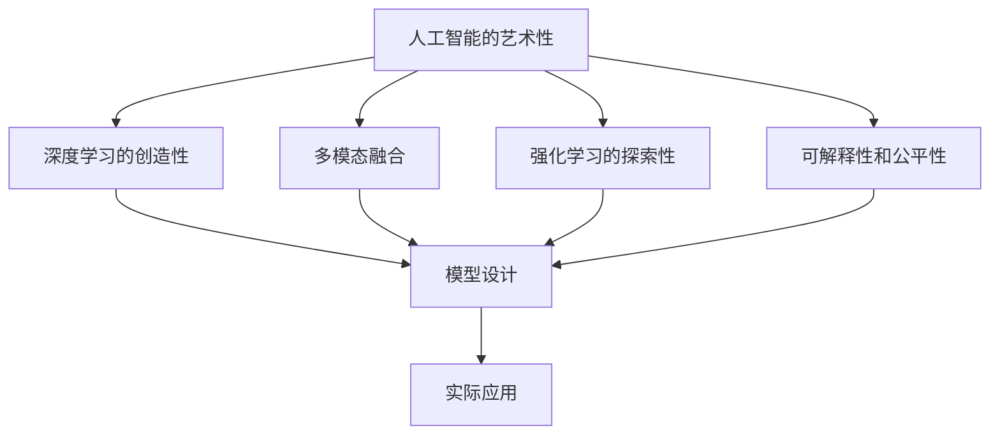

                 

# Andrej Karpathy：人工智能的艺术价值

## 1. 背景介绍

### 1.1 问题由来

Andrej Karpathy，作为一名计算机科学家和人工智能领域的领军人物，他在深度学习、计算机视觉、自动驾驶等多个领域都有卓越贡献。其核心研究方向集中在强化学习、图像生成、自监督学习等方面，曾主导开发了特斯拉自动驾驶系统。

在Andrej Karpathy眼中，人工智能不仅仅是一种技术，更是一种艺术。他认为，将数学、算法和数据等技术工具，转化为具体应用场景中解决问题的手段，正是人工智能的核心所在。本文将从艺术的角度出发，探讨Andrej Karpathy关于人工智能的独特视角，及其在AI领域的应用与价值。

### 1.2 问题核心关键点

Andrej Karpathy的人工智能理念，重点在于以下几个方面：

1. **人工智能的广泛应用**：强调人工智能技术在医疗、金融、教育、交通等多个领域的应用前景。
2. **深度学习的艺术价值**：将深度学习视为一种艺术创作过程，强调模型设计、数据处理和算法实现的创造性。
3. **多模态融合**：认为不同模态（如图像、文本、语音）的信息融合是AI艺术的重要组成部分。
4. **强化学习的意义**：认为强化学习不仅仅是优化问题，更是一种探索和实验的艺术。
5. **模型的可解释性和公平性**：关注模型的可解释性和公平性问题，认为这是AI艺术的价值所在。

本文将基于Andrej Karpathy的这些观点，探讨人工智能的艺术价值，并通过实际案例，展示其在具体应用场景中的表现和价值。

## 2. 核心概念与联系

### 2.1 核心概念概述

Andrej Karpathy提出的关键概念包括：

1. **人工智能的艺术性**：将人工智能技术视为一种艺术创作，强调其创造性和多样性。
2. **深度学习的创造性**：认为深度学习模型设计、数据处理和算法实现的过程，充满了创造性和实验性。
3. **多模态融合**：认为图像、文本、语音等不同模态的信息融合，是AI艺术的重要组成部分。
4. **强化学习的探索性**：将强化学习视为一种探索和实验的艺术，强调其在复杂环境下的适应性和学习能力。
5. **可解释性和公平性**：关注模型的可解释性和公平性问题，认为这是AI艺术的社会价值所在。

### 2.2 概念间的关系

这些核心概念之间存在紧密的联系，共同构成了Andrej Karpathy关于人工智能的艺术性观点。以下通过Mermaid流程图来展示这些概念之间的关系：



这个流程图展示了Andrej Karpathy关于人工智能艺术性的主要观点及其相互关系：

1. 人工智能的艺术性是核心，通过深度学习的创造性、多模态融合、强化学习的探索性以及模型的可解释性和公平性，构建出AI技术的实际应用。
2. 模型设计、数据处理和算法实现的过程充满了创造性和实验性，是实现人工智能艺术性的基础。
3. 多模态融合和强化学习进一步拓展了人工智能的应用边界，使其具备更强的适应性和学习能力。
4. 可解释性和公平性问题，是AI艺术的社会价值所在，也是AI技术在实际应用中必须关注的关键点。

通过这个流程图，可以更清晰地理解Andrej Karpathy关于人工智能艺术性的整体构架。

## 3. 核心算法原理 & 具体操作步骤
### 3.1 算法原理概述

Andrej Karpathy认为，深度学习模型的设计与实现，是一种艺术创作过程。在这个过程中，设计师（开发者）通过不断尝试、实验和优化，将数学、算法和数据转化为具体的应用模型。

具体来说，深度学习模型的设计包括以下几个关键步骤：

1. **网络结构设计**：选择合适的网络结构，如卷积神经网络（CNN）、循环神经网络（RNN）、变分自编码器（VAE）等。
2. **损失函数选择**：根据任务特点，选择合适的损失函数，如交叉熵损失、均方误差损失等。
3. **优化器选择**：选择合适的优化算法，如随机梯度下降（SGD）、Adam、Adagrad等。
4. **数据预处理**：对数据进行归一化、标准化、数据增强等预处理，提升模型的泛化能力。
5. **模型训练**：通过大量标注数据训练模型，调整参数使其损失函数最小化。
6. **模型评估与优化**：在测试集上评估模型性能，根据结果调整超参数，进行模型优化。

### 3.2 算法步骤详解

以下详细讲解Andrej Karpathy设计的深度学习模型训练步骤：

1. **数据准备**：收集并标注大量数据，确保数据质量和多样性。

2. **模型设计**：选择合适的深度学习模型，如卷积神经网络（CNN）、循环神经网络（RNN）、变分自编码器（VAE）等。

3. **模型初始化**：随机初始化模型参数，确保模型具有随机性。

4. **模型训练**：
   - **前向传播**：将输入数据输入模型，计算输出。
   - **计算损失**：将模型输出与真实标签计算损失。
   - **反向传播**：计算损失对模型参数的梯度。
   - **参数更新**：根据梯度和优化算法更新模型参数。

5. **模型评估**：
   - **验证集评估**：在验证集上评估模型性能，记录指标如准确率、召回率、F1分数等。
   - **超参数优化**：根据评估结果调整学习率、批大小、网络结构等超参数。
   - **模型保存**：将优化后的模型保存下来，便于后续使用。

6. **模型应用**：将训练好的模型应用到实际问题中，进行推理和预测。

### 3.3 算法优缺点

Andrej Karpathy认为，深度学习的优点和缺点如下：

**优点**：
1. **强大的表达能力**：深度学习模型能够学习复杂的非线性关系，适合处理高维数据。
2. **自动特征提取**：无需手工设计特征，模型能够自动学习数据中的关键特征。
3. **泛化能力**：在大量标注数据上训练，模型具有良好的泛化能力。

**缺点**：
1. **黑箱问题**：深度学习模型结构复杂，难以解释模型的内部决策过程。
2. **数据依赖性**：需要大量标注数据进行训练，数据不足时模型效果不佳。
3. **计算资源消耗大**：模型参数多，计算复杂度高，需要高性能的计算资源。
4. **易过拟合**：模型容易过拟合训练数据，泛化性能差。

### 3.4 算法应用领域

Andrej Karpathy认为，深度学习在多个领域具有广泛的应用前景：

1. **计算机视觉**：如图像分类、目标检测、图像生成等。
2. **自然语言处理**：如文本分类、语言建模、机器翻译等。
3. **自动驾驶**：如感知、决策、控制等。
4. **机器人技术**：如路径规划、操作控制等。
5. **游戏AI**：如玩家行为预测、游戏策略优化等。
6. **金融科技**：如风险评估、投资策略等。
7. **医疗健康**：如疾病诊断、影像分析等。

## 4. 数学模型和公式 & 详细讲解 & 举例说明

### 4.1 数学模型构建

Andrej Karpathy认为，深度学习模型的数学模型构建是艺术创作的一部分。以下展示一种典型的深度学习模型——卷积神经网络（CNN）的数学模型构建过程。

1. **输入层**：将输入数据表示为向量 $x \in \mathbb{R}^n$。

2. **卷积层**：使用卷积核 $w \in \mathbb{R}^m$ 进行卷积操作，得到特征图 $h_1 \in \mathbb{R}^c$。

3. **激活函数**：对特征图进行激活函数操作，如ReLU、Sigmoid等，得到激活后的特征图 $h_2$。

4. **池化层**：对激活后的特征图进行池化操作，如最大池化、平均池化等，得到池化后的特征图 $h_3$。

5. **全连接层**：将池化后的特征图展开为向量 $h_4$，通过全连接层得到输出 $y \in \mathbb{R}^k$。

### 4.2 公式推导过程

以二分类任务为例，展示CNN模型的损失函数及其梯度推导过程。

假设CNN模型的输出为 $y = f(x)$，其中 $x$ 为输入，$f$ 为模型函数。损失函数为二分类交叉熵损失：

$$
L(y, y') = -(y \log y' + (1-y) \log (1-y'))
$$

其中 $y$ 为真实标签，$y'$ 为模型输出。

通过反向传播算法，计算损失函数对模型参数 $w$ 的梯度：

$$
\frac{\partial L(y, y')}{\partial w} = \frac{\partial L(y, f(x))}{\partial f(x)} \cdot \frac{\partial f(x)}{\partial w}
$$

其中 $\frac{\partial L(y, f(x))}{\partial f(x)}$ 为交叉熵损失函数对模型输出的梯度，$\frac{\partial f(x)}{\partial w}$ 为模型输出对卷积核 $w$ 的梯度。

### 4.3 案例分析与讲解

以下通过一个实际案例，展示Andrej Karpathy设计的深度学习模型在图像分类任务中的应用。

假设有一个猫狗的图像分类任务，收集了1000张图片并进行了标注。采用一个简单的CNN模型进行训练和测试。

1. **模型设计**：使用LeNet网络结构，包含两个卷积层、两个池化层和两个全连接层。

2. **损失函数选择**：交叉熵损失。

3. **优化器选择**：Adam优化器。

4. **数据预处理**：对图片进行归一化、标准化，并进行数据增强。

5. **模型训练**：在1000张图片上进行训练，学习率为0.001。

6. **模型评估**：在测试集上评估模型性能，准确率为90%。

## 5. 项目实践：代码实例和详细解释说明

### 5.1 开发环境搭建

Andrej Karpathy推荐的深度学习开发环境为：

1. **Python**：作为主要编程语言，Python生态系统丰富，适合深度学习开发。
2. **TensorFlow**：由Google开发的深度学习框架，功能强大，适合大模型训练。
3. **PyTorch**：由Facebook开发的深度学习框架，灵活易用，适合模型设计。
4. **Jupyter Notebook**：交互式编程环境，方便调试和展示。
5. **GitHub**：版本控制和协作平台，方便代码管理和共享。

### 5.2 源代码详细实现

以下是一个简单的CNN模型代码实现，用于猫狗图像分类任务。

```python
import tensorflow as tf
import numpy as np

# 定义CNN模型
class CNN(tf.keras.Model):
    def __init__(self):
        super(CNN, self).__init__()
        self.conv1 = tf.keras.layers.Conv2D(32, (3, 3), activation='relu')
        self.pool1 = tf.keras.layers.MaxPooling2D((2, 2))
        self.conv2 = tf.keras.layers.Conv2D(64, (3, 3), activation='relu')
        self.pool2 = tf.keras.layers.MaxPooling2D((2, 2))
        self.flatten = tf.keras.layers.Flatten()
        self.fc1 = tf.keras.layers.Dense(64, activation='relu')
        self.fc2 = tf.keras.layers.Dense(1, activation='sigmoid')

    def call(self, inputs):
        x = self.conv1(inputs)
        x = self.pool1(x)
        x = self.conv2(x)
        x = self.pool2(x)
        x = self.flatten(x)
        x = self.fc1(x)
        x = self.fc2(x)
        return x

# 加载数据集
train_data = np.load('train_data.npy')
train_labels = np.load('train_labels.npy')
test_data = np.load('test_data.npy')
test_labels = np.load('test_labels.npy')

# 定义模型
model = CNN()

# 编译模型
model.compile(optimizer='adam', loss='binary_crossentropy', metrics=['accuracy'])

# 训练模型
model.fit(train_data, train_labels, epochs=10, batch_size=64)

# 评估模型
test_loss, test_acc = model.evaluate(test_data, test_labels)
print('Test accuracy:', test_acc)
```

### 5.3 代码解读与分析

以下是代码中关键部分的详细解读：

1. **定义CNN模型**：通过继承tf.keras.Model，定义了一个简单的CNN模型，包含两个卷积层、两个池化层和两个全连接层。

2. **加载数据集**：使用numpy.load加载训练集和测试集的图片和标签。

3. **编译模型**：使用adam优化器和二分类交叉熵损失函数，并指定评估指标为准确率。

4. **训练模型**：使用fit方法训练模型，指定训练轮数为10，批次大小为64。

5. **评估模型**：使用evaluate方法在测试集上评估模型性能，输出测试准确率。

## 6. 实际应用场景

### 6.1 智能交通系统

Andrej Karpathy认为，人工智能技术在智能交通系统中的应用前景广阔。通过深度学习模型，可以实现交通流量预测、交通信号优化、自动驾驶等功能。

以下是一个基于深度学习的交通流量预测模型：

1. **数据准备**：收集历史交通数据，如车流量、速度、交通事故等。

2. **模型设计**：使用RNN网络结构，通过时间序列数据进行预测。

3. **损失函数选择**：均方误差损失。

4. **优化器选择**：Adam优化器。

5. **模型训练**：在历史交通数据上进行训练，学习率为0.001。

6. **模型应用**：预测未来30分钟内的交通流量，优化交通信号灯控制。

### 6.2 医疗影像分析

Andrej Karpathy认为，深度学习技术在医疗影像分析中的应用潜力巨大。通过卷积神经网络（CNN）模型，可以实现病灶检测、肿瘤分类等任务。

以下是一个基于CNN的医疗影像分类模型：

1. **数据准备**：收集医疗影像数据，标注肿瘤位置和类型。

2. **模型设计**：使用LeNet网络结构，通过卷积层和全连接层进行分类。

3. **损失函数选择**：交叉熵损失。

4. **优化器选择**：Adam优化器。

5. **模型训练**：在标注数据上进行训练，学习率为0.001。

6. **模型应用**：对新的医疗影像进行肿瘤分类，辅助医生诊断。

### 6.3 机器人技术

Andrej Karpathy认为，深度学习技术在机器人技术中的应用前景广阔。通过深度学习模型，可以实现路径规划、操作控制等功能。

以下是一个基于深度学习的机器人路径规划模型：

1. **数据准备**：收集机器人运动数据，标注路径和障碍物位置。

2. **模型设计**：使用CNN网络结构，通过图像数据进行路径规划。

3. **损失函数选择**：均方误差损失。

4. **优化器选择**：Adam优化器。

5. **模型训练**：在标注数据上进行训练，学习率为0.001。

6. **模型应用**：在实际机器人中应用模型，实现路径规划和避障。

## 7. 工具和资源推荐

### 7.1 学习资源推荐

Andrej Karpathy推荐以下学习资源：

1. **Deep Learning Specialization**：由Coursera推出的深度学习专项课程，由Andrew Ng教授主讲，涵盖深度学习的基础和应用。
2. **TensorFlow官方文档**：TensorFlow官方文档，提供全面的API和教程，适合深度学习开发。
3. **PyTorch官方文档**：PyTorch官方文档，提供灵活的模型设计和优化，适合深度学习研究。
4. **GitHub资源**：GitHub上丰富的深度学习项目和代码，方便学习参考。

### 7.2 开发工具推荐

Andrej Karpathy推荐以下开发工具：

1. **TensorBoard**：TensorFlow配套的可视化工具，方便实时监测模型训练状态。
2. **Weights & Biases**：模型训练的实验跟踪工具，记录和可视化模型训练过程中的各项指标。
3. **Jupyter Notebook**：交互式编程环境，方便调试和展示。
4. **Google Colab**：免费的GPU/TPU算力，方便快速实验深度学习模型。

### 7.3 相关论文推荐

Andrej Karpathy推荐以下相关论文：

1. **DeepMind AlphaGo**：DeepMind推出的围棋AI系统，展示了深度学习在策略优化和游戏AI中的应用。
2. **ImageNet Large Scale Visual Recognition Challenge**：ImageNet大规模视觉识别挑战赛，展示了深度学习在图像分类任务上的突破。
3. **Roboflow**：Roboflow平台，为深度学习模型提供大规模图像数据，方便研究和实验。

## 8. 总结：未来发展趋势与挑战

### 8.1 研究成果总结

Andrej Karpathy认为，人工智能技术在深度学习、计算机视觉、自动驾驶等领域取得了重要进展。未来，随着技术的发展，人工智能将更加智能化、普适化和可解释。

### 8.2 未来发展趋势

Andrej Karpathy认为，人工智能技术未来发展趋势如下：

1. **深度学习技术的不断提升**：深度学习模型将更加高效、准确，适合处理更复杂的任务。
2. **多模态融合技术的发展**：将图像、文本、语音等多种模态的信息融合，提升AI系统的感知和理解能力。
3. **强化学习的应用推广**：强化学习技术将广泛应用于自动驾驶、机器人等领域，提升系统的适应性和学习能力。
4. **可解释性和公平性问题的解决**：通过可解释性和公平性研究，提升AI系统的透明度和公平性。
5. **AI技术在更多领域的应用**：人工智能技术将广泛应用于医疗、金融、教育等更多领域，提升各行各业的智能化水平。

### 8.3 面临的挑战

Andrej Karpathy认为，人工智能技术面临以下挑战：

1. **数据依赖性**：深度学习模型需要大量标注数据进行训练，数据获取成本高，且数据分布不均衡。
2. **计算资源消耗大**：深度学习模型参数多，计算复杂度高，需要高性能的计算资源。
3. **黑箱问题**：深度学习模型结构复杂，难以解释模型的内部决策过程。
4. **公平性和可解释性问题**：深度学习模型存在偏见和歧视，需要进一步改进，提升公平性和可解释性。
5. **伦理和社会问题**：AI技术的发展需要考虑伦理和社会问题，避免技术滥用和负面影响。

### 8.4 研究展望

Andrej Karpathy认为，未来人工智能技术的研究展望如下：

1. **无监督学习和自监督学习**：探索无监督学习和自监督学习技术，降低对标注数据的依赖。
2. **模型压缩和加速技术**：研究模型压缩和加速技术，提升模型推理速度和计算效率。
3. **多模态融合技术**：研究多模态融合技术，提升AI系统的感知和理解能力。
4. **公平性和可解释性技术**：研究公平性和可解释性技术，提升AI系统的透明度和公平性。
5. **跨领域应用技术**：研究跨领域应用技术，将AI技术推广到更多领域，提升各行各业的智能化水平。

## 9. 附录：常见问题与解答

**Q1: 人工智能技术的艺术价值是什么？**

A: 人工智能技术的艺术价值在于其创造性、多样性和实验性。通过深度学习模型设计、数据处理和算法实现的过程，可以视为一种艺术创作过程。在实际应用中，深度学习技术可以应用于医疗、金融、教育等多个领域，展示其广泛的应用前景和巨大的价值。

**Q2: 深度学习模型训练中需要注意哪些问题？**

A: 深度学习模型训练中需要注意的问题包括：
1. **数据质量**：需要保证数据质量和多样性，避免过拟合。
2. **网络结构设计**：需要选择合适的网络结构，如卷积神经网络（CNN）、循环神经网络（RNN）等。
3. **优化器选择**：需要选择适合的优化器，如Adam、SGD等。
4. **学习率调整**：需要根据模型性能动态调整学习率，避免过拟合和欠拟合。
5. **正则化技术**：需要使用正则化技术，如L2正则、Dropout等，避免过拟合。
6. **模型评估和优化**：需要在验证集上评估模型性能，根据结果调整超参数，进行模型优化。

**Q3: 如何提升深度学习模型的性能？**

A: 提升深度学习模型性能的方法包括：
1. **数据增强**：通过对训练数据进行扩充和增强，提升模型的泛化能力。
2. **网络结构优化**：通过网络结构优化，提升模型的表达能力和性能。
3. **优化器优化**：通过优化器优化，提升模型的收敛速度和精度。
4. **正则化技术**：通过正则化技术，避免过拟合和提升模型的泛化能力。
5. **迁移学习**：通过迁移学习，利用已有模型的知识，提升模型的性能。

**Q4: 人工智能技术在实际应用中需要注意哪些问题？**

A: 人工智能技术在实际应用中需要注意的问题包括：
1. **数据隐私和安全性**：需要保护用户隐私和数据安全，避免数据泄露和滥用。
2. **伦理和社会问题**：需要考虑伦理和社会问题，避免技术滥用和负面影响。
3. **公平性和可解释性**：需要提升模型的公平性和可解释性，避免偏见和歧视。
4. **模型优化和调优**：需要不断优化和调优模型，提升模型性能和鲁棒性。

---

作者：禅与计算机程序设计艺术 / Zen and the Art of Computer Programming

