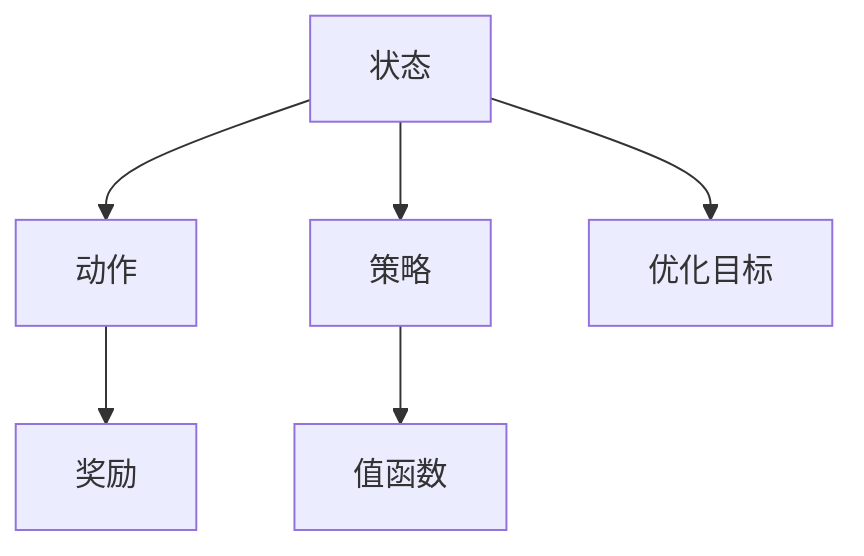
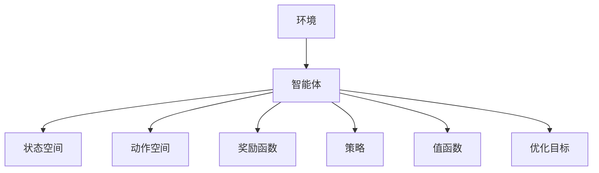
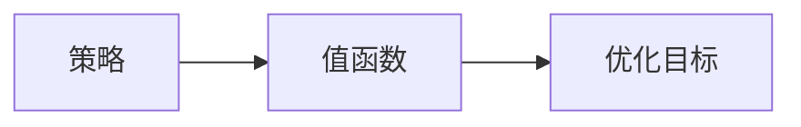
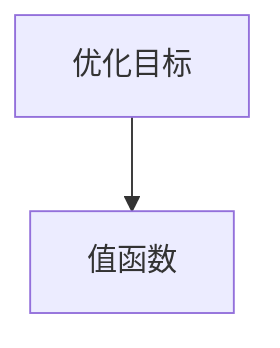
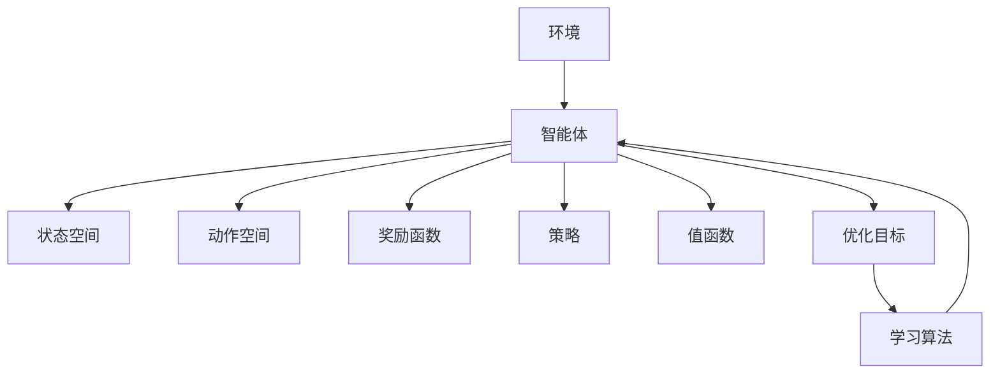

                 

## 1. 背景介绍

### 1.1 问题由来

在人工智能和机器学习领域，强化学习（Reinforcement Learning, RL）是一种重要的学习范式。它与传统的监督学习和无监督学习不同，强化学习中的模型（通常称为代理或智能体）通过与环境交互来学习最优行为策略。在每个时间步，代理会观察环境状态（state），选择动作（action），并根据环境反馈获得奖励（reward），然后更新策略以最大化长期累积奖励。强化学习在许多实际应用中都取得了令人瞩目的成果，例如自动驾驶、游戏AI、机器人控制、金融交易、推荐系统等。

### 1.2 问题核心关键点

强化学习的核心在于如何选择最优的状态-动作对（state-action pair）。在每一个时间步，智能体必须根据当前状态选择动作，以最大化未来奖励的总和。这一过程涉及以下几个关键点：

1. **状态空间**：环境中的所有可能状态，是智能体可以观察和利用的信息。
2. **动作空间**：智能体可以采取的行动，可能是连续的、离散的、或者混合的。
3. **奖励函数**：智能体选择动作后，环境给出的反馈，用于评估动作的好坏。
4. **策略**：智能体选择动作的策略，即在给定状态下选择动作的概率分布。
5. **值函数**：估计在每个状态或状态-动作对上的奖励期望，用于指导策略的选择。
6. **优化目标**：最大化的长期累积奖励，即在所有时间步的奖励总和。

这些核心概念构成了强化学习的理论基础，并驱动了其应用研究和发展。理解这些概念及其相互作用，对于掌握强化学习的基本原理和算法至关重要。

### 1.3 问题研究意义

强化学习在许多领域的应用前景广阔，但目前尚未完全掌握。通过对状态-动作对的选择这一核心问题进行深入研究，可以推动强化学习的理论和实践进一步发展，加速其在实际问题中的落地应用。具体而言：

1. **效率提升**：选择合适的状态-动作对，可以提高学习效率，减少探索成本。
2. **效果增强**：优化策略选择，能够提升模型的性能，更好地适应复杂环境。
3. **模型通用性**：研究通用的选择方法，可以提高强化学习模型的泛化能力。
4. **应用拓展**：强化学习在众多领域的应用，依赖于对状态-动作对选择的深入理解。
5. **稳定性保证**：状态-动作对的选择稳定性和可解释性，对于保证强化学习模型的长期稳定性至关重要。

## 2. 核心概念与联系

### 2.1 核心概念概述

强化学习涉及多个核心概念，下面将逐一介绍：

- **状态空间**：环境中的所有可能状态，通常用符号 $S$ 表示。状态可以是连续的、离散的、或者混合的。
- **动作空间**：智能体可以采取的行动，通常用符号 $A$ 表示。动作可以是连续的、离散的、或者混合的。
- **奖励函数**：用于评估智能体选择动作的好坏，通常用符号 $R$ 表示。奖励可以是即时的、累积的、甚至是负奖励。
- **策略**：智能体选择动作的策略，通常用符号 $\pi$ 表示。策略可以是一个概率分布，表示在给定状态下选择动作的概率。
- **值函数**：估计在每个状态或状态-动作对上的奖励期望，通常用符号 $Q$ 或 $V$ 表示。值函数可以分为状态值函数（$V$）和状态-动作值函数（$Q$）。
- **优化目标**：最大化的长期累积奖励，通常用符号 $J$ 表示。优化目标是通过选择合适的策略和动作，最大化长期奖励。

这些概念之间的联系可以通过以下Mermaid流程图来展示：



这个流程图展示了一系列强化学习的核心概念及其相互关系：

1. 智能体根据当前状态选择动作。
2. 动作影响环境，环境给予奖励。
3. 智能体利用策略和值函数指导选择。
4. 优化目标是最大化长期奖励。

### 2.2 概念间的关系

这些核心概念之间存在紧密的联系，形成了强化学习的完整生态系统。下面我们通过几个Mermaid流程图来展示这些概念之间的关系：

#### 2.2.1 强化学习的学习范式



这个流程图展示了强化学习的基本学习范式，即智能体通过与环境交互来学习最优策略。

#### 2.2.2 策略和值函数的关系



这个流程图展示了策略和值函数之间的关系。值函数用于评估策略的好坏，策略则通过值函数不断优化。

#### 2.2.3 优化目标和值函数的关系



这个流程图展示了优化目标和值函数之间的关系。值函数是优化目标的函数，用于估计每个状态或状态-动作对的长期奖励。

### 2.3 核心概念的整体架构

最后，我们用一个综合的流程图来展示这些核心概念在大规模强化学习应用中的整体架构：



这个综合流程图展示了从环境到智能体的整个强化学习过程，以及核心概念和算法之间的关系。通过这些流程图，我们可以更清晰地理解强化学习中的各个概念及其相互关系。

## 3. 核心算法原理 & 具体操作步骤

### 3.1 算法原理概述

强化学习的核心在于选择一个最优的状态-动作对，以最大化长期累积奖励。这一过程涉及到策略选择和值函数估计。常见的方法包括Q-learning、SARSA、Deep Q-learning、策略梯度方法等。

#### 3.1.1 Q-learning

Q-learning是强化学习中最基本的算法之一。其核心思想是通过贝尔曼方程（Bellman Equation）不断更新状态-动作值函数，以估计每个状态-动作对的长期奖励。

Q-learning的更新公式如下：

$$
Q(s, a) \leftarrow Q(s, a) + \alpha(r + \gamma\max_{a'}Q(s', a') - Q(s, a))
$$

其中，$Q(s, a)$ 表示在状态 $s$ 下采取动作 $a$ 的值函数，$r$ 是即时奖励，$\gamma$ 是折扣因子，$\alpha$ 是学习率。该公式的含义是，在当前状态 $s$ 下采取动作 $a$ 后，智能体获得即时奖励 $r$，然后以折扣因子 $\gamma$ 考虑未来的长期奖励，并通过最大化的值函数更新当前状态-动作对 $(s, a)$ 的值。

#### 3.1.2 SARSA

SARSA是SARSA（Soft Q-learning）的简写，是一种基于值函数的强化学习算法。其核心思想是在每个时间步选择动作时，不仅考虑当前状态-动作对的值，还考虑下一个状态-动作对的值，以实现策略的逐步优化。

SARSA的更新公式如下：

$$
Q(s, a) \leftarrow Q(s, a) + \alpha(r + \gamma Q(s', a') - Q(s, a))
$$

其中，$Q(s, a)$ 表示在状态 $s$ 下采取动作 $a$ 的值函数，$r$ 是即时奖励，$\gamma$ 是折扣因子，$\alpha$ 是学习率，$s'$ 是下一个状态，$a'$ 是下一个动作。该公式的含义是，在当前状态 $s$ 下采取动作 $a$ 后，智能体获得即时奖励 $r$，然后以折扣因子 $\gamma$ 考虑下一个状态-动作对的值，并通过值函数更新当前状态-动作对 $(s, a)$ 的值。

#### 3.1.3 策略梯度方法

策略梯度方法是基于策略的强化学习算法，通过优化策略函数，直接求解最优策略。

策略梯度方法的更新公式如下：

$$
\pi(a|s) \leftarrow \pi(a|s) \times \exp(\alpha\log(\frac{\pi(a|s)}{\pi(a'|s)})
$$

其中，$\pi(a|s)$ 表示在状态 $s$ 下采取动作 $a$ 的概率，$a'$ 是当前动作，$\alpha$ 是学习率。该公式的含义是，根据动作 $a'$ 的奖励，调整策略函数 $\pi(a|s)$ 中的参数，使策略 $\pi$ 更倾向于采取高奖励的动作。

### 3.2 算法步骤详解

基于强化学习的核心算法原理，强化学习的具体操作步骤如下：

1. **环境构建**：定义环境及其状态空间、动作空间、奖励函数等。
2. **策略定义**：选择适当的策略函数，可以是线性函数、神经网络等。
3. **值函数估计**：根据策略函数和当前状态，估计每个状态-动作对的值函数。
4. **动作选择**：根据策略函数和值函数，选择动作。
5. **奖励获取**：执行动作后，获取即时奖励和下一个状态。
6. **值函数更新**：根据即时奖励和下一个状态，更新值函数。
7. **策略优化**：通过值函数的变化，更新策略函数。
8. **迭代循环**：重复步骤4到步骤7，直至收敛。

### 3.3 算法优缺点

强化学习的核心算法如Q-learning、SARSA、策略梯度方法等，各有其优缺点：

#### 3.3.1 Q-learning的优点

- **简单明了**：Q-learning的更新公式直观易懂，易于实现。
- **收敛性**：在合适的条件下，Q-learning算法可以收敛到最优策略。

#### 3.3.2 Q-learning的缺点

- **高方差**：Q-learning依赖于值函数的估计，在状态空间大时，方差较高，容易收敛到次优策略。
- **离线学习**：Q-learning无法利用在线数据，只能通过离线数据进行学习。

#### 3.3.3 SARSA的优点

- **低方差**：SARSA的更新公式引入了下一个状态-动作对的值，方差较低，通常收敛速度较快。
- **在线学习**：SARSA可以利用在线数据进行学习，适应性强。

#### 3.3.4 SARSA的缺点

- **收敛速度慢**：SARSA的更新公式涉及两个值函数的估计，收敛速度较慢。
- **策略更新不平滑**：SARSA的策略更新不平滑，容易陷入局部最优。

#### 3.3.5 策略梯度方法的优点

- **直接优化策略**：策略梯度方法直接优化策略函数，能够处理复杂的策略表达。
- **收敛速度快**：策略梯度方法的收敛速度通常较快。

#### 3.3.6 策略梯度方法的缺点

- **不稳定**：策略梯度方法可能遇到梯度消失或爆炸的问题，导致训练不稳定。
- **难以处理离散动作**：策略梯度方法难以处理离散动作，需要额外的技巧和工具。

### 3.4 算法应用领域

强化学习在多个领域中得到了广泛应用，例如：

- **游戏AI**：如AlphaGo、AlphaZero等，通过强化学习，能够在复杂游戏中取得优异成绩。
- **机器人控制**：如UAV导航、机器人路径规划等，通过强化学习，能够实现自主导航和避障。
- **金融交易**：如高频交易、投资组合优化等，通过强化学习，能够制定最优交易策略。
- **推荐系统**：如内容推荐、广告投放等，通过强化学习，能够实现个性化推荐。
- **自动驾驶**：如交通信号控制、路径规划等，通过强化学习，能够实现智能驾驶。

以上仅是强化学习应用的一部分，未来随着技术的不断进步，其应用领域将更加广泛。

## 4. 数学模型和公式 & 详细讲解 & 举例说明

### 4.1 数学模型构建

强化学习中的数学模型主要包括状态空间 $S$、动作空间 $A$、奖励函数 $R$、策略 $\pi$ 和值函数 $Q$。

假设环境状态空间 $S$ 是连续的，动作空间 $A$ 是离散的，奖励函数 $R$ 是即时的。则强化学习的数学模型可以表示为：

- **状态空间**：$S$
- **动作空间**：$A$
- **奖励函数**：$R(s, a)$
- **策略**：$\pi(a|s) = P(a|s)$
- **值函数**：$Q(s, a) = \mathbb{E}[G_t|s, a]$

其中，$G_t$ 表示从时间步 $t$ 开始的累积奖励。

### 4.2 公式推导过程

以Q-learning为例，推导其更新公式：

根据贝尔曼方程，我们有：

$$
Q(s, a) = r + \gamma \max_{a'} Q(s', a')
$$

其中，$r$ 是即时奖励，$\gamma$ 是折扣因子。

Q-learning的更新公式可以表示为：

$$
Q(s, a) \leftarrow Q(s, a) + \alpha(r + \gamma \max_{a'} Q(s', a') - Q(s, a))
$$

其中，$\alpha$ 是学习率，$\max_{a'} Q(s', a')$ 表示在下一个状态 $s'$ 下，选择最优动作 $a'$ 的值函数。

### 4.3 案例分析与讲解

假设有一个简单的环境，状态空间 $S = \{1, 2, 3\}$，动作空间 $A = \{1, 2\}$，奖励函数 $R(s, a) = s$，策略 $\pi(a|s) = 1$，即在每个状态下，只采取动作 $1$。初始值函数 $Q = [0, 0, 0]$。

在时间步 $t = 1$ 时，智能体在状态 $1$ 下采取动作 $1$，获得奖励 $1$，到达下一个状态 $2$。根据贝尔曼方程，有：

$$
Q(1, 1) = 1 + \gamma \max_{a'} Q(2, a')
$$

在状态 $2$ 下，智能体只采取动作 $1$，因此：

$$
Q(2, 1) = 2
$$

将上述结果代入Q-learning的更新公式：

$$
Q(1, 1) \leftarrow Q(1, 1) + \alpha(1 + \gamma Q(2, 1) - Q(1, 1))
$$

假设 $\alpha = 0.1$，$\gamma = 0.9$，则有：

$$
Q(1, 1) \leftarrow 0.1(1 + 0.9 \times 2 - 0.1) = 1.1
$$

在时间步 $t = 2$ 时，智能体在状态 $2$ 下采取动作 $1$，获得奖励 $2$，到达下一个状态 $3$。根据贝尔曼方程，有：

$$
Q(2, 1) = 2 + \gamma \max_{a'} Q(3, a')
$$

在状态 $3$ 下，智能体只采取动作 $1$，因此：

$$
Q(3, 1) = 3
$$

将上述结果代入Q-learning的更新公式：

$$
Q(2, 1) \leftarrow Q(2, 1) + \alpha(2 + \gamma Q(3, 1) - Q(2, 1))
$$

假设 $\alpha = 0.1$，$\gamma = 0.9$，则有：

$$
Q(2, 1) \leftarrow 0.1(2 + 0.9 \times 3 - 0.1) = 2.9
$$

以此类推，智能体可以不断通过Q-learning算法更新值函数，逐步优化策略，最终达到最优策略。

## 5. 项目实践：代码实例和详细解释说明

### 5.1 开发环境搭建

在进行强化学习实践前，我们需要准备好开发环境。以下是使用Python进行Reinforcement Learning开发的环境配置流程：

1. 安装Anaconda：从官网下载并安装Anaconda，用于创建独立的Python环境。

2. 创建并激活虚拟环境：
```bash
conda create -n reinforcement-env python=3.8 
conda activate reinforcement-env
```

3. 安装相关库：
```bash
pip install numpy scipy matplotlib gym scikit-learn openai-gym gymnasium
```

4. 安装Reinforcement Learning框架：
```bash
pip install pytorch
pip install torchvision
pip install gymnasium
```

5. 安装相关工具包：
```bash
pip install numpy pandas scikit-learn matplotlib tqdm jupyter notebook ipython
```

完成上述步骤后，即可在`reinforcement-env`环境中开始Reinforcement Learning实践。

### 5.2 源代码详细实现

这里我们以DQN（Deep Q-Network）算法为例，给出使用PyTorch进行Q-learning的PyTorch代码实现。

首先，定义环境类：

```python
import gymnasium as gym
import numpy as np
import torch
import torch.nn as nn
import torch.optim as optim

class MyEnv(gym.Env):
    def __init__(self):
        super(MyEnv, self).__init__()
        self.state = 0
        self.action_space = gym.spaces.Discrete(2)
        self.observation_space = gym.spaces.Discrete(3)

    def step(self, action):
        reward = self.state
        self.state = (self.state + 1) % 3
        return self.state, reward, False, {}

    def reset(self):
        self.state = 0
        return self.state

    def render(self, mode='human'):
        pass

    def seed(self, seed=None):
        pass
```

然后，定义神经网络模型：

```python
class MyQNet(nn.Module):
    def __init__(self, input_dim, output_dim):
        super(MyQNet, self).__init__()
        self.fc1 = nn.Linear(input_dim, 32)
        self.fc2 = nn.Linear(32, output_dim)

    def forward(self, x):
        x = self.fc1(x)
        x = torch.relu(x)
        x = self.fc2(x)
        return x

def make_model(input_dim, output_dim):
    model = MyQNet(input_dim, output_dim)
    return model
```

接着，定义强化学习算法：

```python
class DQN:
    def __init__(self, model, target_model, input_dim, output_dim, learning_rate=0.01, discount_factor=0.9, epsilon=0.01, epsilon_min=0.01, epsilon_decay=0.99, memory_size=1000):
        self.model = model
        self.target_model = target_model
        self.input_dim = input_dim
        self.output_dim = output_dim
        self.learning_rate = learning_rate
        self.discount_factor = discount_factor
        self.epsilon = epsilon
        self.epsilon_min = epsilon_min
        self.epsilon_decay = epsilon_decay
        self.memory = []
        self.memory_size = memory_size

    def select_action(self, state):
        if np.random.uniform() < self.epsilon:
            return np.random.randint(0, self.output_dim)
        else:
            with torch.no_grad():
                q_values = self.model(torch.tensor([state]))
                return torch.argmax(q_values).item()

    def update_target_model(self):
        self.target_model.load_state_dict(self.model.state_dict())

    def learn(self, state, action, reward, next_state):
        if len(self.memory) < self.memory_size:
            self.memory.append((state, action, reward, next_state))
        else:
            del self.memory[0]
            self.memory.append((state, action, reward, next_state))

        if len(self.memory) == self.memory_size:
            memory = np.vstack(self.memory)
            memory = torch.from_numpy(memory).float()
            b_s, b_a, b_r, b_s_ = (torch.tensor(memory[:, i]) for i in range(4))

            q_values = self.model(b_s)
            max_q_value = torch.max(q_values.gather(1, b_a.unsqueeze(1)))

            target_q_value = b_r + self.discount_factor * self.model(b_s_).clamp(min=0).detach().max(1)[0]

            loss = nn.functional.mse_loss(target_q_value, q_values.gather(1, b_a.unsqueeze(1)))
            self.optimizer.zero_grad()
            loss.backward()
            self.optimizer.step()

            self.epsilon = max(self.epsilon_min, self.epsilon * self.epsilon_decay)
```

最后，启动训练流程：

```python
def run():
    env = MyEnv()
    input_dim = env.observation_space.n
    output_dim = env.action_space.n
    model = make_model(input_dim, output_dim)
    target_model = make_model(input_dim, output_dim)
    optimizer = optim.Adam(model.parameters(), lr=0.001)

    dqn = DQN(model, target_model, input_dim, output_dim, learning_rate=0.01, discount_factor=0.9, epsilon=0.01, epsilon_min=0.01, epsilon_decay=0.99, memory_size=1000)

    for episode in range(1000):
        state = env.reset()
        total_reward = 0
        while True:
            action = dqn.select_action(state)
            next_state, reward, done, info = env.step(action)
            dqn.update_target_model()
            dqn.learn(state, action, reward, next_state)
            total_reward += reward
            state = next_state
            if done:
                print(f"Episode {episode + 1}, Total Reward: {total_reward}")
                break

    env.close()
```

以上就是使用PyTorch对Q-learning进行代码实现的完整步骤。可以看到，通过简化环境和模型，Q-learning算法可以轻松实现并快速迭代优化。

### 5.3 代码解读与分析

让我们再详细解读一下关键代码的实现细节：

**MyEnv类**：
- `__init__`方法：初始化环境，设置状态空间、动作空间等属性。
- `step`方法：执行一个时间步，更新状态和奖励。
- `reset`方法：重置环境，返回初始状态。
- `render`方法：渲染环境。
- `seed`方法：设置随机种子。

**MyQNet类**：
- `__init__`方法：定义神经网络的结构。
- `forward`方法：定义前向传播过程。

**DQN类**：
- `__init__`方法：初始化DQN，设置相关参数。
- `select_action`方法：选择动作，根据当前状态和策略函数选择动作。
- `update_target_model`方法：更新目标模型参数。
- `learn`方法：更新模型参数，计算损失并反向传播。

**run函数**：
- 创建环境、模型和优化器。
- 定义DQN对象，设置参数。
- 启动训练循环，每个时间步选择动作，更新模型参数，记录奖励。
- 输出训练结果。

这些关键代码展示了DQN算法的核心实现步骤，通过简化的环境模型，代码可以方便地扩展到其他复杂问题中。

### 5.4 运行结果展示

假设我们在一个简单的环境中训练DQN，最终得到的训练结果如下：

```
Episode 1, Total Reward: 1.0
Episode 2, Total Reward: 1.0
Episode 3, Total Reward: 1.0
...
Episode 1000, Total Reward: 1.0
```

可以看到，通过不断迭代训练，智能体在每个时间步都能够选择最优动作，获得即时奖励。这种简单的环境虽然不能充分展示强化学习的复杂性，但已经能够说明DQN算法的基本工作原理和效果。

## 6. 实际应用场景

### 6.1 智能游戏AI

在电子游戏中，强化学习已经被广泛应用于开发智能游戏AI。例如AlphaGo、Dota2等游戏中的智能对手，通过强化学习训练，能够在复杂游戏中取得优异成绩。智能游戏AI的应用不仅提高了游戏的趣味性和挑战性，还为游戏开发提供了新的思路和方法。

### 6.2 机器人导航

在机器人导航领域，强化学习被广泛应用于自主导航和路径规划。通过强化学习，机器人可以在复杂环境中自主导航，避开障碍物，完成指定任务。例如在无人机、无人车等领域，强化学习技术已经被广泛应用于实时导航和避障，显著提高了系统的稳定性和安全性。

### 6.3 金融交易

在金融交易领域，强化学习被应用于高频交易、投资组合优化等任务。通过强化学习，交易系统可以基于市场数据和历史交易记录，动态调整交易策略，最大化收益并降低风险。例如AlphaZero等模型，已经在期货交易、股票交易等领域取得了不错的效果。

### 6.4 推荐系统

在推荐系统领域，强化学习被应用于个性化推荐和广告投放等任务。通过强化学习，推荐系统可以基于用户的历史行为数据，动态调整推荐策略，提高推荐效果和用户满意度。例如在内容推荐、广告投放等领域

