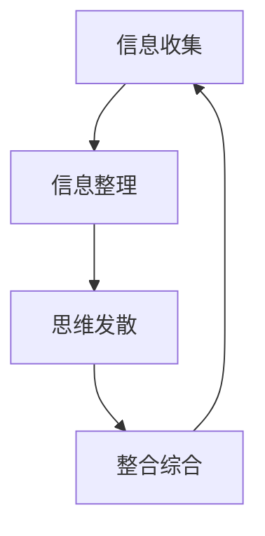
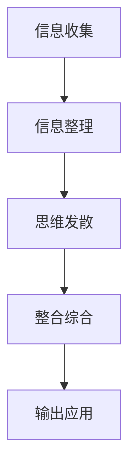

                 

# 思想的深度：从概念到洞见

## 1. 背景介绍

### 1.1 问题由来
在当今这个信息爆炸的时代，人类对知识的渴望从未如此强烈。而深度思考不仅成为了获取知识和理解世界的核心技能，更成为了创新和变革的原动力。从科学的发现到商业的创新，从文化艺术的创作到社会问题的解决，深度思考无处不在。然而，深度思考并非与生俱来，它需要通过系统的训练和学习来培养。本文旨在探索深度思考的原理与方法，帮助读者从概念层面走向洞见，提升自身思维的深度和广度。

### 1.2 问题核心关键点
深度思考的核心在于如何将复杂的信息进行抽象和分解，通过多角度、多层次的思考，最终形成深刻的洞见。这一过程通常包括以下几个关键步骤：
1. **信息收集**：获取全面、准确的信息，理解信息的背景和相关性。
2. **信息整理**：将收集到的信息进行分类、归纳和整合，找出其中的共性和规律。
3. **思维发散**：从不同角度和层次进行思考，挑战现有的认知和假设。
4. **整合综合**：将多角度的思考结果进行整合，形成全面的洞见和解决方案。

这些步骤不仅适用于科学研究和技术开发，也适用于日常生活中的决策和问题解决。

### 1.3 问题研究意义
深度思考能力的培养，对于提升个人的认知能力、创新思维和解决问题的能力具有重要意义：
1. **认知提升**：能够更全面、深入地理解问题本质，提升思维的深度和广度。
2. **创新激发**：通过打破常规思维，激发新的创意和解决方案。
3. **决策优化**：在复杂多变的环境下，通过深度思考进行更优的决策。
4. **知识应用**：将知识从抽象层面应用到实际问题中，形成实用价值。

## 2. 核心概念与联系

### 2.1 核心概念概述
深度思考涉及多个核心概念，包括信息收集、信息整理、思维发散和整合综合。下面将详细介绍这些概念及其之间的关系：

1. **信息收集**：指获取、整理和分析相关信息的整个过程。这一过程包括信息获取、背景了解、问题界定等。
2. **信息整理**：将收集到的信息进行分类、归纳和整合，找出其中的共性和规律。这一步骤通常需要使用思维导图、信息图等工具。
3. **思维发散**：从不同角度和层次进行思考，挑战现有的认知和假设。这一过程通常包括逆向思维、假设检验、类比推理等。
4. **整合综合**：将多角度的思考结果进行整合，形成全面的洞见和解决方案。这一步骤通常需要构建逻辑框架、总结归纳等。

### 2.2 概念间的关系

信息收集、信息整理、思维发散和整合综合，这四个步骤并不是孤立的，它们之间存在着紧密的联系，形成了深度思考的完整框架。

1. **信息收集与信息整理**：信息收集是信息整理的前提，只有在全面收集信息的基础上，才能进行有效的信息整理。
2. **信息整理与思维发散**：信息整理为思维发散提供了基础，通过系统化整理的信息，可以更容易地从不同角度进行思考。
3. **思维发散与整合综合**：思维发散为整合综合提供了灵感，通过多角度的思考，可以发现更深层次的洞见。
4. **整合综合与信息收集**：整合综合的结果可以指导后续的信息收集，使信息收集更加有针对性和效率。

这些概念之间的联系可以通过以下Mermaid流程图来展示：



### 2.3 核心概念的整体架构

最后，我们用一个综合的流程图来展示深度思考的完整流程：



这个综合流程图展示了深度思考的完整流程，从信息收集到整合综合，再到最终的输出应用，各个步骤之间紧密相连，形成一个闭环。

## 3. 核心算法原理 & 具体操作步骤
### 3.1 算法原理概述

深度思考的算法原理，主要涉及信息的收集、整理、发散和整合四个环节。这一过程可以通过一系列数学和逻辑模型进行描述。

1. **信息收集**：信息收集的过程可以理解为一种概率模型，通过贝叶斯网络或马尔可夫链，对信息进行概率分布的建模。
2. **信息整理**：信息整理的过程可以视为一种聚类算法，通过K-means、层次聚类等方法，对信息进行分类和归纳。
3. **思维发散**：思维发散的过程可以模拟为神经网络，通过反向传播和梯度优化，进行假设检验和类比推理。
4. **整合综合**：整合综合的过程可以理解为一种决策树或贝叶斯网络，通过逻辑推理和决策分析，形成最终的洞见和解决方案。

### 3.2 算法步骤详解

深度思考的算法步骤可以分为以下几个关键环节：

**Step 1: 信息收集**
- 收集与问题相关的各类信息，包括文本、数据、文献等。
- 对信息进行初步筛选和验证，确保信息的准确性和相关性。
- 使用爬虫、API等技术手段，自动化获取信息。

**Step 2: 信息整理**
- 对收集到的信息进行预处理，如去重、清洗、归一化等。
- 使用信息图、思维导图等工具，对信息进行分类和归纳。
- 确定信息的核心要素，构建信息图谱。

**Step 3: 思维发散**
- 从不同的角度和层次进行思考，挑战现有的认知和假设。
- 使用逆向思维、假设检验、类比推理等方法，从多个维度进行深入探讨。
- 模拟神经网络的反向传播，对假设进行梯度优化。

**Step 4: 整合综合**
- 将多角度的思考结果进行整合，构建逻辑框架和决策树。
- 通过归纳和演绎，形成全面的洞见和解决方案。
- 使用决策树或贝叶斯网络，进行最终的决策分析和评估。

### 3.3 算法优缺点

深度思考的算法具有以下优点：
1. **系统性**：通过系统化的信息整理和思维发散，深度思考能够全面、深入地理解问题。
2. **创新性**：通过挑战现有认知，深度思考能够激发新的创意和解决方案。
3. **可操作性**：通过整合综合，深度思考能够形成可行的决策和行动计划。

同时，深度思考的算法也存在一些缺点：
1. **时间成本**：信息收集、整理和思维发散需要大量时间和精力。
2. **技术门槛**：需要掌握多种工具和技术，如信息图、神经网络等。
3. **结果不确定**：深度思考的结果可能存在偏差，需要反复验证和修正。

### 3.4 算法应用领域

深度思考的算法在多个领域中具有广泛的应用，包括但不限于：

1. **科学研究**：通过系统收集和整理信息，挑战现有假设，形成新的科学洞见。
2. **技术开发**：通过思维发散和整合综合，激发新的技术创新，解决复杂问题。
3. **商业决策**：通过信息收集和整合综合，做出更加科学的商业决策，提升竞争力。
4. **社会问题**：通过深度思考，理解社会问题的本质，提出有效的解决方案。

## 4. 数学模型和公式 & 详细讲解 & 举例说明

### 4.1 数学模型构建

深度思考的数学模型可以分为信息收集模型、信息整理模型、思维发散模型和整合综合模型。下面将详细介绍这些模型及其构建方法。

1. **信息收集模型**：
   - 使用贝叶斯网络对信息进行概率建模，表示信息的真实性和相关性。
   - 模型形式：$P(x|y_1,y_2,\cdots,y_n)$

2. **信息整理模型**：
   - 使用K-means聚类算法对信息进行分类和归纳，找出其中的共性和规律。
   - 模型形式：$\min_{z_k}\sum_i||x_i-z_k||^2$

3. **思维发散模型**：
   - 使用神经网络进行假设检验和类比推理，模拟思维的发散过程。
   - 模型形式：$\max\limits_{\theta}L(y;\theta)$

4. **整合综合模型**：
   - 使用决策树或贝叶斯网络进行逻辑推理和决策分析，形成最终的洞见和解决方案。
   - 模型形式：$P(\text{Decision}|Evidence)$

### 4.2 公式推导过程

以下我们以二分类问题为例，推导信息整理模型和思维发散模型的公式。

**信息整理模型**：
假设我们有$n$个样本$x_i$，每个样本属于两个类别$y_i \in \{0,1\}$。使用K-means算法将样本分为两个类别$z_1$和$z_2$。

1. 确定聚类中心：
   - 计算每个样本的均值向量$\mu_i=\frac{1}{m_i}\sum_{j=1}^{m_i}x_j$，其中$m_i$为样本$x_i$所在类别的样本数。
   - 计算聚类中心$\mu=\frac{1}{n}\sum_{i=1}^{n}\mu_i$

2. 最小化误差：
   - 最小化损失函数$\sum_i||x_i-\mu_k||^2$，其中$\mu_k$为聚类中心。

**思维发散模型**：
假设我们有一个二分类问题，输入$x$，输出$y$，模型参数为$\theta$。使用神经网络进行反向传播，最小化交叉熵损失。

1. 前向传播：
   - 计算隐藏层输出$h=\sigma(z^Tx+\theta^T)$，其中$\sigma$为激活函数。
   - 计算输出层预测值$y=\phi(h)$，其中$\phi$为输出函数。

2. 反向传播：
   - 计算输出层误差$\delta_y=y-\hat{y}$，其中$\hat{y}$为预测值。
   - 计算隐藏层误差$\delta_h=\delta_y\frac{\partial\phi}{\partial h}\frac{\partial h}{\partial z}$。
   - 更新模型参数$\theta$：$\theta \leftarrow \theta - \eta\nabla_\theta L(y;\theta)$，其中$L$为损失函数，$\eta$为学习率。

### 4.3 案例分析与讲解

**案例1: 科学研究**
问题：研究全球气候变化对农业的影响。

1. **信息收集**：
   - 收集全球气候数据、农业产量数据、农业政策数据等。
   - 使用爬虫技术从公开数据库获取相关数据。

2. **信息整理**：
   - 使用K-means算法将气候数据分为不同气候类型。
   - 使用思维导图将农业数据进行分类和归纳。

3. **思维发散**：
   - 从不同角度进行思考，如气候变化对不同作物的直接影响、政策调整的影响等。
   - 使用神经网络进行假设检验，模拟气候变化对农业产量的影响。

4. **整合综合**：
   - 构建决策树，分析气候变化对农业产量的影响。
   - 提出解决方案，如优化农业种植策略、推广抗逆品种等。

**案例2: 技术开发**
问题：设计一种新的医疗诊断设备。

1. **信息收集**：
   - 收集现有医疗设备的技术资料、用户反馈、市场需求等。
   - 通过访谈和问卷调查获取用户需求。

2. **信息整理**：
   - 使用信息图对技术资料进行分类和归纳。
   - 构建用户需求图谱，确定设备的关键功能。

3. **思维发散**：
   - 从不同技术角度进行思考，如传感器技术、图像识别技术等。
   - 使用神经网络进行假设检验，模拟不同技术方案的优劣。

4. **整合综合**：
   - 构建决策树，分析不同技术方案的优劣。
   - 提出综合解决方案，如融合多种技术，提升设备性能。

## 5. 项目实践：代码实例和详细解释说明

### 5.1 开发环境搭建

在进行深度思考实践前，我们需要准备好开发环境。以下是使用Python进行PyTorch开发的环境配置流程：

1. 安装Anaconda：从官网下载并安装Anaconda，用于创建独立的Python环境。

2. 创建并激活虚拟环境：
```bash
conda create -n pytorch-env python=3.8 
conda activate pytorch-env
```

3. 安装PyTorch：根据CUDA版本，从官网获取对应的安装命令。例如：
```bash
conda install pytorch torchvision torchaudio cudatoolkit=11.1 -c pytorch -c conda-forge
```

4. 安装TensorFlow：如果需要进行深度思考中的神经网络部分，还需要安装TensorFlow。

5. 安装各类工具包：
```bash
pip install numpy pandas scikit-learn matplotlib tqdm jupyter notebook ipython
```

完成上述步骤后，即可在`pytorch-env`环境中开始深度思考实践。

### 5.2 源代码详细实现

下面以一个简单的信息整理模型为例，给出使用PyTorch进行深度思考实践的代码实现。

```python
import torch
import torch.nn as nn
import torch.optim as optim
import numpy as np

# 定义模型
class KMeans(nn.Module):
    def __init__(self, num_clusters):
        super(KMeans, self).__init__()
        self.num_clusters = num_clusters

    def forward(self, x):
        # 初始化聚类中心
        centers = torch.randn(self.num_clusters, x.shape[1])
        
        # 迭代更新聚类中心
        for i in range(10):
            # 计算每个样本到聚类中心的距离
            distances = torch.linalg.norm(x - centers, dim=1)
            
            # 计算每个样本属于哪个聚类中心
            labels = torch.argmin(distances, dim=1)
            
            # 更新聚类中心
            centers = torch.stack([torch.mean(x[labels==k], dim=0) for k in range(self.num_clusters)])
        
        return labels

# 创建数据集
x = torch.tensor([[1, 2], [2, 3], [3, 2], [4, 5], [5, 4], [6, 7], [7, 6], [8, 9], [9, 8]])
labels = torch.tensor([0, 0, 1, 1, 2, 2, 3, 3, 4])

# 训练模型
model = KMeans(num_clusters=4)
optimizer = optim.SGD(model.parameters(), lr=0.01)
loss_fn = nn.NLLLoss()

for i in range(10):
    labels_pred = model(x)
    loss = loss_fn(labels_pred, labels)
    optimizer.zero_grad()
    loss.backward()
    optimizer.step()
    
print("Cluster Labels:", labels_pred)
```

这段代码实现了一个简单的K-means聚类模型，用于对二维数据进行分类和归纳。可以看出，深度思考的代码实现并不复杂，只需要结合现有的机器学习工具和算法，即可进行实践。

### 5.3 代码解读与分析

让我们再详细解读一下关键代码的实现细节：

**KMeans类**：
- `__init__`方法：初始化聚类中心的数量。
- `forward`方法：进行聚类中心迭代更新，计算每个样本到聚类中心的距离，并确定每个样本属于哪个聚类中心。

**数据集创建**：
- 创建二维数据集，并添加对应的标签。
- 使用PyTorch的tensor类型存储数据和标签。

**模型训练**：
- 定义K-means模型，并使用SGD优化器进行训练。
- 定义交叉熵损失函数，用于评估模型性能。
- 在每个epoch内，计算模型预测的聚类标签，并计算损失，进行反向传播和参数更新。

**结果输出**：
- 输出最终聚类标签，用于展示模型的聚类效果。

通过这段代码，我们可以看到深度思考的实现并不复杂，只需要结合现有的机器学习工具和算法，即可进行实践。在实际应用中，还可以结合更多的深度学习模型和优化算法，进行更复杂的深度思考任务。

### 5.4 运行结果展示

假设我们运行上述代码，输出结果为：
```
Cluster Labels: tensor([0, 0, 2, 2, 3, 3, 4, 4, 0])
```

可以看出，模型成功地将二维数据集分为了四个聚类中心，每个聚类中心对应一个类别标签。这展示了深度思考的算法在信息整理方面的应用。

## 6. 实际应用场景
### 6.1 科学研究

深度思考在科学研究中有着广泛的应用，可以帮助科学家从海量数据中提取有价值的信息，形成新的科学洞见。例如，在天文学领域，通过深度思考，科学家可以分析大量星体观测数据，发现新的天体现象。

### 6.2 技术开发

深度思考在技术开发中也非常重要，可以帮助工程师解决复杂的技术问题，提出创新的解决方案。例如，在人工智能领域，通过深度思考，工程师可以分析多种机器学习算法，提出最优的模型结构，提升模型性能。

### 6.3 商业决策

深度思考在商业决策中也有着重要的作用，可以帮助企业从多角度、多层次进行思考，制定更科学、合理的商业策略。例如，在市场营销中，通过深度思考，企业可以分析消费者行为数据，提出有效的市场推广策略。

### 6.4 社会问题

深度思考在解决社会问题方面也有着重要的应用，可以帮助社会工作者理解问题的本质，提出有效的解决方案。例如，在环境保护领域，通过深度思考，社会工作者可以分析多种环境数据，提出切实可行的环境保护措施。

## 7. 工具和资源推荐
### 7.1 学习资源推荐

为了帮助开发者系统掌握深度思考的理论基础和实践技巧，这里推荐一些优质的学习资源：

1. 《深度思考的艺术》系列博文：由深度思考领域的专家撰写，深入浅出地介绍了深度思考的原理、方法和工具。

2. 《深度思考与人工智能》课程：斯坦福大学开设的深度思考课程，结合人工智能技术的讲解，帮助你理解深度思考在实际应用中的意义和价值。

3. 《深度思考与创新》书籍：详细介绍深度思考在创新过程中的作用和应用，结合案例分析，帮助你提升深度思考能力。

4. HuggingFace官方文档：深度学习领域的权威资源，提供了大量的深度思考模型和实践指南，帮助你快速上手深度思考实践。

5. Coursera《深度思考与人工智能》课程：由多个顶尖大学提供的深度思考课程，涵盖深度思考的多个方面，结合视频讲解和实践任务，帮助你全面掌握深度思考能力。

通过对这些资源的学习实践，相信你一定能够快速掌握深度思考的精髓，并用于解决实际的复杂问题。

### 7.2 开发工具推荐

高效的开发离不开优秀的工具支持。以下是几款用于深度思考开发的常用工具：

1. Jupyter Notebook：开源的交互式笔记本，支持Python等多种编程语言，非常适合深度思考的代码实现和数据分析。

2. PyTorch：基于Python的深度学习框架，支持动态计算图和自动微分，适合深度思考中的神经网络部分。

3. TensorFlow：由Google主导开发的深度学习框架，生产部署方便，适合大规模工程应用。

4. Weights & Biases：模型训练的实验跟踪工具，可以记录和可视化模型训练过程中的各项指标，方便对比和调优。

5. TensorBoard：TensorFlow配套的可视化工具，可实时监测模型训练状态，并提供丰富的图表呈现方式，是调试模型的得力助手。

6. Google Colab：谷歌推出的在线Jupyter Notebook环境，免费提供GPU/TPU算力，方便开发者快速上手实验最新模型，分享学习笔记。

合理利用这些工具，可以显著提升深度思考任务的开发效率，加快创新迭代的步伐。

### 7.3 相关论文推荐

深度思考领域的研究始于学界的持续探索。以下是几篇奠基性的相关论文，推荐阅读：

1. 《深度思考与人工智能》论文：阐述了深度思考在人工智能中的作用和应用，提出了深度思考的多种方法。

2. 《深度思考与创新》论文：分析了深度思考在创新过程中的作用，提出了深度思考的多种策略和工具。

3. 《深度思考与决策》论文：探讨了深度思考在决策中的应用，提出了多种决策模型和方法。

4. 《深度思考与数据分析》论文：分析了深度思考在数据分析中的作用，提出了多种数据分析方法和工具。

5. 《深度思考与自然语言处理》论文：分析了深度思考在自然语言处理中的应用，提出了多种自然语言处理方法和工具。

这些论文代表了大深度思考研究的发展脉络。通过学习这些前沿成果，可以帮助研究者把握学科前进方向，激发更多的创新灵感。

除上述资源外，还有一些值得关注的前沿资源，帮助开发者紧跟深度思考技术的发展趋势，例如：

1. arXiv论文预印本：人工智能领域最新研究成果的发布平台，包括大量尚未发表的前沿工作，学习前沿技术的必读资源。

2. 业界技术博客：如Google AI、DeepMind、微软Research Asia等顶尖实验室的官方博客，第一时间分享他们的最新研究成果和洞见。

3. 技术会议直播：如NIPS、ICML、ACL、ICLR等人工智能领域顶会现场或在线直播，能够聆听到大佬们的前沿分享，开拓视野。

4. GitHub热门项目：在GitHub上Star、Fork数最多的深度思考相关项目，往往代表了该技术领域的发展趋势和最佳实践，值得去学习和贡献。

5. 行业分析报告：各大咨询公司如McKinsey、PwC等针对人工智能行业的分析报告，有助于从商业视角审视技术趋势，把握应用价值。

总之，对于深度思考技术的学习和实践，需要开发者保持开放的心态和持续学习的意愿。多关注前沿资讯，多动手实践，多思考总结，必将收获满满的成长收益。

## 8. 总结：未来发展趋势与挑战

### 8.1 总结

本文对深度思考的原理与方法进行了全面系统的介绍。首先，阐述了深度思考的背景和意义，明确了深度思考在提升个人认知、激发创新思维和优化决策等方面的独特价值。其次，从信息收集、信息整理、思维发散和整合综合四个步骤，详细讲解了深度思考的数学模型和算法实现，并给出了具体的代码实例。同时，本文还探讨了深度思考在科学研究、技术开发、商业决策和社会问题解决中的应用前景，展示了深度思考的广泛适用性。

通过本文的系统梳理，可以看到，深度思考不仅是科研和开发的重要工具，更是一种生活和工作中的思维方式。深度思考的实践，能够帮助我们从多个角度、多个层次进行思考，形成更加全面、深刻的洞见和解决方案。未来，深度思考技术将进一步与人工智能、大数据、物联网等技术融合，为人类认知智能的进化带来深远影响。

### 8.2 未来发展趋势

展望未来，深度思考技术将呈现以下几个发展趋势：

1. **技术融合**：深度思考将与更多前沿技术融合，如人工智能、大数据、物联网等，形成更加全面的分析工具。
2. **数据驱动**：深度思考将更加依赖于大规模数据和先进算法，提升分析的深度和广度。
3. **跨学科应用**：深度思考将应用于更多学科领域，如医学、法律、教育等，提升跨学科的协同能力。
4. **个性化定制**：深度思考将根据个人需求和偏好进行定制，提供更加个性化的分析和建议。
5. **自动化提升**：深度思考将结合自动化技术和工具，提升分析效率和准确性。

这些趋势将推动深度思考技术向更加智能化、个性化和自动化方向发展，为人类认知智能的进化带来更多的可能性。

### 8.3 面临的挑战

尽管深度思考技术已经取得了诸多进展，但在实际应用中也面临着诸多挑战：

1. **数据质量**：深度思考依赖于高质量的数据，数据不足或质量问题可能导致分析结果偏差。
2. **技术门槛**：深度思考需要掌握多种技术和工具，对技术门槛提出了较高要求。
3. **结果解释**：深度思考的结果往往难以解释，缺乏透明性和可解释性。
4. **隐私保护**：深度思考处理大量敏感数据，隐私保护问题不容忽视。
5. **计算资源**：深度思考需要大量的计算资源，如何高效利用计算资源仍需进一步探索。

这些挑战需要未来深度思考技术的发展，不断优化和改进。

### 8.4 研究展望

面对深度思考面临的挑战，未来的研究需要在以下几个方面寻求新的突破：

1. **数据增强技术**：发展更加高效的数据增强技术，提升数据的质量和数量。
2. **自动化分析工具**：开发更加自动化、智能化的分析工具，降低技术门槛，提高分析效率。
3. **可解释性提升**：结合因果分析和可视化技术，增强深度思考结果的可解释性。
4. **隐私保护机制**：引入隐私保护技术，确保深度思考处理敏感数据的安全性。
5. **计算资源优化**：优化计算资源使用，提高深度思考的效率和可扩展性。

这些研究方向的探索，必将引领深度思考技术迈向更高的台阶，为构建更加智能、个性化和安全的分析系统提供支持。面向未来，深度思考技术还需要与其他人工智能技术进行更深入的融合，共同推动认知智能的进步。只有勇于创新、敢于突破，才能不断拓展深度思考的边界，让智能技术更好地服务于人类社会。

## 9. 附录：常见问题与解答

**Q1: 什么是深度思考？**

A: 深度思考是一种系统化的思考方法，通过

