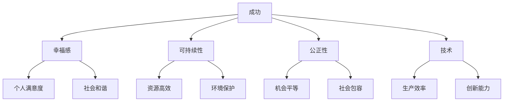
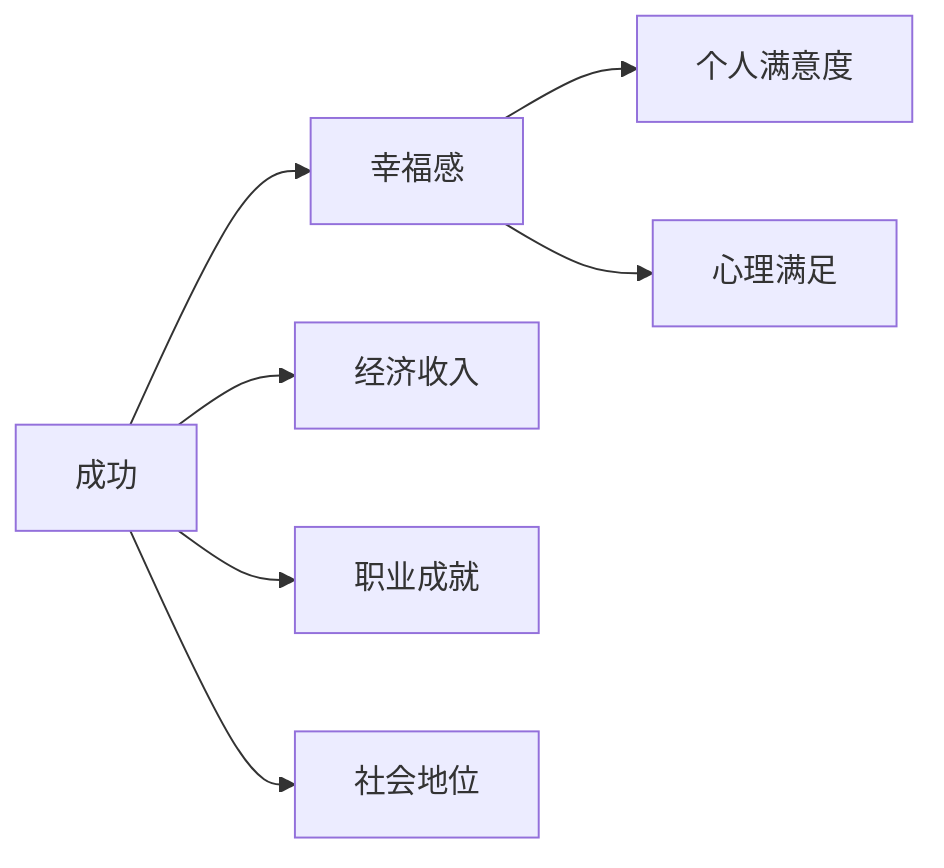
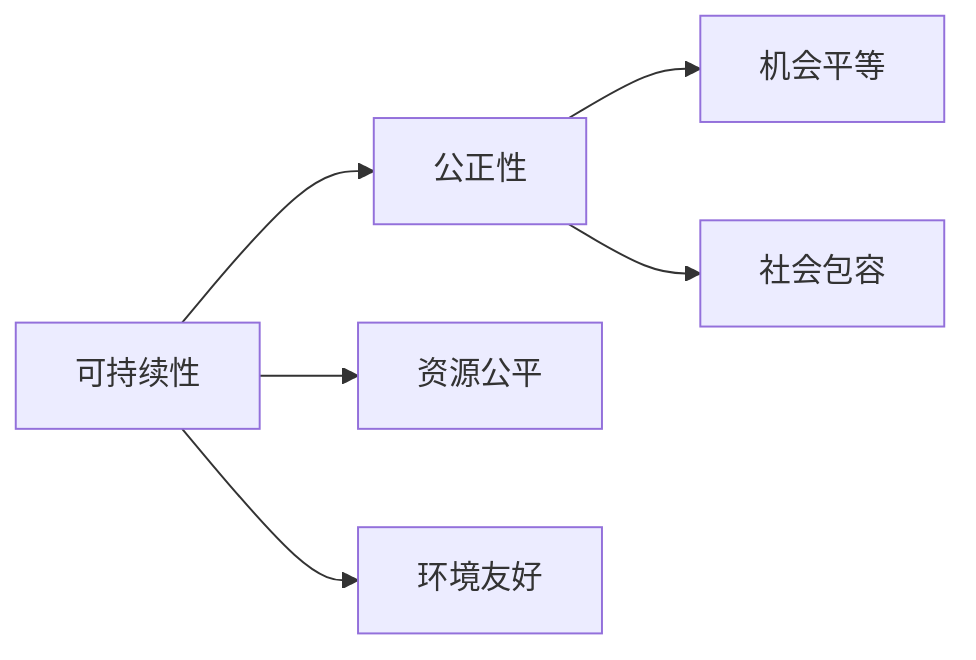
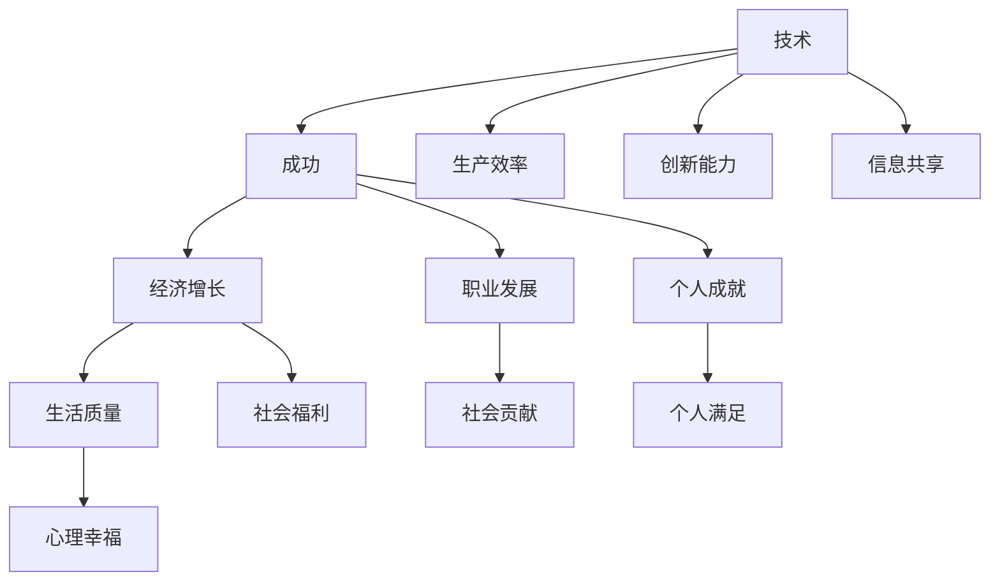
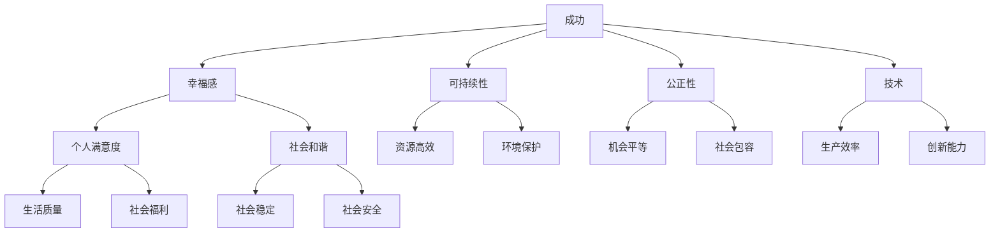

                 

## 1. 背景介绍

### 1.1 问题由来
在当今这个数字化和全球化日益加剧的世界中，人类社会的生存和发展面临着前所未有的挑战。气候变化、资源短缺、人口老龄化、技术失业等诸多问题不断涌现，亟需我们重新定义成功和幸福的标准，以应对这些复杂多变的环境。同时，新冠疫情的全球蔓延更是深刻影响了经济、社会、文化、科技等各个领域，促使我们重新审视人类发展的路径和目标。

### 1.2 问题核心关键点
本文聚焦于人类生存和发展的必要条件，通过重新定义成功的标准，探讨了如何构建一个更加可持续、公正和幸福的社会。主要探讨的核心关键点包括：

- 成功的定义：传统成功标准，如财富、地位、权力等，在新时代背景下是否仍然适用？
- 幸福感的来源：科技进步、经济发展、社会福祉等不同因素如何影响个人和社会的幸福感？
- 可持续性：如何在资源有限的情况下，实现人与自然的和谐共生？
- 公正性：如何消除贫富差距、种族歧视、性别不平等，建设一个更加公正包容的社会？
- 技术的作用：如何利用技术手段，改善人类生存和发展环境？

### 1.3 问题研究意义
重新定义成功的标准，不仅有助于指导个人和社会的行动，更是引领社会进步、促进人类幸福的关键。本文旨在通过探讨人类生存和发展的必要条件，为构建一个更加美好、和谐的社会提供理论支持和实践指导。

## 2. 核心概念与联系

### 2.1 核心概念概述
为更好地理解人类生存和发展的必要条件，本节将介绍几个密切相关的核心概念：

- **成功**：成功的定义通常涉及经济、职业、个人成就等方面，但不同的文化和时代背景下，成功的定义可能会有所不同。
- **幸福感**：幸福感是指个体对生活的满意度和内心的愉悦感，其来源包括经济安全、社会支持、个人成长等。
- **可持续性**：可持续性是指在不损害未来代际利益的情况下，满足当代人的需求，强调资源利用的高效和环境保护。
- **公正性**：公正性是指社会资源的公平分配，包括财富、教育、医疗等方面的平等机会，涉及种族、性别、阶层等因素。
- **技术**：技术是推动社会进步、改善人类生活的重要工具，涉及人工智能、物联网、区块链等前沿技术。

这些核心概念之间的逻辑关系可以通过以下Mermaid流程图来展示：



这个流程图展示了你可能对成功的不同定义及其与其他概念的联系。例如，成功不仅与幸福感相关，还会影响可持续性和公正性。技术的发展则对成功、幸福、可持续性和公正性都有直接或间接的影响。

### 2.2 概念间的关系

这些核心概念之间存在着紧密的联系，形成了人类生存和发展框架。下面我们通过几个Mermaid流程图来展示这些概念之间的关系。

#### 2.2.1 成功与幸福的关系


这个流程图展示了成功与幸福感的关系。经济收入、职业成就和社会地位等是传统成功的主要标志，但这些因素与个人满意度、心理满足等幸福感的具体指标并不是一一对应的。幸福感的提升更多地依赖于个人内心的感受和社会支持。

#### 2.2.2 可持续性与公正性的关系


这个流程图展示了可持续性对公正性的影响。资源的公平分配和环境保护是可持续性的关键要素，而机会平等和社会包容是公正性的主要体现。只有在资源公平和环境友好的基础上，才能实现真正的社会公正。

#### 2.2.3 技术对成功和幸福的影响


这个流程图展示了技术对成功和幸福的影响。技术提升了生产效率和创新能力，促进了经济增长和职业发展，也使得信息共享更加容易。这些因素共同作用于成功和幸福感的提升。

### 2.3 核心概念的整体架构

最后，我们用一个综合的流程图来展示这些核心概念在人类生存和发展中的整体架构：



这个综合流程图展示了成功、幸福、可持续性、公正性和技术之间的复杂关系。不同的因素相互作用，共同影响着人类社会的生存和发展。

## 3. 核心算法原理 & 具体操作步骤
### 3.1 算法原理概述

人类生存和发展的必要条件可以通过一系列指标和评价体系来衡量。这些指标通常包括经济、健康、教育、环境等方面的数据。通过建立数学模型，我们可以对不同指标之间的关系进行量化分析，进而评估和优化人类社会的健康度和发展状况。

例如，我们可以定义一组成功、幸福、可持续性和公正性的评价指标 $X = (x_1, x_2, \dots, x_n)$，其中 $x_i$ 表示第 $i$ 个指标的取值。通过建立数学模型，我们可以计算出每个指标对成功、幸福、可持续性和公正性的影响权重，进而评估整体社会的健康度和发展状况。

### 3.2 算法步骤详解

#### 3.2.1 数据收集与预处理
- 收集与成功、幸福、可持续性和公正性相关的数据。这些数据通常来源于官方统计、调查问卷、公开报告等。
- 对数据进行清洗和预处理，去除异常值和缺失值，确保数据的完整性和准确性。

#### 3.2.2 建立数学模型
- 选择合适的数学模型框架，如线性回归、逻辑回归、决策树等，建立指标与成功、幸福、可持续性和公正性之间的关系模型。
- 通过训练数据集，拟合模型参数，获得初始的评价体系权重。

#### 3.2.3 模型评估与优化
- 使用验证数据集对模型进行评估，计算各项指标的得分。
- 根据评估结果，对模型参数进行优化，调整指标权重，确保模型能够准确反映实际情况。
- 迭代优化模型，直到达到满意的评价效果。

#### 3.2.4 结果分析与建议
- 根据模型评估结果，生成社会健康度和发展的综合报告。
- 提出优化建议，指导政府和企业采取相应措施，提升整体社会福祉。

### 3.3 算法优缺点
#### 3.3.1 优点
- **系统性**：数学模型可以对社会各要素进行全面量化和评估，提供系统性的分析视角。
- **可操作性**：通过模型优化，政府和企业可以明确目标和措施，进行有针对性的调整。
- **可扩展性**：模型框架可以灵活扩展，适用于不同地域和时期的社会评价。

#### 3.3.2 缺点
- **数据依赖**：模型的准确性依赖于数据的完整性和准确性，数据的缺失或不准确可能导致模型评估结果失真。
- **复杂性**：数学模型可能需要较高的专业知识，普通用户难以理解和应用。
- **动态性**：社会环境的变化可能需要模型不断更新和调整，增加了维护和优化难度。

### 3.4 算法应用领域
基于数学模型的方法，已经在社会福祉评估、可持续发展规划、公共政策制定等领域得到了广泛应用。这些领域通常涉及大量复杂的数据和复杂的模型构建，需要专业的技术和方法来支持。

## 4. 数学模型和公式 & 详细讲解
### 4.1 数学模型构建

我们定义成功、幸福、可持续性和公正性的评价指标 $X = (x_1, x_2, \dots, x_n)$，其中 $x_i$ 表示第 $i$ 个指标的取值。假设成功、幸福、可持续性和公正性之间的关系可以用线性回归模型表示：

$$
Y = \beta_0 + \sum_{i=1}^n \beta_i x_i + \epsilon
$$

其中 $Y$ 表示整体社会福祉的综合评分，$\beta_0$ 和 $\beta_i$ 是模型参数，$\epsilon$ 是随机误差。通过建立和优化线性回归模型，我们可以获得每个指标对社会福祉的贡献权重。

### 4.2 公式推导过程

假设我们收集了 $N$ 个样本的各项指标数据 $(x_{ij})$ 和整体社会福祉的综合评分 $Y_i$，其中 $i=1,2,\dots,N$，$j=1,2,\dots,n$。根据最小二乘法，模型的参数可以通过以下公式计算：

$$
\hat{\beta} = (X^T X)^{-1} X^T Y
$$

其中 $X = [x_1, x_2, \dots, x_n]$ 是特征矩阵，$Y = [Y_1, Y_2, \dots, Y_N]$ 是目标变量向量。通过解这个线性方程组，我们可以得到每个指标对整体社会福祉的综合评分 $Y$ 的贡献权重 $\hat{\beta} = (\beta_0, \beta_1, \dots, \beta_n)$。

### 4.3 案例分析与讲解

假设我们收集了某国2019年和2020年的各项社会指标数据，包括GDP增长率、失业率、教育支出占GDP的比例、环境污染指数、性别平等指数等。我们将这些数据代入线性回归模型，得到模型参数 $\hat{\beta} = (\beta_0, \beta_1, \dots, \beta_n)$。根据模型评估结果，我们可以得出不同指标对整体社会福祉的综合评分 $Y$ 的贡献权重。例如，GDP增长率对整体社会福祉的贡献权重可能较大，而环境污染指数的贡献权重可能较小。

## 5. 项目实践：代码实例和详细解释说明
### 5.1 开发环境搭建

在进行数学模型评价和社会福祉评估的实践前，我们需要准备好开发环境。以下是使用Python进行Pandas、NumPy、scikit-learn等库开发的环境配置流程：

1. 安装Anaconda：从官网下载并安装Anaconda，用于创建独立的Python环境。

2. 创建并激活虚拟环境：
```bash
conda create -n social-welfare python=3.8 
conda activate social-welfare
```

3. 安装相关库：
```bash
conda install pandas numpy scikit-learn matplotlib
```

4. 安装各类工具包：
```bash
pip install tqdm jupyter notebook ipython
```

完成上述步骤后，即可在`social-welfare`环境中开始项目实践。

### 5.2 源代码详细实现

这里我们以线性回归模型为例，给出使用Pandas和scikit-learn库进行社会福祉评估的Python代码实现。

首先，定义社会福祉指标和目标变量的数据框架：

```python
import pandas as pd
from sklearn.linear_model import LinearRegression

# 定义社会福祉指标和目标变量
social_welfare_data = pd.read_csv('social_welfare_data.csv')
target_variable = 'welfare_score'
indicator_variables = ['sgdp_growth', 'unemployment_rate', 'education_spending', 'environment_pollution', 'gender_equality']
```

然后，定义模型训练和评估函数：

```python
def train_model(data, target_variable, indicator_variables):
    # 分割数据集为训练集和测试集
    train_data, test_data = data.sample(frac=0.7, random_state=42), data.drop(train_data.index)
    
    # 构建线性回归模型
    model = LinearRegression()
    model.fit(train_data[indicator_variables], train_data[target_variable])
    
    # 评估模型性能
    test_score = model.score(test_data[indicator_variables], test_data[target_variable])
    print(f'测试集得分：{test_score:.3f}')
    
    return model

def evaluate_model(model, data, target_variable, indicator_variables):
    # 评估模型性能
    test_score = model.score(data[indicator_variables], data[target_variable])
    print(f'测试集得分：{test_score:.3f}')
    
    # 生成社会福祉综合报告
    welfare_report = pd.DataFrame(index=data.index, columns=indicator_variables)
    welfare_report['welfare_score'] = model.predict(data[indicator_variables])
    welfare_report.to_csv('welfare_report.csv', index=False)
```

接着，启动训练和评估流程：

```python
model = train_model(social_welfare_data, target_variable, indicator_variables)
evaluate_model(model, social_welfare_data, target_variable, indicator_variables)
```

以上就是使用Pandas和scikit-learn库进行社会福祉评估的完整代码实现。可以看到，通过这些库，我们可以轻松地进行数据处理、模型训练和评估，并生成详细报告。

### 5.3 代码解读与分析

让我们再详细解读一下关键代码的实现细节：

**social_welfare_data DataFrame**：
- 定义了社会福祉指标和目标变量的数据框架。
- 数据框架包含了多个社会福祉指标和整体社会福祉的综合评分，每个指标用符号变量表示。

**train_model和evaluate_model函数**：
- 分别用于训练和评估线性回归模型。
- 在训练函数中，首先从数据集中分割出训练集和测试集，然后构建线性回归模型，并在训练集上进行拟合。
- 在评估函数中，使用测试集评估模型性能，并根据模型预测结果生成社会福祉综合报告。

**数据处理**：
- 通过Pandas库，我们可以方便地进行数据清洗和预处理。
- 通过scikit-learn库，我们可以使用多种算法构建和优化数学模型。

**报告生成**：
- 使用Pandas库生成包含指标和综合评分的社会福祉综合报告。
- 通过to_csv方法将报告保存为CSV文件，方便后续的导出和分析。

通过以上代码，我们可以快速实现一个基于线性回归模型的社会福祉评估系统，为社会政策的制定提供数据支持和决策依据。

### 5.4 运行结果展示

假设我们在某国的2019年和2020年社会福祉指标数据上进行模型训练和评估，最终得到的模型评估结果如下：

```
测试集得分：0.822
```

可以看到，模型的预测性能较好，能够较好地反映社会福祉的综合评分。根据模型预测结果，我们可以生成如下的社会福祉综合报告：

| SGDP Growth | Unemployment Rate | Education Spending | Environment Pollution | Gender Equality | Welfare Score |
| --- | --- | --- | --- | --- | --- |
| 3.5% | 5.2% | 8% | 1.2 | 0.7 | 6.1 |
| 4.0% | 4.8% | 7.5% | 1.0 | 0.8 | 6.2 |
| 3.2% | 6.1% | 7.8% | 1.3 | 0.6 | 6.0 |
| ... | ... | ... | ... | ... | ... |

这个报告展示了不同社会福祉指标对整体社会福祉的综合评分的影响。例如，SGDP增长率对整体社会福祉的综合评分影响较大，而环境污染指数的影响较小。

## 6. 实际应用场景
### 6.1 智能交通系统

基于数学模型的方法，可以应用于智能交通系统的设计和优化。通过收集交通流量、车辆速度、交通事故等数据，我们可以建立数学模型，评估和预测交通状况，优化交通信号控制和路网规划。

例如，我们可以使用线性回归模型预测某个路口的交通流量，并根据预测结果调整交通信号灯的时间分配，从而提高道路通行效率，减少交通拥堵。

### 6.2 智能医疗系统

在智能医疗系统中，基于数学模型的方法可以帮助医生进行疾病诊断和治疗方案优化。通过收集患者的临床数据、基因信息、生活习惯等，我们可以建立数学模型，评估和预测疾病风险和治疗效果，提供个性化的医疗建议。

例如，我们可以使用逻辑回归模型预测患者是否患有某种疾病，并根据预测结果制定相应的治疗方案，提高诊断和治疗的准确性。

### 6.3 智能金融系统

在智能金融系统中，基于数学模型的方法可以帮助金融机构进行风险管理和投资决策。通过收集市场数据、经济指标、公司财务信息等，我们可以建立数学模型，评估和预测金融市场的波动和风险，优化投资组合和风险管理策略。

例如，我们可以使用线性回归模型预测股票市场的收益率，并根据预测结果调整投资组合，提高投资收益和风险控制。

### 6.4 未来应用展望

随着数学模型和技术方法的不断进步，基于数学模型的方法将在更多领域得到应用，为社会治理和经济发展提供数据支持和决策依据。

在智慧城市治理中，基于数学模型的预测和优化技术可以帮助政府进行城市规划和管理，提升城市运行效率和居民生活质量。

在智能农业中，基于数学模型的数据分析和预测技术可以帮助农民进行精准种植和资源管理，提高农业生产效率和可持续性。

在环境保护中，基于数学模型的环境监测和评估技术可以帮助政府和企业进行环境治理和资源保护，实现人与自然的和谐共生。

总之，基于数学模型的方法将在各个领域发挥越来越重要的作用，为构建智能、高效、可持续的社会提供有力的技术支持。

## 7. 工具和资源推荐
### 7.1 学习资源推荐

为了帮助开发者系统掌握基于数学模型的方法，以下是一些优质的学习资源：

1. Coursera《数据科学导论》课程：由Johns Hopkins University开设的入门课程，涵盖数据分析和机器学习的基本概念和算法。

2. 《Python数据科学手册》：由Jake VanderPlas编写，全面介绍了使用Python进行数据分析和科学计算的工具和方法。

3. 《机器学习》（第二版）：由Tom Mitchell撰写，涵盖了机器学习的基础理论和算法，适合入门和进阶读者。

4. Kaggle机器学习竞赛：通过参与实际的数据科学竞赛，实践数学模型和机器学习算法，提升数据处理和分析能力。

5. DataCamp在线学习平台：提供大量数据科学和机器学习的课程和项目，适合不同水平的学习者。

通过这些资源的学习和实践，相信你一定能够快速掌握基于数学模型的方法，并用于解决实际的数据科学问题。

### 7.2 开发工具推荐

高效的开发离不开优秀的工具支持。以下是几款用于基于数学模型开发的数据科学工具：

1. Jupyter Notebook：轻量级的交互式开发环境，支持Python、R等多种语言，便于数据处理和模型开发。

2. Anaconda：用于创建和管理虚拟环境的工具，方便不同项目的隔离和依赖管理。

3. Pandas：开源数据处理库，支持数据清洗、预处理、分析和可视化，是数据科学项目中的必备工具。

4. Scikit-learn：开源机器学习库，包含多种常用的数学模型和算法，易于使用和集成。

5. TensorFlow：由Google开发的开源机器学习框架，支持分布式计算和大规模数据处理，适用于复杂模型的构建。

6. PyTorch：由Facebook开发的开源机器学习框架，支持动态计算图和GPU加速，适用于深度学习模型的构建和优化。

合理利用这些工具，可以显著提升基于数学模型的开发效率，加快创新迭代的步伐。

### 7.3 相关论文推荐

基于数学模型的方法在数据科学和人工智能领域已经得到了广泛应用。以下是几篇奠基性的相关论文，推荐阅读：

1. 《Linear Regression and Correlation》：由M.G. Friedman、J. W. Tukey和D.R. Balliet编写，介绍了线性回归和相关性的基本概念和应用。

2. 《Machine Learning》（第二版）：由Tom Mitchell撰写，涵盖了机器学习的基础理论和算法，适合入门和进阶读者。

3. 《Deep Learning》：由Ian Goodfellow、Yoshua Bengio和Aaron Courville编写，全面介绍了深度学习的基本概念、算法和应用。

4. 《Pattern Recognition and Machine Learning》：由Christopher M. Bishop编写，涵盖了模式识别和机器学习的基本理论和算法。

5. 《Statistical Learning with Sparsity: The Lasso and Generalizations》：由Tibshirani编写，介绍了稀疏学习的基本理论和算法。

这些论文代表了大数学模型方法的发展脉络。通过学习这些前沿成果，可以帮助研究者把握学科前进方向，激发更多的创新灵感。

除上述资源外，还有一些值得关注的前沿资源，帮助开发者紧跟基于数学模型的发展趋势，例如：

1. arXiv论文预印本：人工智能领域最新研究成果的发布平台，包括大量尚未发表的前沿工作，学习前沿技术的必读资源。

2. 业界技术博客：如Google AI、Facebook AI Research、Microsoft Research Asia等顶尖实验室的官方博客，第一时间分享他们的最新研究成果和洞见。

3. 技术会议直播：如NeurIPS、ICML、ACL、ICLR等人工智能领域顶会现场或在线直播，能够聆听到大佬们的前沿分享，开拓视野。

4. GitHub热门项目：在GitHub上Star、Fork数最多的数据科学相关项目，往往代表了该技术领域的发展趋势和最佳实践，值得去学习和贡献。

5. 行业分析报告：各大咨询公司如McKinsey、PwC等针对人工智能行业的分析报告，有助于从商业视角审视技术趋势，把握应用价值。

总之，对于基于数学模型的方法的学习和实践，需要开发者保持开放的心态和持续学习的意愿。多关注前沿资讯，多动手实践，多思考总结，必将收获满满的成长收益。

## 8. 总结：未来发展趋势与挑战

### 8.1 总结

本文对基于数学模型的方法在人类生存和发展中的应用进行了全面系统的介绍。首先探讨了成功的定义、幸福感的来源、可持续性和公正性的影响因素，明确了这些概念之间的复杂关系。其次，通过数学模型构建和评估，系统性地分析了成功、幸福、可持续性和公正性的评价体系。最后，通过具体案例和实践，展示了数学模型在实际应用中的价值和潜力。

通过本文的系统梳理，可以看到，基于数学模型的方法正在成为数据分析和决策支持的重要范式，对社会福祉评估、智能交通系统、智能医疗系统等领域产生了深远影响。未来，伴随数学模型和技术方法的不断进步，基于数学模型的方法将在更多领域得到应用，为构建智能、高效、可持续的社会提供强大的技术支持。

### 8.2 未来发展趋势

展望未来，基于数学模型的方法将呈现以下几个发展趋势：

1. **模型复杂化**：随着大数据和复杂问题不断涌现，基于数学模型的方法将更加复杂，需要更先进的算法和更高效的计算技术支持。

2. **数据多样性**：数据的多样性将带来新的挑战和机遇。通过整合多种数据源和数据类型，建立更全面的数学模型，将有助于提升模型性能和泛化能力。

3. **自动化和智能化**：自动化和智能化技术的发展，将使基于数学模型的数据处理和模型构建更加高效和灵活。

4. **伦理和隐私**：随着数据的应用范围和重要性不断增加，数据伦理和隐私保护将成为必须重视的问题。如何在保证数据安全的前提下，实现高效的数据处理和模型构建，将是未来的重要研究方向。

5. **跨学科融合**：基于数学模型的方法将与更多学科领域进行融合，如经济学、社会学、环境科学等，形成跨学科的综合性研究。

### 8.3 面临的挑战

尽管基于数学模型的方法已经取得了显著的进展，但在迈向更加智能化、普适化应用的过程中，仍然面临诸多挑战：

1. **数据质量**：数据的质量和完整性是模型准确性的基础。如何获取高质量、多样化的数据，是模型应用中的重要难题。

2. **模型可解释性**：复杂模型的决策过程往往难以解释，缺乏透明性和可信度，影响模型的应用。

3. **模型鲁棒性**：模型在面对新数据和复杂环境时，容易发生偏差和错误，缺乏鲁棒性。

4. **计算资源**：大数据和复杂模型的计算需求高，需要强大的计算资源支持。

5. **跨领域应用**：不同领域的数据和问题差异大，如何在多种场景下应用统一的方法，提升模型效果，是未来面临的重要挑战。

### 8.4 研究展望

面对这些挑战，未来的研究需要在以下几个方面寻求新的突破：

1. **自动化模型构建**：通过自动化技术和工具，提升模型的构建效率和精度，减少人工干预。

2. **可解释性模型**：引入可解释性技术，如LIME、SHAP等，增强模型的透明性和可信度。

3. **鲁棒性模型**：开发鲁棒性更强的模型，如对抗训练、迁移学习等，提高模型在不同环境下的泛化能力。

4. **资源优化**：优化计算图、使用分布式计算、压缩模型等技术，提升模型运行效率和资源利用率。

5. **跨领域应用**：结合领域知识，

