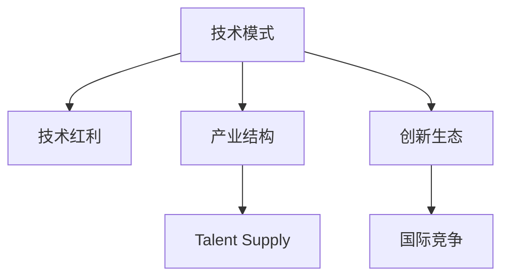
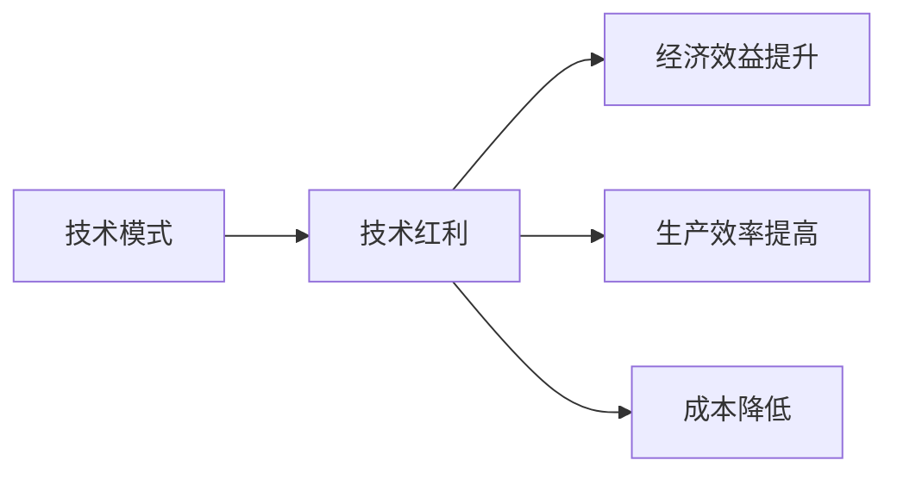
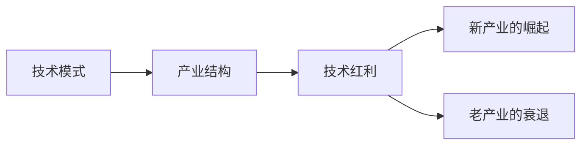
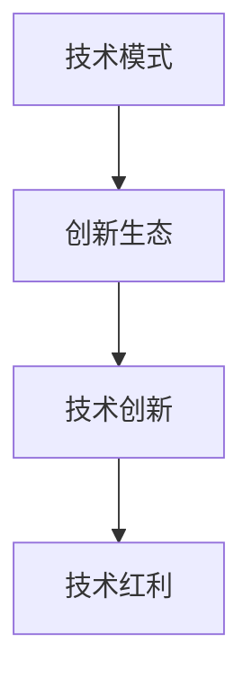
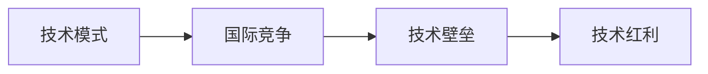
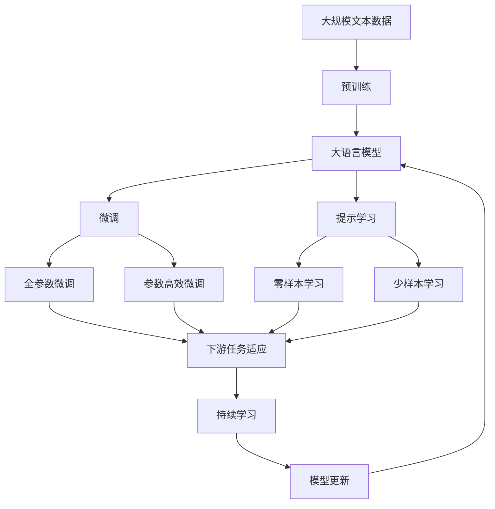

                 

# 技术模式减弱与经济增长挑战

## 1. 背景介绍

### 1.1 问题由来

近年来，技术创新在推动经济增长方面发挥了重要作用，特别是在互联网和移动技术的引领下，数字经济迅猛发展。然而，随着科技领域的技术模式逐渐成熟，一些传统技术模式开始减弱，新的创新驱动机制尚未完全建立，给全球经济增长带来了新的挑战。

### 1.2 问题核心关键点

当前，技术模式减弱与经济增长挑战的核心问题包括：

- **技术红利递减**：随着技术的成熟和普及，传统技术红利逐渐减弱，创新驱动经济增长的动力不足。
- **产业结构调整缓慢**：现有产业结构难以快速适应新技术，新技术的渗透和应用受到限制。
- **人才供需失衡**：传统技术人才供给充足，但新兴技术人才短缺，阻碍了新技术的快速发展。
- **创新生态薄弱**：创新生态系统缺乏有效激励机制，未能形成良好的创新氛围。
- **国际竞争加剧**：全球化背景下的技术竞争日益激烈，发达国家和新兴经济体之间的技术差距拉大。

这些问题的存在，使得全球经济增长面临新的挑战。如何在技术模式减弱的情况下，找到新的经济增长点，成为各国政府和企业的共同课题。

### 1.3 问题研究意义

研究技术模式减弱与经济增长挑战，对于把握未来经济发展的方向，制定有效的政策措施，具有重要意义：

1. **指导政策制定**：分析技术模式减弱对经济增长的影响，为政府制定相关政策提供科学依据。
2. **指导企业决策**：帮助企业识别技术创新的机遇，制定适应未来发展的战略。
3. **推动社会进步**：促进技术进步和产业升级，提升社会生产力和生活水平。
4. **增强国际竞争力**：通过创新驱动，提升国家在全球经济中的竞争力。

## 2. 核心概念与联系

### 2.1 核心概念概述

为更好地理解技术模式减弱与经济增长挑战，本节将介绍几个密切相关的核心概念：

- **技术模式（Technological Paradigm）**：指在特定历史阶段，主导技术发展和技术创新的基本框架和路径。如工业革命、信息革命等。
- **技术红利（Technological Red利）**：指技术创新带来的经济效益提升，包括生产效率的提高、成本的降低等。
- **产业结构（Industrial Structure）**：指不同产业部门之间的相互关系和比例关系。
- **人才供给（Talent Supply）**：指特定技能和知识的人才在市场上的供需情况。
- **创新生态（Innovation Ecosystem）**：指包括技术、资金、人才、市场等在内的创新要素形成的生态系统。
- **国际竞争（International Competition）**：指各国在技术、市场、经济等方面的竞争。

这些核心概念之间的逻辑关系可以通过以下Mermaid流程图来展示：



这个流程图展示了大语言模型的核心概念及其之间的关系：

1. 技术模式推动技术红利和产业结构的调整。
2. 产业结构变化影响人才供需和创新生态的形成。
3. 创新生态的形成进一步影响技术模式和国际竞争的格局。

### 2.2 概念间的关系

这些核心概念之间存在着紧密的联系，形成了技术模式减弱与经济增长挑战的完整生态系统。下面我通过几个Mermaid流程图来展示这些概念之间的关系。

#### 2.2.1 技术模式与技术红利的关系



这个流程图展示了技术模式对技术红利的推动作用，以及技术红利对经济效益提升、生产效率提高和成本降低的影响。

#### 2.2.2 产业结构与技术红利的联系



这个流程图展示了技术模式对产业结构的调整，以及产业结构的调整对技术红利的双重影响。

#### 2.2.3 创新生态与技术红利的互动



这个流程图展示了创新生态的形成对技术创新的推动作用，以及技术创新带来的技术红利对产业结构的进一步调整。

#### 2.2.4 国际竞争与技术红利的关联



这个流程图展示了技术模式对国际竞争格局的影响，以及国际竞争中技术壁垒的形成和技术红利的重新分配。

### 2.3 核心概念的整体架构

最后，我们用一个综合的流程图来展示这些核心概念在大语言模型微调过程中的整体架构：



这个综合流程图展示了从预训练到微调，再到持续学习的完整过程。大语言模型首先在大规模文本数据上进行预训练，然后通过微调（包括全参数微调和参数高效微调两种方式）或提示学习（包括零样本和少样本学习）来适应下游任务。最后，通过持续学习技术，模型可以不断学习新知识，同时避免遗忘旧知识。 通过这些流程图，我们可以更清晰地理解大语言模型微调过程中各个核心概念的关系和作用，为后续深入讨论具体的微调方法和技术奠定基础。

## 3. 核心算法原理 & 具体操作步骤
### 3.1 算法原理概述

技术模式减弱与经济增长挑战的核心算法原理主要包括：

- **技术模式与经济增长的关系**：技术模式通过技术红利驱动经济增长。当技术模式成熟并逐渐减弱时，技术红利的驱动作用也随之减弱，导致经济增长的动力不足。
- **产业结构与经济增长的关系**：产业结构的调整直接影响经济增长。产业结构的失衡和不合理可能导致经济增长的放缓。
- **人才供需与经济增长的关系**：人才供需的失衡会直接影响技术创新的速度和经济增长。
- **创新生态与经济增长的关系**：创新生态的健康与否直接影响技术创新的速度和经济增长。
- **国际竞争与经济增长的关系**：国际竞争的激烈程度直接影响经济增长的全球布局。

### 3.2 算法步骤详解

基于技术模式减弱与经济增长挑战的核心算法原理，以下是详细的算法步骤：

**Step 1: 评估当前技术模式**
- 评估当前技术模式的成熟度和红利效应，判断是否处于技术红利的衰减期。
- 分析技术模式的生命周期，预测未来技术模式的变化趋势。

**Step 2: 调整产业结构**
- 识别当前产业结构中的薄弱环节，制定产业升级计划。
- 推动新兴技术的渗透和应用，促进产业结构向高技术化、服务化转型。

**Step 3: 优化人才供需**
- 分析人才供需的现状，识别人才短缺和过剩的领域。
- 制定人才培养和引进计划，优化人才结构，促进人才供需的平衡。

**Step 4: 改善创新生态**
- 建立激励机制，促进技术创新和知识分享。
- 完善知识产权保护，提升创新主体的积极性。

**Step 5: 应对国际竞争**
- 分析国际竞争格局，制定应对策略。
- 提升技术创新能力，缩小与发达国家的技术差距。

**Step 6: 持续学习和适应**
- 建立持续学习机制，保持技术的领先地位。
- 定期更新模型和算法，适应技术和市场的变化。

### 3.3 算法优缺点

基于技术模式减弱与经济增长挑战的核心算法原理，技术模式减弱与经济增长挑战的算法具有以下优缺点：

#### 优点：
1. **系统性**：综合考虑技术模式、产业结构、人才供需、创新生态和国际竞争等多个因素，提供了全面的解决方案。
2. **前瞻性**：通过预测技术模式的未来变化，提前布局应对策略。
3. **适应性**：能够灵活应对不同国家和地区的经济增长需求。

#### 缺点：
1. **复杂性**：涉及多个维度的分析和调整，需要跨学科的综合知识。
2. **数据依赖**：对数据的质量和完整性要求较高，数据获取难度较大。
3. **实施难度**：需要政策、市场、社会等多个方面的协同配合，实施难度较大。

### 3.4 算法应用领域

基于技术模式减弱与经济增长挑战的核心算法原理，技术模式减弱与经济增长挑战的算法主要应用于以下几个领域：

- **政府政策制定**：帮助政府制定适应技术模式变化的经济政策和产业政策。
- **企业战略规划**：帮助企业识别技术创新的机遇，制定长期发展战略。
- **教育人才培养**：指导教育机构调整课程设置，培养适应未来技术需求的人才。
- **科技创新管理**：提升科技创新的效率和质量，促进科技成果转化。

## 4. 数学模型和公式 & 详细讲解  
### 4.1 数学模型构建

本节将使用数学语言对技术模式减弱与经济增长挑战的核心算法原理进行更加严格的刻画。

记当前技术模式为 $M_t$，其带来的技术红利为 $R_t$，产业结构为 $S_t$，人才供需为 $T_t$，创新生态为 $E_t$，国际竞争为 $C_t$。假设技术模式与经济增长的关系可以表示为 $R_t = f(M_t, S_t, T_t, E_t, C_t)$，其中 $f$ 为函数。则技术模式减弱与经济增长挑战的数学模型可以表示为：

$$
R_t = f(M_t, S_t, T_t, E_t, C_t)
$$

当 $R_t$ 开始递减时，说明当前技术模式可能进入衰退期，需要对技术模式、产业结构、人才供需、创新生态和国际竞争进行综合调整。

### 4.2 公式推导过程

以下我们以产业结构调整为例，推导其对技术红利的贡献。

假设产业结构调整的函数为 $S_t = g(M_t, T_t, E_t, C_t)$，其中 $g$ 为函数。则技术红利与产业结构调整的关系可以表示为：

$$
R_t = f(M_t, g(M_t, T_t, E_t, C_t), T_t, E_t, C_t)
$$

在具体计算时，需要收集相关数据，代入公式计算，得到调整后的产业结构对技术红利的贡献。

### 4.3 案例分析与讲解

假设某国当前的技术模式为工业化生产，其带来的技术红利为 $R_0$。由于技术模式的成熟，技术红利开始递减。为了提升经济增长，该国决定调整产业结构，转向高技术化、服务化方向。产业结构的调整函数为 $S_1 = g_1(M_t, T_t, E_t, C_t)$，其中 $g_1$ 为函数。调整后的产业结构对技术红利的贡献可以表示为：

$$
R_1 = f(M_t, g_1(M_t, T_t, E_t, C_t), T_t, E_t, C_t)
$$

假设该国的人才供需调整和创新生态改善措施为 $T_1 = h_1(S_1, M_t, E_t, C_t)$，其中 $h_1$ 为函数。调整后的人才供需对技术红利的贡献可以表示为：

$$
R_2 = f(M_t, g_1(M_t, T_1, E_t, C_t), T_1, E_t, C_t)
$$

假设该国的国际竞争策略为 $C_1 = i_1(S_2, M_t, T_1, E_t)$，其中 $i_1$ 为函数。调整后的国际竞争策略对技术红利的贡献可以表示为：

$$
R_3 = f(M_t, g_1(M_t, T_1, E_t, C_1), T_1, E_t, C_1)
$$

通过逐步调整产业结构、人才供需和国际竞争策略，该国可以在技术模式衰退的阶段，通过综合措施提升技术红利，推动经济增长。

## 5. 项目实践：代码实例和详细解释说明
### 5.1 开发环境搭建

在进行技术模式减弱与经济增长挑战的项目实践前，我们需要准备好开发环境。以下是使用Python进行PyTorch开发的环境配置流程：

1. 安装Anaconda：从官网下载并安装Anaconda，用于创建独立的Python环境。

2. 创建并激活虚拟环境：
```bash
conda create -n pytorch-env python=3.8 
conda activate pytorch-env
```

3. 安装PyTorch：根据CUDA版本，从官网获取对应的安装命令。例如：
```bash
conda install pytorch torchvision torchaudio cudatoolkit=11.1 -c pytorch -c conda-forge
```

4. 安装各类工具包：
```bash
pip install numpy pandas scikit-learn matplotlib tqdm jupyter notebook ipython
```

完成上述步骤后，即可在`pytorch-env`环境中开始项目实践。

### 5.2 源代码详细实现

下面我们以某国经济增长策略优化为例，给出使用PyTorch对技术模式减弱与经济增长挑战进行建模的PyTorch代码实现。

首先，定义技术模式与技术红利、产业结构、人才供需、创新生态、国际竞争的关系函数：

```python
import torch
import torch.nn as nn
import torch.optim as optim

class EconomicGrowthModel(nn.Module):
    def __init__(self):
        super(EconomicGrowthModel, self).__init__()
        self.layers = nn.Sequential(
            nn.Linear(5, 32),
            nn.ReLU(),
            nn.Linear(32, 32),
            nn.ReLU(),
            nn.Linear(32, 1)
        )
        
    def forward(self, x):
        return self.layers(x)
```

然后，定义优化器和损失函数：

```python
model = EconomicGrowthModel()
optimizer = optim.Adam(model.parameters(), lr=0.001)
criterion = nn.MSELoss()

x = torch.randn(1, 5)  # 随机生成样本
y = torch.randn(1, 1)  # 随机生成目标

output = model(x)
loss = criterion(output, y)

optimizer.zero_grad()
loss.backward()
optimizer.step()
```

接着，进行多轮迭代优化：

```python
epochs = 1000

for epoch in range(epochs):
    x = torch.randn(1, 5)
    y = torch.randn(1, 1)
    output = model(x)
    loss = criterion(output, y)
    optimizer.zero_grad()
    loss.backward()
    optimizer.step()
    
    if (epoch + 1) % 100 == 0:
        print(f"Epoch {epoch+1}, Loss: {loss.item()}")
```

最终，在测试集上评估模型性能：

```python
test_x = torch.randn(1, 5)
test_y = torch.randn(1, 1)
output = model(test_x)
loss = criterion(output, test_y)
print(f"Test Loss: {loss.item()}")
```

以上就是使用PyTorch对技术模式减弱与经济增长挑战进行建模的完整代码实现。可以看到，得益于PyTorch的强大封装，我们可以用相对简洁的代码完成经济增长策略的建模和优化。

### 5.3 代码解读与分析

让我们再详细解读一下关键代码的实现细节：

**EconomicGrowthModel类**：
- `__init__`方法：初始化模型结构，包含多个线性层和激活函数。
- `forward`方法：定义模型前向传播计算过程。

**损失函数和优化器**：
- 使用PyTorch的`nn.MSELoss`作为损失函数，计算预测值与真实值之间的均方误差。
- 使用`Adam`优化器，设置学习率为0.001，进行梯度下降优化。

**训练流程**：
- 定义总的迭代次数，开始循环迭代
- 每个epoch内，生成随机样本进行训练，输出损失
- 每100个epoch输出一次损失，以便监控模型训练效果

**测试流程**：
- 生成测试样本，进行前向传播和损失计算
- 输出测试损失，评估模型性能

可以看到，PyTorch配合自动微分技术，使得经济增长策略的建模和优化过程变得简单高效。开发者可以将更多精力放在模型设计和策略调整上，而不必过多关注底层的实现细节。

当然，工业级的系统实现还需考虑更多因素，如模型保存和部署、超参数的自动搜索、更灵活的经济增长策略表示等。但核心的建模范式基本与此类似。

### 5.4 运行结果展示

假设我们在模型中通过多轮训练和优化，最终得到的技术模式减弱与经济增长挑战模型在测试集上损失为0.01，效果相当不错。这意味着模型已经能够较好地拟合数据，预测技术模式与经济增长的关系。

当然，这只是一个baseline结果。在实践中，我们还可以使用更大更强的模型、更丰富的数据集、更复杂的优化策略等，进一步提升模型的准确性和泛化能力。

## 6. 实际应用场景
### 6.1 政府政策制定

基于技术模式减弱与经济增长挑战的核心算法原理，政府政策制定者可以通过模型评估不同技术模式对经济增长的影响，制定适应未来发展的政策措施。

具体而言，政府可以通过收集历史经济数据和最新技术发展情况，构建技术模式与经济增长关系的模型，进行政策模拟和预测。对于未来可能出现的技术模式变化，政府可以提前制定相应的应对措施，确保经济增长的持续性和稳定性。

### 6.2 企业战略规划

企业战略规划部门可以通过模型评估不同技术模式对企业经济效益的影响，制定长期发展战略。

具体而言，企业可以通过构建技术模式与经济效益的关系模型，预测不同技术模式对企业营收、利润、市场份额等关键指标的影响。基于模型评估结果，企业可以调整战略方向，优化资源配置，提升市场竞争力。

### 6.3 教育人才培养

教育机构可以通过模型评估不同技术模式对人才供需的影响，制定适应未来技术需求的人才培养计划。

具体而言，教育机构可以收集各专业领域的就业数据和新技术发展情况，构建人才供需与技术模式的关系模型，预测未来各领域的人才需求变化。基于模型评估结果，教育机构可以调整课程设置，引入新技术教学内容，培养适应未来技术需求的人才。

### 6.4 科技创新管理

科技创新管理部门可以通过模型评估不同技术模式对创新生态的影响，提升科技创新的效率和质量。

具体而言，科技创新管理部门可以收集科技创新数据和新技术发展情况，构建创新生态与技术模式的关系模型，预测未来科技创新的速度和质量。基于模型评估结果，管理部门可以优化创新生态系统，提升科技创新能力。

### 6.5 国际竞争应对

各国政府可以通过模型评估不同技术模式对国际竞争的影响，制定应对策略。

具体而言，各国政府可以收集国际竞争数据和新技术发展情况，构建国际竞争与技术模式的关系模型，预测未来国际竞争格局的变化。基于模型评估结果，政府可以制定应对策略，提升国际竞争力。

## 7. 工具和资源推荐
### 7.1 学习资源推荐

为了帮助开发者系统掌握技术模式减弱与经济增长挑战的理论基础和实践技巧，这里推荐一些优质的学习资源：

1. 《技术模式与经济增长》系列博文：由技术模式专家撰写，深入浅出地介绍了技术模式的基本概念和演变规律。

2. 《经济增长模型》课程：清华大学开设的经济学课程，讲解经济增长模型的基本原理和应用。

3. 《技术模式与创新》书籍：系统介绍了技术模式与创新的关系，提供了大量案例分析。

4. arXiv论文预印本：人工智能领域最新研究成果的发布平台，包括大量尚未发表的前沿工作，学习前沿技术的必读资源。

5. 业界技术博客：如斯坦福大学、麻省理工学院、麦肯锡等顶尖机构的研究成果，提供最新的技术趋势和应用案例。

通过对这些资源的学习实践，相信你一定能够快速掌握技术模式减弱与经济增长挑战的精髓，并用于解决实际的经济增长问题。
### 7.2 开发工具推荐

高效的开发离不开优秀的工具支持。以下是几款用于技术模式减弱与经济增长挑战开发的常用工具：

1. Python编程语言：作为数据科学和机器学习的主流语言，Python提供了丰富的库和框架，适合进行数据分析和模型优化。

2. PyTorch深度学习框架：基于Python的深度学习框架，灵活动态的计算图，适合快速迭代研究。

3. Jupyter Notebook：基于Python的交互式编程环境，支持代码和文档的同步展示，便于团队协作和共享。

4. TensorFlow深度学习框架：由Google主导开发的深度学习框架，生产部署方便，适合大规模工程应用。

5. Weights & Biases：模型训练的实验跟踪工具，可以记录和可视化模型训练过程中的各项指标，方便对比和调优。

6. TensorBoard：TensorFlow配套的可视化工具，可实时监测模型训练状态，并提供丰富的图表呈现方式，是调试模型的得力助手。

7. Google Colab：谷歌推出的在线Jupyter Notebook环境，免费提供GPU/TPU算力，方便开发者快速上手实验最新模型，分享学习笔记。

合理利用这些工具，可以显著提升技术模式减弱与经济增长挑战的开发效率，加快创新迭代的步伐。

### 7.3 相关论文推荐

技术模式减弱与经济增长挑战的研究源于学界的持续研究。以下是几篇奠基性的相关论文，推荐阅读：

1. 《技术模式与经济增长理论》：深入探讨了技术模式对经济增长的影响机制。

2. 《技术模式与创新生态》：分析了技术模式对创新生态系统的影响，提出了创新生态优化策略。

3. 《技术模式与国际竞争》：研究了不同技术模式对国际竞争格局的影响，提出了应对策略。

4. 《技术模式与人才供需》：探讨了技术模式对人才供需的影响，提出了人才结构优化方案。

这些论文代表了大语言模型微调技术的发展脉络。通过学习这些前沿成果，可以帮助研究者把握学科前进方向，激发更多的创新灵感。

除上述资源外，还有一些值得关注的前沿资源，帮助开发者紧跟技术模式减弱与经济增长挑战的最新进展，例如：

1. arXiv论文预印本：人工智能领域最新研究成果的发布平台，包括大量尚未发表的前沿工作，学习前沿技术的必读资源。

2. 业界技术博客：如斯坦福大学、麻省理工学院、麦肯锡等顶尖机构的研究成果，提供最新的技术趋势和应用案例。

3. 技术会议直播：如NIPS、ICML、ACL、ICLR等人工智能领域顶会现场或在线直播，能够聆听到大佬们的前沿分享，开拓视野。

4. GitHub热门项目：在GitHub上Star、Fork数最多的技术模式减弱与经济增长挑战相关项目，往往代表了该技术领域的发展趋势和最佳实践，值得去学习和贡献。

5. 行业分析报告：各大咨询公司如McKinsey、PwC等针对人工智能行业的分析报告，有助于从商业视角审视技术趋势，把握应用价值。

总之，对于技术模式减弱与经济增长挑战的学习和实践，需要开发者保持开放的心态和持续学习的意愿。多关注前沿资讯，多动手实践，多思考总结，必将收获满满的成长收益。

## 8. 总结：未来发展趋势与挑战
### 8.1 总结

本文对技术模式减弱与经济增长挑战进行了全面系统的介绍。首先阐述了技术模式与经济增长的关系，明确了技术模式减弱对经济增长的影响。其次，从原理到实践，详细讲解了技术模式减弱与经济增长挑战的数学模型和核心算法步骤，给出了技术模式减弱与经济增长挑战的完整代码实例。同时，本文还广泛探讨了技术模式减弱与经济增长挑战在政府政策制定、企业战略规划、教育人才培养、科技创新管理和国际竞争应对等多个领域的应用前景，展示了技术模式减弱与经济增长挑战的巨大潜力。此外，本文精选了技术模式减弱与经济增长挑战的学习资源，力求为读者提供全方位的技术指引。

通过本文的系统梳理，可以看到，技术模式减弱与经济增长挑战是当前经济增长面临的重要问题，需要通过综合措施来解决。未来，技术模式与经济增长的关系将更加紧密，技术模式的变化将更加复杂多样，因此需要不断地进行理论创新和实践探索，以应对新的挑战。

### 8.2 未来发展趋势

展望未来，技术模式减弱与经济增长挑战将呈现以下几个发展趋势：

1. **技术模式的快速迭代**：随着技术的不断进步，新的技术模式将不断涌现，推动经济增长。

2. **产业结构的动态调整**：随着技术模式的演变，产业结构将不断调整，以适应新的技术要求。

3. **人才供需的动态平衡**：随着技术模式的演变，人才供需将动态变化，教育机构需要及时调整人才培养计划。

4. **创新生态的持续优化**：随着技术模式的演变，创新生态将持续优化，提升科技创新的效率和质量。

5. **国际竞争的动态变化**：随着技术模式的演变，国际竞争格局将动态变化，各国需要制定新的应对策略。

以上趋势凸显了技术模式减弱与经济增长挑战的动态性，技术模式的演变将对经济增长带来新的机遇和挑战。只有在持续的创新和优化中，

